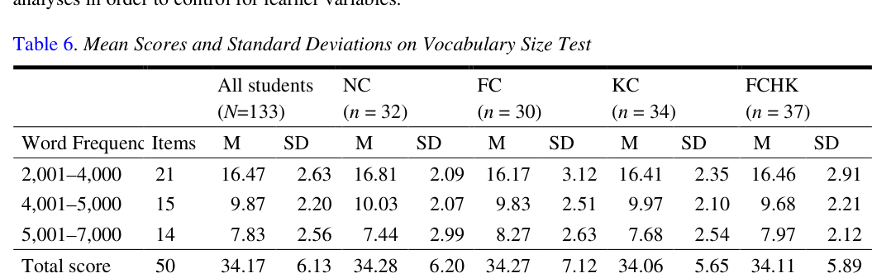
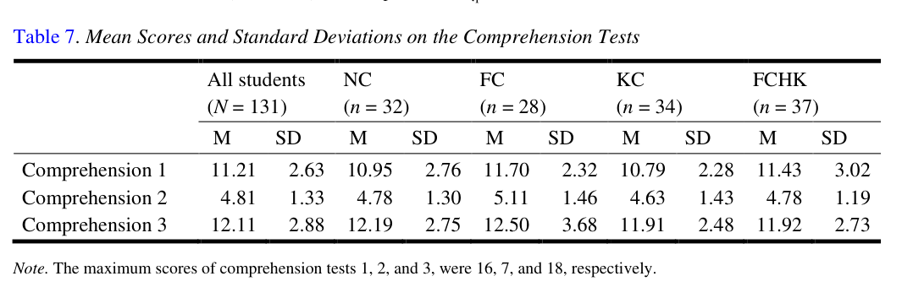
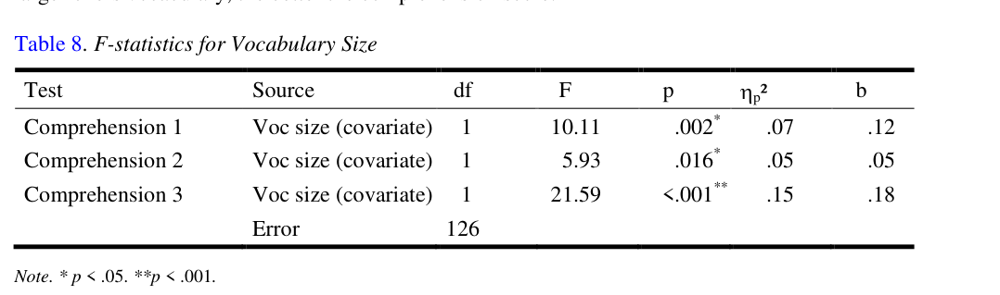

# Bài 07 - Kết quả RQ1: Captioning và comprehension

## Mục tiêu

- Đọc kết quả comprehension theo nhóm.
- Hiểu kết luận thống kê về type of captioning.
- Nhận ra vai trò của vocabulary size.

## 1. Vocabulary size của các nhóm

Bốn nhóm không khác biệt đáng kể về vocabulary size trước thí nghiệm: F(3,129)=0.01, p=.998. Điều này giúp giảm lo ngại rằng một nhóm vốn giỏi hơn nhóm khác ngay từ đầu.

## 2. Type of captioning không tạo khác biệt comprehension

MANCOVA cho RQ1 cho thấy **type of captioning không có ảnh hưởng có ý nghĩa thống kê** lên các comprehension scores: Wilks’s lambda, F(9,301.93)=0.40, p=.935, ηp²=.01.

Điều này trái với giả thuyết ban đầu rằng các nhóm caption sẽ hơn NC.

## 3. Vocabulary size lại có liên hệ rõ

Vocabulary size có liên hệ đáng kể với comprehension scores, với effect size lớn ở phân tích đa biến: ηp²=.18. Các b-values dương cho thấy vốn từ lớn hơn đi cùng điểm comprehension cao hơn.

## 4. Cách diễn giải đúng

Không nên biến kết quả này thành câu “captions vô dụng cho comprehension”. Paper chỉ cho thấy **trong thiết kế, clip và phép đo cụ thể này**, bốn điều kiện không khác nhau đáng kể ở comprehension test.

Phần Discussion sau đó đưa ra nhiều lý do khả dĩ cho kết quả này.

## Tự kiểm tra

1. p=.935 nói gì về khác biệt giữa các điều kiện ở RQ1?
2. Vì sao việc các nhóm có vocabulary size tương đương trước thí nghiệm là quan trọng?
3. Kết quả nào mạnh hơn: type of captioning hay vocabulary size đối với comprehension?

**Nguồn:** PDF trang 11–12, Results → Vocabulary Size Test, Research Question 1.
