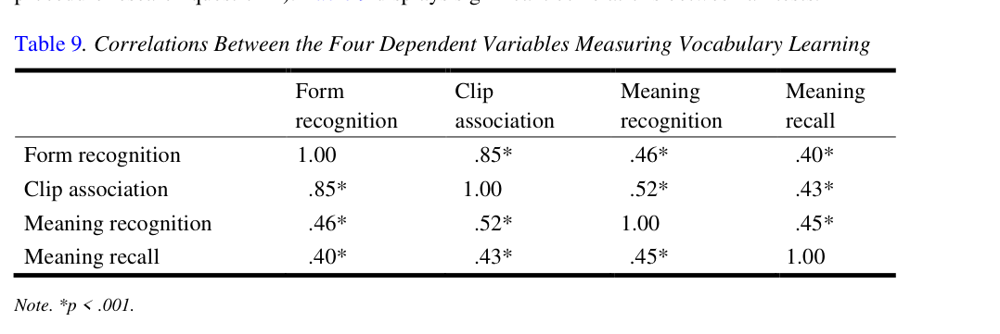
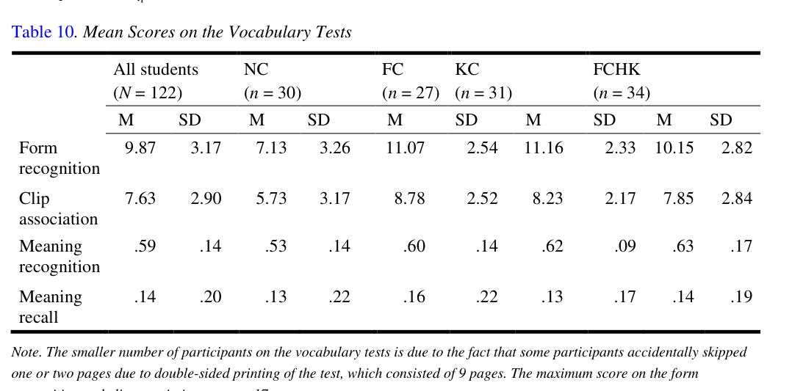
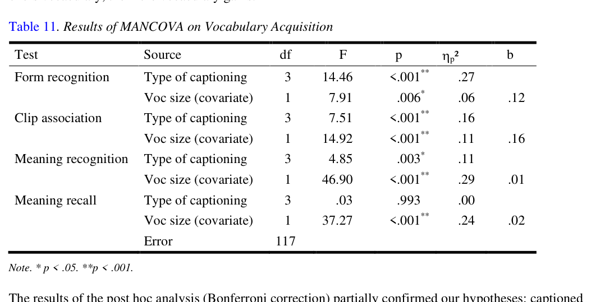

# Bài 08 - Kết quả RQ2: Captioning và vocabulary learning

## Mục tiêu

- Phân biệt kết quả của bốn thành phần vocabulary knowledge.
- Hiểu captioning mạnh ở đâu và yếu ở đâu.
- Hiểu vai trò tăng dần của vocabulary size khi nhiệm vụ khó hơn.

## 1. Các vocabulary measures có liên hệ với nhau

Bốn biến đều tương quan có ý nghĩa với nhau. Mạnh nhất là **form recognition ↔ clip association (r=.85)**.

## 2. Điểm trung bình

Pattern nổi bật:

- Captioned groups cao hơn NC rõ ở form recognition.
- Clip association có pattern tương tự.
- Meaning recognition khác biệt nhỏ hơn.
- Meaning recall thấp ở tất cả nhóm.

## 3. MANCOVA và post hoc

Type of captioning ảnh hưởng có ý nghĩa đến:

- **Form recognition:** ηp²=.27
- **Clip association:** ηp²=.16
- **Meaning recognition:** ηp²=.11

Nhưng không ảnh hưởng đến:

- **Meaning recall:** p=.993, ηp²=.00

Post hoc cho thấy:

- FC, KC, FCHK đều **hơn NC** ở form recognition và clip association.
- Không có khác biệt đáng kể giữa ba nhóm caption ở hai phép đo này.
- Ở meaning recognition, chỉ **KC và FCHK** hơn NC.
- Ở meaning recall, không có khác biệt đáng kể giữa các nhóm.

## 4. Salience không tạo lợi thế nhất quán

Một điểm then chốt: KC/FCHK không vượt FC ở form recognition và clip association. Nói cách khác, **có chữ trên màn hình** quan trọng hơn việc từ được làm nổi bật, ít nhất với các phép đo này.

## 5. Vocabulary size

Vocabulary size liên hệ đáng kể với cả bốn thành phần. Paper ghi nhận một pattern đối nghịch:

- Khi phép đo còn gần mức nhận diện form, effect của **caption type** lớn.
- Khi đi sâu hơn vào nghĩa, effect của **vocabulary size** tăng lên.

## Tự kiểm tra

1. Caption type có effect size lớn nhất ở phép đo nào?
2. Nhóm nào hơn NC ở meaning recognition?
3. Tại sao kết quả này không chứng minh highlighted keywords luôn tốt hơn full captions?

**Nguồn:** PDF trang 12–14, Research Question 2, Tables 9–11.
