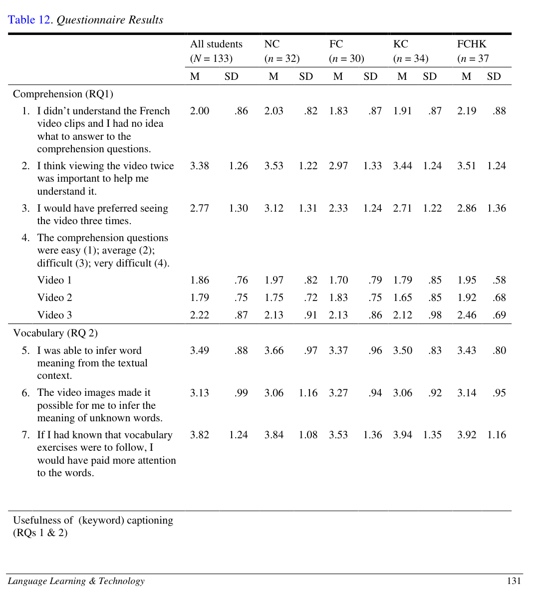
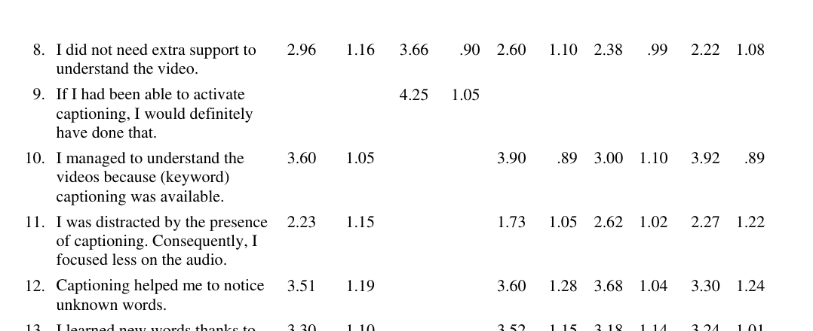

# Bài 09 - Questionnaire: người học cảm nhận caption như thế nào?

## Mục tiêu

- Bổ sung góc nhìn chủ quan của người học vào kết quả định lượng.
- Phân biệt cảm nhận hữu ích với hiệu quả đo được bằng test.

## 1. Kết quả questionnaire

Paper dùng thang Likert 1–5 để hỏi về comprehension, vocabulary learning và usefulness của captions.

## 2. Các điểm đáng chú ý

- Các nhóm đánh giá tương đối giống nhau về mức hiểu và độ khó của câu hỏi.
- Người học nhìn chung cho rằng **textual context** và **video images** hỗ trợ suy nghĩa từ, trong đó textual context được đánh giá cao hơn một chút.
- Nhiều người cho biết nếu biết trước có vocabulary exercises, họ sẽ chú ý từ nhiều hơn.
- NC tự tin hơn rằng họ không cần extra support, nhưng nếu caption có sẵn họ vẫn cho biết sẽ bật.
- FC và FCHK đánh giá caption hữu ích cho hiểu video cao hơn KC.
- Các nhóm caption tương đối tích cực về việc captions giúp nhận ra và học từ mới.

## 3. Cảm nhận ≠ kết quả kiểm tra

Một lesson quan trọng về đọc nghiên cứu: questionnaire cho biết **người học nghĩ gì**, còn performance tests cho biết **họ làm được gì trong phép đo cụ thể**. Hai loại dữ liệu bổ sung nhau nhưng không thay thế nhau.

Ví dụ: FC/FCHK cho rằng captions hữu ích cho hiểu video, trong khi RQ1 lại không tìm thấy khác biệt comprehension có ý nghĩa giữa các nhóm.

## Tự kiểm tra

1. Người học đánh giá textual context hay visual clues hữu ích hơn cho suy nghĩa từ?
2. Vì sao không nên dùng questionnaire để thay thế performance test?
3. Nhóm nào đánh giá keyword captions kém hữu ích hơn so với full-caption conditions?

**Nguồn:** PDF trang 14–15, Questionnaire.
