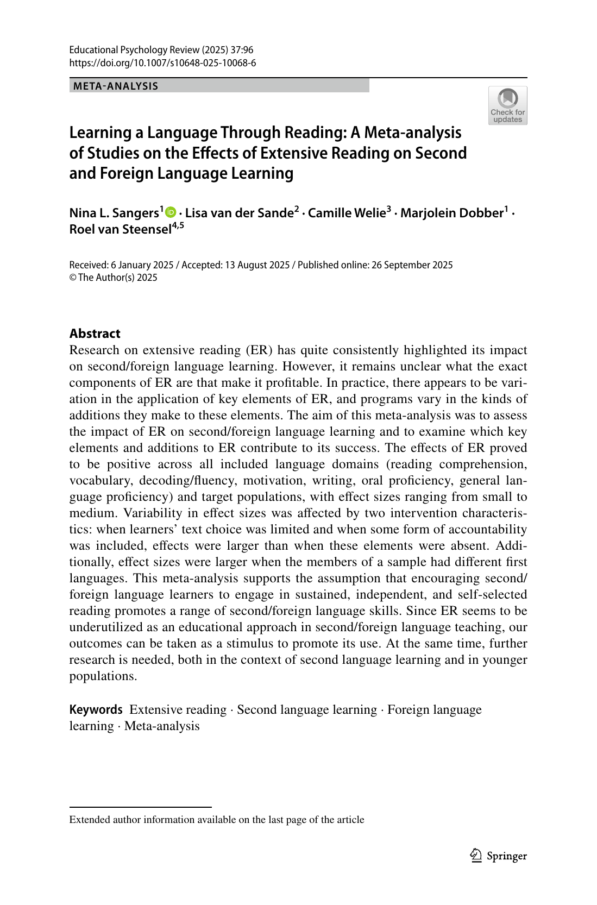

# Khóa học: Học ngoại ngữ qua Extensive Reading

Khóa học này được biên soạn **chỉ từ nội dung của bài meta-analysis**:

> Nina L. Sangers, Lisa van der Sande, Camille Welie, Marjolein Dobber & Roel van Steensel (2025), *Learning a Language Through Reading: A Meta-analysis of Studies on the Effects of Extensive Reading on Second and Foreign Language Learning*, Educational Psychology Review 37:96.

Mục tiêu của gói học là biến paper 43 trang thành các bài Markdown ngắn, có cấu trúc học tập, đồng thời giữ lại các hình và bảng quan trọng từ PDF để đối chiếu.

## Cấu trúc

- **Module 01 – Nền tảng:** Extensive Reading là gì, cơ chế lý thuyết, nghiên cứu trước và khoảng trống.
- **Module 02 – Phương pháp:** câu hỏi nghiên cứu, tìm kiếm/chọn nghiên cứu, coding, effect size và publication bias.
- **Module 03 – Kết quả:** đặc điểm mẫu, hiệu quả theo miền kỹ năng, moderator analyses.
- **Module 04 – Thảo luận:** diễn giải, giới hạn, hàm ý và kết luận.
- **Module 05 – Phụ lục nghiên cứu:** cú pháp tìm kiếm, rubric chất lượng nghiên cứu, cách đọc ma trận can thiệp.

## Cách học đề xuất

Đọc theo thứ tự file trong từng module. Mỗi bài có: mục tiêu, nội dung chính, số liệu cần nhớ, câu hỏi tự kiểm tra và trang nguồn trong PDF. Các câu hỏi tự kiểm tra là phần biên soạn để học tập; các kết luận khoa học đều bám theo paper.

## Nguồn gốc tài liệu

- PDF gốc: `source/Sangers_et_al_2025_Extensive_Reading_Meta_Analysis.pdf`
- Hình/bảng: `assets/`
- Không bổ sung web hoặc nguồn bên ngoài vào nội dung khóa học.
