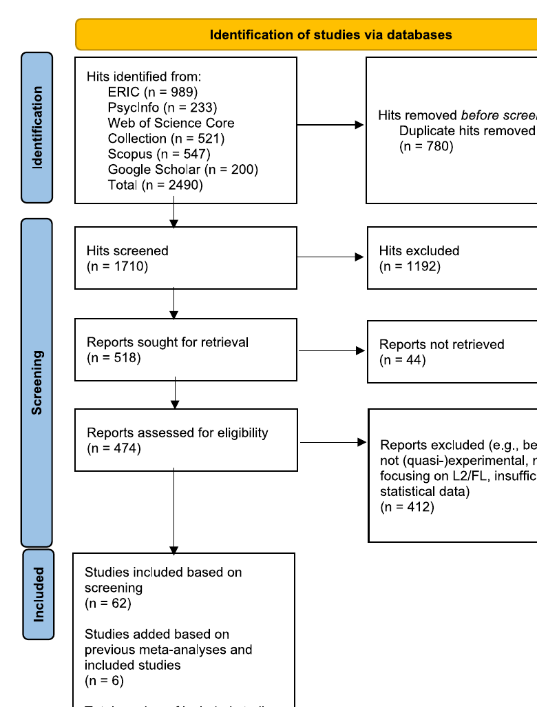
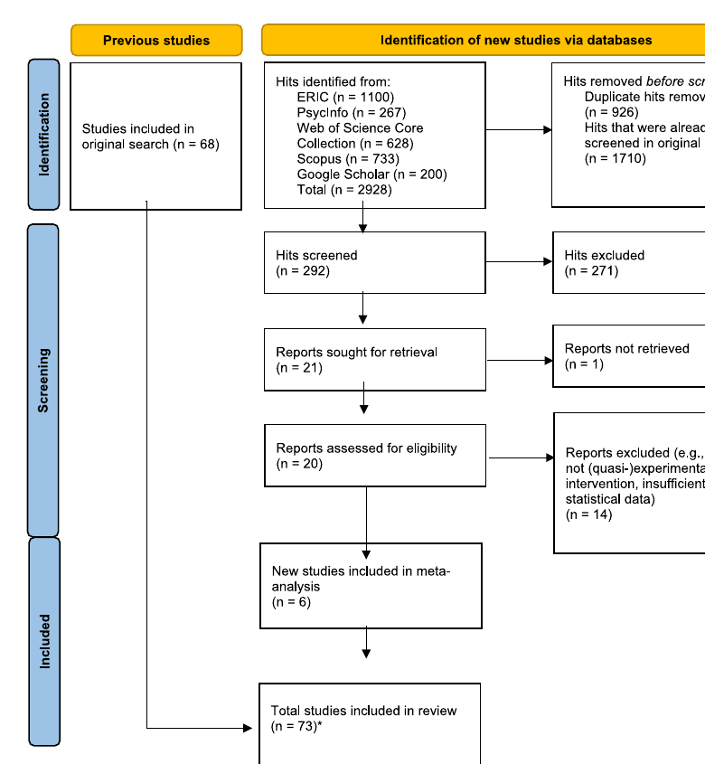

# Bài 5 — Tìm kiếm, chọn nghiên cứu và PRISMA

## Mục tiêu học tập
Hiểu cách nhóm tác giả thu thập và sàng lọc bằng chứng trước khi phân tích.

## 1. Năm cơ sở dữ liệu
Nhóm tác giả tìm trên:
- ERIC
- PsycINFO
- Web of Science Core Collection
- Scopus
- Google Scholar

Các từ khóa kết hợp hai nhóm khái niệm: (1) extensive reading và các cách gọi liên quan; (2) bối cảnh học ngôn ngữ thứ hai/ngoại ngữ.

## 2. Tiêu chí chính để được đưa vào
Nghiên cứu phải:
- có can thiệp ER nhằm nâng cao L2/FL learning;
- có nhóm thực nghiệm và nhóm đối chứng;
- cung cấp effect size hoặc đủ dữ liệu để tính effect size.

Paper không giới hạn năm xuất bản. Nghiên cứu về ngôn ngữ thứ nhất và một số nhóm đặc thù bị loại khỏi phạm vi.

## 3. Quy trình tìm kiếm ban đầu
Tìm kiếm ngày 26/01/2023 dẫn tới 2,490 hits trước loại trùng. Sau loại trùng còn 1,710 hits để sàng lọc; 518 báo cáo được tìm full text; 474 được đánh giá eligibility. Kết hợp sàng lọc và tra cứu thêm từ các meta-analysis/references, bộ ban đầu có 68 nghiên cứu.

## 4. Cập nhật tìm kiếm
Ngày 14/04/2025, nhóm tác giả lặp lại tìm kiếm trong năm cơ sở dữ liệu. Quy trình cập nhật bổ sung sáu nghiên cứu mới; tổng số nghiên cứu trong review là 73 sau khi xử lý trường hợp dữ liệu trùng giữa một bài peer-reviewed và một bản PhD manuscript.

## Tự kiểm tra
1. Tại sao paper đưa cả dissertation và book chapter vào thay vì chỉ peer-reviewed journal articles?
2. Điều kiện “có nhóm đối chứng” giúp meta-analysis tránh một hạn chế nào của các tổng quan trước?
3. Tại sao cần cập nhật lại tìm kiếm năm 2025?

## Nguồn trong PDF
Trang 7–9, phần **Search Strategy and Study Selection**, Fig. 1 và Fig. 2.
