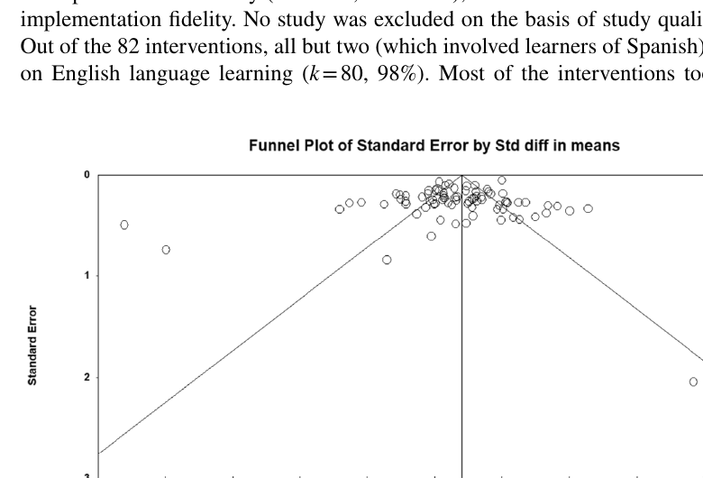

# Bài 7 — Effect size, random-effects model và publication bias

## Mục tiêu học tập
Đọc được cách meta-analysis gộp kết quả và hiểu những kiểm tra chính liên quan tới publication bias.

## 1. Đơn vị phân tích
73 nghiên cứu tạo ra 86 **experimental comparisons** khi tính cả một số follow-up comparisons. Khi một comparison có nhiều thước đo cùng outcome, paper lấy trung bình effect size để tạo một đại diện cho outcome đó.

## 2. Effect size
Paper sử dụng **Cohen’s d** và diễn giải theo ngưỡng quy ước mà tác giả nêu:
- trên .20: small;
- trên .50: medium;
- trên .80: large.

Effect size được tính từ pre/post data khi có thể; nếu dữ liệu không đủ, nhóm tác giả dùng các thống kê khác như t, F, p cùng sample size, hoặc effect size do nghiên cứu gốc báo cáo.

## 3. Random-effects model
Các phân tích chính dùng random-effects model, phù hợp với giả định rằng effect size thực có thể khác nhau giữa các nghiên cứu. Moderator analyses được dùng để giải thích một phần heterogeneity.

## 4. Publication bias
Paper dùng ba nguồn kiểm tra:
- moderator peer review không có ý nghĩa thống kê;
- funnel plot;
- Egger’s regression test với intercept không có ý nghĩa (`β = -0.50, p = .466`).

Nhóm tác giả kết luận nguy cơ publication bias có vẻ hạn chế. Khi loại năm outliers trong funnel plot, overall effect gần như không thay đổi đáng kể (`d = 0.39, SE = 0.07`).

## Tự kiểm tra
1. Vì sao random-effects model hợp lý khi các chương trình ER rất khác nhau?
2. Funnel plot được dùng để xem xét vấn đề gì?
3. Tại sao việc bỏ outliers mà effect gần như không đổi lại hữu ích cho kiểm tra độ bền kết quả?

## Nguồn trong PDF
Trang 12–13, các phần **Data-Analysis** và **Publication Bias**.
