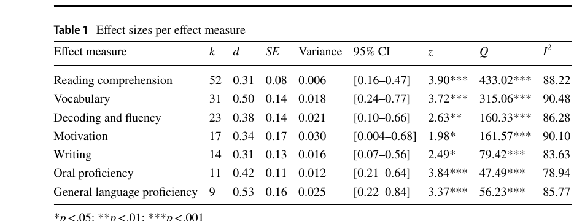

# Bài 9 — Extensive Reading tác động thế nào lên từng kỹ năng?

## Mục tiêu học tập
Đọc được effect sizes theo domain và phân biệt effect trung bình chung với effect theo kỹ năng.

## 1. Hiệu quả tổng thể
Trên 86 experimental comparisons, overall effect là `d = 0.41 (SE = 0.07)`. Vì chỉ có bốn follow-up comparisons, các phân tích chính tập trung vào immediate effects: `k = 82`, `d = 0.38 (SE = 0.07)`.

## 2. Hiệu quả theo domain
Paper báo cáo hiệu ứng dương có ý nghĩa thống kê trên tất cả nhóm outcome được tổng hợp:

| Outcome | k | Cohen’s d | 95% CI |
|---|---:|---:|---|
| Reading comprehension | 52 | 0.31 | [0.16, 0.47] |
| Vocabulary | 31 | 0.50 | [0.24, 0.77] |
| Decoding & fluency | 23 | 0.38 | [0.10, 0.66] |
| Motivation | 17 | 0.34 | [0.004, 0.68] |
| Writing | 14 | 0.31 | [0.07, 0.56] |
| Oral proficiency | 11 | 0.42 | [0.21, 0.64] |
| General language proficiency | 9 | 0.53 | [0.22, 0.84] |

## 3. Cách diễn giải
Theo cách phân loại của paper, các effect này nằm từ small tới medium. Vocabulary và general language proficiency có điểm ước lượng khoảng mức medium, nhưng không nên xếp hạng “kỹ năng nào tốt nhất” chỉ bằng cách so d vì số nghiên cứu và độ bất định khác nhau.

Các Q-statistics có ý nghĩa cho thấy tồn tại heterogeneity đáng kể giữa các nghiên cứu, tạo động lực cho moderator analysis.

## Tự kiểm tra
1. Immediate overall effect và overall effect có follow-up khác nhau thế nào?
2. Domain nào có `k` lớn nhất?
3. Vì sao không nên chỉ nhìn d rồi kết luận một kỹ năng “được cải thiện nhiều nhất”?

## Nguồn trong PDF
Trang 14–15, phần **Intervention Effects**, Table 1.
