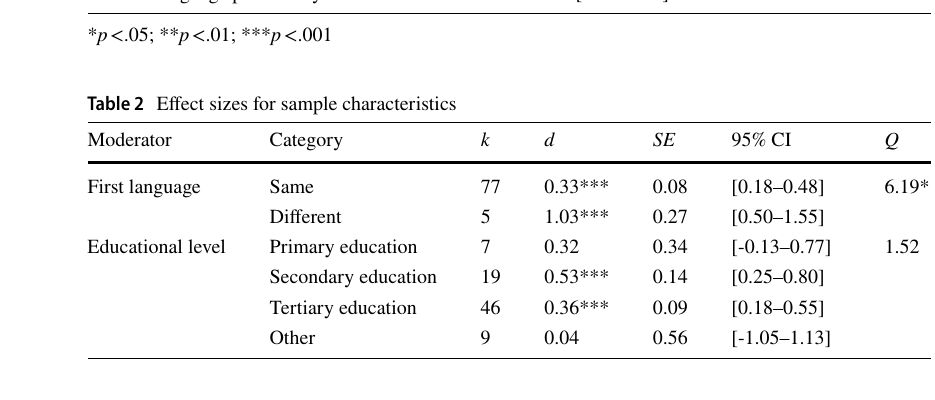
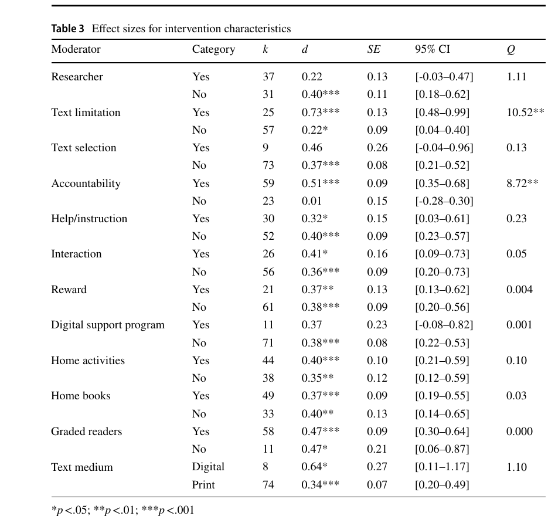
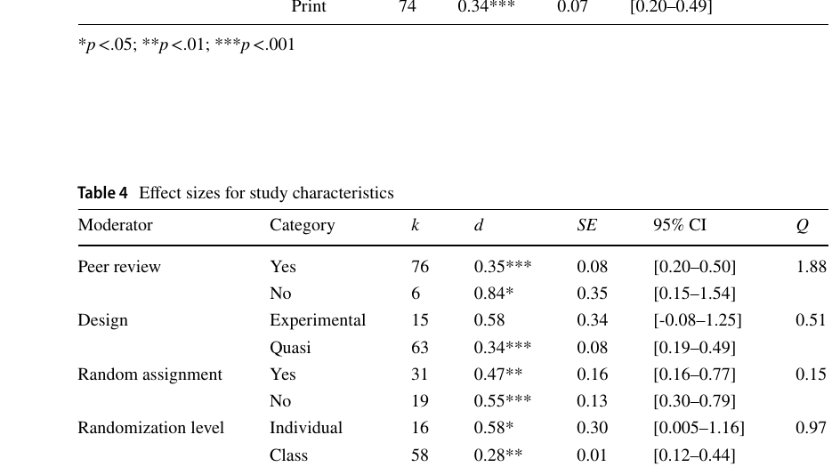

# Bài 10 — Moderator analysis: yếu tố nào thực sự liên quan tới khác biệt effect size?

## Mục tiêu học tập
Phân biệt moderator có ý nghĩa thống kê với những biến chỉ có chênh lệch mô tả.

## 1. Sample moderators
**First language composition** là moderator có ý nghĩa. Các nhóm có người học đến từ nhiều L1 khác nhau cho effect size lớn hơn (`d = 1.03`) so với nhóm cùng L1 (`d = 0.33`). Educational level không cho thấy moderator effect có ý nghĩa.

## 2. Intervention moderators
Trong các moderator can thiệp dạng phân loại, chỉ hai biến có ý nghĩa:

### Text limitation
- Có giới hạn lựa chọn văn bản: `d = 0.73`
- Không giới hạn: `d = 0.22`
- Moderator test: `Q = 10.52`, có ý nghĩa.

### Accountability
- Có accountability: `d = 0.51`
- Không có: `d = 0.01`
- Moderator test: `Q = 8.72`, có ý nghĩa.

Các biến khác như text selection support, help/instruction, interaction, reward, digital support, home activities, home books, graded readers và text medium **không cho thấy moderator effect có ý nghĩa trong phân tích này**.

Duration theo tuần cũng không phải moderator có ý nghĩa (`β = -0.002, p = .669`).

## 3. Study characteristics
Peer review, design, random assignment, randomization level và study quality không cho thấy moderator effect có ý nghĩa trong các phân tích của paper.

## 4. Cách tránh đọc sai bảng
Ví dụ digital text có `d = 0.64` và print có `d = 0.34`, nhưng moderator test không có ý nghĩa. Paper vì vậy không kết luận digital medium làm ER hiệu quả hơn print. Quy tắc tương tự áp dụng cho các cặp moderator khác.

## Tự kiểm tra
1. Hai intervention moderators có ý nghĩa là gì?
2. Educational level có phải moderator có ý nghĩa không?
3. Vì sao `d = 0.64` cho digital không đủ để kết luận digital tốt hơn print?

## Nguồn trong PDF
Trang 15–17, Tables 2–4 và phần **Moderator Analyses**.
