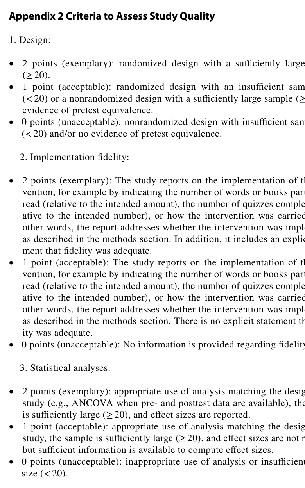

# Phụ lục học 2 — Rubric đánh giá chất lượng nghiên cứu

## Mục tiêu
Đọc được quality index 0–6 mà meta-analysis dùng.

Paper chấm ba tiêu chí, mỗi tiêu chí 0–2 điểm:

## 1. Design
- **2 điểm:** randomized design và sample đủ lớn (`n ≥ 20`).
- **1 điểm:** randomized nhưng sample nhỏ, hoặc nonrandomized với sample đủ lớn và có bằng chứng pretest equivalence.
- **0 điểm:** nonrandomized với sample nhỏ và/hoặc không có bằng chứng pretest equivalence.

## 2. Implementation fidelity
- **2 điểm:** báo cáo việc can thiệp được thực hiện thế nào và có phát biểu rõ fidelity là adequate.
- **1 điểm:** có báo cáo thực hiện can thiệp nhưng không có phát biểu rõ về mức adequacy.
- **0 điểm:** không có thông tin về fidelity.

## 3. Statistical analyses
- **2 điểm:** phân tích phù hợp thiết kế, sample đủ lớn và effect sizes được báo cáo.
- **1 điểm:** phân tích phù hợp, sample đủ lớn nhưng không báo effect size dù có đủ thông tin để tính.
- **0 điểm:** phân tích không phù hợp hoặc sample quá nhỏ.

## Ghi chú
Paper nói một tiêu chí thứ tư từ Austin et al. (2019) về nguy cơ Type I error khi có nhiều comparisons đã bị loại vì thường không áp dụng được cho các nghiên cứu trong corpus.

## Nguồn trong PDF
Trang 22, **Appendix 2 Criteria to Assess Study Quality**.
