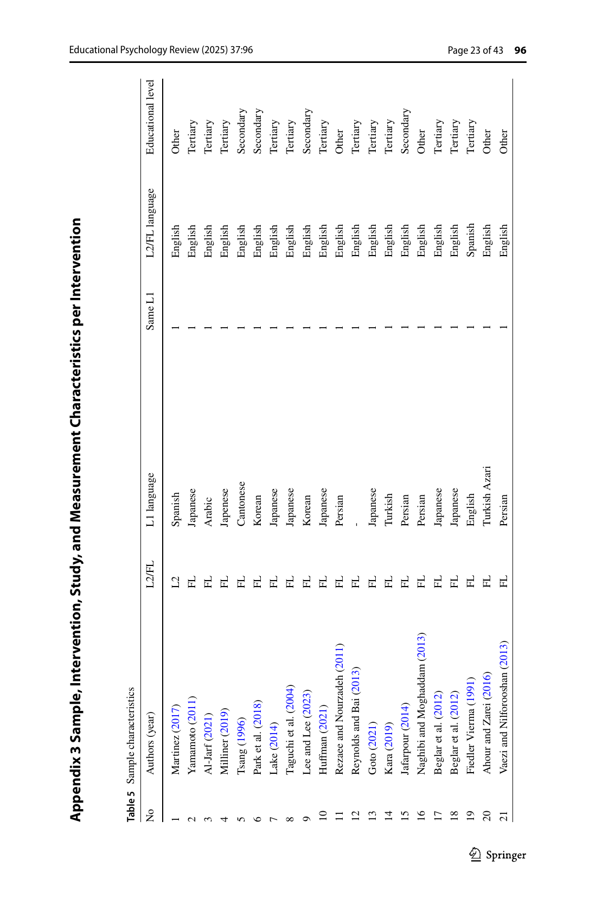

# Phụ lục học 3 — Cách đọc Appendix 3: ma trận intervention characteristics

## Mục tiêu
Biết Appendix 3 chứa loại thông tin nào và cách dùng nó để truy ngược từ meta-analysis về từng can thiệp.

Appendix 3 kéo dài nhiều trang và liệt kê các đặc điểm sample, intervention, study và measurement theo từng intervention. Đây là lớp dữ liệu mô tả phía sau các moderator analyses.

## Cách đọc
1. **Bắt đầu từ intervention/study:** xác định tác giả và năm.
2. **Đọc sample characteristics:** L2/FL, L1 composition, target language và educational level.
3. **Đọc intervention characteristics:** các cột về text limitation, accountability, graded readers, medium, home reading, v.v.
4. **Đọc study/measurement characteristics:** thiết kế, randomization, quality và outcome measures.
5. **Đối chiếu với Tables 2–4:** hiểu nhóm `Yes/No` hoặc category trong moderator analysis được tạo từ coding ở Appendix 3 như thế nào.

## Vì sao phụ lục này quan trọng?
Nó giúp người đọc không xem moderator analysis như “hộp đen”. Khi cần kiểm tra một kết luận, bạn có thể đi ngược từ effect/moderator về các đặc điểm coding của từng nghiên cứu.

## Nguồn trong PDF
Trang 23–36, **Appendix 3 Sample, Intervention, Study, and Measurement Characteristics per Intervention**.
