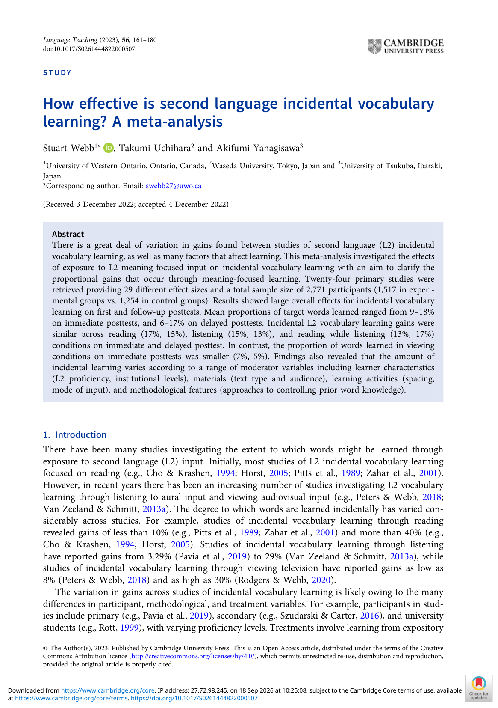

# Bức tranh tổng quan: học từ vựng ngẫu nhiên trong L2

> **Phạm vi nguồn:** bài học này được biên soạn lại từ Webb, S., Uchihara, T., & Yanagisawa, A. (2023). *How effective is second language incidental vocabulary learning? A meta-analysis*. Language Teaching, 56(2), 161–180. https://doi.org/10.1017/S0261444822000507, chủ yếu từ **trang 1–2**. Nội dung không bổ sung bằng nguồn ngoài.

## Mục tiêu học tập

- Hiểu mục tiêu của meta-analysis và quy mô dữ liệu.
- Phân biệt bốn mode of input: reading, listening, reading while listening, viewing.
- Nắm các tỷ lệ học từ chính mà bài báo báo cáo.

## Vấn đề nghiên cứu

Các nghiên cứu về học từ vựng L2 ngẫu nhiên cho kết quả rất khác nhau. Ở các nghiên cứu trước, mức tăng từ vựng có thể thấp dưới 10% nhưng cũng có nghiên cứu báo cáo trên 40%. Sự dao động này khiến việc chỉ nhìn một nghiên cứu đơn lẻ dễ dẫn đến kết luận quá mạnh.

Meta-analysis này gom **24 nghiên cứu sơ cấp**, tạo **29 effect sizes độc lập** cho posttest đầu tiên và tổng cộng **2.771 người tham gia** (1.517 treatment, 1.254 control). Mục tiêu là ước lượng hiệu quả chung của **meaning-focused input** đối với incidental vocabulary learning và xem biến nào làm kết quả thay đổi.

## Bốn dạng đầu vào được so sánh

| Mode of input | Ý nghĩa trong bài báo |
|---|---|
| Reading | Đọc văn bản L2 |
| Listening | Nghe đầu vào L2 |
| Reading while listening | Vừa đọc vừa nghe cùng đầu vào |
| Viewing | Xem đầu vào nghe nhìn, không tính điều kiện caption/subtitle trong phân tích chính |

## Kết quả tổng quát cần nhớ

- Tỷ lệ target words học được trên **immediate posttest** dao động khoảng **9–18%** tùy loại test.
- Trên **delayed posttest**, tỷ lệ khoảng **6–17%**.
- Theo mode, immediate/delayed lần lượt: **reading 17%/15%**, **listening 15%/13%**, **reading while listening 13%/17%**, **viewing 7%/5%**.
- Nghiên cứu cũng xem xét các moderator thuộc ba nhóm: người học, tài liệu/hoạt động, và phương pháp đo lường.

## Cách dùng khóa học này

Khóa học đi từ khái niệm → moderator → phương pháp meta-analysis → kết quả → thảo luận và hạn chế. Các bảng gốc được trích thành ảnh để anh có thể đối chiếu trực tiếp số liệu thay vì chỉ đọc phần diễn giải.

## Ghi nhớ nhanh

Bài học này nên được hiểu trong khuôn khổ của chính meta-analysis: **incidental vocabulary learning** là học từ vựng phát sinh trong khi người học tập trung vào ý nghĩa/nội dung, và kết quả phụ thuộc mạnh vào thiết kế nghiên cứu, loại đầu vào và đặc điểm người học.
