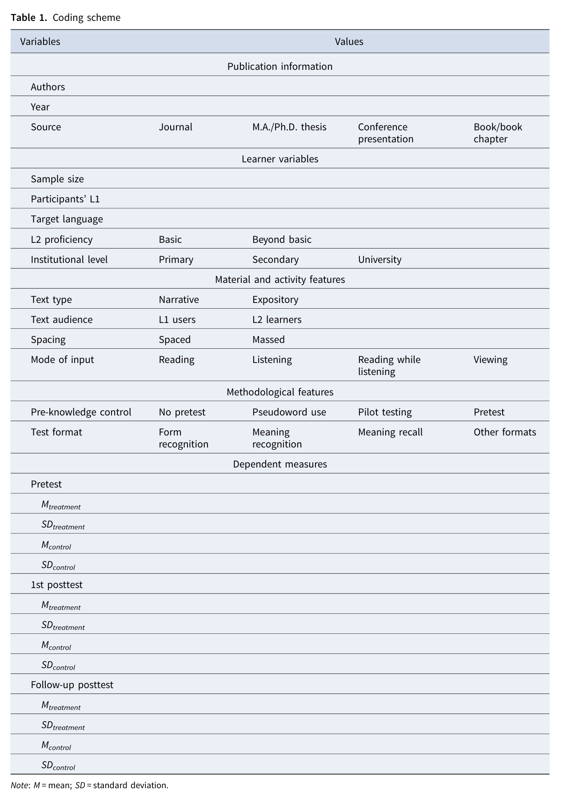

# Inclusion criteria và coding scheme

> **Phạm vi nguồn:** bài học này được biên soạn lại từ Webb, S., Uchihara, T., & Yanagisawa, A. (2023). *How effective is second language incidental vocabulary learning? A meta-analysis*. Language Teaching, 56(2), 161–180. https://doi.org/10.1017/S0261444822000507, chủ yếu từ **trang 5–8**. Nội dung không bổ sung bằng nguồn ngoài.

## Mục tiêu học tập

- Nắm 8 inclusion criteria.
- Hiểu vì sao cần control group và kiểm soát prior knowledge.
- Đọc coding scheme của Table 1.

## Tám tiêu chí chọn nghiên cứu

Một study phải thỏa các yêu cầu chính sau:

1. Đo incidental gains từ meaning-focused/comprehension-based learning, không explicit vocabulary instruction.
2. Learners không được báo trước về vocabulary posttest.
3. Task goal là hiểu reading/listening/viewing content.
4. Không dùng glossing hoặc captioned videos trong treatment condition của meta-analysis này.
5. Prior knowledge của target words được kiểm soát ở mức thấp/gần như không có bằng pseudoword, pilot test hoặc pretest.
6. Là L2 vocabulary acquisition, không phải L1.
7. Dùng between-participants design và có control condition không được exposure target words.
8. Báo effect size hoặc đủ thông tin để tính effect size.

Control group đặc biệt quan trọng để tách learning effect khỏi **practice effect** do làm test nhiều lần.

## Coding

24 studies ban đầu tạo **53 effect sizes**, nhưng nhiều effect sizes phụ thuộc vì cùng participant. Tác giả average các effect sizes liên quan trước khi meta-analysis, còn **29 independent effect sizes** ở first posttest.

Ở follow-up, chỉ có **9 effect sizes**, với average retention interval **34.1 days** và N = 741.

Hai coder độc lập đạt **98% agreement**; khác biệt được giải quyết qua thảo luận.

## Table 1 – Coding scheme

Ảnh dưới đây là bảng gốc trong PDF, chứa publication information, learner variables, material/activity features, methodological features và dependent measures.

## Ghi nhớ nhanh

Bài học này nên được hiểu trong khuôn khổ của chính meta-analysis: **incidental vocabulary learning** là học từ vựng phát sinh trong khi người học tập trung vào ý nghĩa/nội dung, và kết quả phụ thuộc mạnh vào thiết kế nghiên cứu, loại đầu vào và đặc điểm người học.
