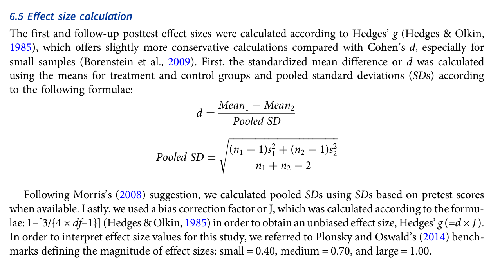

# Hedges’ g và quy trình phân tích meta-analysis

> **Phạm vi nguồn:** bài học này được biên soạn lại từ Webb, S., Uchihara, T., & Yanagisawa, A. (2023). *How effective is second language incidental vocabulary learning? A meta-analysis*. Language Teaching, 56(2), 161–180. https://doi.org/10.1017/S0261444822000507, chủ yếu từ **trang 9**. Nội dung không bổ sung bằng nguồn ngoài.

## Mục tiêu học tập

- Hiểu vì sao bài báo dùng Hedges’ g.
- Nắm vai trò pooled SD và bias correction J.
- Biết random-effects, mixed-effects và kiểm tra publication bias được dùng ở đâu.

## Từ standardized mean difference tới Hedges’ g

Bài báo tính standardized mean difference từ chênh lệch mean giữa treatment và control, chia cho pooled standard deviation. Sau đó áp dụng bias correction factor **J** để thu được **Hedges’ g**, lựa chọn được mô tả là bảo thủ hơn Cohen’s d, đặc biệt ở sample nhỏ.

Khi có pretest SD, tác giả ưu tiên pooled SD dựa trên pretest scores theo gợi ý của Morris (2008).

## Mốc diễn giải effect size

Meta-analysis tham chiếu benchmark của Plonsky & Oswald (2014):

- small = **0.40**
- medium = **0.70**
- large = **1.00**

Đây là benchmark mà chính bài báo dùng để diễn giải; không nên tự động áp dụng như chuẩn chung cho mọi lĩnh vực.

## Data analysis

- Software: **Comprehensive Meta-Analysis v3.3**.
- Một study (Vidal, 2011) được xem là outlier (>3 SD trên mean effect sizes) và bị loại khỏi phân tích thống kê tiếp theo.
- Publication bias được đánh giá bằng **fail-safe N** và **trim-and-fill** dựa trên funnel plots; tác giả kết luận ít đáng lo trong dữ liệu này.
- Mean effect sizes dùng **random-effects model**.
- Moderator analysis dùng **mixed-effects model**.
- Homogeneity/Q statistics được dùng để kiểm tra biến thiên effect size và moderator.

## Ghi nhớ nhanh

Bài học này nên được hiểu trong khuôn khổ của chính meta-analysis: **incidental vocabulary learning** là học từ vựng phát sinh trong khi người học tập trung vào ý nghĩa/nội dung, và kết quả phụ thuộc mạnh vào thiết kế nghiên cứu, loại đầu vào và đặc điểm người học.
