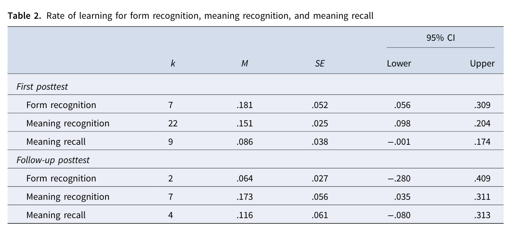
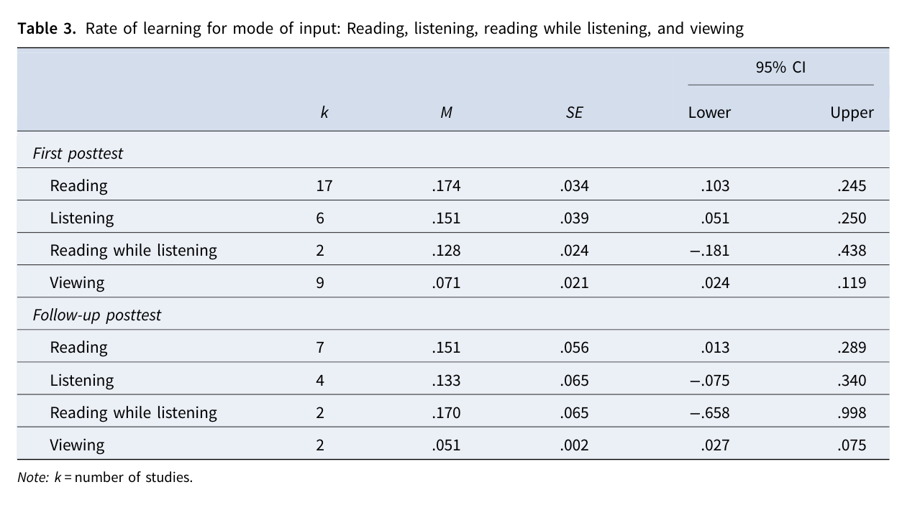

# Kết quả chính: effect tổng thể và rate of learning

> **Phạm vi nguồn:** bài học này được biên soạn lại từ Webb, S., Uchihara, T., & Yanagisawa, A. (2023). *How effective is second language incidental vocabulary learning? A meta-analysis*. Language Teaching, 56(2), 161–180. https://doi.org/10.1017/S0261444822000507, chủ yếu từ **trang 9–11**. Nội dung không bổ sung bằng nguồn ngoài.

## Mục tiêu học tập

- Ghi nhớ effect tổng thể ở first và follow-up posttest.
- Đọc tỷ lệ học theo test format.
- So sánh tỷ lệ học theo mode of input mà không biến chúng thành quy tắc tuyệt đối.

## Overall effect

Sau khi loại outlier, first posttest có **k = 28**, với mean effect **g = 1.14**, 95% CI **[0.86, 1.41]**, p < .001. Follow-up có **k = 9**, **g = 0.93**, 95% CI **[0.44, 1.42]**, p < .001.

Cả hai Q homogeneity tests đều significant, cho thấy effect sizes giữa studies khác nhau đáng kể và hợp lý để tiếp tục moderator analysis.

## Rate theo test format

Table 2 cho tỷ lệ trung bình:

| Test | Immediate | Delayed |
|---|---:|---:|
| Form recognition | 18.1% | 6.4% |
| Meaning recognition | 15.1% | 17.3% |
| Meaning recall | 8.6% | 11.6% |

Tác giả lưu ý việc delayed rate cao hơn immediate ở một số test có thể liên quan **practice effects**, không nên diễn giải đơn giản là “học thêm sau khi không học”.

## Rate theo mode of input

Table 3:

| Mode | Immediate | Delayed |
|---|---:|---:|
| Reading | 17.4% | 15.1% |
| Listening | 15.1% | 13.3% |
| Reading while listening | 12.8% | 17.0% |
| Viewing | 7.1% | 5.1% |

Các tỷ lệ này là average proportions qua studies đủ dữ liệu, không phải cam kết rằng một cá nhân sẽ học đúng tỷ lệ đó.

## Ghi nhớ nhanh

Bài học này nên được hiểu trong khuôn khổ của chính meta-analysis: **incidental vocabulary learning** là học từ vựng phát sinh trong khi người học tập trung vào ý nghĩa/nội dung, và kết quả phụ thuộc mạnh vào thiết kế nghiên cứu, loại đầu vào và đặc điểm người học.
