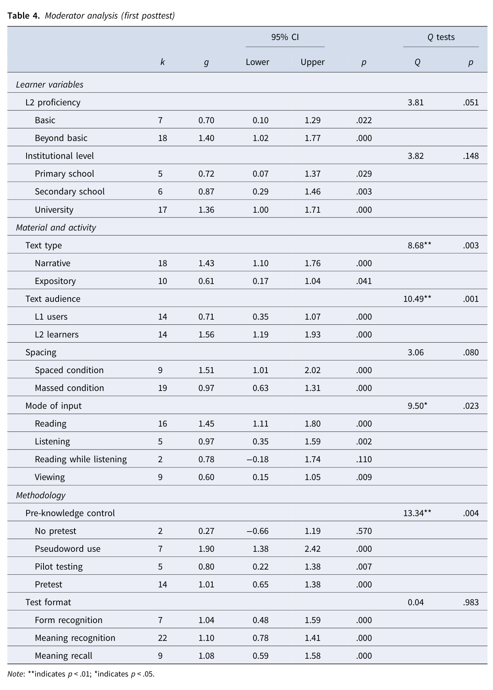

# Moderator analysis: first posttest

> **Phạm vi nguồn:** bài học này được biên soạn lại từ Webb, S., Uchihara, T., & Yanagisawa, A. (2023). *How effective is second language incidental vocabulary learning? A meta-analysis*. Language Teaching, 56(2), 161–180. https://doi.org/10.1017/S0261444822000507, chủ yếu từ **trang 10–12**. Nội dung không bổ sung bằng nguồn ngoài.

## Mục tiêu học tập

- Phân biệt moderator có/không có statistical significance.
- Nắm các moderator nổi bật ở immediate posttest.
- Đọc effect size cùng Q-test thay vì chỉ nhìn g riêng lẻ.

## Kết quả immediate posttest theo Table 4

Các moderator có bằng chứng khác biệt theo Q-test p < .05 gồm:

- **Text type**: p = .003; narrative g = 1.43, expository g = 0.61.
- **Text audience**: p = .001; L2 learners g = 1.56, L1 users g = 0.71.
- **Mode of input**: p = .023.
- **Pre-knowledge control**: p = .004.

Các moderator không đạt p < .05:

- L2 proficiency: p = .051 (rất gần ngưỡng).
- Institutional level: p = .148.
- Spacing: p = .080.
- Test format: p = .983.

Điều quan trọng: một subgroup có g lớn không tự động chứng minh subgroup đó “tốt hơn”; để nói moderator có khác biệt giữa nhóm, cần nhìn **between-group Q test**.

## Ghi nhớ nhanh

Bài học này nên được hiểu trong khuôn khổ của chính meta-analysis: **incidental vocabulary learning** là học từ vựng phát sinh trong khi người học tập trung vào ý nghĩa/nội dung, và kết quả phụ thuộc mạnh vào thiết kế nghiên cứu, loại đầu vào và đặc điểm người học.
