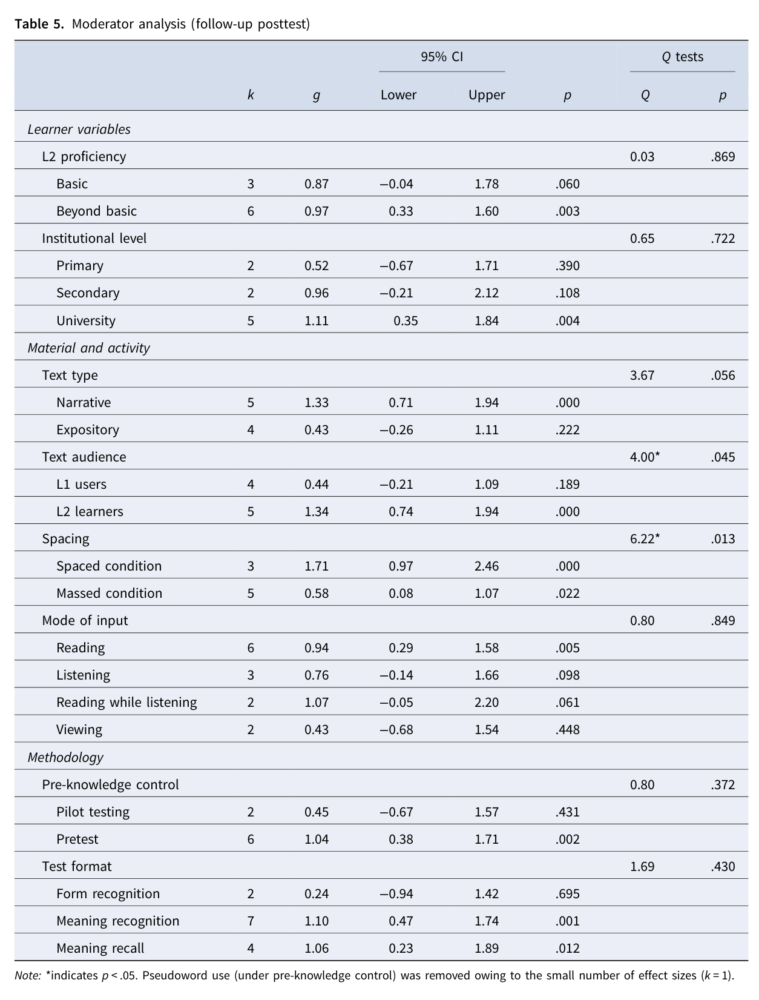

# Moderator analysis: follow-up posttest và điểm không nhất quán trong nguồn

> **Phạm vi nguồn:** bài học này được biên soạn lại từ Webb, S., Uchihara, T., & Yanagisawa, A. (2023). *How effective is second language incidental vocabulary learning? A meta-analysis*. Language Teaching, 56(2), 161–180. https://doi.org/10.1017/S0261444822000507, chủ yếu từ **trang 11–13, 17**. Nội dung không bổ sung bằng nguồn ngoài.

## Mục tiêu học tập

- Đọc Table 5 cho delayed posttest.
- Hiểu tác động của sample nhỏ hơn lên độ chắc chắn.
- Nhận diện điểm không nhất quán giữa Table 5 và phần Conclusion của bài báo.

## Table 5 – Follow-up posttest

Dữ liệu delayed ít hơn nên confidence intervals rộng và nhiều moderator không significant.

Theo **Table 5**:

- L2 proficiency: p = .869
- Institutional level: p = .722
- Text type: p = .056
- **Text audience: p = .045**
- **Spacing: p = .013**
- Mode of input: p = .849
- Pre-knowledge control: p = .372
- Test format: p = .430

Spacing là tín hiệu rõ nhất: **spaced g = 1.71** so với **massed g = 0.58**.

## Điểm cần ghi chú khi học từ nguồn này

Phần **Conclusion** của chính bài báo viết rằng “only material and activity (spacing, mode of input) variables moderated gains on delayed posttests”. Tuy nhiên, **Table 5** lại cho thấy **mode of input p = .849** (không significant) và **text audience p = .045** (significant).

Khóa học không tự ý sửa hay hòa giải mâu thuẫn này. Khi cần dùng kết quả cho nghiên cứu hoặc luận văn, nên trích **bảng thống kê gốc** và đồng thời ghi chú rằng wording ở phần kết luận không hoàn toàn khớp Table 5.

## Ghi nhớ nhanh

Bài học này nên được hiểu trong khuôn khổ của chính meta-analysis: **incidental vocabulary learning** là học từ vựng phát sinh trong khi người học tập trung vào ý nghĩa/nội dung, và kết quả phụ thuộc mạnh vào thiết kế nghiên cứu, loại đầu vào và đặc điểm người học.
