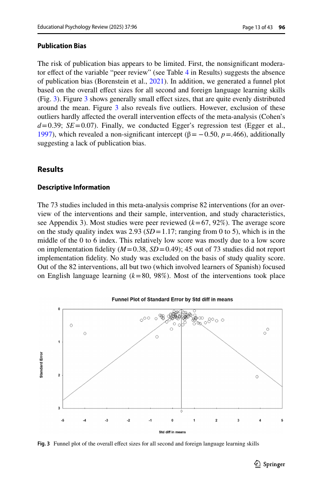
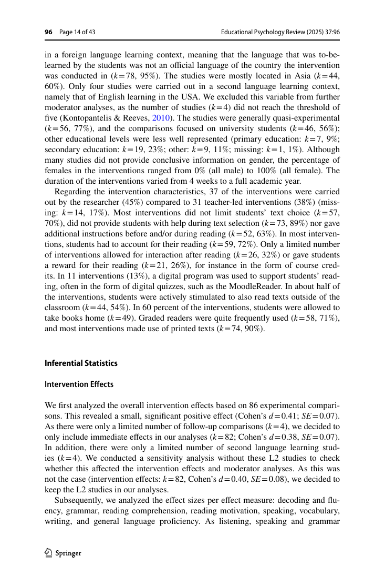

# Paper 01 — Extensive Reading Meta-analysis (2025)

**Nguồn:** Sangers, N. L., van der Sande, L., Welie, C., Dobber, M., & van Steensel, R. (2025). *Learning a Language Through Reading: A Meta-analysis of Studies on the Effects of Extensive Reading on Second and Foreign Language Learning*. Educational Psychology Review, 37, 96.

**DOI:** 10.1007/s10648-025-10068-6  
**Trạng thái:** Open access.

## Câu hỏi
Extensive reading có cải thiện năng lực L2/foreign language không, và yếu tố triển khai nào làm hiệu quả mạnh hơn?

## Dữ liệu
- 73 studies.
- 82 interventions.
- 80/82 interventions (98%) nhắm vào **English**; chỉ 2 interventions nhắm Spanish.

## Kết quả chính
Meta-analysis ghi nhận tác động tích cực trên nhiều outcome, gồm reading comprehension, vocabulary, decoding/fluency, writing, oral proficiency, motivation và general language proficiency. Hiệu ứng nhìn chung ở mức nhỏ đến trung bình và thay đổi theo thiết kế chương trình.

Một số moderator đáng chú ý: cách chọn sách và cơ chế accountability/kiểm tra việc đọc có thể ảnh hưởng hiệu quả.

## Áp dụng cho English

Không biến “extensive reading” thành đọc tài liệu quá khó rồi tra từng từ. Quy trình:

1. Chọn text vừa sức, ưu tiên graded reader hoặc material có tỷ lệ hiểu cao.
2. Đọc vì meaning trước; chỉ lưu những cụm lặp lại/hữu ích.
3. Sau bài đọc, đóng text và recall 5 ý hoặc 5 collocations.
4. Có accountability nhẹ: reading log, quiz ngắn hoặc summary.
5. Tăng dần độ khó khi tốc độ và comprehension ổn định.

## Cảnh báo diễn giải
Kết luận đặc biệt hữu ích cho English vì 80/82 interventions là English, nhưng điều đó cũng có nghĩa evidence base **không cân bằng giữa các ngôn ngữ**.

## Ảnh nên trích từ PDF
- Trang bìa paper.
- Trang chứa sơ đồ study selection / forest plots.
- Trang mô tả 80/82 interventions target English.

## Nguồn
- Publisher PDF: https://link.springer.com/content/pdf/10.1007/s10648-025-10068-6.pdf
- DOI: https://doi.org/10.1007/s10648-025-10068-6

## Bản PDF và ảnh trong gói

- [PDF gốc](../papers/s10648-025-10068-6.pdf)
- 
- 
