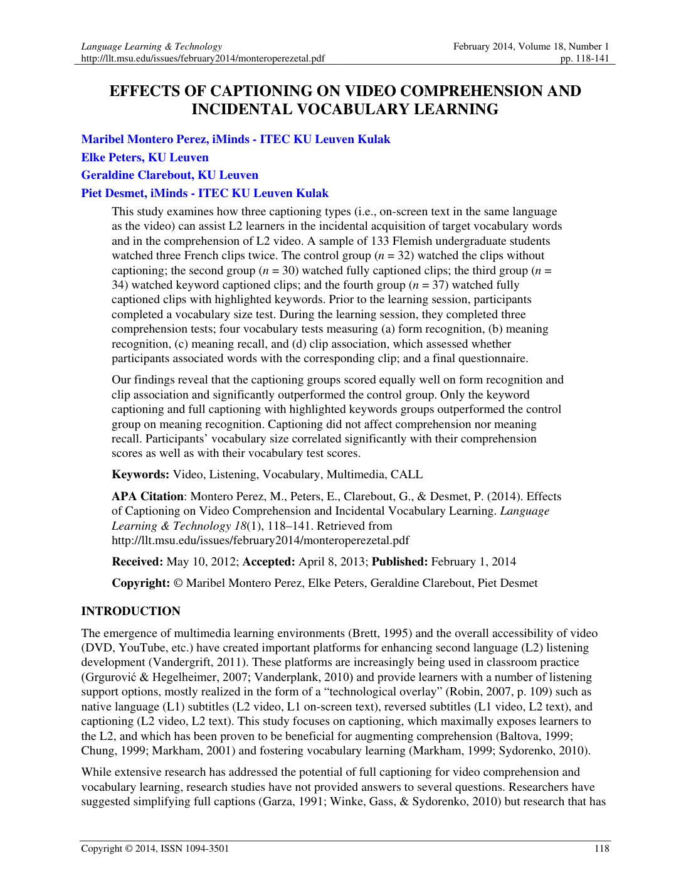
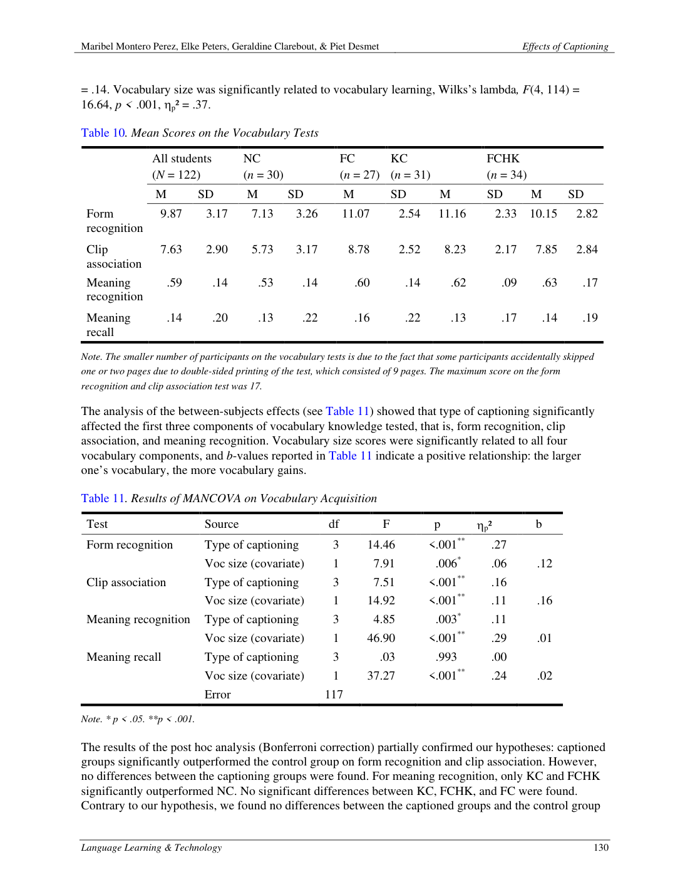

# Paper 18 — Effects of Captioning on Video Comprehension and Incidental Vocabulary Learning (2014)

**Nguồn:** Montero Perez, M., Peters, E., Clarebout, G., & Desmet, P. (2014). *Effects of Captioning on Video Comprehension and Incidental Vocabulary Learning*. Language Learning & Technology, 18(1), 118–141.

**Trạng thái:** PDF có trong gói.

## Thiết kế
133 Flemish undergraduate students xem ba French clips hai lần. Các condition gồm no captions, full captions, keyword captions, và full captions với highlighted keywords. Trước session có vocabulary-size test; outcomes gồm comprehension và nhiều mức vocabulary knowledge.

## Kết quả chính
- Captioning groups vượt no-caption control ở **form recognition** và **clip association**.
- Với **meaning recognition**, chỉ keyword captions và full captions + highlighted keywords vượt control trong post-hoc analysis.
- Captioning **không tạo khác biệt rõ về comprehension** hay meaning recall trong study này.
- Vocabulary size liên hệ đáng kể với comprehension và vocabulary scores.

## Ý nghĩa thực hành
Caption không nên được hiểu là “bật subtitles là listening tự tốt lên”. Giá trị rõ hơn trong study này nằm ở việc **notice lexical form / liên kết từ với đoạn video**. Vì vậy:

1. Lượt đầu xem có caption để map âm ↔ chữ.
2. Highlight/select 3–6 từ/cụm quan trọng thay vì đọc tất cả như transcript.
3. Lượt sau giảm caption và tự recall meaning.
4. Dùng post-viewing recall để tránh chỉ recognition.

## PDF và ảnh

- [PDF gốc](../papers/Effects_of_captioning_on_video_comprehension_and_i.pdf)
- 
- 
