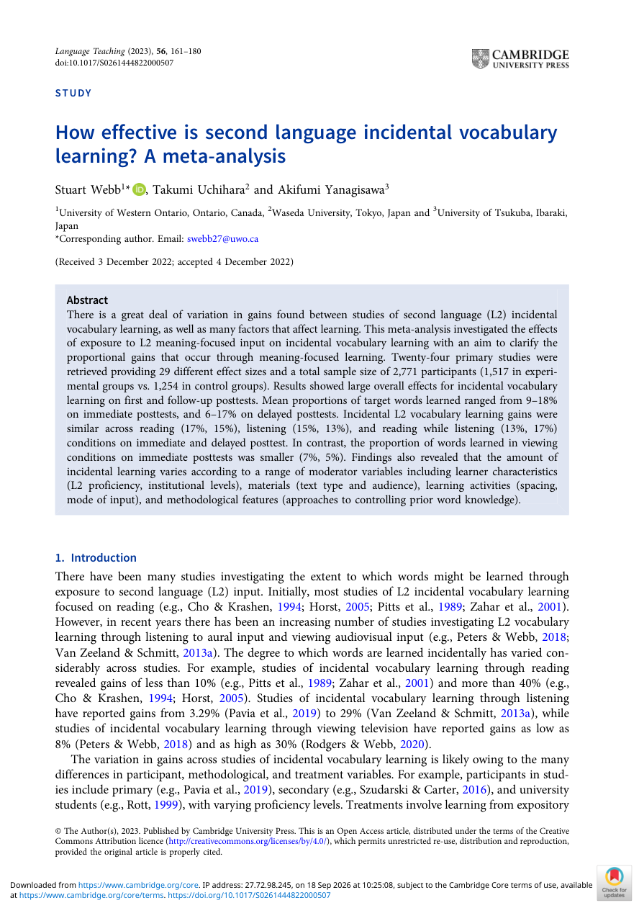

# Paper 19 — How Effective Is L2 Incidental Vocabulary Learning? Meta-analysis (2023)

**Nguồn:** Webb, S., Uchihara, T., & Yanagisawa, A. (2023). *How effective is second language incidental vocabulary learning? A meta-analysis*. Language Teaching, 56, 161–180.

**DOI:** 10.1017/S0261444822000507  
**Trạng thái:** Open access; PDF có trong gói.

## Dữ liệu
- 24 primary studies.
- 29 effect sizes.
- Tổng sample 2,771 participants.

## Kết quả chính
Meta-analysis cho thấy incidental vocabulary learning từ meaning-focused L2 input là có thật nhưng tỷ lệ từ học được không nên được thổi phồng. Mean proportions target words learned trong abstract nằm khoảng **9–18% ở immediate posttests** và **6–17% ở delayed posttests** tùy modality/outcome.

Reading, listening và reading-while-listening tạo gains tương đối gần nhau trong dữ liệu tổng hợp. Viewing không caption trong tập studies này có tỷ lệ thấp hơn. Paper **loại captioned-video treatments** khỏi meta-analysis, nên không dùng study này để đánh giá caption trực tiếp.

## Áp dụng
Input rộng là cần thiết nhưng không đủ cho từ quan trọng. Với từ/collocation muốn dùng chủ động:

> gặp trong input → hiểu context → retrieval → spaced recall → tự tạo câu

Điều này giải thích vì sao extensive input nên đi cùng SRS/active recall thay vì kỳ vọng mọi từ sẽ tự được ghi nhớ.

## PDF và ảnh

- [PDF gốc](../papers/how-effective-is-second-language-incidental-vocabulary-learning-a-meta-analysis.pdf)
- 
- 
