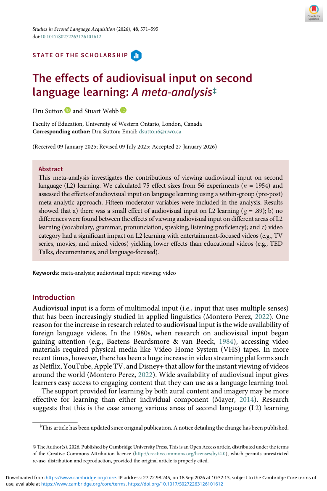
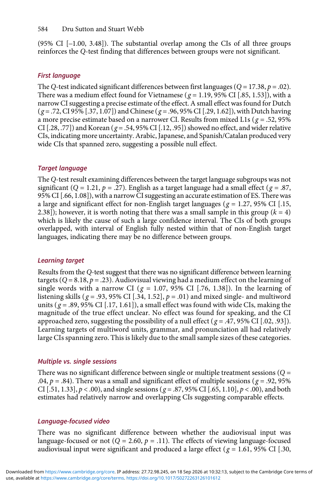

# Paper 20 — Audiovisual Input on Second Language Learning: Meta-analysis (2026)

**Nguồn:** Sutton, D., & Webb, S. (2026). *The effects of audiovisual input on second language learning: A meta-analysis*. Studies in Second Language Acquisition, 48, 571–595.

**DOI:** 10.1017/S0272263126101612  
**Trạng thái:** Open access (CC BY); PDF có trong gói.

## Dữ liệu
- 75 effect sizes.
- 56 experiments.
- N = 1,954.

## Kết quả chính
Authors dùng within-group pre–post meta-analysis và báo cáo positive overall effect của audiovisual viewing trên L2 learning. Không thấy khác biệt đáng kể giữa nhiều learning targets trong moderator analysis; uncertainty vẫn lớn ở các category có sample nhỏ.

Đáng chú ý cho lựa chọn nội dung: **video category có ảnh hưởng**. Entertainment-focused video (TV series, movies, mixed videos) cho effects thấp hơn education-focused video (ví dụ TED Talks, documentaries, language-focused material) trong phân tích của paper. Phần conclusion cũng khuyến nghị educational content và captions khi xem movies/TV series.

## Áp dụng
Nếu mục tiêu là học ngôn ngữ thay vì giải trí:

1. Ưu tiên documentary/TED/language-focused material có discourse rõ.
2. Xem clip ngắn 5–15 phút, không binge thụ động.
3. Sau mỗi đoạn: recall nội dung + 3–5 chunks.
4. Nếu dùng movie/series, bật L2 captions khi cần và có task sau xem.
5. Đo learning bằng recall/production, không đo bằng “đã xem bao nhiêu giờ”.

## Caveat
Pre–post effect sizes có thể chịu ảnh hưởng của pre–post correlation và không mạnh bằng giữa-group randomized contrasts trong việc suy ra causal effect; chính authors nêu hạn chế này.

## PDF và ảnh

- [PDF gốc](../papers/the-effects-of-audiovisual-input-on-second-language-learning-a-meta-analysis.pdf)
- 
- 
- 
