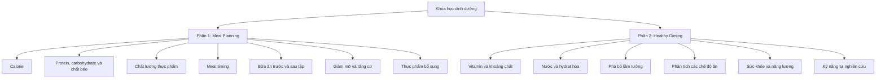
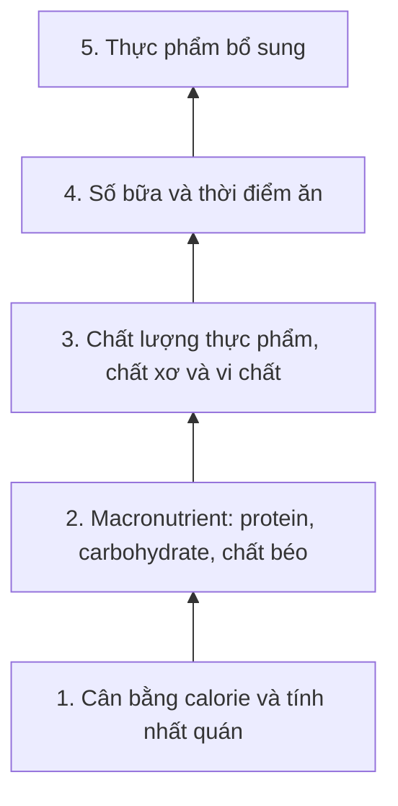

# 001 — Chào mừng đến với khóa học và những gì bạn sẽ học

> **Tên bài gốc:** *Welcome To The Course & What You Will Learn*
> **Mục đích:** Giới thiệu giảng viên, triết lý xây dựng khóa học, nội dung sẽ học và cách tiếp cận dinh dưỡng dựa trên bằng chứng.

| Thuộc tính               | Nội dung                                                                  |
| ------------------------ | ------------------------------------------------------------------------- |
| **Học phần**             | Module 01 — Introduction                                                  |
| **Bài học**              | Welcome To The Course & What You Will Learn                               |
| **Thời lượng**           | 03:31 — Xem trước miễn phí                                                |
| **Giảng viên**           | Felix Harder                                                              |
| **Chủ đề chính**         | Tổng quan khóa học và kết quả đầu ra                                      |
| **Đối tượng phù hợp**    | Người muốn giảm mỡ, tăng cơ, cải thiện sức khỏe hoặc tự xây dựng thực đơn |
| **Phương pháp tiếp cận** | Dinh dưỡng dựa trên bằng chứng, cá nhân hóa và khả năng duy trì           |

> **Thông tin khóa học hiện tại:** Trang Udemy chính thức liệt kê khóa học gồm 10 phần, 94 bài giảng với tổng thời lượng khoảng 4 giờ 04 phút. Nội dung bao gồm calorie, protein, carbohydrate, chất béo, vitamin, khoáng chất, meal planning, giảm mỡ và tăng cơ.

---

## 1. Mục tiêu bài học

Sau khi hoàn thành bài mở đầu, bạn có thể:

* Nắm được phạm vi tổng thể của khóa học, từ kiến thức calorie và macronutrient đến việc tự thiết kế một chế độ ăn hoàn chỉnh.
* Hiểu triết lý xuyên suốt khóa học: không áp dụng máy móc một thực đơn cho tất cả mọi người.
* Phân biệt hai mảng chính:

  * **Meal Planning:** xây dựng thực đơn theo mục tiêu hình thể.
  * **Healthy Dieting:** xây dựng chế độ ăn hỗ trợ sức khỏe, năng lượng và chất lượng cuộc sống.
* Hiểu vì sao cần học calorie và macronutrient trước khi nghiên cứu meal timing, thực phẩm bổ sung hoặc các chế độ ăn theo trào lưu.
* Xác định mục tiêu cá nhân trước khi bắt đầu tính calorie và chia macro.
* Biết cách ghi lại dữ liệu ban đầu để theo dõi tiến trình trong các module sau.

---

## 2. Giới thiệu giảng viên

Trong bài học, giảng viên tự giới thiệu là **Felix Harder**, một huấn luyện viên về thể hình và dinh dưỡng.

Ông cho biết đã:

* Viết nhiều sách liên quan đến sức khỏe và thể hình.
* Xây dựng các khóa học trực tuyến về dinh dưỡng, tập luyện và phát triển cơ bắp.
* Chia sẻ kiến thức qua nền tảng đào tạo và blog Simple Muscle.
* Theo đuổi cách tiếp cận dựa trên nghiên cứu thay vì chỉ dựa vào trải nghiệm cá nhân.

Điểm mà giảng viên muốn nhấn mạnh không phải là:

> “Phương pháp này hiệu quả với tôi nên chắc chắn sẽ hiệu quả với bạn.”

Thay vào đó, cách tiếp cận của khóa học là:

> “Cơ thể, mục tiêu và hoàn cảnh của mỗi người khác nhau. Vì vậy, cần sử dụng nguyên lý khoa học làm nền tảng, sau đó điều chỉnh để phù hợp với từng cá nhân.”

### 2.1. Ba nguyên tắc trong cách giảng dạy

| Nguyên tắc         | Ý nghĩa                                                               |
| ------------------ | --------------------------------------------------------------------- |
| **Evidence-based** | Ưu tiên kiến thức được hỗ trợ bởi nghiên cứu thay vì lời truyền miệng |
| **Individualized** | Điều chỉnh theo mục tiêu, cơ thể, sở thích và lối sống                |
| **Sustainable**    | Chế độ ăn phải có khả năng duy trì trong thời gian dài                |

---

## 3. Triết lý trung tâm của khóa học

Khóa học được xây dựng quanh một luận điểm quan trọng:

> **Không tồn tại một chế độ ăn hoàn hảo cho tất cả mọi người. Chỉ tồn tại chế độ ăn phù hợp hơn hoặc kém phù hợp hơn đối với từng người và từng mục tiêu.**

Hai người có thể cùng muốn giảm mỡ nhưng cần cách triển khai khác nhau vì họ có:

* Cân nặng và chiều cao khác nhau.
* Mức vận động khác nhau.
* Lịch học hoặc lịch làm việc khác nhau.
* Sở thích ăn uống khác nhau.
* Khả năng nấu ăn và ngân sách khác nhau.
* Tình trạng sức khỏe khác nhau.
* Khả năng duy trì chế độ ăn khác nhau.

Vì vậy, khóa học không chỉ cung cấp một thực đơn cố định để sao chép. Mục tiêu lớn hơn là giúp bạn xây dựng được **khung tư duy dinh dưỡng**.


---

## 4. Hai phần lớn của khóa học

Theo bài giới thiệu, chương trình có thể được chia thành hai mảng nội dung chính.



---

# Phần I — Meal Planning

## 5. Meal Planning là gì?

**Meal planning** là quá trình thiết kế cách ăn uống phù hợp với:

* Nhu cầu năng lượng.
* Mục tiêu hình thể.
* Lịch sinh hoạt.
* Thói quen ăn uống.
* Khả năng mua và chuẩn bị thực phẩm.
* Khả năng duy trì lâu dài.

Một meal plan tốt không nhất thiết phải chứa các món ăn “hoàn hảo”. Nó cần:

1. Đáp ứng mục tiêu calorie.
2. Cung cấp đủ protein và chất béo thiết yếu.
3. Cung cấp carbohydrate phù hợp với nhu cầu vận động.
4. Có đủ thực phẩm giàu vitamin, khoáng chất và chất xơ.
5. Phù hợp với sở thích và điều kiện thực tế.
6. Có thể được điều chỉnh khi kết quả thay đổi.

---

## 6. Calorie và cân bằng năng lượng

Khóa học sẽ giải thích:

* Calorie là gì.
* Cơ thể sử dụng năng lượng như thế nào.
* Vì sao mỗi người cần lượng calorie khác nhau.
* Cách ước tính lượng calorie duy trì.
* Cách tạo thâm hụt calorie để giảm cân.
* Cách tạo thặng dư calorie để tăng cân và hỗ trợ phát triển cơ bắp.

### 6.1. Mô hình cân bằng năng lượng

```text
Năng lượng nạp vào < Năng lượng tiêu hao
                     ↓
          Xu hướng giảm cân theo thời gian

Năng lượng nạp vào ≈ Năng lượng tiêu hao
                     ↓
          Xu hướng duy trì cân nặng

Năng lượng nạp vào > Năng lượng tiêu hao
                     ↓
          Xu hướng tăng cân theo thời gian
```

Đây là mô hình nền tảng. Tuy nhiên, kết quả thực tế còn chịu ảnh hưởng bởi:

* Sai số khi ước tính khẩu phần.
* Sự thay đổi mức vận động.
* Dao động nước trong cơ thể.
* Hàm lượng glycogen.
* Chu kỳ kinh nguyệt.
* Giấc ngủ và mức độ căng thẳng.
* Khả năng tuân thủ chế độ ăn.

Vì vậy, không nên đánh giá một kế hoạch chỉ dựa trên cân nặng của một hoặc hai ngày.

---

## 7. Ba nhóm chất đa lượng

Khóa học giới thiệu ba **macronutrient** chính:

| Macronutrient    | Năng lượng ước tính | Vai trò tiêu biểu                                                         |
| ---------------- | ------------------: | ------------------------------------------------------------------------- |
| **Protein**      |            4 kcal/g | Xây dựng và sửa chữa mô; hỗ trợ duy trì khối cơ                           |
| **Carbohydrate** |            4 kcal/g | Cung cấp năng lượng, đặc biệt cho hoạt động cường độ cao                  |
| **Chất béo**     |            9 kcal/g | Cấu tạo màng tế bào, hỗ trợ hormone và hấp thu vitamin tan trong chất béo |

> **Lưu ý:** Macronutrient không chỉ là những con số. Nguồn thực phẩm cung cấp chúng còn mang theo chất xơ, vitamin, khoáng chất và nhiều hợp chất sinh học khác.

### 7.1. Những câu hỏi khóa học sẽ giải quyết

* Mỗi ngày nên ăn bao nhiêu gram protein?
* Có cần loại bỏ carbohydrate khi giảm cân không?
* Chất béo có khiến cơ thể tích mỡ trực tiếp không?
* Nguồn protein nào phù hợp với người ăn chay?
* Có nên chia đều protein cho các bữa không?
* Tỷ lệ protein, carbohydrate và chất béo có cần giống nhau mỗi ngày không?
* Chất lượng của từng nguồn macro khác nhau như thế nào?

---

## 8. Chất lượng thực phẩm

Hai thực đơn có thể có lượng calorie tương đương nhưng khác nhau đáng kể về:

* Độ no.
* Hàm lượng chất xơ.
* Vitamin và khoáng chất.
* Khả năng hỗ trợ vận động.
* Mức độ thuận tiện.
* Khả năng duy trì lâu dài.

Ví dụ:

| Lựa chọn ít ưu tiên hơn         | Lựa chọn thường giàu dinh dưỡng hơn          |
| ------------------------------- | -------------------------------------------- |
| Nước ngọt có đường              | Nước lọc, trà không đường                    |
| Bánh ngọt ít chất xơ            | Trái cây, sữa chua hoặc yến mạch             |
| Thịt chế biến thường xuyên      | Cá, trứng, thịt nạc, đậu phụ                 |
| Ngũ cốc tinh chế là nguồn chính | Gạo, khoai, yến mạch hoặc ngũ cốc nguyên hạt |
| Ít rau và trái cây              | Nhiều loại rau quả với màu sắc đa dạng       |

Mô hình **Healthy Eating Plate** của Harvard gợi ý dùng rau và trái cây cho khoảng một nửa đĩa, phần còn lại gồm ngũ cốc nguyên hạt và nguồn protein phù hợp. Đây là hướng dẫn trực quan về cấu trúc bữa ăn, không phải công thức calorie cố định cho mọi người.

---

## 9. Số bữa và thời điểm ăn

Khóa học sẽ xem xét các vấn đề như:

* Nên ăn ba hay sáu bữa mỗi ngày?
* Ăn sáng có bắt buộc không?
* Có cần ăn ngay sau khi thức dậy không?
* Có nên tránh carbohydrate vào buổi tối không?
* Nên ăn protein, carbohydrate và chất béo vào thời điểm nào?
* Ăn trước tập và sau tập ra sao?
* “Cửa sổ đồng hóa” có thực sự ngắn như quảng cáo không?

### 9.1. Nguyên tắc thực hành

Số bữa ăn nên được lựa chọn dựa trên:

* Tổng lượng thức ăn cần tiêu thụ.
* Khả năng kiểm soát cơn đói.
* Giờ tập luyện.
* Khả năng tiêu hóa.
* Lịch học và lịch làm việc.
* Sở thích cá nhân.

Nutrient timing có thể hữu ích trong một số hoàn cảnh, nhưng không nên làm phức tạp chế độ ăn khi tổng calorie, protein và chất lượng thực phẩm vẫn chưa ổn định.

Các tài liệu về nutrient timing cũng nhấn mạnh việc lựa chọn thời điểm ăn cần được đặt trong bối cảnh tổng lượng dinh dưỡng, lịch tập và mục tiêu cá nhân.

---

## 10. Dinh dưỡng trước và sau tập

Khóa học sẽ hướng dẫn cách xây dựng:

### Bữa ăn trước tập

Mục tiêu:

* Cung cấp năng lượng.
* Hạn chế cảm giác đói.
* Tránh đầy bụng khi tập.
* Hỗ trợ hiệu suất vận động.

Thường bao gồm:

* Một nguồn carbohydrate dễ tiêu hóa.
* Một nguồn protein.
* Lượng chất béo và chất xơ phù hợp với thời gian còn lại trước buổi tập.

### Bữa ăn sau tập

Mục tiêu:

* Bổ sung dinh dưỡng sau vận động.
* Hỗ trợ phục hồi.
* Cung cấp protein cho quá trình sửa chữa mô.
* Bổ sung carbohydrate khi cần phục hồi glycogen.

Không nhất thiết phải uống protein trong vài phút ngay sau khi kết thúc buổi tập. Tổng lượng protein và calorie trong ngày vẫn là nền tảng quan trọng hơn.

---

## 11. Điều chỉnh thực đơn theo mục tiêu

### 11.1. Giảm mỡ

Một kế hoạch giảm mỡ thường cần:

* Thâm hụt calorie vừa phải.
* Lượng protein phù hợp.
* Tập luyện sức mạnh nếu có thể.
* Thực phẩm có độ no cao.
* Theo dõi xu hướng cân nặng và số đo.
* Điều chỉnh khi tiến trình dừng lại.

### 11.2. Tăng cơ

Một kế hoạch tăng cơ thường cần:

* Tập luyện có progressive overload.
* Đủ calorie để hỗ trợ phục hồi.
* Đủ protein.
* Đủ carbohydrate cho hiệu suất tập luyện.
* Giấc ngủ và thời gian phục hồi phù hợp.
* Kiểm soát tốc độ tăng cân để hạn chế tăng mỡ quá nhanh.

### 11.3. Duy trì cân nặng và cải thiện sức khỏe

Mục tiêu có thể tập trung vào:

* Ổn định cân nặng.
* Ăn đa dạng hơn.
* Tăng rau, trái cây và chất xơ.
* Hạn chế thực phẩm siêu chế biến.
* Cải thiện năng lượng và hiệu suất sinh hoạt.
* Xây dựng thói quen có thể duy trì lâu dài.

---

## 12. Thực phẩm bổ sung

Khóa học cũng đề cập đến các sản phẩm có thể hỗ trợ chế độ ăn hoặc tập luyện.

Ví dụ:

* Protein powder.
* Creatine.
* Caffeine.
* Vitamin hoặc khoáng chất trong trường hợp thiếu hụt.
* Một số sản phẩm hỗ trợ sức khỏe hoặc miễn dịch.

Tuy nhiên, thực phẩm bổ sung không thể thay thế:

* Tổng lượng calorie phù hợp.
* Protein và các chất dinh dưỡng thiết yếu.
* Rau, trái cây và thực phẩm đa dạng.
* Giấc ngủ.
* Tập luyện.
* Khả năng duy trì kế hoạch.

---

# Phần II — Healthy Dieting

## 13. Healthy Dieting là gì?

**Healthy dieting** không chỉ tập trung vào việc làm cho cân nặng giảm xuống hoặc khối cơ tăng lên.

Mục tiêu rộng hơn là thiết kế một chế độ ăn:

* Hỗ trợ sức khỏe lâu dài.
* Cung cấp đủ vitamin và khoáng chất.
* Hỗ trợ hệ miễn dịch.
* Duy trì năng lượng.
* Hỗ trợ khả năng tập trung.
* Phù hợp với văn hóa và lối sống.
* Giảm nguy cơ thiếu hụt dinh dưỡng.

WHO nhấn mạnh một chế độ ăn lành mạnh cần đa dạng, cân bằng và ưu tiên thực phẩm giàu dinh dưỡng; đồng thời hạn chế lượng đường tự do, muối và các nguồn chất béo không có lợi.

---

## 14. Vitamin và khoáng chất

Một chế độ ăn có thể đạt đúng calorie và macro nhưng vẫn thiếu:

* Vitamin A.
* Vitamin C.
* Vitamin D.
* Vitamin nhóm B.
* Sắt.
* Canxi.
* Kẽm.
* Magie.
* Kali.
* I-ốt.

Do đó, “đúng macro” chưa đồng nghĩa với “hoàn chỉnh về dinh dưỡng”.

Khóa học sẽ giải thích:

* Vai trò cơ bản của các vitamin và khoáng chất thiết yếu.
* Những thực phẩm cung cấp chúng.
* Cách xây dựng thực đơn đa dạng.
* Khi nào nên ưu tiên thực phẩm.
* Khi nào cần trao đổi với chuyên gia về xét nghiệm hoặc bổ sung.

---

## 15. Các lầm tưởng dinh dưỡng

Một phần của khóa học tập trung phân tích những nhận định phổ biến như:

* Ăn carbohydrate sau 18 giờ chắc chắn gây tăng mỡ.
* Cần ăn sáu bữa mỗi ngày để tăng trao đổi chất.
* Một loại thực phẩm riêng lẻ có thể “đốt mỡ”.
* Detox có thể loại bỏ mọi độc tố khỏi cơ thể.
* Thực phẩm tự nhiên có thể ăn không giới hạn calorie.
* Protein powder là bắt buộc để tăng cơ.
* Mọi người đều cần loại bỏ gluten.
* Chất béo trong thực phẩm luôn làm cơ thể tích mỡ.
* Chế độ ăn càng khắt khe thì kết quả càng nhanh và bền vững.
* Chỉ cần dùng supplement là có thể bù lại một chế độ ăn kém chất lượng.

Kỹ năng cần học không chỉ là ghi nhớ kết luận, mà còn là đặt câu hỏi:

1. Nhận định này dựa trên nghiên cứu nào?
2. Đối tượng nghiên cứu có giống mình không?
3. Hiệu quả có đủ lớn để quan tâm không?
4. Có sự đánh đổi hoặc tác dụng phụ nào không?
5. Lời khuyên có thể duy trì trong thực tế không?
6. Người đưa ra lời khuyên có đang bán một sản phẩm liên quan không?

---

## 16. Các chế độ ăn phổ biến

Khóa học dự kiến phân tích:

| Chế độ ăn                | Câu hỏi cần đánh giá                                                 |
| ------------------------ | -------------------------------------------------------------------- |
| **Low-carb**             | Có phù hợp với sở thích và loại hình vận động không?                 |
| **Ketogenic diet**       | Lợi ích, hạn chế và khả năng duy trì ra sao?                         |
| **Intermittent fasting** | Có giúp kiểm soát tổng calorie và lịch ăn không?                     |
| **Paleo**                | Những nguyên tắc nào hữu ích, điều gì có thể quá hạn chế?            |
| **Vegan**                | Làm thế nào bảo đảm protein, vitamin B12, sắt và các chất cần thiết? |
| **Gluten-free**          | Có chỉ định y tế hay chỉ đang làm theo xu hướng?                     |

Khóa học không đặt mục tiêu tuyên bố một chế độ ăn luôn tốt hoặc luôn xấu. Thay vào đó, mỗi phương pháp nên được xem xét theo:

* Bằng chứng.
* Mục tiêu.
* Sức khỏe.
* Sở thích.
* Chi phí.
* Khả năng duy trì.
* Nguy cơ thiếu chất.

---

## 17. Nước và hydrat hóa

Bài giới thiệu cũng cho biết khóa học sẽ giải quyết câu hỏi:

> “Bạn thực sự cần uống bao nhiêu nước mỗi ngày?”

Nhu cầu nước không giống nhau ở mọi người. Nó có thể thay đổi theo:

* Khối lượng cơ thể.
* Thời tiết và nhiệt độ.
* Lượng mồ hôi.
* Cường độ tập luyện.
* Lượng muối và chất xơ.
* Thực phẩm chứa nhiều nước.
* Tình trạng sức khỏe.
* Thuốc đang sử dụng.

Vì vậy, không nên xem một con số cố định là quy tắc tuyệt đối cho tất cả mọi người.

---

## 18. Sức khỏe, năng lượng và chất lượng cuộc sống

Một kế hoạch dinh dưỡng tốt không chỉ được đánh giá bằng con số trên cân.

Hãy xem xét thêm:

* Mức năng lượng trong ngày.
* Chất lượng giấc ngủ.
* Hiệu suất tập luyện.
* Khả năng tập trung.
* Tiêu hóa.
* Cảm giác đói và no.
* Tâm trạng.
* Khả năng duy trì kế hoạch.
* Mức độ ảnh hưởng đến sinh hoạt xã hội.

Nếu một chế độ ăn tạo ra kết quả ngắn hạn nhưng khiến người thực hiện:

* Luôn mệt mỏi.
* Ám ảnh về thực phẩm.
* Sợ ăn cùng người khác.
* Tập luyện suy giảm.
* Thường xuyên ăn mất kiểm soát.
* Không thể duy trì sau vài tuần.

thì kế hoạch đó cần được xem xét lại.

---

## 19. Thứ tự ưu tiên trong dinh dưỡng

Một thông điệp quan trọng của bài học là cần tập trung vào những yếu tố có ảnh hưởng lớn trước.



| Thứ tự | Yếu tố                | Câu hỏi trọng tâm                                                     |
| -----: | --------------------- | --------------------------------------------------------------------- |
|  **1** | Calorie               | Bạn đang ăn đủ, thiếu hay thừa năng lượng so với mục tiêu?            |
|  **2** | Macronutrient         | Bạn có đủ protein và phân bổ các macro hợp lý không?                  |
|  **3** | Chất lượng và vi chất | Thực đơn có đa dạng, giàu chất xơ, vitamin và khoáng chất không?      |
|  **4** | Meal timing           | Cách chia bữa có hỗ trợ lịch tập, cơn đói và khả năng tiêu hóa không? |
|  **5** | Supplement            | Có sản phẩm nào thực sự cần thiết và có bằng chứng không?             |

Một mô hình “Nutrition Hierarchy” tương tự cũng xếp calorie, macro và micronutrient trước nutrient timing và supplement.

### 19.1. Cách hiểu đúng về kim tự tháp

Thứ tự trên là một **khung ưu tiên thực hành**, không có nghĩa rằng:

* Rau và trái cây không quan trọng khi calorie chưa chính xác.
* Vi chất có thể bị bỏ qua trong nhiều tháng.
* Meal timing hoàn toàn không có tác dụng.
* Mọi supplement đều vô ích.
* Chỉ cần đếm calorie là đủ để khỏe mạnh.

Ý nghĩa thực sự là:

> Không nên dành phần lớn thời gian tối ưu các chi tiết nhỏ trong khi những yếu tố nền tảng vẫn chưa được kiểm soát.

### 19.2. Ví dụ làm ngược thứ tự

Một người:

* Chưa biết mình ăn khoảng bao nhiêu calorie.
* Thường xuyên thiếu protein.
* Rất ít ăn rau.
* Ngủ không đủ.
* Không duy trì tập luyện.

nhưng lại dành nhiều thời gian để lựa chọn:

* Loại whey hấp thu nhanh nhất.
* Thời điểm uống amino acid.
* Fat burner.
* Thời điểm ăn carbohydrate chính xác từng phút.

Đây là cách ưu tiên kém hiệu quả.

---

## 20. Lộ trình học đề xuất

Nội dung toàn khóa có thể được chia thành ba lớp.

### Lớp 1 — Nền tảng

Tập trung vào:

* Calorie.
* Protein.
* Carbohydrate.
* Chất béo.
* Chất lượng thực phẩm.
* Meal timing cơ bản.
* Bữa ăn trước và sau tập.

### Lớp 2 — Thiết kế và điều chỉnh thực đơn

Tập trung vào:

* TDEE.
* Mức calorie mục tiêu.
* Chia macronutrient.
* Chọn số lượng bữa ăn.
* Thiết kế thực đơn.
* Theo dõi kết quả.
* Điều chỉnh cho giảm mỡ hoặc tăng cơ.

### Lớp 3 — Sức khỏe và nội dung mở rộng

Tập trung vào:

* Vitamin và khoáng chất.
* Hydrat hóa.
* Các chế độ ăn phổ biến.
* Lầm tưởng dinh dưỡng.
* Thực phẩm bổ sung.
* Sức khỏe tổng thể.
* Kỹ năng tự nghiên cứu.


---

## 21. Áp dụng thực tế ngay sau bài học

### 21.1. Chọn một mục tiêu chính

Chọn một mục tiêu cho giai đoạn đầu:

* **Giảm mỡ.**
* **Tăng cơ.**
* **Duy trì cân nặng.**
* **Cải thiện chất lượng chế độ ăn.**
* **Cải thiện hiệu suất tập luyện.**

Không nên đặt quá nhiều mục tiêu mâu thuẫn cùng lúc.

Ví dụ:

> “Trong 12 tuần tới, tôi muốn giảm vòng eo và duy trì sức mạnh khi tập.”

Cụ thể hơn:

> “Tôi sẽ theo dõi cân nặng trung bình tuần, vòng eo, số buổi tập và mức năng lượng trong 12 tuần.”

---

### 21.2. Ghi lại dữ liệu ban đầu

| Dữ liệu                  | Giá trị |
| ------------------------ | ------- |
| Cân nặng hiện tại        |         |
| Chiều cao                |         |
| Vòng eo                  |         |
| Tuổi                     |         |
| Số buổi tập mỗi tuần     |         |
| Số bước trung bình       |         |
| Thời gian ngủ trung bình |         |
| Mục tiêu chính           |         |
| Thời hạn đánh giá        |         |

---

### 21.3. Ghi nhật ký ăn uống từ 3–7 ngày

Trong tuần đầu, chưa cần lập tức thay đổi mọi thứ.

Hãy ghi lại:

* Thời điểm ăn.
* Món ăn.
* Khẩu phần ước tính.
* Đồ uống.
* Nước chấm và dầu ăn.
* Snack.
* Cảm giác đói trước bữa ăn.
* Cảm giác no sau bữa ăn.
* Buổi tập trong ngày.
* Mức năng lượng.

Mục tiêu của giai đoạn này là thu thập **dữ liệu nền**, không phải phán xét bản thân.

---

### 21.4. Chụp dữ liệu tiến trình

Có thể lưu:

* Cân nặng vào buổi sáng.
* Vòng eo mỗi tuần.
* Ảnh tiến trình cùng ánh sáng và góc chụp.
* Thành tích tập luyện.
* Số bước.
* Giấc ngủ.
* Mức độ tuân thủ thực đơn.

Không nên dựa vào duy nhất một chỉ số.

---

## 22. Mẫu nhật ký ăn uống

| Thời gian | Thực phẩm | Khẩu phần | Mức đói trước ăn 1–10 | Mức no sau ăn 1–10 | Ghi chú |
| --------- | --------- | --------: | --------------------: | -----------------: | ------- |
| 07:30     |           |           |                       |                    |         |
| 10:30     |           |           |                       |                    |         |
| 12:30     |           |           |                       |                    |         |
| 16:00     |           |           |                       |                    |         |
| 19:00     |           |           |                       |                    |         |
| 21:30     |           |           |                       |                    |         |

---

## 23. Những lỗi thường gặp

### Lỗi 1 — Nhảy thẳng đến chế độ ăn theo trào lưu

Ví dụ:

* Keto.
* Low-carb.
* Intermittent fasting.
* Detox.
* Gluten-free.

Trong khi người học chưa hiểu calorie và macronutrient.

**Cách khắc phục:** học phần nền tảng trước rồi mới đánh giá các phương pháp cụ thể.

---

### Lỗi 2 — Tìm kiếm “thực đơn hoàn hảo”

Một thực đơn trên mạng có thể không phù hợp với:

* Nhu cầu calorie của bạn.
* Khả năng mua thực phẩm.
* Lịch sinh hoạt.
* Văn hóa ăn uống.
* Tình trạng sức khỏe.
* Mục tiêu cá nhân.

**Cách khắc phục:** sử dụng thực đơn mẫu như nguồn tham khảo, không sao chép tuyệt đối.

---

### Lỗi 3 — Thay đổi quá nhiều thứ cùng lúc

Nếu đồng thời:

* Cắt toàn bộ đường.
* Loại bỏ carbohydrate.
* Tăng số buổi tập.
* Nhịn ăn.
* Uống nhiều supplement.
* Giảm mạnh calorie.

bạn sẽ khó xác định yếu tố nào thực sự tạo ra kết quả hoặc gây ra vấn đề.

**Cách khắc phục:** thay đổi từng nhóm yếu tố và theo dõi đủ lâu.

---

### Lỗi 4 — Đánh giá kết quả theo từng ngày

Cân nặng có thể dao động do:

* Nước.
* Muối.
* Carbohydrate.
* Khối lượng thức ăn trong hệ tiêu hóa.
* Buổi tập nặng.
* Thời gian ngủ.
* Chu kỳ kinh nguyệt.

**Cách khắc phục:** sử dụng cân nặng trung bình 7 ngày và kết hợp với vòng eo, ảnh tiến trình và hiệu suất tập luyện.

---

### Lỗi 5 — Quá tập trung vào supplement

Supplement chỉ nên được xem xét sau khi:

* Chế độ ăn đã tương đối ổn định.
* Đã xác định nhu cầu cụ thể.
* Đã xem xét bằng chứng, liều lượng và độ an toàn.
* Đã kiểm tra khả năng tương tác với thuốc hoặc bệnh lý.

---

### Lỗi 6 — Chia thực phẩm thành “tốt tuyệt đối” và “xấu tuyệt đối”

Cách tư duy này có thể làm chế độ ăn quá cứng nhắc.

Nên đánh giá thực phẩm dựa trên:

* Khẩu phần.
* Tần suất.
* Tổng chế độ ăn.
* Mục tiêu.
* Hoàn cảnh.
* Tình trạng sức khỏe.

---

## 24. Lưu ý về sức khỏe

Khóa học mang tính **giáo dục dinh dưỡng và thể hình phổ thông**, không thay thế:

* Chẩn đoán y khoa.
* Điều trị bệnh.
* Tư vấn của bác sĩ.
* Tư vấn của chuyên gia dinh dưỡng được cấp phép.

Cần tham khảo chuyên gia trước khi thay đổi chế độ ăn đáng kể nếu bạn:

* Bị tiểu đường.
* Có bệnh thận hoặc bệnh gan.
* Có bệnh tim mạch.
* Đang mang thai hoặc cho con bú.
* Dưới 18 tuổi.
* Có tiền sử rối loạn ăn uống.
* Đang dùng thuốc ảnh hưởng đến đường huyết, huyết áp hoặc điện giải.
* Có triệu chứng bất thường khi ăn kiêng hoặc tập luyện.

---

## 25. Nguồn ảnh minh họa đề xuất

### Ảnh 1 — Cấu trúc một đĩa ăn cơ bản

* [MyPlate — mô hình nhóm thực phẩm chính thức của USDA](https://www.myplate.gov/whatsonmyplate)
* Phù hợp chèn sau phần **Chất lượng thực phẩm**.
* Hình minh họa chia đĩa ăn thành rau, trái cây, ngũ cốc và protein.

### Ảnh 2 — Healthy Eating Plate

* [Healthy Eating Plate — Harvard T.H. Chan School of Public Health](https://nutritionsource.hsph.harvard.edu/healthy-eating-plate/)
* Phù hợp chèn sau phần **Healthy Dieting**.
* Có phiên bản tải xuống dành cho mục đích giáo dục phi thương mại khi ghi nguồn phù hợp.

### Ảnh 3 — Infographic chế độ ăn lành mạnh

* [Healthy Diet Flip Chart — World Health Organization](https://www.who.int/southeastasia/multimedia/item/healthy-diet)
* Phù hợp với phần **Vitamin, khoáng chất và sức khỏe tổng thể**.
* Trang WHO cung cấp infographic tải xuống.

### Ảnh 4 — Kim tự tháp ưu tiên dinh dưỡng

* [Nutrition Hierarchy of Importance](https://rippedbody.com/nutrition-pyramid-overview/)
* Phù hợp chèn sau phần **Thứ tự ưu tiên trong dinh dưỡng**.
* Thể hiện năm lớp: calorie, macro, micronutrient, nutrient timing và supplement.

### Ảnh 5 — Trang giới thiệu khóa học

* [Nutrition Masterclass trên Udemy](https://www.udemy.com/course/nutrition-masterclass-build-your-perfect-diet-meal-plan/)
* Có thể dùng ảnh bìa khóa học ở đầu tài liệu khi được phép.
* Trang khóa học cũng liệt kê nội dung, mục tiêu và thời lượng từng bài.

---

## 26. Thuật ngữ quan trọng

| Thuật ngữ tiếng Anh      | Nghĩa tiếng Việt                       |
| ------------------------ | -------------------------------------- |
| **Calorie**              | Đơn vị biểu thị năng lượng             |
| **Energy balance**       | Cân bằng năng lượng                    |
| **Macronutrient**        | Chất dinh dưỡng đa lượng               |
| **Micronutrient**        | Chất dinh dưỡng vi lượng               |
| **Protein**              | Chất đạm                               |
| **Carbohydrate**         | Chất bột đường                         |
| **Fat**                  | Chất béo                               |
| **Meal planning**        | Lập kế hoạch bữa ăn                    |
| **Meal timing**          | Thời điểm ăn                           |
| **Nutrient timing**      | Phân bổ chất dinh dưỡng theo thời điểm |
| **Calorie deficit**      | Thâm hụt calorie                       |
| **Calorie surplus**      | Thặng dư calorie                       |
| **Maintenance calories** | Lượng calorie duy trì                  |
| **Body composition**     | Thành phần cơ thể                      |
| **Diet adherence**       | Mức độ tuân thủ chế độ ăn              |
| **Evidence-based**       | Dựa trên bằng chứng                    |
| **Supplement**           | Thực phẩm bổ sung                      |
| **Intermittent fasting** | Nhịn ăn gián đoạn                      |
| **Anabolic window**      | Cửa sổ đồng hóa                        |
| **Hydration**            | Trạng thái cung cấp đủ nước            |

---

## 27. Câu hỏi ôn tập

### Câu 1

Hai phần nội dung lớn của khóa học là gì?

<details>
<summary>Xem đáp án</summary>

* Meal Planning.
* Healthy Dieting.

</details>

### Câu 2

Tại sao không nên sao chép nguyên một thực đơn trên mạng?

<details>
<summary>Xem đáp án</summary>

Vì nhu cầu calorie, mục tiêu, lịch sinh hoạt, sở thích, ngân sách và tình trạng sức khỏe của mỗi người khác nhau.

</details>

### Câu 3

Hãy sắp xếp các yếu tố sau theo thứ tự ưu tiên thực hành:

* Supplement.
* Calorie.
* Meal timing.
* Macronutrient.
* Chất lượng thực phẩm và vi chất.

<details>
<summary>Xem đáp án</summary>

1. Calorie.
2. Macronutrient.
3. Chất lượng thực phẩm và vi chất.
4. Meal timing.
5. Supplement.

</details>

### Câu 4

Vì sao nên ghi nhật ký ăn uống trước khi thay đổi chế độ ăn?

<details>
<summary>Xem đáp án</summary>

Để có dữ liệu nền, xác định thói quen hiện tại và so sánh kết quả sau khi điều chỉnh.

</details>

### Câu 5

Khóa học có thay thế tư vấn y tế không?

<details>
<summary>Xem đáp án</summary>

Không. Khóa học cung cấp kiến thức phổ thông và không thay thế bác sĩ hoặc chuyên gia dinh dưỡng.

</details>

---

## 28. Checklist thực hành

### Hiểu nội dung khóa học

* [ ] Tôi hiểu hai phần lớn là Meal Planning và Healthy Dieting.
* [ ] Tôi hiểu mục đích của calorie, macro, vi chất, meal timing và supplement.
* [ ] Tôi hiểu rằng không tồn tại một thực đơn phù hợp tuyệt đối với tất cả mọi người.
* [ ] Tôi biết vì sao cần học kiến thức nền trước khi nghiên cứu các chế độ ăn theo trào lưu.

### Chuẩn bị dữ liệu

* [ ] Tôi đã ghi lại cân nặng hiện tại.
* [ ] Tôi đã đo vòng eo.
* [ ] Tôi đã ghi chiều cao và tuổi.
* [ ] Tôi đã ghi số buổi tập mỗi tuần.
* [ ] Tôi đã ước tính mức vận động hằng ngày.
* [ ] Tôi đã bắt đầu nhật ký ăn uống từ 3–7 ngày.

### Xác định mục tiêu

* [ ] Tôi đã chọn mục tiêu giảm mỡ, tăng cơ, duy trì hoặc cải thiện sức khỏe.
* [ ] Tôi đã đặt khoảng thời gian đánh giá hợp lý.
* [ ] Tôi đã chọn các chỉ số theo dõi ngoài cân nặng.
* [ ] Tôi chưa vội mua supplement khi chưa đánh giá chế độ ăn.

---

## 29. Bài tập sau bài học

Viết một đoạn từ 100–150 từ trả lời bốn câu hỏi:

1. Mục tiêu dinh dưỡng hiện tại của bạn là gì?
2. Vì sao mục tiêu đó quan trọng?
3. Khó khăn lớn nhất khiến bạn chưa đạt được mục tiêu là gì?
4. Bạn có thể thực hiện thay đổi nhỏ nào trong tuần đầu tiên?

### Mẫu trả lời

> Mục tiêu của tôi trong 12 tuần tới là giảm vòng eo trong khi vẫn duy trì sức mạnh khi tập. Khó khăn lớn nhất của tôi là không kiểm soát được lượng thức ăn vào buổi tối và thường bỏ bữa vào ban ngày. Trong tuần đầu, tôi chưa cắt bỏ bất kỳ nhóm thực phẩm nào. Tôi sẽ ghi nhật ký ăn uống trong bảy ngày, cân vào buổi sáng và ghi lại mức đói trước mỗi bữa. Sau khi có dữ liệu, tôi mới điều chỉnh calorie, protein và cấu trúc bữa ăn.

---

## 30. Tóm tắt bài học

Bài mở đầu định hình toàn bộ tư duy của khóa học:

1. **Học nguyên lý trước.**
2. **Thu thập dữ liệu cá nhân.**
3. **Thiết kế thực đơn theo mục tiêu và lối sống.**
4. **Theo dõi kết quả trong đủ thời gian.**
5. **Điều chỉnh dựa trên dữ liệu.**
6. **Không chạy theo trào lưu hoặc quảng cáo thiếu bằng chứng.**

Khóa học bao phủ hai lĩnh vực lớn:

* **Meal Planning:** calorie, protein, carbohydrate, chất béo, số bữa, thời điểm ăn, dinh dưỡng trước và sau tập, giảm mỡ, tăng cơ và supplement.
* **Healthy Dieting:** vitamin, khoáng chất, nước, sức khỏe, năng lượng, các lầm tưởng và các chế độ ăn phổ biến.

Thông điệp cốt lõi là:

> **Calorie và sự nhất quán tạo nên nền tảng; macronutrient hỗ trợ mục tiêu hình thể; chất lượng thực phẩm và vi chất hỗ trợ sức khỏe; meal timing và supplement là những lớp tối ưu hóa tiếp theo.**

Mục tiêu cuối cùng không phải là sao chép thực đơn của người khác, mà là có đủ kiến thức để tự xây dựng, đánh giá và điều chỉnh chế độ ăn phù hợp với chính mình.
