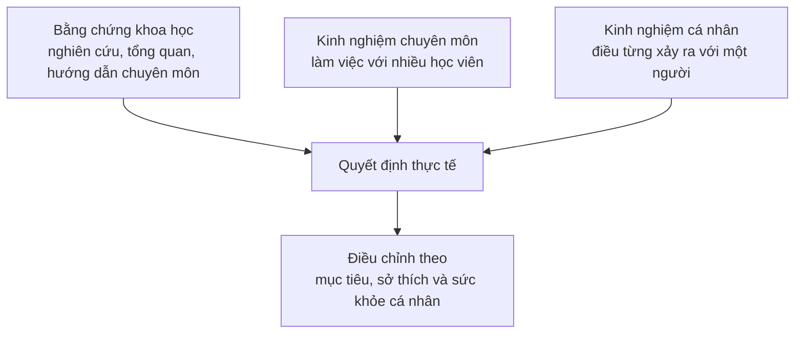

[](https://www.udemy.com/course/diet-nutrition-coach-certification-beginner-to-advanced/?srsltid=AfmBOorrsiY-Z4Iy7S1v8jOrRT6vaDfhrtPBhhzXPcvKc0YXLol4S538&utm_source=chatgpt.com)

# 002 — Làm quen với giảng viên

## Get to Know Your Instructor

| Thuộc tính        | Nội dung                                                                                                             |
| ----------------- | -------------------------------------------------------------------------------------------------------------------- |
| **Học phần**      | Module 01 — Introduction                                                                                             |
| **Bài học**       | Get to Know Your Instructor                                                                                          |
| **Thời lượng**    | 03:52 — Xem trước miễn phí                                                                                           |
| **Giảng viên**    | Felix Harder                                                                                                         |
| **Chủ đề chính**  | Hành trình thể hình của giảng viên, triết lý học tập dựa trên bằng chứng và cách đánh giá nguồn thông tin dinh dưỡng |
| **Mức độ**        | Nhập môn                                                                                                             |
| **Bài liên quan** | 056 — Cholesterol, 057 — Salt, 088 — Testosterone, 090 — How to Do Your Own Research                                 |

Trang khóa học chính thức xác nhận Felix Harder là người xây dựng khóa học và bài **Get to Know Your Instructor** có thời lượng 03:52. Khóa học tập trung vào calorie, macronutrient, meal planning, giảm mỡ, tăng cơ và các quan niệm sai lầm phổ biến trong dinh dưỡng. ([Udemy][1])

> [!IMPORTANT]
> Mục đích của bài học không phải để chứng minh rằng mọi lời giảng viên nói đều đúng. Bài học cung cấp **bối cảnh** giúp người học hiểu kinh nghiệm, góc nhìn và giới hạn chuyên môn của người đang hướng dẫn mình.

---

## 1. Mục tiêu bài học

Sau khi hoàn thành bài này, người học có thể:

* Trình bày được hành trình thể hình và nền tảng thực hành của giảng viên.
* Hiểu vì sao khóa học ưu tiên những thay đổi đơn giản, thực tế và có thể duy trì lâu dài.
* Phân biệt giữa:

  * kinh nghiệm cá nhân;
  * kiến thức huấn luyện thực tế;
  * bằng chứng khoa học;
  * tư vấn dinh dưỡng điều trị.
* Nhận biết những dấu hiệu thường gặp của nội dung dinh dưỡng thiếu đáng tin cậy.
* Hình thành thói quen đặt câu hỏi:

> **“Ai đang đưa ra lời khuyên này, họ dựa vào bằng chứng nào và họ có đang cố bán cho mình thứ gì không?”**

---

## 2. Giảng viên là ai?

Giảng viên của khóa học là **Felix Harder** — người làm nội dung và đào tạo trong các lĩnh vực sức khỏe, dinh dưỡng, fitness, coaching và phát triển cá nhân. Hồ sơ Udemy của ông cho biết ông đã hoạt động trên nền tảng gần mười năm và giảng dạy cho người học ở nhiều quốc gia. ([Udemy][2])

Trong bài học, Felix tự giới thiệu mình là:

* huấn luyện viên fitness và dinh dưỡng;
* người xây dựng chương trình tập luyện;
* người sáng lập nội dung trên NutritionAndFitness.Net;
* người từng trải qua cả quá trình tăng cơ, tăng cân quá mức và giảm mỡ;
* người ưu tiên giải pháp đơn giản, bền vững thay vì các trào lưu ngắn hạn.

Điểm đáng chú ý là giảng viên không bắt đầu với hình ảnh một “chuyên gia hoàn hảo”. Ông kể lại những sai lầm, giai đoạn thử nghiệm và thất bại trước khi tìm ra cách tiếp cận phù hợp hơn.

---

## 3. Hành trình thể hình của giảng viên

### 3.1. Điểm xuất phát

Khi mới bắt đầu tập luyện, Felix là một thiếu niên khá gầy:

* chiều cao khoảng **6 feet 1 inch**, tương đương gần **185 cm**;
* cân nặng khoảng **150 pound**, tương đương gần **68 kg**;
* mục tiêu ban đầu là thoát khỏi vóc dáng gầy và xây dựng thêm cơ bắp.

Ở giai đoạn này, ông chưa có kiến thức rõ ràng về tập luyện hay dinh dưỡng. Phương pháp chủ yếu là quan sát và sao chép những gì bạn bè đang làm trong phòng gym.

Kết quả không đáng kể vì:

* chương trình tập không được xây dựng có hệ thống;
* dinh dưỡng gần như không được điều chỉnh;
* không có phương pháp theo dõi tiến bộ;
* không hiểu mối quan hệ giữa calorie, tăng cân và tăng cơ.

### 3.2. Bắt đầu nghiên cứu

Sau vài tháng không đạt được kết quả mong muốn, Felix bắt đầu tự tìm hiểu về:

* chương trình tăng sức mạnh;
* nguyên tắc xây dựng cơ bắp;
* giai đoạn tăng cân để hỗ trợ phát triển cơ;
* giai đoạn giảm mỡ nhưng cố gắng duy trì khối lượng cơ.

Ông áp dụng chiến lược thường được gọi là:

* **Bulking:** chủ động ăn nhiều năng lượng hơn để tăng cân và hỗ trợ tăng cơ.
* **Cutting:** giảm lượng năng lượng ăn vào để giảm mỡ và làm cơ bắp rõ hơn.

Phương pháp này giúp ông mạnh hơn và tăng cân. Tuy nhiên, do đẩy lượng calorie lên quá cao, ông cũng tích lũy nhiều mỡ hơn mong muốn.

### 3.3. Học từ sai lầm

Giai đoạn tăng cân quá mức mang lại một bài học quan trọng:

> Một phương pháp đúng về nguyên tắc vẫn có thể tạo ra kết quả không mong muốn nếu áp dụng quá cực đoan.

Vấn đề không nhất thiết nằm ở việc tăng calorie, mà nằm ở:

* mức thặng dư calorie quá lớn;
* tốc độ tăng cân quá nhanh;
* thiếu theo dõi thành phần cơ thể;
* không điều chỉnh kế hoạch theo phản hồi thực tế.

Sau đó, Felix chuyển sang giai đoạn giảm mỡ để cơ bắp hiện rõ hơn. Quá trình này không diễn ra hoàn toàn suôn sẻ. Ông gặp nhiều lần chững lại và thất bại trước khi tìm được lối sống phù hợp.

---

## 4. Sơ đồ hành trình thay đổi

```mermaid
flowchart LR
    A["Thiếu niên gầy<br/>khoảng 185 cm — 68 kg"]
    B["Sao chép bạn bè<br/>trong phòng gym"]
    C["Ít kết quả<br/>không cải thiện dinh dưỡng"]
    D["Bắt đầu nghiên cứu<br/>tập luyện và dinh dưỡng"]
    E["Bulking<br/>tăng sức mạnh và cơ bắp"]
    F["Ăn dư quá nhiều<br/>tăng thêm nhiều mỡ"]
    G["Cutting<br/>giảm mỡ và giữ cơ"]
    H["Gặp trở ngại<br/>và những lần chững lại"]
    I["Chuyển sang phương pháp<br/>đơn giản và bền vững"]
    J["Xây dựng chương trình riêng<br/>và hướng dẫn người khác"]

    A --> B --> C --> D --> E --> F --> G --> H --> I --> J
```



### Thông điệp của hành trình

```text
Sai lầm
   ↓
Quan sát kết quả
   ↓
Tìm hiểu nguyên nhân
   ↓
Điều chỉnh phương pháp
   ↓
Lặp lại trong thời gian dài
   ↓
Tiến bộ bền vững
```

Sự thay đổi thể hình không phải là một đường thẳng đi lên. Nó thường bao gồm:

* giai đoạn tiến bộ nhanh;
* giai đoạn chững lại;
* kế hoạch không phù hợp;
* những lần phải quay lại điều chỉnh;
* thay đổi về kiến thức, thói quen và tư duy.

---

## 5. Tiến bộ không diễn ra theo đường thẳng

Một trong những thông điệp quan trọng nhất của bài học là:

> **Quá trình cải thiện sức khỏe và thể hình sẽ không bao giờ hoàn toàn là một đường thẳng.**

Tương tự việc xây dựng sự nghiệp hoặc doanh nghiệp, người tập sẽ gặp:

* lịch học hoặc công việc bận rộn;
* thay đổi thời gian sinh hoạt;
* thiếu động lực;
* chấn thương hoặc bệnh;
* cân nặng dao động;
* thời kỳ không tăng được mức tạ;
* những bữa ăn nằm ngoài kế hoạch.

Mục tiêu thực tế không phải là loại bỏ mọi trở ngại. Mục tiêu là xây dựng một hệ thống có thể tiếp tục hoạt động khi trở ngại xuất hiện.

### So sánh hai tư duy

| Tư duy thiếu bền vững                        | Tư duy bền vững                         |
| -------------------------------------------- | --------------------------------------- |
| Phải thực hiện kế hoạch hoàn hảo             | Chấp nhận kế hoạch đôi lúc bị gián đoạn |
| Một bữa ăn sai làm hỏng toàn bộ chế độ       | Quay lại kế hoạch ở bữa ăn tiếp theo    |
| Cân nặng tăng một ngày nghĩa là tăng mỡ      | Quan sát xu hướng trung bình nhiều tuần |
| Không thấy kết quả nhanh thì đổi phương pháp | Theo dõi đủ lâu trước khi điều chỉnh    |
| Cố tránh mọi trở ngại                        | Học cách xử lý trở ngại                 |

---

## 6. Từ trào lưu đến phương pháp bền vững

Theo giảng viên, nhiều nội dung fitness thường quảng bá những lời hứa như:

* có vóc dáng người mẫu chỉ sau vài tuần;
* giảm cân nhanh mà không cần thay đổi thói quen;
* chỉ cần mua một sản phẩm cụ thể;
* một phương pháp duy nhất có thể phù hợp với tất cả mọi người.

Felix cho biết ông dần mất hứng thú với những tạp chí, sản phẩm và phương pháp đang được quảng bá quá mức. Thay vào đó, ông tập trung vào:

1. những thay đổi nhỏ;
2. những nguyên tắc đã được kiểm chứng;
3. phương pháp có thể duy trì lâu dài;
4. chương trình phù hợp với sở thích và hoàn cảnh cá nhân.

Trang giới thiệu khóa học cũng mô tả khóa học như một chương trình từng bước, thay vì một chế độ ăn theo trào lưu chỉ quy định cứng nhắc thực phẩm nào được hoặc không được ăn. ([Udemy][1])

---

## 7. Chế độ ăn tốt nhất phải phù hợp với người thực hiện

Một câu quan trọng trong bài học là:

> **“The best workouts and diets are those that are built around what you like, and not the latest fad.”**

Có thể hiểu là:

> Chương trình tập và chế độ ăn tốt nhất không nhất thiết là chương trình đang phổ biến nhất, mà là chương trình được xây dựng quanh nhu cầu, sở thích và khả năng duy trì của chính bạn.

### Một chế độ ăn phù hợp cần xem xét

| Yếu tố                  | Câu hỏi cần đặt ra                                                            |
| ----------------------- | ----------------------------------------------------------------------------- |
| **Mục tiêu**            | Muốn giảm mỡ, tăng cơ, duy trì cân nặng hay cải thiện sức khỏe?               |
| **Nhu cầu năng lượng**  | Cơ thể cần khoảng bao nhiêu calorie mỗi ngày?                                 |
| **Sở thích ăn uống**    | Những thực phẩm nào người học thực sự thích và có thể ăn lâu dài?             |
| **Điều kiện tài chính** | Kế hoạch có phù hợp với ngân sách không?                                      |
| **Lịch sinh hoạt**      | Có thể chuẩn bị và ăn theo lịch này mỗi ngày không?                           |
| **Văn hóa**             | Kế hoạch có sử dụng được thực phẩm quen thuộc tại địa phương không?           |
| **Khả năng duy trì**    | Có thể tiếp tục trong nhiều tháng thay vì chỉ vài ngày không?                 |
| **Tình trạng sức khỏe** | Có bệnh lý, dị ứng hoặc thuốc đang sử dụng cần được chuyên gia xem xét không? |

### Ví dụ

Một người thích cơm không nhất thiết phải loại bỏ hoàn toàn cơm để giảm mỡ. Thay vào đó, kế hoạch có thể:

* giữ cơm trong khẩu phần;
* điều chỉnh lượng ăn;
* bổ sung nguồn protein;
* tăng rau và thực phẩm giàu chất xơ;
* theo dõi tổng lượng calorie.

Đây thường là cách tiếp cận dễ duy trì hơn việc cấm hoàn toàn một nhóm thực phẩm quen thuộc.

---

## 8. Kinh nghiệm cá nhân có giá trị gì?

Câu chuyện thay đổi thể hình của giảng viên có giá trị vì nó cho thấy:

* ông đã từng gặp các vấn đề giống người mới;
* ông hiểu cảm giác không biết bắt đầu từ đâu;
* ông từng áp dụng kế hoạch quá mức;
* ông đã trải qua cả tăng cơ, tăng mỡ và giảm cân;
* ông hiểu rằng tính tuân thủ ảnh hưởng mạnh đến kết quả thực tế.

Tuy nhiên, kinh nghiệm cá nhân chỉ nên được xem là:

* nguồn tạo giả thuyết;
* ví dụ minh họa;
* dữ liệu thực tế từ một cá nhân;
* nền tảng để hiểu tâm lý và khó khăn của người tập.

Kinh nghiệm cá nhân **không tự động chứng minh** rằng một phương pháp sẽ hiệu quả hoặc an toàn với tất cả mọi người.

---

## 9. Ba tầng thông tin cần phân biệt



### 9.1. Kinh nghiệm cá nhân

Ví dụ:

> “Tôi bỏ hoàn toàn carbohydrate và giảm được 5 kg.”

Thông tin còn thiếu:

* người đó ăn bao nhiêu calorie trước và sau khi đổi chế độ;
* lượng nước và glycogen thay đổi thế nào;
* khối lượng cơ có được duy trì không;
* phương pháp có duy trì được lâu dài không;
* người khác có nhận được kết quả tương tự không.

### 9.2. Kinh nghiệm huấn luyện

Huấn luyện viên làm việc với nhiều người có thể nhận biết:

* kế hoạch nào quá khó duy trì;
* trở ngại thường xuất hiện ở đâu;
* cách đơn giản hóa việc chuẩn bị bữa ăn;
* cách xây dựng thói quen;
* cách điều chỉnh chương trình theo phản hồi thực tế.

Đây là giá trị mà một nghiên cứu ngắn hạn trong môi trường kiểm soát đôi khi không phản ánh đầy đủ.

### 9.3. Bằng chứng khoa học

Bằng chứng khoa học giúp trả lời:

* tác động trung bình của một phương pháp;
* mức độ chắc chắn của kết luận;
* lợi ích và nguy cơ;
* nhóm đối tượng đã được nghiên cứu;
* trường hợp nào chưa đủ dữ liệu.

Nutrition.gov của USDA duy trì riêng một nhóm tài nguyên giúp người đọc nhận diện thông tin dinh dưỡng sai lệch, không đầy đủ hoặc gây hiểu nhầm. ([Nutrition][3])

---

## 10. Khung ba câu hỏi để đánh giá nguồn dinh dưỡng

Khi xem một video, bài viết, khóa học hoặc quảng cáo sản phẩm, hãy kiểm tra ba yếu tố sau.

| Câu hỏi                       | Dấu hiệu đáng tin cậy                                                  | Dấu hiệu cần cảnh giác                                                                               |
| ----------------------------- | ---------------------------------------------------------------------- | ---------------------------------------------------------------------------------------------------- |
| **1. Người nói dựa vào đâu?** | Dẫn nguồn; phân biệt dữ liệu với ý kiến; thừa nhận điểm chưa chắc chắn | Chỉ nói “tôi đã thử và hiệu quả”; không có nguồn; dùng một nghiên cứu duy nhất để kết luận tuyệt đối |
| **2. Họ đang bán gì?**        | Sản phẩm được tách biệt với kết luận; công khai xung đột lợi ích       | Mọi vấn đề đều dẫn đến cùng một loại thực phẩm bổ sung, khóa học hoặc gói tư vấn                     |
| **3. Họ nói gì về ngoại lệ?** | Nêu đối tượng phù hợp, không phù hợp, giới hạn và rủi ro               | Khẳng định hiệu quả với tất cả mọi người; không đề cập bệnh lý, thuốc hoặc tác dụng phụ              |

### Mở rộng thành quy trình kiểm tra năm bước

```text
Ai đang nói?
      ↓
Họ đưa ra tuyên bố gì?
      ↓
Tuyên bố dựa trên loại bằng chứng nào?
      ↓
Có lợi ích tài chính hoặc xung đột lợi ích không?
      ↓
Thông tin có phù hợp với tình trạng của mình không?
```

---

## 11. Ví dụ đánh giá một tuyên bố

### Tuyên bố

> “Loại thực phẩm bổ sung này giúp đốt mỡ nhanh gấp ba lần mà không cần thay đổi chế độ ăn.”

### Phân tích

| Tiêu chí                      | Đánh giá                                                       |
| ----------------------------- | -------------------------------------------------------------- |
| **Tuyên bố có cụ thể không?** | Không rõ “gấp ba lần” được đo bằng chỉ số nào                  |
| **Nguồn bằng chứng**          | Cần tìm nghiên cứu trên người, liều lượng và thời gian sử dụng |
| **Nhóm đối tượng**            | Không rõ nghiên cứu trên người khỏe mạnh hay người có bệnh     |
| **So sánh**                   | Không rõ so với giả dược, chế độ ăn hay nhóm không can thiệp   |
| **Xung đột lợi ích**          | Người đưa ra tuyên bố có thể đang bán chính sản phẩm đó        |
| **Ngoại lệ**                  | Không đề cập thuốc đang dùng, bệnh nền hoặc tác dụng phụ       |
| **Kết luận**                  | Chưa đủ thông tin để tin hoặc mua sản phẩm                     |

Đối với vitamin, khoáng chất và thực phẩm bổ sung, NIH Office of Dietary Supplements cung cấp các tài liệu dựa trên bằng chứng về hiệu quả, độ an toàn, liều lượng và tương tác với thuốc. ([ODS][4])

---

## 12. Dấu hiệu của một người hướng dẫn đáng tin cậy

### Dấu hiệu tích cực

* Nói rõ nền tảng và phạm vi chuyên môn.
* Phân biệt ý kiến cá nhân với dữ liệu nghiên cứu.
* Không hứa hẹn kết quả phi thực tế.
* Thừa nhận phương pháp có thể không phù hợp với tất cả mọi người.
* Khuyến khích người học tự kiểm tra nguồn.
* Sẵn sàng thay đổi quan điểm khi có bằng chứng mới.
* Ưu tiên hành vi bền vững hơn giải pháp cực đoan.
* Chỉ rõ khi nào người học cần gặp chuyên gia y tế.

### Dấu hiệu cảnh báo

* Dùng ngoại hình làm bằng chứng chính.
* Tuyên bố chỉ có một chế độ ăn đúng.
* Gọi tất cả chuyên gia bất đồng là “bị ngành công nghiệp mua chuộc”.
* Dựa quá nhiều vào ảnh trước–sau.
* Quảng cáo kết quả chắc chắn trong thời gian rất ngắn.
* Mọi nội dung đều dẫn đến việc bán một sản phẩm.
* Khuyên ngừng thuốc hoặc thay đổi điều trị.
* Không đề cập tác dụng phụ, giới hạn hoặc trường hợp chống chỉ định.

---

## 13. Ngoại hình không phải bằng chứng khoa học

Một người có vóc dáng đẹp có thể có:

* nhiều năm tập luyện;
* điều kiện di truyền thuận lợi;
* lịch sinh hoạt khác với người xem;
* khả năng tiếp cận huấn luyện và thực phẩm tốt hơn;
* chiến lược chụp ảnh, ánh sáng hoặc chỉnh sửa;
* những yếu tố không được công khai.

Do đó, ngoại hình chỉ chứng minh rằng người đó đang có ngoại hình như vậy tại thời điểm chụp. Nó không chứng minh rằng:

* mọi lời khuyên của họ đều chính xác;
* phương pháp của họ tạo ra kết quả đó;
* người khác sẽ nhận được kết quả tương tự;
* phương pháp an toàn và tối ưu về lâu dài.

Tương tự, số lượng người theo dõi cũng phản ánh khả năng truyền thông nhiều hơn là chất lượng khoa học của nội dung.

---

## 14. Ranh giới giữa huấn luyện và điều trị

Trong bài học, Felix giới thiệu mình là nutritionist và fitness coach. Đây là phần mô tả nền tảng của giảng viên, nhưng không nên tự động hiểu là bác sĩ hoặc chuyên gia có thẩm quyền điều trị mọi bệnh lý.

Cần phân biệt:

| Hoạt động                                                    | Huấn luyện fitness/dinh dưỡng phổ thông | Chuyên gia y tế hoặc dinh dưỡng lâm sàng |
| ------------------------------------------------------------ | --------------------------------------: | ---------------------------------------: |
| Hướng dẫn xây dựng thói quen ăn uống                         |                                  Có thể |                                   Có thể |
| Giải thích calorie và macronutrient cơ bản                   |                                  Có thể |                                   Có thể |
| Hỗ trợ lập thực đơn cho người khỏe mạnh                      |        Có thể, trong phạm vi chuyên môn |                                   Có thể |
| Chẩn đoán bệnh                                               |                                   Không |               Theo thẩm quyền chuyên môn |
| Điều chỉnh thuốc                                             |                                   Không |          Bác sĩ hoặc người có thẩm quyền |
| Điều trị tiểu đường, bệnh thận hoặc bệnh tim bằng dinh dưỡng |                  Không nên tự thực hiện |                   Cần chuyên gia phù hợp |
| Xử lý rối loạn ăn uống                                       |                        Cần chuyển tuyến |                     Nhóm chuyên môn y tế |
| Kê chế độ ăn điều trị cá nhân hóa                            |      Ngoài phạm vi huấn luyện phổ thông |   Chuyên gia dinh dưỡng lâm sàng phù hợp |

Trang chính thức của Felix cũng nêu rằng nội dung trên website chỉ nhằm cung cấp thông tin và không thay thế chẩn đoán, điều trị hoặc tư vấn y tế. ([Felix Harder][5])

Medical nutrition therapy là lĩnh vực sử dụng can thiệp dinh dưỡng cá nhân hóa để hỗ trợ điều trị hoặc quản lý bệnh và thường do Registered Dietitian Nutritionist thực hiện như một phần của nhóm chăm sóc sức khỏe. ([Eat Right][6])

> [!WARNING]
> Người đang có bệnh tim mạch, tiểu đường, bệnh thận, bệnh gan, rối loạn ăn uống, đang mang thai, sử dụng thuốc hoặc có triệu chứng bất thường không nên dựa hoàn toàn vào một khóa học fitness để tự điều trị.

---

## 15. Liên hệ với các bài học sau

### Bài 056 — Trứng và cholesterol

Không nên kết luận chỉ từ:

* một video ngắn;
* kinh nghiệm cá nhân;
* một chỉ số xét nghiệm;
* một nghiên cứu không phù hợp với đối tượng.

Cần xem xét tình trạng sức khỏe, tổng chế độ ăn và hướng dẫn của chuyên gia phù hợp.

### Bài 057 — Muối

Nhu cầu và mức độ hạn chế natri có thể khác nhau giữa:

* người khỏe mạnh;
* vận động viên ra nhiều mồ hôi;
* người tăng huyết áp;
* người có bệnh tim hoặc bệnh thận.

### Bài 088 — Tăng testosterone tự nhiên

Cần cảnh giác với:

* lời hứa tăng testosterone rất lớn;
* thực phẩm bổ sung không có dữ liệu rõ ràng;
* nhầm lẫn giữa thay đổi nhỏ trong xét nghiệm và thay đổi có ý nghĩa thực tế.

### Bài 090 — Cách tự nghiên cứu

Bài 090 sẽ phát triển trực tiếp kỹ năng được giới thiệu ở đây:

1. xác định câu hỏi;
2. tìm nguồn đáng tin cậy;
3. kiểm tra chất lượng bằng chứng;
4. xem xét bối cảnh;
5. tránh kết luận vượt quá dữ liệu.

---

## 16. Bài tập thực hành

### Bài tập 1 — Kiểm tra một người sáng tạo nội dung

Chọn một tài khoản fitness hoặc dinh dưỡng thường xem và trả lời:

| Câu hỏi                                              | Ghi chú của bạn |
| ---------------------------------------------------- | --------------- |
| Họ tự giới thiệu chuyên môn như thế nào?             |                 |
| Có thể xác minh thông tin đó ở đâu?                  |                 |
| Họ thường dẫn loại nguồn nào?                        |                 |
| Họ có bán sản phẩm không?                            |                 |
| Nội dung miễn phí có luôn dẫn tới sản phẩm đó không? |                 |
| Họ có thừa nhận giới hạn không?                      |                 |
| Họ có đưa ra lời hứa tuyệt đối không?                |                 |
| Họ có khuyên người bệnh tìm chuyên gia không?        |                 |

### Bài tập 2 — Tách sự thật khỏi câu chuyện

Với câu chuyện thay đổi của Felix, hãy chia thông tin thành ba nhóm:

| Nhóm                                 | Ví dụ                                                       |
| ------------------------------------ | ----------------------------------------------------------- |
| **Sự kiện cá nhân**                  | Ông bắt đầu khá gầy và muốn tăng cơ                         |
| **Bài học thực hành**                | Tăng calorie quá nhiều có thể làm tăng mỡ quá mức           |
| **Kết luận cần bằng chứng rộng hơn** | Một phương pháp có hiệu quả với toàn bộ người tập hay không |

### Bài tập 3 — Viết tuyên bố thận trọng hơn

Chuyển câu:

> “Chế độ ăn này chắc chắn giúp tất cả mọi người giảm cân.”

thành:

> “Chế độ ăn này có thể giúp một số người giảm cân nếu nó tạo ra mức thâm hụt năng lượng và họ có thể duy trì kế hoạch, nhưng mức độ phù hợp còn phụ thuộc vào sức khỏe, sở thích và hoàn cảnh cá nhân.”

---

## 17. Checklist thực hành

### Hiểu về giảng viên

* [ ] Tôi biết giảng viên của khóa học là Felix Harder.
* [ ] Tôi hiểu điểm xuất phát và mục tiêu thể hình ban đầu của giảng viên.
* [ ] Tôi biết ông từng tăng cân và tích lũy nhiều mỡ hơn dự kiến.
* [ ] Tôi hiểu những thất bại được sử dụng như bài học, không phải để tạo hình ảnh hoàn hảo.

### Đánh giá thông tin

* [ ] Tôi phân biệt được kinh nghiệm cá nhân với bằng chứng khoa học.
* [ ] Tôi không xem ngoại hình hoặc số follower là bằng chứng.
* [ ] Tôi biết kiểm tra nguồn của một tuyên bố.
* [ ] Tôi biết xem xét xung đột lợi ích.
* [ ] Tôi cảnh giác với lời hứa áp dụng cho tất cả mọi người.
* [ ] Tôi biết tìm thông tin về giới hạn, rủi ro và ngoại lệ.

### Giới hạn chuyên môn

* [ ] Tôi hiểu khóa học chủ yếu hướng đến người khỏe mạnh muốn cải thiện dinh dưỡng và thành phần cơ thể.
* [ ] Tôi không sử dụng nội dung khóa học để tự chẩn đoán bệnh.
* [ ] Tôi không tự ý thay đổi thuốc dựa trên video hoặc bài học.
* [ ] Tôi biết khi nào cần tìm bác sĩ hoặc chuyên gia dinh dưỡng lâm sàng phù hợp.

---

## 18. Ghi nhớ nhanh

| Nội dung                | Ý chính                                                                        |
| ----------------------- | ------------------------------------------------------------------------------ |
| **Điểm xuất phát**      | Giảng viên từng là một thiếu niên gầy, thiếu kiến thức tập luyện và dinh dưỡng |
| **Sai lầm đầu tiên**    | Sao chép bạn bè và không chú ý đến chế độ ăn                                   |
| **Sai lầm tiếp theo**   | Bulking quá mức, tăng cả cơ lẫn lượng mỡ không mong muốn                       |
| **Bài học lớn**         | Tiến bộ thể hình không diễn ra theo đường thẳng                                |
| **Triết lý**            | Giữ mọi thứ đơn giản và tập trung vào điều đã được chứng minh                  |
| **Tính cá nhân hóa**    | Chế độ ăn tốt phải phù hợp với sở thích và khả năng duy trì                    |
| **Cách đánh giá nguồn** | Kiểm tra bằng chứng, lợi ích tài chính và các trường hợp ngoại lệ              |
| **Giới hạn**            | Nội dung giáo dục fitness không thay thế chẩn đoán hoặc điều trị y tế          |

---

## 19. Tóm tắt bài học

Felix Harder bắt đầu hành trình fitness với vóc dáng gầy và gần như không có kiến thức về dinh dưỡng. Ban đầu, ông sao chép cách tập của bạn bè nhưng không đạt được kết quả đáng kể. Sau khi nghiên cứu về tăng cơ, tăng cân và giảm mỡ, ông đã tiến bộ nhưng cũng mắc sai lầm khi ăn dư quá nhiều, dẫn đến lượng mỡ tăng cao hơn mong muốn.

Những giai đoạn tiến bộ, thất bại và điều chỉnh giúp ông hình thành một triết lý đơn giản:

> **Không chạy theo lời hứa nhanh chóng. Hãy tập trung vào những nguyên tắc có bằng chứng, phù hợp với bản thân và có thể duy trì lâu dài.**

Câu chuyện cá nhân giúp người học hiểu bối cảnh của giảng viên nhưng không phải là bằng chứng tuyệt đối cho mọi lời khuyên. Khi tiếp nhận thông tin dinh dưỡng, cần luôn kiểm tra:

1. người nói dựa vào bằng chứng nào;
2. họ có lợi ích tài chính gì;
3. họ có trình bày giới hạn và trường hợp ngoại lệ hay không.

Cuối cùng, khóa học cung cấp kiến thức dinh dưỡng và meal planning cho mục tiêu fitness phổ thông. Nội dung này không thay thế việc chẩn đoán, điều trị hoặc tư vấn cá nhân từ chuyên gia y tế.

---

## 20. Ảnh minh họa đề xuất

### Ảnh 1 — Chân dung giảng viên Felix Harder

* **Vị trí chèn:** Sau phần “Giảng viên là ai?”
* **Mục đích:** Giúp người học nhận diện giảng viên.
* [Xem ảnh và hồ sơ Felix Harder trên Udemy](https://www.udemy.com/user/felix-harder/)

### Ảnh 2 — Ảnh đại diện khóa học Nutrition Masterclass

* **Vị trí chèn:** Ngay dưới tiêu đề bài học.
* **Mục đích:** Thể hiện bối cảnh chính thức của bài học.
* [Xem ảnh khóa học trên Udemy](https://www.udemy.com/course/nutrition-masterclass-build-your-perfect-diet-meal-plan/)

### Ảnh 3 — Lập kế hoạch dinh dưỡng thể thao

* **Vị trí chèn:** Phần “Chế độ ăn tốt nhất phải phù hợp với người thực hiện”.
* **Mục đích:** Minh họa việc kết hợp thực phẩm, ghi chép và lập kế hoạch.
* [Xem ảnh minh họa Sports Nutrition Meal Planning](https://www.healthhub.sg/well-being-and-lifestyle/food-diet-and-nutrition/power_up_sports_nutrition)

### Ảnh 4 — Nguồn kiểm tra thông tin dinh dưỡng

* **Vị trí chèn:** Phần “Khung ba câu hỏi để đánh giá nguồn dinh dưỡng”.
* **Mục đích:** Giới thiệu nguồn tham khảo đáng tin cậy.
* [Nutrition.gov — Nutrition Misinformation and Fraud](https://www.nutrition.gov/nutrition-misinformation-and-fraud)
* [NIH Office of Dietary Supplements — Fact Sheets](https://ods.od.nih.gov/factsheets/list-all/)

[1]: https://www.udemy.com/course/nutrition-masterclass-build-your-perfect-diet-meal-plan/ "Nutrition Masterclass: Build Your Perfect Diet & Meal Plan"
[2]: https://www.udemy.com/user/felix-harder/ "
    Felix Harder | Best Selling Instructor
\| Udemy"
[3]: https://www.nutrition.gov/nutrition-misinformation-and-fraud?utm_source=chatgpt.com "Nutrition Misinformation and Fraud"
[4]: https://ods.od.nih.gov/HealthInformation/healthprofessional.aspx?utm_source=chatgpt.com "Information for Health Professionals"
[5]: https://www.felixharder.net/program?utm_source=chatgpt.com "Recovery Program"
[6]: https://sm.eatright.org/MNTcompact?utm_source=chatgpt.com "Medical Nutrition Therapy"
