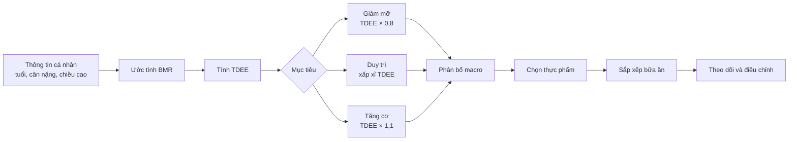
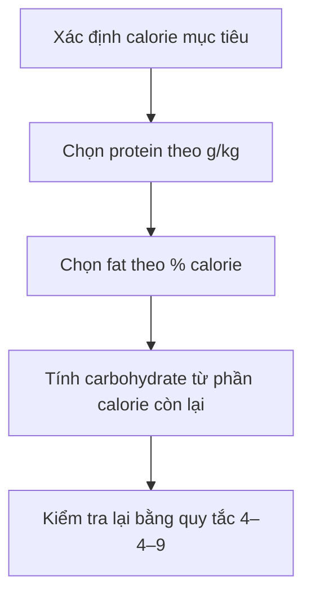

# 003 — Nền tảng xây dựng chế độ ăn và thực đơn


> **Ảnh minh họa:** [Lập kế hoạch bữa ăn — Yaroslav Shuraev/Pexels](https://www.pexels.com/photo/a-woman-making-a-meal-plan-8844383/)

| Thuộc tính | Nội dung |
|---|---|
| **Module** | Module 01 — Introduction |
| **Bài học gốc** | Downloadable Resources & Diet Guides |
| **Phiên bản biên soạn** | Bài lý thuyết tổng hợp từ toàn bộ tài liệu đính kèm |
| **Chủ đề chính** | TDEE, calorie, macronutrient, lựa chọn thực phẩm, giảm mỡ, tăng cơ, lịch ăn và thực phẩm bổ sung |

> [!IMPORTANT]
> Bài này đã được biên soạn lại thành một chương lý thuyết hoàn chỉnh. Các tài liệu giảm mỡ, tăng cơ, macronutrient, TDEE và thực phẩm bổ sung được hợp nhất vào cùng một quy trình, thay vì chỉ giới thiệu chúng như những file đính kèm.

---

## 1. Mục tiêu học tập

Sau bài học, bạn có thể:

- Giải thích được **BMR**, **TDEE**, **TEF**, **NEAT** và **TEA**.
- Ước tính lượng calorie duy trì từ BMR và hệ số hoạt động.
- Chuyển lượng calorie duy trì thành mục tiêu giảm mỡ hoặc tăng cơ theo phương pháp của khóa học.
- Tính protein, fat và carbohydrate từ tổng calorie.
- Lựa chọn nguồn thực phẩm phù hợp cho từng nhóm macronutrient.
- Xây dựng cấu trúc bữa ăn quanh lịch tập luyện.
- Đọc, so sánh và tùy chỉnh các thực đơn mẫu thay vì sao chép máy móc.
- Hiểu vai trò và liều dùng được tác giả khóa học đề xuất cho creatine, protein powder, fish oil, caffeine và beta-alanine.
- Nhận biết những điểm cần kiểm tra lại khi tài liệu dùng lẫn trọng lượng sống, chín hoặc có số liệu chưa nhất quán.

---

## 2. Bức tranh tổng thể

Một chế độ ăn trong tài liệu được xây dựng theo chuỗi sau:



Nguyên tắc cốt lõi là:

> **Xác định năng lượng trước, phân bổ macronutrient sau, rồi mới chọn thực phẩm và thiết kế thực đơn.**

---

# Phần I — Năng lượng và TDEE

## 3. TDEE là gì?

**TDEE — Total Daily Energy Expenditure** là tổng lượng calorie cơ thể tiêu hao trong một ngày.

Theo tài liệu, TDEE được ước tính bằng cách:

1. Tính năng lượng cơ thể cần khi nghỉ ngơi.
2. Cộng thêm năng lượng tiêu hao do vận động và tập luyện.

TDEE là một **ước tính**, không phải con số tuyệt đối. Hai người có cùng tuổi, chiều cao và cân nặng vẫn có thể tiêu hao năng lượng khác nhau do chuyển hóa, khối lượng cơ, thói quen vận động và nhiều yếu tố cá nhân.

---

## 4. Các thành phần của tiêu hao năng lượng

| Ký hiệu | Tên đầy đủ | Ý nghĩa |
|---|---|---|
| **BMR** | Basal Metabolic Rate | Năng lượng cơ thể tiêu hao khi nghỉ ngơi hoàn toàn |
| **TEF** | Thermic Effect of Food | Năng lượng dùng để tiêu hóa và xử lý thức ăn |
| **NEAT** | Non-Exercise Activity Thermogenesis | Năng lượng từ hoạt động không phải tập luyện, như đi bộ, đứng, làm việc nhà |
| **TEA** | Thermic Effect of Activity | Năng lượng tiêu hao trong quá trình tập luyện |

Có thể hình dung:

```text
TDEE ≈ BMR + TEF + NEAT + TEA
```

Trong cách tính đơn giản của tài liệu, các thành phần hoạt động được đại diện bằng một **hệ số hoạt động** nhân với BMR.

---

## 5. Công thức tính BMR

### 5.1. Harris–Benedict

**Nữ:**

```text
BMR = 655 + 9,6 × cân nặng (kg)
          + 1,8 × chiều cao (cm)
          − 4,7 × tuổi
```

**Nam:**

```text
BMR = 66 + 13,7 × cân nặng (kg)
         + 5 × chiều cao (cm)
         − 6,8 × tuổi
```

---

### 5.2. Mifflin–St Jeor

**Nữ:**

```text
BMR = 10 × cân nặng (kg)
    + 6,25 × chiều cao (cm)
    − 5 × tuổi
    − 161
```

**Nam:**

```text
BMR = 10 × cân nặng (kg)
    + 6,25 × chiều cao (cm)
    − 5 × tuổi
    + 5
```

---

### 5.3. Katch–McArdle

Công thức này cần biết phần trăm mỡ cơ thể.

```text
Khối lượng nạc = cân nặng × (100 − % mỡ cơ thể) / 100
```

```text
BMR = 370 + 21,6 × khối lượng nạc (kg)
```

---

## 6. Hệ số hoạt động

Sau khi có BMR, tài liệu nhân BMR với hệ số hoạt động:

| Mức hoạt động | Mô tả trong tài liệu | Hệ số |
|---|---|---:|
| **Ít vận động** | Ít hoặc không tập, công việc bàn giấy | `1,2` |
| **Hoạt động nhẹ** | Tập nhẹ 1–3 ngày/tuần | `1,375` |
| **Hoạt động vừa** | Tập vừa 3–5 ngày/tuần | `1,55` |
| **Hoạt động cao** | Tập nặng 6–7 ngày/tuần | `1,725` |
| **Hoạt động rất cao** | Lao động nặng hoặc tập hai lần/ngày | `1,9` |

Công thức:

```text
TDEE = BMR × hệ số hoạt động
```

---

## 7. Ví dụ tính TDEE

Giả sử một nam giới:

- 25 tuổi.
- Cân nặng 70 kg.
- Chiều cao 175 cm.
- Tập ở mức vừa 3–5 ngày/tuần.

Dùng Mifflin–St Jeor:

```text
BMR = 10 × 70 + 6,25 × 175 − 5 × 25 + 5
    = 1.673,75 kcal/ngày
```

TDEE:

```text
TDEE = 1.673,75 × 1,55
     ≈ 2.594 kcal/ngày
```

Đây là lượng calorie duy trì **ước tính ban đầu**.

---

# Phần II — Chọn calorie theo mục tiêu

## 8. Calorie duy trì

Khi lượng calorie ăn vào xấp xỉ TDEE:

```text
Calorie nạp vào ≈ calorie tiêu hao
```

Cân nặng có xu hướng được duy trì, dù dao động ngắn hạn vẫn có thể xảy ra do nước, glycogen, thức ăn trong hệ tiêu hóa và nhiều yếu tố khác.

---

## 9. Mục tiêu giảm mỡ

Tài liệu giảm mỡ đề xuất mức thâm hụt khoảng **20% dưới mức duy trì**:

```text
Calorie giảm mỡ = TDEE × 0,8
```

Ví dụ:

```text
TDEE = 2.500 kcal
Calorie giảm mỡ = 2.500 × 0,8 = 2.000 kcal/ngày
```

Tài liệu mô tả mức này như một thâm hụt vừa phải và cho rằng có thể dẫn đến mức giảm khoảng **1–2 pound mỗi tuần**.

> [!NOTE]
> Đây là con số được trình bày trong tài liệu khóa học. Tốc độ thực tế phụ thuộc vào cân nặng ban đầu, mức tuân thủ, vận động, khả năng giữ nước và sai số trong ước tính TDEE.

---

## 10. Mục tiêu tăng cơ

Tài liệu tăng cơ đề xuất tăng khoảng **10% trên mức duy trì**:

```text
Calorie tăng cơ = TDEE × 1,1
```

Ví dụ:

```text
TDEE = 2.500 kcal
Calorie tăng cơ = 2.500 × 1,1 = 2.750 kcal/ngày
```

Theo tài liệu, trọng tâm của chế độ tăng cơ là:

1. Ăn đủ tổng calorie.
2. Ăn đủ tổng protein.
3. Kết hợp với tập kháng lực.

---

## 11. So sánh ba mục tiêu

| Mục tiêu | Công thức theo tài liệu | Ví dụ với TDEE 2.500 kcal |
|---|---:|---:|
| **Giảm mỡ** | `TDEE × 0,8` | `2.000 kcal` |
| **Duy trì** | `TDEE` | `2.500 kcal` |
| **Tăng cơ** | `TDEE × 1,1` | `2.750 kcal` |

---

# Phần III — Macronutrient

## 12. Ba nhóm macronutrient

**Macronutrient** là các chất dinh dưỡng cơ thể cần với lượng lớn:

- **Protein**.
- **Carbohydrate**.
- **Fat**.

Giá trị năng lượng được dùng trong tài liệu:

| Macronutrient | Năng lượng |
|---|---:|
| **Protein** | `4 kcal/g` |
| **Carbohydrate** | `4 kcal/g` |
| **Fat** | `9 kcal/g` |

Công thức kiểm tra:

```text
Tổng calorie
= protein (g) × 4
+ carbohydrate (g) × 4
+ fat (g) × 9
```

---

## 13. Lượng protein tham khảo

### 13.1. Cho mục tiêu tăng cơ

```text
1,76–2,2 g protein/kg cân nặng/ngày
```

Tương đương:

```text
0,8–1 g protein/pound cân nặng/ngày
```

Nếu một người có cân nặng 80 kg:

```text
Protein thấp = 80 × 1,76 = 140,8 g
Protein cao  = 80 × 2,2  = 176 g
```

---

### 13.2. Cho sức khỏe thông thường

```text
0,88–1,1 g protein/kg cân nặng/ngày
```

Tương đương:

```text
0,4–0,5 g protein/pound cân nặng/ngày
```

---

### 13.3. Trường hợp thừa cân nhiều

Tài liệu giảm mỡ đề xuất rằng người thừa cân đáng kể có thể dùng **cân nặng mục tiêu** thay cho cân nặng hiện tại khi tính protein.

---

## 14. Lượng fat tham khảo

Tài liệu đưa ra khoảng:

```text
15–35% tổng calorie hằng ngày
```

Nếu chưa biết bắt đầu từ đâu, tài liệu giảm mỡ gợi ý dùng khoảng:

```text
25% tổng calorie
```

Ví dụ với 2.000 kcal:

```text
Calorie từ fat = 2.000 × 25% = 500 kcal
Fat = 500 / 9 ≈ 55,6 g
```

---

## 15. Lượng carbohydrate tham khảo

Bảng macronutrient đưa ra khoảng:

```text
2,2–3,85 g carbohydrate/kg cân nặng/ngày
```

Tương đương:

```text
1–1,75 g carbohydrate/pound cân nặng/ngày
```

Tài liệu cũng sử dụng cách tính carbohydrate theo phần calorie còn lại:

```text
Carb calorie
= tổng calorie
− calorie từ protein
− calorie từ fat
```

```text
Carbohydrate (g) = carb calorie / 4
```

---

## 16. Ví dụ phân bổ macro 2.000 kcal

Ví dụ nguyên bản trong tài liệu:

- Tổng năng lượng: `2.000 kcal`.
- Protein: `145 g`.
- Fat: `55 g`.

Tính calorie từ protein:

```text
145 × 4 = 580 kcal
```

Tính calorie từ fat:

```text
55 × 9 = 495 kcal
```

Tài liệu làm tròn phần fat thành khoảng `500 kcal`.

Phần còn lại dành cho carbohydrate:

```text
2.000 − 580 − 500 = 920 kcal
```

```text
Carbohydrate = 920 / 4 = 230 g
```

Kết quả:

| Thành phần | Lượng |
|---|---:|
| **Calorie** | `2.000 kcal` |
| **Protein** | `145 g` |
| **Fat** | `55 g` |
| **Carbohydrate** | `230 g` |

---

## 17. Trình tự tính macro



Nếu đã đạt lượng protein, fat và carbohydrate tối thiểu nhưng vẫn còn calorie, bảng cheat sheet cho phép tăng thêm:

- Fat.
- Carbohydrate.
- Hoặc kết hợp cả hai theo sở thích cá nhân.

---

# Phần IV — Lựa chọn thực phẩm

## 18. Nguồn protein

Tài liệu khuyên xây dựng các bữa chính quanh một khẩu phần protein tương đối lớn.

Nguồn protein được liệt kê:

- Trứng.
- Thịt nạc.
- Ức gà.
- Đậu và các loại đậu hạt.
- Cá và hải sản.
- Đậu nành.

---

## 19. Nguồn carbohydrate

Tài liệu nhấn mạnh carbohydrate là nguồn năng lượng ưu tiên của cơ thể và có thể hỗ trợ sức mạnh khi tập luyện.

Nguồn carbohydrate:

- Ngũ cốc nguyên hạt.
- Yến mạch.
- Gạo.
- Quinoa.
- Mì và bánh mì nguyên cám.
- Đậu và các loại đậu hạt.
- Trái cây.
- Khoai tây.
- Rau và salad.

Tài liệu cho phép khoảng **10–20% lượng carbohydrate** đến từ bánh kẹo hoặc đồ ăn ít giá trị dinh dưỡng nếu điều đó giúp duy trì chế độ ăn lâu dài.

> [!IMPORTANT]
> Đây là cách diễn đạt của tài liệu. Nó không có nghĩa là bánh kẹo tương đương rau, trái cây hay ngũ cốc về chất xơ và vi chất.

---

## 20. Nguồn fat

### 20.1. Nguồn fat bão hòa được tài liệu liệt kê

- Bơ.
- Thịt bò ăn cỏ.
- Trứng.
- Sản phẩm từ sữa.
- Bơ dừa.

### 20.2. Nguồn fat không bão hòa

- Các loại hạt.
- Quả bơ.
- Cá béo.
- Dầu ô liu.

---

## 21. Điều chỉnh cho thực phẩm quen thuộc tại Việt Nam

> Phần này là **gợi ý biên tập bổ sung**, không nằm trong danh sách gốc của tài liệu.

| Nhóm | Một số lựa chọn quen thuộc |
|---|---|
| **Protein** | Ức gà, thịt lợn nạc, thịt bò, trứng, cá nục, cá thu, cá basa, tôm, đậu phụ |
| **Carbohydrate** | Cơm, gạo lứt, khoai lang, khoai tây, bún, phở, yến mạch, bí đỏ |
| **Fat** | Lạc, vừng, hạt điều, quả bơ, dầu ô liu, cá béo |
| **Rau và chất xơ** | Rau muống, cải xanh, súp lơ, cà rốt, bắp cải, mồng tơi |

Khi thay thế thực phẩm, cần so sánh:

- Trọng lượng khẩu phần.
- Calorie.
- Protein.
- Carbohydrate.
- Fat.
- Trạng thái sống hoặc chín.

---

# Phần V — Tư duy giảm mỡ

## 22. Xem chế độ ăn như thay đổi lối sống

Bước đầu tiên của kế hoạch giảm mỡ trong tài liệu không phải là tính toán mà là **thay đổi tư duy**.

Không nên xem chế độ ăn là một giai đoạn ngắn rồi quay lại hoàn toàn thói quen cũ. Tài liệu khuyến khích:

- Bắt đầu từ thay đổi nhỏ.
- Đánh giá trung thực thói quen hiện tại.
- Giảm dần thực phẩm dễ ăn quá mức.
- Thay một phần đồ ngọt bằng trái cây.
- Xây dựng thói quen có thể duy trì lâu dài.

Thông điệp chính:

> Kết quả dài hạn cần những thay đổi có thể duy trì dài hạn, không phụ thuộc vào một “siêu thực phẩm” hay mẹo thần kỳ.

---

## 23. Chọn thực phẩm cho giảm mỡ

Tài liệu ưu tiên thực phẩm:

- Có thể tích lớn.
- Mật độ calorie thấp.
- Nhiều nước.
- Nhiều chất xơ.
- Giúp no lâu.

Cấu trúc đơn giản:

```text
Một nguồn protein
+ một nguồn carbohydrate giàu chất xơ hoặc rau
+ một lượng fat được kiểm soát
```

Ví dụ trong tài liệu:

```text
Rau hỗn hợp + đậu + thịt gà
```

Các nguồn fat như hạt và quả bơ vẫn có thể dùng, nhưng cần kiểm soát khẩu phần vì chúng có mật độ calorie cao.

---

# Phần VI — Tư duy tăng cơ

## 24. Hai ưu tiên chính

Tài liệu tăng cơ xem hai yếu tố quan trọng nhất là:

1. **Tổng calorie**.
2. **Tổng protein**.

Tài liệu đưa ra mức tham khảo ban đầu cho người mới:

| Nhóm | Khoảng calorie/ngày được tài liệu nêu |
|---|---:|
| **Nam** | `2.400–2.800 kcal` |
| **Nữ** | `1.800–2.150 kcal` |

Đây là khoảng chung trong tài liệu, không thay thế việc tính TDEE cá nhân.

---

## 25. Khi khó ăn đủ calorie

Tài liệu đề xuất bổ sung thực phẩm có mật độ calorie cao, chẳng hạn:

- Dầu ô liu.
- Các loại hạt.
- Chocolate.
- Kem.
- Món tráng miệng.

Ví dụ được tài liệu đưa ra:

```text
1 thìa dầu ô liu ≈ 120 kcal
```

Tài liệu gợi ý có thể thêm khoảng 1–3 thìa mỗi ngày tùy tổng lượng thức ăn.

Tuy nhiên, tài liệu vẫn yêu cầu các bữa còn lại cung cấp đủ vitamin và khoáng chất, thay vì chỉ tăng calorie bằng đồ ăn ít giá trị dinh dưỡng.

---

# Phần VII — Thời điểm và cấu trúc bữa ăn

## 26. Số bữa trong ngày

Theo tài liệu giảm mỡ:

- Ăn ba bữa hay sáu bữa không tạo ra khác biệt lớn nếu tổng calorie tương đương.
- Chia thành nhiều bữa nhỏ không làm tăng chuyển hóa ở mức có ý nghĩa.
- Tần suất bữa nên phù hợp lịch sinh hoạt và khả năng tuân thủ.

---

## 27. Bữa trước và sau tập

Tài liệu xem bữa trước và sau tập là những bữa cần chú ý nhất.

Cả hai nên có:

- Carbohydrate.
- Protein.

Ví dụ carbohydrate:

- Gạo.
- Khoai tây.
- Mì.
- Trái cây.

Ví dụ protein:

- Thịt gà.
- Thịt.
- Cá.
- Đậu.
- Protein powder.

Nếu không có thời gian chuẩn bị một bữa hoàn chỉnh khoảng một giờ trước tập, tài liệu gợi ý:

```text
Trái cây + protein shake
```

---

## 28. Lịch ăn mẫu trong tài liệu

| Thời điểm | Cấu trúc | Lựa chọn được gợi ý |
|---|---|---|
| **07:30 — Bữa sáng** | Carb + protein + fat | Bánh mì nguyên cám, yến mạch, trái cây; trứng, sữa, cottage cheese; bơ, hạt, dầu ô liu |
| **12:00 — Bữa trưa** | Carb + protein | Gạo, khoai, ngũ cốc; cá, gà, thịt, đậu |
| **30 phút trước tập** | Carb nhẹ + protein | Trái cây hoặc rau; protein shake hoặc lòng trắng trứng |
| **1–2 giờ sau tập** | Carb + protein | Gạo, khoai, ngũ cốc; cá, gà, thịt, đậu |
| **22:00 — Bữa trước ngủ** | Protein + fat | Trứng, sữa, cottage cheese hoặc protein powder; bơ, hạt, dầu ô liu |

> Các mốc giờ là ví dụ trong tài liệu, không phải lịch bắt buộc cho mọi người.

---

# Phần VIII — Thực đơn giảm mỡ

## 29. Cấu trúc thực đơn giảm mỡ không thuần chay

Mẫu giảm mỡ trong tài liệu thường có:

### Bữa sáng

- Trứng.
- Chuối.
- Yến mạch.

### Bữa trưa

- Gạo lứt.
- Ức gà.
- Salad hỗn hợp.

### Bữa trước tập

- Protein shake.
- Chuối hoặc táo.

### Bữa tối

- Gạo lứt.
- Cá hồi.
- Salad.

### Bữa trước ngủ

- Hạt hỗn hợp.
- Protein shake.

---

## 30. Tổng năng lượng và macro của các mẫu giảm mỡ

> Số liệu dưới đây được giữ theo bản gốc, kể cả những vị trí có thể có lỗi nhập liệu hoặc làm tròn.

| Mẫu | Calorie ghi trong tổng | Carb | Fat | Protein |
|---|---:|---:|---:|---:|
| **Nam I** | `1.889 kcal` | `204,8 g` | `52,8 g` | `155 g` |
| **Nam II** | `1.969 kcal` | `214,8 g` | `52,8 g` | `155 g` |
| **Nam III** | `2.089 kcal` | `214,8 g` | `52,8 g` | `165 g` |
| **Nữ I** | `1.388 kcal` | `150 g` | `38,1 g` | `117,1 g` |
| **Nữ II** | `1.528 kcal` | `166,5 g` | `38,1 g` | `117,1 g` |
| **Nữ III** | `1.568 kcal` | `166,5 g` | `38,1 g` | `127,1 g` |
| **Thuần chay nam** | `2.059 kcal` | `222,2 g` | `44 g` | `131 g` |
| **Thuần chay nữ** | `1.480 kcal` | `161,5 g` | `29 g` | `106,5 g` |

---

## 31. Mẫu giảm mỡ thuần chay

Các thực phẩm chính:

- Chuối.
- Yến mạch.
- Gạo lứt.
- Đậu phụ.
- Salad.
- Protein thực vật.
- Đậu đỏ.
- Hạt hỗn hợp.

Tài liệu lưu ý rằng nếu lượng protein của mẫu nam thuần chay vẫn thấp so với nhu cầu cá nhân, người học có thể cân nhắc thêm một protein shake.

---

# Phần IX — Thực đơn tăng cơ

## 32. Cấu trúc thực đơn tăng cơ không thuần chay

### Bữa sáng

- Trứng.
- Bánh mì nguyên cám.
- Quả bơ.
- Dầu ô liu ở một số mẫu.

### Bữa trưa

- Gạo lứt.
- Thịt bò.
- Rau hỗn hợp.

### Bữa trước tập

- Táo.
- Protein powder.

### Bữa tối

- Gạo lứt.
- Ức gà.
- Đậu đen.

### Bữa trước ngủ

- Hạt.
- Protein powder.
- Sữa nguyên kem ở các mẫu nam.
- Creatine được trộn vào protein shake.

---

## 33. Tổng năng lượng và macro của các mẫu tăng cơ

| Mẫu | Calorie ghi trong tổng | Carb | Fat | Protein |
|---|---:|---:|---:|---:|
| **Nam I** | `2.349 kcal` | `284 g` | `73 g` | `142 g` |
| **Nam II** | `2.527 kcal` | `312 g` | `74 g` | `155 g` |
| **Nam III** | `2.739 kcal` | `350 g` | `78 g` | `161 g` |
| **Nữ I** | `2.085 kcal` | `274 g` | `46 g` | `143 g` |
| **Nữ II** | `2.145 kcal` | `277 g` | `52 g` | `144 g` |
| **Nữ III** | `2.204 kcal` | `279 g` | `57 g` | `146 g` |
| **Thuần chay nam** | `2.924 kcal` | `295 g` | `80,7 g` | `170 g` |
| **Thuần chay nữ** | `1.880 kcal` | `210,2 g` | `41 g` | `125 g` |

---

## 34. Mẫu tăng cơ thuần chay

Các thực phẩm chính:

- Chuối.
- Yến mạch.
- Gạo lứt.
- Đậu phụ.
- Tempeh ở mẫu nam.
- Đậu đỏ.
- Protein thực vật.
- Hạt hỗn hợp.
- Salad.

Mẫu thuần chay nam có tổng calorie cao hơn đáng kể và dùng đồng thời:

- Đậu phụ.
- Đậu đỏ.
- Tempeh.
- Hai khẩu phần protein thực vật.

---

# Phần X — Cách chọn và tùy chỉnh thực đơn mẫu

## 35. Không chọn theo giới tính một cách máy móc

Các nhãn “nam” và “nữ” trong tài liệu chủ yếu đại diện cho các mức calorie khác nhau. Việc chọn mẫu nên dựa trên:

- TDEE.
- Calorie mục tiêu.
- Cân nặng.
- Chiều cao.
- Khả năng ăn.
- Mức hoạt động.
- Sở thích thực phẩm.

Một người có thể dùng cấu trúc của bất kỳ mẫu nào nếu tổng calorie và macro phù hợp.

---

## 36. Quy tắc điều chỉnh trong tài liệu

Tài liệu hướng dẫn:

- Chọn mẫu gần nhất với calorie và số đo cá nhân.
- Nếu nhẹ hơn mẫu thấp nhất, giảm khoảng `50 kcal` cho mỗi `5 pound` chênh lệch.
- Nếu nặng hơn mẫu cao nhất, tăng khoảng `50 kcal` cho mỗi `5 pound` chênh lệch.

Đối với tăng cơ:

```text
Calorie mục tiêu = calorie duy trì × 1,1
```

Sau đó chọn mẫu gần nhất.

Đối với giảm mỡ:

```text
Calorie mục tiêu = calorie duy trì × 0,8
```

Sau đó chọn mẫu gần nhất.

---

## 37. Cách thay đổi khẩu phần

Khi cần tăng hoặc giảm calorie, có thể điều chỉnh một số thành phần:

### Tăng carbohydrate

- Thêm gạo.
- Thêm yến mạch.
- Thêm khoai.
- Thêm trái cây.

### Tăng protein

- Thêm thịt nạc.
- Thêm cá.
- Thêm trứng hoặc lòng trắng trứng.
- Thêm đậu phụ, tempeh hoặc đậu.
- Thêm protein powder khi cần sự tiện lợi.

### Tăng fat và calorie

- Thêm hạt.
- Thêm quả bơ.
- Thêm dầu ô liu.
- Thêm sữa nguyên kem.

### Giảm calorie

- Giảm dầu.
- Giảm hạt.
- Giảm lượng gạo hoặc yến mạch.
- Dùng nguồn protein nạc hơn.
- Tăng rau có mật độ calorie thấp.

---

# Phần XI — Thực phẩm bổ sung

## 38. Quan điểm chung của tài liệu

Tác giả cho rằng nhiều sản phẩm bổ sung:

- Không cần thiết.
- Có giá cao.
- Được quảng cáo quá mức.

Danh sách được tác giả ưu tiên gồm:

1. Creatine.
2. Protein powder.
3. Fish oil.
4. Caffeine.
5. Beta-alanine.

> [!WARNING]
> Đây là danh sách cá nhân của tác giả khóa học, không phải đơn thuốc. Người có bệnh nền, đang dùng thuốc, có thai, cho con bú hoặc nhạy cảm với chất kích thích cần trao đổi với chuyên gia y tế trước khi sử dụng.

---

## 39. Creatine

Tài liệu gọi creatine là sản phẩm được ưu tiên cao nhất.

Liều trong tài liệu bổ sung:

```text
3–5 g/ngày
```

Trong các thực đơn tăng cơ và giảm mỡ, tác giả thường dùng:

```text
5 g/ngày
```

Creatine thường được trộn vào một protein shake.

---

## 40. Protein powder

Tài liệu nhấn mạnh protein powder:

- Không bắt buộc để tăng cơ.
- Hữu ích khi không có thời gian nấu.
- Tiện trước hoặc sau tập.
- Tiện khi di chuyển.

Tài liệu bổ sung đề xuất:

```text
Tối đa khoảng một nửa lượng protein hằng ngày
```

Các tài liệu thực đơn đưa ra:

| Mục tiêu | Lượng được ghi trong tài liệu |
|---|---:|
| **Giảm mỡ** | `40–60 g protein powder/ngày` |
| **Tăng cơ** | `30–60 g protein powder/ngày` |

### Lưu ý khi giảm mỡ

Tài liệu giảm mỡ cho rằng calorie dạng lỏng có thể:

- Được tiêu hóa nhanh hơn.
- Tạo cảm giác no kém hơn.
- Làm một số người dễ ăn quá mức.

Nếu thường xuyên đói, tài liệu ưu tiên thức ăn rắn như:

- Lòng trắng trứng với rau.
- Ức gà.
- Các nguồn protein nguyên dạng khác.

---

## 41. Fish oil

Liều được tài liệu đề xuất:

```text
1–3 g/ngày
```

Tài liệu cho rằng fish oil giúp cung cấp omega-3 và hỗ trợ sức khỏe tổng thể, xương, dây chằng và chất lượng tập luyện.

---

## 42. Caffeine

Tài liệu bổ sung đề xuất:

```text
200 mg, khoảng 30 phút trước tập
```

Trong tài liệu thực đơn, khoảng tùy chọn được ghi là:

```text
200–500 mg trước tập khi cần thêm năng lượng
```

Hai con số trên không hoàn toàn giống nhau; người học không nên tự động chọn mức cao nhất.

---

## 43. Beta-alanine

Tài liệu cho rằng beta-alanine có thể hỗ trợ thực hiện thêm một hoặc hai lần lặp trong vùng:

```text
8–15 lần lặp
```

Liều được đề xuất:

```text
5 g/ngày
```

Tài liệu nhấn mạnh tính đều đặn quan trọng hơn việc uống đúng ngay trước buổi tập.

---

## 44. Bảng tổng hợp supplement

| Sản phẩm | Liều theo tài liệu | Vai trò được tác giả mô tả | Ghi chú |
|---|---:|---|---|
| **Creatine** | `3–5 g/ngày` | Sức mạnh và hiệu suất tập | Thực đơn thường dùng 5 g |
| **Protein powder** | Tùy nhu cầu; tối đa khoảng 1/2 protein/ngày | Tiện để đạt mục tiêu protein | Không bắt buộc |
| **Fish oil** | `1–3 g/ngày` | Bổ sung omega-3 | Không được tác giả xếp cao bằng creatine và protein |
| **Caffeine** | `200 mg` trước tập; tài liệu khác ghi `200–500 mg` | Tăng tỉnh táo và năng lượng | Cần lưu ý độ nhạy cá nhân |
| **Beta-alanine** | `5 g/ngày` | Hỗ trợ vùng 8–15 lần lặp | Có thể gây cảm giác châm chích |

---

# Phần XII — Kiểm tra chất lượng dữ liệu trước khi áp dụng

## 45. Trọng lượng sống và chín

Hai bộ thực đơn sử dụng cách ghi không đồng nhất:

- Tài liệu giảm mỡ thường ghi **gạo lứt đã nấu chín**.
- Tài liệu tăng cơ thường ghi **gạo chưa nấu**.
- Một số loại thịt được ghi là **raw — sống**.
- Salad được ghi là chưa có sốt.

Ví dụ:

```text
100 g gạo sống ≠ 100 g cơm chín
```

Vì gạo hút nước khi nấu nên trọng lượng tăng lên, trong khi tổng calorie của lượng gạo ban đầu không tự biến mất.

Khi tự theo dõi, cần chọn một quy tắc nhất quán:

```text
Cân sống và tra dữ liệu sống
```

hoặc:

```text
Cân chín và tra dữ liệu chín
```

Không trộn hai hệ trong cùng một phép tính.

---

## 46. Số liệu trong thực đơn có chỗ chưa nhất quán

Một số dòng trong bản gốc có dấu hiệu:

- Lỗi chính tả.
- Lỗi nhập số.
- Lượng thực phẩm thay đổi nhưng calorie hoặc macro không thay đổi tương ứng.
- Tổng calorie tiêu đề và tổng calorie cuối bảng có chênh lệch.
- Cách dùng dấu thập phân không thống nhất.

Vì vậy:

> Không nên xem từng con số trong thực đơn mẫu là dữ liệu dinh dưỡng tuyệt đối chính xác.

Khi áp dụng thực tế, hãy kiểm tra lại bằng:

- Nhãn thực phẩm.
- Cơ sở dữ liệu dinh dưỡng đang sử dụng.
- Cùng một trạng thái sống hoặc chín.
- Cùng một đơn vị đo.

---

## 47. TDEE chỉ là điểm bắt đầu

Sau 2–3 tuần theo dõi nhất quán:

### Nếu mục tiêu giảm mỡ nhưng xu hướng cân nặng không giảm

- Kiểm tra sai số khẩu phần.
- Kiểm tra dầu, sốt, đồ uống và đồ ăn vặt.
- Đánh giá lại mức vận động.
- Điều chỉnh calorie từng bước nhỏ.

### Nếu mục tiêu tăng cơ nhưng cân nặng không tăng

- Kiểm tra mức tuân thủ.
- Tăng nhẹ carbohydrate hoặc fat.
- Theo dõi hiệu suất tập và tiêu hóa.

### Nếu thay đổi quá nhanh

- Xem lại mức thâm hụt hoặc thặng dư.
- Tránh điều chỉnh cực đoan chỉ dựa trên một lần cân.

---

# Phần XIII — Quy trình tự xây dựng thực đơn

## 48. Quy trình tám bước

### Bước 1 — Ghi thông tin đầu vào

- Tuổi.
- Giới tính dùng trong công thức.
- Cân nặng.
- Chiều cao.
- Phần trăm mỡ nếu có.
- Số buổi tập.
- Mức vận động ngoài phòng tập.

### Bước 2 — Tính BMR

Chọn một công thức:

- Harris–Benedict.
- Mifflin–St Jeor.
- Katch–McArdle nếu biết phần trăm mỡ.

### Bước 3 — Tính TDEE

```text
TDEE = BMR × hệ số hoạt động
```

### Bước 4 — Chọn calorie theo mục tiêu

```text
Giảm mỡ: TDEE × 0,8
Duy trì: TDEE
Tăng cơ: TDEE × 1,1
```

### Bước 5 — Chọn protein

```text
Tăng cơ: 1,76–2,2 g/kg
Sức khỏe thông thường: 0,88–1,1 g/kg
```

### Bước 6 — Chọn fat

```text
15–35% tổng calorie
```

### Bước 7 — Tính carbohydrate

```text
Carb (g)
= [calorie mục tiêu − protein × 4 − fat × 9] / 4
```

### Bước 8 — Chia thành các bữa

- Chọn số bữa phù hợp lịch.
- Bố trí protein trong các bữa chính.
- Đặt carbohydrate và protein quanh buổi tập.
- Điều chỉnh khẩu phần bằng các nguồn thực phẩm đã chọn.

---

## 49. Mẫu ghi kế hoạch cá nhân

```markdown
# Kế hoạch dinh dưỡng cá nhân

## Thông tin

- Mục tiêu:
- Tuổi:
- Giới tính dùng trong công thức:
- Chiều cao:
- Cân nặng hiện tại:
- Cân nặng mục tiêu:
- Phần trăm mỡ:
- Số buổi tập mỗi tuần:
- Mức vận động:

## Năng lượng

- Công thức BMR:
- BMR:
- Hệ số hoạt động:
- TDEE:
- Hệ số mục tiêu:
- Calorie mục tiêu:

## Macronutrient

- Protein: ___ g × 4 = ___ kcal
- Fat: ___ g × 9 = ___ kcal
- Carbohydrate: ___ g × 4 = ___ kcal
- Tổng kiểm tra: ___ kcal

## Cấu trúc bữa ăn

- Bữa sáng:
- Bữa trưa:
- Bữa trước tập:
- Bữa sau tập:
- Bữa trước ngủ:

## Theo dõi hằng tuần

- Cân nặng trung bình:
- Vòng eo:
- Hiệu suất tập:
- Mức độ đói:
- Tiêu hóa:
- Giấc ngủ:
- Điều chỉnh tuần sau:
```

---

# Phần XIV — Bài tập thực hành

## 50. Bài tập 1: Tính TDEE

Chọn một hồ sơ cá nhân và thực hiện:

1. Tính BMR bằng Mifflin–St Jeor.
2. Chọn hệ số hoạt động.
3. Tính TDEE.
4. Tính calorie giảm mỡ.
5. Tính calorie tăng cơ.

---

## 51. Bài tập 2: Tính macro

Với calorie mục tiêu tự chọn:

1. Chọn protein theo g/kg.
2. Chọn fat bằng 25% calorie.
3. Tính carbohydrate từ phần còn lại.
4. Kiểm tra tổng bằng quy tắc 4–4–9.

---

## 52. Bài tập 3: Xây dựng một ngày ăn

Tạo năm bữa theo cấu trúc:

| Bữa | Yêu cầu |
|---|---|
| **Sáng** | Carb + protein + fat |
| **Trưa** | Carb + protein + rau |
| **Trước tập** | Carb nhẹ + protein |
| **Sau tập/tối** | Carb + protein |
| **Trước ngủ** | Protein + fat |

Sau đó kiểm tra tổng calorie và macro.

---

## 53. Bài tập 4: Thay thế thực phẩm

Chọn một thực đơn mẫu và thay:

- Gạo lứt bằng cơm trắng hoặc khoai.
- Cá hồi bằng cá nục, cá thu hoặc thịt nạc.
- Cottage cheese bằng sữa chua hoặc nguồn protein khác.
- Black beans bằng đậu đỏ, đậu đen hoặc đậu phụ.

Không thay theo khối lượng bằng nhau một cách máy móc; hãy thay theo calorie và macro.

---

# Phần XV — Checklist

- [ ] Đã hiểu BMR khác TDEE như thế nào.
- [ ] Đã chọn đúng hệ số hoạt động.
- [ ] Đã xác định calorie mục tiêu.
- [ ] Đã tính protein theo cân nặng.
- [ ] Đã tính fat theo phần trăm calorie.
- [ ] Đã tính carbohydrate từ phần còn lại.
- [ ] Đã kiểm tra tổng bằng quy tắc 4–4–9.
- [ ] Đã phân biệt trọng lượng sống và chín.
- [ ] Đã chọn nguồn protein, carbohydrate và fat.
- [ ] Đã thiết kế cấu trúc bữa quanh lịch tập.
- [ ] Đã xem thực đơn mẫu là khung tham khảo, không phải quy định cứng.
- [ ] Đã kiểm tra lại các số liệu dinh dưỡng trước khi áp dụng.
- [ ] Không xem supplement là yếu tố thay thế chế độ ăn và tập luyện.

---

# 54. Tóm tắt

Toàn bộ hệ thống trong tài liệu có thể rút gọn thành:

```text
BMR
→ TDEE
→ calorie theo mục tiêu
→ protein
→ fat
→ carbohydrate
→ lựa chọn thực phẩm
→ cấu trúc bữa ăn
→ theo dõi và điều chỉnh
```

Đối với **giảm mỡ**, tài liệu ưu tiên:

- Thâm hụt khoảng 20%.
- Thực phẩm nhiều thể tích, ít calorie.
- Protein cao.
- Kiểm soát thực phẩm giàu fat.
- Thay đổi lối sống có thể duy trì.

Đối với **tăng cơ**, tài liệu ưu tiên:

- Thặng dư khoảng 10%.
- Đủ tổng calorie.
- Đủ protein.
- Tập kháng lực.
- Dùng thực phẩm giàu calorie khi khó ăn đủ.

Thực đơn mẫu chỉ có giá trị khi được điều chỉnh theo TDEE, macro, thực phẩm địa phương, lịch sinh hoạt và phản hồi thực tế của cơ thể.

---

## Ghi chú nguồn

Nội dung chương này được tổng hợp và biên soạn từ:

- `Fat Loss Meal Plans`.
- `Muscle Growth Meal Plans`.
- `Macronutrient Cheat Sheet`.
- `Macronutrient Food List`.
- `TDEE Calculator`.
- `Recommended Supplements`.

File `BMI Calculator.xls` là bảng tính thực hành, không có phần văn bản lý thuyết đọc được để đưa vào chương này. Nội dung về BMI không được tự suy đoán hoặc bổ sung thay cho dữ liệu trong file.
