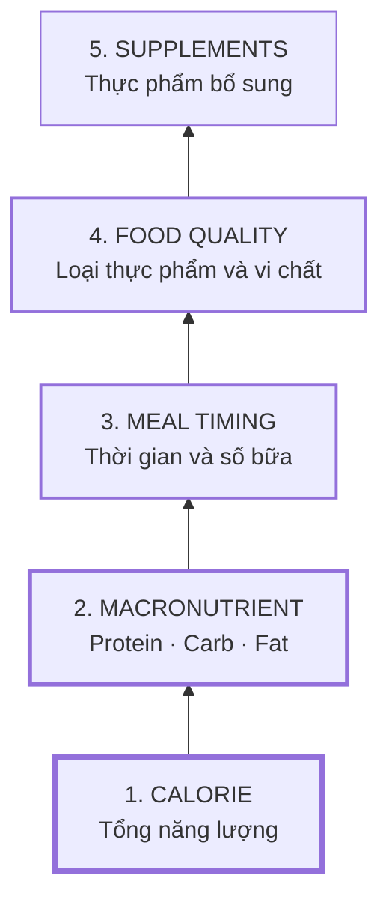
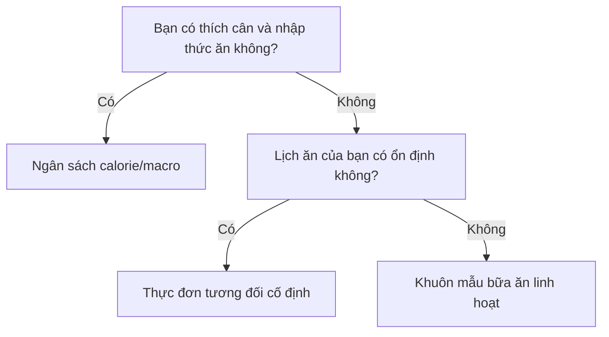
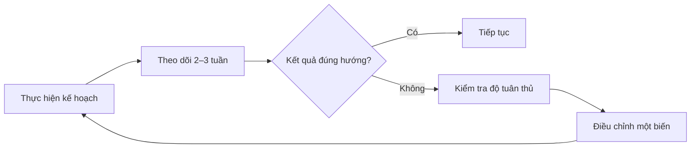

# 004 — Meal Planning Explained

| Thuộc tính       | Nội dung                                                         |
| ---------------- | ---------------------------------------------------------------- |
| **Module**       | Module 02 — Meal Planning Basics                                 |
| **Bài học**      | Meal Planning Explained                                          |
| **Thời lượng**   | 04:49                                                            |
| **Chủ đề chính** | Khái niệm lập kế hoạch bữa ăn và thứ tự ưu tiên trong dinh dưỡng |
| **Trọng tâm**    | Calorie → Macronutrient → Meal timing → Food → Supplement        |

---

## 1. Mục tiêu bài học

Sau bài học này, bạn có thể:

* Hiểu **meal planning** không đơn thuần là viết sẵn một thực đơn, mà là xây dựng chiến lược giúp đạt mục tiêu dinh dưỡng.
* Phân biệt năm cấp độ ưu tiên: calorie, macronutrient, thời điểm ăn, lựa chọn thực phẩm và thực phẩm bổ sung.
* Biết yếu tố nào cần giải quyết trước và yếu tố nào chỉ nên tối ưu sau.
* Tránh dành quá nhiều thời gian cho những chi tiết nhỏ trong khi nền tảng dinh dưỡng chưa ổn định.
* Chuyển một mục tiêu như giảm cân, tăng cân hoặc tăng cơ thành một kế hoạch ăn uống có thể thực hiện.

---

## 2. Meal planning là gì?

**Meal planning — lập kế hoạch bữa ăn — là quá trình biến mục tiêu dinh dưỡng thành một chiến lược ăn uống cụ thể.**

Bạn có thể đặt ra nhiều mục tiêu khác nhau:

* Giảm cân.
* Giảm mỡ.
* Tăng cân.
* Tăng cơ.
* Cải thiện sức khỏe.
* Duy trì cân nặng và vóc dáng hiện tại.

Tuy nhiên, một mục tiêu không đi kèm chiến lược chỉ mới là một **mong muốn**.

> “Tôi muốn giảm 5 kg” chưa phải là kế hoạch.
>
> Một kế hoạch phải trả lời được: ăn bao nhiêu, ăn những chất gì, chia bữa như thế nào, chọn thực phẩm nào và theo dõi kết quả ra sao.

Có thể hiểu meal planning bằng một công thức đơn giản:

```text
Mục tiêu
    ↓
Chiến lược dinh dưỡng
    ↓
Quy tắc lựa chọn thức ăn
    ↓
Bữa ăn hằng ngày
    ↓
Theo dõi và điều chỉnh
```

Giá trị lớn nhất của meal planning là giúp bạn **ra quyết định trước khi đói, mệt hoặc bận rộn**. Khi thức ăn phù hợp đã được chuẩn bị, bạn ít phải phụ thuộc vào ý chí nhất thời.

---

## 3. Tư duy “xây nhà” trong dinh dưỡng

Hãy tưởng tượng bạn đang xây một ngôi nhà.

Trước tiên, ngôi nhà cần:

1. Nền móng chắc chắn.
2. Tường chịu lực.
3. Mái nhà và hệ thống thiết yếu.
4. Cửa sổ, nội thất và các chi tiết trang trí.

Một ngôi nhà có nội thất đẹp nhưng không có móng sẽ nhanh chóng sụp đổ. Ngược lại, một ngôi nhà chưa được trang trí hoàn hảo vẫn có thể sử dụng nếu nền móng và kết cấu chính đủ tốt.

Kế hoạch dinh dưỡng cũng hoạt động theo nguyên tắc tương tự:

* **Calorie** là nền móng.
* **Macronutrient** là kết cấu chính.
* **Meal timing** là cách bố trí hoạt động.
* **Thực phẩm** quyết định chất lượng và sức khỏe lâu dài.
* **Supplement** chỉ là phần bổ sung sau cùng.

---

## 4. Sơ đồ thứ tự ưu tiên dinh dưỡng



### Nguyên tắc sử dụng

Bạn nên kiểm soát tương đối tốt một cấp độ trước khi dành nhiều thời gian tối ưu cấp độ tiếp theo.

Ví dụ:

* Chưa biết tổng calorie nhưng đã tranh luận nên uống whey trước hay sau tập → **sai thứ tự ưu tiên**.
* Protein mỗi ngày còn quá thấp nhưng đã mua nhiều supplement → **sai thứ tự ưu tiên**.
* Lượng thức ăn thay đổi thất thường nhưng lại quá lo ăn lúc 18:00 hay 18:30 → **tối ưu chi tiết quá sớm**.

---

## 5. Ưu tiên số 1 — Calorie

**Calorie cho biết tổng lượng năng lượng bạn nhận được từ thức ăn và đồ uống.**

Trong quản lý cân nặng:

```text
Calorie nạp vào > Calorie tiêu hao
                → xu hướng tăng cân

Calorie nạp vào < Calorie tiêu hao
                → xu hướng giảm cân

Calorie nạp vào ≈ Calorie tiêu hao
                → xu hướng duy trì cân nặng
```

Vì vậy, calorie thường là yếu tố có ảnh hưởng lớn nhất đến chiều hướng thay đổi cân nặng. NIDDK cũng nhấn mạnh rằng lượng thức ăn quan trọng không kém loại thức ăn và nhu cầu calorie phụ thuộc vào nhiều yếu tố như tuổi, cân nặng, chiều cao, mức vận động và chuyển hóa cá nhân.

### Sai lầm thường gặp

* Ăn toàn thực phẩm được xem là “lành mạnh” nhưng tổng lượng quá cao.
* Không tính calorie từ đồ uống, nước sốt và đồ ăn vặt.
* Ước lượng khẩu phần thấp hơn lượng thực tế.
* Cắt calorie quá mạnh, khiến kế hoạch khó duy trì.
* Tin rằng một loại thực phẩm hoặc supplement có thể tự động đốt mỡ.

### Lưu ý quan trọng

Câu nói “calorie là tất cả” trong bài học nên được hiểu là:

> Calorie là nền tảng hàng đầu khi mục tiêu chính là thay đổi cân nặng.

Điều đó **không có nghĩa** hai chế độ ăn có cùng calorie sẽ giống nhau về độ no, sức khỏe, hiệu suất tập luyện hoặc khả năng cung cấp vi chất.

---

## 6. Ưu tiên số 2 — Macronutrient

**Macronutrient — chất dinh dưỡng đa lượng — gồm ba nhóm chính:**

| Chất             | Vai trò tổng quát                                                 | Năng lượng |
| ---------------- | ----------------------------------------------------------------- | ---------: |
| **Protein**      | Xây dựng và duy trì mô, hỗ trợ phục hồi cơ                        |   4 kcal/g |
| **Carbohydrate** | Nguồn năng lượng quan trọng, đặc biệt cho vận động                |   4 kcal/g |
| **Fat**          | Hỗ trợ hormone, màng tế bào và hấp thu vitamin tan trong chất béo |   9 kcal/g |

Nếu calorie trả lời câu hỏi **“ăn bao nhiêu?”**, macronutrient trả lời câu hỏi:

> “Lượng calorie đó đến từ protein, carbohydrate và fat theo tỷ lệ nào?”

Macronutrient đặc biệt quan trọng khi mục tiêu là:

* Giữ cơ trong giai đoạn giảm mỡ.
* Tăng cơ.
* Duy trì hiệu suất tập luyện.
* Kiểm soát cảm giác no.
* Phân bổ năng lượng phù hợp với cường độ vận động.

Tuy nhiên, kết quả tăng cơ hay giảm mỡ không chỉ do macro. Nó còn phụ thuộc vào tổng năng lượng, chương trình tập luyện, khả năng phục hồi, giấc ngủ và tính nhất quán.

---

## 7. Ưu tiên số 3 — Meal timing

**Meal timing là thời điểm ăn, số bữa trong ngày và cách phân phối dinh dưỡng giữa các bữa.**

Các câu hỏi thuộc nhóm này gồm:

* Nên ăn bao nhiêu bữa mỗi ngày?
* Nên ăn trước tập bao lâu?
* Có cần ăn ngay sau khi tập không?
* Có nên ăn sáng?
* Có nên ăn carbohydrate vào buổi tối?

Meal timing có thể ảnh hưởng đến:

* Cảm giác đói và no.
* Sự thoải mái của hệ tiêu hóa.
* Năng lượng trong buổi tập.
* Khả năng phục hồi.
* Mức độ thuận tiện trong sinh hoạt.

Nhưng trong hầu hết trường hợp, meal timing **không thể bù lại** tổng calorie và macro chưa phù hợp.

### Ví dụ

Một người ăn đúng “khung giờ vàng” nhưng thường xuyên vượt mục tiêu calorie vẫn có thể không giảm cân.

Ngược lại, một người chia bữa theo lịch sinh hoạt cá nhân nhưng kiểm soát tốt calorie và protein vẫn có thể đạt kết quả tốt.

---

## 8. Ưu tiên số 4 — Lựa chọn thực phẩm

Thực phẩm ảnh hưởng trực tiếp đến:

* Vitamin và khoáng chất.
* Chất xơ.
* Sức khỏe tim mạch và chuyển hóa.
* Hệ tiêu hóa.
* Mức độ no.
* Năng lượng và sức khỏe dài hạn.

Một chế độ ăn lành mạnh nên ưu tiên các thực phẩm giàu dinh dưỡng như rau, trái cây, ngũ cốc nguyên hạt và những nguồn protein phù hợp; đồng thời vẫn nằm trong giới hạn năng lượng cá nhân. Đây cũng là định hướng chung của Dietary Guidelines for Americans và các kế hoạch ăn uống cân bằng như DASH.

### Khuôn mẫu một bữa ăn đơn giản

```text
Một bữa ăn cơ bản
├── 1 nguồn protein
├── 1 nguồn carbohydrate
├── Rau hoặc trái cây
├── 1 lượng fat phù hợp
└── Nước hoặc đồ uống ít calorie
```

Ví dụ:

| Thành phần          | Lựa chọn                                   |
| ------------------- | ------------------------------------------ |
| **Protein**         | Gà, cá, trứng, thịt nạc, đậu phụ, sữa chua |
| **Carbohydrate**    | Cơm, khoai, yến mạch, bánh mì, bún, mì     |
| **Rau và trái cây** | Rau cải, súp lơ, cà rốt, chuối, táo, cam   |
| **Fat**             | Dầu ăn, quả bơ, hạt, cá béo, lòng đỏ trứng |

MyPlate có thể được sử dụng như một hình ảnh tham khảo đơn giản để hình dung việc kết hợp rau, trái cây, ngũ cốc và protein trong bữa ăn, nhưng không thay thế cho mục tiêu calorie hoặc macro cá nhân.

---

## 9. Ưu tiên số 5 — Supplement

**Supplement có nghĩa là bổ sung**, không phải thay thế chế độ ăn.

Một số sản phẩm thường gặp:

* Whey protein.
* Creatine.
* Vitamin và khoáng chất.
* Dầu cá.
* Caffeine.
* Electrolyte.

Supplement có thể giúp:

* Bổ sung chất đang thiếu.
* Tăng tính thuận tiện.
* Hỗ trợ hiệu suất trong một số trường hợp.
* Hoàn thiện một chế độ ăn đã tương đối tốt.

Supplement không thể sửa chữa một kế hoạch có các vấn đề nền tảng như:

* Tổng calorie sai mục tiêu.
* Protein quá thấp.
* Thiếu rau, trái cây và chất xơ.
* Ăn uống thất thường.
* Thường xuyên bỏ kế hoạch.

```text
Chế độ ăn chưa ổn + nhiều supplement
≠
Chế độ ăn tốt
```

Người có bệnh nền, đang dùng thuốc, mang thai hoặc có nhu cầu dinh dưỡng đặc biệt nên hỏi bác sĩ hoặc chuyên gia dinh dưỡng trước khi sử dụng supplement.

---

## 10. Ba mô hình lập kế hoạch bữa ăn

Không có một phương pháp duy nhất phù hợp với tất cả mọi người.

| Mô hình              | Cách thực hiện                                               | Ưu điểm                       | Hạn chế                | Phù hợp với                   |
| -------------------- | ------------------------------------------------------------ | ----------------------------- | ---------------------- | ----------------------------- |
| **Thực đơn cố định** | Lặp lại một số món và khẩu phần đã xác định                  | Đơn giản, ít quyết định       | Có thể nhàm chán       | Người bận, thích ổn định      |
| **Ngân sách macro**  | Đặt mục tiêu calorie và macro, sau đó linh hoạt lựa chọn món | Linh hoạt, dễ ăn ngoài        | Cần theo dõi và cân đo | Người thích dữ liệu           |
| **Khuôn mẫu bữa ăn** | Mỗi bữa ghép protein, carb, rau và fat theo khẩu phần        | Dễ duy trì, ít phải tính toán | Độ chính xác thấp hơn  | Người không thích đếm calorie |

### Cách lựa chọn



Phương pháp tốt nhất không phải phương pháp trông “khoa học” nhất, mà là phương pháp bạn có thể thực hiện nhất quán.

Các nghiên cứu tổng hợp về can thiệp giảm cân cho thấy mức độ tuân thủ có ảnh hưởng đáng kể đến hiệu quả, đồng thời những yếu tố như hỗ trợ xã hội và chiến lược hành vi có thể cải thiện khả năng duy trì chương trình.

---

## 11. Quy trình xây dựng meal plan

### Bước 1 — Xác định mục tiêu

Viết mục tiêu theo dạng có thể đo lường:

```text
Không rõ:
“Tôi muốn có vóc dáng đẹp hơn.”

Rõ hơn:
“Tôi muốn giảm khoảng 4 kg trong 12 tuần,
đồng thời tiếp tục tập sức mạnh ba buổi mỗi tuần.”
```

### Bước 2 — Ghi nhật ký ăn uống

Theo dõi khoảng ba ngày ăn uống bình thường:

* Hai ngày trong tuần.
* Một ngày cuối tuần.
* Ghi cả đồ uống, nước sốt và đồ ăn vặt.
* Chưa cần cố tình ăn “đẹp”.

Nhật ký ăn uống giúp nhận diện thời điểm ăn, khẩu phần, thói quen và các tình huống kích hoạt việc ăn quá mức. NIDDK cũng khuyến nghị sử dụng nhật ký giấy hoặc ứng dụng để quan sát và cải thiện thói quen ăn uống.

### Bước 3 — Xác định calorie mục tiêu

Dựa trên:

* Cân nặng hiện tại.
* Chiều cao.
* Tuổi.
* Mức vận động.
* Mục tiêu tăng, giảm hay duy trì.

Con số ban đầu chỉ là **ước tính**, không phải giá trị tuyệt đối.

### Bước 4 — Phân bổ macro

Ưu tiên:

1. Đủ protein.
2. Đủ lượng fat thiết yếu.
3. Phần năng lượng còn lại phân bổ cho carbohydrate và fat theo sở thích, hiệu suất và khả năng tiêu hóa.

### Bước 5 — Chọn lịch ăn

Chọn số bữa phù hợp với lịch thật:

* Ba bữa chính.
* Ba bữa chính và một bữa phụ.
* Bốn bữa nhỏ.
* Một cấu trúc khác có thể duy trì.

### Bước 6 — Lập danh sách thực phẩm

Chọn một nhóm thực phẩm thường xuyên sử dụng:

* 3–5 nguồn protein.
* 3–5 nguồn carbohydrate.
* 5–10 loại rau và trái cây.
* 2–4 nguồn fat.
* Một số món tiện lợi dự phòng.

### Bước 7 — Chuẩn bị trước

Có thể chuẩn bị:

* Protein cho 2–4 ngày.
* Cơm, khoai hoặc carbohydrate chính.
* Rau đã rửa và chia phần.
* Trứng luộc, sữa chua hoặc trái cây cho bữa phụ.
* Một số phần ăn đông lạnh cho ngày bận.

NIDDK cũng đề xuất bảo quản hoặc cấp đông phần thức ăn thừa để có bữa sẵn trong những ngày quá bận hoặc quá mệt để nấu.

### Bước 8 — Theo dõi và điều chỉnh



Khi cần điều chỉnh, chỉ nên thay đổi một biến chính tại một thời điểm, chẳng hạn:

* Giảm nhẹ calorie.
* Tăng khẩu phần protein.
* Thay đổi số bữa.
* Chuẩn bị thêm thực phẩm tiện lợi.

---

## 12. Ví dụ một ngày ăn theo khuôn mẫu

> Đây chỉ là ví dụ cấu trúc, không phải thực đơn áp dụng cho tất cả mọi người.

| Thời điểm    | Cấu trúc                   | Ví dụ                        |
| ------------ | -------------------------- | ---------------------------- |
| **Bữa sáng** | Protein + carb + trái cây  | Trứng, bánh mì và chuối      |
| **Bữa trưa** | Protein + carb + rau       | Gà, cơm và rau luộc          |
| **Bữa phụ**  | Protein hoặc trái cây      | Sữa chua và táo              |
| **Bữa tối**  | Protein + carb + rau + fat | Cá, khoai, rau và một ít dầu |

Khi ăn ngoài, bạn có thể tiếp tục sử dụng khuôn mẫu:

```text
Chọn protein chính
       +
Chọn lượng cơm/bún/khoai phù hợp
       +
Thêm rau
       +
Kiểm soát đồ chiên, sốt và đồ uống
```

Một kế hoạch thực tế phải bao gồm cả những tình huống như ăn ngoài, đi học, đi làm, du lịch hoặc tham dự sự kiện. Không nên lập kế hoạch cho một cuộc sống lý tưởng mà bạn không thực sự sống.

---

## 13. Lỗi thường gặp

### 13.1. Tối ưu chi tiết trước nền tảng

Ví dụ:

* Lo thời điểm uống whey nhưng chưa đủ protein.
* Mua fat burner nhưng thường xuyên vượt calorie.
* Tránh carbohydrate buổi tối nhưng không kiểm soát khẩu phần cả ngày.

### 13.2. Kế hoạch quá khắt khe

Một kế hoạch yêu cầu bạn:

* Không bao giờ ăn ngoài.
* Không được ăn món yêu thích.
* Phải nấu mọi bữa.
* Phải ăn đúng từng phút.

thường khó duy trì trong thời gian dài.

Các món yêu thích vẫn có thể xuất hiện với lượng phù hợp trong kế hoạch quản lý cân nặng; không nhất thiết phải loại bỏ hoàn toàn mọi thực phẩm có calorie cao.

### 13.3. Thay đổi quá nhiều thứ cùng lúc

Nếu đồng thời thay đổi:

* Calorie.
* Số bữa.
* Loại thực phẩm.
* Chương trình tập.
* Supplement.

bạn sẽ khó biết yếu tố nào tạo ra kết quả.

### 13.4. Nhầm serving với portion

* **Serving size** là khẩu phần tham chiếu được ghi trên nhãn.
* **Portion** là lượng bạn thực sự ăn.

Một gói thực phẩm có thể chứa nhiều serving. Ăn cả gói đồng nghĩa calorie và dưỡng chất có thể cao hơn nhiều so với con số nhìn thấy trên một serving.

### 13.5. Xem kế hoạch như một hợp đồng bất biến

Meal plan thực chất là một **giả thuyết có thể kiểm tra**:

```text
“Với lượng ăn và cách tổ chức này,
cơ thể tôi có tiến triển theo mục tiêu không?”
```

Thực hiện, đo lường và điều chỉnh là một phần của kế hoạch.

---

## 14. Checklist thực hành

* [ ] Tôi đã xác định mục tiêu tăng, giảm hay duy trì cân nặng.
* [ ] Tôi đã ghi nhật ký ăn uống ít nhất ba ngày.
* [ ] Tôi hiểu calorie là nền tảng của thay đổi cân nặng.
* [ ] Tôi đã xác định mục tiêu protein, carbohydrate và fat cơ bản.
* [ ] Tôi chọn số bữa phù hợp với lịch sinh hoạt thực tế.
* [ ] Tôi đã lập danh sách các thực phẩm thường xuyên sử dụng.
* [ ] Tôi có ít nhất một bữa ăn dự phòng cho ngày bận.
* [ ] Tôi không phụ thuộc vào supplement để sửa một chế độ ăn chưa tốt.
* [ ] Tôi sẽ theo dõi kế hoạch trước khi điều chỉnh.
* [ ] Khi điều chỉnh, tôi chỉ thay đổi một biến chính tại một thời điểm.

---

## 15. Tóm tắt bài học

Lập kế hoạch bữa ăn là quá trình biến mục tiêu thành một hệ thống ăn uống có thể thực hiện.

Thứ tự ưu tiên trong bài học là:

```text
1. Calorie
2. Macronutrient
3. Meal timing
4. Food quality
5. Supplement
```

Hãy xây dựng nền tảng trước rồi mới tối ưu chi tiết:

* Xác định lượng năng lượng phù hợp.
* Phân bổ protein, carbohydrate và fat.
* Chọn lịch ăn phù hợp với cuộc sống.
* Ưu tiên thực phẩm giàu dinh dưỡng.
* Chỉ sử dụng supplement khi thực sự cần.

**Kế hoạch tốt nhất không phải kế hoạch hoàn hảo trên giấy, mà là kế hoạch đủ hiệu quả và đủ thực tế để bạn duy trì lâu dài.**

---

## 16. Ảnh minh họa đề xuất

1. **Mô hình thứ tự ưu tiên dinh dưỡng:**
   [Nutrition Hierarchy — Flourish for Life Coaching](https://flourishforlifecoaching.com/blog/2019/11/nutrition-hierarchy)

2. **Minh họa chuẩn bị bữa ăn gồm protein, carbohydrate và rau:**
   [Protein-Packed Meal Prep](https://filbornaarena.se/hur-mycket-protein-per-dag-ska-man-ata/)

3. **Sơ đồ thành phần đĩa ăn MyPlate:**
   [What’s on MyPlate — USDA](https://www.myplate.gov/whatsonmyplate)

4. **Minh họa các nhóm thực phẩm tốt cho tim mạch:**
   [Therapeutic Lifestyle Changes — NHLBI](https://www.nhlbi.nih.gov/health/TLC-Therapeutic-Lifestyle-Changes-Lower-Cholesterol)

> **Ghi chú:** Hình “Nutrition Hierarchy” trên mạng có thể sắp xếp micronutrient, food quality và meal timing hơi khác với thứ tự trong bài giảng. Nên dùng hình như tài liệu minh họa, còn sơ đồ năm cấp độ trong bài là cấu trúc bám sát transcript.

---

# Bài luyện tập

## Mục tiêu


## Đề bài


## Yêu cầu hoàn thành

- [ ] 
- [ ] 
- [ ] 

## Kết quả / lời giải


## Ghi chú
