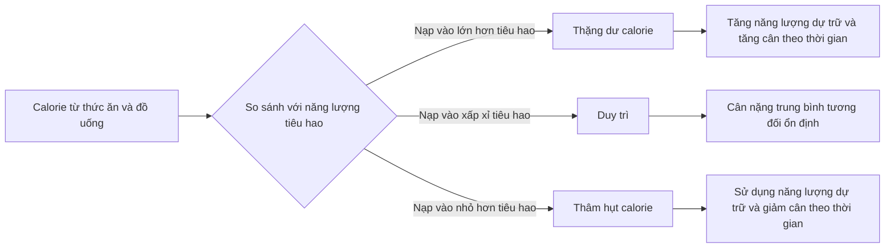
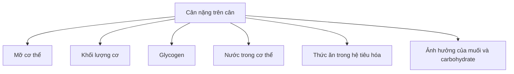
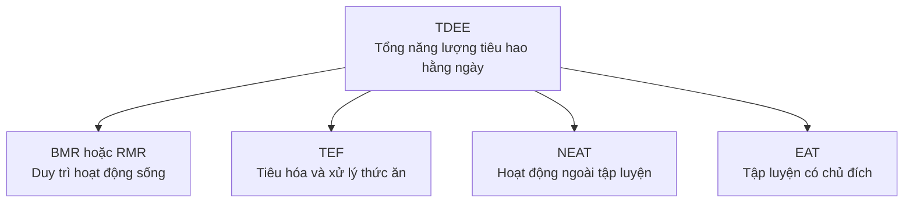
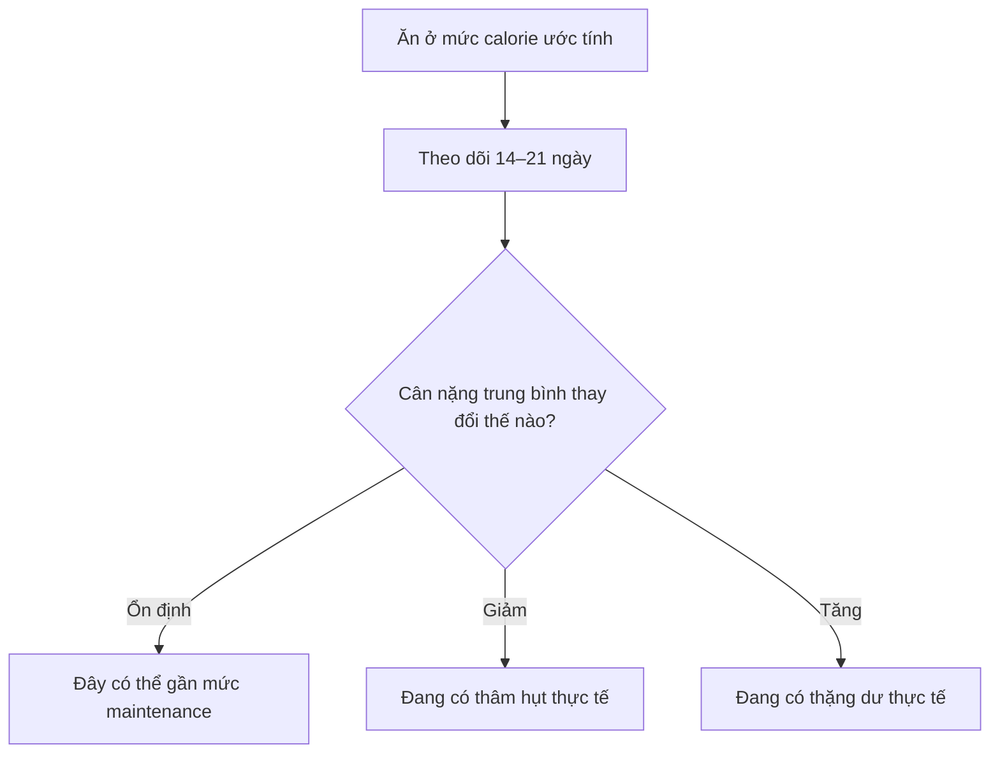

# 005 — Giải thích về Calorie

| Thuộc tính       | Nội dung                                                                |
| ---------------- | ----------------------------------------------------------------------- |
| **Module**       | Module 02 — Meal Planning Basics                                        |
| **Bài học**      | Calories Explained                                                      |
| **Thời lượng**   | 04:45 — Xem trước miễn phí                                              |
| **Chủ đề chính** | Calorie, cân bằng năng lượng và nguyên lý chi phối sự thay đổi cân nặng |

> **Ý tưởng cốt lõi:** Calorie không phải là một loại chất và cũng không mang ý nghĩa “tốt” hay “xấu”. Calorie chỉ là **đơn vị đo năng lượng**. Cân nặng thay đổi theo chênh lệch giữa năng lượng cơ thể nhận vào và năng lượng cơ thể tiêu hao trong một khoảng thời gian đủ dài.

---

## 1. Mục tiêu bài học

Sau bài học này, bạn có thể:

* Giải thích calorie là gì và phân biệt `calorie` với `kilocalorie`.
* Hiểu nguyên lý **cân bằng năng lượng — energy balance**.
* Phân biệt ba trạng thái: **thặng dư, duy trì và thâm hụt calorie**.
* Ghi nhớ giá trị năng lượng của protein, carbohydrate, chất béo và cồn.
* Nhận biết bốn thành phần chính tạo nên **TDEE**.
* Biết cách ước lượng nhu cầu calorie ban đầu và điều chỉnh bằng dữ liệu thực tế.

---

## 2. Calorie thực chất là gì?

### 2.1. Calorie là đơn vị đo năng lượng

Về mặt vật lý:

* Một **calorie nhỏ — cal** là năng lượng cần để làm nhiệt độ của khoảng 1 gram nước tăng thêm 1°C.
* Một **kilocalorie — kcal** bằng 1.000 calorie nhỏ.
* Trong dinh dưỡng, từ “calorie” trên bao bì thực phẩm thường được dùng để chỉ **kilocalorie**.

Vì vậy:

```text
1 Calorie trên nhãn thực phẩm
= 1 kilocalorie
= 1 kcal
= 1.000 calorie nhỏ
```

FDA mô tả calorie trên nhãn dinh dưỡng là thước đo lượng năng lượng mà một khẩu phần thực phẩm cung cấp. Tổng calorie thực sự tiêu thụ còn phụ thuộc vào số khẩu phần bạn ăn. ([U.S. Food and Drug Administration][1])

> **Ví dụ:** Nhãn ghi 280 kcal mỗi khẩu phần nhưng hộp có bốn khẩu phần. Ăn hết hộp tương đương khoảng 1.120 kcal, không phải 280 kcal.

### 2.2. Cơ thể sử dụng năng lượng để làm gì?

Năng lượng từ thực phẩm được dùng cho:

* Tim đập và máu lưu thông.
* Hô hấp và duy trì nhiệt độ cơ thể.
* Hoạt động của não, gan, thận và các cơ quan.
* Tiêu hóa, hấp thu và chuyển hóa thức ăn.
* Đứng, đi lại, làm việc nhà và cử động vô thức.
* Tập gym, chạy bộ, chơi thể thao.
* Xây dựng, sửa chữa và duy trì mô cơ thể.

> **Lưu ý:** Calorie là **năng lượng**, không phải “vật liệu xây dựng” theo nghĩa đen. Amino acid, acid béo, glucose, vitamin và khoáng chất mới là các nguyên liệu cơ thể sử dụng. Calorie cung cấp năng lượng để những quá trình xây dựng và sửa chữa đó diễn ra.

---

## 3. Phương trình cân bằng năng lượng

Cân bằng năng lượng có thể được biểu diễn đơn giản như sau:

```text
Thay đổi năng lượng dự trữ
= Năng lượng nạp vào − Năng lượng tiêu hao
```

Trong đó:

* **Năng lượng nạp vào** đến từ thức ăn và đồ uống.
* **Năng lượng tiêu hao** là tổng năng lượng cơ thể sử dụng trong ngày.
* Phần chênh lệch được lấy từ hoặc bổ sung vào các kho năng lượng của cơ thể.



Các mô hình dinh dưỡng có thể tác động khác nhau đến cảm giác đói, hành vi ăn uống, hiệu suất tập luyện và mức tiêu hao, nhưng sự thay đổi mô cơ thể lâu dài vẫn phải tuân theo cân bằng năng lượng. ([PubMed Central (PMC)][2])

> 🖼️ [Ảnh minh họa ba trạng thái cân bằng năng lượng](https://www.dsscoaching.ie/blog/nutrition-101-calorie-balance)

---

## 4. Ba trạng thái calorie balance

### 4.1. Cân bằng dương — Calorie surplus

```text
Calorie nạp vào > Calorie tiêu hao
```

Cơ thể nhận nhiều năng lượng hơn nhu cầu hiện tại. Phần năng lượng chưa được sử dụng có thể được:

* Dự trữ dưới dạng glycogen trong gan và cơ.
* Lưu trữ dưới dạng mỡ cơ thể.
* Dùng để hỗ trợ xây dựng mô cơ nếu có kích thích tập luyện và đủ protein.
* Giữ lại tạm thời dưới dạng nước đi kèm glycogen.

Khi trạng thái này kéo dài, cân nặng trung bình sẽ tăng.

Tuy nhiên, **tăng cân không đồng nghĩa toàn bộ là tăng mỡ**. Thành phần tăng thêm có thể gồm:

* Mỡ.
* Cơ.
* Glycogen.
* Nước.
* Thức ăn còn trong hệ tiêu hóa.

### 4.2. Cân bằng âm — Calorie deficit

```text
Calorie nạp vào < Calorie tiêu hao
```

Khi năng lượng từ thức ăn không đủ đáp ứng nhu cầu, cơ thể phải huy động năng lượng dự trữ. Nguồn năng lượng đó có thể đến từ:

* Glycogen.
* Mỡ cơ thể.
* Một phần mô nạc nếu thiếu protein, không tập kháng lực hoặc thâm hụt quá lớn.

Khi trạng thái này được duy trì đủ lâu, cân nặng trung bình sẽ giảm.

Trong quá trình giảm cân, cơ thể nhỏ hơn cần ít năng lượng hơn và một số thành phần tiêu hao cũng có thể giảm. Đây là lý do mức calorie từng tạo thâm hụt có thể dần trở thành mức gần duy trì. ([Viện Quốc gia về Bệnh Tiểu đường và Thận][3])

### 4.3. Cân bằng trung tính — Maintenance

```text
Calorie nạp vào ≈ Calorie tiêu hao
```

Không cần hai con số phải bằng nhau tuyệt đối trong từng ngày.

Ví dụ:

```text
Thứ hai:   thặng dư 250 kcal
Thứ ba:    thâm hụt 300 kcal
Thứ tư:    thặng dư 100 kcal
Thứ năm:   thâm hụt 50 kcal
```

Nếu trung bình nhiều tuần gần bằng nhau, cân nặng có thể vẫn tương đối ổn định.

---

## 5. Vì sao cân nặng có thể không phản ánh ngay calorie balance?

Số cân trong một ngày không chỉ phản ánh lượng mỡ.



Một người có thể đang thâm hụt calorie nhưng tạm thời không giảm cân do:

* Ăn nhiều muối hơn bình thường.
* Tăng lượng carbohydrate và glycogen.
* Đau cơ hoặc viêm nhẹ sau tập luyện.
* Ngủ ít hoặc căng thẳng.
* Chu kỳ kinh nguyệt.
* Thức ăn chưa được tiêu hóa hết.

Ngược lại, việc giảm nhanh 1–2 kg trong vài ngày đầu của một chế độ ăn có thể chủ yếu là nước và glycogen, không phải toàn bộ là mỡ. Vì vậy, cần đánh giá **xu hướng trung bình trong nhiều tuần**, thay vì kết luận từ một lần cân. ([dsscoaching.ie][4])

---

## 6. Giá trị năng lượng của các chất dinh dưỡng

| Chất              | Năng lượng ước tính | Vai trò chính                                             |
| ----------------- | ------------------: | --------------------------------------------------------- |
| **Protein**       |            4 kcal/g | Xây dựng và sửa chữa mô, enzyme, hormone                  |
| **Carbohydrate**  |            4 kcal/g | Nguồn năng lượng thuận tiện, hỗ trợ vận động              |
| **Chất béo**      |            9 kcal/g | Dự trữ năng lượng, màng tế bào, hấp thu vitamin           |
| **Cồn — alcohol** |            7 kcal/g | Cung cấp năng lượng nhưng không phải dưỡng chất thiết yếu |
| **Chất xơ**       |   Khoảng 0–2 kcal/g | Phụ thuộc loại chất xơ và mức độ lên men trong ruột       |

Các hệ thống ghi nhãn thường sử dụng hệ số chung 4 kcal/g cho protein, 4 kcal/g cho carbohydrate và 9 kcal/g cho chất béo; cồn cung cấp khoảng 7 kcal/g. ([U.S. Food and Drug Administration][5])

### Ví dụ: vì sao dầu ăn dễ bị bỏ sót?

Một thìa dầu có thể chứa khoảng 14 gram chất béo:

```text
14 g × 9 kcal/g = 126 kcal
```

Trên nhãn, con số này thường được làm tròn về khoảng 120 kcal.

Vì dầu có thể tích nhỏ nhưng mật độ năng lượng cao, vài thìa dầu dùng khi nấu ăn có thể bổ sung hàng trăm kcal mà người ăn không cảm thấy no tương ứng.

### Không phải mọi calorie tạo ra trải nghiệm giống nhau

Hai món ăn cùng cung cấp 200 kcal có thể rất khác nhau về:

* Cảm giác no.
* Khối lượng thực phẩm.
* Hàm lượng protein.
* Chất xơ.
* Vitamin và khoáng chất.
* Tốc độ ăn.
* Mức độ ngon miệng và khả năng ăn quá mức.

Do đó:

> **Calorie balance quyết định hướng thay đổi cân nặng, còn chất lượng thực phẩm ảnh hưởng mạnh đến sức khỏe, cảm giác no, hiệu suất và khả năng duy trì kế hoạch.**

---

## 7. TDEE — Tổng năng lượng tiêu hao hằng ngày

**TDEE — Total Daily Energy Expenditure** là tổng năng lượng cơ thể sử dụng trong một ngày.

```text
TDEE = BMR hoặc RMR + TEF + NEAT + EAT
```



Các tài liệu khoa học đôi khi gộp NEAT và EAT vào nhóm **năng lượng hoạt động thể chất**, nhưng cách chia thành bốn thành phần thường dễ hiểu hơn trong thực hành. ([PubMed Central (PMC)][6])

> 🖼️ [Ảnh minh họa cấu trúc TDEE dạng kim tự tháp](https://expertpt.co.uk/news/2021/9/22/what-is-a-calorie-deficit)

### 7.1. BMR và RMR

| Thuật ngữ                        | Giải thích                                                                             |
| -------------------------------- | -------------------------------------------------------------------------------------- |
| **BMR — Basal Metabolic Rate**   | Năng lượng tối thiểu để duy trì sự sống, được đo trong điều kiện kiểm soát nghiêm ngặt |
| **RMR — Resting Metabolic Rate** | Năng lượng tiêu hao khi nghỉ ngơi, thường được đo trong điều kiện thực tế hơn          |

BMR hoặc RMR thường là thành phần lớn nhất của TDEE. Ở người ít vận động, RMR có thể chiếm khoảng 60–70% tổng năng lượng tiêu hao, nhưng tỷ lệ thực tế thay đổi theo cơ thể và lối sống. ([PubMed Central (PMC)][7])

Năng lượng này dùng cho:

* Não hoạt động.
* Tim bơm máu.
* Phổi hô hấp.
* Gan và thận làm việc.
* Duy trì nhiệt độ cơ thể.
* Sửa chữa tế bào.

### 7.2. TEF — Thermic Effect of Food

TEF là năng lượng dùng để:

* Tiêu hóa thức ăn.
* Hấp thu dưỡng chất.
* Vận chuyển dưỡng chất.
* Chuyển hóa và lưu trữ dưỡng chất.

TEF thường chiếm khoảng 6–12% TDEE, tùy khẩu phần và thành phần dinh dưỡng. ([PubMed Central (PMC)][8])

Hiệu ứng nhiệt của từng chất khác nhau:

| Chất         | Tỷ lệ năng lượng có thể tiêu hao khi xử lý |
| ------------ | -----------------------------------------: |
| Protein      |                              Khoảng 20–30% |
| Carbohydrate |                               Khoảng 5–10% |
| Chất béo     |                                Khoảng 0–3% |

Điều đó không có nghĩa ăn protein sẽ “đốt sạch” lượng calorie đã ăn, nhưng protein thường cần nhiều năng lượng để xử lý hơn carbohydrate và chất béo. ([PubMed][9])

### 7.3. NEAT — Non-Exercise Activity Thermogenesis

NEAT là năng lượng tiêu hao cho những hoạt động không được xem là buổi tập có chủ đích:

* Đi bộ đến chỗ làm.
* Đứng thay vì ngồi.
* Leo cầu thang.
* Làm việc nhà.
* Đi mua sắm.
* Đi lại trong văn phòng.
* Thay đổi tư thế.
* Cử động tay chân hoặc rung chân.

NEAT có thể khác biệt đáng kể giữa những người có kích thước cơ thể tương tự và là một trong các thành phần biến động mạnh nhất của tiêu hao năng lượng. ([PubMed Central (PMC)][10])

Khi ăn thâm hụt lâu, một số người vô thức:

* Đi lại ít hơn.
* Ngồi nhiều hơn.
* Cử động chậm hơn.
* Giảm các hoạt động không bắt buộc.

Sự bù trừ này có thể làm mức thâm hụt thực tế nhỏ hơn dự kiến, mặc dù mức độ xảy ra khác nhau giữa từng người.

### 7.4. EAT — Exercise Activity Thermogenesis

EAT là năng lượng tiêu hao từ hoạt động tập luyện có chủ đích:

* Tập tạ.
* Chạy bộ.
* Đạp xe.
* Bơi.
* Chơi thể thao.
* Các buổi cardio.

EAT có thể là một phần nhỏ ở người ít tập nhưng trở nên đáng kể ở vận động viên hoặc người có khối lượng tập luyện cao. Vì vậy, không có một tỷ lệ TDEE cố định đúng cho tất cả mọi người.

### Tỷ trọng tham khảo

| Thành phần  |                 Tỷ trọng minh họa | Mức độ kiểm soát             |
| ----------- | --------------------------------: | ---------------------------- |
| **BMR/RMR** | Khoảng 60–70% ở người ít vận động | Khó thay đổi nhanh           |
| **TEF**     |                      Khoảng 6–12% | Thay đổi nhẹ theo khẩu phần  |
| **NEAT**    |                     Biến động lớn | Có thể tăng qua thói quen    |
| **EAT**     |           Từ rất thấp đến đáng kể | Có thể chủ động lập kế hoạch |

> Những con số này chỉ nhằm minh họa. Người lao động chân tay, vận động viên và người làm việc văn phòng có thể có cơ cấu TDEE rất khác nhau.

---

## 8. Áp dụng trong thực tế

### 8.1. Ước lượng TDEE ban đầu

Quy tắc kinh nghiệm đơn giản trong khóa học:

```text
TDEE thô ≈ Cân nặng cơ thể × 30–33
```

Cách này phù hợp hơn với người trưởng thành có mức vận động vừa phải và chỉ nên dùng làm **điểm xuất phát**.

#### Ví dụ

Một người nặng 70 kg:

```text
Mức thấp: 70 × 30 = 2.100 kcal
Mức cao:  70 × 33 = 2.310 kcal
```

TDEE khởi điểm có thể được ước lượng trong khoảng:

```text
2.100–2.310 kcal/ngày
```

Con số thực tế cần được kiểm chứng bằng xu hướng cân nặng và lượng ăn trong khoảng 2–3 tuần.

### 8.2. Xác định mức duy trì bằng dữ liệu thực tế

Thực hiện trong ít nhất 14 ngày:

1. Cân vào buổi sáng trong điều kiện tương tự.
2. Ghi lại lượng calorie ăn vào.
3. Tính cân nặng trung bình từng tuần.
4. So sánh xu hướng giữa các tuần.



### 8.3. Xem calorie như ngân sách

Thay vì nghĩ:

> “Món này xấu vì có nhiều calorie.”

Hãy nghĩ:

> “Món này sử dụng bao nhiêu phần trong ngân sách năng lượng của mình, và nó mang lại mức độ no cùng giá trị dinh dưỡng như thế nào?”

Ví dụ, với ngân sách 2.200 kcal:

| Khoản chi                   |        Calorie |
| --------------------------- | -------------: |
| Ba bữa chính                |     1.650 kcal |
| Một bữa phụ                 |       250 kcal |
| Sữa, nước sốt và dầu nấu ăn |       200 kcal |
| Khoảng linh hoạt            |       100 kcal |
| **Tổng**                    | **2.200 kcal** |

### 8.4. Sử dụng NEAT làm đòn bẩy

Thay vì chỉ thêm nhiều buổi cardio, có thể:

* Đi bộ trong giờ nghỉ.
* Đi cầu thang.
* Đỗ xe xa hơn.
* Đứng lên vận động sau mỗi 45–60 phút.
* Đi bộ khi nghe điện thoại.
* Duy trì mức bước chân ổn định trong thời gian giảm cân.

Mục tiêu 8.000–10.000 bước có thể phù hợp với nhiều người nhưng không phải ngưỡng bắt buộc. Cách thực tế hơn là xác định mức hiện tại rồi tăng dần một lượng có thể duy trì.

---

## 9. Ví dụ hoàn chỉnh

Một người nặng 75 kg, vận động vừa phải:

```text
TDEE ước tính = 75 × 32
              = 2.400 kcal/ngày
```

### Trường hợp A — Ăn 2.400 kcal

Sau ba tuần:

* Cân nặng trung bình ổn định.
* Vòng eo không thay đổi rõ rệt.
* Hiệu suất tập ổn định.

Kết luận:

```text
2.400 kcal có thể gần mức duy trì thực tế
```

### Trường hợp B — Ăn 2.150 kcal

Sau ba tuần:

* Cân nặng trung bình giảm.
* Vòng eo giảm.
* Sức mạnh phần lớn được duy trì.

Kết luận:

```text
Người này đang có thâm hụt calorie thực tế
```

### Trường hợp C — Ăn 2.650 kcal

Sau ba tuần:

* Cân nặng trung bình tăng dần.
* Thành tích tập luyện cải thiện.
* Vòng eo có thể tăng nhẹ.

Kết luận:

```text
Người này đang có thặng dư calorie thực tế
```

Điều quan trọng không phải con số tính toán ban đầu đúng tuyệt đối, mà là khả năng **điều chỉnh dựa trên phản hồi thực tế của cơ thể**.

---

## 10. Lỗi và quan niệm sai thường gặp

### 10.1. “Calorie không quan trọng, chỉ hormone mới quan trọng”

Hormone ảnh hưởng đến:

* Cảm giác đói.
* Cảm giác no.
* Mức độ vận động.
* Khả năng giữ nước.
* Phân bố chất dinh dưỡng.
* Mức tiêu hao năng lượng.

Nhưng những yếu tố này tác động thông qua một hoặc cả hai vế của phương trình:

```text
Năng lượng nạp vào ↔ Năng lượng tiêu hao
```

Hormone làm hệ thống phức tạp hơn, nhưng không loại bỏ nguyên lý bảo toàn năng lượng.

### 10.2. “Mọi calorie đều giống nhau”

Cần tách thành hai câu hỏi:

| Câu hỏi                                                 | Câu trả lời      |
| ------------------------------------------------------- | ---------------- |
| 200 kcal có luôn là 200 kcal năng lượng không?          | Về đơn vị đo, có |
| 200 kcal từ mọi thực phẩm có tác động giống nhau không? | Không            |

Chúng có thể khác nhau về cảm giác no, TEF, protein, chất xơ, vi chất và khả năng khiến bạn ăn thêm.

### 10.3. “Tập xong có thể ăn bù toàn bộ calorie trên đồng hồ”

Thiết bị đeo tay thường đo nhịp tim và số bước tốt hơn khả năng ước lượng năng lượng tiêu hao. Các tổng quan nghiên cứu cho thấy ước tính calorie đốt cháy giữa các thiết bị có thể sai khác đáng kể và chưa đủ chính xác để xem là con số tuyệt đối. ([PubMed Central (PMC)][11])

Cách an toàn hơn:

* Không tự động ăn bù 100% calorie thiết bị báo.
* Theo dõi cân nặng trung bình.
* Chỉ điều chỉnh lượng ăn khi xu hướng thực tế cho thấy cần thiết.

### 10.4. “Nhãn thực phẩm chính xác tuyệt đối”

Nhãn dinh dưỡng chịu ảnh hưởng bởi:

* Biến động nguyên liệu.
* Phương pháp tính toán.
* Kích thước khẩu phần.
* Quy tắc làm tròn.
* Quy định của từng quốc gia.

Tại Hoa Kỳ, hướng dẫn của FDA sử dụng tiêu chí tuân thủ cho một số dưỡng chất, trong đó lượng calorie phân tích không được cao hơn quá 20% so với giá trị công bố. Điều này không có nghĩa mọi sản phẩm mặc định sai đúng 20%, mà cho thấy nhãn vẫn là một **ước lượng có giới hạn**, không phải phép đo tuyệt đối. ([U.S. Food and Drug Administration][12])

> 🖼️ [Ảnh và hướng dẫn đọc Nutrition Facts của FDA](https://www.fda.gov/food/nutrition-facts-label/how-understand-and-use-nutrition-facts-label)

### 10.5. “Tập gym là phần lớn calorie tiêu hao”

Với phần lớn người tập thông thường, BMR/RMR vẫn là thành phần lớn nhất. Một buổi tập có giá trị lớn cho sức khỏe, sức mạnh và giữ cơ, nhưng thường không thể bù hoàn toàn cho việc ăn vượt nhu cầu thường xuyên.

---

## 11. Checklist thực hành

* [ ] Tôi hiểu calorie là đơn vị đo năng lượng.
* [ ] Tôi phân biệt được calorie nhỏ và kilocalorie trên nhãn thực phẩm.
* [ ] Tôi hiểu ba trạng thái: surplus, maintenance và deficit.
* [ ] Tôi nhớ quy tắc `4–4–9–7` cho protein, carbohydrate, fat và alcohol.
* [ ] Tôi phân biệt được BMR/RMR, TEF, NEAT và EAT.
* [ ] Tôi hiểu tỷ lệ các thành phần TDEE không cố định ở mọi người.
* [ ] Tôi đã ước lượng TDEE ban đầu.
* [ ] Tôi sẽ dùng cân nặng trung bình nhiều ngày thay vì một lần cân.
* [ ] Tôi không mặc định calorie trên đồng hồ thông minh là hoàn toàn chính xác.
* [ ] Tôi xem calorie như ngân sách năng lượng, không phải điểm số đạo đức.

---

## 12. Câu hỏi tự kiểm tra

1. Một người ăn trung bình 2.000 kcal nhưng tiêu hao 2.400 kcal đang ở trạng thái nào?
2. Chất nào cung cấp nhiều năng lượng nhất trên mỗi gram?
3. Đứng làm việc và đi bộ trong văn phòng thuộc NEAT hay EAT?
4. Vì sao cân nặng có thể tăng trong vài ngày dù vẫn đang thâm hụt?
5. Vì sao hai món cùng 300 kcal có thể tạo mức độ no khác nhau?

<details>
<summary><strong>Xem đáp án</strong></summary>

1. Thâm hụt calorie.
2. Chất béo, với khoảng 9 kcal/g.
3. NEAT.
4. Do nước, glycogen, muối, thức ăn trong hệ tiêu hóa hoặc phản ứng sau tập luyện.
5. Vì chúng có thể khác nhau về protein, chất xơ, khối lượng, mật độ năng lượng và mức độ ngon miệng.

</details>

---

## 13. Tóm tắt bài học

* **Calorie là đơn vị đo năng lượng**, không phải một chất dinh dưỡng và không tự mang ý nghĩa tốt hay xấu.
* Cân nặng dài hạn chịu sự chi phối của **cân bằng giữa năng lượng nạp vào và năng lượng tiêu hao**.
* Thặng dư kéo dài dẫn đến tăng năng lượng dự trữ; thâm hụt kéo dài buộc cơ thể sử dụng năng lượng dự trữ.
* Protein và carbohydrate cung cấp khoảng **4 kcal/g**, chất béo **9 kcal/g**, cồn **7 kcal/g**.
* TDEE gồm **BMR/RMR, TEF, NEAT và EAT**.
* BMR/RMR thường là thành phần lớn nhất, trong khi NEAT là thành phần có thể biến động mạnh giữa các cá nhân.
* Các công thức TDEE chỉ tạo ra con số khởi đầu; xu hướng cân nặng trong nhiều tuần mới cho biết calorie balance thực tế.
* Chất lượng thực phẩm không thay thế calorie balance, nhưng quyết định sức khỏe, cảm giác no và khả năng duy trì chế độ ăn.

[1]: https://www.fda.gov/food/nutrition-facts-label/how-understand-and-use-nutrition-facts-label "How to Understand and Use the Nutrition Facts Label | FDA"
[2]: https://pmc.ncbi.nlm.nih.gov/articles/PMC5470183/?utm_source=chatgpt.com "International society of sports nutrition position stand: diets and body composition - PMC"
[3]: https://www.niddk.nih.gov/health-information/weight-management/adult-overweight-obesity/eating-physical-activity?utm_source=chatgpt.com "Eating & Physical Activity to Lose or Maintain Weight - NIDDK"
[4]: https://www.dsscoaching.ie/blog/nutrition-101-calorie-balance "Nutrition 101: Calorie Balance"
[5]: https://www.fda.gov/media/134505/download?utm_source=chatgpt.com "Food Labeling: Revision of the Nutrition and Supplement ..."
[6]: https://pmc.ncbi.nlm.nih.gov/articles/PMC4816895/?utm_source=chatgpt.com "A novel approach to calculating the thermic effect of food in a metabolic chamber - PMC"
[7]: https://pmc.ncbi.nlm.nih.gov/articles/PMC5081410/?utm_source=chatgpt.com "Analysis of energy metabolism in humans: A review of methodologies - PMC"
[8]: https://pmc.ncbi.nlm.nih.gov/articles/PMC10123606/?utm_source=chatgpt.com "Insights into Non-Exercise Physical Activity on Control of Body Mass: A Review with Practical Recommendations - PMC"
[9]: https://pubmed.ncbi.nlm.nih.gov/8878356/?utm_source=chatgpt.com "Thermic effect of food and sympathetic nervous system activity in humans - PubMed"
[10]: https://pmc.ncbi.nlm.nih.gov/articles/PMC6058072/?utm_source=chatgpt.com "Non-exercise activity thermogenesis (NEAT): a component of total daily energy expenditure - PMC"
[11]: https://pmc.ncbi.nlm.nih.gov/articles/PMC7509623/?utm_source=chatgpt.com "Reliability and Validity of Commercially Available Wearable ..."
[12]: https://www.fda.gov/regulatory-information/search-fda-guidance-documents/guidance-industry-guide-developing-and-using-data-bases-nutrition-labeling?utm_source=chatgpt.com "Guide for Developing and Using Data Bases for Nutrition ..."

---

# Bài luyện tập

## Mục tiêu


## Đề bài


## Yêu cầu hoàn thành

- [ ] 
- [ ] 
- [ ] 

## Kết quả / lời giải


## Ghi chú
