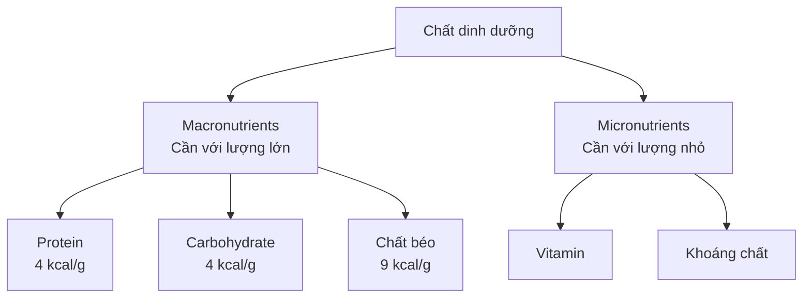

[](https://sukhis.com/what-are-macros/?utm_source=chatgpt.com)

# 006 — Giải thích về các chất dinh dưỡng đa lượng

## Macronutrients Explained

| Thuộc tính       | Nội dung                                              |
| ---------------- | ----------------------------------------------------- |
| **Module**       | Module 02 — Meal Planning Basics                      |
| **Bài học**      | Macronutrients Explained                              |
| **Thời lượng**   | 01:53                                                 |
| **Chủ đề chính** | Ba nhóm chất dinh dưỡng đa lượng và vai trò của chúng |


> **Ảnh minh họa:** Một bữa ăn có thể đồng thời cung cấp protein, carbohydrate, chất béo, vitamin và khoáng chất. [Mở ảnh chất lượng cao trên Unsplash](https://images.unsplash.com/photo-1490645935967-10de6ba17061?auto=format&fit=crop&fm=jpg&q=90&w=3000). 

---

## 1. Mục tiêu bài học

Sau bài học này, bạn có thể:

* Phân biệt **macronutrient** — chất dinh dưỡng đa lượng — với **micronutrient** — vi chất dinh dưỡng.
* Nêu được vai trò cơ bản của **protein, chất béo và carbohydrate**.
* Ghi nhớ lượng năng lượng mà mỗi gram macro cung cấp.
* Hiểu vì sao **cân bằng calorie** quyết định xu hướng tăng hoặc giảm cân, trong khi tỷ lệ macro ảnh hưởng đến khả năng giữ cơ, hiệu suất tập luyện, cảm giác no và thành phần cơ thể.
* Biết thứ tự đơn giản để thiết lập macro: **protein → chất béo → carbohydrate**.

---

## 2. Macronutrient là gì?

**Macronutrient**, thường gọi tắt là **macro**, là nhóm chất dinh dưỡng cơ thể sử dụng với lượng tương đối lớn, thường được tính bằng **gram**.

Trong phạm vi lập kế hoạch dinh dưỡng, có ba macro cung cấp phần lớn năng lượng từ thực phẩm:

1. **Protein — chất đạm**
2. **Carbohydrate — chất bột đường**
3. **Fat — chất béo**

Ngược lại, **micronutrient** gồm vitamin và khoáng chất. Cơ thể chỉ cần chúng với lượng nhỏ hơn, thường tính bằng milligram hoặc microgram, nhưng chúng vẫn rất cần thiết cho hoạt động sinh lý bình thường. ([NCBI][1])



> **Lưu ý:** Nước đôi khi cũng được xếp vào nhóm chất đa lượng vì cơ thể cần một lượng lớn, nhưng nước không cung cấp calorie. Bài học này tập trung vào ba macro sinh năng lượng.

---

## 3. Tổng quan ba chất dinh dưỡng đa lượng

| Macro            |   Năng lượng | Vai trò nổi bật                                                                       | Thành phần thiết yếu                                                 |
| ---------------- | -----------: | ------------------------------------------------------------------------------------- | -------------------------------------------------------------------- |
| **Protein**      | **4 kcal/g** | Xây dựng và duy trì mô; tạo enzyme, protein vận chuyển và nhiều phân tử chức năng     | 9 acid amin thiết yếu                                                |
| **Carbohydrate** | **4 kcal/g** | Cung cấp glucose, hỗ trợ hoạt động cường độ cao, bổ sung glycogen và cung cấp chất xơ | Không có carbohydrate thiết yếu theo định nghĩa sinh hóa nghiêm ngặt |
| **Chất béo**     | **9 kcal/g** | Cấu tạo màng tế bào, cung cấp năng lượng, hỗ trợ hấp thu vitamin A, D, E và K         | Acid béo omega-3 và omega-6 thiết yếu                                |

Giá trị **4–4–9** là cách tính năng lượng tiêu chuẩn thường được sử dụng trên nhãn dinh dưỡng: protein và carbohydrate cung cấp khoảng 4 kcal/g, còn chất béo cung cấp khoảng 9 kcal/g. ([MedlinePlus][2])

### Công thức cần nhớ

```text
Tổng calorie từ macro
= Protein × 4
+ Carbohydrate × 4
+ Chất béo × 9
```

Ví dụ, một bữa ăn có:

* 30 g protein
* 50 g carbohydrate
* 15 g chất béo

Sẽ cung cấp xấp xỉ:

```text
30 × 4 + 50 × 4 + 15 × 9
= 120 + 200 + 135
= 455 kcal
```

Con số thực tế trên nhãn có thể chênh lệch nhẹ do cách làm tròn, chất xơ, đường rượu và phương pháp phân tích thực phẩm.

---

# 4. Protein — chất đạm

## 4.1. Protein được cấu tạo từ gì?

Protein được tạo thành từ các đơn vị nhỏ hơn gọi là **acid amin**.

Có 20 acid amin thường tham gia cấu tạo protein trong cơ thể người. Trong đó, 9 acid amin được xem là **thiết yếu** vì cơ thể không thể tự tạo đủ và phải lấy từ chế độ ăn.

Sau khi được tiêu hóa, protein trong thực phẩm được phân giải thành acid amin. Cơ thể sử dụng chúng để xây dựng và duy trì:

* Cơ bắp
* Xương
* Da và mô liên kết
* Enzyme
* Kháng thể
* Protein vận chuyển
* Một số hormone và chất truyền tin

Protein hiện diện trong mọi tế bào và cần thiết để xây dựng, duy trì cơ, xương và da. ([MedlinePlus][3])

## 4.2. Nguồn thực phẩm giàu protein

| Nguồn động vật  | Nguồn thực vật    |
| --------------- | ----------------- |
| Thịt nạc        | Đậu nành, đậu phụ |
| Cá và hải sản   | Đậu lăng          |
| Trứng           | Đậu gà            |
| Sữa và sữa chua | Các loại đậu      |
| Phô mai         | Hạt và ngũ cốc    |

Một thực phẩm không nhất thiết chỉ chứa một macro. Ví dụ:

* Cá hồi cung cấp cả **protein và chất béo**.
* Đậu cung cấp cả **protein và carbohydrate**.
* Sữa cung cấp **protein, carbohydrate và chất béo** với tỷ lệ thay đổi tùy loại.

## 4.3. Protein và thành phần cơ thể

Khi đang giảm calorie, lượng protein phù hợp kết hợp với tập sức mạnh có thể giúp cơ thể **duy trì khối nạc** tốt hơn so với một chế độ ăn quá ít protein.

Protein không tự động tạo ra cơ bắp. Để phát triển cơ, bạn vẫn cần:

* Kích thích từ tập luyện
* Đủ năng lượng hoặc mức thâm hụt hợp lý
* Ngủ và phục hồi
* Protein được phân bố phù hợp trong ngày

---

# 5. Carbohydrate — chất bột đường


> **Ảnh minh họa:** Bánh mì và ngũ cốc là những nguồn carbohydrate phổ biến. [Mở ảnh chất lượng cao](https://images.unsplash.com/photo-1523294587484-bae6cc870010?auto=format&fit=crop&fm=jpg&q=90&w=3000). 

## 5.1. Vai trò của carbohydrate

Carbohydrate được tiêu hóa chủ yếu thành **glucose**. Glucose có thể:

* Được sử dụng ngay để tạo năng lượng.
* Được lưu trữ dưới dạng **glycogen** trong gan và cơ.
* Hỗ trợ hoạt động thể chất, đặc biệt là các bài tập cường độ cao.
* Giúp duy trì lượng glucose trong máu.
* Cung cấp chất xơ nếu được lấy từ rau, trái cây, đậu và ngũ cốc nguyên hạt.

Cơ thể phân giải carbohydrate thành glucose; glucose có thể được sử dụng ngay hoặc lưu trữ trong gan và cơ để dùng về sau. ([NCBI][4])

## 5.2. Carbohydrate có “thiết yếu” không?

Theo định nghĩa sinh hóa nghiêm ngặt, **không có loại carbohydrate cụ thể nào được xem là chất dinh dưỡng thiết yếu** giống như acid amin thiết yếu hoặc acid béo thiết yếu.

Khi lượng carbohydrate ăn vào rất thấp, cơ thể vẫn có thể:

* Tạo glucose từ lactate, glycerol và một số acid amin thông qua **gluconeogenesis**.
* Tạo **ketone** từ chất béo để một số mô sử dụng làm nhiên liệu thay thế.

Cơ chế này giải thích vì sao con người có thể tồn tại với chế độ ăn rất ít carbohydrate và vì sao chế độ ketogenic có thể tạo ra trạng thái ketosis dinh dưỡng. ([NCBI][5])

Tuy nhiên:

> **“Không thiết yếu để tồn tại” không đồng nghĩa với “không có giá trị cho sức khỏe hoặc hiệu suất”.**

Carbohydrate vẫn rất hữu ích vì:

* Glycogen là nguồn nhiên liệu quan trọng cho vận động cường độ cao.
* Thực phẩm giàu carbohydrate có thể cung cấp chất xơ, vitamin, khoáng chất và hợp chất thực vật.
* Carb giúp người tập duy trì khối lượng và chất lượng buổi tập.
* Việc loại bỏ carbohydrate không phải điều kiện bắt buộc để giảm mỡ.

Các tài liệu về sinh lý vận động cho thấy carbohydrate và glycogen đóng vai trò quan trọng trong hoạt động cường độ cao. ([NCBI][6])

## 5.3. Nguồn carbohydrate nên ưu tiên

* Cơm, khoai, yến mạch và ngũ cốc nguyên hạt
* Rau củ
* Trái cây
* Các loại đậu
* Sữa và sữa chua
* Bánh mì nguyên cám

Không nên đánh giá một thực phẩm chỉ dựa trên việc nó có chứa carbohydrate hay không. Cần xem thêm:

* Lượng chất xơ
* Mức độ chế biến
* Mật độ dinh dưỡng
* Khẩu phần
* Tổng chế độ ăn

---

# 6. Chất béo — dietary fat

## 6.1. Vai trò của chất béo

Chất béo không chỉ là nguồn dự trữ năng lượng. Nó còn tham gia vào:

* Cấu tạo màng tế bào
* Hoạt động của hệ thần kinh
* Tổng hợp nhiều phân tử tín hiệu
* Hấp thu các vitamin tan trong chất béo: **A, D, E và K**
* Bảo vệ và cách nhiệt cho cơ thể
* Cung cấp các acid béo thiết yếu

Cơ thể cần một lượng chất béo trong chế độ ăn; chất béo cũng hỗ trợ hấp thu vitamin và cung cấp khoảng 9 kcal/g. ([MedlinePlus][2])

## 6.2. Các nhóm chất béo

| Nhóm                  | Ví dụ nguồn thực phẩm                          | Ghi chú cơ bản                          |
| --------------------- | ---------------------------------------------- | --------------------------------------- |
| **Không bão hòa đơn** | Dầu ô liu, quả bơ, một số loại hạt             | Thường nên được ưu tiên                 |
| **Không bão hòa đa**  | Cá béo, hạt óc chó, hạt lanh                   | Bao gồm omega-3 và omega-6              |
| **Bão hòa**           | Bơ, thịt mỡ, dầu dừa, một số sản phẩm sữa      | Nên được kiểm soát trong tổng chế độ ăn |
| **Trans công nghiệp** | Một số thực phẩm chiên và sản phẩm chế biến cũ | Nên hạn chế tối đa                      |

Không nên đồng nhất toàn bộ chất béo với “mỡ cơ thể”. **Chất béo trong thực phẩm** là một chất dinh dưỡng; **mỡ cơ thể** là dạng năng lượng được dự trữ trong mô mỡ.

Chất béo có mật độ năng lượng cao nên khẩu phần nhỏ vẫn có thể cung cấp nhiều calorie. Đây là lý do dầu, bơ hạt và các loại hạt dễ làm tổng calorie tăng nhanh nếu không chú ý khẩu phần.

---

## 7. Cồn có phải macro thứ tư không?

Cồn cung cấp khoảng **7 kcal/g**, vì vậy nó đóng góp năng lượng vào khẩu phần.

Tuy nhiên, cồn thường không được xếp cùng ba macro chính trong kế hoạch ăn uống vì:

* Nó không phải chất dinh dưỡng thiết yếu.
* Không đảm nhiệm vai trò xây dựng mô như protein.
* Không nên được sử dụng làm nguồn năng lượng mục tiêu.
* Có thể làm giảm chất lượng giấc ngủ, phục hồi và khả năng kiểm soát khẩu phần.

```text
Protein:      4 kcal/g
Carbohydrate: 4 kcal/g
Cồn:          7 kcal/g
Chất béo:     9 kcal/g
```

Cồn, protein, carbohydrate và chất béo đều có thể đóng góp năng lượng vào tổng calorie của khẩu phần. ([MedlinePlus][7])

---

# 8. Calorie và macro khác nhau như thế nào?

Một cách diễn đạt thường được sử dụng là:

> **Calorie ảnh hưởng chủ yếu đến việc cân nặng tăng hay giảm; macro ảnh hưởng đến cách cơ thể thích nghi với sự thay đổi đó.**

Câu này hữu ích để ghi nhớ, nhưng cần hiểu chính xác hơn.

## 8.1. Calorie quyết định điều gì?

Trong dài hạn, sự chênh lệch giữa:

* **Năng lượng nạp vào**
* **Năng lượng cơ thể tiêu hao**

là yếu tố trung tâm quyết định xu hướng tăng hoặc giảm khối lượng cơ thể.


Tuy nhiên, biến động cân ngắn hạn còn chịu ảnh hưởng bởi nước, glycogen, muối, thức ăn trong hệ tiêu hóa và chu kỳ sinh lý. Nghiên cứu về cân bằng năng lượng cũng cho thấy thành phần macro có thể làm thay đổi lượng glycogen, nước đi kèm và thành phần khối lượng cơ thể. ([PubMed Central (PMC)][8])

## 8.2. Macro ảnh hưởng điều gì?

Khi tổng calorie tương đương, việc phân bố macro có thể ảnh hưởng đến:

* Khả năng giữ hoặc phát triển cơ
* Hiệu suất tập luyện
* Mức glycogen
* Cảm giác đói và no
* Khả năng tuân thủ chế độ ăn
* Khả năng hấp thu vitamin
* Sức khỏe dài hạn
* Tỷ lệ khối nạc và khối mỡ thay đổi

Các macro đều cung cấp năng lượng nhưng có đặc tính sinh lý và ảnh hưởng đến cảm giác thèm ăn khác nhau. ([PubMed Central (PMC)][9])

---

## 9. Ví dụ minh họa về thành phần cơ thể

Giả sử hai người:

* Có cùng cân nặng ban đầu
* Cùng ăn khoảng 2.000 kcal mỗi ngày
* Cùng tạo ra mức thâm hụt calorie
* Cùng giảm 5 kg

### Người A

* Ăn đủ protein
* Tập sức mạnh đều đặn
* Ngủ và phục hồi tương đối tốt

Kết quả có thể là:

* Giữ được nhiều khối cơ hơn
* Phần lớn khối lượng mất đi đến từ mỡ
* Hiệu suất tập luyện được duy trì tốt hơn

### Người B

* Ăn rất ít protein
* Không có kích thích tập sức mạnh
* Phục hồi kém

Kết quả có thể là:

* Mất nhiều khối nạc hơn
* Hiệu suất suy giảm nhanh hơn
* Ngoại hình sau giảm cân khác với Người A dù số cân giảm giống nhau

> Đây là **ví dụ minh họa cơ chế**, không phải dự đoán chính xác rằng một lượng protein cụ thể luôn tạo ra một kết quả cố định.

### Câu tóm tắt dễ nhớ

> **Calorie quyết định phần lớn hướng và quy mô thay đổi cân nặng; macro góp phần quyết định chất lượng của quá trình thay đổi đó.**

---

# 10. Thứ tự thiết lập macro trong thực tế

Một phương pháp đơn giản thường được sử dụng là:


## Bước 1 — Thiết lập protein

Protein thường được đặt trước vì có liên quan trực tiếp đến:

* Duy trì khối nạc
* Phục hồi
* Thích nghi với tập luyện
* Cảm giác no

Nên đặt protein theo **gram trên mỗi kilogram cân nặng**, thay vì dùng một tỷ lệ phần trăm calorie cố định.

## Bước 2 — Thiết lập chất béo

Chất béo được đặt tiếp theo để bảo đảm chế độ ăn có đủ:

* Acid béo thiết yếu
* Năng lượng
* Thực phẩm hỗ trợ hấp thu vitamin tan trong chất béo
* Mức độ ngon miệng và khả năng duy trì

Không nên giảm chất béo xuống mức cực thấp chỉ để dành thêm calorie cho carbohydrate.

## Bước 3 — Phân bổ carbohydrate

Sau khi đã thiết lập protein và chất béo, phần calorie còn lại có thể được phân bổ cho carbohydrate.

Carbohydrate có thể điều chỉnh theo:

* Khối lượng tập luyện
* Cường độ buổi tập
* Mức độ vận động hằng ngày
* Sở thích cá nhân
* Khả năng tiêu hóa
* Mục tiêu thể thao

> Đây là khung lập kế hoạch thực hành, không phải công thức duy nhất phù hợp với mọi người.

---

# 11. Vì sao không nên dùng tỷ lệ phần trăm cứng nhắc?

Một tỷ lệ như **40% carbohydrate – 30% protein – 30% chất béo** có vẻ đơn giản, nhưng có thể tạo ra lượng protein không phù hợp khi tổng calorie thay đổi.

### Trường hợp 1: 1.200 kcal/ngày

Nếu protein chiếm 30%:

```text
1.200 × 30% = 360 kcal
360 ÷ 4 = 90 g protein
```

### Trường hợp 2: 4.000 kcal/ngày

Nếu protein vẫn chiếm 30%:

```text
4.000 × 30% = 1.200 kcal
1.200 ÷ 4 = 300 g protein
```

Tỷ lệ phần trăm giống nhau nhưng lượng protein chênh lệch từ **90 g lên 300 g**.

Vì vậy, cách thực tế hơn thường là:

1. Đặt protein theo nhu cầu cơ thể.
2. Đặt chất béo ở mức phù hợp.
3. Điều chỉnh carbohydrate theo calorie còn lại và mức vận động.

Các khoảng phân bố macro theo phần trăm có thể được dùng như phạm vi tham khảo cho dân số, nhưng không phải tỷ lệ “hoàn hảo” cho mọi cá nhân. ([PubMed Central (PMC)][10])

---

# 12. Lỗi thường gặp

## 12.1. Cho rằng một macro duy nhất gây tăng mỡ

Không có macro nào tự động gây tăng mỡ chỉ vì bạn ăn nó.

Tăng mỡ dài hạn thường xảy ra khi tổng năng lượng nạp vào thường xuyên vượt quá nhu cầu của cơ thể. Năng lượng dư thừa có thể đến từ:

* Chất béo
* Carbohydrate
* Protein
* Cồn
* Hoặc sự kết hợp của nhiều nguồn

## 12.2. Đồng nhất carbohydrate với đường tinh luyện

Carbohydrate là một nhóm rất rộng, bao gồm:

* Rau
* Trái cây
* Khoai
* Đậu
* Ngũ cốc
* Sữa
* Đường bổ sung

Một quả táo và một chai nước ngọt đều chứa carbohydrate, nhưng khác nhau rõ rệt về chất xơ, vitamin, độ no và mật độ dinh dưỡng.

## 12.3. Đồng nhất chất béo trong thực phẩm với mỡ cơ thể

Ăn chất béo không khiến chất béo lập tức được chuyển toàn bộ thành mỡ cơ thể. Tuy nhiên, vì chất béo có 9 kcal/g nên những thực phẩm giàu chất béo có thể làm tổng calorie tăng nhanh.

## 12.4. Cho rằng ăn nhiều protein hơn luôn tốt hơn

Sau khi nhu cầu protein đã được đáp ứng, việc tăng thêm protein có thể không mang lại lợi ích tương ứng và sẽ làm giảm lượng calorie dành cho carbohydrate hoặc chất béo.

## 12.5. Loại bỏ hoàn toàn một macro

Việc cắt bỏ cả một nhóm thực phẩm có thể khiến chế độ ăn:

* Khó duy trì
* Ít đa dạng
* Thiếu chất xơ hoặc vi chất
* Làm giảm hiệu suất tập luyện
* Tạo tâm lý sợ thực phẩm

## 12.6. Chỉ theo dõi macro mà bỏ qua chất lượng thực phẩm

Hai khẩu phần có thể có macro gần giống nhau nhưng khác biệt lớn về:

* Chất xơ
* Vitamin và khoáng chất
* Natri
* Chất béo bão hòa
* Mức độ chế biến
* Độ no

Macro là một lớp của kế hoạch ăn uống, không phải toàn bộ chất lượng dinh dưỡng.

---

# 13. Checklist thực hành

* [ ] Tôi phân biệt được macronutrient và micronutrient.
* [ ] Tôi nhớ protein cung cấp khoảng **4 kcal/g**.
* [ ] Tôi nhớ carbohydrate cung cấp khoảng **4 kcal/g**.
* [ ] Tôi nhớ chất béo cung cấp khoảng **9 kcal/g**.
* [ ] Tôi biết protein cung cấp acid amin cho cấu trúc và hoạt động của cơ thể.
* [ ] Tôi hiểu carbohydrate không thiết yếu theo nghĩa sinh hóa nghiêm ngặt nhưng vẫn rất hữu ích cho sức khỏe và hiệu suất.
* [ ] Tôi biết chất béo hỗ trợ màng tế bào và hấp thu vitamin A, D, E, K.
* [ ] Tôi hiểu cùng một mức giảm cân có thể tạo ra mức mất cơ và mất mỡ khác nhau.
* [ ] Tôi nhớ thứ tự thiết lập: **protein → chất béo → carbohydrate**.
* [ ] Tôi không coi một tỷ lệ macro cố định là đáp án hoàn hảo cho mọi người.

---

# 14. Câu hỏi tự kiểm tra

### Câu 1

Macro nào cung cấp nhiều năng lượng nhất trên mỗi gram?

* A. Protein
* B. Carbohydrate
* C. Chất béo
* D. Chất xơ

<details>
<summary><strong>Xem đáp án</strong></summary>

**Đáp án: C. Chất béo**

Chất béo cung cấp khoảng 9 kcal/g, trong khi protein và carbohydrate cung cấp khoảng 4 kcal/g.

</details>

### Câu 2

Phát biểu nào chính xác nhất về carbohydrate?

* A. Carbohydrate là chất độc và phải loại bỏ.
* B. Cơ thể không thể hoạt động nếu thiếu carbohydrate trong một bữa ăn.
* C. Carbohydrate không thiết yếu theo nghĩa sinh hóa nghiêm ngặt nhưng rất hữu ích cho năng lượng, glycogen, chất xơ và hiệu suất.
* D. Tất cả carbohydrate đều giống nhau.

<details>
<summary><strong>Xem đáp án</strong></summary>

**Đáp án: C.**

Cơ thể có thể tự tạo glucose trong điều kiện lượng carbohydrate ăn vào thấp, nhưng điều đó không làm carbohydrate trở nên vô ích.

</details>

### Câu 3

Vì sao protein thường được thiết lập trước trong kế hoạch macro?

<details>
<summary><strong>Xem đáp án</strong></summary>

Vì protein có vai trò quan trọng đối với việc duy trì khối nạc, phục hồi, thích nghi với tập luyện và cảm giác no. Protein cũng phù hợp hơn khi được tính theo gram dựa trên trọng lượng cơ thể thay vì một tỷ lệ calorie cố định.

</details>

---

# 15. Tóm tắt bài học

Ba chất dinh dưỡng đa lượng chính là:

* **Protein:** 4 kcal/g
* **Carbohydrate:** 4 kcal/g
* **Chất béo:** 9 kcal/g

Protein cung cấp acid amin để xây dựng và duy trì mô. Carbohydrate cung cấp glucose, bổ sung glycogen và hỗ trợ hiệu suất vận động. Chất béo cung cấp năng lượng, acid béo thiết yếu, tham gia cấu tạo tế bào và hỗ trợ hấp thu vitamin tan trong chất béo.

Cân bằng năng lượng là yếu tố trung tâm quyết định xu hướng tăng hoặc giảm cân. Tuy nhiên, tỷ lệ macro, hoạt động thể chất, chất lượng thực phẩm và khả năng phục hồi ảnh hưởng đáng kể đến lượng cơ và mỡ mà cơ thể giữ lại hoặc mất đi.

> ## Câu cần ghi nhớ
>
> **Calorie quyết định phần lớn hướng thay đổi cân nặng; macro ảnh hưởng đến chất lượng, hiệu suất và thành phần của sự thay đổi đó.**

[1]: https://www.ncbi.nlm.nih.gov/books/NBK554545/?utm_source=chatgpt.com "Biochemistry, Nutrients - StatPearls - NCBI Bookshelf - NIH"
[2]: https://medlineplus.gov/ency/patientinstructions/000104.htm?utm_source=chatgpt.com "Dietary fats explained: MedlinePlus Medical Encyclopedia"
[3]: https://medlineplus.gov/dietaryproteins.html?utm_source=chatgpt.com "Dietary Proteins"
[4]: https://www.ncbi.nlm.nih.gov/books/NBK459280/?utm_source=chatgpt.com "Physiology, Carbohydrates - StatPearls - NCBI Bookshelf - NIH"
[5]: https://www.ncbi.nlm.nih.gov/books/NBK499830/?utm_source=chatgpt.com "The Ketogenic Diet: Clinical Applications, Evidence-based ..."
[6]: https://www.ncbi.nlm.nih.gov/books/NBK232461/?utm_source=chatgpt.com "The Functional Effects of Carbohydrate and Energy ... - NCBI"
[7]: https://medlineplus.gov/definitions/nutritiondefinitions.html?utm_source=chatgpt.com "Definitions of Health Terms: Nutrition"
[8]: https://pmc.ncbi.nlm.nih.gov/articles/PMC3302369/?utm_source=chatgpt.com "Energy balance and its components: implications for body ..."
[9]: https://pmc.ncbi.nlm.nih.gov/articles/PMC4960974/?utm_source=chatgpt.com "The macronutrients, appetite and energy intake - PMC - NIH"
[10]: https://pmc.ncbi.nlm.nih.gov/articles/PMC1479724/?utm_source=chatgpt.com "New dietary reference intakes for macronutrients and fibre"
