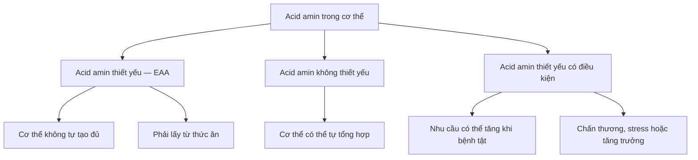
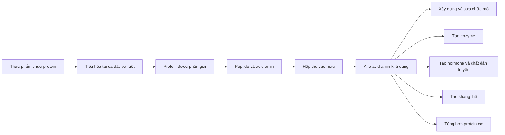
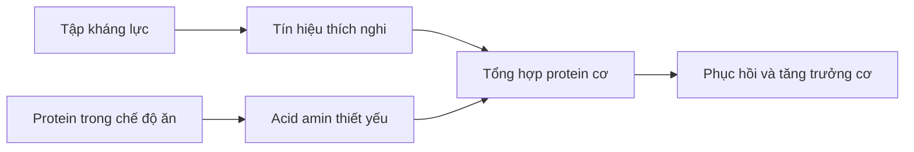
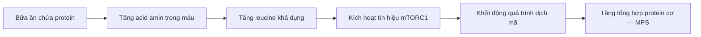
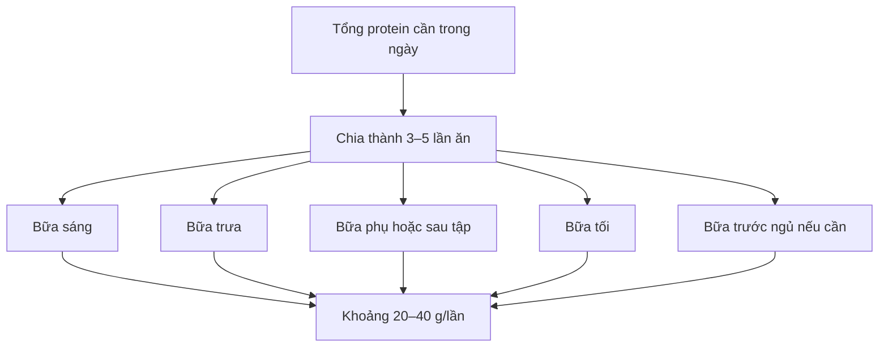

[](https://life.liga.net/poyasnennya/article/eshte-na-zavtrak-obed-i-ujin-zachem-cheloveku-belki-polza-norma-i-belkovye-diety?utm_source=chatgpt.com)

# 007 — Protein Explained

## Protein là gì và vì sao đây là chất đa lượng được ưu tiên trong thể hình?

| Thuộc tính              | Nội dung                                                                 |
| ----------------------- | ------------------------------------------------------------------------ |
| **Module**              | Module 02 — Meal Planning Basics                                         |
| **Bài học**             | Protein Explained                                                        |
| **Thời lượng**          | 02:15 — Xem trước miễn phí                                               |
| **Chủ đề chính**        | Cấu tạo, chức năng và vai trò của protein trong xây dựng, duy trì cơ bắp |
| **Mức độ**              | Nền tảng                                                                 |
| **Thuật ngữ trọng tâm** | Protein, amino acid, EAA, leucine, MPS, mTOR, TEF                        |

---

## 1. Mục tiêu bài học

Sau bài học này, bạn có thể:

* Giải thích protein được cấu tạo từ các **acid amin** như thế nào.
* Phân biệt **acid amin thiết yếu** và **acid amin không thiết yếu**.
* Nêu được các chức năng của protein ngoài việc xây dựng cơ bắp.
* Hiểu vì sao protein thường là chất đa lượng được ưu tiên khi lập chế độ ăn thể hình.
* Giải thích vai trò của **leucine** đối với quá trình tổng hợp protein cơ.
* Biết cách phân bổ protein thực tế vào các bữa ăn trong ngày.

---

## 2. Protein là gì?

**Protein** là một chất dinh dưỡng đa lượng được tạo thành từ nhiều acid amin liên kết với nhau thành chuỗi.

Có thể hình dung:

> **Acid amin là những viên gạch, còn protein là công trình được xây từ những viên gạch đó.**

Trong dinh dưỡng, người ta thường nói đến **20 acid amin phổ biến** tham gia cấu tạo protein của cơ thể. Trong số đó, có **9 acid amin thiết yếu** mà cơ thể không thể tự tổng hợp đủ, vì vậy bắt buộc phải lấy từ thực phẩm. ([NCBI][1])

### Chín acid amin thiết yếu — EAA

| STT | Tên tiếng Anh | Tên thường dùng |
| --: | ------------- | --------------- |
|   1 | Histidine     | Histidine       |
|   2 | Isoleucine    | Isoleucine      |
|   3 | Leucine       | Leucine         |
|   4 | Lysine        | Lysine          |
|   5 | Methionine    | Methionine      |
|   6 | Phenylalanine | Phenylalanine   |
|   7 | Threonine     | Threonine       |
|   8 | Tryptophan    | Tryptophan      |
|   9 | Valine        | Valine          |

### Sơ đồ phân loại acid amin



> **Lưu ý:** “Không thiết yếu” không có nghĩa là không quan trọng. Nó chỉ có nghĩa là trong điều kiện bình thường, cơ thể có khả năng tự tổng hợp acid amin đó.

### Ảnh minh họa: cấu trúc các acid amin

[](https://commons.wikimedia.org/wiki/File:Molecular_structures_of_the_21_proteinogenic_amino_acids.svg)

*Nguồn: Wikimedia Commons — sơ đồ cấu trúc các acid amin tạo protein.* ([Wikimedia Commons][2])

---

## 3. Điều gì xảy ra sau khi bạn ăn protein?

Khi ăn thịt, cá, trứng, sữa, đậu hoặc những thực phẩm giàu protein khác, cơ thể không đưa nguyên miếng protein đó trực tiếp vào cơ bắp.

Quá trình diễn ra theo các bước:



Protein trong thức ăn được biến tính và phân giải thành peptide, acid amin trước khi được hấp thu. Các acid amin sau đó được cơ thể sử dụng để tổng hợp những loại protein mới cần thiết. ([NCBI][3])

### Cơ thể có dự trữ acid amin không?

Cơ thể có một **amino acid pool — kho acid amin khả dụng tạm thời**, nhưng không có kho dự trữ protein chuyên biệt giống như:

* Glycogen dùng để dự trữ carbohydrate.
* Mô mỡ dùng để dự trữ năng lượng từ chất béo.
* Gan và cơ dùng để dự trữ một phần glucose dưới dạng glycogen.

Khi thiếu acid amin, cơ thể có thể phải phân giải protein từ các mô, bao gồm cả mô cơ, để cung cấp nguyên liệu cho những chức năng quan trọng hơn.

Vì vậy, bạn nên cung cấp protein thường xuyên qua chế độ ăn hằng ngày.

---

## 4. Protein không chỉ dành cho cơ bắp

Protein thực hiện hàng nghìn nhiệm vụ khác nhau trong cơ thể. Đây là lý do protein không chỉ quan trọng với người tập gym mà cần thiết với tất cả mọi người.

### Các chức năng chính

| Chức năng                 | Ví dụ                                                       |
| ------------------------- | ----------------------------------------------------------- |
| **Xây dựng cấu trúc**     | Cơ, da, tóc, móng, gân, dây chằng                           |
| **Sửa chữa mô**           | Phục hồi tổn thương sau vận động hoặc chấn thương           |
| **Tạo enzyme**            | Hỗ trợ tiêu hóa và các phản ứng sinh hóa                    |
| **Tạo kháng thể**         | Tham gia hoạt động của hệ miễn dịch                         |
| **Tạo hormone peptide**   | Ví dụ: insulin                                              |
| **Vận chuyển chất**       | Hemoglobin vận chuyển oxy; albumin vận chuyển nhiều phân tử |
| **Duy trì cân bằng dịch** | Hỗ trợ giữ chất lỏng trong hệ tuần hoàn                     |
| **Co cơ và vận động**     | Actin và myosin tạo ra chuyển động của cơ                   |

Cơ thể có hàng nghìn loại protein khác nhau, mỗi loại đảm nhiệm một hoặc nhiều chức năng sinh học riêng biệt. ([NCBI][4])

---

## 5. Vì sao protein được ưu tiên trong chế độ ăn thể hình?

Protein thường là chất đa lượng đầu tiên được xác định khi thiết kế chế độ ăn cho người muốn tăng cơ, giảm mỡ hoặc cải thiện thành phần cơ thể.

Điều này không có nghĩa carbohydrate và chất béo không quan trọng. Nó có nghĩa rằng thiếu protein sẽ trực tiếp hạn chế khả năng duy trì và phát triển mô cơ.

---

### 5.1. Protein cung cấp nguyên liệu xây dựng cơ bắp

Cơ bắp được cấu tạo chủ yếu từ nước và các loại protein, đặc biệt là những protein co cơ như actin và myosin.

Có thể sử dụng phép so sánh:

> Nếu cơ bắp là bức tường của một ngôi nhà, quá trình tập luyện là bản thiết kế và tín hiệu xây dựng, còn protein cung cấp vật liệu để sửa chữa và mở rộng bức tường.

Tập kháng lực tạo ra tín hiệu thích nghi. Protein cung cấp các acid amin cần thiết để cơ thể sửa chữa và xây dựng mô cơ mới.



---

### 5.2. Protein giúp bảo vệ cơ khi giảm cân

Trong giai đoạn thâm hụt calorie, cơ thể phải lấy năng lượng từ những nguồn dự trữ.

Mục tiêu lý tưởng là:

* Giảm phần lớn năng lượng từ mô mỡ.
* Hạn chế tối đa việc mất khối lượng cơ.
* Duy trì hiệu suất tập luyện.
* Duy trì sức mạnh và khả năng vận động.

Ăn đủ protein, kết hợp với tập kháng lực, giúp tạo điều kiện thuận lợi hơn để bảo tồn khối lượng cơ trong quá trình giảm cân.

Tuy nhiên, protein không thể tự bảo vệ toàn bộ cơ bắp nếu:

* Mức thâm hụt calorie quá lớn.
* Không tập kháng lực.
* Ngủ không đủ.
* Thời gian giảm cân kéo dài nhưng không có giai đoạn phục hồi.
* Lượng protein tổng thể vẫn thấp.

---

### 5.3. Protein thường tạo cảm giác no tốt

So với carbohydrate và chất béo, chế độ ăn có tỷ lệ protein cao hơn thường giúp cải thiện cảm giác no và kiểm soát cơn đói ở nhiều người. Tuy nhiên, mức độ no còn phụ thuộc vào dạng thực phẩm, hàm lượng chất xơ, độ đặc, tốc độ ăn và tổng năng lượng của bữa ăn. ([PubMed Central (PMC)][5])

Ví dụ:

| Lựa chọn ít no hơn   | Lựa chọn thường no hơn                 |
| -------------------- | -------------------------------------- |
| Nước ngọt            | Sữa chua giàu protein                  |
| Bánh ngọt            | Trứng và trái cây                      |
| Snack tinh chế       | Thịt nạc và rau                        |
| Nước ép              | Sinh tố có sữa, đậu nành hoặc sữa chua |
| Bánh mì trắng đơn lẻ | Bánh mì kèm cá ngừ hoặc trứng          |

> Protein không làm calorie “biến mất”. Lợi ích chính là giúp một số người kiểm soát khẩu phần và duy trì chế độ ăn dễ hơn.

---

### 5.4. Protein có hiệu ứng nhiệt cao

**Hiệu ứng nhiệt của thực phẩm — Thermic Effect of Food, TEF** là lượng năng lượng cơ thể sử dụng để tiêu hóa, hấp thu và chuyển hóa thức ăn.

Giá trị thường được ước tính:

| Chất đa lượng    |  TEF ước tính |
| ---------------- | ------------: |
| **Protein**      | Khoảng 20–30% |
| **Carbohydrate** |  Khoảng 5–10% |
| **Chất béo**     |   Khoảng 0–3% |

Các giá trị trên là phạm vi trung bình, không phải phép trừ calorie chính xác cho từng bữa ăn. ([PubMed Central (PMC)][6])

Ví dụ đơn giản:

```text
100 kcal protein
        ↓
Một phần năng lượng được dùng cho tiêu hóa và chuyển hóa
        ↓
Năng lượng ròng thấp hơn 100 kcal
```

Không nên hiểu rằng bạn có thể ghi lại 100 kcal protein thành chính xác 70–80 kcal trong ứng dụng theo dõi. Hệ thống ước tính nhu cầu năng lượng hằng ngày đã phản ánh TEF ở một mức độ nhất định.

---

### 5.5. Chuyển protein trực tiếp thành mỡ là quá trình kém hiệu quả

Cơ thể ưu tiên sử dụng acid amin để:

1. Tổng hợp protein của cơ thể.
2. Tạo enzyme, hormone và các hợp chất chứa nitơ.
3. Oxy hóa để tạo năng lượng khi cần.
4. Chuyển bộ khung carbon sang các chất trung gian chuyển hóa.

Việc chuyển lượng protein dư thừa trực tiếp thành acid béo dự trữ là một con đường tương đối phức tạp và tốn năng lượng.

Tuy nhiên:

> **Protein không miễn nhiễm với định luật cân bằng năng lượng.**

Khi tổng calorie nạp vào liên tục cao hơn mức tiêu hao, cơ thể vẫn có thể tăng mỡ. Trong các thử nghiệm ăn thừa có kiểm soát, mức tăng mỡ chủ yếu được quyết định bởi lượng năng lượng dư, dù lượng protein có ảnh hưởng đến phần khối lượng nạc tăng thêm. ([PubMed Central (PMC)][7])

Vì vậy, nên thay câu “protein không chuyển thành mỡ” bằng:

> **Protein khó được chuyển trực tiếp thành mỡ hơn, nhưng ăn thừa calorie từ bất kỳ chế độ ăn nào vẫn có thể làm tăng mỡ cơ thể.**

---

## 6. Leucine — tín hiệu khởi động tổng hợp protein cơ

### 6.1. Leucine là gì?

**Leucine** là một trong chín acid amin thiết yếu và thuộc nhóm ba acid amin chuỗi nhánh — BCAA:

* Leucine.
* Isoleucine.
* Valine.

Leucine không chỉ đóng vai trò là nguyên liệu xây dựng protein mà còn hoạt động như một tín hiệu dinh dưỡng liên quan đến con đường **mTORC1**, từ đó hỗ trợ kích hoạt quá trình tổng hợp protein cơ.

### Ảnh minh họa: cấu trúc phân tử leucine

[](https://commons.wikimedia.org/wiki/File:Leucine.svg)

*Nguồn: Wikimedia Commons — công thức cấu tạo của leucine.* ([Wikimedia Commons][8])

---

### 6.2. Từ leucine đến tổng hợp protein cơ



Trong ứng dụng dinh dưỡng thể thao, một bữa ăn chứa khoảng **2–3 g leucine** thường được xem là phạm vi thực hành có thể hỗ trợ tạo phản ứng tổng hợp protein cơ mạnh. Tuy nhiên, đây không phải “công tắc bật/tắt” tuyệt đối; phản ứng còn phụ thuộc vào tuổi, khối lượng cơ thể, bài tập, nguồn protein, tổng lượng acid amin và thành phần toàn bộ bữa ăn. ([PubMed Central (PMC)][9])

### 6.3. Tương đương bao nhiêu protein?

Khoảng 2–3 g leucine thường có thể đạt được từ:

* Khoảng **20–40 g protein chất lượng cao**.
* Hoặc khoảng **0,25–0,40 g protein/kg cân nặng trong một bữa**.

Các khuyến nghị thực hành cho người tập thường sử dụng khoảng 20–40 g protein mỗi lần ăn, tùy cân nặng, tuổi, nguồn thực phẩm và mục tiêu. ([SpringerLink][10])

### Ví dụ theo cân nặng

| Cân nặng | 0,25 g/kg | 0,40 g/kg | Phạm vi tham khảo/bữa |
| -------: | --------: | --------: | --------------------: |
|    50 kg |    12,5 g |      20 g |        Khoảng 15–25 g |
|    60 kg |      15 g |      24 g |        Khoảng 20–30 g |
|    70 kg |    17,5 g |      28 g |        Khoảng 20–35 g |
|    80 kg |      20 g |      32 g |        Khoảng 25–40 g |
|    90 kg |    22,5 g |      36 g |        Khoảng 25–40 g |

Đây là phạm vi hướng dẫn, không phải giới hạn hấp thu.

> Cơ thể vẫn tiêu hóa và sử dụng protein khi một bữa chứa hơn 40 g. Khái niệm 20–40 g chủ yếu liên quan đến cách phân bổ protein để hỗ trợ phản ứng tổng hợp protein cơ, không có nghĩa phần protein vượt quá sẽ bị “lãng phí”.

---

## 7. Có cần chia protein thành nhiều bữa không?

Sau khi đạt đủ **tổng lượng protein hằng ngày**, phân bổ protein thành các bữa tương đối đều có thể là chiến lược hợp lý.

### Mô hình đơn giản



Khoảng cách **3–4 giờ giữa các bữa chứa protein** thường được sử dụng trong hướng dẫn dinh dưỡng thể thao. Tuy nhiên, tổng protein cả ngày vẫn quan trọng hơn việc căn từng phút quanh buổi tập. ([SpringerLink][10])

### Thứ tự ưu tiên

1. Đạt đủ tổng protein trong ngày.
2. Duy trì mức calorie phù hợp mục tiêu.
3. Ăn đủ thực phẩm giàu vi chất và chất xơ.
4. Phân bổ protein tương đối đều.
5. Sau đó mới tối ưu thời điểm quanh buổi tập.

---

## 8. Các nguồn protein phổ biến

### 8.1. Nguồn protein động vật

* Thịt gà.
* Thịt bò nạc.
* Thịt heo nạc.
* Cá và hải sản.
* Trứng.
* Sữa.
* Sữa chua Hy Lạp.
* Phô mai tươi.
* Whey và casein.

Các nguồn như trứng, sữa, thịt và hải sản thường cung cấp đủ chín acid amin thiết yếu với tỷ lệ thuận lợi. ([NCBI][3])

### 8.2. Nguồn protein thực vật

* Đậu nành.
* Đậu phụ.
* Tempeh.
* Edamame.
* Đậu lăng.
* Đậu gà.
* Đậu đen, đậu đỏ.
* Seitan.
* Các loại hạt.
* Ngũ cốc nguyên hạt.
* Bột protein đậu, gạo hoặc đậu nành.

### Ảnh minh họa: các thực phẩm giàu protein

[](https://commons.wikimedia.org/wiki/File:Protein-rich_Foods.jpg)

*Nguồn: Wikimedia Commons — tập hợp một số thực phẩm giàu protein.* ([Wikimedia Commons][11])

---

## 9. Protein thực vật có kém hơn protein động vật không?

Không nên kết luận rằng protein thực vật là protein “xấu” hoặc “không sử dụng được”.

Sự khác biệt thường nằm ở:

* Hàm lượng acid amin thiết yếu.
* Hàm lượng leucine.
* Khả năng tiêu hóa.
* Lượng protein trên mỗi khẩu phần.
* Thành phần chất xơ và các chất đi kèm.

Một số nguồn thực vật có hàm lượng một acid amin thiết yếu thấp hơn tương đối so với nhu cầu của cơ thể. Tuy nhiên, chế độ ăn đa dạng gồm nhiều nguồn thực vật trong ngày có thể bổ sung hồ sơ acid amin cho nhau.

### Một số cách kết hợp

| Nhóm thực phẩm 1 | Nhóm thực phẩm 2 | Ví dụ                         |
| ---------------- | ---------------- | ----------------------------- |
| Ngũ cốc          | Các loại đậu     | Cơm và đậu                    |
| Bánh mì          | Bơ đậu phộng     | Bánh mì nguyên cám và bơ đậu  |
| Ngô              | Đậu              | Tortilla ngô và đậu           |
| Yến mạch         | Đậu nành         | Yến mạch nấu với sữa đậu nành |

Không bắt buộc phải kết hợp hai nguồn “bổ sung” trong cùng một miếng ăn. Điều quan trọng hơn là tổng lượng và sự đa dạng protein trong cả ngày.

Người ăn thuần thực vật có thể cần:

* Chú ý tổng protein cao hơn một chút.
* Ưu tiên đậu nành, tempeh, đậu phụ và các loại đậu.
* Phân bổ protein qua nhiều bữa.
* Đảm bảo đủ năng lượng.
* Theo dõi vitamin B12 và một số vi chất khác.

---

## 10. Bao nhiêu protein mỗi ngày?

Nhu cầu phụ thuộc vào:

* Cân nặng.
* Mức vận động.
* Mục tiêu tăng cơ hay giảm mỡ.
* Tuổi.
* Tổng calorie.
* Kinh nghiệm tập luyện.
* Tình trạng sức khỏe.

### Phạm vi tham khảo cho người tập luyện

| Đối tượng                           |                             Protein tham khảo |
| ----------------------------------- | --------------------------------------------: |
| Người ít vận động                   | Khoảng 0,8 g/kg/ngày là mức tham chiếu cơ bản |
| Người vận động thường xuyên         |                      Khoảng 1,2–1,6 g/kg/ngày |
| Người tập kháng lực                 |                      Khoảng 1,4–2,0 g/kg/ngày |
| Người giảm mỡ, muốn giữ cơ          |             Thường dùng phần trên của phạm vi |
| Vận động viên có hoàn cảnh đặc biệt |                   Có thể cần điều chỉnh riêng |

ISSN đưa ra phạm vi khoảng **1,4–2,0 g/kg/ngày** cho phần lớn người tập luyện, trong khi liều mỗi bữa thường được hướng dẫn ở mức 20–40 g hoặc khoảng 0,25 g/kg trở lên. ([SpringerLink][10])

### Ví dụ tính nhanh

Một người nặng 70 kg chọn mục tiêu 1,8 g/kg/ngày:

```text
70 kg × 1,8 g/kg = 126 g protein/ngày
```

Có thể phân bổ:

| Bữa ăn               |   Protein |
| -------------------- | --------: |
| Bữa sáng             |      30 g |
| Bữa trưa             |      35 g |
| Bữa phụ hoặc sau tập |      25 g |
| Bữa tối              |      36 g |
| **Tổng**             | **126 g** |

---

## 11. Không phải càng nhiều protein càng tốt

Ngưỡng **2,2 g/kg/ngày** không phải một bức tường sinh học mà sau đó mọi protein đều vô dụng.

Cách hiểu phù hợp hơn:

* Đa số người tập có thể đạt gần hết lợi ích với khoảng 1,4–2,0 g/kg/ngày.
* Lợi ích tăng cơ bổ sung thường giảm dần khi lượng protein đã đủ.
* Một số trường hợp giảm calorie mạnh, vận động viên hoặc người có nhu cầu đặc biệt có thể sử dụng lượng cao hơn.
* Ăn quá nhiều protein có thể chiếm chỗ của carbohydrate, chất béo, chất xơ và các thực phẩm giàu vi chất.
* Mức tối ưu phải phù hợp với tổng calorie và khả năng duy trì chế độ ăn.

Phân tích được ISSN trích dẫn cho thấy lợi ích đối với tăng khối lượng không mỡ tăng đến khoảng 1,6 g/kg/ngày ở mức trung bình, nhưng mức nhu cầu cá nhân có thể cao hơn; vì thế phạm vi 1,4–2,0 g/kg/ngày thường thực tế hơn một con số duy nhất. ([SpringerLink][12])

---

## 12. Protein cao có gây hại thận không?

Đối với **người trưởng thành khỏe mạnh**, các tổng quan và phân tích thử nghiệm hiện có không cho thấy chế độ ăn protein cao làm suy giảm chức năng thận trong thời gian nghiên cứu. Tuy nhiên, lượng protein cao có thể làm tăng mức lọc cầu thận như một phản ứng thích nghi, và dữ liệu dài hạn vẫn có những giới hạn. ([PubMed Central (PMC)][13])

Không nên áp dụng kết luận này cho người:

* Đã mắc bệnh thận mạn.
* Có protein niệu hoặc chức năng thận bất thường.
* Mắc một số bệnh chuyển hóa.
* Được bác sĩ yêu cầu hạn chế protein.
* Đang sử dụng chế độ ăn điều trị đặc biệt.

> Người có bệnh thận hoặc nghi ngờ chức năng thận bất thường cần xác định lượng protein cùng bác sĩ hoặc chuyên gia dinh dưỡng lâm sàng.

---

## 13. Áp dụng thực tế

### Quy tắc đơn giản nhất

> **Mỗi bữa chính nên có một nguồn protein rõ ràng.**

Khi nhìn vào đĩa ăn, bạn nên trả lời được ngay:

* Protein đến từ đâu?
* Khẩu phần có đủ lớn không?
* Đây có phải nguồn protein chính hay chỉ chứa một lượng nhỏ?
* Bữa ăn có cân bằng với rau, carbohydrate và chất béo không?

### Công thức xây dựng một bữa ăn


### Ví dụ

| Bữa ăn             | Nguồn protein chính       | Thành phần đi kèm  |
| ------------------ | ------------------------- | ------------------ |
| Bữa sáng           | Trứng và sữa chua         | Yến mạch, trái cây |
| Bữa trưa           | Ức gà                     | Cơm, rau           |
| Bữa phụ            | Sữa chua Hy Lạp hoặc whey | Chuối              |
| Bữa tối            | Cá                        | Khoai, salad       |
| Bữa thuần thực vật | Đậu phụ hoặc tempeh       | Cơm, rau, mè       |

---

## 14. Lỗi thường gặp

### Lỗi 1: Bữa ăn có “một ít protein” nhưng không có nguồn protein chính

Ví dụ:

* Cơm với vài lát xúc xích.
* Mì có một ít thịt băm.
* Salad chỉ rắc vài hạt.
* Bánh mì có một lát phô mai mỏng.

Những bữa này có chứa protein nhưng chưa chắc cung cấp đủ lượng cần thiết.

---

### Lỗi 2: Dồn gần hết protein vào bữa tối

Ví dụ:

```text
Bữa sáng: 5 g
Bữa trưa: 15 g
Bữa tối: 80 g
```

Tổng protein có thể đạt mục tiêu, nhưng phân bổ đều hơn thường thuận tiện cho cảm giác no và hỗ trợ cung cấp acid amin qua ngày.

Một cách điều chỉnh:

```text
Bữa sáng: 25 g
Bữa trưa: 30 g
Bữa phụ: 20 g
Bữa tối: 30 g
```

---

### Lỗi 3: Chỉ uống BCAA nhưng tổng protein quá thấp

BCAA chỉ cung cấp ba acid amin chuỗi nhánh. Để xây dựng một protein cơ hoàn chỉnh, cơ thể cần đầy đủ các acid amin thiết yếu và những acid amin khác.

Leucine có thể gửi tín hiệu khởi động, nhưng nếu thiếu nguyên liệu, quá trình xây dựng vẫn bị giới hạn.

> Công tắc có thể đã bật, nhưng công trường vẫn cần đủ gạch.

---

### Lỗi 4: Cho rằng whey bắt buộc để tăng cơ

Whey là lựa chọn:

* Tiện lợi.
* Dễ định lượng.
* Giàu acid amin thiết yếu.
* Có hàm lượng leucine tương đối cao.

Nhưng whey không bắt buộc. Bạn vẫn có thể đạt đủ protein từ thực phẩm thông thường.

---

### Lỗi 5: Cho rằng calorie từ protein không thể làm tăng cân

Protein có TEF cao và chuyển trực tiếp thành mỡ kém hiệu quả hơn, nhưng tổng calorie vẫn quyết định xu hướng tăng hoặc giảm cân dài hạn.

---

### Lỗi 6: Tăng protein nhưng bỏ quên chất xơ

Chế độ ăn nhiều thịt, trứng và whey nhưng ít rau, trái cây, ngũ cốc và các loại đậu có thể thiếu:

* Chất xơ.
* Một số vitamin.
* Khoáng chất.
* Hợp chất thực vật có lợi.

Protein cao vẫn cần nằm trong một chế độ ăn đa dạng.

---

## 15. Bài tập thực hành

### Bài tập 1 — Kiểm tra ba bữa gần nhất

Ghi lại ba bữa ăn gần nhất và xác định nguồn protein chính.

| Bữa ăn | Nguồn protein | Số gram ước tính | Có rõ ràng không? |
| ------ | ------------- | ---------------: | ----------------- |
| Bữa 1  |               |                  |                   |
| Bữa 2  |               |                  |                   |
| Bữa 3  |               |                  |                   |

### Bài tập 2 — Tính mục tiêu protein

```text
Cân nặng: ______ kg
Mức protein lựa chọn: ______ g/kg
Mục tiêu: ______ × ______ = ______ g/ngày
```

### Bài tập 3 — Chia protein vào các bữa

| Bữa      | Protein mục tiêu |
| -------- | ---------------: |
| Bữa sáng |                  |
| Bữa trưa |                  |
| Bữa phụ  |                  |
| Bữa tối  |                  |
| **Tổng** |                  |

---

## 16. Checklist thực hành

* [ ] Tôi hiểu protein được cấu tạo từ acid amin.
* [ ] Tôi nhớ cơ thể cần nhận đủ chín acid amin thiết yếu từ chế độ ăn.
* [ ] Tôi biết protein còn tạo enzyme, hormone, kháng thể và các mô cấu trúc.
* [ ] Tôi hiểu protein hỗ trợ xây dựng và bảo tồn cơ bắp.
* [ ] Tôi hiểu TEF của protein cao hơn carbohydrate và chất béo.
* [ ] Tôi không còn cho rằng calorie từ protein hoàn toàn không thể làm tăng mỡ.
* [ ] Tôi biết leucine tham gia kích hoạt tín hiệu tổng hợp protein cơ.
* [ ] Tôi hiểu 20–40 g mỗi bữa là hướng dẫn thực hành, không phải giới hạn hấp thu.
* [ ] Tôi đã tính mục tiêu protein theo cân nặng.
* [ ] Mỗi bữa chính của tôi đều có một nguồn protein rõ ràng.

---

## 17. Tóm tắt bài học

Protein là chất đa lượng được tạo thành từ các acid amin. Trong các acid amin cần thiết cho con người, có **chín loại thiết yếu** mà cơ thể phải nhận từ chế độ ăn.

Protein không chỉ dùng để xây dựng cơ bắp. Nó còn tham gia:

* Sửa chữa mô.
* Tạo enzyme.
* Tạo hormone.
* Tạo kháng thể.
* Vận chuyển các chất.
* Hình thành da, tóc, gân và nhiều cấu trúc khác.

Trong chế độ ăn thể hình, protein thường được ưu tiên vì nó:

1. Cung cấp nguyên liệu xây dựng cơ.
2. Hỗ trợ duy trì cơ khi giảm calorie.
3. Thường tạo cảm giác no tốt.
4. Có hiệu ứng nhiệt cao.
5. Tốn nhiều năng lượng hơn để chuyển hóa so với chất béo.

Leucine là một acid amin thiết yếu có vai trò phát tín hiệu liên quan đến mTORC1 và quá trình tổng hợp protein cơ. Một bữa chứa khoảng **20–40 g protein chất lượng cao**, hoặc khoảng **0,25–0,40 g/kg**, thường là phạm vi thực hành hữu ích.

Điều quan trọng nhất không phải uống protein đúng một “khung giờ vàng”, mà là:

> **Đạt đủ tổng protein hằng ngày, duy trì tập kháng lực và phân bổ lượng protein theo cách bạn có thể thực hiện lâu dài.**

[1]: https://ncbi.nlm.nih.gov/books/NBK557845/?utm_source=chatgpt.com "Biochemistry, Essential Amino Acids - StatPearls - NCBI Bookshelf"
[2]: https://commons.wikimedia.org/wiki/File%3AMolecular_structures_of_the_21_proteinogenic_amino_acids.svg?utm_source=chatgpt.com "File:Molecular structures of the 21 proteinogenic amino acids.svg - Wikimedia Commons"
[3]: https://ncbi.nlm.nih.gov/books/NBK555990/?0bce2d55_page=2&utm_source=chatgpt.com "Physiology, Proteins - StatPearls - NCBI Bookshelf"
[4]: https://www.ncbi.nlm.nih.gov/books/NBK235017/?utm_source=chatgpt.com "Guidelines For A New Eating Pattern - Eat for Life - NCBI Bookshelf"
[5]: https://pmc.ncbi.nlm.nih.gov/articles/PMC5872778/?utm_source=chatgpt.com "Protein for Life: Review of Optimal Protein Intake, Sustainable ..."
[6]: https://pmc.ncbi.nlm.nih.gov/articles/PMC11217690/?utm_source=chatgpt.com "Diet induced thermogenesis, older and newer data with emphasis on obesity and diabetes mellitus - A narrative review - PMC"
[7]: https://pmc.ncbi.nlm.nih.gov/articles/PMC3777747/?utm_source=chatgpt.com "Effect of Dietary Protein Content on Weight Gain, Energy ..."
[8]: https://commons.wikimedia.org/wiki/File%3ALeucine.svg?utm_source=chatgpt.com "File:Leucine.svg - Wikimedia Commons"
[9]: https://pmc.ncbi.nlm.nih.gov/articles/PMC10400406/?utm_source=chatgpt.com "Association of postprandial postexercise muscle protein synthesis rates with dietary leucine: A systematic review - PMC"
[10]: https://jissn.biomedcentral.com/articles/10.1186/s12970-017-0177-8?utm_source=chatgpt.com "International Society of Sports Nutrition Position Stand: protein ..."
[11]: https://commons.wikimedia.org/wiki/File%3AProtein-rich_Foods.jpg?utm_source=chatgpt.com "File:Protein-rich Foods.jpg - Wikimedia Commons"
[12]: https://jissn.biomedcentral.com/articles/10.1186/s12970-018-0242-y?utm_source=chatgpt.com "ISSN exercise & sports nutrition review update - Springer Nature"
[13]: https://pmc.ncbi.nlm.nih.gov/articles/PMC6054213/?utm_source=chatgpt.com "A Systematic Review of Renal Health in Healthy Individuals ..."

---

# Bài luyện tập

## Mục tiêu


## Đề bài


## Yêu cầu hoàn thành

- [ ] 
- [ ] 
- [ ] 

## Kết quả / lời giải


## Ghi chú
