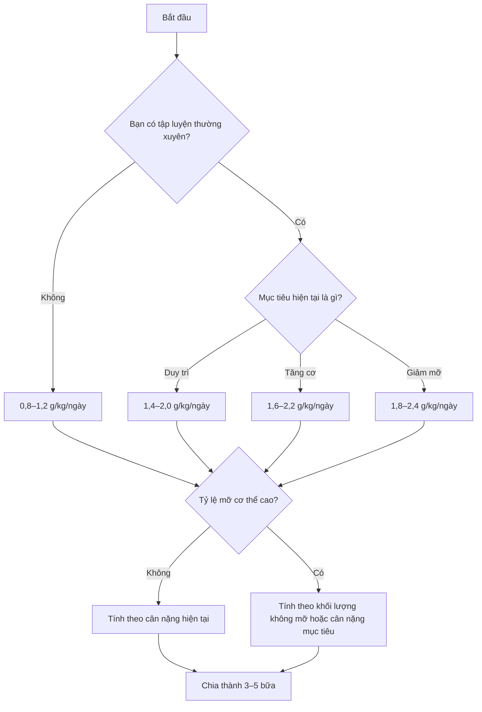

# 008 — How Much Protein Should You Consume Per Day?

| Thuộc tính       | Nội dung                                                                                |
| ---------------- | --------------------------------------------------------------------------------------- |
| **Module**       | Module 02 — Meal Planning Basics                                                        |
| **Bài học**      | How Much Protein Should You Consume Per Day?                                            |
| **Thời lượng**   | 03:58                                                                                   |
| **Chủ đề chính** | Xác định lượng protein hằng ngày theo cân nặng, thành phần cơ thể và mục tiêu tập luyện |

> 🖼️ **Ảnh minh họa đề xuất:** [Bữa ăn giàu protein với cá ngừ, trứng, đậu và rau xanh](https://www.pexels.com/photo/tuna-and-green-beans-with-egg-salad-in-ceramic-bowl-6544260/) — Pexels ghi nhận ảnh được phép sử dụng miễn phí. ([pexels.com][1])

---

## 1. Mục tiêu bài học

Sau bài học này, bạn có thể:

* Hiểu vì sao không tồn tại một mức protein duy nhất phù hợp với tất cả mọi người.
* Phân biệt giữa **mức protein tham chiếu cho sức khỏe cơ bản** và **mức protein phục vụ tăng cơ, giữ cơ**.
* Tính lượng protein theo cân nặng, mục tiêu tập luyện và tỷ lệ mỡ cơ thể.
* Biết khi nào nên tính theo **cân nặng tổng**, **khối lượng không mỡ** hoặc **cân nặng mục tiêu**.
* Chia tổng lượng protein thành các bữa ăn thực tế trong ngày.
* Tránh những lỗi phổ biến như ăn quá ít, tính sai thực phẩm sống–chín hoặc lạm dụng whey protein.

---

## 2. Không có một con số phù hợp với tất cả mọi người

Nhu cầu protein phụ thuộc vào nhiều yếu tố:

* Cân nặng và khối lượng cơ hiện tại.
* Mức độ vận động.
* Loại hình và cường độ tập luyện.
* Mục tiêu tăng cơ, duy trì hay giảm mỡ.
* Mức thâm hụt hoặc thặng dư calorie.
* Tuổi tác và tình trạng sức khỏe.

Một người ít vận động nặng 55 kg sẽ không có nhu cầu giống một vận động viên sức mạnh nặng 100 kg. Tương tự, cùng một người nhưng nhu cầu protein có thể thay đổi giữa giai đoạn tăng cơ và giai đoạn siết mỡ.

Vì vậy, thay vì tìm kiếm một con số “hoàn hảo” đến từng gram, cách hợp lý hơn là xác định một **khoảng protein mục tiêu**.

---

## 3. RDA 0,8 g/kg thực sự có ý nghĩa gì?

Mức protein RDA dành cho người trưởng thành là khoảng:

```text
0,8 g protein/kg cân nặng/ngày
```

Tương đương:

```text
0,36 g protein/pound cân nặng/ngày
```

RDA được định nghĩa là lượng tiêu thụ trung bình đủ đáp ứng nhu cầu của khoảng 97–98% người khỏe mạnh trong một nhóm dân số. Vì vậy, gọi đây là mức “chỉ đủ để sống sót” không hoàn toàn chính xác. Tuy nhiên, đây cũng không phải mức được xây dựng riêng để tối ưu hóa tăng cơ cho người tập kháng lực. ([NCBI][2])

### Ví dụ

Một người nặng 70 kg:

```text
70 × 0,8 = 56 g protein/ngày
```

Khoảng 56 g có thể đáp ứng nhu cầu tham chiếu cơ bản của một người trưởng thành khỏe mạnh, ít vận động. Nhưng người tập gym thường cần nhiều hơn để hỗ trợ phục hồi và phát triển cơ bắp.

---

## 4. Khoảng protein khuyến nghị theo mục tiêu

| Đối tượng hoặc mục tiêu               |                      Protein đề xuất | Ý nghĩa                                          |
| ------------------------------------- | -----------------------------------: | ------------------------------------------------ |
| Người trưởng thành ít vận động        |                **0,8–1,0 g/kg/ngày** | Mức tham chiếu cho sức khỏe cơ bản               |
| Người hoạt động thể chất thông thường |                **1,2–1,6 g/kg/ngày** | Hỗ trợ vận động và phục hồi                      |
| Người tập kháng lực, duy trì cơ       |                **1,6–2,0 g/kg/ngày** | Phù hợp với phần lớn người tập                   |
| Người muốn tối đa hóa tăng cơ         |                **1,6–2,2 g/kg/ngày** | Khoảng thực tế có biên an toàn                   |
| Người giảm mỡ và tập kháng lực        |                **1,8–2,4 g/kg/ngày** | Hỗ trợ giữ cơ và kiểm soát cảm giác đói          |
| VĐV rất gầy, thâm hụt sâu             | **2,3–3,1 g/kg khối lượng không mỡ** | Trường hợp chuyên biệt, không áp dụng cho tất cả |

ISSN cho rằng khoảng **1,4–2,0 g/kg/ngày** là đủ cho phần lớn người tập luyện. Phân tích tổng hợp của Morton và cộng sự ghi nhận lợi ích tăng khối lượng không mỡ trung bình bắt đầu bão hòa quanh **1,6 g/kg/ngày**; giới hạn trên của khoảng tin cậy vào khoảng **2,2 g/kg/ngày**. ([SpringerLink][3])

> **Quy tắc thực hành dễ nhớ:**
> Người tập gym khỏe mạnh có thể bắt đầu với khoảng **2 g protein/kg cân nặng/ngày**, sau đó điều chỉnh theo mục tiêu, khẩu vị và khả năng duy trì.

---

## 5. Trường hợp 1: Sức khỏe cơ bản

Một người không tập luyện để tăng cơ có thể không cần ăn lượng protein giống vận động viên thể hình.

Mốc khởi đầu phù hợp là:

```text
0,8–1,2 g/kg/ngày
```

Người ít vận động có thể ở gần đầu dưới. Người thường xuyên đi bộ, chơi thể thao nhẹ hoặc muốn kiểm soát cảm giác no có thể chọn gần đầu trên.

### Ví dụ

Người nặng 60 kg:

```text
Mức tham chiếu: 60 × 0,8 = 48 g/ngày
Mức thực tế cao hơn: 60 × 1,2 = 72 g/ngày
```

Khoảng mục tiêu có thể là **48–72 g protein/ngày**, tùy mức độ hoạt động và chế độ ăn tổng thể.

---

## 6. Trường hợp 2: Tăng cơ

Để tăng cơ, protein phải đi cùng với:

1. Tập kháng lực có tiến triển.
2. Tổng calorie phù hợp.
3. Ngủ và phục hồi đầy đủ.
4. Protein được duy trì đều đặn.

Ăn nhiều protein nhưng không có kích thích tập luyện phù hợp sẽ không tự động tạo ra nhiều cơ bắp.

### Khoảng nên sử dụng

```text
1,6–2,2 g protein/kg cân nặng/ngày
```

Mức **1,6 g/kg** có thể đã đủ cho nhiều người. Chọn gần **2,0–2,2 g/kg** tạo thêm biên an toàn cho người tập nặng, người khó kiểm soát chính xác khẩu phần hoặc người muốn tối đa hóa khả năng đáp ứng cá nhân.

### Ví dụ: người nặng 75 kg

```text
Mức thấp: 75 × 1,6 = 120 g
Mức trung bình: 75 × 2,0 = 150 g
Mức cao: 75 × 2,2 = 165 g
```

Mục tiêu thực tế:

```text
120–165 g protein/ngày
```

Phần lớn người tập không cần cố ép bản thân ăn chính xác mức cao nhất. Nếu ăn **140–150 g/ngày** một cách ổn định, người này đã nằm trong vùng rất hợp lý.

### Ăn cao hơn có giúp tăng cơ nhanh hơn không?

Không nhất thiết.

Protein có hiện tượng **lợi ích giảm dần**: tăng từ mức thiếu lên mức đủ thường đem lại khác biệt đáng kể, nhưng tiếp tục tăng rất cao sau khi đã đủ không đồng nghĩa cơ bắp sẽ phát triển tương ứng.

Do đó, thay vì uống nhiều whey shake chỉ để đẩy lượng protein lên thật cao, hãy ưu tiên:

* Đạt khoảng protein hợp lý.
* Tập luyện có tiến triển.
* Ăn đủ calorie.
* Duy trì trong nhiều tháng.

---

## 7. Trường hợp 3: Giảm mỡ

Khi giảm cân, mục tiêu không chỉ là làm cân nặng giảm xuống. Mục tiêu tốt hơn là:

```text
Giảm mỡ tối đa + giữ lại nhiều cơ bắp nhất có thể
```

Thâm hụt calorie khiến cơ thể có nguy cơ mất cả mỡ lẫn khối lượng không mỡ. Protein cao hơn kết hợp với tập kháng lực giúp hỗ trợ việc giữ cơ trong giai đoạn này. Một số nghiên cứu ở vận động viên cho thấy mức khoảng **2,3 g/kg cân nặng** bảo toàn khối lượng nạc tốt hơn mức khoảng 1 g/kg trong thâm hụt calorie ngắn hạn. ([PubMed][4])

### Khoảng thực tế

```text
1,8–2,4 g protein/kg cân nặng/ngày
```

Chọn gần đầu trên khi:

* Thâm hụt calorie tương đối sâu.
* Tỷ lệ mỡ đã thấp.
* Khối lượng tập luyện cao.
* Mục tiêu giữ cơ rất quan trọng.
* Thời gian siết kéo dài.

Chọn gần đầu dưới khi:

* Thâm hụt calorie vừa phải.
* Tỷ lệ mỡ cơ thể còn cao.
* Người tập mới bắt đầu.
* Khả năng ăn lượng protein lớn còn hạn chế.

### Ví dụ: nữ nặng 60 kg đang giảm mỡ

```text
60 × 2,0 = 120 g/ngày
60 × 2,2 = 132 g/ngày
```

Mục tiêu thực tế:

```text
120–132 g protein/ngày
```

---

## 8. Khi nào không nên tính theo cân nặng tổng?

Nếu tỷ lệ mỡ cơ thể cao, nhân trực tiếp cân nặng hiện tại với 2–2,4 g/kg có thể tạo ra mục tiêu quá lớn và khó duy trì.

Trong trường hợp này, có thể sử dụng một trong hai phương pháp:

### Phương pháp A — Tính theo khối lượng không mỡ

```text
Khối lượng không mỡ = Cân nặng × (1 − tỷ lệ mỡ)
```

Sau đó:

```text
Protein = Khối lượng không mỡ × hệ số protein
```

### Phương pháp B — Tính theo cân nặng mục tiêu

```text
Protein = Cân nặng mục tiêu × 1,6–2,2
```

Cách này đơn giản hơn nếu chưa đo được tỷ lệ mỡ đáng tin cậy.

### Ví dụ

Nam nặng 110 kg, tỷ lệ mỡ 35%:

```text
Khối lượng không mỡ
= 110 × (1 − 0,35)
= 71,5 kg
```

Nếu sử dụng khoảng 2,3–2,6 g/kg khối lượng không mỡ:

```text
71,5 × 2,3 ≈ 164 g
71,5 × 2,6 ≈ 186 g
```

Mục tiêu hợp lý:

```text
Khoảng 165–185 g protein/ngày
```

Con số này thực tế hơn nhiều so với việc lấy 110 kg nhân trực tiếp với 2,2 và nhận kết quả 242 g/ngày.

Các khuyến nghị rất cao như **2,3–3,1 g/kg khối lượng không mỡ** chủ yếu được đề xuất cho vận động viên tập kháng lực đã tương đối gầy và đang hạn chế calorie, không phải cho tất cả người giảm cân. ([PubMed][5])

---

## 9. Sơ đồ chọn lượng protein



---

## 10. Công thức áp dụng nhanh

Điền thông tin của bạn:

```text
Cân nặng hiện tại: ______ kg
Tỷ lệ mỡ ước tính: ______ %
Mục tiêu: duy trì / tăng cơ / giảm mỡ
Số bữa mỗi ngày: ______ bữa
```

Chọn hệ số:

```text
Sức khỏe cơ bản: × 0,8–1,2
Duy trì và tập luyện: × 1,6–2,0
Tăng cơ: × 1,6–2,2
Giảm mỡ: × 1,8–2,4
```

Tính tổng protein:

```text
Protein/ngày = Cân nặng phù hợp × Hệ số protein
```

Tính lượng mỗi bữa:

```text
Protein/bữa = Protein/ngày ÷ Số bữa
```

### Ví dụ

Người nặng 70 kg, mục tiêu tăng cơ, chọn 1,8 g/kg:

```text
70 × 1,8 = 126 g protein/ngày
```

Ăn bốn bữa:

```text
126 ÷ 4 ≈ 31,5 g protein/bữa
```

Mục tiêu thực tế:

```text
Khoảng 30–35 g protein mỗi bữa
```

---

## 11. Nên chia protein thành bao nhiêu bữa?

Tổng lượng protein trong ngày là ưu tiên lớn nhất. Sau khi đạt tổng lượng cần thiết, nên phân bố tương đối đều thay vì ăn gần như toàn bộ vào một bữa.

ISSN đưa ra khuyến nghị chung khoảng:

```text
20–40 g protein chất lượng cao mỗi lần
```

hoặc:

```text
Khoảng 0,25 g/kg mỗi lần
```

Các lần ăn có thể cách nhau khoảng **3–4 giờ**. Lượng tối ưu còn phụ thuộc cân nặng, tuổi, chất lượng protein và buổi tập gần nhất. ([SpringerLink][3])

### Ví dụ phân bổ 140 g/ngày

| Bữa      | Protein mục tiêu |
| -------- | ---------------: |
| Bữa sáng |             30 g |
| Bữa trưa |             40 g |
| Bữa phụ  |             25 g |
| Bữa tối  |             45 g |
| **Tổng** |        **140 g** |

Không bắt buộc mọi bữa phải giống nhau tuyệt đối. Chênh lệch 5–10 g giữa các bữa không phải vấn đề lớn.

> 🖼️ **Ảnh minh họa đề xuất:** [Meal prep với thịt gà, cơm, trứng và rau củ](https://www.pexels.com/photo/healthy-meal-prep-containers-with-grilled-chicken-30635703/) — phù hợp cho phần hướng dẫn chia khẩu phần. ([pexels.com][6])

---

## 12. Tham chiếu protein trong thực phẩm phổ biến

Các giá trị dưới đây chỉ là con số gần đúng. Hàm lượng thực tế thay đổi theo phần thịt, lượng nước, cách chế biến và thương hiệu sản phẩm.

| Thực phẩm       |                Khẩu phần | Protein ước tính |
| --------------- | -----------------------: | ---------------: |
| Ức gà không da  |               100 g sống |          22–24 g |
| Thịt bò nạc     |               100 g sống |          20–22 g |
| Cá hồi          |                    100 g |          19–21 g |
| Tôm             |                    100 g |          20–24 g |
| Trứng gà        |                2 quả lớn |          12–13 g |
| Đậu phụ cứng    |                    100 g |          10–17 g |
| Sữa chua Hy Lạp |                    100 g |           8–11 g |
| Sữa bò          |                   250 ml |            7–9 g |
| Cá ngừ đóng hộp |             100 g để ráo |          23–26 g |
| Whey protein    | 1 muỗng, khoảng 30 g bột |          20–25 g |

USDA FoodData Central là cơ sở dữ liệu thành phần thực phẩm chính thức; giá trị có thể được trình bày theo 100 g hoặc khẩu phần và thay đổi giữa từng sản phẩm cụ thể. ([FoodData Central][7])

---

## 13. Whey protein có bắt buộc không?

Không.

Whey chỉ là một nguồn protein tiện lợi. Nó có thể hữu ích khi:

* Khó đạt mục tiêu bằng thực phẩm.
* Cần một bữa phụ nhanh.
* Không có thời gian nấu ăn.
* Muốn bổ sung protein mà không thêm quá nhiều calorie.

Tuy nhiên, whey không tốt hơn một chế độ ăn đã cung cấp đủ protein chất lượng cao. Có thể đạt mục tiêu hoàn toàn bằng thịt, cá, trứng, sữa, đậu và các thực phẩm thông thường.

> 🖼️ **Ảnh minh họa đề xuất:** [Muỗng whey protein trên Wikimedia Commons](https://commons.wikimedia.org/wiki/File:Whey_Protein_Scoop_%2849935767168%29.jpg). Ảnh được phát hành theo giấy phép **CC BY 2.0**, vì vậy cần ghi nguồn tác giả khi sử dụng. ([Wikimedia Commons][8])

---

## 14. Những lỗi thường gặp

### 14.1 Nhầm mức tối thiểu với mức tối ưu

Ăn 0,8 g/kg không đồng nghĩa chắc chắn thiếu protein, nhưng mức này thường không phải lựa chọn tối ưu cho người đang cố tăng hoặc giữ cơ.

### 14.2 Chọn một con số quá chính xác

Không có khác biệt thực tế lớn giữa 148 g và 152 g protein. Hãy sử dụng một khoảng, chẳng hạn:

```text
140–160 g/ngày
```

Thay vì cố đạt chính xác 150 g mỗi ngày.

### 14.3 Ăn càng nhiều càng tốt

Sau khi đã đạt khoảng phù hợp, tăng thêm protein thường đem lại lợi ích giảm dần. Protein dư vẫn cung cấp calorie và có thể chiếm chỗ của carbohydrate, chất béo cùng các thực phẩm giàu vi chất khác.

### 14.4 Không phân biệt thực phẩm sống và chín

100 g thịt sống không giống 100 g thịt đã nấu. Khi nấu, thực phẩm thường mất nước nên lượng protein trên mỗi 100 g thành phẩm có vẻ cao hơn.

Hãy chọn một chuẩn và sử dụng nhất quán:

```text
Luôn cân sống
```

hoặc:

```text
Luôn cân sau khi nấu
```

### 14.5 Đếm protein không nhất quán

Cơm, bánh mì, mì và rau vẫn chứa protein. Tuy nhiên, không nên dựa chủ yếu vào các nguồn này nếu mục tiêu là đạt lượng protein cao, bởi chúng thường cung cấp ít protein hơn so với tổng calorie.

### 14.6 Chỉ uống protein sau tập

Không tồn tại một “cửa sổ đồng hóa” chỉ kéo dài vài phút. Tổng protein trong ngày và sự phân bố hợp lý quan trọng hơn việc phải uống whey ngay sau rep cuối cùng. Tác dụng nhạy cảm của cơ đối với protein sau tập có thể kéo dài nhiều giờ. ([SpringerLink][3])

### 14.7 Bỏ qua tình trạng sức khỏe

Ở người trưởng thành khỏe mạnh, cơ quan chuyên môn Hoa Kỳ chưa thiết lập giới hạn tiêu thụ tối đa chính thức cho protein; các chế độ cung cấp khoảng hai đến ba lần RDA trong những nghiên cứu kéo dài vài tháng không cho thấy suy giảm chức năng thận ở người khỏe mạnh. Điều này không áp dụng tự động cho người mắc bệnh thận hoặc các bệnh lý cần hạn chế protein. ([ODS][9])

Người có bệnh thận, bệnh gan, đang mang thai hoặc đang điều trị bệnh nên trao đổi với bác sĩ hay chuyên gia dinh dưỡng trước khi tăng protein đáng kể.

---

## 15. Checklist thực hành

* [ ] Đã xác định mục tiêu: sức khỏe, duy trì, tăng cơ hay giảm mỡ.
* [ ] Đã chọn khoảng protein phù hợp thay vì một con số tùy ý.
* [ ] Đã tính theo khối lượng không mỡ hoặc cân nặng mục tiêu nếu tỷ lệ mỡ cao.
* [ ] Đã chia tổng protein thành 3–5 bữa.
* [ ] Mỗi bữa chính có một nguồn protein rõ ràng.
* [ ] Đã thống nhất cách cân thực phẩm sống hoặc chín.
* [ ] Đã theo dõi khẩu phần ít nhất 7 ngày để kiểm tra lượng ăn thực tế.
* [ ] Không phụ thuộc hoàn toàn vào whey hoặc thực phẩm bổ sung.
* [ ] Vẫn đảm bảo đủ rau, trái cây, carbohydrate và chất béo thiết yếu.

---

## 16. Tóm tắt bài học

Không có một mức protein duy nhất phù hợp cho tất cả mọi người.

* **0,8 g/kg/ngày** là mức tham chiếu dành cho phần lớn người trưởng thành khỏe mạnh, không phải mức chuyên biệt để tối ưu hóa tăng cơ.
* Người tập luyện thường phù hợp với khoảng **1,4–2,0 g/kg/ngày**.
* Người muốn tối đa hóa tăng cơ có thể sử dụng khoảng **1,6–2,2 g/kg/ngày**.
* Người giảm mỡ và muốn giữ cơ có thể chọn khoảng **1,8–2,4 g/kg/ngày**.
* Người có tỷ lệ mỡ cao nên cân nhắc tính theo **khối lượng không mỡ** hoặc **cân nặng mục tiêu**.
* Quy tắc đơn giản cho phần lớn người tập gym là khoảng **2 g protein/kg/ngày**.
* Chia protein thành 3–5 lần ăn, thường khoảng **20–40 g mỗi lần**.
* Whey protein là công cụ tiện lợi, không phải điều kiện bắt buộc để tăng cơ.

Công thức quan trọng nhất:

```text
Protein/ngày = Cân nặng phù hợp × Hệ số theo mục tiêu
```

Sau đó, hãy chọn mức bạn có thể duy trì ổn định trong thời gian dài.

[1]: https://www.pexels.com/photo/tuna-and-green-beans-with-egg-salad-in-ceramic-bowl-6544260/ "Tuna and Green Beans With Egg Salad in Ceramic Bowl · Free Stock Photo"
[2]: https://www.ncbi.nlm.nih.gov/books/NBK614631/?utm_source=chatgpt.com "Introduction - Evaluation of Dietary Protein and Amino Acid Requirements: A Systematic Review - NCBI Bookshelf"
[3]: https://jissn.biomedcentral.com/counter/pdf/10.1186/s12970-017-0177-8.pdf "International Society of Sports Nutrition Position Stand: protein and exercise"
[4]: https://pubmed.ncbi.nlm.nih.gov/19927027/?dopt=Abstract&utm_source=chatgpt.com "Increased protein intake reduces lean body mass loss during weight loss in athletes - PubMed"
[5]: https://pubmed.ncbi.nlm.nih.gov/24092765/?utm_source=chatgpt.com "A systematic review of dietary protein during caloric restriction in resistance trained lean athletes: a case for higher intakes - PubMed"
[6]: https://www.pexels.com/photo/healthy-meal-prep-containers-with-grilled-chicken-30635703/ "Healthy Meal Prep Containers with Grilled Chicken · Free Stock Photo"
[7]: https://fdc.nal.usda.gov/?utm_source=chatgpt.com "USDA FoodData Central"
[8]: https://commons.wikimedia.org/wiki/File%3AWhey_Protein_Scoop_%2849935767168%29.jpg "File:Whey Protein Scoop (49935767168).jpg - Wikimedia Commons"
[9]: https://ods.od.nih.gov/factsheets/ExerciseAndAthleticPerformance-HealthProfessional/?platform=hootsuite&utm_source=chatgpt.com "Dietary Supplements for Exercise and Athletic Performance - Health Professional Fact Sheet"

---

# Bài luyện tập

## Mục tiêu


## Đề bài


## Yêu cầu hoàn thành

- [ ] 
- [ ] 
- [ ] 

## Kết quả / lời giải


## Ghi chú
