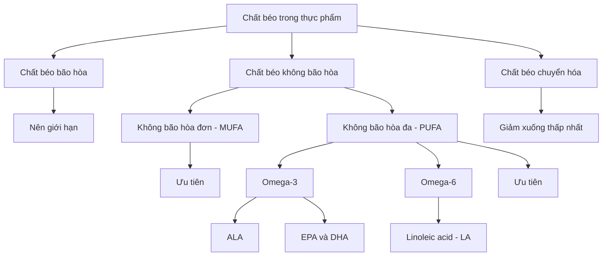
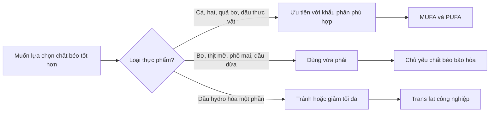

# 009 — Fats Explained

| Thuộc tính       | Nội dung                                                                   |
| ---------------- | -------------------------------------------------------------------------- |
| **Module**       | Module 02 — Meal Planning Basics                                           |
| **Bài học**      | Fats Explained                                                             |
| **Thời lượng**   | 03:14                                                                      |
| **Chủ đề chính** | Các loại chất béo, vai trò sinh lý và cách lựa chọn nguồn chất béo phù hợp |

> **Thông điệp cốt lõi:** Chất béo không phải là “kẻ thù” của chế độ ăn. Cơ thể cần chất béo để duy trì cấu trúc tế bào, hấp thu vitamin tan trong dầu và cung cấp các acid béo thiết yếu. Điều quan trọng không chỉ là **ăn bao nhiêu**, mà còn là **ăn loại chất béo nào**.

---

## 1. Mục tiêu bài học

Sau bài học này, bạn có thể:

* Hiểu vì sao chất béo là một trong ba chất dinh dưỡng đa lượng chính.
* Phân biệt chất béo bão hòa, không bão hòa đơn, không bão hòa đa và chất béo chuyển hóa.
* Biết acid béo nào cơ thể không thể tự tổng hợp.
* Hiểu ảnh hưởng của từng loại chất béo đối với cholesterol và sức khỏe tim mạch.
* Lựa chọn nguồn chất béo phù hợp khi xây dựng thực đơn.
* Tránh những hiểu lầm phổ biến như “ăn chất béo chắc chắn sẽ làm tăng mỡ cơ thể”.

---

## 2. Chất béo là gì?

Chất béo trong thực phẩm — còn gọi là **dietary fat** — là một trong ba nhóm chất dinh dưỡng đa lượng:

1. **Protein**
2. **Carbohydrate**
3. **Chất béo**

Chất béo là chất dinh dưỡng giàu năng lượng nhất:

| Chất dinh dưỡng |   Năng lượng |
| --------------- | -----------: |
| Protein         |     4 kcal/g |
| Carbohydrate    |     4 kcal/g |
| **Chất béo**    | **9 kcal/g** |

Một gam chất béo cung cấp hơn gấp đôi năng lượng của một gam protein hoặc carbohydrate. Tuy nhiên, điều này **không có nghĩa chất béo tự động làm bạn tăng mỡ**. Tăng hay giảm cân vẫn phụ thuộc chủ yếu vào cân bằng năng lượng tổng thể trong thời gian dài. WHO xác nhận chất béo cung cấp khoảng 9 kcal mỗi gam và là chất đa lượng có mật độ năng lượng cao nhất.

---

## 3. Vai trò của chất béo đối với cơ thể

Chất béo không chỉ là nguồn dự trữ năng lượng. Nó còn đảm nhận nhiều chức năng sinh lý quan trọng.

### 3.1. Cấu tạo màng tế bào

Màng của mọi tế bào đều chứa lipid, đặc biệt là phospholipid và cholesterol. Chất béo giúp màng tế bào duy trì cấu trúc, độ linh hoạt và khả năng trao đổi chất với môi trường xung quanh.

### 3.2. Cung cấp acid béo thiết yếu

Cơ thể không tự sản xuất đủ hai acid béo:

* **Linoleic acid – LA**, thuộc nhóm omega-6.
* **Alpha-linolenic acid – ALA**, thuộc nhóm omega-3.

Vì vậy, chúng phải được cung cấp từ thực phẩm.

### 3.3. Hỗ trợ hấp thu vitamin tan trong dầu

Bốn vitamin tan trong dầu gồm:

* Vitamin A
* Vitamin D
* Vitamin E
* Vitamin K

Các vitamin này được hấp thu trong ruột cùng với chất béo. Thêm một lượng chất béo vừa phải vào bữa ăn có thể hỗ trợ hấp thu các vitamin và hợp chất tan trong dầu; điều này không có nghĩa món ăn hoàn toàn không có dầu sẽ “mất hết vitamin”.

### 3.4. Tham gia sản xuất hormone

Cholesterol là nguyên liệu tiền thân để cơ thể tổng hợp nhiều hormone steroid như:

* Testosterone
* Estrogen
* Progesterone
* Cortisol

Điều này không có nghĩa càng ăn nhiều cholesterol hoặc chất béo thì hormone càng cao. Cơ thể kiểm soát quá trình tổng hợp hormone bằng nhiều cơ chế phức tạp.

### 3.5. Bảo vệ và cách nhiệt

Mô mỡ giúp:

* Bảo vệ một số cơ quan khỏi va chạm.
* Giảm mất nhiệt.
* Dự trữ năng lượng cho những thời điểm cơ thể cần sử dụng.

### 3.6. Tăng hương vị và cảm giác no

Chất béo góp phần tạo:

* Hương vị.
* Kết cấu món ăn.
* Cảm giác ngon miệng.
* Cảm giác no kéo dài hơn trong nhiều bữa ăn.

---

## 4. Sơ đồ phân loại chất béo

---

## 5. Bốn nhóm chất béo chính

## 5.1. Chất béo bão hòa — Saturated Fat

Chất béo bão hòa không có liên kết đôi trong chuỗi carbon. Nhiều nguồn chất béo bão hòa có dạng rắn hoặc bán rắn ở nhiệt độ phòng, mặc dù đây không phải quy tắc tuyệt đối.

### Nguồn thực phẩm phổ biến

* Bơ động vật.
* Phô mai.
* Sữa nguyên kem.
* Kem tươi và kem lạnh.
* Thịt nhiều mỡ.
* Mỡ động vật.
* Dầu dừa.
* Dầu cọ và dầu nhân cọ.

### Ảnh hưởng sức khỏe

Chất béo bão hòa có thể làm tăng nồng độ **LDL cholesterol**. LDL tăng cao là một yếu tố nguy cơ quan trọng của bệnh tim mạch.

Các nghiên cứu hiện đại cho thấy ảnh hưởng sức khỏe còn phụ thuộc vào:

* Nguồn thực phẩm.
* Mẫu ăn uống tổng thể.
* Chất dinh dưỡng dùng để thay thế chất béo bão hòa.
* Tình trạng chuyển hóa của từng người.

Tuy nhiên, điều này không có nghĩa chất béo bão hòa đã được chứng minh là hoàn toàn vô hại. Việc **thay một phần chất béo bão hòa bằng chất béo không bão hòa** vẫn được các hướng dẫn sức khỏe tim mạch khuyến nghị.

WHO khuyến nghị chất béo bão hòa không nên vượt quá khoảng **10% tổng năng lượng hằng ngày**. Với chế độ ăn 2.000 kcal, mức này tương đương tối đa khoảng 22 g chất béo bão hòa mỗi ngày.

> **Không cần loại bỏ hoàn toàn**, nhưng cũng không nên coi bơ, thịt mỡ hoặc dầu dừa là những thực phẩm có thể sử dụng không giới hạn.

---

## 5.2. Chất béo không bão hòa đơn — MUFA

**MUFA** là viết tắt của *monounsaturated fatty acids* — acid béo không bão hòa đơn.

### Nguồn thực phẩm

* Dầu ô liu.
* Dầu cải canola.
* Quả bơ.
* Đậu phộng và dầu đậu phộng.
* Hạnh nhân.
* Hạt điều.
* Hạt phỉ.
* Một số loại hạt khác.

Khi được dùng để thay thế chất béo bão hòa, MUFA có thể giúp giảm LDL cholesterol. Các nguồn MUFA nguyên bản hoặc ít chế biến thường là lựa chọn phù hợp cho chế độ ăn hằng ngày.

---

## 5.3. Chất béo không bão hòa đa — PUFA

**PUFA** là viết tắt của *polyunsaturated fatty acids* — acid béo không bão hòa đa.

PUFA bao gồm hai nhóm được nhắc đến nhiều nhất:

* Omega-3.
* Omega-6.

### Nguồn thực phẩm

| Nhóm                   | Nguồn phổ biến                                                                  |
| ---------------------- | ------------------------------------------------------------------------------- |
| **Omega-3 ALA**        | Hạt lanh, hạt chia, quả óc chó, dầu cải, đậu nành                               |
| **Omega-3 EPA và DHA** | Cá hồi, cá mòi, cá trích, cá thu, cá cơm và một số loại hải sản                 |
| **Omega-6 LA**         | Các loại hạt, dầu hướng dương, dầu đậu nành, dầu ngô và nhiều loại dầu thực vật |

Khi PUFA thay thế chất béo bão hòa, LDL cholesterol và nguy cơ tim mạch có thể được cải thiện.

---

## 5.4. Chất béo chuyển hóa — Trans Fat

Chất béo chuyển hóa có thể xuất hiện tự nhiên với lượng nhỏ trong một số sản phẩm động vật. Tuy nhiên, mối quan tâm lớn nhất là **trans fat công nghiệp**, từng được tạo ra phổ biến bằng cách hydro hóa một phần dầu thực vật.

Quá trình này giúp thực phẩm:

* Ổn định hơn.
* Có kết cấu đặc hơn.
* Bảo quản lâu hơn.
* Chịu được quá trình chế biến công nghiệp.

### Nguồn có thể gặp

* Dầu hydro hóa một phần.
* Một số loại shortening.
* Bánh ngọt và bánh nướng công nghiệp.
* Một số thực phẩm chiên hoặc chế biến sẵn.
* Sản phẩm sử dụng công thức cũ có chứa *partially hydrogenated oil*.

Trans fat làm tăng LDL cholesterol và có thể làm giảm HDL cholesterol, từ đó làm tăng nguy cơ bệnh tim mạch. FDA đã xác định dầu hydro hóa một phần không còn được coi là thành phần an toàn để sử dụng rộng rãi trong thực phẩm.

WHO khuyến nghị trans fat nên dưới **1% tổng năng lượng** và trans fat công nghiệp cần được loại bỏ khỏi nguồn cung thực phẩm.

> Không cần gắn trans fat với mọi bệnh lý được đề cập trên mạng. Bằng chứng mạnh và nhất quán nhất là ảnh hưởng bất lợi đối với cholesterol và bệnh tim mạch.

---

## 6. Acid béo thiết yếu: omega-3 và omega-6

### 6.1. Acid béo nào thực sự thiết yếu?

Hai acid béo được xem là thiết yếu đối với con người là:

* **ALA**, thuộc omega-3.
* **LA**, thuộc omega-6.

EPA và DHA rất quan trọng về mặt sinh học nhưng không được phân loại hoàn toàn giống ALA, vì cơ thể có thể tạo một lượng EPA và DHA từ ALA.

Tuy nhiên, quá trình chuyển đổi này rất hạn chế. NIH ghi nhận tỷ lệ chuyển đổi ALA thành EPA rồi DHA thường dưới 15%, vì vậy cá, hải sản hoặc dầu tảo là những nguồn trực tiếp hữu ích của EPA và DHA.

### 6.2. Có cần theo đuổi tỷ lệ omega-6 : omega-3 là 4:1 không?

Không có một tỷ lệ omega-6 : omega-3 duy nhất được mọi cơ quan dinh dưỡng công nhận là tối ưu cho tất cả mọi người.

Một tỷ lệ có thể giống nhau dù lượng omega-3 và omega-6 tuyệt đối rất khác nhau. Vì vậy, cách thực tế hơn là:

* Bảo đảm đủ omega-3.
* Chọn dầu thực vật phù hợp.
* Ăn các loại hạt với khẩu phần hợp lý.
* Hạn chế thực phẩm siêu chế biến.
* Không cần loại bỏ những thực phẩm nguyên bản chứa omega-6.

### 6.3. Nên ăn cá bao nhiêu?

Hiệp hội Tim mạch Hoa Kỳ khuyến nghị khoảng **hai khẩu phần cá mỗi tuần**, đặc biệt là cá béo. Một khẩu phần cá chín khoảng 85 g.

Ví dụ:

* Cá hồi.
* Cá mòi.
* Cá trích.
* Cá cơm.
* Cá thu phù hợp.
* Cá hồi vân.
* Một số loại trai và hàu.

Dầu cá không bắt buộc với tất cả mọi người. Người đang dùng thuốc chống đông, có bệnh nền, chuẩn bị phẫu thuật hoặc muốn dùng liều EPA/DHA cao nên trao đổi với bác sĩ.

---

## 7. Bảng so sánh nhanh

| Loại chất béo                | Nguồn điển hình                                      | Định hướng sử dụng                         |
| ---------------------------- | ---------------------------------------------------- | ------------------------------------------ |
| **Bão hòa – SFA**            | Bơ, phô mai, thịt mỡ, dầu dừa, dầu cọ                | Giới hạn; không cần loại bỏ hoàn toàn      |
| **Không bão hòa đơn – MUFA** | Dầu ô liu, quả bơ, hạnh nhân, đậu phộng              | Ưu tiên thay cho một phần chất béo bão hòa |
| **Không bão hòa đa – PUFA**  | Cá béo, óc chó, hạt lanh, hạt chia, dầu đậu nành     | Cần thiết; cung cấp omega-3 hoặc omega-6   |
| **Chuyển hóa – Trans fat**   | Dầu hydro hóa một phần, một số thực phẩm công nghiệp | Giảm xuống mức thấp nhất có thể            |

Các hướng dẫn hiện hành nhìn chung ưu tiên thay chất béo bão hòa và trans fat bằng chất béo không bão hòa từ thực vật, cá, hạt và các thực phẩm ít chế biến.

---

## 8. Áp dụng vào thực đơn thực tế

### 8.1. Ưu tiên thực phẩm nguyên bản

Các nguồn chất béo phù hợp gồm:

* Cá béo.
* Quả bơ.
* Hạnh nhân, óc chó và các loại hạt.
* Hạt lanh hoặc hạt chia.
* Dầu ô liu.
* Trứng nguyên quả.
* Đậu phụ và đậu nành.
* Sữa và thịt với khẩu phần phù hợp nhu cầu.

### 8.2. Kiểm soát lượng dầu khi nấu ăn

Dầu ăn dễ tạo ra “calorie ẩn” vì khối lượng nhỏ nhưng năng lượng cao.

Một thìa canh dầu thường cung cấp khoảng:

[
14\text{ g chất béo}\times9\text{ kcal/g}\approx126\text{ kcal}
]

Bạn không cần tránh dầu, nhưng nên:

* Đong bằng thìa thay vì rót tự do.
* Tính dầu vào tổng calorie.
* Hạn chế sử dụng lại dầu nhiều lần.
* Không để dầu cháy hoặc bốc khói kéo dài.

### 8.3. Thay thế thay vì chỉ cắt bỏ

Ví dụ:

| Thay vì                    | Có thể chọn                                |
| -------------------------- | ------------------------------------------ |
| Dùng nhiều bơ động vật     | Dùng lượng nhỏ dầu ô liu hoặc dầu cải      |
| Thịt nhiều mỡ thường xuyên | Cá, thịt nạc, đậu phụ hoặc các loại đậu    |
| Bánh ngọt công nghiệp      | Sữa chua, trái cây và một ít hạt           |
| Sốt salad nhiều dầu        | Đong lượng sốt hoặc tự pha                 |
| Snack chiên                | Hạt với khẩu phần nhỏ hoặc ngô rang ít dầu |

Điểm quan trọng là **thứ dùng để thay thế**. Cắt chất béo bão hòa nhưng thay bằng đường hoặc tinh bột tinh chế chưa chắc mang lại lợi ích tương đương với việc thay bằng chất béo không bão hòa.

---

## 9. Những hiểu lầm thường gặp

### Hiểu lầm 1: “Ăn chất béo sẽ làm cơ thể tích mỡ”

Không chính xác.

Chất béo trong thực phẩm và mô mỡ cơ thể không phải là một khái niệm. Cơ thể tăng mỡ khi năng lượng nạp vào vượt quá năng lượng tiêu hao trong thời gian dài, bất kể lượng năng lượng dư thừa đến từ chất béo, carbohydrate, protein hay hỗn hợp của chúng.

Chất béo dễ khiến tổng calorie tăng vì có 9 kcal/g, nhưng nó không có khả năng “biến thẳng thành mỡ” trong mọi hoàn cảnh.

### Hiểu lầm 2: “Chất béo bão hòa hoàn toàn vô hại”

Không chính xác.

Tranh luận khoa học chủ yếu liên quan đến mức độ ảnh hưởng, nguồn thực phẩm và chất dinh dưỡng thay thế. Các hướng dẫn hiện hành vẫn khuyến nghị giới hạn chất béo bão hòa và thay một phần bằng MUFA hoặc PUFA.

### Hiểu lầm 3: “Dầu dừa là chất béo không bão hòa tốt cho tim”

Dầu dừa có nguồn gốc thực vật nhưng chứa tỷ lệ chất béo bão hòa cao. “Có nguồn gốc thực vật” không đồng nghĩa với “chủ yếu là chất béo không bão hòa”.

### Hiểu lầm 4: “Salad không có dầu thì không hấp thu được vitamin nào”

Không chính xác.

Một số vitamin và carotenoid được hấp thu tốt hơn khi bữa ăn có chất béo, nhưng thực phẩm vẫn chứa nhiều chất dinh dưỡng khác và cơ thể vẫn có thể hấp thu một phần. Chỉ cần thêm một lượng chất béo vừa phải, không cần đổ nhiều dầu.

### Hiểu lầm 5: “0 g trans fat nghĩa là hoàn toàn không có trans fat”

Không phải lúc nào cũng đúng.

Theo quy định ghi nhãn của FDA, sản phẩm chứa dưới 0,5 g trans fat mỗi khẩu phần có thể được làm tròn thành **0 g**. Vì vậy, ngoài bảng dinh dưỡng, cần kiểm tra danh sách thành phần để tìm cụm từ **partially hydrogenated oil**.

---

## 10. Chất béo nên chiếm bao nhiêu trong chế độ ăn?

Không có một con số phù hợp cho tất cả mọi người.

Một phạm vi thường được dùng cho người trưởng thành khỏe mạnh là khoảng **20–35% tổng năng lượng từ chất béo**, tùy mục tiêu, sở thích, mức vận động và tình trạng sức khỏe.

Ví dụ với chế độ ăn 2.000 kcal:

[
2.000\times20%=400\text{ kcal}
]

[
400\div9\approx44\text{ g chất béo}
]

Ở mức 35%:

[
2.000\times35%=700\text{ kcal}
]

[
700\div9\approx78\text{ g chất béo}
]

Như vậy, phạm vi minh họa là khoảng **44–78 g chất béo mỗi ngày**.

Đây không phải đơn thuốc. Người có bệnh tim mạch, rối loạn lipid máu, bệnh gan mật, bệnh tụy hoặc vấn đề hấp thu chất béo cần hướng dẫn cá nhân hóa từ bác sĩ hoặc chuyên gia dinh dưỡng.

---

## 11. Checklist thực hành

* [ ] Tôi phân biệt được SFA, MUFA, PUFA và trans fat.
* [ ] Tôi biết ALA và LA là hai acid béo thiết yếu.
* [ ] Tôi có ít nhất một số nguồn chất béo không bão hòa trong thực đơn.
* [ ] Tôi kiểm soát lượng dầu, sốt và bơ hạt sử dụng.
* [ ] Tôi cố gắng ăn cá khoảng hai lần mỗi tuần nếu phù hợp.
* [ ] Tôi không xem dầu dừa hoặc bơ là thực phẩm được dùng không giới hạn.
* [ ] Tôi kiểm tra thành phần “partially hydrogenated oil” trên sản phẩm chế biến.
* [ ] Tôi hiểu rằng tổng calorie vẫn quyết định xu hướng tăng hoặc giảm cân.

---

## 12. Sơ đồ ghi nhớ nhanh

---

## 13. Tóm tắt bài học

Chất béo là chất dinh dưỡng thiết yếu và cung cấp **9 kcal/g**. Nó tham gia cấu tạo màng tế bào, hỗ trợ hấp thu vitamin A, D, E và K, cung cấp acid béo thiết yếu, bảo vệ cơ quan và góp phần tạo cảm giác ngon miệng.

Trong thực tế:

* Ưu tiên **chất béo không bão hòa đơn và đa**.
* Bổ sung omega-3 từ cá, hải sản hoặc nguồn thực vật phù hợp.
* Giữ chất béo bão hòa ở mức vừa phải.
* Giảm trans fat công nghiệp xuống thấp nhất có thể.
* Theo dõi lượng dầu và sốt vì chúng có mật độ calorie cao.
* Không đánh giá thực phẩm chỉ bằng từ “fat”; cần xét loại chất béo, khẩu phần và toàn bộ chế độ ăn.

---

## 14. Ảnh minh họa và tài liệu trực quan

* [Infographic phân loại các loại chất béo — Centre for Food Safety Hong Kong](https://www.cfs.gov.hk/english/multimedia/multimedia_pub/multimedia_pub_fsf_158_02.html)
* [Cá và acid béo omega-3 — American Heart Association](https://www.heart.org/en/healthy-living/healthy-eating/eat-smart/fats/fish-and-omega-3-fatty-acids)
* [Thông tin chuyên môn về omega-3 — NIH Office of Dietary Supplements](https://ods.od.nih.gov/factsheets/Omega3FattyAcids-HealthProfessional/)
* [Khuyến nghị về chất béo trong chế độ ăn lành mạnh — WHO](https://www.who.int/news-room/fact-sheets/detail/healthy-diet)
* [Thông tin về trans fat và dầu hydro hóa một phần — FDA](https://www.fda.gov/food/food-additives-petitions/trans-fat)

---

# Bài luyện tập

## Mục tiêu

## Đề bài

## Yêu cầu hoàn thành

- [ ] 
- [ ] 
- [ ] 

## Kết quả / lời giải

## Ghi chú
