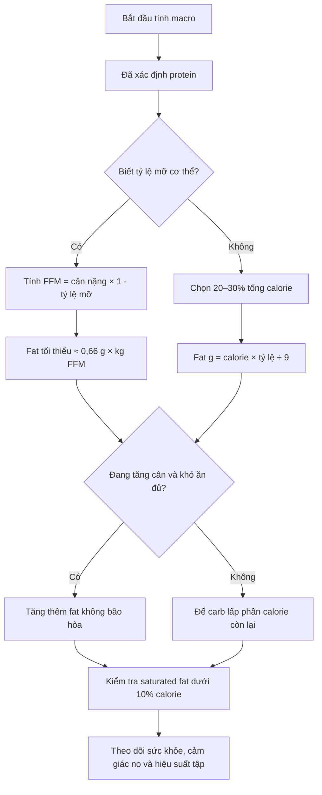

# 010 — Nên ăn bao nhiêu chất béo mỗi ngày?

| Thuộc tính       | Nội dung                                                                                      |
| ---------------- | --------------------------------------------------------------------------------------------- |
| **Học phần**     | Module 02 — Meal Planning Basics                                                              |
| **Bài học**      | How Much Fat Should You Consume Per Day                                                       |
| **Thời lượng**   | 03:42                                                                                         |
| **Chủ đề chính** | Xác định lượng chất béo tối thiểu, lựa chọn loại chất béo và tăng fat khi cần bổ sung calorie |

> **Ý tưởng cốt lõi:** Sau khi xác định protein, hãy đặt một **mức chất béo tối thiểu** để bảo đảm sức khỏe. Phần calorie còn lại có thể được phân bổ giữa carbohydrate và chất béo dựa trên mục tiêu, khả năng tiêu hóa và sở thích ăn uống.

---

## 1. Mục tiêu bài học

Sau bài học này, bạn có thể:

* Tính lượng chất béo tối thiểu dựa trên **khối lượng không mỡ** hoặc tổng calorie.
* Hiểu sự khác nhau giữa **ngưỡng tối thiểu của bài học** và khoảng khuyến nghị dành cho người trưởng thành.
* Phân biệt chất béo không bão hòa, chất béo bão hòa và trans fat.
* Biết khi nào nên tăng chất béo để đạt calorie trong giai đoạn tăng cân.
* Tránh những lỗi thường gặp như bỏ sót dầu ăn hoặc tăng quá nhiều chất béo bão hòa.

---

## 2. Hai cách tính lượng chất béo

### 2.1. Khi biết khối lượng không mỡ

Bài học đưa ra mức tối thiểu:

[
\text{Fat tối thiểu} = 0,3 \times \text{khối lượng không mỡ tính bằng pound}
]

Quy đổi sang hệ mét:

[
\text{Fat tối thiểu} \approx 0,66 \times \text{khối lượng không mỡ tính bằng kg}
]

**Khối lượng không mỡ — fat-free mass, FFM** là toàn bộ trọng lượng cơ thể không phải mỡ, bao gồm:

* Cơ bắp
* Xương
* Nước
* Các cơ quan và mô khác

Công thức ước tính:

[
\text{FFM} = \text{cân nặng} \times (1-\text{tỷ lệ mỡ cơ thể})
]

### Ví dụ

Một người nặng **80 kg**, tỷ lệ mỡ cơ thể khoảng **15%**:

[
FFM = 80 \times (1-0,15)=68\text{ kg}
]

[
Fat tối thiểu = 68 \times 0,66 \approx 45\text{ g/ngày}
]

Cách này chỉ hữu ích khi bạn có ước tính tương đối đáng tin cậy về tỷ lệ mỡ cơ thể.

---

### 2.2. Khi không biết khối lượng không mỡ

Quy tắc đơn giản hơn của bài học là:

> Dành khoảng **15–20% tổng calorie** cho chất béo và ưu tiên không xuống dưới **20%** trong thời gian dài.

Công thức:

[
\text{Fat (g)}=
\frac{\text{Tổng calorie}\times\text{tỷ lệ calorie từ fat}}{9}
]

Mỗi gram chất béo cung cấp khoảng **9 kcal**, cao hơn protein và carbohydrate, vốn cung cấp khoảng 4 kcal mỗi gram.

### Ví dụ với chế độ ăn 2.400 kcal

| Tỷ lệ calorie từ fat | Calorie từ fat | Lượng fat |
| -------------------: | -------------: | --------: |
|                  15% |       360 kcal |      40 g |
|                  20% |       480 kcal |      53 g |
|                  25% |       600 kcal |      67 g |
|                  30% |       720 kcal |      80 g |

Điểm khởi đầu thực tế cho người không theo một chế độ ăn đặc biệt thường là **20–30% tổng calorie**, sau đó điều chỉnh theo hiệu suất tập luyện và sở thích.

---

## 3. Ngưỡng tối thiểu và khoảng khuyến nghị có giống nhau không?

Không hoàn toàn.

| Mốc                               | Ý nghĩa                                                                                    |
| --------------------------------- | ------------------------------------------------------------------------------------------ |
| **15–20% calorie**                | Ngưỡng tối thiểu thực hành được sử dụng trong bài học                                      |
| **20–35% calorie**                | Khoảng phân bố chất béo chấp nhận được dành cho người trưởng thành theo National Academies |
| **≤30% calorie**                  | Hướng dẫn ở cấp độ dân số của WHO nhằm hạn chế tăng cân không lành mạnh                    |
| **<10% calorie từ saturated fat** | Giới hạn chất béo bão hòa của WHO                                                          |
| **<1% calorie từ trans fat**      | Giới hạn trans fat; trans fat công nghiệp nên được loại bỏ                                 |

National Academies xác định khoảng phân bố chất béo dành cho người trưởng thành là **20–35% tổng năng lượng**. WHO sử dụng mốc **30% hoặc thấp hơn** trong hướng dẫn phòng ngừa tăng cân không lành mạnh ở cấp độ dân số. Hai hướng dẫn có mục đích khác nhau nên không nhất thiết mâu thuẫn trực tiếp. ([who.int][1])

### Cách áp dụng thực tế

* **20%**: mốc sàn thận trọng trong đa số chế độ ăn thông thường.
* **25%**: điểm khởi đầu cân bằng, dễ áp dụng.
* **30–35%**: phù hợp với người thích thực phẩm giàu chất béo hoặc cần tăng mật độ calorie.
* **15–20%**: chỉ nên xem là vùng tối thiểu, không phải mục tiêu bắt buộc cho tất cả mọi người.

---

## 4. Sơ đồ xác định lượng chất béo



---

## 5. Loại chất béo quan trọng không kém tổng lượng

Không nên chỉ quan tâm đến số gram chất béo. **Chất lượng nguồn chất béo** cũng ảnh hưởng lớn đến sức khỏe.

### 5.1. Chất béo không bão hòa đơn

Các nguồn phổ biến:

* Dầu ô liu
* Dầu hạt cải
* Quả bơ
* Hạnh nhân
* Đậu phộng
* Bơ đậu phộng tự nhiên
* Các loại hạt khác

Đây có thể là nhóm chất béo chiếm tỷ trọng lớn trong chế độ ăn.

### 5.2. Chất béo không bão hòa đa

Bao gồm omega-3 và omega-6, có trong:

* Cá hồi, cá mòi và cá thu
* Hạt óc chó
* Hạt chia
* Hạt lanh
* Một số loại dầu thực vật

Một số acid béo thuộc nhóm này là **acid béo thiết yếu**, nghĩa là cơ thể không tự tổng hợp đủ và phải lấy từ thực phẩm.

### 5.3. Chất béo bão hòa

Có nhiều trong:

* Mỡ và thịt động vật nhiều mỡ
* Bơ
* Phô mai
* Sữa nguyên kem
* Dầu dừa
* Dầu cọ

Không bắt buộc phải loại bỏ hoàn toàn, nhưng nên giữ dưới **10% tổng calorie**. Việc một sản phẩm đến từ động vật ăn cỏ không đồng nghĩa lượng chất béo bão hòa của nó không còn cần được kiểm soát. ([who.int][1])

### 5.4. Trans fat

Trans fat công nghiệp thường xuất hiện trong dầu hydro hóa một phần và một số thực phẩm chế biến. WHO khuyến nghị giữ trans fat dưới **1% tổng năng lượng** và tránh các nguồn trans fat được sản xuất công nghiệp. ([who.int][2])

---

## 6. Vì sao không nên cắt chất béo quá thấp?

### 6.1. Cung cấp acid béo thiết yếu

Cơ thể cần một số acid béo cho cấu trúc màng tế bào và nhiều quá trình sinh học nhưng không thể tự sản xuất đủ.

### 6.2. Hỗ trợ hấp thu vitamin tan trong chất béo

Vitamin **A, D, E và K** thuộc nhóm vitamin tan trong chất béo. Ví dụ, NIH cho biết khả năng hấp thu vitamin D phụ thuộc vào khả năng hấp thu chất béo của đường ruột; tình trạng kém hấp thu chất béo cũng có thể làm giảm hấp thu vitamin K. ([ODS][3])

### 6.3. Hỗ trợ cảm giác ngon miệng và no

Chất béo:

* Làm món ăn đậm vị hơn.
* Tăng mật độ năng lượng.
* Thường giúp bữa ăn thỏa mãn hơn.
* Có thể làm chậm quá trình tiêu hóa của bữa ăn hỗn hợp.

### 6.4. Liên quan đến hormone

Một phân tích tổng hợp năm 2021 cho rằng chế độ ăn ít chất béo có thể làm giảm testosterone ở nam giới. Tuy nhiên, một phân tích tổng hợp mới hơn năm 2025 không tìm thấy khác biệt có ý nghĩa về các hormone sinh dục giữa chế độ ít fat và nhiều fat. Vì vậy, bằng chứng hiện tại chưa đủ để khẳng định rằng một tỷ lệ fat cụ thể sẽ trực tiếp “tối ưu hormone” cho tất cả mọi người. ([PubMed][4])

> Không nên dùng testosterone làm lý do duy nhất để ăn thật nhiều chất béo. Mục tiêu phù hợp hơn là tránh chế độ ăn quá mất cân đối và bảo đảm đủ acid béo thiết yếu.

---

## 7. Khi nào nên tăng chất béo?

### Giai đoạn tăng cân hoặc tăng cơ

**Bulking** là giai đoạn ăn thặng dư calorie nhằm hỗ trợ tăng cân và phát triển cơ bắp.

Ví dụ, một người cần ăn **3.000 kcal/ngày** để tăng cân nhưng đã đạt đủ protein và carbohydrate cần thiết ở khoảng 2.400 kcal. Người đó vẫn cần bổ sung khoảng **600 kcal**.

Các lựa chọn gồm:

* Ăn thêm protein
* Ăn thêm carbohydrate
* Ăn thêm chất béo
* Kết hợp cả ba

Trong trường hợp khó ăn đủ, tăng chất béo không bão hòa thường là lựa chọn thuận tiện.

### Vì sao chất béo phù hợp để bổ sung calorie?

#### Mật độ calorie cao

| Chất dinh dưỡng | Năng lượng |
| --------------- | ---------: |
| Protein         |   4 kcal/g |
| Carbohydrate    |   4 kcal/g |
| Chất béo        |   9 kcal/g |

Chỉ cần một lượng thực phẩm nhỏ cũng có thể bổ sung nhiều năng lượng.

#### Dễ làm món ăn ngon hơn

Có thể thêm:

* Dầu ô liu vào salad
* Bơ đậu phộng vào yến mạch
* Hạt vào sữa chua
* Quả bơ vào bánh mì
* Sốt làm từ dầu thực vật vào bữa chính

#### Ít làm tăng khối lượng thức ăn

Điều này hữu ích với người:

* Nhanh no
* Chán ăn
* Có nhu cầu calorie cao
* Khó tăng cân dù đã ăn nhiều bữa

---

## 8. Fat cao hay carbohydrate cao?

Sau khi đã đáp ứng đủ protein và lượng fat tối thiểu, cách phân bổ phần calorie còn lại phụ thuộc vào mục tiêu.

| Trường hợp                                    | Hướng phân bổ phù hợp               |
| --------------------------------------------- | ----------------------------------- |
| Tập tạ với khối lượng lớn                     | Ưu tiên thêm carbohydrate           |
| Tập HIIT hoặc các môn cường độ cao            | Ưu tiên thêm carbohydrate           |
| Chạy bộ, đạp xe hoặc thể thao sức bền         | Thường cần nhiều carbohydrate       |
| Khó ăn đủ calorie để tăng cân                 | Có thể tăng chất béo                |
| Thích bữa ăn giàu bơ, hạt, cá và dầu thực vật | Có thể dùng mức fat cao hơn         |
| Không có ưu tiên đặc biệt                     | Bắt đầu ở khoảng 25% calorie từ fat |

Carbohydrate hỗ trợ dự trữ glycogen và các hoạt động cường độ cao. Chất béo lại giúp tăng calorie mà không cần tăng quá nhiều thể tích thức ăn.

> Không nên tự động “cắt carb trước” trong mọi trường hợp. Nếu bạn tập cường độ cao, việc cắt carbohydrate quá mạnh có thể ảnh hưởng đến hiệu suất tập luyện.

---

## 9. Ví dụ tính thực tế

### Trường hợp: nam 80 kg, ăn 2.400 kcal mỗi ngày

Chọn mức khởi đầu **25% calorie từ chất béo**:

[
2.400\times0,25=600\text{ kcal}
]

[
600\div9\approx67\text{ g fat/ngày}
]

Nếu tỷ lệ mỡ cơ thể ước tính là 15%:

[
FFM=80\times0,85=68\text{ kg}
]

[
Mức tối thiểu theo FFM=68\times0,66\approx45\text{ g}
]

**Kết luận:** mục tiêu **67 g/ngày** cao hơn mức tối thiểu khoảng **45 g/ngày**, vì vậy đây là một điểm khởi đầu hợp lý.

---

## 10. Phiếu tính lượng chất béo cá nhân

```text
Cân nặng:                         ______ kg
Tỷ lệ mỡ cơ thể, nếu biết:        ______ %
Khối lượng không mỡ:              ______ kg

Tổng calorie mỗi ngày:            ______ kcal
Tỷ lệ calorie từ fat lựa chọn:    ______ %

Calorie từ fat:
______ kcal × ______ % =          ______ kcal

Lượng fat:
______ kcal ÷ 9 =                 ______ g/ngày

Mức tối thiểu theo FFM:
______ kg × 0,66 =                ______ g/ngày

Mục tiêu cuối cùng:               ______ g fat/ngày
```

---

## 11. Hàm lượng chất béo tham khảo

| Thực phẩm       |    Khẩu phần | Fat ước tính |
| --------------- | -----------: | -----------: |
| Dầu ô liu       | 1 muỗng canh |        ~14 g |
| Trứng gà lớn    |        1 quả |         ~5 g |
| Hạnh nhân       |         30 g |     ~14–15 g |
| Quả bơ          |  1/2 quả vừa |     ~12–15 g |
| Cá hồi          |        100 g |     ~10–15 g |
| Bơ đậu phộng    | 1 muỗng canh |         ~8 g |
| Hạt óc chó      |         30 g |     ~18–20 g |
| Phô mai cheddar |         30 g |      ~9–10 g |

Các con số có thể thay đổi theo giống thực phẩm, cách chế biến và thương hiệu. Khi cần theo dõi chính xác, hãy ưu tiên thông tin trên nhãn sản phẩm.

---

## 12. Hình ảnh minh họa

### Nguồn chất béo không bão hòa

[](https://www.pexels.com/photo/avocado-and-salmon-with-herbs-27137856/)

*Các nguồn chất béo giàu dinh dưỡng như cá hồi và quả bơ. Ảnh: Rufina Rusakova/Pexels.* ([pexels.com][5])

### Quả bơ, dầu ô liu và hạt

[](https://www.pexels.com/photo/avocado-slice-on-table-3850668/)

*Ví dụ về các nguồn chất béo không bão hòa có thể sử dụng trong bữa ăn hằng ngày. Ảnh: Pexels.* ([pexels.com][6])

---

## 13. Lỗi thường gặp

### Ước lượng thiếu dầu ăn

Dầu dễ bị bỏ sót vì không còn nhìn thấy rõ sau khi nấu.

* Một muỗng canh dầu có thể chứa khoảng 14 g fat.
* Hai muỗng dầu bổ sung khoảng 250 kcal.
* Dầu dùng để chiên, ướp và làm sốt đều cần được tính.

### Dùng “thực phẩm lành mạnh” làm lý do ăn không giới hạn

Hạt, bơ đậu phộng, quả bơ và dầu ô liu có giá trị dinh dưỡng tốt nhưng vẫn chứa nhiều calorie.

### Tăng fat nhưng không kiểm soát chất béo bão hòa

Tăng calorie nên chủ yếu dựa vào:

* Dầu ô liu
* Quả bơ
* Hạt
* Bơ hạt
* Cá béo

Không nên chỉ tăng bằng bơ, thịt nhiều mỡ, dầu dừa hoặc thực phẩm chiên.

### Đặt tỷ lệ fat quá thấp khi tổng calorie thấp

Ví dụ:

[
1.400\times15%\div9\approx23\text{ g fat}
]

Mức này có thể quá thấp đối với nhiều người. Khi đang ăn ít calorie, nên kiểm tra thêm bằng khối lượng không mỡ thay vì chỉ sử dụng tỷ lệ phần trăm.

### Cho rằng thực phẩm “fat-free” luôn tốt hơn

Một số sản phẩm ít hoặc không có chất béo có thể được bổ sung đường, tinh bột hoặc phụ gia để cải thiện kết cấu và hương vị. Luôn đọc toàn bộ bảng thành phần và thông tin dinh dưỡng.

---

## 14. Checklist thực hành

* [ ] Đã xác định tổng calorie mục tiêu mỗi ngày.
* [ ] Đã tính fat theo tỷ lệ phần trăm calorie.
* [ ] Đã kiểm tra mức tối thiểu theo FFM nếu biết tỷ lệ mỡ.
* [ ] Không duy trì mức dưới 20% calorie nếu không có lý do chuyên môn.
* [ ] Phần lớn fat đến từ nguồn không bão hòa.
* [ ] Chất béo bão hòa được giữ dưới 10% tổng calorie.
* [ ] Tránh trans fat công nghiệp.
* [ ] Đã tính dầu nấu ăn, sốt, hạt và bơ hạt.
* [ ] Đã điều chỉnh carbohydrate theo nhu cầu tập luyện.
* [ ] Đã theo dõi cân nặng, hiệu suất tập và khả năng duy trì chế độ ăn.

---

## 15. Tóm tắt bài học

* Bài học sử dụng mức tối thiểu khoảng **0,3 g fat trên mỗi pound khối lượng không mỡ**, tương đương **0,66 g/kg FFM**.
* Khi không biết khối lượng không mỡ, có thể sử dụng **15–20% calorie** làm vùng tối thiểu; trong thực tế nên ưu tiên ít nhất khoảng **20%**.
* Khoảng phân bố phổ biến dành cho người trưởng thành là **20–35% tổng calorie**.
* Chất béo nên chủ yếu đến từ các nguồn **không bão hòa đơn và không bão hòa đa**.
* Giữ chất béo bão hòa dưới **10% calorie** và trans fat dưới **1%**.
* Khi tăng cân nhưng khó ăn đủ calorie, chất béo là công cụ hữu ích vì cung cấp **9 kcal/g**.
* Sau khi protein và fat tối thiểu đã được đáp ứng, phần calorie còn lại có thể phân bổ giữa fat và carbohydrate dựa trên nhu cầu tập luyện và sở thích cá nhân.

[1]: https://www.who.int/news/item/17-07-2023-who-updates-guidelines-on-fats-and-carbohydrates?utm_source=chatgpt.com "WHO updates guidelines on fats and carbohydrates"
[2]: https://www.who.int/news-room/fact-sheets/detail/trans-fat?utm_source=chatgpt.com "Trans fat"
[3]: https://ods.od.nih.gov/factsheets/VitaminD-HealthProfessional/?utm_source=chatgpt.com "Vitamin D - Health Professional Fact Sheet"
[4]: https://pubmed.ncbi.nlm.nih.gov/33741447/?utm_source=chatgpt.com "Low-fat diets and testosterone in men: Systematic review ..."
[5]: https://www.pexels.com/photo/avocado-and-salmon-with-herbs-27137856/?utm_source=chatgpt.com "Avocado and Salmon with Herbs · Free Stock Photo"
[6]: https://www.pexels.com/photo/avocado-slice-on-table-3850668/?utm_source=chatgpt.com "Avocado Slice on Table · Free Stock Photo"
