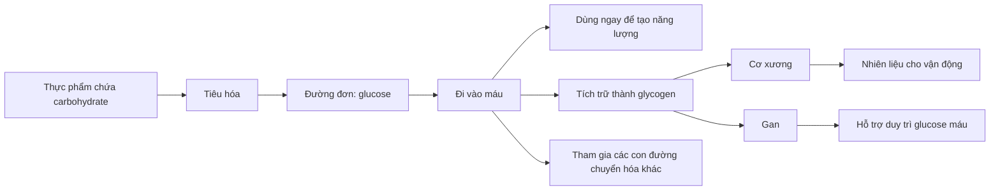
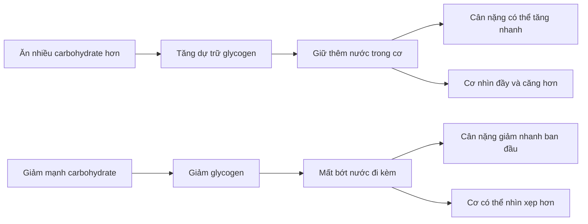
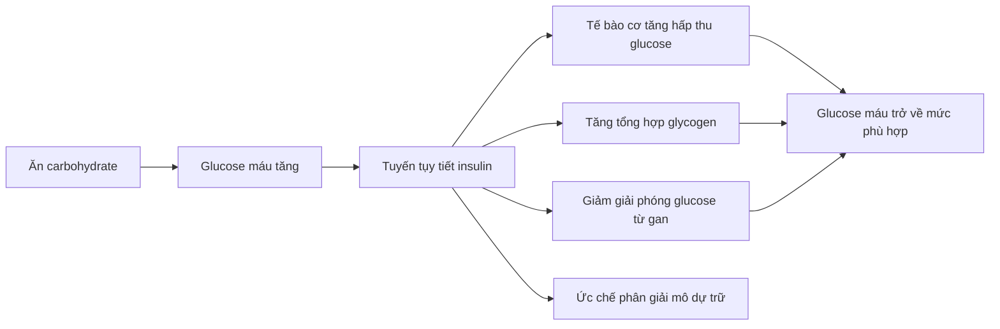
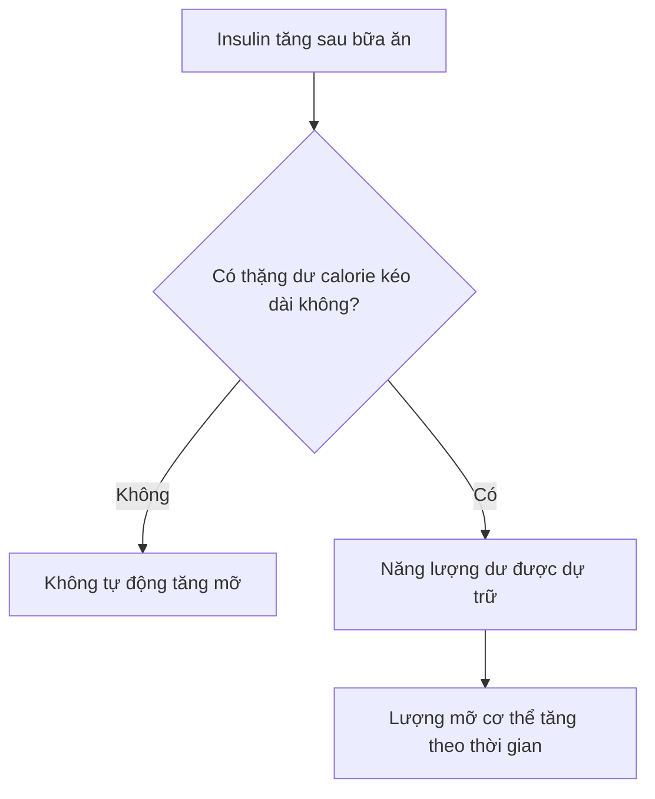

# 011 — Carbohydrates Explained

> **Carbohydrate không phải “kẻ thù” của giảm mỡ.** Đây là nguồn năng lượng quan trọng, đặc biệt đối với não bộ, hệ thần kinh và các hoạt động thể chất cường độ cao.

| Thuộc tính       | Nội dung                                                                 |
| ---------------- | ------------------------------------------------------------------------ |
| **Module**       | Module 02 — Meal Planning Basics                                         |
| **Bài học**      | Carbohydrates Explained                                                  |
| **Thời lượng**   | 03:47                                                                    |
| **Chủ đề chính** | Carbohydrate, glucose, glycogen, chất xơ, insulin và hiệu suất tập luyện |

---

## 1. Mục tiêu bài học

Sau bài học này, bạn có thể:

* Giải thích carbohydrate là gì và được cơ thể xử lý như thế nào.
* Phân biệt đường đơn, đường đôi và carbohydrate phức hợp.
* Hiểu vai trò của **glycogen** đối với tập tạ, HIIT và chạy nước rút.
* Phân biệt **chất xơ hòa tan** và **chất xơ không hòa tan**.
* Hiểu đúng về chỉ số đường huyết **GI**, tải lượng đường huyết **GL** và insulin.
* Nhận biết những lầm tưởng phổ biến như “ăn carb buổi tối gây béo” hoặc “insulin là nguyên nhân trực tiếp làm tăng mỡ”.

---

## 2. Carbohydrate là gì?

**Carbohydrate**, thường gọi tắt là **carb**, là một trong ba nhóm chất dinh dưỡng đa lượng chính, bên cạnh protein và chất béo.

Carbohydrate được cấu tạo chủ yếu từ:

* Carbon.
* Hydro.
* Oxy.

Carbohydrate tiêu hóa được cung cấp khoảng **4 kcal trên mỗi gram**. Chúng xuất hiện trong nhiều nhóm thực phẩm như trái cây, rau củ, ngũ cốc, cơm, khoai, các loại đậu, sữa, bánh kẹo và nước ngọt.

*Nguồn ảnh: Wikimedia Commons/National Cancer Institute.*

### Sơ đồ tổng quan

Hầu hết carbohydrate tiêu hóa được cuối cùng sẽ tạo ra các monosaccharide, đặc biệt là **glucose**. Glucose được vận chuyển trong máu đến các mô để tạo năng lượng hoặc được tích trữ để sử dụng sau.

---

## 3. Cơ thể làm gì với glucose?

Sau khi glucose đi vào máu, cơ thể có ba hướng xử lý chính.

### 3.1. Dùng ngay để tạo năng lượng

Glucose có thể được tế bào sử dụng để sản xuất ATP — dạng năng lượng trực tiếp phục vụ cho:

* Hoạt động của não và hệ thần kinh.
* Co cơ.
* Duy trì thân nhiệt.
* Hoạt động của các cơ quan.
* Các phản ứng chuyển hóa trong tế bào.

Trong điều kiện ăn uống hỗn hợp thông thường, não người trưởng thành sử dụng khoảng **120 g glucose mỗi ngày** và chiếm một tỷ lệ đáng kể trong tổng năng lượng của cơ thể. Khi nhịn đói kéo dài hoặc ăn rất ít carbohydrate, não có thể sử dụng thêm ketone, vì vậy không nên hiểu rằng não chỉ có thể hoạt động bằng glucose trong mọi hoàn cảnh.

### 3.2. Tích trữ dưới dạng glycogen

Glucose chưa cần dùng ngay có thể được nối lại thành **glycogen** và tích trữ chủ yếu tại:

| Vị trí       | Lượng dự trữ tham khảo | Chức năng chính                              |
| ------------ | ---------------------: | -------------------------------------------- |
| **Cơ xương** |       Khoảng 300–500 g | Cung cấp năng lượng tại chỗ cho cơ hoạt động |
| **Gan**      |        Khoảng 80–100 g | Hỗ trợ duy trì glucose trong máu             |

Các con số trên không cố định. Khả năng dự trữ phụ thuộc vào khối lượng cơ, kích thước cơ thể, chế độ ăn, mức độ vận động và tình trạng luyện tập.

### 3.3. Chuyển thành chất béo

Cơ thể có khả năng chuyển glucose thành acid béo thông qua quá trình **de novo lipogenesis — DNL**.

Tuy nhiên, ở người khỏe mạnh ăn chế độ hỗn hợp thông thường, chuyển trực tiếp carbohydrate thành mỡ thường không phải con đường ưu tiên. DNL tăng rõ hơn khi lượng carbohydrate và tổng năng lượng nạp vào rất cao trong thời gian kéo dài.

Điều này **không có nghĩa ăn thừa carbohydrate không thể gây tăng mỡ**. Khi ăn dư calorie:

1. Cơ thể ưu tiên đốt carbohydrate.
2. Quá trình oxy hóa chất béo giảm xuống.
3. Chất béo từ thức ăn dễ được giữ lại trong mô mỡ hơn.
4. Nếu mức dư thừa đủ lớn, DNL cũng có thể tăng.

Vì vậy, nguyên nhân nền tảng của tăng mỡ vẫn là **thặng dư năng lượng kéo dài**, chứ không phải chỉ vì một loại thực phẩm có chứa carbohydrate.

---

## 4. Glycogen — kho nhiên liệu của cơ thể

**Glycogen** là dạng dự trữ carbohydrate ở người và động vật. Nó gồm rất nhiều đơn vị glucose liên kết thành một cấu trúc phân nhánh.

*Nguồn ảnh: Mikael Häggström, Wikimedia Commons — phạm vi công cộng.*

Cấu trúc phân nhánh cho phép nhiều enzyme tiếp cận glycogen cùng lúc, nhờ đó glucose có thể được huy động nhanh khi cơ thể cần năng lượng.

### 4.1. Glycogen cơ

Glycogen được tích trữ trong cơ chủ yếu phục vụ chính cơ đó.

Ví dụ:

* Glycogen trong cơ chân hỗ trợ squat, chạy và đạp xe.
* Glycogen trong cơ ngực, vai và tay được sử dụng nhiều khi bench press hoặc overhead press.
* Cơ không trực tiếp giải phóng lượng lớn glycogen của mình vào máu để cung cấp cho các mô khác.

### 4.2. Glycogen gan

Glycogen gan có vai trò khác:

* Hỗ trợ giữ glucose máu trong phạm vi ổn định giữa các bữa ăn.
* Cung cấp glucose trong thời gian chưa ăn.
* Hỗ trợ não và các mô cần glucose.

---

## 5. Vì sao glycogen quan trọng với người tập luyện?

Glycogen là nguồn nhiên liệu quan trọng cho các hoạt động có cường độ cao như:

* Tập tạ với số hiệp và số rep lớn.
* HIIT.
* Chạy nước rút.
* Các môn thể thao đồng đội.
* Những buổi tập kéo dài hoặc có thời gian nghỉ ngắn.

Một buổi tập sức mạnh có thể làm giảm đáng kể glycogen cơ, đặc biệt khi chương trình có nhiều hiệp, nhiều rep và nhiều nhóm cơ được tập trong cùng một buổi. Mối liên hệ giữa carbohydrate và hiệu suất tập tạ còn phụ thuộc vào thời lượng buổi tập, tổng volume, trạng thái đã ăn hay nhịn đói và lượng glycogen ban đầu.

### Khi glycogen xuống thấp

Bạn có thể gặp:

* Khó duy trì số rep ở các hiệp sau.
* Giảm khả năng thực hiện những buổi tập volume cao.
* Cảm giác mệt và “hết lực” nhanh hơn.
* Khả năng phục hồi giữa các hiệp hoặc giữa hai buổi tập liên tiếp kém hơn.
* Cơ trông nhỏ và “xẹp” tạm thời.

Glycogen thấp có liên hệ với sự mệt mỏi do khả năng tái tạo ATP và duy trì co cơ bị hạn chế.

> **Lưu ý:** Ăn thêm carbohydrate không đảm bảo mọi buổi tập đều mạnh hơn. Với một buổi ngắn, volume thấp và đã ăn đầy đủ trước đó, bổ sung thêm carbohydrate có thể không tạo khác biệt rõ rệt.

---

## 6. Glycogen và nước

Glycogen không được tích trữ một mình. Mỗi gram glycogen thường đi kèm với khoảng **ít nhất 3 g nước**, mặc dù tỷ lệ thực tế có thể thay đổi theo từng người và từng điều kiện.

Điều này giải thích vì sao:

* Người mới bắt đầu chế độ low-carb có thể giảm cân nhanh trong vài ngày đầu.
* Cân nặng có thể tăng đột ngột sau một ngày ăn nhiều cơm, mì hoặc đồ ngọt.
* Cân nặng ngắn hạn không phản ánh hoàn toàn lượng mỡ tăng hoặc giảm.

Phần lớn biến động nhanh này có thể đến từ **glycogen, nước, muối và lượng thức ăn trong hệ tiêu hóa**, không nhất thiết là mỡ.

---

## 7. Chất xơ cũng là carbohydrate

**Chất xơ — dietary fiber** là một dạng carbohydrate mà enzyme tiêu hóa của con người không thể phân giải hoàn toàn thành glucose.

Chất xơ đi qua đường tiêu hóa và tham gia vào:

* Điều hòa nhu động ruột.
* Tăng thể tích phân.
* Hỗ trợ kiểm soát cảm giác đói.
* Làm chậm sự hấp thu của bữa ăn.
* Nuôi dưỡng một số nhóm vi khuẩn đường ruột.

Chất xơ có nhiều trong rau, trái cây, các loại đậu, hạt và ngũ cốc nguyên hạt.

*Nguồn ảnh: Wikimedia Commons.*

### 7.1. Chất xơ hòa tan

Chất xơ hòa tan có thể hút nước và tạo thành hỗn hợp giống gel.

Nguồn phổ biến:

* Yến mạch.
* Các loại đậu.
* Táo.
* Cam, quýt.
* Hạt chia.
* Psyllium.

Tác dụng thường gặp:

* Làm chậm quá trình tiêu hóa.
* Hỗ trợ làm mềm phân.
* Điều hòa phản ứng glucose sau bữa ăn.
* Một số loại có thể được vi khuẩn đường ruột lên men.

### 7.2. Chất xơ không hòa tan

Chất xơ không hòa tan không tạo gel rõ rệt và thường giúp tăng thể tích phân.

Nguồn phổ biến:

* Cám lúa mì.
* Ngũ cốc nguyên hạt.
* Vỏ của một số loại trái cây và rau củ.
* Các loại hạt.

Tác dụng thường gặp:

* Hỗ trợ thức ăn di chuyển qua đường tiêu hóa.
* Giúp duy trì đại tiện đều đặn.
* Hạn chế táo bón ở một số người.

> Việc chia chất xơ thành “hòa tan” và “không hòa tan” chỉ là cách đơn giản hóa. Nhiều loại thực phẩm chứa đồng thời nhiều dạng chất xơ với đặc tính khác nhau.

---

## 8. Ba nhóm carbohydrate theo cấu trúc

Carbohydrate có thể được phân loại dựa trên số lượng phân tử đường liên kết với nhau.

| Nhóm                           | Số đơn vị đường | Ví dụ                                  |
| ------------------------------ | --------------: | -------------------------------------- |
| **Monosaccharide — đường đơn** |               1 | Glucose, fructose, galactose           |
| **Disaccharide — đường đôi**   |               2 | Sucrose, lactose, maltose              |
| **Polysaccharide — đường đa**  |           Nhiều | Tinh bột, glycogen và phần lớn chất xơ |

### Monosaccharide

* **Glucose:** nguồn năng lượng quan trọng của tế bào.
* **Fructose:** có trong trái cây, mật ong và một số chất tạo ngọt.
* **Galactose:** là thành phần cấu tạo của lactose trong sữa.

### Disaccharide

* **Sucrose:** đường ăn, gồm glucose và fructose.
* **Lactose:** đường sữa, gồm glucose và galactose.
* **Maltose:** gồm hai đơn vị glucose.

### Polysaccharide

Đây là các chuỗi dài gồm nhiều đơn vị đường:

* Tinh bột trong cơm, mì, khoai và ngũ cốc.
* Glycogen trong gan và cơ.
* Nhiều loại chất xơ trong thực vật.

---

## 9. Carb đơn giản và carb phức hợp

### Carb đơn giản

Thường gồm monosaccharide và disaccharide:

* Đường ăn.
* Lactose trong sữa.
* Fructose trong trái cây.
* Đường trong nước ngọt và bánh kẹo.

### Carb phức hợp

Thường là các polysaccharide:

* Cơm.
* Yến mạch.
* Khoai.
* Mì và pasta.
* Đậu.
* Ngũ cốc.
* Rau củ.

Tuy nhiên, cách phân loại này **không đủ để đánh giá thực phẩm là tốt hay xấu**.

Ví dụ:

* Trái cây chứa đường đơn nhưng cũng cung cấp nước, chất xơ và vi chất.
* Bánh mì trắng chứa tinh bột phức hợp nhưng bị nghiền và tinh chế nên có thể được tiêu hóa khá nhanh.
* Khoai tây là carbohydrate phức hợp nhưng phản ứng glucose thay đổi tùy giống khoai, cách nấu và khẩu phần.

Vì vậy, **“đơn giản = xấu, phức hợp = tốt” là cách hiểu quá mức đơn giản hóa**.

---

## 10. Chỉ số đường huyết GI

**Glycemic Index — GI** xếp hạng thực phẩm chứa carbohydrate trên thang từ 0 đến 100 dựa trên mức độ và tốc độ làm tăng glucose máu trong điều kiện kiểm tra tiêu chuẩn.

| Mức GI         | Giá trị tham khảo |
| -------------- | ----------------: |
| **Thấp**       |              ≤ 55 |
| **Trung bình** |             56–69 |
| **Cao**        |              ≥ 70 |

Thông thường:

* Thực phẩm GI cao được tiêu hóa và hấp thu nhanh hơn.
* Thực phẩm GI thấp tạo mức tăng glucose chậm và từ từ hơn.

Tuy nhiên, GI có nhiều hạn chế.

### 10.1. GI không phản ánh khẩu phần

Dưa hấu có thể có GI tương đối cao nhưng một khẩu phần dưa hấu chứa không nhiều carbohydrate vì phần lớn khối lượng là nước.

### 10.2. GI không phản ánh đầy đủ giá trị dinh dưỡng

Một thực phẩm có GI thấp không tự động trở thành thực phẩm giàu dinh dưỡng.

GI không cho biết đầy đủ:

* Mật độ calorie.
* Lượng protein.
* Lượng vitamin và khoáng chất.
* Hàm lượng chất xơ.
* Mức độ chế biến.
* Chất lượng tổng thể của chế độ ăn.

### 10.3. GI thường được đo khi ăn riêng thực phẩm

Trong thực tế, ít người chỉ ăn một bát cơm trắng mà không có thức ăn khác.

Khi kết hợp cơm với:

* Thịt, cá hoặc trứng.
* Rau.
* Chất béo.
* Chất xơ.

Tốc độ làm rỗng dạ dày, hấp thu và phản ứng glucose có thể thay đổi. GI của một thực phẩm đơn lẻ vì thế không thể dự đoán hoàn hảo phản ứng của một bữa ăn hỗn hợp.

---

## 11. Tải lượng đường huyết GL

**Glycemic Load — GL** kết hợp hai yếu tố:

1. Tốc độ carbohydrate làm tăng glucose máu.
2. Lượng carbohydrate thực tế trong một khẩu phần.

Công thức đơn giản:

[
GL = \frac{GI \times \text{gram carbohydrate khả dụng trong khẩu phần}}{100}
]

### Ví dụ

Giả sử một khẩu phần thực phẩm có:

* GI = 70.
* 10 g carbohydrate khả dụng.

Khi đó:

[
GL = \frac{70 \times 10}{100} = 7
]

GL thường cung cấp thêm bối cảnh thực tế so với việc chỉ nhìn vào GI. Tuy nhiên, GI và GL vẫn không nên là tiêu chí duy nhất để lựa chọn thực phẩm.

---

## 12. Insulin — hiểu cho đúng

Sau bữa ăn chứa carbohydrate:

1. Carbohydrate được tiêu hóa.
2. Glucose trong máu tăng.
3. Tế bào beta của tuyến tụy tiết insulin.
4. Insulin hỗ trợ glucose đi vào một số mô và thúc đẩy quá trình dự trữ năng lượng.
5. Glucose máu dần trở về phạm vi bình thường.

Insulin đặc biệt hỗ trợ hấp thu glucose ở cơ và mô mỡ, đồng thời thúc đẩy tổng hợp glycogen và điều hòa quá trình sản xuất glucose của gan.

*Nguồn ảnh: Wikimedia Commons.*

### Sơ đồ hoạt động đơn giản của insulin

---

## 13. Insulin có phải “hormone gây béo” không?

Insulin là một **hormone đồng hóa và dự trữ**, nhưng gọi nó là nguyên nhân trực tiếp gây béo là không chính xác.

### Insulin thực hiện nhiều nhiệm vụ

* Hỗ trợ kiểm soát glucose máu.
* Thúc đẩy tổng hợp glycogen.
* Hạn chế phân giải chất béo trong một khoảng thời gian sau bữa ăn.
* Hạn chế phân giải protein cơ.
* Điều phối việc sử dụng và dự trữ năng lượng.

Insulin có tác dụng **chống dị hóa**, đặc biệt bằng cách làm giảm phân giải protein cơ. Tác dụng trực tiếp của insulin lên tổng hợp protein cơ phụ thuộc nhiều vào sự hiện diện của amino acid và lưu lượng máu đến cơ.

### Protein cũng kích thích insulin

Insulin không chỉ tăng sau khi ăn carbohydrate. Protein, đặc biệt là whey protein và một số amino acid, cũng có thể tạo phản ứng insulin đáng kể. Điều này cho thấy việc insulin tăng sau bữa ăn là phản ứng sinh lý bình thường, không đồng nghĩa với việc bữa ăn đó tự động làm tăng mỡ.

### Điều thực sự quyết định tăng mỡ

Insulin cần thiết để điều hòa chuyển hóa, nhưng **thặng dư năng lượng kéo dài** mới là điều kiện nền tảng để lượng mỡ cơ thể tăng lên.

---

## 14. Có cần tránh “insulin spike” không?

Một lần glucose và insulin tăng sau bữa ăn là phản ứng bình thường.

Không nên đánh đồng:

* Glucose tăng tạm thời sau bữa ăn.
* Insulin tăng tạm thời sau bữa ăn.
* Kháng insulin kéo dài.
* Bệnh tiểu đường type 2.

Kháng insulin xảy ra khi các tế bào cơ, gan và mô mỡ không phản ứng tốt với insulin. Đây là một vấn đề chuyển hóa phức tạp, chịu ảnh hưởng bởi nhiều yếu tố như di truyền, lượng mỡ nội tạng, mức vận động, chất lượng chế độ ăn và tình trạng sức khỏe tổng thể.

> Một lần ăn cơm, trái cây hoặc một bữa có GI cao không tự động gây ra bệnh tiểu đường.

---

## 15. Chọn nguồn carbohydrate như thế nào?

Thay vì chỉ chia thực phẩm thành “carb tốt” và “carb xấu”, hãy đánh giá theo nhiều tiêu chí.

### Nên ưu tiên thường xuyên

* Rau củ.
* Trái cây nguyên quả.
* Khoai.
* Các loại đậu.
* Yến mạch.
* Gạo và ngũ cốc ít tinh chế.
* Bánh mì nguyên hạt.
* Thực phẩm giàu chất xơ và vi chất.

Các nguồn carbohydrate nguyên bản hoặc ít chế biến thường cung cấp thêm chất xơ, vitamin, khoáng chất và hợp chất thực vật có lợi.

### Nên kiểm soát khẩu phần và tần suất

* Nước ngọt.
* Kẹo.
* Bánh ngọt.
* Ngũ cốc ăn sáng nhiều đường.
* Trà sữa và đồ uống nhiều đường.
* Thực phẩm siêu chế biến giàu cả đường lẫn chất béo.

Những thực phẩm này thường:

* Có mật độ calorie cao.
* Ít chất xơ.
* Dễ ăn nhanh.
* Khả năng tạo no thấp.
* Khiến việc vượt quá calorie mục tiêu trở nên dễ dàng hơn.

Điều đó không có nghĩa chúng bị “cấm tuyệt đối”. Vấn đề nằm ở **liều lượng, tần suất và tổng thể chế độ ăn**.

---

## 16. Carb và hiệu suất tập luyện

### Người tập tạ

Carbohydrate đặc biệt hữu ích khi chương trình có:

* Từ ba buổi tập trở lên mỗi tuần.
* Nhiều bài compound.
* Nhiều hiệp và rep.
* Thời gian nghỉ ngắn.
* Hai buổi tập gần nhau.
* Mục tiêu tối ưu hiệu suất hoặc tăng cơ.

Có thể bố trí một phần carbohydrate vào:

* Bữa ăn trước tập.
* Khoảng thời gian sau tập.
* Các bữa giữa hai buổi tập gần nhau.

Mục đích chính là:

* Bắt đầu buổi tập với glycogen phù hợp.
* Duy trì cường độ tập.
* Bổ sung lại glycogen sau vận động.

### Người ít vận động

Người ít vận động thường cần ít tổng năng lượng hơn và có thể ăn ít carbohydrate hơn người tập luyện cường độ cao.

Tuy nhiên, điều này không có nghĩa người làm văn phòng phải loại bỏ:

* Trái cây.
* Rau củ.
* Đậu.
* Khoai.
* Ngũ cốc nguyên hạt.

Lượng carbohydrate phù hợp cần được điều chỉnh theo:

* Tổng calorie.
* Mức vận động.
* Sở thích cá nhân.
* Khả năng tiêu hóa.
* Mục tiêu thể hình.
* Tình trạng sức khỏe.

---

## 17. Lầm tưởng thường gặp

### Lầm tưởng 1: “Ăn carb sau 18 giờ sẽ biến thành mỡ”

Cơ thể không có một công tắc lúc 18 giờ khiến carbohydrate đột nhiên chuyển thành mỡ.

Ăn tối có thể góp phần tăng cân khi:

* Bữa tối làm tổng calorie vượt quá nhu cầu.
* Ăn vặt thiếu kiểm soát.
* Thực phẩm có mật độ calorie cao.
* Thiếu ngủ làm tăng cảm giác đói.

Nhưng bản thân thời điểm sau 18 giờ không khiến carbohydrate tự động biến thành mỡ.

---

### Lầm tưởng 2: “Low-carb giảm 3 kg trong vài ngày nghĩa là đã giảm 3 kg mỡ”

Giảm mạnh carbohydrate làm giảm glycogen. Khi glycogen giảm, lượng nước đi kèm cũng giảm, khiến cân nặng xuống nhanh.

Để giảm 3 kg mỡ trong vài ngày cần tạo ra mức thâm hụt năng lượng rất lớn và thường không thực tế. Phần lớn mức giảm nhanh ban đầu của low-carb là nước, glycogen và lượng thức ăn trong ruột.

---

### Lầm tưởng 3: “Carb và đường là một”

Đường là **một nhóm nhỏ nằm trong carbohydrate**.

Carbohydrate còn bao gồm:

* Tinh bột.
* Glycogen.
* Chất xơ.
* Oligosaccharide.
* Nhiều hợp chất khác.

Không nên đánh đồng một bát đậu hoặc yến mạch với một lon nước ngọt chỉ vì cả hai đều chứa carbohydrate.

---

### Lầm tưởng 4: “Carb phức hợp luôn tốt”

Mức độ chế biến, khẩu phần, chất xơ và thành phần của cả bữa ăn thường quan trọng hơn việc chỉ đếm số phân tử đường.

Bánh mì trắng chứa tinh bột phức hợp nhưng vẫn có thể:

* Ít chất xơ.
* Tiêu hóa nhanh.
* Tạo cảm giác no kém hơn bánh mì nguyên hạt.

---

### Lầm tưởng 5: “Insulin tăng là ngừng giảm mỡ”

Sau bữa ăn, insulin tăng và quá trình giải phóng mỡ tạm thời giảm. Sau đó, khi insulin hạ xuống, cơ thể lại sử dụng năng lượng dự trữ.

Giảm mỡ phải được đánh giá trong phạm vi cả ngày và nhiều tuần, không phải trong vài giờ sau một bữa ăn.

---

### Lầm tưởng 6: “Thực phẩm GI cao luôn xấu”

GI cao không phải lúc nào cũng có nghĩa thực phẩm không phù hợp.

Trong thể thao, carbohydrate tiêu hóa nhanh có thể hữu ích khi:

* Cần năng lượng trong một buổi tập dài.
* Cần phục hồi glycogen nhanh.
* Có nhiều buổi thi đấu trong ngày.
* Người tập khó ăn một lượng lớn thực phẩm giàu chất xơ.

Bối cảnh sử dụng quan trọng hơn một con số GI riêng lẻ.

---

## 18. Hiệu chỉnh một số khẳng định dễ gây hiểu nhầm

| Khẳng định đơn giản hóa                        | Cách hiểu chính xác hơn                                                                                                                      |
| ---------------------------------------------- | -------------------------------------------------------------------------------------------------------------------------------------------- |
| “Carb là nguồn năng lượng ưa thích của cơ thể” | Cơ thể sử dụng linh hoạt carbohydrate và chất béo; tỷ lệ sử dụng thay đổi theo cường độ vận động và trạng thái dinh dưỡng.                   |
| “Glycogen thấp luôn làm mất cơ”                | Glycogen thấp có thể ảnh hưởng hiệu suất và tín hiệu tế bào, nhưng tăng hoặc mất cơ còn phụ thuộc vào tập luyện, protein và tổng năng lượng. |
| “Insulin rất anabolic nên càng cao càng tốt”   | Insulin cần thiết và chống dị hóa, nhưng tăng insulin quá mức không thay thế được tập luyện và amino acid.                                   |
| “Phải tránh mọi insulin spike”                 | Phản ứng insulin sau bữa ăn là bình thường; cần quan tâm hơn đến sức khỏe chuyển hóa dài hạn.                                                |
| “Mọi thực phẩm chế biến đều là carb xấu”       | Mức độ chế biến là một tiêu chí quan trọng nhưng phải xem cả thành phần, khẩu phần và mục đích sử dụng.                                      |
| “Carb cao tự động gây béo”                     | Chế độ ăn làm tăng mỡ khi tạo thặng dư calorie kéo dài.                                                                                      |

---

## 19. Áp dụng thực tế

### Bước 1: Đánh giá mức vận động

| Mức hoạt động            | Định hướng chung                                 |
| ------------------------ | ------------------------------------------------ |
| Ít vận động              | Không cần lượng carb lớn để hỗ trợ tập luyện     |
| Tập 2–3 buổi/tuần        | Lượng carb vừa phải, ưu tiên chất lượng          |
| Tập tạ 4–6 buổi/tuần     | Carb trở thành công cụ hỗ trợ volume và phục hồi |
| Tập sức bền hoặc thi đấu | Nhu cầu carb thường cao hơn đáng kể              |

### Bước 2: Chọn nền tảng thực phẩm

Ưu tiên xây dựng phần lớn lượng carbohydrate từ:

* Cơm, khoai, yến mạch và ngũ cốc.
* Rau củ.
* Trái cây.
* Các loại đậu.
* Thực phẩm phù hợp văn hóa và khả năng duy trì lâu dài.

### Bước 3: Bố trí theo mục tiêu

* Muốn tập mạnh hơn: bố trí carbohydrate trong các bữa quanh buổi tập.
* Muốn giảm mỡ: kiểm soát tổng calorie, không cần loại bỏ toàn bộ carb.
* Muốn tăng cân: carbohydrate giúp tăng calorie và hỗ trợ volume tập.
* Khó tiêu trước tập: giảm chất xơ và chất béo trong bữa sát buổi tập.
* Dễ đói: ưu tiên carb giàu chất xơ, protein và thực phẩm ít chế biến.

---

## 20. Ví dụ nguồn carbohydrate

| Thực phẩm             | Đặc điểm chính                    | Thời điểm phù hợp              |
| --------------------- | --------------------------------- | ------------------------------ |
| Yến mạch              | Nhiều chất xơ hòa tan             | Bữa sáng, bữa cách xa buổi tập |
| Cơm                   | Dễ điều chỉnh khẩu phần           | Bữa chính, trước hoặc sau tập  |
| Khoai tây, khoai lang | Nhiều nước, tạo no tốt            | Giảm mỡ, bữa chính             |
| Chuối                 | Tiện lợi, tương đối dễ tiêu       | Trước hoặc sau tập             |
| Trái cây nguyên quả   | Nước, chất xơ và vi chất          | Bữa phụ                        |
| Các loại đậu          | Carb, protein thực vật và chất xơ | Bữa chính                      |
| Bánh mì nguyên hạt    | Tiện lợi, có chất xơ              | Bữa sáng, bữa phụ              |
| Nước uống thể thao    | Hấp thu nhanh, ít tạo no          | Tập kéo dài hoặc thi đấu       |

---

## 21. Checklist thực hành

* [ ] Hiểu carbohydrate tiêu hóa được cung cấp khoảng 4 kcal/g.
* [ ] Hiểu chuỗi: carbohydrate → glucose → năng lượng hoặc glycogen.
* [ ] Phân biệt glycogen cơ và glycogen gan.
* [ ] Hiểu glycogen được tích trữ kèm theo nước.
* [ ] Phân biệt monosaccharide, disaccharide và polysaccharide.
* [ ] Không đánh đồng carb đơn giản với carb xấu.
* [ ] Biết GI không phản ánh đầy đủ giá trị dinh dưỡng.
* [ ] Biết GL tính đến lượng carbohydrate trong khẩu phần.
* [ ] Hiểu insulin là hormone điều hòa và dự trữ bình thường.
* [ ] Không cho rằng một lần tăng insulin sẽ trực tiếp làm tăng mỡ.
* [ ] Đã đánh giá mức vận động để lựa chọn lượng carbohydrate phù hợp.
* [ ] Ưu tiên phần lớn carbohydrate từ thực phẩm nguyên bản hoặc ít chế biến.

---

## 22. Tóm tắt bài học

Carbohydrate là một chất dinh dưỡng đa lượng cung cấp khoảng **4 kcal/g**. Sau khi tiêu hóa, phần lớn carbohydrate được chuyển thành glucose để tạo năng lượng hoặc tích trữ dưới dạng glycogen trong cơ và gan.

Glycogen là nguồn nhiên liệu quan trọng cho hoạt động cường độ cao. Khi glycogen thấp, khả năng duy trì volume và hiệu suất trong những buổi tập nặng hoặc kéo dài có thể suy giảm. Glycogen cũng được tích trữ kèm theo nước, vì vậy thay đổi lượng carbohydrate có thể khiến cân nặng biến động nhanh mà không phản ánh đúng lượng mỡ.

Chất xơ cũng thuộc nhóm carbohydrate nhưng không được tiêu hóa hoàn toàn thành glucose. Chất xơ hỗ trợ tiêu hóa, cảm giác no và sức khỏe chuyển hóa.

Không nên đánh giá thực phẩm chỉ bằng cách chia thành carb đơn giản và carb phức hợp. GI và GL có thể cung cấp thêm thông tin, nhưng chất xơ, khẩu phần, mức độ chế biến và thành phần của toàn bộ bữa ăn mới tạo nên bức tranh đầy đủ.

Insulin là một hormone thiết yếu giúp điều hòa glucose và quá trình dự trữ năng lượng. Insulin không phải nguyên nhân duy nhất hoặc trực tiếp làm tăng mỡ; **thặng dư calorie kéo dài** mới là điều kiện nền tảng dẫn đến tăng mỡ cơ thể.

> **Thông điệp chính:** Hãy xem carbohydrate như một công cụ. Lượng carb phù hợp phụ thuộc vào mức vận động, mục tiêu, sở thích và khả năng duy trì chế độ ăn của từng người.

---

## 23. Lưu ý sức khỏe

Người mắc hoặc nghi ngờ mắc:

* Tiểu đường.
* Tiền tiểu đường.
* Kháng insulin.
* Hội chứng chuyển hóa.
* Bệnh gan hoặc bệnh thận.
* Rối loạn tiêu hóa liên quan đến một số loại carbohydrate.

không nên tự áp dụng máy móc các khuyến nghị dành cho người khỏe mạnh. Việc điều chỉnh lượng và loại carbohydrate cần dựa trên hướng dẫn của bác sĩ hoặc chuyên gia dinh dưỡng có chuyên môn.

---

# Bài luyện tập

## Mục tiêu

## Đề bài

## Yêu cầu hoàn thành

- [ ] 
- [ ] 
- [ ] 

## Kết quả / lời giải

## Ghi chú
