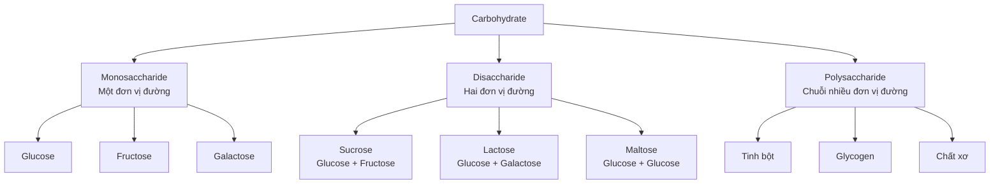
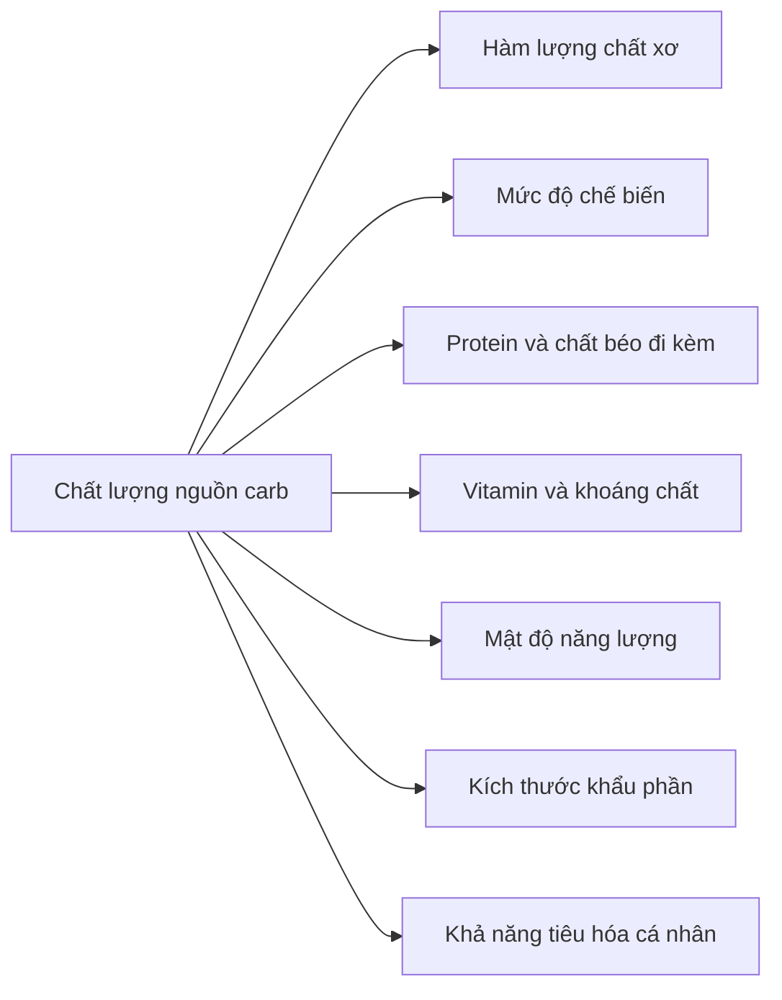
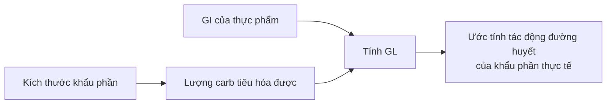
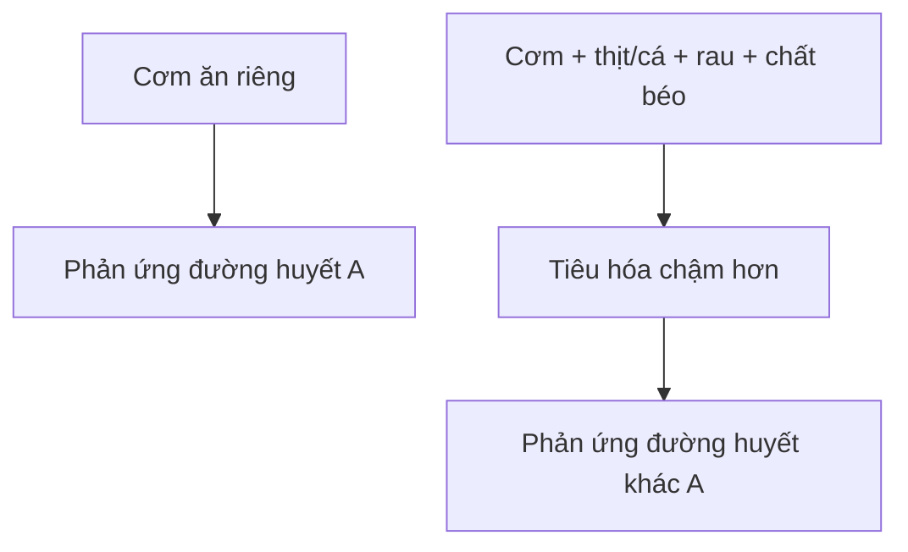
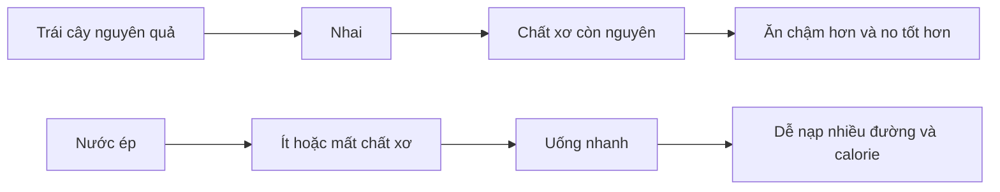
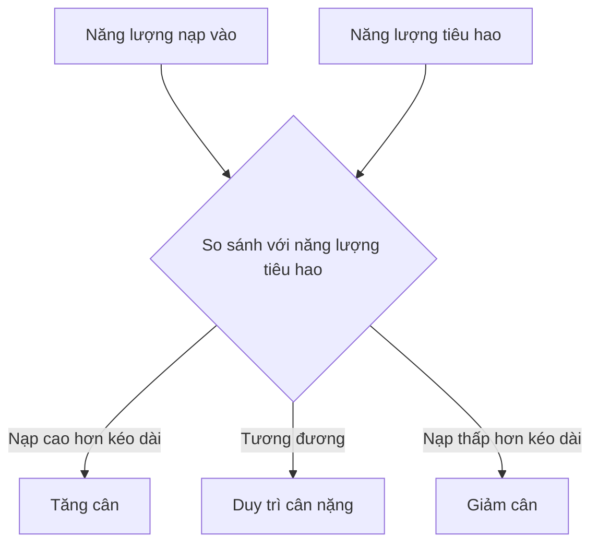
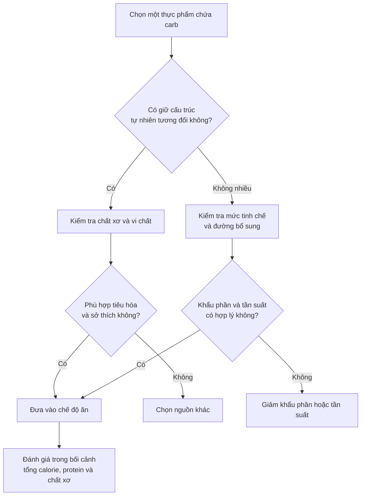

# 012 — Các loại carbohydrate khác nhau

> **Tên gốc:** *The Different Types of Carbs*

| Thuộc tính              | Nội dung                                            |
| ----------------------- | --------------------------------------------------- |
| **Module**              | Module 02 — Meal Planning Basics                    |
| **Bài học**             | The Different Types of Carbs                        |
| **Thời lượng**          | 05:16                                               |
| **Chủ đề chính**        | Carb đơn, carb phức, chất xơ, chỉ số đường huyết    |
| **Kiến thức liên quan** | Glucose, insulin, GI, GL, đường tự do, calorie lỏng |

---

## 1. Mục tiêu bài học

Sau bài học này, bạn có thể:

* Phân biệt **monosaccharide, disaccharide và polysaccharide**.
* Hiểu sự khác nhau giữa **carbohydrate đơn giản** và **carbohydrate phức tạp**.
* Giải thích vì sao cách phân loại “đơn giản = xấu, phức tạp = tốt” thường gây hiểu lầm.
* Hiểu **chỉ số đường huyết — GI** và **tải lượng đường huyết — GL**.
* Nắm vai trò của **chất xơ hòa tan** và **chất xơ không hòa tan**.
* Hiểu khái niệm **net carb** và giới hạn của nó.
* Lựa chọn nguồn carbohydrate dựa trên toàn bộ chất lượng thực phẩm thay vì chỉ nhìn vào lượng đường hoặc GI.

---

## 2. Carbohydrate được phân loại như thế nào?

Carbohydrate được tạo thành từ những đơn vị đường nhỏ gọi là **saccharide**. Dựa trên số lượng đơn vị đường liên kết với nhau, carbohydrate có thể được chia thành ba nhóm chính.

*Nguồn ảnh: [Wikimedia Commons — Carbohydrates](https://commons.wikimedia.org/wiki/File:Carbohydrates.jpeg), ảnh thuộc phạm vi công cộng.*

### 2.1. Monosaccharide — đường đơn

Monosaccharide chỉ gồm **một đơn vị đường**, vì vậy không cần được phân tách thành carbohydrate nhỏ hơn trước khi hấp thu.

| Monosaccharide | Đặc điểm                               | Nguồn phổ biến                             |
| -------------- | -------------------------------------- | ------------------------------------------ |
| **Glucose**    | Nguồn năng lượng quan trọng cho tế bào | Thực phẩm chứa tinh bột, trái cây, mật ong |
| **Fructose**   | Được chuyển hóa phần lớn tại gan       | Trái cây, mật ong, đường bổ sung           |
| **Galactose**  | Là một thành phần của lactose          | Sữa và sản phẩm từ sữa                     |

> Không phải mọi carbohydrate đều được chuyển trực tiếp thành glucose ngay lập tức. Carb tiêu hóa được được phân giải thành các monosaccharide; fructose và galactose sau đó tiếp tục được chuyển hóa trong cơ thể.

### 2.2. Disaccharide — đường đôi

Disaccharide gồm **hai monosaccharide liên kết với nhau**.

* **Sucrose:** glucose + fructose, chính là đường ăn thông thường.
* **Lactose:** glucose + galactose, có trong sữa.
* **Maltose:** hai phân tử glucose, xuất hiện trong mạch nha và quá trình phân giải tinh bột.

### 2.3. Polysaccharide — carbohydrate chuỗi dài

Polysaccharide gồm nhiều đơn vị đường liên kết thành chuỗi.

* **Tinh bột:** dạng dự trữ carbohydrate của thực vật.
* **Glycogen:** dạng dự trữ carbohydrate trong cơ thể người và động vật.
* **Chất xơ:** carbohydrate mà enzyme tiêu hóa của con người không phân giải hoàn toàn được.

---

## 3. Carb đơn giản và carb phức tạp

### 3.1. Bảng so sánh cơ bản

| Tiêu chí              | Carb đơn giản                           | Carb phức tạp                           |
| --------------------- | --------------------------------------- | --------------------------------------- |
| **Cấu trúc**          | Một hoặc hai đơn vị đường               | Chuỗi nhiều đơn vị đường                |
| **Nhóm hóa học**      | Monosaccharide và disaccharide          | Phần lớn là polysaccharide              |
| **Ví dụ**             | Glucose, fructose, sucrose, lactose     | Tinh bột, glycogen, chất xơ             |
| **Nguồn thực phẩm**   | Trái cây, sữa, mật ong, kẹo, nước ngọt  | Gạo, khoai, yến mạch, đậu, rau          |
| **Tốc độ tiêu hóa**   | Thường nhanh nhưng không phải luôn luôn | Thường chậm hơn nhưng có nhiều ngoại lệ |
| **Hàm lượng chất xơ** | Có thể thấp hoặc cao tùy thực phẩm      | Có thể cao hoặc gần như không có        |

### 3.2. Vì sao cách phân loại này chưa đủ?

Việc đánh giá thực phẩm theo quy tắc:

> **Carb đơn giản = xấu**
> **Carb phức tạp = tốt**

là quá đơn giản và có thể dẫn đến lựa chọn sai.

Ví dụ:

* Trái cây chứa nhiều đường đơn nhưng đồng thời cung cấp chất xơ, nước, vitamin, khoáng chất và các hợp chất thực vật.
* Sữa chứa lactose nhưng cũng cung cấp protein, canxi và nhiều vi chất khác.
* Bánh mì trắng chứa tinh bột — một carbohydrate phức tạp — nhưng cấu trúc hạt đã bị nghiền và tinh chế nên có thể được tiêu hóa rất nhanh.
* Một số loại kem hoặc chocolate có GI tương đối thấp vì chất béo làm chậm quá trình tiêu hóa, nhưng điều đó không tự động biến chúng thành thực phẩm giàu dinh dưỡng.

Do đó, **cấu trúc hóa học của carbohydrate không phải thước đo đầy đủ cho chất lượng dinh dưỡng**.

### 3.3. Ma trận thực phẩm quan trọng hơn tên loại carb

Khi đánh giá một nguồn carbohydrate, nên xem xét toàn bộ **ma trận thực phẩm**:

Nhìn chung, các nguồn carbohydrate ít hoặc vừa qua chế biến như ngũ cốc nguyên hạt, rau củ, trái cây nguyên quả và các loại đậu thường cung cấp nhiều chất xơ và vi chất hơn thực phẩm tinh chế.

---

## 4. Chỉ số đường huyết — Glycemic Index

### 4.1. GI là gì?

**Chỉ số đường huyết — Glycemic Index, viết tắt là GI** — xếp hạng thực phẩm chứa carbohydrate dựa trên mức độ chúng làm tăng glucose trong máu sau khi ăn.

Glucose tinh khiết thường được dùng làm mốc với GI bằng 100.

| Phân loại         | Giá trị GI |
| ----------------- | ---------: |
| **GI thấp**       |       ≤ 55 |
| **GI trung bình** |      56–69 |
| **GI cao**        |       ≥ 70 |

Các ngưỡng trên là cách phân loại GI được sử dụng phổ biến.

*Nguồn ảnh: [Wikimedia Commons — Glykemiskt Index](https://commons.wikimedia.org/wiki/File:Glykemiskt_Index.PNG), giấy phép CC BY-SA 3.0.*

### 4.2. Ý nghĩa cơ bản

* Thực phẩm có **GI cao** thường làm glucose máu tăng nhanh hơn.
* Thực phẩm có **GI thấp** thường tạo ra phản ứng glucose chậm và thấp hơn.
* GI chỉ mô tả **phản ứng đường huyết**, không đánh giá toàn bộ hàm lượng vitamin, khoáng chất, chất xơ, calorie hoặc mức độ no.

### 4.3. GI của thực phẩm không cố định tuyệt đối

GI có thể thay đổi theo:

* Giống cây trồng.
* Độ chín của trái cây.
* Cách nghiền hoặc chế biến.
* Thời gian nấu.
* Tỷ lệ amylose và amylopectin.
* Hàm lượng chất xơ.
* Nhiệt độ và cách bảo quản sau khi nấu.
* Sự khác biệt về phản ứng đường huyết giữa từng người.

Ví dụ, GI của gạo có thể thay đổi rất rộng tùy giống gạo và cách chế biến; do đó không nên xem mọi loại gạo trắng hoặc gạo lứt là giống nhau.

---

## 5. Tải lượng đường huyết — Glycemic Load

### 5.1. GL là gì?

GI không tính đến lượng carbohydrate thực sự có trong khẩu phần. Vì vậy, **tải lượng đường huyết — Glycemic Load, GL** được sử dụng để kết hợp:

1. Tốc độ carbohydrate làm tăng đường huyết.
2. Lượng carbohydrate tiêu hóa được trong khẩu phần.

Công thức:

[
\text{GL} =
\frac{\text{GI} \times \text{lượng carbohydrate tiêu hóa được trong khẩu phần}}{100}
]

Công thức GL được xác định từ GI và hàm lượng carbohydrate của khẩu phần.

### 5.2. Ví dụ với dưa hấu

*Nguồn ảnh: [Wikimedia Commons — Watermelon](https://commons.wikimedia.org/wiki/File:Watermelon.jpg), ảnh thuộc phạm vi công cộng của USDA.*

Dưa hấu thường được dùng để minh họa sự khác biệt giữa GI và GL:

* Một số bảng GI cũ xếp dưa hấu ở mức khá cao.
* Các dữ liệu mới hơn ghi nhận GI trung bình khoảng 50 ở một số giống.
* Dù giá trị GI thay đổi, một khẩu phần dưa hấu vẫn có **GL thấp** vì phần lớn trọng lượng là nước và lượng carbohydrate tiêu hóa được không cao.

Theo cơ sở dữ liệu GI của Đại học Sydney, một khẩu phần dưa hấu 120 g có GL khoảng 4.

> **Bài học:** GI cao không nhất thiết đồng nghĩa một khẩu phần thực phẩm sẽ tạo ra tải lượng đường huyết cao.

---

## 6. Những giới hạn của GI và GL

### 6.1. GI thường được đo với thực phẩm riêng lẻ

Trong đời sống thực tế, chúng ta hiếm khi chỉ ăn một mình cơm, bánh mì hoặc khoai.

Một bữa ăn thường có:

* Nguồn carbohydrate.
* Protein.
* Chất béo.
* Rau và chất xơ.
* Nước sốt hoặc gia vị.

Protein, chất béo, chất xơ, khẩu phần và thứ tự ăn có thể làm thay đổi tốc độ làm rỗng dạ dày cũng như phản ứng glucose sau bữa ăn. Phản ứng của một bữa ăn hỗn hợp chịu ảnh hưởng bởi nhiều yếu tố ngoài GI của từng thành phần.

### 6.2. GI thấp không đồng nghĩa giàu dinh dưỡng

Một thực phẩm có thể có GI thấp vì chứa nhiều chất béo, nhưng vẫn:

* Nhiều calorie.
* Ít chất xơ.
* Ít vitamin và khoáng chất.
* Dễ ăn quá khẩu phần.

Ngược lại, một số thực phẩm có GI trung bình hoặc cao vẫn có thể cung cấp chất dinh dưỡng có giá trị.

### 6.3. GI không nên là tiêu chí duy nhất

Đối với phần lớn người khỏe mạnh, không cần xây dựng toàn bộ chế độ ăn chỉ dựa trên GI.

Các yếu tố thường quan trọng hơn gồm:

1. Tổng năng lượng nạp vào.
2. Tổng lượng carbohydrate.
3. Lượng chất xơ.
4. Mức độ chế biến.
5. Khẩu phần.
6. Mật độ vi chất.
7. Khả năng duy trì chế độ ăn.

GI và GL vẫn có thể hữu ích đối với một số người cần quản lý đường huyết, nhưng khi có đái tháo đường, tiền đái tháo đường hoặc vấn đề chuyển hóa, kế hoạch ăn nên được cá nhân hóa cùng bác sĩ hoặc chuyên gia dinh dưỡng.

---

## 7. Chất xơ

### 7.1. Chất xơ là gì?

Chất xơ là nhóm carbohydrate mà enzyme tiêu hóa của con người không thể phân giải hoàn toàn.

Tuy nhiên, một phần chất xơ có thể được hệ vi sinh vật trong đại tràng lên men để tạo ra các hợp chất như **acid béo chuỗi ngắn**.

Chất xơ được chia thành hai nhóm phổ biến:

* Chất xơ hòa tan.
* Chất xơ không hòa tan.

*Nguồn ảnh: [Sunfiber — Soluble Fiber](https://sunfiber.com/soluble-fiber/). Ảnh minh họa bằng tiếng Anh; nội dung tiếng Việt được trình bày trong bảng bên dưới.*

### 7.2. Chất xơ hòa tan và không hòa tan

| Loại chất xơ            | Đặc điểm                                   | Vai trò                                                                       | Nguồn phổ biến                                       |
| ----------------------- | ------------------------------------------ | ----------------------------------------------------------------------------- | ---------------------------------------------------- |
| **Hòa tan**             | Hòa tan hoặc tạo gel khi tiếp xúc với nước | Làm chậm tiêu hóa; một số loại giúp kiểm soát glucose và giảm LDL cholesterol | Yến mạch, đậu, táo, cam, hạt chia, psyllium          |
| **Không hòa tan**       | Không hòa tan trong nước                   | Làm tăng khối lượng phân và hỗ trợ nhu động ruột                              | Cám lúa mì, rau lá, vỏ trái cây, các loại hạt        |
| **Có khả năng lên men** | Được vi khuẩn đường ruột sử dụng           | Nuôi dưỡng một số vi khuẩn có lợi và tạo acid béo chuỗi ngắn                  | Inulin, beta-glucan, tinh bột kháng, một số loại đậu |

Chất xơ hòa tan có khả năng hút nước và tạo gel, qua đó có thể làm chậm tiêu hóa và giảm mức tăng glucose sau bữa ăn.

> Việc phân loại chất xơ trong thực tế phức tạp hơn hai nhóm “hòa tan” và “không hòa tan”. Một loại chất xơ còn có thể được đánh giá theo độ nhớt và khả năng lên men.

### 7.3. Mục tiêu chất xơ hằng ngày

Một mốc tham khảo phổ biến là:

[
\text{Khoảng 14 g chất xơ trên mỗi 1.000 kcal}
]

Tương đương khoảng:

| Đối tượng tham khảo                     |    Lượng chất xơ |
| --------------------------------------- | ---------------: |
| Phụ nữ trưởng thành trẻ và trung niên   | Khoảng 25 g/ngày |
| Nam giới trưởng thành trẻ và trung niên | Khoảng 38 g/ngày |
| Chế độ ăn 2.000 kcal                    | Khoảng 28 g/ngày |

Mốc 14 g/1.000 kcal là cơ sở của nhiều khuyến nghị về lượng chất xơ.

WHO hiện khuyến nghị người trên 10 tuổi hướng đến ít nhất khoảng 25 g chất xơ tự nhiên mỗi ngày.

### 7.4. Lợi ích của chế độ ăn giàu chất xơ

Ăn đủ chất xơ có thể hỗ trợ:

* Cảm giác no.
* Nhu động và sự đều đặn của đường ruột.
* Kiểm soát glucose sau bữa ăn.
* Sức khỏe hệ vi sinh đường ruột.
* Quản lý cholesterol.
* Giảm mật độ calorie của chế độ ăn.
* Sức khỏe tim mạch và chuyển hóa lâu dài.

### 7.5. Tăng chất xơ đúng cách

Không nên tăng lượng chất xơ từ rất thấp lên rất cao chỉ trong một ngày.

Cách thực hiện:

1. Tăng khoảng 3–5 g mỗi vài ngày.
2. Uống đủ nước.
3. Phân bổ chất xơ qua nhiều bữa.
4. Đa dạng nguồn chất xơ.
5. Điều chỉnh nếu bị đầy hơi, đau bụng hoặc tiêu chảy.

---

## 8. Net carb là gì?

**Net carb** thường được tính theo công thức:

[
\text{Net carb}
===============

## \text{Tổng carbohydrate}

## \text{Chất xơ}

\text{một phần đường rượu}
]

Ví dụ:

| Thành phần                       |          Hàm lượng |
| -------------------------------- | -----------------: |
| Tổng carbohydrate                |               25 g |
| Chất xơ                          |                8 g |
| Erythritol                       |                5 g |
| Net carb do nhà sản xuất công bố | Có thể khoảng 12 g |

### 8.1. Vì sao trừ chất xơ?

Phần lớn chất xơ không được hấp thu dưới dạng glucose như tinh bột hoặc đường thông thường, nên việc tách chất xơ khỏi carbohydrate tiêu hóa được có cơ sở sinh lý nhất định.

### 8.2. Giới hạn của net carb

* “Net carb” không phải lúc nào cũng được định nghĩa thống nhất trên nhãn thực phẩm.
* Các loại đường rượu có mức hấp thu khác nhau.
* Maltitol có thể ảnh hưởng đến glucose nhiều hơn erythritol.
* Nhà sản xuất có thể sử dụng khái niệm này để làm sản phẩm trông “ít carb” hơn.
* Thực phẩm “low net carb” vẫn có thể chứa nhiều calorie hoặc ít vi chất.

Do đó, ngoài net carb, cần đọc cả:

* Tổng calorie.
* Thành phần nguyên liệu.
* Tổng carbohydrate.
* Chất xơ.
* Đường bổ sung.
* Kích thước khẩu phần.

---

## 9. Đường, sucrose và fructose

### 9.1. Sucrose

Sucrose là đường ăn thông thường:

[
\text{Sucrose}
==============

\text{Glucose}
+
\text{Fructose}
]

Sucrose có tự nhiên trong một số thực vật nhưng cũng được sử dụng rộng rãi làm đường bổ sung trong:

* Nước ngọt.
* Bánh kẹo.
* Ngũ cốc ăn sáng.
* Trà sữa.
* Nước sốt.
* Đồ uống đóng chai.

### 9.2. Fructose

Fructose được chuyển hóa phần lớn tại gan.

Điều quan trọng là phân biệt hai bối cảnh:

| Fructose trong trái cây nguyên quả          | Fructose từ đồ uống nhiều đường |
| ------------------------------------------- | ------------------------------- |
| Có chất xơ                                  | Gần như không có chất xơ        |
| Nhiều nước                                  | Dễ uống một lượng lớn           |
| Cần nhai                                    | Tiêu thụ rất nhanh              |
| Có vitamin và khoáng chất                   | Thường ít vi chất               |
| Tạo cảm giác no tốt hơn                     | Khả năng tạo cảm giác no thấp   |
| Khó tiêu thụ quá nhiều trong thời gian ngắn | Dễ nạp nhiều đường và calorie   |

> Vấn đề không phải là một lượng fructose bình thường từ trái cây, mà thường là tổng lượng đường tự do và calorie quá cao từ đồ uống hoặc thực phẩm siêu chế biến.

### 9.3. Khuyến nghị về đường tự do

WHO khuyến nghị:

* Đường tự do nên thấp hơn **10% tổng năng lượng hằng ngày**.
* Giảm xuống dưới **5% tổng năng lượng** có thể mang lại thêm lợi ích, đặc biệt với sức khỏe răng miệng.

Với chế độ ăn 2.000 kcal:

[
10% \approx 200\text{ kcal}
]

[
200 \div 4 = 50\text{ g đường}
]

Khuyến nghị này áp dụng cho đường được thêm vào thực phẩm và đường có trong mật ong, siro, nước ép trái cây cùng nước ép cô đặc; không áp dụng theo cách tương tự cho đường nằm trong cấu trúc của trái cây nguyên quả hoặc lactose tự nhiên trong sữa.

---

## 10. Calorie lỏng

Calorie lỏng là năng lượng được tiêu thụ dưới dạng đồ uống, chẳng hạn:

* Nước ngọt.
* Trà sữa.
* Cà phê nhiều đường và kem.
* Nước tăng lực.
* Nước trái cây.
* Sinh tố có nhiều đường bổ sung.
* Đồ uống thể thao không cần thiết.

Đồ uống có đường thường dễ tiêu thụ nhanh và có khả năng tạo cảm giác no thấp hơn thực phẩm rắn.

WHO lưu ý rằng ngay cả nước ép không thêm đường vẫn chứa lượng đường tự do đáng kể và nên được giới hạn.

---

## 11. Carb có làm bạn tăng mỡ không?

### 11.1. Carbohydrate không tự động gây tăng mỡ

Carbohydrate cung cấp năng lượng quan trọng cho:

* Não.
* Hệ thần kinh.
* Hoạt động hằng ngày.
* Tập luyện cường độ cao.
* Tái tổng hợp glycogen.

Việc tăng lượng mỡ cơ thể xảy ra khi năng lượng nạp vào vượt năng lượng tiêu hao trong một khoảng thời gian đủ dài.

Một chế độ ăn nhiều carb, nhiều chất béo hoặc nhiều protein đều có thể tạo ra thặng dư calorie nếu tổng năng lượng quá cao.

### 11.2. Vì sao thực phẩm nhiều carb thường bị đổ lỗi?

Nhiều thực phẩm dễ ăn quá mức có sự kết hợp của:

* Tinh bột hoặc đường tinh chế.
* Chất béo.
* Muối.
* Hương vị đậm.
* Mật độ calorie cao.
* Ít chất xơ.
* Khả năng tạo cảm giác no thấp.

Ví dụ:

* Bánh ngọt.
* Pizza.
* Khoai tây chiên.
* Kem.
* Bánh quy.
* Đồ uống có đường.

Các thực phẩm này không chỉ “nhiều carb”; chúng thường chứa đồng thời **carb tinh chế và chất béo**, khiến tổng calorie tăng nhanh.

### 11.3. Ăn carb sau 18 giờ có làm tăng mỡ không?

Không có một mốc giờ cố định khiến carbohydrate lập tức chuyển thành mỡ.

Điều đáng quan tâm hơn là:

* Tổng năng lượng trong ngày và tuần.
* Chất lượng thực phẩm.
* Kích thước khẩu phần.
* Cảm giác đói buổi tối.
* Giấc ngủ.
* Lịch tập luyện.
* Khả năng tuân thủ kế hoạch.

Ăn carb buổi tối vẫn có thể phù hợp, đặc biệt khi bạn tập vào chiều hoặc tối.

---

## 12. Cách lựa chọn nguồn carbohydrate thực tế

Một nguyên tắc đơn giản là:

> **Ưu tiên carbohydrate ở dạng còn giữ được cấu trúc thực phẩm, chất xơ và vi chất; không cần loại bỏ hoàn toàn thực phẩm đã qua chế biến.**

### 12.1. Các lựa chọn ưu tiên thường xuyên

* Gạo và ngũ cốc.
* Khoai, ngô và các loại củ.
* Yến mạch.
* Đậu đen, đậu đỏ, đậu xanh, đậu lăng.
* Trái cây nguyên quả.
* Rau củ.
* Bánh mì nguyên hạt.
* Mì hoặc pasta ít tinh chế hơn.

### 12.2. So sánh một số lựa chọn

| Nên ưu tiên thường xuyên hơn | Nên giới hạn hoặc kiểm soát khẩu phần           |
| ---------------------------- | ----------------------------------------------- |
| Trái cây nguyên quả          | Nước ép trái cây                                |
| Yến mạch cán hoặc nguyên hạt | Ngũ cốc ăn sáng nhiều đường                     |
| Khoai luộc hoặc nướng        | Khoai tây chiên                                 |
| Đậu nguyên hạt               | Snack tinh bột                                  |
| Bánh mì nguyên hạt           | Bánh ngọt                                       |
| Nước lọc                     | Nước ngọt                                       |
| Cơm kết hợp thịt/cá và rau   | Một khẩu phần cơm rất lớn nhưng ít protein, rau |

### 12.3. Gạo trắng hay gạo lứt?

Cả hai đều có thể xuất hiện trong chế độ ăn lành mạnh.

| Gạo lứt                   | Gạo trắng                         |
| ------------------------- | --------------------------------- |
| Thường nhiều chất xơ hơn  | Thường dễ tiêu hóa hơn            |
| Giữ lại nhiều lớp cám     | Kết cấu mềm, dễ ăn                |
| Có thể no lâu hơn         | Hữu ích quanh buổi tập            |
| Cần thời gian nấu lâu hơn | Phù hợp với nhiều món ăn Việt Nam |

Lựa chọn nên dựa trên:

* Tổng lượng chất xơ trong cả ngày.
* Khả năng tiêu hóa.
* Sở thích.
* Chi phí.
* Loại hình tập luyện.
* Khả năng duy trì lâu dài.

---

## 13. Carbohydrate quanh buổi tập

Carbohydrate hấp thu nhanh không phải lúc nào cũng là lựa chọn xấu.

Trong một số hoàn cảnh, chúng có thể hữu ích:

* Trước buổi tập cường độ cao.
* Trong buổi tập kéo dài.
* Sau buổi tập khi cần phục hồi glycogen nhanh.
* Giữa hai buổi tập diễn ra gần nhau.
* Khi người tập khó tiêu hóa thực phẩm giàu chất xơ trước tập.

Ví dụ:

* Chuối chín.
* Cơm trắng.
* Bánh mì.
* Mật ong.
* Đồ uống carbohydrate trong buổi tập dài.
* Ngũ cốc ít chất xơ trước tập.

> Chất lượng thực phẩm cần được đánh giá theo **bối cảnh sử dụng**, không chỉ dựa trên tốc độ hấp thu.

---

## 14. Lỗi thường gặp

### Lỗi 1: Cho rằng mọi carb đơn đều xấu

Trái cây và sữa chứa đường đơn hoặc đường đôi nhưng vẫn có thể là thực phẩm giàu dinh dưỡng.

### Lỗi 2: Cho rằng mọi carb phức đều tốt

Bánh mì trắng và nhiều loại snack chứa tinh bột chuỗi dài nhưng có thể rất ít chất xơ và được tiêu hóa nhanh.

### Lỗi 3: Dùng GI làm tiêu chí duy nhất

GI không phản ánh:

* Tổng calorie.
* Lượng carbohydrate trong khẩu phần.
* Hàm lượng chất xơ.
* Mật độ vi chất.
* Chất lượng tổng thể của bữa ăn.

### Lỗi 4: Tin rằng GI thấp đồng nghĩa ít calorie

Chất béo có thể làm giảm tốc độ tiêu hóa và hạ GI, nhưng đồng thời làm tăng mật độ năng lượng.

### Lỗi 5: Sợ đường tự nhiên trong trái cây

Trái cây nguyên quả có ma trận thực phẩm hoàn toàn khác nước ngọt hoặc siro chứa đường.

### Lỗi 6: Tăng chất xơ quá nhanh

Tăng từ 10 g lên 35–40 g trong một ngày có thể gây:

* Đầy hơi.
* Chướng bụng.
* Co thắt bụng.
* Thay đổi nhu động ruột.

### Lỗi 7: Tin tuyệt đối vào net carb trên bao bì

Cần xem loại chất xơ, loại polyol, tổng calorie và thành phần nguyên liệu.

### Lỗi 8: Cho rằng carb sau một giờ nhất định sẽ biến thành mỡ

Cân bằng năng lượng tổng thể quan trọng hơn một mốc giờ tùy ý.

---

## 15. Quy trình đánh giá một nguồn carbohydrate

### Bốn câu hỏi nhanh

Trước khi chọn thực phẩm, hãy hỏi:

1. Thực phẩm này cung cấp bao nhiêu chất xơ?
2. Nó đã được chế biến đến mức nào?
3. Khẩu phần thực tế cung cấp bao nhiêu calorie?
4. Nó có phù hợp với mục tiêu, tiêu hóa và lịch tập của tôi không?

---

## 16. Checklist thực hành

* [ ] Tôi phân biệt được monosaccharide, disaccharide và polysaccharide.
* [ ] Tôi hiểu carb đơn không tự động là carb xấu.
* [ ] Tôi hiểu carb phức không tự động là carb tốt.
* [ ] Tôi phân biệt được GI và GL.
* [ ] Tôi không sử dụng GI làm tiêu chí duy nhất để đánh giá thực phẩm.
* [ ] Tôi biết mục tiêu chất xơ tham khảo khoảng 14 g/1.000 kcal.
* [ ] Tôi ăn cả nguồn chất xơ hòa tan và không hòa tan.
* [ ] Tôi tăng chất xơ từ từ và uống đủ nước.
* [ ] Tôi hiểu net carb không phải thước đo hoàn hảo.
* [ ] Tôi đã kiểm tra lượng nước ngọt, trà sữa và nước ép đang uống.
* [ ] Tôi ưu tiên trái cây nguyên quả thay cho nước ép.
* [ ] Tôi hiểu rằng carbohydrate không tự động làm tăng mỡ.
* [ ] Tôi biết carb hấp thu nhanh có thể hữu ích quanh buổi tập.

---

## 17. Tóm tắt bài học

Carbohydrate có thể được chia thành:

* **Monosaccharide:** một đơn vị đường.
* **Disaccharide:** hai đơn vị đường.
* **Polysaccharide:** chuỗi nhiều đơn vị đường.

Cách phân loại **carb đơn giản và carb phức tạp** mô tả cấu trúc hóa học nhưng không đủ để kết luận một thực phẩm tốt hay xấu.

**GI** cho biết tốc độ thực phẩm làm tăng glucose máu, còn **GL** tính thêm lượng carbohydrate thực sự trong khẩu phần. Tuy nhiên, cả hai không phản ánh đầy đủ chất xơ, vi chất, calorie và bối cảnh của bữa ăn hỗn hợp.

Điều cần ưu tiên trong thực tế là:

1. Đảm bảo đủ chất xơ.
2. Ưu tiên thực phẩm ít hoặc vừa qua chế biến.
3. Hạn chế đường tự do và calorie lỏng.
4. Kiểm soát tổng calorie và khẩu phần.
5. Không sợ trái cây hoặc carbohydrate một cách thiếu căn cứ.
6. Sử dụng carb hấp thu nhanh khi phù hợp với mục tiêu tập luyện.

> **Carbohydrate không phải kẻ thù. Chất lượng thực phẩm, khẩu phần, tổng năng lượng và bối cảnh sử dụng mới là những yếu tố quyết định.**

---

## 18. Nguồn ảnh và tài liệu tham khảo

### Nguồn ảnh

1. [Wikimedia Commons — Carbohydrates](https://commons.wikimedia.org/wiki/File:Carbohydrates.jpeg)
2. [Wikimedia Commons — Glykemiskt Index](https://commons.wikimedia.org/wiki/File:Glykemiskt_Index.PNG)
3. [Wikimedia Commons — Watermelon](https://commons.wikimedia.org/wiki/File:Watermelon.jpg)
4. [Sunfiber — Soluble Fiber](https://sunfiber.com/soluble-fiber/)

### Tài liệu chuyên môn

1. [WHO — Healthy Diet](https://www.who.int/news-room/fact-sheets/detail/healthy-diet)
2. [WHO — Guideline: Sugars Intake for Adults and Children](https://www.who.int/publications/i/item/9789241549028)
3. [Harvard T.H. Chan — Carbohydrates and Blood Sugar](https://nutritionsource.hsph.harvard.edu/carbohydrates/carbohydrates-and-blood-sugar/)
4. [Harvard T.H. Chan — Fiber](https://nutritionsource.hsph.harvard.edu/carbohydrates/fiber/)
5. [University of Sydney — Glycemic Index Database](https://glycemicindex.com/)
6. [Dietary Guidelines for Americans 2020–2025](https://odphp.health.gov/sites/default/files/2026-02/dietary_guidelines_for_americans-2020-2025.pdf)

---

# Bài luyện tập

## Mục tiêu

## Đề bài

## Yêu cầu hoàn thành

- [ ] 
- [ ] 
- [ ] 

## Kết quả / lời giải

## Ghi chú
