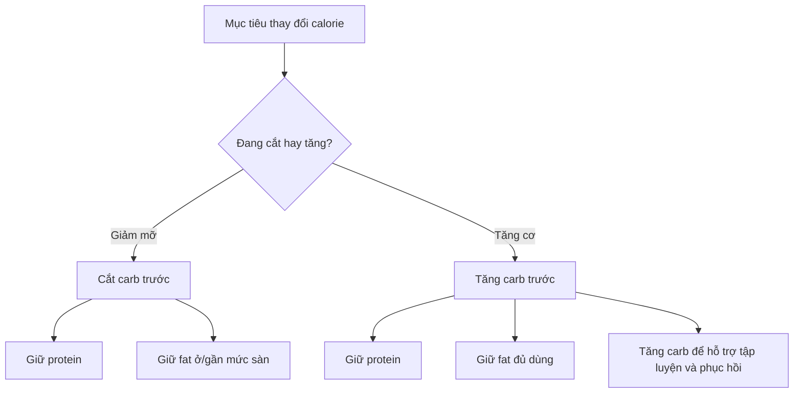

# 013 — How Many Carbs Should You Eat Per Day

| Thuộc tính       | Nội dung                                          |
| ---------------- | ------------------------------------------------- |
| **Module**       | Module 02 — Meal Planning Basics                  |
| **Bài học**      | How Many Carbs Should You Eat Per Day             |
| **Thời lượng**   | 04:07                                             |
| **Chủ đề chính** | Carb là macro “phần dư” — cách tính và điều chỉnh |

> **Ý chính của bài:**
> Carb là **macro linh hoạt nhất**. Sau khi đã đặt **protein** và **fat**, lượng **calorie còn lại** sẽ được dành cho **carb**.

---

## 1. Mục tiêu bài học

* Hiểu vì sao carb được tính **sau cùng**, từ phần calorie còn lại.
* Biết các khoảng carb tham chiếu theo mức vận động.
* Biết cách điều chỉnh carb khi cần **cắt** hoặc **tăng** calorie.
* Hiểu rằng carb **không thiết yếu về mặt sinh hóa**, nhưng lại rất quan trọng cho **hiệu suất tập luyện**, **phục hồi** và **phát triển cơ bắp**.

---

## 2. Hình minh họa tổng quan

### Sơ đồ 1 — Carb là “macro phần dư”

```mermaid
flowchart TD
    A[Tổng calorie mục tiêu mỗi ngày] --> B[Đặt Protein trước]
    B --> C[Đặt Fat tiếp theo]
    C --> D[Tính calorie còn lại]
    D --> E[Quy đổi phần còn lại thành Carb]
    E --> F[Carb = macro linh hoạt nhất]

    B1[Protein: 1.6–2.4 g/kg] --> B
    C1[Fat: 20–35% calorie<br/>hoặc tối thiểu 0.6 g/kg] --> C
    D1[Calorie còn lại =<br/>Tổng kcal - kcal protein - kcal fat] --> D
    E1[Carb (g) = phần kcal còn lại / 4] --> E
```

---

## 3. Nội dung chính

### 3.1. Vì sao carb được tính sau cùng?

Khác với **protein** và **fat**, carb là chất đa lượng **không có mức tối thiểu bắt buộc để sống sót** về mặt sinh học.
Nói cách khác:

* **Protein**: cần để duy trì và xây dựng mô cơ, enzyme, hormone...
* **Fat**: cần cho hormone, hấp thu vitamin tan trong dầu, sức khỏe tổng thể...
* **Carb**: không bắt buộc để tồn tại, **nhưng rất hữu ích** cho tập luyện và hiệu suất.

Vì vậy, trong meal plan, carb thường được xem là:

* **macro linh hoạt nhất**
* **biến số điều chỉnh calorie**
* **nguồn nhiên liệu chính cho hoạt động cường độ cao**

> Nếu bạn tập nặng mà ăn quá ít carb, bạn thường sẽ thấy:
> **yếu sức hơn khi tập**, **phục hồi chậm**, **mệt mỏi**, **uể oải**, và **khó tăng cơ**.

---

### 3.2. Công thức tính carb

```text
Bước 1: Protein   = cân nặng × 1,6–2,4 g/kg   → × 4 kcal
Bước 2: Fat       = 20–35% calorie hoặc sàn 0,6 g/kg → × 9 kcal
Bước 3: Carb      = (Tổng calorie − kcal protein − kcal fat) ÷ 4
```

### Sơ đồ 2 — Trình tự tính macro


---

### 3.3. Ví dụ đầy đủ

**Ví dụ:** Nam 80 kg, mục tiêu **giảm mỡ**, ăn **2.200 kcal/ngày**

| Macro    | Cách tính               |     Gram | kcal |
| -------- | ----------------------- | -------: | ---: |
| Protein  | 80 × 2,2                |     176g |  704 |
| Fat      | 25% × 2.200 ÷ 9         |      61g |  550 |
| **Carb** | (2.200 − 704 − 550) ÷ 4 | **236g** |  946 |

✅ Kết luận: với mục tiêu này, người đó sẽ ăn khoảng:

* **176g protein**
* **61g fat**
* **236g carb**

---

## 4. Khoảng carb tham chiếu theo mức vận động

Ngoài cách tính theo **phần dư calorie**, bạn cũng có thể kiểm tra lại bằng khoảng **g/kg cân nặng**.

| Mức vận động                   | Carb tham chiếu |
| ------------------------------ | --------------: |
| Ít vận động / giảm mỡ mạnh     |    **1–2 g/kg** |
| Tập vừa phải (3–4 buổi/tuần)   |    **3–4 g/kg** |
| Tập nặng / thể thao sức bền    |    **5–7 g/kg** |
| Vận động viên cường độ rất cao |  **8–10+ g/kg** |

### Gợi ý hiểu nhanh theo mức buổi tập

| Mức buổi tập | Đặc điểm tham khảo                                           |
| ------------ | ------------------------------------------------------------ |
| **Nhẹ**      | Khoảng 30 phút hoặc ít hơn, ít volume, dưới ~10 working sets |
| **Vừa**      | Khoảng 30–60 phút, volume trung bình, trên ~10 working sets  |
| **Nặng**     | Lâu hơn, volume cao hơn, hoặc cường độ rõ rệt hơn mức vừa    |

> Đây là **mốc tham khảo**, không phải công thức cứng.
> Nếu bạn tập rất căng trong 45 phút, bạn hoàn toàn có thể xếp mình vào nhóm **tập nặng**.

---

## 5. Có thể ăn “quá nhiều” carb không?

Đây là câu hỏi phổ biến vì carb thường bị “mang tiếng xấu” trong nhiều chế độ ăn kiêng như low-carb, keto, Atkins...

### Câu trả lời ngắn:

**Với người năng động và tập luyện nhiều, ăn nhiều carb không nhất thiết là vấn đề**, miễn là:

* bạn vẫn đủ **protein**
* bạn vẫn đủ **fat**
* carb đến từ **nguồn chất lượng**
* tổng calorie vẫn phù hợp mục tiêu

### Nguồn carb nên ưu tiên

* gạo
* yến mạch
* khoai tây / khoai lang
* bánh mì nguyên cám
* trái cây
* đậu, các loại hạt đậu
* ngũ cốc nguyên hạt

### Nguồn carb nên hạn chế hơn

* kẹo
* nước ngọt
* bánh ngọt tinh luyện
* đồ ăn quá nhiều đường bổ sung

> Không phải vì chúng “độc”, mà vì chúng **dễ làm bạn ăn quá calorie**, **no kém**, và thường có **mật độ dinh dưỡng thấp** hơn.

---

## 6. Điều chỉnh carb khi cắt hoặc tăng calorie

### Sơ đồ 3 — Nguyên tắc điều chỉnh



### Bảng điều chỉnh thực tế

| Tình huống                  | Ưu tiên điều chỉnh                                          |
| --------------------------- | ----------------------------------------------------------- |
| Cần cắt calorie để giảm mỡ  | **Cắt carb trước**, giữ protein, giữ fat ở/gần sàn          |
| Cần tăng calorie để tăng cơ | **Tăng carb trước** để hỗ trợ hiệu suất và phục hồi         |
| Cắt sâu và carb đã rất thấp | Có thể bắt đầu cắt fat, nhưng **không xuống dưới 0,6 g/kg** |
| Protein                     | **Gần như không bao giờ cắt**                               |

### Nguyên tắc vàng

* **Protein = hằng số**
* **Fat = có sàn**
* **Carb = biến số**

---

## 7. Áp dụng thực tế

### Mẫu tự tính carb mục tiêu

```text
Tổng calorie:             ______ kcal
− Protein (g × 4):        ______ kcal
− Fat (g × 9):            ______ kcal
= Còn lại ÷ 4 = Carb:     ______ g/ngày
```

### Checklist kiểm tra kết quả

* [ ] Protein đã nằm trong khoảng mục tiêu
* [ ] Fat không thấp hơn mức sàn
* [ ] Carb không bị âm
* [ ] Carb hợp lý với mức vận động
* [ ] Tổng calorie đúng với mục tiêu tăng cơ / giảm mỡ / duy trì

---

## 8. Tham chiếu nhanh lượng carb trong thực phẩm

| Thực phẩm          | Khẩu phần | Carb ước tính |
| ------------------ | --------- | ------------: |
| Gạo trắng nấu chín | 100g      |          ~28g |
| Khoai lang luộc    | 100g      |          ~20g |
| Yến mạch khô       | 100g      |          ~60g |
| Bánh mì nguyên cám | 1 lát     |          ~15g |
| Chuối vừa          | 1 quả     |          ~27g |
| Đậu đen nấu chín   | 100g      |          ~24g |

---

## 9. Lưu ý & lỗi thường gặp

### 9.1. Không có “ngưỡng carb tối thiểu” sinh hóa

Bạn **có thể sống** mà không ăn carb. Nhưng điều đó **không có nghĩa** đó là lựa chọn tốt cho người tập luyện.

> Thực tế, khi xuống quá thấp (ví dụ dưới khoảng **100g/ngày** ở nhiều người tập tạ), hiệu suất, tâm trạng và mức phục hồi thường bị ảnh hưởng.

---

### 9.2. Dấu hiệu đang ăn quá ít carb

* hụt sức ở các rep cuối
* pump kém
* phục hồi chậm
* dễ mệt
* ngủ kém
* thèm đồ ngọt mạnh
* cảm giác “đờ đẫn”, uể oải

---

### 9.3. Nhầm mất nước glycogen với mất mỡ

Khi mới giảm carb, cân nặng thường tụt nhanh vì:

* glycogen giảm
* nước đi kèm glycogen cũng giảm

Điều đó **không đồng nghĩa** bạn đã giảm nhiều mỡ.

---

### 9.4. Carb ra số âm hoặc quá thấp

Nếu tính ra carb **âm** hoặc **rất thấp**, thường có nghĩa là:

* protein đang đặt quá cao
* fat đang đặt quá cao
* tổng calorie mục tiêu quá thấp

➡️ Lúc này, hãy **xem lại bước 1 và bước 2**, không nên cố chấp giữ mọi thứ cùng lúc.

---

### 9.5. Không phải ai cũng hợp ăn carb cao

Một số người thấy:

* đầy bụng
* chướng bụng
* mệt sau bữa ăn nhiều carb

Nếu bạn thuộc nhóm này, hãy giữ carb ở mức **hợp lý**, rồi phân bổ calorie còn lại sang **fat lành mạnh**.

---

## 10. Gợi ý ảnh minh họa nên chèn

> Vì markdown học tập thường dễ vỡ bố cục khi chèn quá nhiều ảnh, anh gợi ý mỗi cụm nội dung **1 ảnh** là đẹp nhất.

### Ảnh 1 — Minh họa nguồn carb lành mạnh

Dùng cho phần **“Nguồn carb nên ưu tiên”**

```markdown

```

### Ảnh 2 — Minh họa bữa ăn giàu carb cho người tập luyện

Dùng cho phần **“Vai trò của carb với hiệu suất”**

```markdown

```

### Ảnh 3 — Minh họa yến mạch / ngũ cốc nguyên hạt

Dùng cho phần **“Chất lượng nguồn carb”**

```markdown

```

### Ảnh 4 — Minh họa khoai, gạo, trái cây

Dùng cho phần **“Tham chiếu thực phẩm”**

```markdown

```

> Nếu link ảnh không hiển thị ở trình markdown của em, hãy giữ nguyên phần bài học và chỉ thay ảnh bằng nguồn em đang dùng như GitHub, Notion, Obsidian hoặc website riêng.

---

## 11. Phiên bản markdown hoàn chỉnh để copy

````markdown
# 013 — How Many Carbs Should You Eat Per Day

| Thuộc tính | Nội dung |
|---|---|
| **Module** | Module 02 — Meal Planning Basics |
| **Bài học** | How Many Carbs Should You Eat Per Day |
| **Thời lượng** | 04:07 |
| **Chủ đề chính** | Carb là macro “phần dư” — cách tính và điều chỉnh |


> **Ý chính của bài:**  
> Carb là **macro linh hoạt nhất**. Sau khi đã đặt **protein** và **fat**, lượng **calorie còn lại** sẽ được dành cho **carb**.

## 1. Mục tiêu bài học

- Hiểu vì sao carb được tính **sau cùng**, từ phần calorie còn lại.
- Biết các khoảng carb tham chiếu theo mức vận động.
- Biết cách điều chỉnh carb khi cần **cắt** hoặc **tăng** calorie.
- Hiểu rằng carb **không thiết yếu về mặt sinh hóa**, nhưng lại rất quan trọng cho **hiệu suất tập luyện**, **phục hồi** và **phát triển cơ bắp**.

## 2. Nội dung chính

### Carb là macro phần dư (remainder macro)

Vì carb không chứa thành phần thiết yếu như protein và fat, nó là macro **linh hoạt nhất** và thường được dùng làm “van điều tiết” cho tổng calorie.

```text
Bước 1: Protein   = cân nặng × 1,6–2,4 g/kg   → × 4 kcal
Bước 2: Fat       = 20–35% calorie hoặc sàn 0,6 g/kg → × 9 kcal
Bước 3: Carb      = (Tổng calorie − kcal protein − kcal fat) ÷ 4
````


### Ví dụ đầy đủ

**Ví dụ:** Nam 80 kg, mục tiêu **giảm mỡ**, ăn **2.200 kcal/ngày**

| Macro    | Cách tính               |     Gram | kcal |
| -------- | ----------------------- | -------: | ---: |
| Protein  | 80 × 2,2                |     176g |  704 |
| Fat      | 25% × 2.200 ÷ 9         |      61g |  550 |
| **Carb** | (2.200 − 704 − 550) ÷ 4 | **236g** |  946 |

### Khoảng tham chiếu theo mức vận động


| Mức vận động                   | Carb tham chiếu |
| ------------------------------ | --------------: |
| Ít vận động / giảm mỡ mạnh     |    **1–2 g/kg** |
| Tập vừa phải (3–4 buổi/tuần)   |    **3–4 g/kg** |
| Tập nặng / thể thao sức bền    |    **5–7 g/kg** |
| Vận động viên cường độ rất cao |  **8–10+ g/kg** |

Các con số này là **hướng dẫn**, không phải quy tắc cứng. Nếu kết quả tính theo “phần dư” lệch khỏi bảng, hãy ưu tiên kiểm tra lại tổng calorie, protein và fat trước.

### Có thể ăn quá nhiều carb không?

Với người năng động và tập luyện nhiều, **ăn nhiều carb không nhất thiết là vấn đề**, miễn là:

* vẫn đủ protein
* vẫn đủ fat
* tổng calorie phù hợp mục tiêu
* nguồn carb chủ yếu đến từ thực phẩm chất lượng

### Nguồn carb nên ưu tiên


* gạo
* yến mạch
* khoai tây / khoai lang
* bánh mì nguyên cám
* trái cây
* đậu
* ngũ cốc nguyên hạt

### Điều chỉnh khi cắt hoặc tăng calorie

| Tình huống                  | Ưu tiên điều chỉnh                                          |
| --------------------------- | ----------------------------------------------------------- |
| Cần cắt calorie để giảm mỡ  | **Cắt carb trước**, giữ protein, giữ fat ở/gần sàn          |
| Cần tăng calorie để tăng cơ | **Tăng carb trước** để hỗ trợ hiệu suất và phục hồi         |
| Cắt sâu và carb đã rất thấp | Có thể bắt đầu cắt fat, nhưng **không xuống dưới 0,6 g/kg** |
| Protein                     | **Gần như không bao giờ cắt**                               |

> Nguyên tắc: **protein là hằng số, fat có sàn, carb là biến số.**

## 3. Áp dụng thực tế

```text
Tổng calorie:             ______ kcal
− Protein (g × 4):        ______ kcal
− Fat (g × 9):            ______ kcal
= Còn lại ÷ 4 = Carb:     ______ g/ngày
```

### Tham chiếu nhanh lượng carb


| Thực phẩm                | Khẩu phần | Carb |
| ------------------------ | --------- | ---: |
| Gạo trắng nấu chín       | 100g      | ~28g |
| Khoai lang luộc          | 100g      | ~20g |
| Yến mạch khô             | 100g      | ~60g |
| 1 lát bánh mì nguyên cám | 1 lát     | ~15g |
| 1 quả chuối vừa          | 1 quả     | ~27g |
| Đậu đen nấu chín         | 100g      | ~24g |

## 4. Lưu ý & lỗi thường gặp

* **Không có “ngưỡng carb tối thiểu”** về mặt sinh hóa, nhưng ăn quá thấp thường làm giảm hiệu suất tập luyện.
* Dấu hiệu ăn quá ít carb: hụt sức, phục hồi chậm, ngủ kém, mệt mỏi, thèm đồ ngọt dữ dội.
* Đừng nhầm **giảm nước do glycogen giảm** với **giảm mỡ** khi mới cắt carb.
* Nếu carb tính ra âm hoặc quá thấp, tức là protein hoặc fat đang đặt quá cao so với ngân sách calorie.

## 5. Checklist thực hành

* [ ] Hiểu carb là macro phần dư, tính sau protein và fat.
* [ ] Đã tính được lượng carb mục tiêu cho bản thân.
* [ ] Đã đối chiếu con số với khoảng tham chiếu theo mức vận động.
* [ ] Nắm nguyên tắc điều chỉnh: protein hằng số, fat có sàn, carb là biến số.

## 6. Tóm tắt

Carb được tính sau cùng từ phần calorie còn lại sau khi đã đặt protein và fat. Dù không phải chất dinh dưỡng thiết yếu để tồn tại, carb rất quan trọng cho **hiệu suất tập luyện**, **phục hồi** và **phát triển cơ bắp**. Khi cần cắt calorie, thường **cắt carb trước**; khi cần tăng calorie, thường **tăng carb trước**. Protein gần như luôn giữ nguyên, fat luôn phải ở trên ngưỡng sàn.

