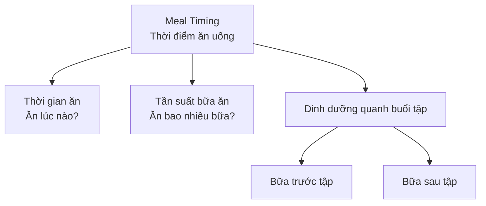
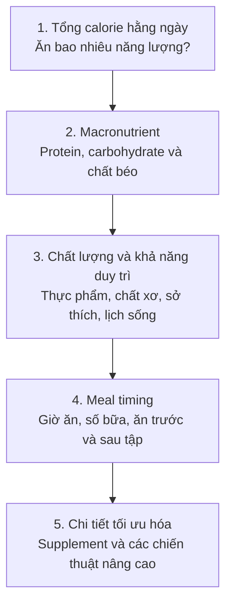
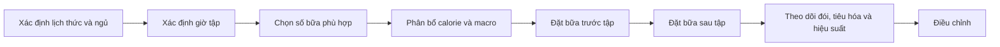

[](https://medium.com/%40fitnessbos/timing-your-meals-right-mastering-meal-times-for-effective-weight-loss-dee0f16b743b?utm_source=chatgpt.com)

# 014 — Meal Timing Introduction

| Thuộc tính         | Nội dung                                                                      |
| ------------------ | ----------------------------------------------------------------------------- |
| **Module**         | Module 02 — Meal Planning Basics                                              |
| **Bài học**        | Meal Timing Introduction                                                      |
| **Thời lượng**     | 01:23                                                                         |
| **Chủ đề chính**   | Giới thiệu về thời điểm ăn uống, tần suất bữa ăn và dinh dưỡng quanh buổi tập |
| **Mức độ ưu tiên** | Tối ưu hóa sau khi đã kiểm soát calorie và macronutrient                      |


*Nguồn ảnh: [Wikimedia Commons](https://commons.wikimedia.org/wiki/File:Healthy_meal_planning_with_fresh_fruits_and_vegetables_in_a_bright_kitchen_setting.jpg), giấy phép CC BY 2.0.* ([Wikimedia Commons][1])

> **Ý tưởng cốt lõi:** Thời điểm ăn có thể giúp chế độ ăn thuận tiện và hỗ trợ hiệu suất tập luyện, nhưng không thể bù lại việc ăn sai tổng calorie hoặc thiếu macronutrient.

---

## Mục lục

1. [Mục tiêu bài học](#1-mục-tiêu-bài-học)
2. [Nội dung chính](#2-nội-dung-chính)
3. [Áp dụng thực tế](#3-áp-dụng-thực-tế)
4. [Lưu ý và lỗi thường gặp](#4-lưu-ý-và-lỗi-thường-gặp)
5. [Checklist thực hành](#5-checklist-thực-hành)
6. [Tóm tắt](#6-tóm-tắt)

---

## 1. Mục tiêu bài học

Sau bài học này, bạn có thể:

* Hiểu **meal timing** — thời điểm ăn uống — là gì.
* Phân biệt ba khái niệm:

  * thời điểm ăn;
  * số bữa ăn mỗi ngày;
  * bữa ăn trước và sau tập.
* Hiểu vì sao meal timing là một công cụ **tối ưu hóa**, không phải nền tảng quan trọng nhất của chế độ ăn.
* Biết cách sắp xếp bữa ăn linh hoạt theo lịch học tập, làm việc và tập luyện.
* Tránh những lầm tưởng như:

  * bắt buộc phải ăn sáu bữa mỗi ngày;
  * ăn sau một giờ nhất định chắc chắn gây tăng mỡ;
  * phải uống protein ngay lập tức sau khi tập.

---

## 2. Nội dung chính

### 2.1. Meal timing là gì?

**Meal timing** có thể hiểu đơn giản là việc xác định:

> **Bạn ăn vào thời điểm nào trong ngày?**

Tuy nhiên, khái niệm này không chỉ nói về giờ ăn sáng, trưa và tối. Nó còn bao gồm ba thành phần liên quan.



| Thành phần          | Câu hỏi cần giải quyết                             |
| ------------------- | -------------------------------------------------- |
| **Thời điểm ăn**    | Nên ăn vào những thời điểm nào trong ngày?         |
| **Tần suất bữa ăn** | Nên ăn hai, ba, bốn hay nhiều bữa mỗi ngày?        |
| **Bữa trước tập**   | Nên ăn gì và ăn cách buổi tập bao lâu?             |
| **Bữa sau tập**     | Khi nào nên bổ sung protein, carbohydrate và nước? |

---

### 2.2. Thứ tự ưu tiên trong một chế độ ăn

Meal timing thường được cộng đồng thể hình thảo luận rất nhiều. Tuy nhiên, người mới dễ đánh giá quá cao vai trò của nó.

Theo nội dung bài học, thứ tự ưu tiên nên được hiểu như sau:



### Nguyên tắc cần nhớ

| Yếu tố                                | Vai trò                                                                  |
| ------------------------------------- | ------------------------------------------------------------------------ |
| **Calorie**                           | Ảnh hưởng lớn đến việc cân nặng tăng, giảm hay được duy trì              |
| **Protein, carbohydrate và chất béo** | Ảnh hưởng đến khả năng duy trì cơ bắp, hiệu suất và chất lượng chế độ ăn |
| **Meal timing**                       | Hỗ trợ cảm giác đói, sự thuận tiện, tiêu hóa, hiệu suất tập và phục hồi  |
| **Chi tiết nâng cao**                 | Chỉ nên tối ưu sau khi các nền tảng phía trên đã ổn định                 |

Thay đổi số bữa ăn mà không thay đổi tổng năng lượng và dinh dưỡng hằng ngày thường tạo ra ảnh hưởng hạn chế đối với việc giảm cân và thay đổi thành phần cơ thể. Tuy nhiên, số bữa vẫn có thể ảnh hưởng khác nhau đến cảm giác đói và no ở từng người. ([PubMed][2])

> **Meal timing có giá trị, nhưng giá trị của nó đứng sau calorie và macronutrient.**

---

### 2.3. Tần suất bữa ăn

**Meal frequency** là số lần bạn ăn trong một ngày.

Một người có thể lựa chọn:

* hai bữa lớn;
* ba bữa chính;
* ba bữa chính và một bữa phụ;
* bốn hoặc năm bữa nhỏ;
* một cấu trúc khác phù hợp với lịch sinh hoạt.

Không tồn tại một con số duy nhất phù hợp với tất cả mọi người. Tần suất ăn nên giúp bạn:

1. kiểm soát cảm giác đói;
2. đạt mục tiêu calorie;
3. ăn đủ protein và các chất dinh dưỡng;
4. tập luyện thoải mái;
5. duy trì kế hoạch trong thời gian dài.

Nghiên cứu về tần suất bữa ăn cho thấy việc đơn thuần tăng số bữa không bảo đảm làm tăng trao đổi chất hoặc giúp giảm mỡ tốt hơn. Ảnh hưởng thực tế còn phụ thuộc vào tổng lượng thức ăn, lựa chọn thực phẩm, cảm giác no và khả năng duy trì kế hoạch. ([PubMed Central (PMC)][3])

---

### 2.4. Bữa ăn trước tập

Bữa trước tập có thể giúp:

* cung cấp năng lượng cho buổi tập;
* hạn chế cảm giác đói;
* hỗ trợ duy trì cường độ tập luyện;
* giảm nguy cơ khó chịu do ăn quá sát giờ tập;
* bắt đầu cung cấp acid amin cho cơ thể trước khi buổi tập kết thúc.


*Nguồn ảnh: [Wikimedia Commons](https://commons.wikimedia.org/wiki/File:Banana_oatmeal.jpg).* ([Wikimedia Commons][4])

Một bữa trước tập thường có thể gồm:

* **carbohydrate:** cơm, khoai, yến mạch, bánh mì, chuối hoặc trái cây;
* **protein:** thịt nạc, trứng, sữa chua, sữa hoặc whey;
* lượng chất béo và chất xơ phù hợp với khả năng tiêu hóa.

#### Khoảng thời gian tham khảo

| Thời gian trước tập | Cách ăn phù hợp                                                            |
| ------------------- | -------------------------------------------------------------------------- |
| **2–3 giờ**         | Một bữa ăn hoàn chỉnh gồm protein, carbohydrate và lượng chất béo vừa phải |
| **1–2 giờ**         | Một bữa nhỏ, dễ tiêu hóa, tập trung vào protein và carbohydrate            |
| **Dưới 60 phút**    | Thực phẩm nhẹ như chuối, sữa chua, sữa, bánh mì hoặc đồ uống phù hợp       |

Đây không phải quy tắc bắt buộc. Thời gian và kích thước bữa trước tập có thể ảnh hưởng đến mức độ cần thiết phải ăn ngay sau buổi tập. ([PubMed][2])

---

### 2.5. Bữa ăn sau tập

Bữa sau tập có mục tiêu:

* cung cấp protein phục vụ quá trình sửa chữa và thích nghi của cơ;
* bổ sung carbohydrate, đặc biệt khi buổi tập sử dụng nhiều glycogen;
* bổ sung nước và điện giải đã mất;
* giúp hoàn thành mục tiêu calorie và macro trong ngày.


*Nguồn ảnh: [Wikimedia Commons](https://commons.wikimedia.org/wiki/File:Liat_Portal_for_Foodie_Disorder_-_Healthy_low-fat_chicken,_rice,_broccoli,_and_sweet_potato_plate.jpg).* ([Wikimedia Commons][5])

Protein chất lượng cao được sử dụng trong khoảng thời gian sau tập có thể kích thích mạnh quá trình tổng hợp protein cơ. Tuy nhiên, không nên hiểu điều này thành một “cửa sổ đồng hóa” chỉ kéo dài vài phút. Mức độ khẩn cấp của bữa sau tập phụ thuộc vào thời điểm, kích thước và thành phần của bữa trước tập, cũng như tổng lượng protein trong ngày. ([PubMed][2])

> Bạn không mất toàn bộ kết quả chỉ vì không uống whey ngay sau hiệp tập cuối cùng.

---

### 2.6. Khi nào meal timing trở nên quan trọng hơn?

Meal timing có thể đáng chú ý hơn khi:

* bạn tập luyện với cường độ hoặc khối lượng cao;
* có nhiều buổi tập trong cùng một ngày;
* cần đạt hiệu suất thi đấu;
* thường xuyên bị đầy bụng hoặc đói trong lúc tập;
* đang tăng cân nhưng khó ăn đủ năng lượng;
* đang giảm cân và cần kiểm soát cảm giác đói;
* lịch làm việc khiến bạn thường xuyên bỏ bữa;
* cần phục hồi nhanh giữa hai buổi vận động.

Với người tập thông thường, kết quả vẫn có thể rất tốt ngay cả khi giờ ăn không hoàn hảo, miễn là tổng calorie, protein và các chất dinh dưỡng quan trọng được duy trì nhất quán.

---

## 3. Áp dụng thực tế

### 3.1. Quy trình thiết lập meal timing



#### Bước 1: Xác định lịch sinh hoạt

Ghi lại:

* giờ thức dậy;
* giờ đi ngủ;
* thời gian học hoặc làm việc;
* thời gian tập luyện;
* những khoảng thời gian có thể ăn.

#### Bước 2: Chọn số bữa dễ duy trì

Ví dụ:

| Hoàn cảnh                   | Cấu trúc có thể sử dụng              |
| --------------------------- | ------------------------------------ |
| Không thích ăn sáng         | Hai bữa chính và một bữa phụ         |
| Lịch sinh hoạt thông thường | Ba bữa chính                         |
| Hay đói giữa các bữa        | Ba bữa chính và một hoặc hai bữa phụ |
| Khó ăn đủ khi tăng cân      | Bốn hoặc năm bữa vừa phải            |
| Lịch làm việc bận           | Ba bữa đơn giản, chuẩn bị trước      |

#### Bước 3: Xếp bữa ăn quanh buổi tập

* Không bước vào buổi tập khi quá đói nếu điều đó làm giảm hiệu suất.
* Không ăn một bữa quá lớn ngay sát giờ tập nếu dễ đầy bụng.
* Bố trí protein và carbohydrate trong các bữa gần buổi tập.
* Bổ sung nước trong ngày thay vì chỉ uống khi bắt đầu tập.

---

### 3.2. Ví dụ: tập vào buổi chiều

| Thời gian | Hoạt động        | Gợi ý                                       |
| --------: | ---------------- | ------------------------------------------- |
| **07:30** | Bữa sáng         | Protein, carbohydrate, trái cây             |
| **12:00** | Bữa trưa         | Một bữa ăn cân đối                          |
| **15:30** | Bữa trước tập    | Bữa nhỏ có protein và carbohydrate          |
| **17:30** | Tập luyện        | Uống nước phù hợp                           |
| **19:00** | Bữa sau tập      | Protein, carbohydrate, rau và nước          |
| **22:00** | Bữa phụ tùy chọn | Dùng khi cần hoàn thành mục tiêu trong ngày |

Lịch trên chỉ là ví dụ. Bạn có thể dịch chuyển các bữa theo giờ học, giờ làm và khả năng tiêu hóa.

---

### 3.3. Ví dụ: tập vào buổi sáng

#### Trường hợp tập nhẹ và không thích ăn sớm

* Có thể tập sau khi uống nước.
* Ăn một bữa đầy đủ sau buổi tập.
* Theo dõi xem việc tập khi chưa ăn có làm giảm hiệu suất hay không.

#### Trường hợp tập nặng hoặc kéo dài

* Ăn một món nhỏ, dễ tiêu hóa trước tập.
* Ví dụ: chuối, sữa chua, bánh mì, sữa hoặc whey.
* Ăn bữa sáng hoàn chỉnh sau tập.

---

### 3.4. Giải pháp cho người bận rộn


*Nguồn ảnh: [Wikimedia Commons](https://commons.wikimedia.org/wiki/File:Meal_prep_container_%2844260855980%29.jpg).* ([Wikimedia Commons][6])

Bạn không cần lập kế hoạch từng phút. Có thể áp dụng một số nguyên tắc đơn giản:

* Chuẩn bị trước một số bữa chính.
* Mang theo trái cây, sữa chua hoặc món ăn giàu protein.
* Xác định các **khung giờ ăn** thay vì một giờ cố định.
* Dùng thực phẩm tiện lợi khi cần, nhưng vẫn theo dõi tổng lượng ăn.
* Ưu tiên kế hoạch có thể lặp lại trong phần lớn số ngày.

Ví dụ:

```text
Bữa sáng: 07:00–09:00
Bữa trưa: 11:30–13:30
Bữa trước tập: 60–180 phút trước khi tập
Bữa tối: sau tập hoặc trong khung 18:30–20:30
```

---

## 4. Lưu ý và lỗi thường gặp

### Lỗi 1: Tối ưu giờ ăn trước khi kiểm soát calorie

Bạn có thể ăn vào những thời điểm được cho là “hoàn hảo”, nhưng vẫn khó đạt mục tiêu nếu tổng lượng ăn không phù hợp.

**Cách sửa:** kiểm soát tổng calorie và macro trước, sau đó mới tối ưu thời điểm.

---

### Lỗi 2: Tin rằng phải ăn nhiều bữa để tăng trao đổi chất

Cơ thể không tự động đốt nhiều mỡ hơn chỉ vì cùng một lượng thức ăn được chia thành nhiều bữa hơn.

**Cách sửa:** chọn số bữa giúp bạn dễ kiểm soát đói và duy trì kế hoạch.

---

### Lỗi 3: Quá lo lắng về “cửa sổ đồng hóa”

Một số người vội uống whey ngay sau khi tập nhưng lại thiếu protein trong toàn bộ ngày.

**Cách sửa:** ưu tiên tổng protein hằng ngày và bố trí các bữa protein hợp lý. Tầm quan trọng của thời điểm sau tập phụ thuộc nhiều vào bữa trước tập. ([PubMed][2])

---

### Lỗi 4: Ép bản thân ăn theo lịch của người khác

Lịch ăn của vận động viên chuyên nghiệp không nhất thiết phù hợp với sinh viên, nhân viên văn phòng hoặc người tập giải trí.

**Cách sửa:** xây dựng lịch ăn dựa trên:

* mục tiêu cá nhân;
* giờ tập;
* khả năng tiêu hóa;
* cảm giác đói;
* điều kiện chuẩn bị thức ăn.

---

### Lỗi 5: Ăn quá nhiều ngay sát giờ tập

Một bữa lớn, giàu chất béo hoặc nhiều chất xơ ngay trước buổi tập có thể gây cảm giác nặng bụng ở một số người.

**Cách sửa:** ăn bữa lớn sớm hơn hoặc giảm kích thước bữa khi thời gian đến buổi tập ngắn.

---

### Lỗi 6: Bỏ qua khả năng duy trì

Một lịch ăn quá phức tạp thường khó duy trì khi công việc thay đổi.

**Cách sửa:** sử dụng các khung thời gian linh hoạt và chuẩn bị sẵn phương án dự phòng.

---

## 5. Checklist thực hành

### Nền tảng dinh dưỡng

* [ ] Tôi đã xác định mục tiêu calorie hằng ngày.
* [ ] Tôi đã xác định lượng protein, carbohydrate và chất béo.
* [ ] Tôi không sử dụng meal timing để bù cho việc ăn sai tổng lượng.
* [ ] Tôi có thể duy trì kế hoạch trong phần lớn số ngày.

### Lịch ăn

* [ ] Tôi biết mình thường thức dậy và đi ngủ lúc nào.
* [ ] Tôi đã chọn số bữa phù hợp với lịch sinh hoạt.
* [ ] Các bữa không khiến tôi quá đói hoặc quá no.
* [ ] Tôi có phương án cho những ngày bận rộn.

### Buổi tập

* [ ] Tôi biết giờ tập luyện thông thường.
* [ ] Tôi có một bữa hoặc món ăn phù hợp trước tập khi cần.
* [ ] Tôi không ăn quá nhiều sát giờ tập.
* [ ] Tôi có nguồn protein trong khoảng thời gian hợp lý sau tập.
* [ ] Tôi chú ý đến nước và khả năng phục hồi.

### Đánh giá và điều chỉnh

* [ ] Tôi theo dõi năng lượng trong buổi tập.
* [ ] Tôi theo dõi cảm giác đói và no.
* [ ] Tôi theo dõi tình trạng đầy bụng hoặc khó tiêu.
* [ ] Tôi sẽ điều chỉnh lịch ăn dựa trên phản hồi thực tế.

---

## 6. Tóm tắt

### Meal timing bao gồm

1. **Ăn vào thời điểm nào trong ngày.**
2. **Ăn bao nhiêu bữa mỗi ngày.**
3. **Ăn gì và ăn khi nào trước buổi tập.**
4. **Ăn gì và ăn khi nào sau buổi tập.**

### Thứ tự ưu tiên

```text
Calorie
   ↓
Macronutrient
   ↓
Khả năng duy trì
   ↓
Thời điểm và tần suất bữa ăn
   ↓
Các chi tiết tối ưu hóa
```

Meal timing có thể hỗ trợ hiệu suất, tiêu hóa, cảm giác đói và sự thuận tiện. Tuy nhiên, nó hiếm khi quyết định thành công hay thất bại của chế độ ăn theo cách mà tổng calorie và macronutrient có thể làm.

> **Hãy xây dựng nền tảng trước, sau đó mới tối ưu thời điểm ăn.**

[1]: https://commons.wikimedia.org/wiki/File%3AHealthy_meal_planning_with_fresh_fruits_and_vegetables_in_a_bright_kitchen_setting.jpg?utm_source=chatgpt.com "File:Healthy meal planning with fresh fruits and vegetables in a ..."
[2]: https://pubmed.ncbi.nlm.nih.gov/28919842/?utm_source=chatgpt.com "International society of sports nutrition position stand: nutrient timing - PubMed"
[3]: https://pmc.ncbi.nlm.nih.gov/articles/PMC3070624/?utm_source=chatgpt.com "International Society of Sports Nutrition position stand: meal frequency - PMC"
[4]: https://commons.wikimedia.org/wiki/File%3ABanana_oatmeal.jpg?utm_source=chatgpt.com "File:Banana oatmeal.jpg - Wikimedia Commons"
[5]: https://commons.wikimedia.org/wiki/File%3ALiat_Portal_for_Foodie_Disorder_-_Healthy_low-fat_chicken%2C_rice%2C_broccoli%2C_and_sweet_potato_plate.jpg?utm_source=chatgpt.com "File:Liat Portal for Foodie Disorder - Healthy low-fat chicken, rice, broccoli, and sweet potato plate.jpg - Wikimedia Commons"
[6]: https://commons.wikimedia.org/wiki/File%3AMeal_prep_container_%2844260855980%29.jpg?utm_source=chatgpt.com "File:Meal prep container (44260855980).jpg - Wikimedia Commons"
