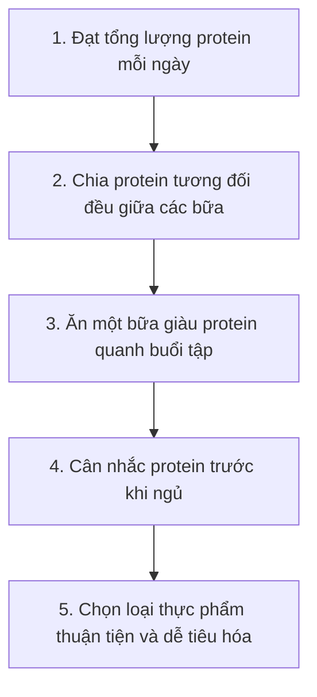
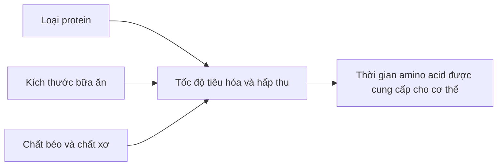
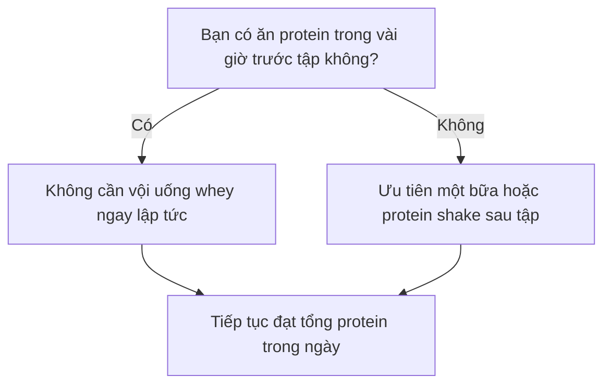
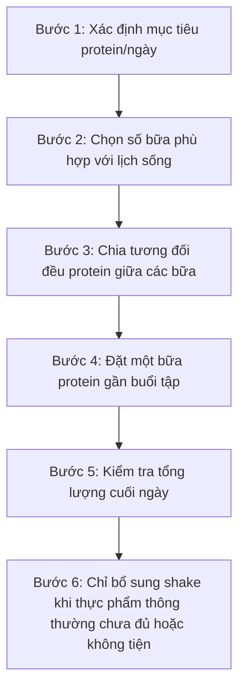
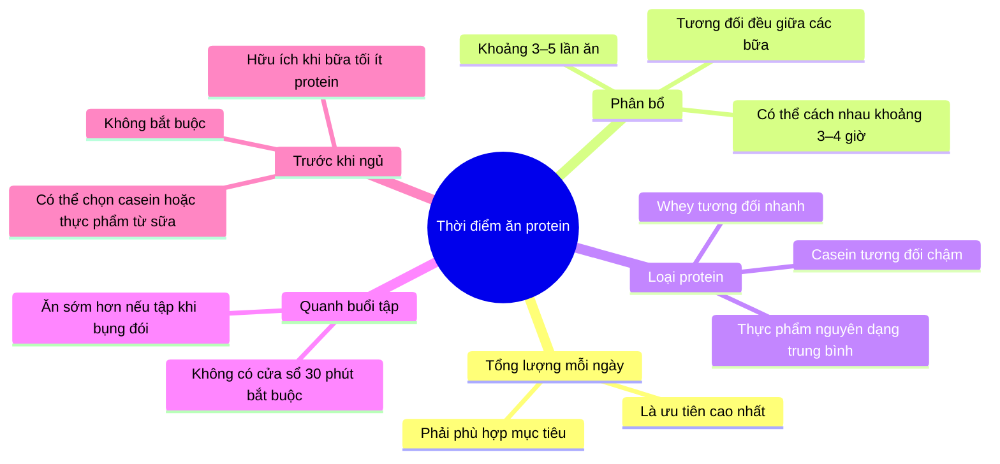

# 015 — Khi nào nên ăn Protein?

| Thuộc tính             | Nội dung                                                                                  |
| ---------------------- | ----------------------------------------------------------------------------------------- |
| **Module**             | Module 02 — Meal Planning Basics                                                          |
| **Bài học**            | When Should You Eat Protein                                                               |
| **Thời lượng**         | 04:57                                                                                     |
| **Chủ đề chính**       | Thời điểm, tần suất và cách phân bổ protein trong ngày                                    |
| **Nguyên tắc cốt lõi** | Tổng lượng protein mỗi ngày quan trọng hơn thời điểm uống protein chính xác đến từng phút |

## Mục lục

1. [Mục tiêu bài học](#1-mục-tiêu-bài-học)
2. [Nội dung chính](#2-nội-dung-chính)
3. [Áp dụng thực tế](#3-áp-dụng-thực-tế)
4. [Lưu ý và lỗi thường gặp](#4-lưu-ý-và-lỗi-thường-gặp)
5. [Checklist thực hành](#5-checklist-thực-hành)
6. [Tóm tắt](#6-tóm-tắt)

---

## 1. Mục tiêu bài học

Sau bài học này, bạn có thể:

* Hiểu vì sao không bắt buộc phải ăn sáu bữa mỗi ngày để duy trì hoặc phát triển cơ bắp.
* Biết cách phân bổ tổng lượng protein thành ba đến năm lần ăn phù hợp với lịch sinh hoạt.
* Phân biệt tương đối giữa protein tiêu hóa nhanh, trung bình và chậm.
* Hiểu ảnh hưởng của kích thước bữa ăn, chất béo và chất xơ đến tốc độ tiêu hóa.
* Biết cách bố trí protein trước tập, sau tập và trước khi ngủ.
* Tránh hiểu sai rằng cơ thể chỉ sử dụng được một lượng protein rất nhỏ trong mỗi bữa.

---

## 2. Nội dung chính

### 2.1. Có bắt buộc phải ăn sáu bữa mỗi ngày không?

Một lời khuyên phổ biến trong giới thể hình trước đây là:

> Phải ăn một bữa giàu protein sau mỗi ba giờ để liên tục cung cấp amino acid và ngăn cơ thể phá hủy cơ bắp.

Lập luận này xuất phát từ việc cơ thể có thể:

* Dự trữ carbohydrate dưới dạng **glycogen**.
* Dự trữ chất béo trong các tế bào mỡ.
* Nhưng không có một “kho chứa protein” chuyên biệt tương tự.

Tuy nhiên, điều đó không có nghĩa là cơ thể sẽ ngay lập tức phá hủy cơ bắp nếu bạn không ăn protein trong vài giờ.

Cơ thể có một lượng amino acid lưu thông và liên tục điều chỉnh quá trình:

* Tiêu hóa thức ăn.
* Hấp thu amino acid.
* Tổng hợp protein.
* Phân giải và tái sử dụng protein.
* Oxy hóa amino acid khi cần thiết.

Vì vậy, **ba hoặc bốn bữa ăn đủ lớn vẫn có thể cung cấp đầy đủ protein**, miễn là tổng lượng protein cả ngày đạt mục tiêu.


*Minh họa một bữa ăn hỗn hợp gồm protein, carbohydrate và rau. [Nguồn ảnh: Wikimedia Commons](https://commons.wikimedia.org/wiki/File:Liat_Portal_for_Foodie_Disorder_-_Grilled_chicken_with_rice_and_vegetables.jpg).*

### Thứ tự ưu tiên



Nói cách khác:

> **Tổng protein mỗi ngày quan trọng nhất. Phân bổ theo bữa đứng thứ hai. Thời điểm chính xác chỉ là bước tối ưu bổ sung.**

---

### 2.2. Nên ăn protein bao nhiêu lần trong ngày?

Đối với người tập luyện, một hướng dẫn thực tế thường được sử dụng là tiêu thụ khoảng:

* **20–40 g protein chất lượng cao mỗi lần**, hoặc
* Khoảng **0,25–0,40 g protein/kg cân nặng mỗi lần**,
* Cách nhau khoảng **3–4 giờ**.

Đây là phạm vi tham khảo chứ không phải quy tắc bắt buộc. Lượng protein phù hợp còn phụ thuộc vào cân nặng, tuổi, tổng lượng protein trong ngày, kích thước cơ thể và mục tiêu tập luyện. ([PubMed Central (PMC)][1])

| Tần suất         | Khả năng áp dụng | Nhận xét                                                              |
| ---------------- | ---------------- | --------------------------------------------------------------------- |
| **2 bữa/ngày**   | Có thể           | Mỗi bữa phải khá lớn; khó phân bổ tối ưu nếu nhu cầu protein cao      |
| **3 bữa/ngày**   | Tốt              | Phù hợp với đa số người có lịch sinh hoạt thông thường                |
| **4 bữa/ngày**   | Rất thực tế      | Dễ chia đều protein mà không cần bữa ăn quá lớn                       |
| **5–6 bữa/ngày** | Không bắt buộc   | Có thể dùng nếu thích ăn nhiều bữa nhỏ hoặc cần lượng calorie rất cao |

### Ví dụ với người nặng 70 kg

Giả sử mục tiêu là:

[
70 \times 1,6 = 112\text{ g protein/ngày}
]

Có thể phân bổ theo nhiều cách:

| Phương án | Cách phân bổ                   |
| --------- | ------------------------------ |
| **3 bữa** | Khoảng 37 g protein mỗi bữa    |
| **4 bữa** | Khoảng 28 g protein mỗi bữa    |
| **5 bữa** | Khoảng 22–23 g protein mỗi bữa |

Cả ba phương án đều có thể hiệu quả. Không nhất thiết phải ăn đúng sáu bữa hoặc đặt báo thức sau mỗi ba giờ.

---

### 2.3. Ba yếu tố ảnh hưởng đến tốc độ tiêu hóa protein

Thời gian amino acid xuất hiện trong máu không chỉ phụ thuộc vào số gram protein. Nó còn chịu ảnh hưởng bởi:

1. Loại protein.
2. Kích thước và thành phần bữa ăn.
3. Hàm lượng chất béo và chất xơ.



---

### 2.4. Yếu tố 1: Loại protein

Các nguồn protein khác nhau có tốc độ tiêu hóa tương đối khác nhau.

| Nhóm               | Ví dụ                                      | Đặc điểm tương đối                                                              |
| ------------------ | ------------------------------------------ | ------------------------------------------------------------------------------- |
| **Tiêu hóa nhanh** | Whey protein                               | Amino acid xuất hiện trong máu tương đối nhanh                                  |
| **Trung bình**     | Trứng, thịt nạc, cá, thịt gia cầm, đậu phụ | Thường được tiêu hóa trong nhiều giờ, đặc biệt khi nằm trong một bữa ăn hỗn hợp |
| **Tiêu hóa chậm**  | Casein, phô mai cottage, sữa chua đặc      | Cung cấp amino acid kéo dài hơn                                                 |


*Whey là protein từ sữa có tốc độ tiêu hóa tương đối nhanh. [Nguồn ảnh: Wikimedia Commons](https://commons.wikimedia.org/wiki/File:Whey_protein.jpg).*

#### Lưu ý quan trọng về sản phẩm từ sữa

Không nên đánh đồng tất cả sản phẩm từ sữa là protein tiêu hóa chậm:

* **Whey** là thành phần tiêu hóa tương đối nhanh.
* **Casein** tiêu hóa chậm hơn.
* Sữa thông thường chứa cả whey và casein.
* Sữa chua, phô mai và cottage cheese có tốc độ khác nhau tùy cách chế biến và thành phần.

---

### 2.5. Yếu tố 2: Kích thước và thành phần bữa ăn

Một ly whey pha với nước thường được tiêu hóa nhanh hơn một bữa gồm:

* Thịt hoặc cá.
* Cơm, khoai hoặc yến mạch.
* Rau.
* Dầu, bơ hạt hoặc các nguồn chất béo khác.

Khi lượng thức ăn trong bữa lớn hơn, dạ dày và ruột cần nhiều thời gian hơn để xử lý toàn bộ bữa ăn.

Ví dụ:

| Bữa ăn                            | Tốc độ tương đối             |
| --------------------------------- | ---------------------------- |
| Whey pha với nước                 | Nhanh                        |
| Whey kết hợp yến mạch và trái cây | Chậm hơn                     |
| Thịt gà, cơm và rau               | Kéo dài hơn                  |
| Thịt, cơm, rau và nguồn chất béo  | Kéo dài nhất trong các ví dụ |

Điều này giúp giải thích vì sao ba bữa chính đủ lớn vẫn có thể duy trì nguồn cung amino acid trong nhiều giờ.

> Ăn một bữa nhiều protein hơn không có nghĩa phần protein vượt quá một con số cố định sẽ lập tức bị “lãng phí”.

Protein vẫn được tiêu hóa và amino acid vẫn có thể được sử dụng cho nhiều mô và chức năng khác nhau. Tuy nhiên, khả năng kích thích tổng hợp protein cơ trong một lần ăn có xu hướng đạt ngưỡng và cho hiệu quả giảm dần khi khẩu phần tiếp tục tăng. ([PubMed Central (PMC)][1])

---

### 2.6. Yếu tố 3: Chất béo và chất xơ

Chất béo và chất xơ thường làm bữa ăn no lâu hơn vì chúng có thể làm chậm quá trình làm rỗng dạ dày và tốc độ hấp thu chất dinh dưỡng.

Ví dụ, thay vì chỉ uống whey với nước, có thể kết hợp:

* Whey với yến mạch và trái cây.
* Sữa chua Hy Lạp với quả mọng và hạt.
* Thịt gà với cơm, rau và dầu ô liu.
* Trứng với bánh mì nguyên cám và quả bơ.

| Mục tiêu                             | Cách bố trí                                          |
| ------------------------------------ | ---------------------------------------------------- |
| Muốn tiêu hóa nhẹ và nhanh trước tập | Ít chất béo, ít chất xơ, khẩu phần vừa phải          |
| Muốn no lâu giữa hai bữa             | Thêm rau, ngũ cốc nguyên hạt và chất béo lành mạnh   |
| Dễ đầy bụng khi tập                  | Giảm chất béo, chất xơ và kích thước bữa trước tập   |
| Chuẩn bị ngủ nhiều giờ               | Có thể chọn protein chậm hoặc một bữa hỗn hợp đầy đủ |

---

### 2.7. Có cần uống protein ngay sau khi tập không?

Khái niệm **“cửa sổ đồng hóa 30 phút”** thường bị diễn giải quá mức.

Bạn không nhất thiết phải:

* Uống whey ngay khi vừa đặt tạ xuống.
* Mang theo protein shake trong mọi buổi tập.
* Lo mất cơ nếu về nhà muộn hơn 30–60 phút.

Thay vào đó, hãy xem xét thời điểm của bữa ăn trước tập.

#### Trường hợp 1: Đã ăn protein trước tập

Nếu bạn đã ăn một bữa chứa protein trong khoảng vài giờ trước buổi tập, amino acid từ bữa đó có thể vẫn đang được tiêu hóa và hấp thu.

Khi đó, bạn chỉ cần ăn bữa tiếp theo theo lịch bình thường.

#### Trường hợp 2: Tập khi bụng đói

Nếu bạn:

* Tập vào sáng sớm khi chưa ăn gì.
* Đã nhịn ăn trong thời gian dài.
* Cách bữa gần nhất quá lâu.

Một bữa ăn hoặc protein shake sau tập sẽ hữu ích hơn và nên được ưu tiên sớm.

Việc tiêu thụ protein quanh buổi tập có thể hỗ trợ tổng hợp protein cơ, nhưng tổng protein cả ngày và việc phân bổ hợp lý vẫn là nền tảng. “Cửa sổ” dinh dưỡng nên được hiểu là một khoảng thời gian rộng quanh buổi tập, không phải một giới hạn vài phút. ([PubMed][2])



---

### 2.8. Có nên ăn protein trước khi ngủ không?

Protein trước khi ngủ là một lựa chọn hữu ích trong một số trường hợp, đặc biệt khi:

* Bữa tối có rất ít protein.
* Khoảng cách từ bữa tối đến bữa sáng rất dài.
* Bạn tập vào buổi tối.
* Bạn chưa đạt mục tiêu protein trong ngày.
* Bạn muốn hỗ trợ quá trình phục hồi qua đêm.

Các lựa chọn phù hợp gồm:

* Sữa chua Hy Lạp.
* Cottage cheese.
* Sữa.
* Casein protein.
* Trứng hoặc một bữa tối giàu protein.


*Cottage cheese là một lựa chọn giàu protein từ sữa, thường được sử dụng trong bữa nhẹ trước khi ngủ. [Nguồn ảnh: Wikimedia Commons](https://commons.wikimedia.org/wiki/File:Cottagecheese200px.jpg).*

Một số nghiên cứu cho thấy khoảng **20–40 g casein trước khi ngủ** có thể tăng phản ứng tổng hợp protein trong giai đoạn phục hồi qua đêm, nhất là khi kết hợp với tập kháng lực. Tuy nhiên, đây là chiến lược tối ưu bổ sung, không phải yêu cầu bắt buộc đối với tất cả mọi người. ([PubMed][3])

Không cần ăn thêm trước khi ngủ nếu:

* Bữa tối đã chứa đủ protein.
* Bạn đã đạt mục tiêu protein cả ngày.
* Ăn muộn gây đầy bụng, khó ngủ hoặc trào ngược.
* Bạn không cảm thấy đói.

---

## 3. Áp dụng thực tế

### 3.1. Quy trình phân bổ protein



### Bước 1: Xác định tổng protein

Ví dụ người nặng 75 kg đặt mục tiêu:

[
75 \times 1,6 = 120\text{ g protein/ngày}
]

### Bước 2: Chọn số bữa thực tế

Nếu người đó muốn ăn bốn lần:

[
120 \div 4 = 30\text{ g protein/lần}
]

### Bước 3: Đặt các bữa vào lịch sinh hoạt

| Thời gian | Bữa ăn gợi ý                    | Protein dự kiến |
| --------- | ------------------------------- | --------------: |
| 07:30     | Trứng, sữa chua và bánh mì      |            30 g |
| 12:30     | Cơm, thịt gà và rau             |            35 g |
| 16:30     | Whey hoặc sữa chua với trái cây |            25 g |
| 20:00     | Cá, khoai và rau                |            30 g |
| **Tổng**  |                                 |       **120 g** |

---

### 3.2. Lịch mẫu cho người tập buổi chiều

```text
07:30  Bữa sáng: 25–35 g protein
          │
          ├──── khoảng 4–5 giờ
          ▼
12:00  Bữa trưa: 30–40 g protein
          │
          ├──── tập lúc 16:00
          ▼
17:30  Bữa sau tập: 25–40 g protein
          │
          ├──── khoảng 3–4 giờ
          ▼
21:00  Bữa tối hoặc bữa nhẹ: 20–35 g protein
```

Bữa sau tập không nhất thiết phải là whey. Có thể sử dụng:

* Cơm và thịt gà.
* Khoai và cá.
* Bún hoặc phở kèm đủ thịt.
* Trứng và bánh mì.
* Sữa chua Hy Lạp với yến mạch.
* Đậu phụ, đậu nành và cơm.

---

### 3.3. Lịch mẫu cho người tập sáng sớm

| Thời điểm                  | Phương án                                                  |
| -------------------------- | ---------------------------------------------------------- |
| Trước tập 30–60 phút       | Whey, sữa hoặc một khẩu phần protein nhỏ nếu tiêu hóa được |
| Tập hoàn toàn khi bụng đói | Ăn bữa giàu protein tương đối sớm sau tập                  |
| Sau tập                    | Bữa sáng có khoảng 25–40 g protein                         |
| Các bữa còn lại            | Tiếp tục chia protein tương đối đều trong ngày             |

---

### 3.4. Cách lựa chọn nguồn protein theo thời điểm

| Tình huống                  | Nguồn protein phù hợp                                                       |
| --------------------------- | --------------------------------------------------------------------------- |
| Cần nhanh và tiện           | Whey, sữa, sữa chua uống                                                    |
| Bữa chính                   | Thịt, cá, trứng, đậu phụ, đậu nành                                          |
| Muốn no lâu                 | Thịt hoặc cá kết hợp rau, tinh bột và chất béo                              |
| Trước tập nhưng dễ đầy bụng | Whey, sữa chua ít béo, thịt nạc với khẩu phần nhỏ                           |
| Trước khi ngủ               | Casein, cottage cheese, sữa chua Hy Lạp hoặc bữa tối đủ protein             |
| Ăn chay                     | Đậu phụ, tempeh, đậu nành, seitan, các loại đậu và protein thực vật bổ sung |

---

## 4. Lưu ý và lỗi thường gặp

### Lỗi 1: Chỉ quan tâm thời điểm mà bỏ quên tổng lượng

Uống whey ngay sau tập không bù được việc cả ngày ăn quá ít protein.

**Cách sửa:** Đặt mục tiêu protein cả ngày trước, sau đó mới tối ưu thời điểm.

---

### Lỗi 2: Tin rằng phải ăn đúng mỗi ba giờ

Khoảng ba đến bốn giờ chỉ là hướng dẫn tối ưu hóa, không phải giới hạn sinh học cứng nhắc.

**Cách sửa:** Chọn lịch ăn có thể duy trì lâu dài.

---

### Lỗi 3: Cho rằng cơ thể chỉ hấp thu được 20–30 g protein mỗi bữa

Cơ thể có thể tiêu hóa và hấp thu lượng protein lớn hơn. Cần phân biệt:

* **Protein được tiêu hóa và hấp thu.**
* **Protein kích thích tổng hợp cơ tối đa trong một thời điểm.**

Hai khái niệm này không giống nhau.

---

### Lỗi 4: Uống quá nhiều protein shake

Whey là thực phẩm bổ sung tiện lợi, không phải nguồn protein bắt buộc.

**Cách sửa:** Ưu tiên thức ăn thông thường và chỉ sử dụng whey để lấp phần còn thiếu.

---

### Lỗi 5: Bữa trước tập quá lớn

Một bữa nhiều thịt, dầu mỡ và chất xơ sát giờ tập có thể gây:

* Đầy bụng.
* Buồn nôn.
* Khó vận động.
* Giảm chất lượng buổi tập.

**Cách sửa:** Bữa càng gần giờ tập càng nên nhỏ, ít chất béo và dễ tiêu hóa.

---

### Lỗi 6: Ép bản thân ăn trước khi ngủ

Protein trước ngủ không bắt buộc nếu bạn đã đạt tổng lượng trong ngày.

**Cách sửa:** Chỉ sử dụng khi nó giúp đạt mục tiêu và không ảnh hưởng tiêu hóa hoặc giấc ngủ.

---

### Lỗi 7: Xem mọi sản phẩm từ sữa là casein tiêu hóa chậm

Sản phẩm từ sữa có thành phần và tốc độ tiêu hóa khác nhau.

**Cách sửa:** Phân biệt whey, casein, sữa, sữa chua và các loại phô mai.

---

## 5. Checklist thực hành

* [ ] Tôi đã xác định tổng lượng protein cần ăn mỗi ngày.
* [ ] Tôi ưu tiên đạt tổng protein trước khi lo về thời điểm chính xác.
* [ ] Tôi chia protein thành khoảng ba đến năm lần ăn phù hợp.
* [ ] Mỗi bữa chính của tôi đều có một nguồn protein rõ ràng.
* [ ] Tôi không phụ thuộc hoàn toàn vào protein shake.
* [ ] Tôi có một bữa chứa protein trong vài giờ trước hoặc sau buổi tập.
* [ ] Tôi ăn sớm sau tập nếu đã tập khi bụng đói.
* [ ] Bữa trước tập không quá lớn hoặc quá nhiều chất béo.
* [ ] Tôi chỉ ăn protein trước khi ngủ khi cần thiết và tiêu hóa tốt.
* [ ] Tôi đánh giá kế hoạch dựa trên khả năng duy trì lâu dài.

---

## 6. Tóm tắt



Các nguyên tắc cần nhớ:

1. **Không bắt buộc phải ăn sáu bữa mỗi ngày.**
2. **Tổng lượng protein cả ngày quan trọng hơn thời điểm chính xác.**
3. Ba đến năm lần ăn protein mỗi ngày phù hợp với phần lớn người tập luyện.
4. Khoảng **20–40 g hoặc 0,25–0,40 g/kg mỗi lần** là điểm tham khảo hữu ích, không phải giới hạn tuyệt đối. ([PubMed Central (PMC)][1])
5. Whey tiêu hóa tương đối nhanh; casein và một số thực phẩm từ sữa cung cấp amino acid kéo dài hơn.
6. Không cần uống protein trong vòng 30 phút sau tập nếu đã có một bữa protein trước đó.
7. Khi tập lúc bụng đói, nên ưu tiên một bữa giàu protein tương đối sớm sau tập.
8. Protein trước khi ngủ là lựa chọn bổ sung, không phải yêu cầu bắt buộc.

[1]: https://pmc.ncbi.nlm.nih.gov/articles/PMC5477153/?utm_source=chatgpt.com "International Society of Sports Nutrition Position Stand: protein ..."
[2]: https://pubmed.ncbi.nlm.nih.gov/28919842/?utm_source=chatgpt.com "International society of sports nutrition position stand"
[3]: https://pubmed.ncbi.nlm.nih.gov/32811763/?utm_source=chatgpt.com "Effects of pre-sleep protein consumption on muscle-related ..."
