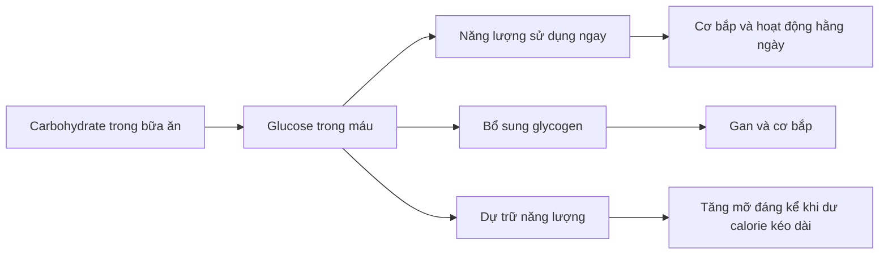
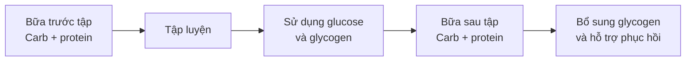
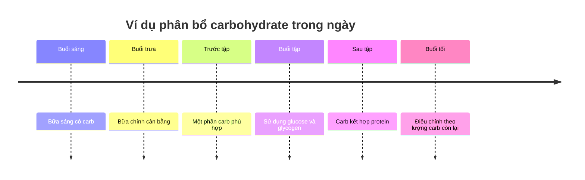

# 016 — When Should You Eat Carbs

> **Tên tiếng Việt:** Khi nào nên ăn carbohydrate?

| Thuộc tính             | Nội dung                                                                                 |
| ---------------------- | ---------------------------------------------------------------------------------------- |
| **Module**             | Module 02 — Meal Planning Basics                                                         |
| **Bài học**            | When Should You Eat Carbs                                                                |
| **Thời lượng**         | 01:43                                                                                    |
| **Chủ đề chính**       | Thời điểm và tần suất ăn carbohydrate                                                    |
| **Thông điệp cốt lõi** | Phân bổ carb linh hoạt trong ngày, nhưng nên ưu tiên một phần carb trước và sau buổi tập |


*Yến mạch và chuối là một ví dụ về bữa ăn chứa carbohydrate có thể dùng trước khi tập. Ảnh: Shisma — Wikimedia Commons, CC BY 4.0.*

---

## Mục lục

1. [Mục tiêu bài học](#1-mục-tiêu-bài-học)
2. [Nội dung chính](#2-nội-dung-chính)
3. [Áp dụng thực tế](#3-áp-dụng-thực-tế)
4. [Lưu ý và lỗi thường gặp](#4-lưu-ý-và-lỗi-thường-gặp)
5. [Checklist thực hành](#5-checklist-thực-hành)
6. [Tóm tắt](#6-tóm-tắt)

---

## 1. Mục tiêu bài học

Sau bài học này, bạn có thể:

* Hiểu rằng không cần chia carbohydrate thành sáu bữa ăn cố định.
* Biết cách phân bổ carb linh hoạt trong khoảng **2–6 bữa mỗi ngày**.
* Hiểu vì sao carb trước buổi tập có thể hỗ trợ hiệu suất luyện tập.
* Hiểu vai trò của carb sau buổi tập đối với việc bổ sung glycogen.
* Tránh quá ám ảnh về một “khung giờ vàng” chính xác đến từng phút.
* Biết cách sắp xếp bữa ăn chứa carb theo lịch tập cá nhân.

---

## 2. Nội dung chính

### 2.1. Nên ăn carbohydrate bao nhiêu lần mỗi ngày?

Tần suất ăn carbohydrate tương đối linh hoạt. Bạn có thể phân bổ lượng carb hằng ngày vào khoảng:

```text
2 bữa ───── 3 bữa ───── 4 bữa ───── 5 bữa ───── 6 bữa
 Ít bữa                  Trung bình                  Nhiều bữa
```

Hầu hết cách phân bổ đều có thể hoạt động, miễn là:

1. Bạn đạt được tổng lượng calorie và carbohydrate mục tiêu trong ngày.
2. Cách ăn phù hợp với lịch sinh hoạt.
3. Bạn cảm thấy thoải mái và duy trì được lâu dài.
4. Các bữa ăn không quá lớn đến mức gây đầy bụng hoặc ảnh hưởng việc tập luyện.

Nếu lượng carb hằng ngày tương đối cao, chia thành nhiều bữa thường giúp ăn dễ dàng hơn. Tuy nhiên, đây chủ yếu là vấn đề về **sở thích cá nhân và khả năng tiêu hóa**, không phải một quy tắc bắt buộc.

> **Không cần ăn carb đúng ba giờ một lần và cũng không cần luôn mang theo đồ ăn để tránh “mất cơ”.**

---

### 2.2. Tổng lượng carb vẫn quan trọng hơn tần suất

Giả sử hai người cùng ăn **300 g carbohydrate mỗi ngày**:

| Người A                        | Người B                              |
| ------------------------------ | ------------------------------------ |
| Chia thành 3 bữa               | Chia thành 5 bữa                     |
| Khoảng 100 g mỗi bữa           | Khoảng 60 g mỗi bữa                  |
| Phù hợp người thích ăn bữa lớn | Phù hợp người thích ăn nhiều bữa nhỏ |

Nếu tổng calorie, tổng carb và chất lượng chế độ ăn tương đương, cả hai cách đều có thể đem lại kết quả tốt.

Việc một bữa ăn chứa nhiều carbohydrate không đồng nghĩa toàn bộ lượng carb dư sẽ ngay lập tức biến thành mỡ. Sự tăng mỡ cơ thể chịu ảnh hưởng chủ yếu bởi tình trạng **dư thừa năng lượng kéo dài**.



---

### 2.3. Ưu tiên carbohydrate quanh buổi tập

Mặc dù có thể phân bổ carb linh hoạt trong ngày, bài học khuyến nghị nên bố trí một phần carb:

* **Trước buổi tập**
* **Sau buổi tập**

Đây là hai thời điểm carbohydrate có thể phục vụ trực tiếp cho hiệu suất và quá trình phục hồi.



---

### 2.4. Vì sao nên ăn carb trước buổi tập?

Carbohydrate trước buổi tập giúp cơ thể có thêm nguồn nhiên liệu sẵn có cho hoạt động thể chất.

Carb được tiêu hóa thành glucose. Glucose có thể:

* Được sử dụng trực tiếp để tạo năng lượng.
* Được dự trữ dưới dạng glycogen trong gan và cơ bắp.
* Hỗ trợ duy trì cường độ trong những buổi tập nặng hoặc kéo dài.

Khi có đủ năng lượng, bạn có thể:

* Duy trì hiệu suất tốt hơn.
* Thực hiện nhiều hiệp hoặc nhiều lần lặp hơn.
* Nâng mức tạ phù hợp với chương trình.
* Hạn chế cảm giác hụt năng lượng giữa buổi.
* Duy trì chất lượng kỹ thuật ở cuối buổi tập.

Điều này có thể gián tiếp hỗ trợ phát triển cơ bắp vì sự tăng trưởng phụ thuộc nhiều vào khả năng duy trì **khối lượng và chất lượng luyện tập**.

#### Ví dụ nguồn carb trước tập

| Nhóm thực phẩm    | Ví dụ                                    |
| ----------------- | ---------------------------------------- |
| Trái cây          | Chuối, táo, xoài, nho                    |
| Ngũ cốc           | Yến mạch, bánh mì, ngũ cốc ăn sáng       |
| Tinh bột          | Cơm, khoai tây, khoai lang, mì           |
| Sản phẩm tiện lợi | Bánh gạo, sữa chua kèm trái cây, sinh tố |
| Bữa ăn hỗn hợp    | Cơm và thịt nạc, yến mạch và sữa chua    |

> Càng ăn gần giờ tập, bữa ăn thường càng nên đơn giản và có khẩu phần vừa phải để tránh cảm giác quá no.

---

### 2.5. Vì sao nên ăn carb sau buổi tập?

Trong quá trình tập luyện, cơ bắp sử dụng một phần glycogen đã dự trữ.

Ăn carbohydrate sau tập giúp:

1. Cung cấp glucose cho cơ thể.
2. Bắt đầu bổ sung lại lượng glycogen đã sử dụng.
3. Chuẩn bị năng lượng cho buổi tập tiếp theo.
4. Hỗ trợ quá trình phục hồi tổng thể khi kết hợp với protein và nghỉ ngơi.

Carb sau tập đặc biệt hữu ích khi:

* Buổi tập có cường độ cao.
* Buổi tập kéo dài.
* Bạn tập nhiều nhóm cơ lớn.
* Bạn tập hai lần trong cùng một ngày.
* Thời gian giữa hai buổi tập tương đối ngắn.
* Bạn đang luyện tập với tổng khối lượng lớn.

Với người chỉ tập một buổi mỗi ngày và có thời gian phục hồi dài, không nhất thiết phải ăn carb ngay lập tức khi vừa đặt tạ xuống. Một bữa ăn bình thường sau tập vẫn có thể đáp ứng mục tiêu.

---

### 2.6. Vai trò của insulin sau buổi tập

Carbohydrate làm tăng glucose máu và kích thích cơ thể tiết insulin.

Insulin có tác dụng **chống dị hóa — anti-catabolic**, tức là góp phần làm giảm tốc độ phân giải protein cơ.

> **Đính chính bản chép lời:** insulin không có đặc tính “catabolic”; thuật ngữ chính xác trong ngữ cảnh này là **anti-catabolic**.

Tuy nhiên, không nên hiểu rằng insulin từ carbohydrate có thể tự mình xây dựng cơ bắp. Quá trình phục hồi và phát triển cơ vẫn phụ thuộc vào nhiều yếu tố:

```text
Tập luyện phù hợp
        +
Đủ protein
        +
Đủ năng lượng
        +
Carbohydrate phù hợp
        +
Ngủ và phục hồi
        ↓
Thích nghi và phát triển cơ bắp
```

Trong bữa sau tập, cách tiếp cận thực tế là kết hợp:

```text
Nguồn protein + Nguồn carbohydrate + Nước + Rau hoặc trái cây
```

---

### 2.7. Sơ đồ phân bổ carb quanh buổi tập



Công thức đơn giản:

```text
Tổng carb hằng ngày
        ↓
Chừa một phần cho trước tập
        ↓
Chừa một phần cho sau tập
        ↓
Phân bổ phần còn lại theo sở thích
```

---

## 3. Áp dụng thực tế

### 3.1. Trường hợp tập vào buổi sáng

| Thời điểm       | Gợi ý                                                   |
| --------------- | ------------------------------------------------------- |
| Trước tập       | Chuối, bánh mì, yến mạch hoặc sữa chua và trái cây      |
| Sau tập         | Bữa sáng lớn hơn gồm carb, protein và rau hoặc trái cây |
| Các bữa còn lại | Phân bổ phần carb còn lại theo mục tiêu trong ngày      |

Ví dụ:

```text
Chuối trước tập
      ↓
Tập luyện
      ↓
Yến mạch + sữa chua + trứng sau tập
```

---

### 3.2. Trường hợp tập vào buổi chiều

| Thời điểm | Gợi ý                                                   |
| --------- | ------------------------------------------------------- |
| Bữa trưa  | Cơm, khoai hoặc mì kết hợp protein                      |
| Trước tập | Trái cây, bánh mì hoặc bánh gạo nếu cần thêm năng lượng |
| Sau tập   | Bữa tối gồm carb và nguồn protein chất lượng            |

Ví dụ:

```text
Bữa trưa: cơm + thịt nạc + rau
                   ↓
Bữa phụ: chuối hoặc bánh mì
                   ↓
                  Tập
                   ↓
Bữa tối: khoai/cơm + cá hoặc thịt + rau
```

---

### 3.3. Trường hợp tập vào buổi tối

| Thời điểm        | Gợi ý                               |
| ---------------- | ----------------------------------- |
| Bữa sáng và trưa | Phân bổ một phần carb bình thường   |
| Bữa phụ chiều    | Carb dễ tiêu kết hợp một ít protein |
| Sau tập          | Ăn tối hoặc bữa phục hồi phù hợp    |

Ăn carb vào buổi tối không tự động khiến bạn tăng mỡ. Điều quan trọng hơn vẫn là tổng lượng calorie và carb trong cả ngày.

---

### 3.4. Ví dụ bữa ăn sau tập


*Cơm kết hợp thịt gà là ví dụ đơn giản về bữa ăn chứa carbohydrate và protein sau buổi tập. Ảnh: Renee Comet/National Cancer Institute — Public Domain.*

Một số lựa chọn khác:

| Nguồn carb                | Nguồn protein        |
| ------------------------- | -------------------- |
| Cơm                       | Thịt gà, thịt bò nạc |
| Khoai tây hoặc khoai lang | Cá, trứng            |
| Mì hoặc pasta             | Thịt nạc, đậu phụ    |
| Yến mạch                  | Sữa, sữa chua, whey  |
| Bánh mì                   | Trứng, cá ngừ        |
| Trái cây                  | Sữa chua Hy Lạp      |

---

## 4. Lưu ý và lỗi thường gặp

### Lỗi 1: Cho rằng phải ăn sáu bữa mỗi ngày

Không có yêu cầu bắt buộc phải ăn sáu bữa để duy trì cơ bắp. Bạn có thể chọn số bữa phù hợp với lịch sống và tổng lượng thức ăn cần tiêu thụ.

---

### Lỗi 2: Quá ám ảnh về thời gian chính xác

Bạn không cần canh đồng hồ để ăn carb đúng một số phút cố định trước hoặc sau tập.

Mục tiêu của bài học này là:

```text
Có carb trong khoảng thời gian quanh buổi tập
                    ≠
Phải ăn đúng một phút cụ thể
```

Thời gian và lượng carb chi tiết sẽ phụ thuộc vào:

* Loại hình tập luyện.
* Cường độ và thời lượng buổi tập.
* Khẩu phần bữa ăn.
* Khả năng tiêu hóa.
* Thời gian từ bữa ăn đến lúc tập.
* Mục tiêu tăng cơ, giảm mỡ hoặc cải thiện hiệu suất.

---

### Lỗi 3: Chỉ tập trung vào carb sau tập

Carb sau tập hỗ trợ phục hồi glycogen, nhưng carb trước tập cũng quan trọng vì nó có thể giúp bạn thực hiện buổi tập chất lượng hơn.

```text
Carb trước tập → hỗ trợ hiệu suất
Carb sau tập   → hỗ trợ phục hồi
```

---

### Lỗi 4: Cho rằng carb tự động biến thành mỡ

Một bữa ăn nhiều carb không tự động gây tăng mỡ. Rủi ro tăng mỡ cao hơn khi tổng năng lượng nạp vào vượt quá nhu cầu cơ thể trong thời gian dài.

---

### Lỗi 5: Chỉ ăn carb mà bỏ qua protein

Carbohydrate hỗ trợ nhiên liệu và glycogen, nhưng protein vẫn cần thiết cho việc sửa chữa và duy trì mô cơ.

Một bữa ăn quanh buổi tập thường nên có:

```text
Carbohydrate + Protein
```

---

### Lỗi 6: Sao chép thực đơn của người khác

Nhu cầu của một vận động viên sức bền, một người tập thể hình và một người chỉ tập nhẹ ba buổi mỗi tuần có thể rất khác nhau.

Hãy điều chỉnh theo:

* Khối lượng cơ thể.
* Mục tiêu dinh dưỡng.
* Tổng lượng calorie.
* Khối lượng tập luyện.
* Mức độ dung nạp carb.
* Lịch học tập và làm việc.

---

## 5. Checklist thực hành

### Phân bổ trong ngày

* [ ] Tôi đã xác định tổng lượng carb mục tiêu trong ngày.
* [ ] Tôi chọn số bữa phù hợp thay vì ép bản thân phải ăn sáu bữa.
* [ ] Tôi tránh để một bữa quá lớn gây khó chịu.
* [ ] Tôi phân bổ phần lớn carb vào những bữa mình dễ duy trì nhất.

### Trước buổi tập

* [ ] Tôi có một nguồn carbohydrate trong bữa ăn trước tập.
* [ ] Khẩu phần không khiến tôi quá no khi bắt đầu tập.
* [ ] Thực phẩm được chọn phù hợp với khả năng tiêu hóa.
* [ ] Tôi theo dõi xem mức năng lượng trong buổi tập có được cải thiện không.

### Sau buổi tập

* [ ] Tôi ăn một bữa có carbohydrate để hỗ trợ bổ sung glycogen.
* [ ] Bữa ăn có thêm một nguồn protein phù hợp.
* [ ] Tôi không hoảng sợ nếu không thể ăn ngay lập tức.
* [ ] Tôi ưu tiên tổng dinh dưỡng của cả ngày thay vì chỉ một bữa.

### Đánh giá cá nhân

* [ ] Tôi không bị đầy bụng hoặc khó chịu khi tập.
* [ ] Tôi duy trì được hiệu suất đến cuối buổi.
* [ ] Tôi phục hồi tốt trước buổi tập tiếp theo.
* [ ] Cách phân bổ carb phù hợp với lịch sinh hoạt của tôi.

---

## 6. Tóm tắt

> **Bạn có thể ăn carbohydrate trong khoảng 2–6 bữa mỗi ngày. Tần suất chính xác không quá quan trọng; điều quan trọng hơn là tổng lượng carb và cách phân bổ phù hợp với lịch tập.**

Các ý chính:

1. Không cần ăn carb liên tục suốt ngày.
2. Có thể chia carb thành ít hoặc nhiều bữa theo sở thích.
3. Carb trước tập giúp cung cấp nhiên liệu cho buổi tập.
4. Carb sau tập giúp bổ sung lượng glycogen đã sử dụng.
5. Kết hợp carb với protein là cách thực tế cho bữa ăn quanh buổi tập.
6. Insulin có tác dụng **chống dị hóa**, không phải gây dị hóa.
7. Không cần quá ám ảnh về một “khung giờ vàng” chính xác.
8. Tổng calorie, tổng carb và khả năng duy trì chế độ ăn vẫn là nền tảng.

### Công thức ghi nhớ

```text
Đủ carb mỗi ngày
       +
Một phần trước tập
       +
Một phần sau tập
       +
Phân bổ phần còn lại linh hoạt
       =
Năng lượng tốt hơn và phục hồi thuận lợi hơn
```

---

## Nguồn tham khảo và ảnh minh họa

* [International Society of Sports Nutrition — Position Stand: Nutrient Timing](https://pmc.ncbi.nlm.nih.gov/articles/PMC5596471/)
* [American College of Sports Medicine — Nutrition and Athletic Performance](https://pubmed.ncbi.nlm.nih.gov/19225360/)
* [Ảnh Banana oatmeal — Wikimedia Commons](https://commons.wikimedia.org/wiki/File:Banana_oatmeal.jpg)
* [Ảnh Chicken and rice — Wikimedia Commons](https://commons.wikimedia.org/wiki/File:Chicken_and_rice.jpg)
