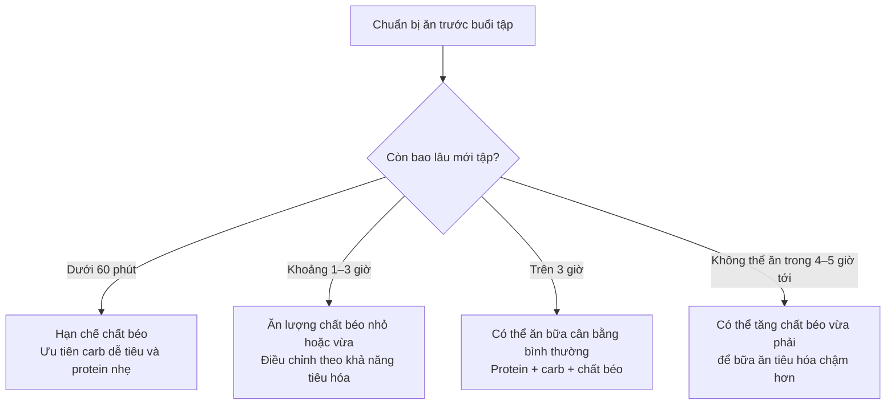

# 017 — When Should You Eat Fat

| Thuộc tính       | Nội dung                         |
| ---------------- | -------------------------------- |
| **Module**       | Module 02 — Meal Planning Basics |
| **Bài học**      | When Should You Eat Fat          |
| **Thời lượng**   | 01:11                            |
| **Chủ đề chính** | Khi nào nên ăn chất béo?         |

> **Ý chính:** Thời điểm ăn chất béo không cần được tính toán quá phức tạp. Điều quan trọng nhất là **hạn chế bữa ăn quá nhiều chất béo ngay sát giờ tập** và bảo đảm đạt tổng lượng chất béo mục tiêu trong ngày.

## Mục lục

1. [Mục tiêu bài học](#1-mục-tiêu-bài-học)
2. [Nội dung chính](#2-nội-dung-chính)
3. [Áp dụng thực tế](#3-áp-dụng-thực-tế)
4. [Lưu ý và lỗi thường gặp](#4-lưu-ý-và-lỗi-thường-gặp)
5. [Checklist thực hành](#5-checklist-thực-hành)
6. [Tóm tắt](#6-tóm-tắt)

---

## 1. Mục tiêu bài học

Sau bài học này, bạn có thể:

* Hiểu vì sao không nên ăn một bữa **quá nhiều chất béo ngay trước khi tập**.
* Biết cách phân bố chất béo theo khoảng thời gian còn lại trước buổi tập.
* Biết cách tận dụng chất béo để giúp bữa ăn tiêu hóa chậm hơn khi phải cách xa bữa tiếp theo.
* Nhận ra rằng **tổng lượng chất béo hằng ngày quan trọng hơn thời điểm ăn chính xác**.

---

## 2. Nội dung chính

### 2.1. Thời điểm ăn chất béo đơn giản hơn protein và carbohydrate

So với protein và carbohydrate, việc lựa chọn thời điểm ăn chất béo ít ảnh hưởng hơn đến kết quả tăng cơ hoặc giảm mỡ.

Bạn không cần:

* Chia chất béo thành những khẩu phần bằng nhau.
* Ăn chất béo vào một giờ cố định.
* Cố gắng đưa chất béo vào mọi bữa ăn.
* Lo lắng khi một bữa có nhiều chất béo hơn các bữa còn lại.

Ưu tiên quan trọng nhất vẫn là:

```text
Đạt tổng lượng chất béo mục tiêu trong ngày
                    ↓
Chọn nguồn chất béo phù hợp
                    ↓
Điều chỉnh thời điểm theo tiêu hóa và lịch tập
```

---

### 2.2. Hạn chế bữa ăn nhiều chất béo ngay trước khi tập

Chất béo làm chậm tốc độ tiêu hóa và quá trình thức ăn rời khỏi dạ dày. Vì vậy, một bữa ăn quá nhiều chất béo ngay sát giờ tập có thể khiến bạn:

* Cảm thấy đầy bụng hoặc nặng bụng.
* Khó chịu khi thực hiện các động tác mạnh.
* Cảm thấy uể oải hơn trong buổi tập.
* Không sử dụng carbohydrate trong bữa ăn nhanh như mong muốn.
* Có nguy cơ ợ nóng hoặc buồn nôn nếu hệ tiêu hóa nhạy cảm.

Điều này **không có nghĩa là phải loại bỏ hoàn toàn chất béo trước khi tập**. Mục tiêu chỉ là tránh một bữa ăn đặc biệt nhiều chất béo khi thời gian tiêu hóa còn quá ngắn.

#### Sơ đồ lựa chọn theo thời gian



---

### 2.3. Ăn chất béo trước tập bao lâu là phù hợp?

| Khoảng cách tới buổi tập | Cách xử lý chất béo                      | Gợi ý                                         |
| ------------------------ | ---------------------------------------- | --------------------------------------------- |
| **Dưới 30–60 phút**      | Giữ lượng chất béo thấp                  | Chuối và whey; bánh mì và sữa chua ít béo     |
| **Khoảng 1–2 giờ**       | Có thể ăn một lượng nhỏ hoặc vừa         | Cơm, thịt nạc và một ít dầu; yến mạch với sữa |
| **Khoảng 2–3 giờ**       | Một bữa cân bằng thường không gây vấn đề | Cơm, cá, rau và một ít quả bơ                 |
| **Trên 3 giờ**           | Không cần đặc biệt hạn chế               | Ăn theo kế hoạch dinh dưỡng bình thường       |

> **Quy tắc thực tế:** Khoảng cách tới buổi tập càng ngắn, bữa ăn càng nên nhỏ, ít chất béo và dễ tiêu hóa.

Khả năng tiêu hóa của mỗi người khác nhau. Có người vẫn tập tốt sau một bữa có chất béo trước đó một giờ, trong khi người khác cần hai đến ba giờ để cảm thấy thoải mái.

---

### 2.4. Chất béo có thể giúp kéo dài thời gian tiêu hóa

Tác dụng làm chậm tiêu hóa không phải lúc nào cũng là bất lợi.

Khi bạn biết rằng mình sẽ không thể ăn thêm trong khoảng bốn đến năm giờ, có thể kết hợp:

* **Protein** để cung cấp acid amin.
* **Carbohydrate** để cung cấp glucose và năng lượng.
* **Chất béo** để làm bữa ăn no lâu và tiêu hóa chậm hơn.
* **Chất xơ** từ rau, ngũ cốc hoặc trái cây để hỗ trợ cảm giác no.

```text
Protein + Carbohydrate + Chất béo + Chất xơ
                         ↓
              Bữa ăn tiêu hóa chậm hơn
                         ↓
                 No lâu và ổn định hơn
                         ↓
       Phù hợp khi khoảng cách giữa hai bữa dài
```

Ví dụ về một bữa ăn trước khoảng thời gian dài không thể ăn:

* Cơm, cá hồi, rau và quả bơ.
* Yến mạch, sữa chua, trái cây và các loại hạt.
* Trứng, bánh mì nguyên cám và quả bơ.
* Cơm, thịt gà, rau và một lượng vừa phải dầu ô liu.


*Bữa ăn cân bằng với cá hồi, cơm, cà chua và quả bơ. Ảnh: [nrd trên Unsplash](https://unsplash.com/photos/a-white-bowl-filled-with-chicken-rice-tomatoes-and-avocado-k7luFw-7rGk).* ([Unsplash][1])

---

### 2.5. Những nguồn chất béo phù hợp

Các nguồn chất béo có thể đưa vào kế hoạch ăn uống gồm:

| Nhóm thực phẩm             | Ví dụ                                       |
| -------------------------- | ------------------------------------------- |
| **Các loại hạt**           | Hạnh nhân, óc chó, hạt điều, đậu phộng      |
| **Các loại hạt nhỏ**       | Hạt chia, hạt lanh, hạt bí, hạt hướng dương |
| **Dầu thực vật**           | Dầu ô liu, dầu cải, dầu quả bơ              |
| **Trái cây giàu chất béo** | Quả bơ, ô liu                               |
| **Cá béo**                 | Cá hồi, cá mòi, cá thu                      |
| **Thực phẩm động vật**     | Trứng, sữa, sữa chua, phô mai               |
| **Bơ từ hạt**              | Bơ đậu phộng, bơ hạnh nhân                  |


*Quả bơ là một nguồn chất béo thường được sử dụng trong các bữa ăn cân bằng. Ảnh: [Tangerine Newt trên Unsplash](https://unsplash.com/photos/a-bowl-of-guacamole-a-slice-of-avocado-and-AKH4OVEmILc).* ([Unsplash][2])

---

## 3. Áp dụng thực tế

### Trường hợp 1: Tập sau 30 phút

Nên chọn một bữa phụ nhỏ, ít chất béo và dễ tiêu hóa.

**Ví dụ:**

* Một quả chuối và whey protein.
* Bánh mì trắng với thịt nạc.
* Sữa chua ít béo và một ít trái cây.
* Bánh gạo và protein shake.

**Nên hạn chế:**

* Một lượng lớn bơ đậu phộng.
* Nhiều hạt hoặc phô mai.
* Đồ chiên rán.
* Pizza, hamburger hoặc các món nhiều sốt béo.

---

### Trường hợp 2: Tập sau khoảng hai giờ

Có thể ăn một bữa tương đối đầy đủ nhưng không nên quá lớn.

**Ví dụ:**

```text
Cơm hoặc khoai
      +
Thịt gà, cá hoặc trứng
      +
Rau củ
      +
Một lượng nhỏ dầu hoặc quả bơ
```

Không cần loại bỏ hoàn toàn chất béo nếu bữa ăn không làm bạn đầy bụng.

---

### Trường hợp 3: Không thể ăn trong năm giờ tiếp theo

Hãy chuẩn bị một bữa cân bằng, có lượng chất béo vừa phải để duy trì cảm giác no.

**Ví dụ:**

| Thành phần   | Thực phẩm                            |
| ------------ | ------------------------------------ |
| Protein      | Cá hồi, trứng, thịt gà hoặc sữa chua |
| Carbohydrate | Cơm, khoai, yến mạch hoặc bánh mì    |
| Chất béo     | Quả bơ, hạt hoặc dầu ô liu           |
| Chất xơ      | Rau xanh hoặc trái cây               |

---

### Trường hợp 4: Tập vào sáng sớm

Nếu không có đủ thời gian ăn và tiêu hóa một bữa đầy đủ:

1. Ăn một bữa phụ nhỏ, ít chất béo trước khi tập.
2. Uống nước đầy đủ.
3. Ăn bữa chính có protein, carbohydrate và chất béo sau buổi tập.

Ví dụ trước tập:

* Chuối và whey.
* Bánh mì cùng sữa chua ít béo.
* Một lượng nhỏ ngũ cốc và sữa.

Ví dụ sau tập:

* Cơm, trứng, rau và quả bơ.
* Yến mạch, sữa chua, trái cây và hạt.
* Cá hồi, khoai và rau xanh.

---

## 4. Lưu ý và lỗi thường gặp

### Lỗi 1: Loại bỏ hoàn toàn chất béo trước khi tập

Một lượng chất béo nhỏ thường không gây vấn đề. Điều cần tránh là **bữa ăn quá nhiều chất béo ngay sát giờ tập**, không phải mọi dấu vết của chất béo.

---

### Lỗi 2: Ăn đồ chiên rán trước buổi tập

Đồ chiên thường kết hợp nhiều chất béo, khẩu phần lớn và cách chế biến khó tiêu. Đây là lựa chọn dễ gây đầy bụng hơn so với một lượng nhỏ quả bơ hoặc dầu ô liu.

---

### Lỗi 3: Cho rằng chất béo trước tập luôn làm giảm hiệu suất

Mức độ ảnh hưởng phụ thuộc vào:

* Lượng chất béo.
* Kích thước bữa ăn.
* Thời gian còn lại trước buổi tập.
* Loại hình vận động.
* Khả năng tiêu hóa của từng người.

---

### Lỗi 4: Quá tập trung vào thời điểm mà quên tổng lượng trong ngày

Một lịch ăn được “tối ưu” nhưng không đạt đủ chất béo mục tiêu vẫn kém hiệu quả hơn một lịch ăn đơn giản nhưng duy trì đều đặn.

```text
Mức độ ưu tiên:

1. Tổng calorie phù hợp
2. Đủ protein
3. Đủ lượng chất béo tối thiểu
4. Điều chỉnh carbohydrate
5. Chất lượng thực phẩm
6. Thời điểm ăn chất béo
```

---

### Lỗi 5: Tăng quá nhiều chất béo để “no lâu”

Chất béo cung cấp khoảng **9 kcal mỗi gram**, vì vậy một lượng nhỏ cũng có thể làm tổng calorie tăng nhanh.

Ví dụ:

* Một thìa dầu có thể bổ sung đáng kể calorie.
* Một nắm hạt dễ trở thành hai hoặc ba nắm.
* Bơ đậu phộng thường được ước lượng thấp hơn lượng thực tế.

Do đó, “ăn chất béo để no lâu” không đồng nghĩa với ăn không giới hạn.

---

## 5. Checklist thực hành

* [ ] Tôi đã xác định tổng lượng chất béo mục tiêu trong ngày.
* [ ] Tôi không ăn một bữa quá nhiều chất béo ngay sát giờ tập.
* [ ] Khi chỉ còn dưới một giờ, tôi ưu tiên protein và carbohydrate dễ tiêu.
* [ ] Khi còn từ hai đến ba giờ, tôi có thể ăn một bữa cân bằng bình thường.
* [ ] Tôi sử dụng chất béo vừa phải khi cần kéo dài khoảng cách giữa hai bữa.
* [ ] Tôi theo dõi cảm giác đầy bụng, buồn nôn hoặc uể oải trong lúc tập.
* [ ] Tôi điều chỉnh khẩu phần theo khả năng tiêu hóa cá nhân.
* [ ] Tôi không quá ám ảnh với thời điểm ăn chất béo.
* [ ] Tôi kiểm soát các nguồn chất béo giàu calorie như dầu, hạt và bơ hạt.

---

## 6. Tóm tắt

* Thời điểm ăn chất béo **ít quan trọng hơn tổng lượng chất béo hằng ngày**.
* Không cần tránh hoàn toàn chất béo trước khi tập.
* Nên hạn chế **bữa ăn nhiều chất béo trong khoảng thời gian quá sát buổi tập**, đặc biệt khi còn dưới một giờ.
* Chất béo làm chậm tiêu hóa nên có thể hữu ích khi phải cách xa bữa ăn tiếp theo.
* Khoảng cách tới buổi tập càng ngắn, bữa ăn càng nên nhỏ và dễ tiêu.
* Khả năng tiêu hóa cá nhân là tiêu chí quan trọng để điều chỉnh khẩu phần.

> **Ghi nhớ:** Đạt đủ chất béo trong ngày, tránh ăn quá nhiều ngay sát giờ tập và đừng làm vấn đề trở nên phức tạp hơn mức cần thiết.

[1]: https://unsplash.com/photos/a-white-bowl-filled-with-chicken-rice-tomatoes-and-avocado-k7luFw-7rGk "A white bowl filled with chicken, rice, tomatoes and avocado photo – Free Food Image on Unsplash"
[2]: https://unsplash.com/photos/a-bowl-of-guacamole-a-slice-of-avocado-and-AKH4OVEmILc "A bowl of guacamole, a slice of avocado, and photo – Free Food Image on Unsplash"

---

# Bài luyện tập

## Mục tiêu


## Đề bài


## Yêu cầu hoàn thành

- [ ] 
- [ ] 
- [ ] 

## Kết quả / lời giải


## Ghi chú
