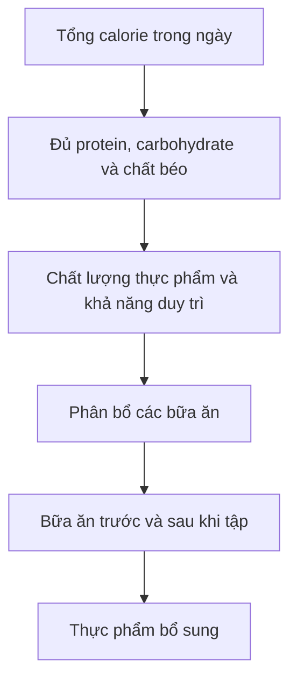
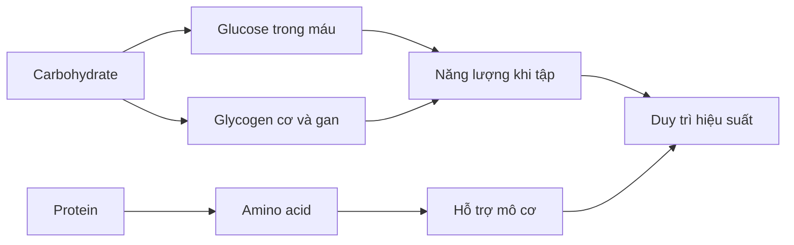
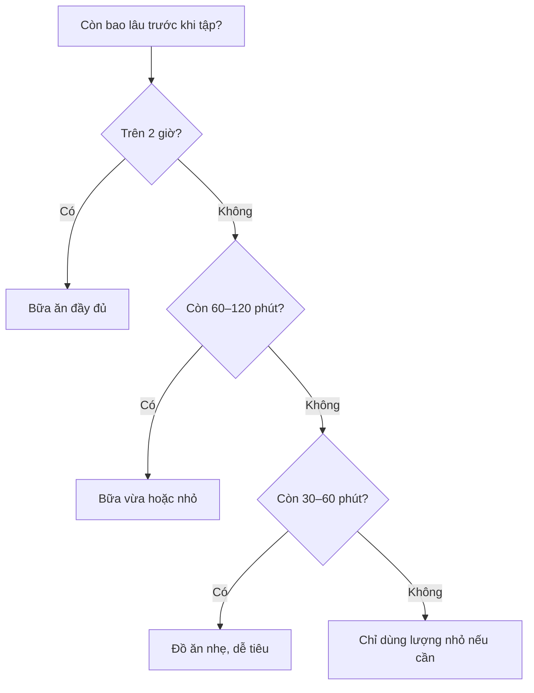

# 018 — Bữa ăn trước khi tập luyện

| Thuộc tính       | Nội dung                                                                    |
| ---------------- | --------------------------------------------------------------------------- |
| **Module**       | Module 02 — Meal Planning Basics                                            |
| **Bài học**      | Pre-Workout Meal                                                            |
| **Thời lượng**   | 03:28                                                                       |
| **Chủ đề chính** | Cách xây dựng bữa ăn trước khi tập để có đủ năng lượng và duy trì hiệu suất |


> **Nguyên tắc cốt lõi:** Sau khi tổng calorie và các chất dinh dưỡng đa lượng trong ngày đã được thiết lập đúng, bữa ăn trước khi tập nên tập trung vào **carbohydrate, protein, khả năng tiêu hóa và thời gian ăn**.

---

## Mục lục

1. [Mục tiêu bài học](#1-mục-tiêu-bài-học)
2. [Nội dung chính](#2-nội-dung-chính)
3. [Áp dụng thực tế](#3-áp-dụng-thực-tế)
4. [Lưu ý và lỗi thường gặp](#4-lưu-ý-và-lỗi-thường-gặp)
5. [Checklist thực hành](#5-checklist-thực-hành)
6. [Tóm tắt](#6-tóm-tắt)

---

## 1. Mục tiêu bài học

Sau bài học này, bạn có thể:

* Hiểu vai trò thực sự của bữa ăn trước khi tập.
* Biết vì sao nên kết hợp **carbohydrate và protein** trước buổi tập.
* Ước tính lượng carbohydrate và protein theo cân nặng.
* Lựa chọn loại bữa ăn dựa trên khoảng thời gian còn lại trước buổi tập.
* Tránh các bữa ăn quá lớn, quá nhiều chất béo hoặc chất xơ sát giờ tập.
* Xây dựng bữa ăn đơn giản mà không phụ thuộc vào thực phẩm bổ sung đắt tiền.

---

## 2. Nội dung chính

### 2.1. Thứ tự ưu tiên trong dinh dưỡng tập luyện

Bữa ăn trước tập rất hữu ích, nhưng không thể bù đắp cho một chế độ ăn thiếu calorie, protein hoặc carbohydrate trong cả ngày.



### Mức độ ưu tiên

| Mức | Yếu tố               | Ý nghĩa                                              |
| --: | -------------------- | ---------------------------------------------------- |
|   1 | Tổng calorie         | Quyết định xu hướng tăng, giảm hoặc duy trì cân nặng |
|   2 | Tổng lượng macro     | Hỗ trợ cơ bắp, sức khỏe và hiệu suất                 |
|   3 | Chất lượng thực phẩm | Cung cấp vitamin, khoáng chất và chất xơ             |
|   4 | Thời điểm ăn         | Giúp tối ưu năng lượng và sự thoải mái khi tập       |
|   5 | Thực phẩm bổ sung    | Chỉ hỗ trợ khi nền tảng đã được thực hiện tốt        |

ACSM cũng nhấn mạnh rằng một bữa ăn trước sự kiện không thể bù lại cho chế độ dinh dưỡng hằng ngày kém; người tập vẫn phải đáp ứng đủ năng lượng và dưỡng chất tổng thể.

---

### 2.2. Vai trò của bữa ăn trước khi tập

Mục tiêu chính của bữa ăn trước tập là:

1. **Cung cấp năng lượng cho buổi tập.**
2. **Hạn chế cảm giác đói và mệt sớm.**
3. **Hỗ trợ duy trì glycogen cơ.**
4. **Cung cấp amino acid cho cơ bắp.**
5. **Giảm nguy cơ suy giảm hiệu suất do thiếu nhiên liệu.**
6. **Tránh đầy bụng, buồn nôn hoặc khó chịu khi vận động.**

Carbohydrate được lưu trữ dưới dạng glycogen trong cơ và gan. Khi vận động ở cường độ tương đối cao, glycogen là một trong những nguồn năng lượng quan trọng nhất. Vì vậy, bữa ăn trước tập thường ưu tiên carbohydrate dễ tiêu hóa.



---

### 2.3. Quy tắc quan trọng nhất

> **Bữa ăn trước tập nên có một lượng phù hợp carbohydrate và protein.**

#### Carbohydrate

Carbohydrate giúp:

* Cung cấp nhiên liệu cho buổi tập.
* Hỗ trợ duy trì cường độ vận động.
* Hạn chế cảm giác hụt năng lượng.
* Bổ sung hoặc duy trì glycogen trước buổi tập.

Nguồn carbohydrate phù hợp:

* Cơm.
* Yến mạch.
* Khoai.
* Bánh mì.
* Mì hoặc pasta.
* Chuối và các loại trái cây.
* Ngũ cốc.
* Bánh gạo.
* Mật ong hoặc mứt nếu cần năng lượng tiêu hóa nhanh.

#### Protein

Protein giúp:

* Cung cấp amino acid cho cơ bắp.
* Hỗ trợ cân bằng protein cơ quanh buổi tập.
* Chuẩn bị nguyên liệu cho quá trình phục hồi.
* Giúp hoàn thành mục tiêu protein hằng ngày.

Nguồn protein phù hợp:

* Ức gà hoặc thịt nạc.
* Cá.
* Trứng.
* Sữa chua Hy Lạp.
* Sữa ít béo.
* Whey protein.
* Đậu phụ và các sản phẩm từ đậu nành.

Các hướng dẫn của ISSN cho rằng carbohydrate kết hợp với protein hoặc protein riêng lẻ quanh buổi tập có thể hỗ trợ sức mạnh, thành phần cơ thể và quá trình thích nghi với tập luyện. Tuy nhiên, tổng lượng protein trong ngày vẫn là ưu tiên quan trọng hơn việc căn chính xác từng phút.

---

### 2.4. Lượng carbohydrate và protein tham khảo

Bài học đưa ra mức tham khảo:

```text
Carbohydrate trước tập: 0,22–0,25 g trên mỗi pound cân nặng
Protein trước tập:      0,22–0,25 g trên mỗi pound cân nặng
```

Quy đổi sang kilogram:

```text
Carbohydrate: khoảng 0,49–0,55 g/kg
Protein:      khoảng 0,49–0,55 g/kg
```

### Công thức nhanh

```text
Lượng carbohydrate hoặc protein
= Cân nặng × 0,49 đến 0,55
```

### Ví dụ tham khảo

| Cân nặng | Carbohydrate | Protein |
| -------: | -----------: | ------: |
|    50 kg |      25–28 g | 25–28 g |
|    60 kg |      29–33 g | 29–33 g |
|    70 kg |      34–39 g | 34–39 g |
|    80 kg |      39–44 g | 39–44 g |
|    90 kg |      44–50 g | 44–50 g |

> Đây là **mức tham khảo của bài học**, không phải con số bắt buộc. Khẩu phần thực tế còn phụ thuộc vào tổng năng lượng trong ngày, độ dài buổi tập, cường độ vận động, mục tiêu cơ thể và khả năng tiêu hóa của từng người.

#### Ví dụ với người nặng 70 kg

```text
Carbohydrate:
70 × 0,49–0,55 ≈ 34–39 g

Protein:
70 × 0,49–0,55 ≈ 34–39 g
```

Một bữa ăn có thể gồm:

* Khoảng 100–120 g cơm chín hoặc một khẩu phần carbohydrate tương đương.
* Khoảng 120–150 g thịt gà, cá hoặc một nguồn protein tương đương.
* Một lượng rau vừa phải.
* Nước uống.

Không cần ép từng chất phải chính xác tuyệt đối đến từng gram.

---

### 2.5. Chọn bữa ăn theo thời gian trước buổi tập

Khoảng thời gian càng ngắn, khẩu phần càng nên nhỏ và dễ tiêu hóa.



| Thời gian trước tập | Kiểu bữa ăn              | Đặc điểm                                                   |
| ------------------- | ------------------------ | ---------------------------------------------------------- |
| **2–3 giờ**         | Bữa chính                | Đủ carbohydrate, protein nạc; có thể có ít chất béo và rau |
| **60–120 phút**     | Bữa vừa hoặc nhỏ         | Giảm khẩu phần, chất béo và chất xơ                        |
| **30–60 phút**      | Bữa phụ                  | Carbohydrate dễ tiêu hóa kết hợp một ít protein            |
| **Dưới 30 phút**    | Năng lượng nhanh nếu cần | Khẩu phần rất nhỏ, chủ yếu là carbohydrate dễ tiêu         |

ACSM cho biết một bữa nhỏ khoảng 400–500 kcal thường có thể ăn trước hoạt động khoảng 2–3 giờ. Bữa càng lớn hoặc càng nhiều chất béo, protein và chất xơ thì càng cần nhiều thời gian để tiêu hóa. Đồ uống chứa carbohydrate có thể hữu ích khi không có thời gian ăn hoặc người tập có hệ tiêu hóa nhạy cảm.

---

### 2.6. Ăn trước tập khoảng 2–3 giờ

Đây là thời điểm phù hợp cho một bữa ăn tương đối đầy đủ.

#### Cấu trúc bữa ăn

```text
Carbohydrate chính
+ Protein nạc
+ Rau vừa phải
+ Một ít chất béo nếu tiêu hóa tốt
+ Nước
```

#### Ví dụ

* Cơm với ức gà và rau.
* Cơm với cá và rau hấp.
* Pasta với thịt nạc và sốt nhẹ.
* Bánh mì kẹp thịt gà.
* Khoai lang với cá hoặc thịt nạc.
* Yến mạch với sữa chua hoặc whey protein.
* Trứng, bánh mì và trái cây.


> Nếu chỉ còn khoảng một giờ, hãy giảm khẩu phần cơm, rau, chất béo và các thực phẩm khó tiêu.

---

### 2.7. Ăn trước tập khoảng 60–90 phút

Bữa ăn nên nhỏ hơn và tương đối dễ tiêu hóa.

#### Ví dụ phù hợp

* Một bát yến mạch nhỏ trộn whey protein.
* Bánh mì với thịt gà hoặc cá ngừ ít sốt.
* Sữa chua Hy Lạp với chuối.
* Ngũ cốc ít chất xơ với sữa ít béo.
* Cơm trắng với một lượng nhỏ thịt nạc.
* Chuối kết hợp sữa hoặc whey protein.


#### Cần hạn chế

* Khẩu phần quá lớn.
* Thực phẩm chiên rán.
* Sốt kem hoặc nhiều phô mai.
* Quá nhiều rau sống.
* Đậu và các thực phẩm dễ gây đầy hơi.
* Quá nhiều chất béo.

---

### 2.8. Ăn trước tập khoảng 30 phút

Khi không có thời gian cho một bữa ăn bình thường, hãy ưu tiên thực phẩm:

* Có khẩu phần nhỏ.
* Dễ nhai hoặc dễ uống.
* Ít chất béo.
* Ít chất xơ.
* Dễ tiêu hóa.
* Chủ yếu cung cấp carbohydrate, có thể đi kèm protein dạng lỏng.

#### Ví dụ

* Một quả chuối với whey protein.
* Protein shake với trái cây.
* Một ít sữa chua uống và chuối.
* Bánh gạo với mật ong hoặc mứt.
* Một thanh protein đã quen sử dụng.
* Một ít trái cây sấy.
* Nước trái cây pha loãng nếu dạ dày dung nạp tốt.

```text
Chuối
  ↓
Carbohydrate dễ sử dụng

Whey protein
  ↓
Protein dạng lỏng, thuận tiện

Kết hợp
  ↓
Bữa phụ nhanh trước buổi tập
```

> Protein shake không bắt buộc. Đây chỉ là lựa chọn thuận tiện khi không đủ thời gian chuẩn bị thức ăn thông thường.

---

### 2.9. Chất béo và chất xơ trước khi tập

Chất béo và chất xơ đều cần thiết trong chế độ ăn hằng ngày, nhưng lượng lớn sát giờ tập có thể làm chậm quá trình tiêu hóa hoặc gây khó chịu.

| Thành phần   | Khi ăn xa buổi tập                  | Khi ăn sát buổi tập                       |
| ------------ | ----------------------------------- | ----------------------------------------- |
| Chất béo     | Có thể dùng lượng vừa phải          | Nên giảm                                  |
| Chất xơ      | Tốt cho sức khỏe và tiêu hóa        | Nên giảm nếu dễ đầy bụng                  |
| Rau sống     | Có thể ăn bình thường               | Chỉ nên dùng lượng nhỏ                    |
| Các loại hạt | Phù hợp trong chế độ ăn chung       | Không phải lựa chọn tối ưu ngay trước tập |
| Bơ quả       | Có thể dùng nếu còn nhiều thời gian | Dễ làm bữa ăn tiêu hóa chậm hơn           |

Ví dụ, bánh mì bơ với trứng có thể là một bữa ăn tốt, nhưng thường phù hợp hơn khi còn khoảng **1,5–3 giờ** trước buổi tập thay vì ăn sát giờ.

---

## 3. Áp dụng thực tế

### 3.1. Quy trình xây dựng bữa ăn trước tập

#### Bước 1: Xác định thời gian tập

Ví dụ:

```text
Thời gian tập: 18:00
```

#### Bước 2: Xác định bữa ăn gần nhất

```text
Ăn trưa lúc 12:00
→ Khoảng cách tới buổi tập quá dài
→ Cần bữa phụ hoặc bữa ăn trước tập
```

#### Bước 3: Chọn kích thước bữa ăn

```text
Ăn lúc 15:00–16:00
→ Có thể dùng bữa tương đối đầy đủ

Ăn lúc 17:00
→ Dùng bữa nhỏ, dễ tiêu

Ăn lúc 17:30
→ Dùng chuối, bánh gạo hoặc đồ uống có carbohydrate
```

#### Bước 4: Theo dõi phản ứng của cơ thể

Ghi lại:

* Mức năng lượng trong buổi tập.
* Có bị đói hay không.
* Có cảm giác nặng bụng hay không.
* Có buồn nôn, đầy hơi hoặc trào ngược hay không.
* Hiệu suất ở các bài tập chính.
* Khẩu phần và thời gian ăn.

#### Bước 5: Điều chỉnh

| Vấn đề            | Điều chỉnh                                      |
| ----------------- | ----------------------------------------------- |
| Đói giữa buổi tập | Tăng carbohydrate hoặc ăn sớm hơn               |
| Nặng bụng         | Giảm khẩu phần hoặc tăng thời gian tiêu hóa     |
| Đầy hơi           | Giảm chất xơ, rau sống và thực phẩm gây hơi     |
| Buồn ngủ          | Giảm chất béo, khẩu phần quá lớn hoặc sốt nặng  |
| Thiếu sức         | Kiểm tra tổng calorie, carbohydrate và giấc ngủ |
| Khát, đau đầu     | Chú ý bổ sung nước trong ngày                   |

---

### 3.2. Gợi ý theo từng khung giờ

#### Tập vào sáng sớm

Nếu không thể dậy sớm để ăn bữa đầy đủ:

* Ăn một bữa tối có đủ carbohydrate vào hôm trước.
* Trước tập dùng chuối, bánh mì với mật ong hoặc một ít nước trái cây.
* Có thể thêm whey protein nếu cần hoàn thành mục tiêu protein.
* Ăn bữa sáng đầy đủ sau buổi tập.

#### Tập vào buổi trưa

* Ăn sáng đầy đủ trước đó khoảng 3–4 giờ.
* Nếu cần, dùng một bữa phụ nhỏ trước tập 30–60 phút.
* Ví dụ: sữa chua với chuối hoặc bánh mì với mứt.

#### Tập vào buổi chiều

* Ăn trưa đầy đủ.
* Dùng bữa phụ vào giữa buổi chiều nếu thời gian giữa bữa trưa và buổi tập quá dài.
* Ví dụ: yến mạch với whey, bánh mì thịt gà hoặc chuối với sữa chua.

#### Tập vào buổi tối

* Ăn bữa chính khoảng 2–3 giờ trước tập.
* Giảm chất béo và khẩu phần nếu ăn muộn hơn.
* Tránh ăn một bữa quá lớn ngay trước khi bắt đầu tập.

---

### 3.3. Thực đơn mẫu

#### Phương án 1 — Còn 2–3 giờ

```text
Cơm
+ Ức gà
+ Rau nấu chín
+ Nước
```

#### Phương án 2 — Còn 60–90 phút

```text
Yến mạch
+ Whey protein
+ Một ít chuối
```

#### Phương án 3 — Còn 30–45 phút

```text
Một quả chuối
+ Protein shake
```

#### Phương án 4 — Không sử dụng whey

```text
Sữa chua Hy Lạp
+ Chuối hoặc mật ong
```

#### Phương án 5 — Ăn chay

```text
Cơm hoặc bánh mì
+ Đậu phụ
+ Một ít rau nấu chín
```

#### Phương án 6 — Mang theo bên người

```text
Bánh mì kẹp thịt nạc
hoặc
Chuối + sữa hộp ít béo
```

---

### 3.4. Bảng lựa chọn thực phẩm

| Nhóm         | Ăn cách buổi tập 2–3 giờ             | Ăn cách buổi tập 30–60 phút                  |
| ------------ | ------------------------------------ | -------------------------------------------- |
| Carbohydrate | Cơm, pasta, khoai, yến mạch, bánh mì | Chuối, bánh gạo, mật ong, mứt, nước trái cây |
| Protein      | Thịt gà, cá, trứng, đậu phụ          | Whey, sữa chua, sữa ít béo                   |
| Rau          | Rau nấu chín, khẩu phần vừa phải     | Ít hoặc không cần nếu dễ đầy bụng            |
| Chất béo     | Một lượng nhỏ                        | Nên hạn chế                                  |
| Chất lỏng    | Nước                                 | Nước hoặc đồ uống dễ tiêu                    |

---

### 3.5. Đừng quên nước

Dinh dưỡng trước tập không chỉ bao gồm thức ăn. Thiếu nước cũng có thể khiến bạn cảm thấy mệt, đau đầu và giảm khả năng duy trì cường độ.


Nguyên tắc thực tế:

* Uống nước đều trong cả ngày.
* Không chờ đến sát giờ tập mới uống một lượng lớn.
* Mang nước theo trong buổi tập.
* Tăng lượng nước khi thời tiết nóng hoặc ra nhiều mồ hôi.
* Không cần sử dụng nước điện giải cho mọi buổi tập ngắn thông thường.

---

## 4. Lưu ý và lỗi thường gặp

### Lỗi 1: Cho rằng bữa ăn trước tập có thể sửa chữa cả chế độ ăn

Một bữa ăn hoàn hảo trước tập không thể bù cho:

* Thiếu calorie kéo dài.
* Thiếu protein.
* Ăn quá ít carbohydrate.
* Thiếu ngủ.
* Mất nước.
* Lịch tập không hợp lý.

### Lỗi 2: Quá ám ảnh về thời gian

Không cần phải ăn chính xác vào một thời điểm như:

```text
57 phút trước khi tập
```

Khoảng thời gian phù hợp là một **khoảng linh hoạt**, không phải một thời điểm tuyệt đối.

### Lỗi 3: Chỉ ăn protein mà bỏ qua carbohydrate

Protein hỗ trợ cơ bắp nhưng carbohydrate thường là nguồn nhiên liệu quan trọng cho các buổi tập có cường độ cao.

```text
Chỉ protein
→ Có amino acid nhưng có thể thiếu nhiên liệu

Protein + carbohydrate
→ Hỗ trợ cơ bắp và cung cấp năng lượng
```

### Lỗi 4: Ăn quá nhiều chất béo sát giờ tập

Các món nên hạn chế sát giờ tập:

* Đồ chiên.
* Pizza nhiều phô mai.
* Burger.
* Thịt quá nhiều mỡ.
* Nước sốt kem.
* Quá nhiều bơ đậu phộng hoặc các loại hạt.

### Lỗi 5: Ăn quá nhiều chất xơ

Các thực phẩm lành mạnh như đậu, rau sống, ngũ cốc nhiều cám hoặc lượng lớn bông cải vẫn có thể gây khó chịu nếu ăn sát giờ vận động.

### Lỗi 6: Thử một món hoàn toàn mới trước buổi tập quan trọng

Không nên thử thực phẩm mới ngay trước:

* Buổi tập nặng.
* Thi đấu.
* Chạy đường dài.
* Kiểm tra thành tích cá nhân.

Hãy thử nghiệm trong các buổi tập thông thường trước.

### Lỗi 7: Nghĩ rằng phải mua sản phẩm “pre-workout meal” chuyên dụng

Bạn không bắt buộc phải dùng:

* Protein bar đắt tiền.
* Bột carbohydrate đặc biệt.
* Bữa ăn đóng gói dành riêng cho người tập.
* Thực phẩm bổ sung quảng cáo “anabolic”.

Thực phẩm bình thường như cơm, thịt gà, bánh mì, yến mạch và chuối đã có thể đáp ứng tốt nhu cầu.

### Lỗi 8: Sao chép khẩu phần của người khác

Cùng một bữa ăn có thể:

* Quá lớn với người này.
* Quá nhỏ với người khác.
* Tiêu hóa tốt với người này.
* Gây đầy bụng với người khác.

Khả năng dung nạp cá nhân phải được ưu tiên.

---

## 5. Checklist thực hành

### Trước khi chuẩn bị bữa ăn

* [ ] Tôi đã đáp ứng tương đối đủ calorie trong ngày.
* [ ] Tôi đã xác định mục tiêu protein và carbohydrate.
* [ ] Tôi biết chính xác thời gian bắt đầu tập.
* [ ] Tôi biết còn bao lâu để tiêu hóa bữa ăn.
* [ ] Tôi đã chọn thực phẩm quen thuộc.

### Thành phần bữa ăn

* [ ] Có nguồn carbohydrate.
* [ ] Có nguồn protein.
* [ ] Khẩu phần phù hợp với thời gian còn lại.
* [ ] Không có quá nhiều chất béo.
* [ ] Không có quá nhiều chất xơ nếu ăn sát giờ.
* [ ] Có nước uống.

### Sau buổi tập

* [ ] Tôi đánh giá mức năng lượng trong buổi tập.
* [ ] Tôi ghi nhận cảm giác đói hoặc nặng bụng.
* [ ] Tôi kiểm tra có bị đầy hơi hoặc buồn nôn hay không.
* [ ] Tôi điều chỉnh khẩu phần cho buổi tập tiếp theo.
* [ ] Tôi không thay đổi quá nhiều yếu tố cùng lúc.

---

## 6. Tóm tắt

> Bữa ăn trước tập không cần phức tạp. Hãy chọn một nguồn carbohydrate, một nguồn protein và điều chỉnh khẩu phần dựa trên thời gian tiêu hóa.

### Công thức tổng quát

```text
Bữa ăn trước tập
= Carbohydrate
+ Protein
+ Nước
+ Khẩu phần phù hợp
− Quá nhiều chất béo
− Quá nhiều chất xơ sát giờ tập
```

### Ghi nhớ nhanh

| Tình huống               | Giải pháp                                                              |
| ------------------------ | ---------------------------------------------------------------------- |
| Còn 2–3 giờ              | Ăn bữa đầy đủ với carbohydrate và protein                              |
| Còn 60–90 phút           | Ăn bữa nhỏ, ít chất béo và dễ tiêu                                     |
| Còn 30 phút              | Chuối, bánh gạo hoặc đồ uống có carbohydrate; thêm protein nếu phù hợp |
| Dạ dày nhạy cảm          | Giảm khẩu phần, chất béo, chất xơ và dùng thực phẩm quen thuộc         |
| Không có whey            | Dùng sữa, sữa chua, trứng hoặc các nguồn protein thông thường          |
| Thiếu năng lượng khi tập | Kiểm tra tổng calorie, carbohydrate, nước và giấc ngủ                  |

### Thông điệp cuối cùng

1. Tổng lượng calorie và macro trong ngày vẫn là nền tảng.
2. Bữa ăn trước tập chủ yếu nhằm cung cấp nhiên liệu và giúp tập thoải mái.
3. Kết hợp carbohydrate với protein là lựa chọn đơn giản và hiệu quả.
4. Ăn càng sát giờ thì khẩu phần càng phải nhỏ và dễ tiêu hóa.
5. Không cần căn thời gian hoặc định lượng chính xác tuyệt đối.
6. Thực phẩm thông thường đã đủ; thực phẩm bổ sung chỉ mang lại sự thuận tiện.
7. Bữa ăn tốt nhất là bữa giúp bạn có năng lượng, không gây khó chịu và có thể duy trì lâu dài.

---

# Bài luyện tập

## Mục tiêu


## Đề bài


## Yêu cầu hoàn thành

- [ ] 
- [ ] 
- [ ] 

## Kết quả / lời giải


## Ghi chú
