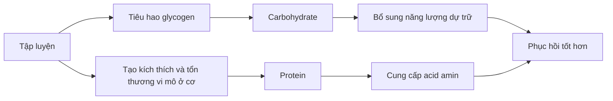
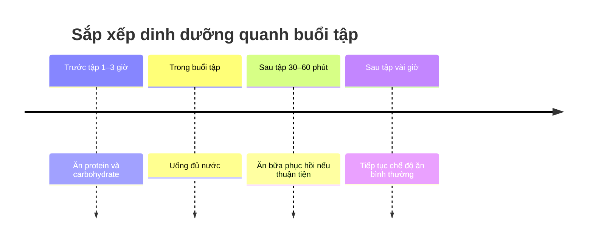
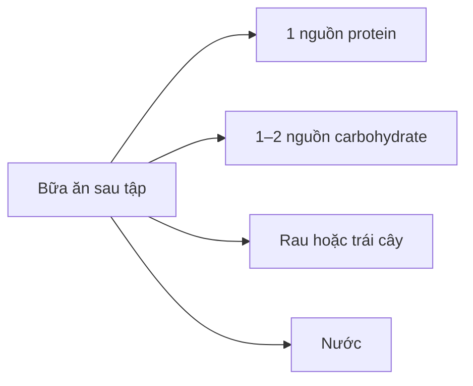

[](https://energiefitness.in/blogs/health-fitness/best-post-workout-meals-for-muscle-recovery?utm_source=chatgpt.com)

# 019 — Post-Workout Meal

| Thuộc tính       | Nội dung                         |
| ---------------- | -------------------------------- |
| **Module**       | Module 02 — Meal Planning Basics |
| **Bài học**      | Post-Workout Meal                |
| **Thời lượng**   | 01:43                            |
| **Chủ đề chính** | Bữa ăn sau khi tập luyện         |


> **Ý tưởng cốt lõi:** Bữa ăn sau tập không cần phức tạp. Hãy ưu tiên **protein để hỗ trợ sửa chữa cơ bắp** và **carbohydrate để bổ sung năng lượng đã sử dụng**.

## Mục lục

1. [Mục tiêu bài học](#1-mục-tiêu-bài-học)
2. [Nội dung chính](#2-nội-dung-chính)
3. [Áp dụng thực tế](#3-áp-dụng-thực-tế)
4. [Lưu ý và lỗi thường gặp](#4-lưu-ý-và-lỗi-thường-gặp)
5. [Checklist thực hành](#5-checklist-thực-hành)
6. [Tóm tắt](#6-tóm-tắt)

---

## 1. Mục tiêu bài học

Sau bài học này, bạn có thể:

* Giải thích vai trò của bữa ăn sau khi tập luyện.
* Biết hai chất dinh dưỡng cần ưu tiên là **protein** và **carbohydrate**.
* Ước tính lượng protein và carbohydrate theo cân nặng.
* Sắp xếp bữa ăn trước và sau tập trong một khoảng thời gian hợp lý.
* Chuẩn bị một bữa ăn hoặc đồ uống phục hồi nhanh khi không có thời gian nấu ăn.

---

## 2. Nội dung chính

### 2.1. Mục đích của bữa ăn sau tập

Tập luyện tiêu hao năng lượng dự trữ và tạo ra kích thích lên mô cơ. Bữa ăn sau tập giúp cung cấp nguyên liệu để cơ thể bắt đầu quá trình phục hồi.

Các mục tiêu chính gồm:

| Mục tiêu                            | Vai trò của dinh dưỡng                                                                 |
| ----------------------------------- | -------------------------------------------------------------------------------------- |
| **Bổ sung glycogen**                | Carbohydrate giúp khôi phục phần năng lượng dự trữ đã được sử dụng trong lúc tập.      |
| **Hạn chế phân giải protein cơ**    | Việc cung cấp acid amin giúp cải thiện cân bằng protein sau vận động.                  |
| **Tăng tổng hợp protein cơ**        | Protein chất lượng cao cung cấp các acid amin cần thiết để sửa chữa và xây dựng mô cơ. |
| **Hỗ trợ giảm mệt mỏi**             | Năng lượng, nước và chất điện giải giúp cơ thể trở lại trạng thái ổn định.             |
| **Chuẩn bị cho buổi tập tiếp theo** | Phục hồi tốt giúp duy trì hiệu suất trong những buổi tập sau.                          |

Các tài liệu của ISSN cũng xác định việc bổ sung carbohydrate và protein sau vận động là một chiến lược hữu ích để phục hồi glycogen, cải thiện cân bằng protein và hỗ trợ thích nghi với tập luyện. ([PubMed Central (PMC)][1])

### Sơ đồ phục hồi sau tập



---

### 2.2. Hai chất dinh dưỡng cần ưu tiên

#### Protein — nguyên liệu sửa chữa cơ

Protein sau tập cung cấp các acid amin cần thiết cho quá trình sửa chữa và tổng hợp protein cơ.

Nguồn protein phù hợp:

* Thịt gà, thịt bò nạc hoặc cá.
* Trứng.
* Sữa, sữa chua Hy Lạp hoặc phô mai cottage.
* Whey protein.
* Đậu phụ, tempeh, đậu nành hoặc các loại đậu.

ISSN cho rằng một khẩu phần khoảng **20–40 g protein chất lượng cao** thường đủ để kích thích mạnh quá trình tổng hợp protein cơ. Protein cũng có thể được phân bổ thành các bữa cách nhau khoảng 3–4 giờ trong ngày. ([SpringerLink][2])

#### Carbohydrate — bổ sung glycogen

Carbohydrate đặc biệt quan trọng khi:

* Buổi tập kéo dài hoặc có khối lượng lớn.
* Bạn tập sức bền.
* Bạn tập hai buổi trong cùng một ngày.
* Buổi tập tiếp theo diễn ra trong thời gian ngắn.

Nguồn carbohydrate phù hợp:

* Cơm, mì, bún, phở hoặc bánh mì.
* Khoai lang, khoai tây.
* Yến mạch và ngũ cốc.
* Chuối, xoài, táo và các loại trái cây.
* Sữa hoặc sữa chua có carbohydrate.


---

### 2.3. Ước tính lượng carbohydrate và protein

Theo hướng dẫn tổng quát trong bài học:

```text
Protein sau tập = 0,2–0,5 g × cân nặng tính bằng pound

Carbohydrate sau tập = 0,2–0,5 g × cân nặng tính bằng pound
```

Quy đổi sang kilogram:

```text
Protein hoặc carbohydrate ≈ 0,44–1,10 g/kg cân nặng
```

#### Ví dụ với người nặng 70 kg

```text
70 kg ≈ 154 lb

Mức thấp:
154 × 0,2 ≈ 31 g

Mức cao:
154 × 0,5 ≈ 77 g
```

Theo công thức của bài học, người nặng 70 kg có thể dùng khoảng:

| Chất dinh dưỡng  | Khoảng tham khảo |
| ---------------- | ---------------: |
| **Protein**      |          31–77 g |
| **Carbohydrate** |          31–77 g |

> **Lưu ý thực hành:** Không nhất thiết phải dùng mức protein cao nhất. Với phần lớn người tập, khoảng **20–40 g protein chất lượng cao** trong bữa sau tập là một điểm khởi đầu thực tế. Phần còn lại nên được điều chỉnh dựa trên tổng lượng protein cả ngày, cân nặng, mục tiêu và quy mô buổi tập. ([SpringerLink][2])

Nếu bạn vừa hoàn thành một buổi tập rất dài, tập sức bền hoặc cần phục hồi nhanh cho buổi tập tiếp theo, lượng carbohydrate có thể cao hơn. Trong trường hợp cần phục hồi glycogen thật nhanh, hướng dẫn thể thao thường sử dụng khoảng **1,0–1,2 g carbohydrate/kg/giờ trong bốn giờ đầu**. Điều này chủ yếu cần thiết khi hai buổi tập cách nhau chưa đến khoảng tám giờ. ([PubMed Central (PMC)][3])

---

### 2.4. Nên ăn sau tập bao lâu?

Bài học đề xuất ăn bữa sau tập trong khoảng:

```text
30–60 phút sau khi kết thúc buổi tập
```

Đây là một mốc dễ áp dụng, đặc biệt khi:

* Bạn tập khi bụng đói.
* Bữa trước tập cách buổi tập khá xa.
* Buổi tập dài hoặc có cường độ cao.
* Bạn còn một buổi tập khác trong ngày.
* Bạn đang rất đói sau tập.

Tuy nhiên, khoảng 30–60 phút **không phải một thời hạn tuyệt đối**. Tác dụng đồng hóa của tập luyện vẫn kéo dài nhiều giờ; protein được ăn trước hoặc sau buổi tập đều có thể mang lại lợi ích. ([SpringerLink][2])

### Sơ đồ thời gian bữa ăn quanh buổi tập



Một nguyên tắc đơn giản trong bài học là:

> **Không nên để bữa trước tập và bữa sau tập cách nhau quá khoảng 3–4 giờ.**

Ví dụ:

```text
16:00 — Ăn bữa trước tập
17:00 — Bắt đầu tập
18:00 — Kết thúc tập
18:30 — Ăn bữa sau tập
```

Tổng thời gian giữa hai bữa là 2 giờ 30 phút, hoàn toàn hợp lý.

Nếu bạn đã ăn một bữa lớn khoảng một giờ trước khi tập, bạn không cần vội uống protein ngay khi vừa đặt tạ xuống. Cơ thể vẫn đang tiêu hóa và hấp thu dưỡng chất từ bữa trước.

---

## 3. Áp dụng thực tế

### 3.1. Công thức xây dựng bữa ăn sau tập



Một bữa cơ bản có thể được xây dựng như sau:

```text
Protein + carbohydrate + rau/trái cây + nước
```


### 3.2. Một số bữa ăn gợi ý

| Bữa ăn                         | Protein   | Carbohydrate       |
| ------------------------------ | --------- | ------------------ |
| **Cơm, ức gà và rau**          | Ức gà     | Cơm                |
| **Khoai tây và cá hồi**        | Cá hồi    | Khoai tây          |
| **Phở bò nạc**                 | Thịt bò   | Bánh phở           |
| **Bánh mì trứng và chuối**     | Trứng     | Bánh mì, chuối     |
| **Yến mạch, sữa và whey**      | Sữa, whey | Yến mạch, trái cây |
| **Cơm, đậu phụ và rau**        | Đậu phụ   | Cơm                |
| **Sữa chua Hy Lạp và ngũ cốc** | Sữa chua  | Ngũ cốc, trái cây  |

### 3.3. Ví dụ bữa ăn cho người nặng khoảng 70 kg

#### Phương án 1 — Bữa chính

* 150–180 g ức gà.
* 200–250 g cơm chín.
* Một phần rau.
* Một quả chuối.
* Nước lọc.

#### Phương án 2 — Bữa sáng sau tập

* 60–80 g yến mạch.
* 250 ml sữa.
* Một khẩu phần whey protein.
* Một quả chuối hoặc một phần quả mọng.

#### Phương án 3 — Bữa chay

* 180–200 g đậu phụ.
* Một bát cơm.
* Rau xào hoặc rau luộc.
* Một phần trái cây.

---

### 3.4. Đồ uống phục hồi khi không có thời gian

Khi không thể chuẩn bị một bữa ăn đầy đủ ngay sau buổi tập, bạn có thể mang theo một ly sinh tố hoặc protein shake.

#### Công thức đơn giản

```text
250–350 ml sữa hoặc nước
+ 1 khẩu phần whey protein
+ 1 quả chuối
+ 30–50 g yến mạch
```

Có thể thêm:

* Sữa chua.
* Trái cây đông lạnh.
* Bột cacao không đường.
* Một lượng nhỏ bơ đậu phộng nếu cần tăng calorie.

> Protein shake là một giải pháp **thuận tiện**, không bắt buộc. Bạn vẫn có thể phục hồi tốt bằng thực phẩm thông thường nếu tổng dinh dưỡng trong ngày được đáp ứng.

---

### 3.5. Điều chỉnh theo mục tiêu

| Mục tiêu                  | Cách điều chỉnh                                                                                                      |
| ------------------------- | -------------------------------------------------------------------------------------------------------------------- |
| **Tăng cơ**               | Dùng đủ protein và lượng carbohydrate tương đối cao để hỗ trợ hiệu suất, đồng thời duy trì thặng dư calorie phù hợp. |
| **Giảm mỡ**               | Giữ protein ở mức hợp lý; điều chỉnh lượng carbohydrate và chất béo để không vượt mục tiêu calorie.                  |
| **Tập sức bền**           | Tăng carbohydrate sau các buổi chạy, đạp xe hoặc tập kéo dài.                                                        |
| **Tập hai buổi/ngày**     | Ăn sớm hơn và ưu tiên carbohydrate dễ tiêu hóa để phục hồi glycogen nhanh.                                           |
| **Tập nhẹ một buổi/ngày** | Chỉ cần ăn bữa bình thường trong vài giờ sau tập, không cần áp dụng chiến lược quá phức tạp.                         |

---

## 4. Lưu ý và lỗi thường gặp

### Lỗi 1: Tin rằng phải uống whey ngay lập tức

Bạn không mất cơ chỉ vì chưa uống whey trong vài phút đầu sau buổi tập. Bữa trước tập, tổng lượng protein trong ngày và sự phân bổ protein giữa các bữa đều quan trọng.

### Lỗi 2: Chỉ ăn protein và bỏ hoàn toàn carbohydrate

Protein hỗ trợ mô cơ, nhưng carbohydrate giúp bổ sung glycogen và cung cấp năng lượng cho các buổi tập tiếp theo. Carbohydrate càng quan trọng khi buổi tập dài hoặc tần suất tập cao.

### Lỗi 3: Ăn quá nhiều vì nghĩ đã “đốt hết calorie”

Một buổi tập không phải giấy phép để ăn không giới hạn. Bữa sau tập vẫn phải nằm trong mục tiêu calorie và macronutrient hằng ngày.

### Lỗi 4: Biến bữa sau tập thành một bữa quá khó tiêu

Một bữa quá lớn hoặc chứa quá nhiều thức ăn chiên rán có thể gây đầy bụng. Khi cần ăn nhanh, nên chọn những thực phẩm quen thuộc và dễ tiêu hóa.

### Lỗi 5: Quên uống nước

Dinh dưỡng sau tập không chỉ gồm thức ăn. Hãy bù lại lượng nước đã mất, đặc biệt sau buổi tập dài, tập ngoài trời hoặc đổ nhiều mồ hôi.

### Lỗi 6: Chỉ tập trung vào “cửa sổ đồng hóa”

Quá trình phục hồi không kết thúc sau 30 hay 60 phút. Chế độ ăn trong cả ngày, giấc ngủ và lịch tập tổng thể quan trọng hơn việc cố đạt một thời điểm chính xác tuyệt đối. Tác động tăng nhạy cảm của cơ với protein có thể kéo dài ít nhất 24 giờ sau tập, mặc dù giảm dần theo thời gian. ([SpringerLink][2])

---

## 5. Checklist thực hành

Trước khi kết thúc ngày tập luyện, hãy kiểm tra:

* [ ] Tôi đã có một nguồn protein trong bữa sau tập.
* [ ] Tôi đã bổ sung carbohydrate phù hợp với khối lượng buổi tập.
* [ ] Tôi đã uống đủ nước sau khi tập.
* [ ] Bữa trước và sau tập không cách nhau quá lâu.
* [ ] Bữa ăn phù hợp với tổng calorie và macro trong ngày.
* [ ] Tôi không phụ thuộc hoàn toàn vào thực phẩm bổ sung.
* [ ] Tôi đã chuẩn bị sẵn shake hoặc đồ ăn nhẹ khi lịch trình bận rộn.
* [ ] Tôi không lo lắng quá mức nếu không thể ăn ngay trong 30 phút đầu.

---

## 6. Tóm tắt

Bữa ăn sau tập có nhiệm vụ cung cấp dưỡng chất để cơ thể **bổ sung năng lượng, sửa chữa mô cơ và chuẩn bị cho buổi tập tiếp theo**.

Công thức đơn giản nhất là:

```text
Protein + carbohydrate + nước
```

Các nguyên tắc quan trọng:

1. Ưu tiên một khẩu phần **protein chất lượng cao**.
2. Bổ sung **carbohydrate** tùy quy mô và cường độ buổi tập.
3. Ăn trong khoảng **30–60 phút** là thuận tiện nhưng không phải giới hạn bắt buộc.
4. Cố gắng không để bữa trước và sau tập cách nhau quá khoảng **3–4 giờ**.
5. Dùng shake khi cần sự tiện lợi, nhưng thực phẩm thông thường vẫn là lựa chọn hoàn toàn phù hợp.
6. Tổng calorie, protein và carbohydrate trong cả ngày quan trọng hơn việc đạt thời điểm hoàn hảo.

[1]: https://pmc.ncbi.nlm.nih.gov/articles/PMC2575187/?utm_source=chatgpt.com "International Society of Sports Nutrition position stand: Nutrient timing - PMC"
[2]: https://jissn.biomedcentral.com/counter/pdf/10.1186/s12970-017-0177-8.pdf "International Society of Sports Nutrition Position Stand: protein and exercise"
[3]: https://pmc.ncbi.nlm.nih.gov/articles/PMC12297025/?utm_source=chatgpt.com "Nutritional Strategies to Improve Post-exercise Recovery and Subsequent Exercise Performance: A Narrative Review - PMC"

---

# Bài luyện tập

## Mục tiêu


## Đề bài


## Yêu cầu hoàn thành

- [ ] 
- [ ] 
- [ ] 

## Kết quả / lời giải


## Ghi chú
