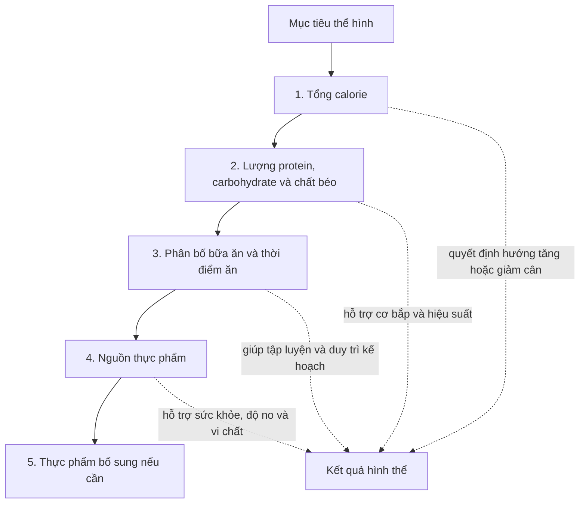
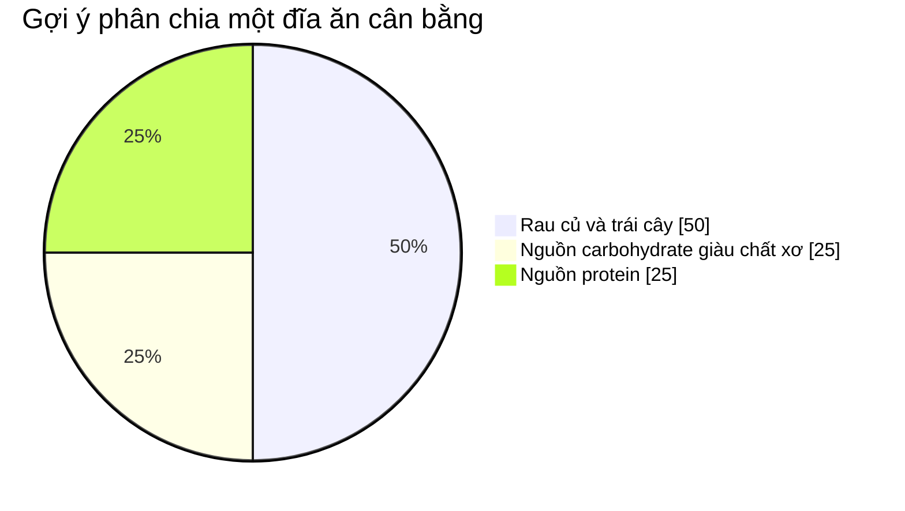

# 021 — Foods Introduction


> **Hình minh họa:** Lập kế hoạch bữa ăn với rau củ và trái cây tươi.
> **Nguồn ảnh:** [Wikimedia Commons](https://commons.wikimedia.org/wiki/File:Healthy_meal_planning_with_fresh_fruits_and_vegetables_in_a_bright_kitchen_setting.jpg)

| Thuộc tính        | Nội dung                                                             |
| ----------------- | -------------------------------------------------------------------- |
| **Module**        | Module 02 — Meal Planning Basics                                     |
| **Bài học**       | Foods Introduction                                                   |
| **Thời lượng**    | 02:08                                                                |
| **Chủ đề chính**  | Giới thiệu về lựa chọn thực phẩm                                     |
| **Trọng tâm**     | Phân biệt vai trò của calorie, macronutrient và chất lượng thực phẩm |
| **Bài tiếp theo** | Tìm hiểu các nguồn protein khác nhau                                 |

---

## Mục lục

1. [Mục tiêu bài học](#1-mục-tiêu-bài-học)
2. [Nội dung chính](#2-nội-dung-chính)
3. [Áp dụng thực tế](#3-áp-dụng-thực-tế)
4. [Lưu ý và lỗi thường gặp](#4-lưu-ý-và-lỗi-thường-gặp)
5. [Checklist thực hành](#5-checklist-thực-hành)
6. [Tóm tắt](#6-tóm-tắt)

---

## 1. Mục tiêu bài học

Sau bài học này, bạn có thể:

* Hiểu **chất lượng thực phẩm — food quality** là gì.
* Biết vì sao lựa chọn thực phẩm được đề cập **sau calorie, macronutrient và thời điểm ăn**.
* Phân biệt hai mục tiêu khác nhau:

  * Thay đổi cân nặng và thành phần cơ thể.
  * Cải thiện sức khỏe lâu dài.
* Hiểu rằng không có một loại thực phẩm riêng lẻ nào có thể tự động giúp đốt mỡ hoặc tăng cơ.
* Biết cách lựa chọn thực phẩm vừa đáp ứng mục tiêu calorie và macro, vừa cung cấp đủ vitamin, khoáng chất, chất xơ và các dưỡng chất thiết yếu.

---

## 2. Nội dung chính

### 2.1. Chất lượng thực phẩm là gì?

**Chất lượng thực phẩm** đề cập đến:

* Loại thực phẩm bạn lựa chọn.
* Mức độ chế biến của thực phẩm.
* Lượng vitamin, khoáng chất và chất xơ.
* Loại carbohydrate, protein và chất béo mà thực phẩm cung cấp.
* Những thành phần đi kèm như đường bổ sung, natri và chất béo bão hòa.

Hai thực phẩm có thể cung cấp lượng calorie hoặc protein gần giống nhau nhưng lại khác biệt đáng kể về:

* Khả năng tạo cảm giác no.
* Hàm lượng vi chất dinh dưỡng.
* Lượng chất xơ.
* Loại chất béo.
* Lượng natri và đường bổ sung.
* Tác động đối với sức khỏe khi sử dụng thường xuyên.

Harvard gọi đây là **“gói dinh dưỡng — nutrient package”**: khi ăn một nguồn protein, chúng ta không chỉ nhận protein mà còn nhận cả chất béo, chất xơ, natri và các dưỡng chất đi kèm.

---

### 2.2. Thứ tự ưu tiên trong lập kế hoạch bữa ăn

Trong bối cảnh tập luyện và thay đổi hình thể, kế hoạch dinh dưỡng có thể được hình dung theo thứ tự sau:



Điều này không có nghĩa chất lượng thực phẩm không quan trọng. Nó có nghĩa rằng:

> Bạn khó giảm cân nếu liên tục ăn vượt nhu cầu năng lượng, ngay cả khi toàn bộ thực phẩm được xem là “lành mạnh”.

Ngược lại:

> Một người có thể giảm cân khi kiểm soát calorie, nhưng chế độ ăn vẫn chưa tối ưu cho sức khỏe nếu thiếu rau, trái cây, chất xơ và vi chất.

Bằng chứng tổng thể cho thấy calorie có vai trò quan trọng đối với kiểm soát cân nặng, trong khi chất lượng thực phẩm cũng ảnh hưởng đến khả năng duy trì cân nặng và sức khỏe lâu dài.

---

### 2.3. Không có “thực phẩm giảm cân thần kỳ”

Trong lĩnh vực fitness, bạn thường bắt gặp những tuyên bố như:

* Một loại trái cây có thể “đốt mỡ bụng”.
* Một loại gia vị có thể “tăng tốc trao đổi chất”.
* Chỉ cần bỏ hoàn toàn cơm hoặc tinh bột là sẽ giảm cân.
* Có những thực phẩm được phép ăn không giới hạn vì chúng “sạch”.
* Ăn một món cụ thể vào một khung giờ đặc biệt sẽ khiến cơ thể đốt nhiều mỡ hơn.

Những cách diễn đạt này thường phóng đại vai trò của một loại thực phẩm riêng lẻ.

Không một món ăn đơn lẻ nào có thể bù lại một chế độ ăn thường xuyên vượt quá nhu cầu calorie. Kết quả phụ thuộc vào **toàn bộ chế độ ăn**, mức vận động, khả năng duy trì và thời gian áp dụng.

```text
Không có thực phẩm tự động gây tăng mỡ
                ↓
Tăng mỡ xảy ra khi năng lượng nạp vào thường xuyên vượt năng lượng tiêu hao
                ↓
Không có thực phẩm tự động đốt mỡ
                ↓
Giảm mỡ cần duy trì mức thâm hụt calorie phù hợp
```

---

### 2.4. Với mục tiêu thể hình, tổng lượng thường quan trọng hơn một món ăn riêng lẻ

Ví dụ, để hỗ trợ tăng hoặc duy trì cơ bắp, việc đáp ứng đủ tổng lượng protein thường quan trọng hơn việc luôn phải ăn một món duy nhất.

Protein có thể đến từ nhiều nguồn:

* Trứng.
* Thịt gà.
* Cá.
* Thịt nạc.
* Sữa và sữa chua.
* Đậu phụ.
* Đậu nành.
* Các loại đậu.
* Whey hoặc protein thực vật.


> **Hình minh họa:** Một bữa ăn có protein, carbohydrate và rau củ.
> **Nguồn ảnh:** [Wikimedia Commons](https://commons.wikimedia.org/wiki/File:Liat_Portal_for_Foodie_Disorder_-_Grilled_chicken_with_rice,_potatoes_and_vegetables.jpg)

Tuy nhiên, điều đó **không có nghĩa tất cả nguồn protein hoàn toàn giống nhau**.

| Nguồn protein |    Protein | Thành phần đáng chú ý đi kèm                     |
| ------------- | ---------: | ------------------------------------------------ |
| Cá            |        Cao | Omega-3 ở một số loại cá, vitamin và khoáng chất |
| Thịt gia cầm  |        Cao | Dễ kết hợp trong nhiều bữa ăn                    |
| Trứng         |        Tốt | Chất béo, choline và nhiều vi chất               |
| Đậu, đậu lăng |        Tốt | Chất xơ, carbohydrate và khoáng chất             |
| Sữa chua      |        Tốt | Calci và các dưỡng chất từ sữa                   |
| Thịt chế biến | Có protein | Có thể chứa nhiều natri và chất béo bão hòa      |

Vì vậy, có thể hiểu theo hai cấp độ:

```text
Mục tiêu tăng cơ hoặc giữ cơ
→ Trước tiên: đáp ứng đủ tổng lượng protein

Mục tiêu sức khỏe lâu dài
→ Tiếp theo: xem xét nguồn protein và các dưỡng chất đi kèm
```

Các nguồn như cá, gia cầm, đậu và hạt thường được khuyến khích hơn thịt chế biến khi xây dựng chế độ ăn lành mạnh lâu dài.

---

### 2.5. Khi nào chất lượng thực phẩm trở nên đặc biệt quan trọng?

Chất lượng thực phẩm có vai trò lớn hơn khi mục tiêu của bạn bao gồm:

* Đảm bảo đủ vitamin và khoáng chất.
* Tăng lượng chất xơ.
* Cải thiện tiêu hóa.
* Kiểm soát cảm giác đói.
* Duy trì năng lượng trong ngày.
* Hỗ trợ sức khỏe tim mạch và chuyển hóa.
* Xây dựng một chế độ ăn có thể duy trì lâu dài.

Hướng dẫn dinh dưỡng hiện hành nhấn mạnh chế độ ăn nên được xây dựng chủ yếu từ các thực phẩm nguyên bản, giàu dưỡng chất như rau, trái cây, ngũ cốc nguyên hạt, nguồn protein phù hợp và chất béo lành mạnh.

---

### 2.6. Phân biệt mục tiêu hình thể và mục tiêu sức khỏe

| Tiêu chí             | Mục tiêu hình thể                  | Mục tiêu sức khỏe                                |
| -------------------- | ---------------------------------- | ------------------------------------------------ |
| **Câu hỏi chính**    | Tôi ăn bao nhiêu?                  | Tôi thường xuyên ăn những gì?                    |
| **Ưu tiên hàng đầu** | Calorie và macronutrient           | Chất lượng và sự đa dạng thực phẩm               |
| **Protein**          | Đủ tổng lượng mỗi ngày             | Xem xét cả nguồn và thành phần đi kèm            |
| **Carbohydrate**     | Đủ để đáp ứng calorie và hoạt động | Ưu tiên rau, trái cây, đậu và ngũ cốc nguyên hạt |
| **Chất béo**         | Đạt lượng fat mục tiêu             | Ưu tiên chất béo không bão hòa                   |
| **Kết quả chính**    | Cân nặng, cơ bắp và mỡ cơ thể      | Vi chất, tiêu hóa và sức khỏe lâu dài            |

Hai mục tiêu này không đối lập nhau. Một kế hoạch tốt nên đồng thời:

1. Phù hợp với calorie và macro mục tiêu.
2. Cung cấp đủ dưỡng chất.
3. Có hương vị phù hợp với sở thích.
4. Có chi phí và cách chuẩn bị thực tế.
5. Có thể duy trì trong thời gian dài.

---

### 2.7. Mô hình một đĩa ăn cân bằng

Một mô hình đơn giản để nâng cao chất lượng bữa ăn là:



Harvard Healthy Eating Plate đề xuất:

* Khoảng **1/2 đĩa** là rau củ và trái cây đa dạng.
* Khoảng **1/4 đĩa** là ngũ cốc nguyên hạt.
* Khoảng **1/4 đĩa** là nguồn protein phù hợp.
* Sử dụng dầu thực vật phù hợp với lượng vừa phải.
* Ưu tiên nước thay vì đồ uống nhiều đường.

> Đây là mô hình trực quan về tỷ lệ thực phẩm, không phải công thức calorie cố định cho tất cả mọi người. Nhu cầu thực tế còn phụ thuộc vào kích thước cơ thể, mục tiêu và mức vận động.

---

## 3. Áp dụng thực tế

### 3.1. Công thức xây dựng một bữa ăn

Mỗi bữa chính có thể được xây dựng từ bốn thành phần:

```text
Một nguồn protein
        +
Một nguồn carbohydrate
        +
Rau củ hoặc trái cây
        +
Một lượng chất béo phù hợp
        =
Bữa ăn cân bằng và dễ điều chỉnh
```

#### Nhóm 1 — Protein

* Thịt gà.
* Cá.
* Trứng.
* Thịt bò nạc.
* Tôm.
* Sữa chua.
* Đậu phụ.
* Đậu nành.
* Đậu lăng.
* Các loại đậu.

#### Nhóm 2 — Carbohydrate

* Cơm.
* Khoai lang.
* Khoai tây.
* Yến mạch.
* Bún hoặc phở.
* Bánh mì nguyên cám.
* Ngô.
* Các loại đậu.
* Trái cây.

#### Nhóm 3 — Rau củ và trái cây

* Rau cải.
* Súp lơ.
* Cà rốt.
* Cà chua.
* Dưa chuột.
* Bí đỏ.
* Nấm.
* Chuối.
* Cam.
* Táo.
* Thanh long.

#### Nhóm 4 — Chất béo

* Dầu ô liu.
* Dầu hạt cải.
* Quả bơ.
* Đậu phộng.
* Hạnh nhân.
* Hạt điều.
* Hạt chia.
* Cá béo.
* Lòng đỏ trứng.

---

### 3.2. Ví dụ bữa ăn tại Việt Nam

| Bữa ăn                | Protein             | Carb     | Rau/trái cây        | Chất béo                       |
| --------------------- | ------------------- | -------- | ------------------- | ------------------------------ |
| **Cơm gà**            | Ức hoặc đùi gà      | Cơm      | Rau luộc, dưa chuột | Dầu dùng khi chế biến          |
| **Cơm cá**            | Cá hấp hoặc áp chảo | Cơm      | Rau cải, cà chua    | Chất béo từ cá                 |
| **Bún bò điều chỉnh** | Thịt bò             | Bún      | Rau sống, giá       | Một phần chất béo từ nước dùng |
| **Cơm đậu phụ**       | Đậu phụ             | Cơm      | Rau xào hoặc luộc   | Dầu thực vật                   |
| **Yến mạch sữa chua** | Sữa chua hoặc whey  | Yến mạch | Chuối, dâu          | Hạt hoặc bơ đậu phộng          |
| **Trứng và bánh mì**  | Trứng               | Bánh mì  | Cà chua, rau xanh   | Lòng đỏ trứng hoặc quả bơ      |

---

### 3.3. Cách nâng cấp một bữa ăn thông thường

#### Ví dụ 1 — Mì ăn liền

**Bữa ăn ban đầu:**

```text
Mì ăn liền
```

**Phiên bản cân bằng hơn:**

```text
Mì ăn liền
+ 2 quả trứng hoặc thịt nạc
+ rau cải và nấm
+ dùng một phần gói gia vị
```

#### Ví dụ 2 — Cơm và thịt

**Bữa ăn ban đầu:**

```text
Nhiều cơm + một ít thịt
```

**Phiên bản cân bằng hơn:**

```text
Khẩu phần cơm phù hợp
+ tăng lượng protein
+ thêm ít nhất một món rau
+ thêm trái cây nếu bữa ăn còn thiếu
```

#### Ví dụ 3 — Đồ ăn nhanh

Không nhất thiết phải cấm hoàn toàn. Có thể:

* Chọn phần ăn phù hợp với calorie.
* Chọn đồ uống không đường.
* Thêm salad hoặc rau.
* Không mặc định gọi phần lớn nhất.
* Cân đối các bữa còn lại trong ngày.

---

### 3.4. Quy trình lựa chọn thực phẩm trong 30 giây

Khi đứng trước một món ăn, hãy tự hỏi:

1. **Món này cung cấp protein không?**
2. **Khẩu phần có phù hợp với mục tiêu calorie không?**
3. **Có rau, trái cây hoặc nguồn chất xơ không?**
4. **Tôi đang ăn món này vì đói, vì thuận tiện hay chỉ vì thói quen?**
5. **Nếu ăn thường xuyên, món này có giúp tôi duy trì chế độ ăn không?**

---

### 3.5. Ma trận lựa chọn thực phẩm

|                                    | **Giàu dưỡng chất**                  | **Ít dưỡng chất**                 |
| ---------------------------------- | ------------------------------------ | --------------------------------- |
| **Phù hợp calorie và macro**       | Lựa chọn ưu tiên                     | Có thể dùng linh hoạt             |
| **Không phù hợp calorie và macro** | Vẫn có thể cản trở mục tiêu hình thể | Nên hạn chế tần suất và khẩu phần |

Điểm quan trọng:

> “Lành mạnh” không đồng nghĩa với “không có calorie”.

Các thực phẩm như hạt, bơ đậu phộng, quả bơ và dầu thực vật có nhiều dưỡng chất nhưng cũng có mật độ năng lượng cao. Khẩu phần vẫn cần được tính đến khi mục tiêu là giảm mỡ.

---

## 4. Lưu ý và lỗi thường gặp

### Lỗi 1 — Chia thực phẩm thành “tốt tuyệt đối” và “xấu tuyệt đối”

Một món ăn không quyết định toàn bộ chất lượng chế độ ăn.

Thay vì hỏi:

> “Món này có xấu không?”

Hãy hỏi:

> “Món này xuất hiện với tần suất và khẩu phần như thế nào trong toàn bộ chế độ ăn?”

---

### Lỗi 2 — Chỉ ăn “sạch” nhưng không kiểm soát khẩu phần

Một người vẫn có thể tăng cân khi ăn quá nhiều:

* Các loại hạt.
* Bơ đậu phộng.
* Dầu ô liu.
* Quả bơ.
* Granola.
* Trái cây sấy.
* Sinh tố có nhiều nguyên liệu.

Thực phẩm giàu dưỡng chất vẫn chứa năng lượng.

---

### Lỗi 3 — Chỉ quan tâm calorie mà bỏ qua chất lượng

Kiểm soát calorie có thể giúp thay đổi cân nặng, nhưng một chế độ ăn quá ít rau, trái cây, chất xơ và thực phẩm đa dạng có thể khó duy trì và không đáp ứng tốt nhu cầu vi chất.

Một chế độ ăn lành mạnh nên bao gồm nhiều nhóm thực phẩm giàu dưỡng chất trong giới hạn calorie phù hợp.

---

### Lỗi 4 — Cho rằng mọi nguồn protein hoàn toàn giống nhau

Đạt đủ protein là ưu tiên quan trọng cho mục tiêu tập luyện. Tuy nhiên, nguồn protein khác nhau về:

* Acid amin.
* Khả năng tiêu hóa.
* Chất béo đi kèm.
* Chất xơ.
* Natri.
* Vitamin và khoáng chất.

Vì vậy, hãy đáp ứng đủ tổng protein nhưng vẫn nên đa dạng nguồn thực phẩm.

---

### Lỗi 5 — Theo đuổi “siêu thực phẩm”

Không cần một nguyên liệu hiếm hoặc đắt tiền để ăn uống lành mạnh.

Những thực phẩm quen thuộc như:

* Trứng.
* Cá.
* Đậu phụ.
* Cơm.
* Khoai.
* Rau theo mùa.
* Chuối.
* Cam.
* Lạc và các loại đậu.

đều có thể tạo thành một chế độ ăn phù hợp nếu được kết hợp và định lượng hợp lý.

---

### Lỗi 6 — Cố gắng hoàn hảo trong mọi bữa ăn

Một bữa ăn chưa cân bằng không khiến toàn bộ kế hoạch thất bại.

Điều cần đánh giá là:

```text
Toàn bộ ngày
→ Toàn bộ tuần
→ Thói quen được duy trì trong nhiều tháng
```

Tính nhất quán quan trọng hơn sự hoàn hảo ngắn hạn.

---

### Lỗi 7 — Loại bỏ cả một nhóm thực phẩm khi không cần thiết

Việc cắt hoàn toàn carbohydrate, chất béo hoặc một nhóm thực phẩm lớn có thể khiến chế độ ăn:

* Khó duy trì.
* Ít đa dạng.
* Khó đáp ứng đủ dưỡng chất.
* Không phù hợp với sở thích và sinh hoạt cá nhân.

Những người có bệnh lý, dị ứng hoặc nhu cầu đặc biệt nên thực hiện theo hướng dẫn của bác sĩ hoặc chuyên gia dinh dưỡng.

---

## 5. Checklist thực hành

### Khi lập kế hoạch trong ngày

* [ ] Tôi đã xác định mục tiêu calorie chưa?
* [ ] Tôi có đạt lượng protein mục tiêu không?
* [ ] Tôi đã phân bổ carbohydrate và chất béo phù hợp chưa?
* [ ] Tôi có ít nhất một nguồn rau hoặc trái cây trong phần lớn các bữa không?
* [ ] Tôi có sử dụng nhiều nguồn protein khác nhau không?
* [ ] Tôi có nguồn carbohydrate giàu chất xơ không?
* [ ] Tôi có kiểm soát khẩu phần của thực phẩm nhiều calorie không?
* [ ] Kế hoạch có phù hợp với ngân sách và thời gian nấu ăn không?
* [ ] Tôi có thể duy trì cách ăn này trong nhiều tuần hoặc nhiều tháng không?

### Khi mua thực phẩm

* [ ] Chọn trước các nguồn protein chính.
* [ ] Chọn hai đến bốn loại rau dễ chế biến.
* [ ] Chọn một vài loại trái cây theo mùa.
* [ ] Chuẩn bị nguồn carbohydrate phù hợp với hoạt động.
* [ ] Có một số thực phẩm tiện lợi cho ngày bận rộn.
* [ ] Đọc nhãn khi mua thực phẩm đóng gói.
* [ ] Không mua quá nhiều món dễ khiến bản thân mất kiểm soát khẩu phần.

### Khi đánh giá một bữa ăn

* [ ] Có protein.
* [ ] Có rau hoặc trái cây.
* [ ] Có nguồn năng lượng phù hợp.
* [ ] Khẩu phần phù hợp.
* [ ] Không quá ít hoặc quá nhiều chất béo.
* [ ] Có thể giúp tôi no đến bữa tiếp theo.
* [ ] Phù hợp với tổng kế hoạch trong ngày.

---

## 6. Tóm tắt

### Sáu ý quan trọng nhất

1. **Calorie và macronutrient là nền tảng** khi mục tiêu chính là giảm mỡ, tăng cân hoặc xây dựng cơ bắp.

2. **Không tồn tại thực phẩm giảm cân thần kỳ.** Một món ăn riêng lẻ không thể thay thế việc kiểm soát tổng năng lượng.

3. **Đạt đủ protein quan trọng hơn việc chỉ ăn một nguồn protein duy nhất**, nhưng nguồn protein vẫn khác nhau về dưỡng chất đi kèm.

4. **Chất lượng thực phẩm đặc biệt quan trọng đối với sức khỏe**, cảm giác no, tiêu hóa, vi chất và khả năng duy trì chế độ ăn.

5. **Không cần ăn hoàn hảo.** Hãy xây dựng phần lớn chế độ ăn từ thực phẩm giàu dưỡng chất và quản lý hợp lý các món ăn linh hoạt.

6. Một kế hoạch tốt cần đồng thời đáp ứng:

```text
Đúng lượng calorie
        +
Đủ macronutrient
        +
Thực phẩm đa dạng
        +
Phù hợp sở thích
        +
Dễ duy trì
        =
Kế hoạch dinh dưỡng hiệu quả
```

---

## Kết luận bài học

> Đối với mục tiêu thể hình, **lượng thức ăn** quyết định phần lớn hướng thay đổi cân nặng và thành phần cơ thể.
> Đối với sức khỏe lâu dài, **loại thực phẩm** và những dưỡng chất đi kèm ngày càng trở nên quan trọng.

Vì vậy, không nên lựa chọn giữa “đúng macro” và “ăn lành mạnh”. Mục tiêu tốt nhất là kết hợp cả hai:

> **Đáp ứng calorie và macro bằng phần lớn các thực phẩm đa dạng, giàu dưỡng chất và phù hợp với cuộc sống thực tế.**

Ở các bài tiếp theo, chúng ta sẽ đi sâu vào từng nhóm thực phẩm, bắt đầu với **các nguồn protein khác nhau**.

---

# Bài luyện tập

## Mục tiêu


## Đề bài


## Yêu cầu hoàn thành

- [ ] 
- [ ] 
- [ ] 

## Kết quả / lời giải


## Ghi chú
