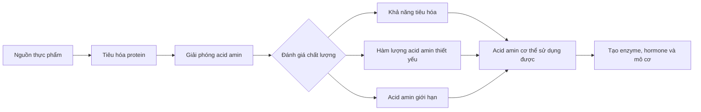
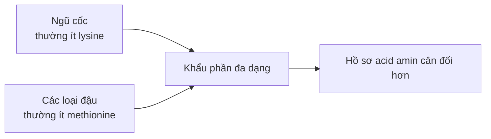

# 022 — Protein Quality

| Thuộc tính       | Nội dung                         |
| ---------------- | -------------------------------- |
| **Module**       | Module 02 — Meal Planning Basics |
| **Bài học**      | Protein Quality                  |
| **Thời lượng**   | 02:10                            |
| **Chủ đề chính** | Chất lượng của nguồn protein     |


*Nguồn ảnh: [Wikimedia Commons — Protein-rich Foods](https://commons.wikimedia.org/wiki/File:Protein-rich_Foods.jpg), giấy phép CC BY-SA 4.0.*

---

## Mục lục

1. [Mục tiêu bài học](#1-mục-tiêu-bài-học)
2. [Nội dung chính](#2-nội-dung-chính)
3. [Áp dụng thực tế](#3-áp-dụng-thực-tế)
4. [Lưu ý & lỗi thường gặp](#4-lưu-ý--lỗi-thường-gặp)
5. [Checklist thực hành](#5-checklist-thực-hành)
6. [Tóm tắt](#6-tóm-tắt)

---

## 1. Mục tiêu bài học

Sau bài học này, bạn có thể:

* Hiểu **chất lượng protein** không chỉ phụ thuộc vào số gram protein ghi trên nhãn.
* Phân biệt **khả năng tiêu hóa**, **khả năng hấp thu** và **hồ sơ acid amin thiết yếu**.
* Biết vì sao protein động vật thường được đánh giá cao, nhưng không phải nguồn protein thực vật nào cũng có chất lượng thấp.
* Hiểu cách kết hợp nhiều nguồn protein thực vật để cải thiện tổng lượng acid amin.
* Biết ưu tiên **tổng lượng protein và sự đa dạng của chế độ ăn** thay vì chỉ sử dụng whey protein.
* Xây dựng chế độ ăn chay hoặc thuần chay vẫn đáp ứng nhu cầu protein cho tập luyện.

---

## 2. Nội dung chính

### 2.1. Chất lượng protein là gì?

Hai thực phẩm cùng cung cấp **20 g protein** chưa chắc mang lại lượng acid amin cơ thể sử dụng được giống nhau.

Chất lượng của một nguồn protein thường được đánh giá dựa trên ba yếu tố chính:

1. **Hàm lượng acid amin thiết yếu** có trong protein.
2. **Tỷ lệ tiêu hóa và hấp thu** của protein.
3. Khả năng cung cấp đủ **acid amin giới hạn** cho nhu cầu của cơ thể.



Theo cách hiểu hiện đại, chất lượng protein không chỉ là “bao nhiêu phần trăm protein đi vào máu”, mà còn phải xét **acid amin thiết yếu nào được tiêu hóa và có thể sử dụng**. FAO khuyến nghị phương pháp DIAAS để đánh giá protein dựa trên khả năng tiêu hóa của từng acid amin thiết yếu. ([Wiley Online Library][1])

---

### 2.2. Bioavailability — khả dụng sinh học

Trong các tài liệu phổ thông, **bioavailability** thường được dùng để mô tả phần protein hoặc acid amin mà cơ thể có thể tiêu hóa, hấp thu và sử dụng.

Tuy nhiên, cần phân biệt:

| Khái niệm              | Ý nghĩa                                                             |
| ---------------------- | ------------------------------------------------------------------- |
| **Protein content**    | Tổng số gram protein có trong thực phẩm                             |
| **Digestibility**      | Tỷ lệ protein được hệ tiêu hóa phân giải và hấp thu                 |
| **Amino acid profile** | Tỷ lệ các acid amin có trong nguồn protein                          |
| **Protein quality**    | Mức độ nguồn protein đáp ứng nhu cầu acid amin thiết yếu của cơ thể |
| **Bioavailability**    | Mức độ chất dinh dưỡng sau khi hấp thu có thể được cơ thể sử dụng   |

Vì vậy, một nguồn protein dễ tiêu hóa nhưng thiếu một acid amin thiết yếu vẫn có thể bị giới hạn về chất lượng.

---

### 2.3. Acid amin thiết yếu và không thiết yếu

Protein được cấu tạo từ các **acid amin**. Trong đó:

* **Acid amin thiết yếu — EAA:** cơ thể không tự sản xuất đủ, bắt buộc phải lấy từ thực phẩm.
* **Acid amin không thiết yếu:** cơ thể có khả năng tự tổng hợp trong điều kiện bình thường.

Có chín acid amin được xem là thiết yếu đối với con người:

1. Histidine
2. Isoleucine
3. Leucine
4. Lysine
5. Methionine
6. Phenylalanine
7. Threonine
8. Tryptophan
9. Valine

Nguồn protein chứa tỷ lệ EAA phù hợp và được tiêu hóa tốt thường có giá trị dinh dưỡng cao hơn. ([NCBI][2])

> **Ghi nhớ:** Cơ thể không đánh giá thực phẩm dựa trên nhãn “động vật” hay “thực vật”; cơ thể sử dụng các acid amin được giải phóng sau quá trình tiêu hóa.

---

### 2.4. Acid amin giới hạn

**Acid amin giới hạn** là acid amin thiết yếu xuất hiện với tỷ lệ thấp nhất so với nhu cầu của cơ thể.

Có thể hình dung quá trình tổng hợp protein như việc xây một bức tường:

```text
Gạch leucine       ██████████
Gạch valine        ██████████
Gạch methionine    ██████
Gạch lysine        ██

→ Dù còn nhiều loại gạch khác, việc xây dựng vẫn bị giới hạn
  bởi loại gạch thiếu nhất — trong ví dụ này là lysine.
```

Ví dụ thường gặp:

| Nhóm thực phẩm              | Acid amin thường có tỷ lệ thấp hơn |
| --------------------------- | ---------------------------------- |
| Ngũ cốc như gạo, lúa mì     | Lysine                             |
| Các loại đậu                | Methionine và cysteine             |
| Hạt và một số loại quả hạch | Lysine                             |
| Protein động vật            | Thường có hồ sơ EAA cân đối hơn    |

Các nguồn thực vật khác nhau có thể bổ sung acid amin cho nhau. Vì vậy, chất lượng của **toàn bộ chế độ ăn** có thể cao hơn chất lượng của từng thực phẩm riêng lẻ. ([PubMed Central (PMC)][3])

---

### 2.5. Các hệ thống đánh giá chất lượng protein

#### PDCAAS

**Protein Digestibility-Corrected Amino Acid Score** đánh giá:

* Hồ sơ acid amin thiết yếu.
* Khả năng tiêu hóa tổng thể của nguồn protein.

Điểm PDCAAS thường được giới hạn tối đa ở mức **1,0**. Vì vậy, phương pháp này không thể hiện rõ sự khác biệt giữa những nguồn protein có chất lượng rất cao.

#### DIAAS

**Digestible Indispensable Amino Acid Score** đánh giá khả năng tiêu hóa của **từng acid amin thiết yếu** ở đoạn cuối ruột non.

DIAAS được xem là phương pháp chi tiết hơn vì:

* Không tự động giới hạn điểm ở 100.
* Đánh giá từng acid amin thay vì chỉ dùng một hệ số tiêu hóa chung.
* Phản ánh rõ hơn acid amin giới hạn của thực phẩm.

FAO đã đề xuất DIAAS thay thế PDCAAS trong việc mô tả chất lượng protein, mặc dù dữ liệu DIAAS chưa có đầy đủ cho mọi thực phẩm và phương pháp này vẫn chủ yếu được dùng trong nghiên cứu. ([Wiley Online Library][1])

---

### 2.6. Xếp hạng các nguồn protein

Bài giảng đưa ra thứ tự tham khảo:

```text
Whey protein
    ↓
Trứng
    ↓
Thịt và gia cầm
    ↓
Cá và hải sản
    ↓
Protein đậu nành
    ↓
Các nguồn thực vật kết hợp
    ↓
Ngũ cốc, hạt hoặc quả hạch dùng riêng lẻ
```

Tuy nhiên, đây chỉ nên được xem là **sơ đồ minh họa**, không phải bảng xếp hạng tuyệt đối. Chất lượng thực tế còn thay đổi theo giống thực phẩm, cách chế biến, dạng nguyên hạt hay cô lập và phương pháp đo. Các nghiên cứu DIAAS cho thấy có sự khác biệt đáng kể ngay cả giữa những thực phẩm thuộc cùng một nhóm. ([PubMed][4])

Có thể phân nhóm thực tế như sau:

| Nhóm                             | Nguồn protein tiêu biểu                              | Đặc điểm                                                                                    |
| -------------------------------- | ---------------------------------------------------- | ------------------------------------------------------------------------------------------- |
| **Chất lượng cao**               | Whey, casein, sữa, trứng, thịt, gia cầm, cá          | Giàu EAA, thường dễ tiêu hóa                                                                |
| **Protein thực vật mạnh**        | Đậu nành, đậu phụ, tempeh, protein đậu Hà Lan cô lập | Có lượng protein và EAA tương đối cao                                                       |
| **Protein thực vật nguyên dạng** | Đậu, đậu lăng, đậu gà                                | Giàu protein, chất xơ và vi chất; nên ăn đa dạng                                            |
| **Nguồn bổ sung**                | Ngũ cốc nguyên hạt, hạt, quả hạch                    | Có protein nhưng khó dùng làm nguồn protein chính do tỷ lệ protein hoặc một số EAA thấp hơn |

Protein thực vật cô lập có thể có hàm lượng EAA khác đáng kể so với thực phẩm nguyên dạng, vì vậy không nên mặc định tất cả protein thực vật đều có chất lượng giống nhau. ([PubMed][5])

> **Lưu ý về bản chép lời:** Từ “canola” trong danh sách có thể là lỗi nhận dạng giọng nói. Trong bối cảnh các nguồn protein phổ biến, từ được nói có khả năng là **quinoa**, nhưng cần nghe lại video gốc để xác nhận.

---

### 2.7. Whey protein có phải lựa chọn tốt nhất?


*Nguồn ảnh: [Wikimedia Commons — Whey Protein Scoop](https://commons.wikimedia.org/wiki/File:Whey_Protein_Scoop_%2849935767168%29.jpg), giấy phép CC BY 2.0.*

Whey protein có nhiều ưu điểm:

* Chứa đầy đủ các EAA.
* Có tỷ lệ leucine tương đối cao.
* Tiêu hóa nhanh.
* Dễ bổ sung khi khó đạt mục tiêu protein bằng thực phẩm.
* Tiện lợi trước hoặc sau buổi tập.

Nhưng việc whey có chất lượng cao **không có nghĩa toàn bộ chế độ ăn nên dựa vào whey**.

Whey protein không cung cấp đầy đủ sự đa dạng về:

* Chất xơ.
* Chất béo thiết yếu.
* Vitamin và khoáng chất.
* Các hợp chất có lợi có trong thực phẩm nguyên dạng.
* Trải nghiệm ăn uống và độ no của một bữa ăn hoàn chỉnh.

Do đó, whey nên được xem là **thực phẩm bổ sung tiện lợi**, không phải sự thay thế hoàn toàn cho thịt, cá, trứng, sữa, đậu và các thực phẩm nguyên dạng khác.

---

### 2.8. Protein động vật và protein thực vật

| Tiêu chí          | Protein động vật                          | Protein thực vật                         |
| ----------------- | ----------------------------------------- | ---------------------------------------- |
| Hồ sơ EAA         | Thường cân đối                            | Thay đổi tùy nguồn                       |
| Khả năng tiêu hóa | Thường cao                                | Một số nguồn thấp hơn                    |
| Leucine           | Thường cao hơn trên cùng lượng protein    | Có thể cần khẩu phần lớn hơn             |
| Chất xơ           | Hầu như không có                          | Thường chứa nhiều                        |
| Vi chất đi kèm    | Sắt heme, B12, kẽm, canxi tùy nguồn       | Folate, kali, magie và hợp chất thực vật |
| Cách sử dụng      | Có thể dùng riêng làm nguồn protein chính | Nên ăn đa dạng hoặc kết hợp nhiều nhóm   |

Không nên kết luận rằng protein động vật luôn “tốt” và protein thực vật luôn “kém”. Thực phẩm cần được đánh giá trong bối cảnh của **toàn bộ chế độ ăn**, chứ không chỉ dựa vào một điểm số protein.

---

### 2.9. Kết hợp protein thực vật


*Nguồn ảnh: [Wikimedia Commons — Assorted Legumes](https://commons.wikimedia.org/wiki/File:Liat_Portal_for_Foodie_Disorder_-_Assorted_Legumes.jpg), giấy phép CC BY-SA 4.0.*

Một số cách kết hợp phổ biến:

| Nguồn thứ nhất | Nguồn thứ hai  | Ví dụ món ăn                  |
| -------------- | -------------- | ----------------------------- |
| Đậu            | Gạo            | Cơm với đậu                   |
| Đậu gà         | Lúa mì         | Hummus với bánh mì nguyên cám |
| Đậu phộng      | Bánh mì        | Bánh mì bơ đậu phộng          |
| Đậu lăng       | Gạo hoặc khoai | Cà ri đậu lăng với cơm        |
| Đậu nành       | Ngũ cốc        | Đậu phụ với cơm               |
| Đậu            | Ngô            | Đậu đen với bánh ngô          |



Không nhất thiết phải ghép chính xác hai thực phẩm bổ sung acid amin trong từng miếng ăn. Điều quan trọng hơn là chế độ ăn trong ngày có đủ năng lượng, đủ tổng protein và bao gồm nhiều nguồn thực vật khác nhau.

Một chế độ ăn chay được xây dựng hợp lý với đậu nành, đậu, đậu lăng, ngũ cốc, hạt và quả hạch có thể cung cấp đủ protein cho người tập luyện mà không bắt buộc phải dùng thực phẩm bổ sung. ([Eat Right][6])

---

### 2.10. Điều gì quan trọng nhất?

Có thể sắp xếp các ưu tiên như sau:

```text
1. Đủ tổng năng lượng
        ↓
2. Đủ tổng lượng protein
        ↓
3. Phân bổ protein hợp lý trong ngày
        ↓
4. Đa dạng nguồn thực phẩm
        ↓
5. Tối ưu chi tiết về chất lượng protein
```

Chất lượng protein có ý nghĩa, nhưng không thể bù đắp cho việc:

* Ăn thiếu tổng lượng protein.
* Ăn thiếu calorie kéo dài.
* Chế độ ăn quá đơn điệu.
* Thiếu rau, trái cây, chất béo và vi chất.
* Không duy trì được kế hoạch ăn uống.

Khi chế độ ăn đã cung cấp đủ protein từ nhiều nguồn, sự khác biệt giữa các điểm số chất lượng của từng thực phẩm riêng lẻ thường trở nên ít quan trọng hơn. ([PubMed Central (PMC)][3])

---

## 3. Áp dụng thực tế

### 3.1. Đối với người ăn đa dạng

Mỗi bữa chính nên có một nguồn protein rõ ràng:

| Bữa ăn   | Nguồn protein gợi ý                      |
| -------- | ---------------------------------------- |
| Bữa sáng | Trứng, sữa chua Hy Lạp, sữa hoặc đậu phụ |
| Bữa trưa | Thịt gà, thịt nạc, cá, trứng hoặc tempeh |
| Bữa phụ  | Sữa, sữa chua, whey hoặc sữa đậu nành    |
| Bữa tối  | Cá, thịt, đậu phụ, đậu hoặc đậu lăng     |

Ví dụ:

```text
Bữa sáng: Trứng + yến mạch + trái cây
Bữa trưa: Cơm + thịt gà + rau
Bữa phụ: Sữa chua hoặc whey
Bữa tối: Cá + khoai + salad
```

---

### 3.2. Đối với người ăn chay có trứng và sữa

Ưu tiên luân phiên:

* Trứng.
* Sữa và sữa chua.
* Phô mai hoặc cottage cheese.
* Đậu phụ và tempeh.
* Đậu, đậu lăng và đậu gà.
* Whey hoặc protein đậu nành khi cần sự tiện lợi.

Ví dụ:

```text
Bữa sáng: Sữa chua + yến mạch + hạt
Bữa trưa: Cơm + đậu phụ + rau
Bữa phụ: Sữa hoặc whey
Bữa tối: Trứng + đậu + bánh mì nguyên cám
```

---

### 3.3. Đối với người ăn thuần chay

Nên xây dựng chế độ ăn quanh những nguồn protein chính:

* Đậu phụ và tempeh.
* Sữa đậu nành.
* Đậu lăng.
* Đậu gà.
* Đậu đỏ, đậu đen và đậu trắng.
* Seitan nếu dung nạp gluten.
* Protein đậu nành hoặc đậu Hà Lan.
* Ngũ cốc nguyên hạt, hạt và quả hạch để bổ sung.

Ví dụ:

```text
Bữa sáng: Sữa đậu nành + yến mạch + bơ đậu phộng
Bữa trưa: Cơm + đậu phụ + rau
Bữa phụ: Protein đậu Hà Lan hoặc sữa đậu nành
Bữa tối: Đậu lăng + bánh mì nguyên cám + salad
```

Chế độ ăn thuần chay vẫn có thể hỗ trợ tập luyện khi đáp ứng đủ năng lượng, tổng lượng protein và sự đa dạng của các nguồn thực vật. ([Eat Right][6])

---

### 3.4. Cách đọc nhãn thực phẩm protein

Khi mua protein powder hoặc thực phẩm giàu protein, nên kiểm tra:

1. **Protein trên mỗi khẩu phần.**
2. **Tổng calorie của khẩu phần.**
3. Nguồn protein chính là whey, casein, soy, pea hay hỗn hợp.
4. Hàm lượng đường và chất béo bổ sung.
5. Danh sách thành phần.
6. Khẩu phần thực tế có phù hợp với nhu cầu hay không.
7. Sản phẩm có giúp chế độ ăn thuận tiện hơn hay chỉ làm tăng chi phí.

Không nên chỉ chọn sản phẩm vì các cụm từ quảng cáo như:

* “Anabolic”.
* “Ultra-fast absorption”.
* “Maximum bioavailability”.
* “100% muscle building”.
* “Superior protein matrix”.

---

## 4. Lưu ý & lỗi thường gặp

### Lỗi 1: Cho rằng chỉ protein động vật mới có giá trị

Protein thực vật vẫn cung cấp EAA. Vấn đề thường nằm ở tỷ lệ một số acid amin, khả năng tiêu hóa hoặc lượng protein trên mỗi khẩu phần, chứ không phải chúng “không có protein”.

**Cách sửa:** Ăn đủ tổng lượng và sử dụng nhiều nguồn thực vật khác nhau.

---

### Lỗi 2: Chỉ sử dụng whey protein

Một chế độ ăn dựa chủ yếu vào whey có thể thiếu chất xơ, vi chất và sự đa dạng của thực phẩm nguyên dạng.

**Cách sửa:** Dùng whey để lấp khoảng trống giữa nhu cầu và lượng protein từ bữa ăn.

---

### Lỗi 3: So sánh thực phẩm chỉ bằng số gram protein

Ví dụ, 20 g protein từ thịt và 20 g protein từ một hỗn hợp ngũ cốc không nhất thiết cung cấp cùng lượng EAA có thể tiêu hóa.

**Cách sửa:** Xem đồng thời tổng protein, khẩu phần, EAA, khả năng tiêu hóa và các chất dinh dưỡng đi kèm.

---

### Lỗi 4: Xếp cá và hải sản mặc định thấp hơn thịt

Không tồn tại một bảng xếp hạng duy nhất đúng cho mọi loại cá, thịt và phương pháp chế biến.

**Cách sửa:** Xem bảng xếp hạng trong bài như một minh họa tổng quát, không phải quy luật tuyệt đối.

---

### Lỗi 5: Cố kết hợp protein thực vật trong mọi bữa

Điều này có thể làm kế hoạch ăn uống trở nên phức tạp không cần thiết.

**Cách sửa:** Tập trung vào tổng lượng protein và sự đa dạng trong ngày.

---

### Lỗi 6: Bỏ qua calorie và tổng lượng protein

Nguồn protein “chất lượng cao nhất” vẫn không hiệu quả nếu khẩu phần quá nhỏ hoặc chế độ ăn thiếu năng lượng kéo dài.

**Cách sửa:** Xác định mục tiêu calorie và protein trước, sau đó mới tối ưu nguồn thực phẩm.

---

### Lỗi 7: Đánh đồng chất lượng protein với chất lượng toàn bộ thực phẩm

Một thực phẩm có điểm protein không cao vẫn có thể cung cấp:

* Chất xơ.
* Chất béo không bão hòa.
* Vitamin.
* Khoáng chất.
* Các hợp chất thực vật có lợi.

Ví dụ, các loại hạt không nên là nguồn protein chính duy nhất, nhưng vẫn là thành phần hữu ích của một chế độ ăn cân bằng.

---

## 5. Checklist thực hành

### Kiểm tra chế độ ăn hằng ngày

* [ ] Tôi đã đạt mục tiêu tổng lượng protein trong ngày.
* [ ] Mỗi bữa chính có một nguồn protein rõ ràng.
* [ ] Tôi không phụ thuộc hoàn toàn vào protein powder.
* [ ] Tôi sử dụng ít nhất hai đến ba nguồn protein khác nhau trong ngày.
* [ ] Tôi vẫn ăn đủ rau, trái cây, carbohydrate và chất béo.
* [ ] Tôi lựa chọn thực phẩm phù hợp với ngân sách và khả năng duy trì.
* [ ] Nếu ăn chay, tôi sử dụng đa dạng đậu, đậu nành, ngũ cốc, hạt và quả hạch.
* [ ] Nếu ăn thuần chay, tôi chú ý cả tổng calorie và tổng lượng protein.
* [ ] Tôi không loại bỏ một thực phẩm chỉ vì điểm chất lượng protein của nó thấp hơn.
* [ ] Tôi xem whey là công cụ tiện lợi, không phải nền tảng duy nhất của chế độ ăn.

### Công thức lựa chọn nhanh

```text
Đủ protein?
    │
    ├── Chưa đủ
    │      └── Tăng khẩu phần hoặc thêm nguồn protein tiện lợi
    │
    └── Đã đủ
           │
           ├── Nguồn thực phẩm đa dạng?
           │      ├── Không → bổ sung nguồn khác
           │      └── Có
           │
           └── Chế độ ăn có thể duy trì?
                  ├── Không → đơn giản hóa
                  └── Có → tiếp tục
```

---

## 6. Tóm tắt

> **Chất lượng protein được quyết định chủ yếu bởi khả năng tiêu hóa và mức độ đáp ứng nhu cầu acid amin thiết yếu của cơ thể.**

* Whey, sữa, trứng, thịt, gia cầm và cá thường là những nguồn protein có chất lượng cao.
* Đậu nành và một số protein thực vật cô lập cũng có hồ sơ acid amin tốt.
* Đậu, ngũ cốc, hạt và quả hạch có thể bổ sung acid amin cho nhau khi được sử dụng đa dạng.
* Bảng xếp hạng nguồn protein chỉ mang tính tham khảo; chất lượng thay đổi theo thực phẩm và cách chế biến.
* Người ăn chay và thuần chay vẫn có thể phát triển cơ bắp khi ăn đủ calorie, đủ tổng protein và đa dạng nguồn thực vật.
* Whey protein hữu ích vì tiện lợi, nhưng không nên thay thế toàn bộ thực phẩm nguyên dạng.
* Trong thực tế, **đủ tổng lượng protein và duy trì một chế độ ăn cân bằng quan trọng hơn việc cố tìm một nguồn protein “hoàn hảo”**.

```text
Protein tốt nhất không phải nguồn có điểm số cao nhất,
mà là hệ thống thực phẩm giúp bạn:

Đủ protein + đủ dinh dưỡng + ăn đa dạng + duy trì lâu dài
```

[1]: https://onlinelibrary.wiley.com/doi/10.1111/nbu.12063/pdf?utm_source=chatgpt.com "The 2013 FAO report on dietary protein quality evaluation in human nutrition: Recommendations and implications - Leser - 2013 - Nutrition Bulletin - Wiley Online Library"
[2]: https://www.ncbi.nlm.nih.gov/sites/books/NBK234922/?utm_source=chatgpt.com "Protein and Amino Acids - Recommended Dietary Allowances - NCBI Bookshelf"
[3]: https://pmc.ncbi.nlm.nih.gov/articles/PMC7760812/?utm_source=chatgpt.com "Plant Proteins: Assessing Their Nutritional Quality and Effects on Health and Physical Function - PMC"
[4]: https://pubmed.ncbi.nlm.nih.gov/33133540/?utm_source=chatgpt.com "Comprehensive overview of the quality of plant- And animal-sourced proteins based on the digestible indispensable amino acid score - PubMed"
[5]: https://pubmed.ncbi.nlm.nih.gov/30167963/?uid=3708b461d4b158s16&utm_source=chatgpt.com "Protein content and amino acid composition of commercially available plant-based protein isolates - PubMed"
[6]: https://www.eatright.org/fitness/sports-and-athletic-performance/beginner-and-intermediate/building-muscle-on-a-vegetarian-diet?utm_source=chatgpt.com "Building Muscle On a Vegetarian Diet"

---

# Bài luyện tập

## Mục tiêu


## Đề bài


## Yêu cầu hoàn thành

- [ ] 
- [ ] 
- [ ] 

## Kết quả / lời giải


## Ghi chú
