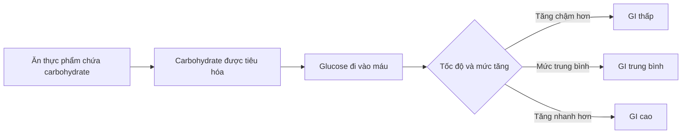
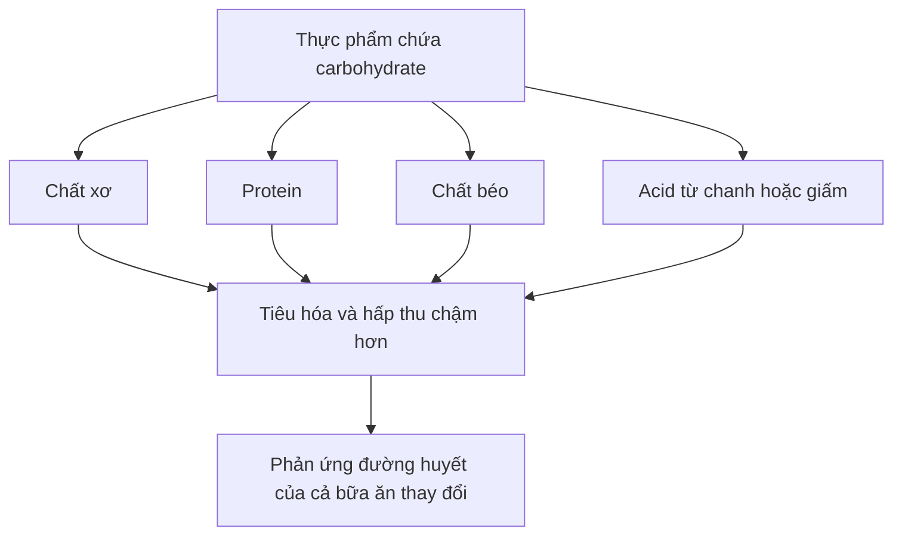
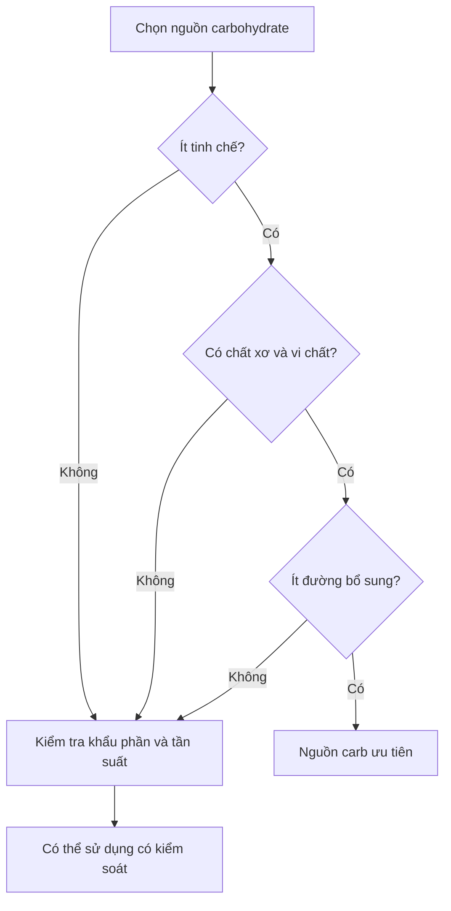
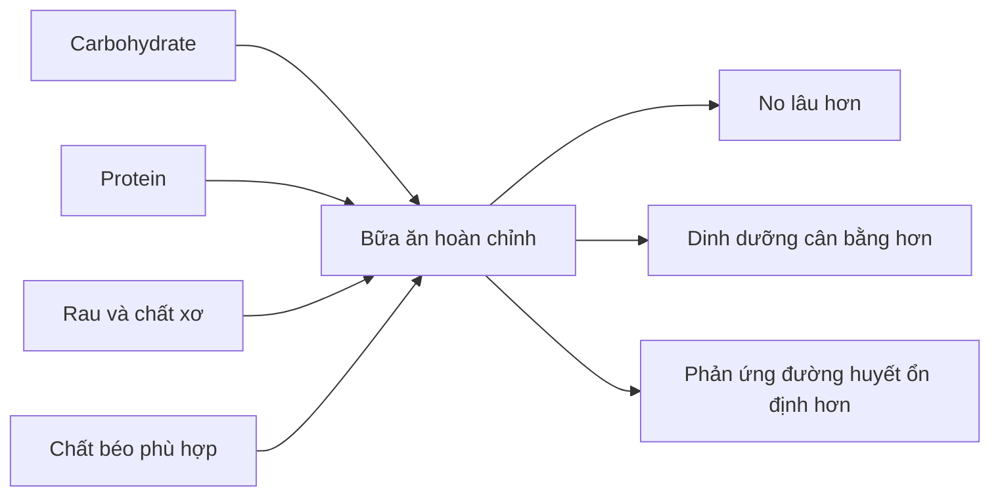

# 023 — Carbohydrate Quality

| Thuộc tính       | Nội dung                          |
| ---------------- | --------------------------------- |
| **Module**       | Module 02 — Meal Planning Basics  |
| **Bài học**      | Carbohydrate Quality              |
| **Thời lượng**   | 03:03                             |
| **Chủ đề chính** | Chất lượng của nguồn carbohydrate |


> **Hình minh họa:** Các nguồn carbohydrate gồm ngũ cốc, yến mạch, khoai, trái cây, đậu và rau củ.
> **Nguồn ảnh:** CDC — Choosing Healthy Carbs.

## Mục lục

1. [Mục tiêu bài học](#1-mục-tiêu-bài-học)
2. [Nội dung chính](#2-nội-dung-chính)
3. [Áp dụng thực tế](#3-áp-dụng-thực-tế)
4. [Lưu ý & lỗi thường gặp](#4-lưu-ý--lỗi-thường-gặp)
5. [Checklist thực hành](#5-checklist-thực-hành)
6. [Tóm tắt](#6-tóm-tắt)

---

## 1. Mục tiêu bài học

Sau khi hoàn thành bài học, bạn có thể:

* Hiểu **chất lượng carbohydrate** không chỉ được đánh giá bằng chỉ số đường huyết.
* Biết khái niệm **Glycemic Index — GI**, cách phân loại và giới hạn của nó.
* Phân biệt **GI** với **Glycemic Load — GL**.
* Nhận biết những đặc điểm của một nguồn carbohydrate có chất lượng tốt.
* Biết cách lựa chọn carbohydrate phù hợp với sức khỏe, mục tiêu hình thể và hoạt động tập luyện.
* Không quá ám ảnh với việc chia thực phẩm thành “carb nhanh” và “carb chậm”.

---

## 2. Nội dung chính

### 2.1. Chất lượng carbohydrate là gì?

“Chất lượng carbohydrate” có thể đề cập đến nhiều yếu tố khác nhau:

| Tiêu chí              | Câu hỏi cần đặt ra                                                  |
| --------------------- | ------------------------------------------------------------------- |
| **Mức độ chế biến**   | Thực phẩm còn gần với trạng thái tự nhiên hay đã bị tinh chế nhiều? |
| **Hàm lượng chất xơ** | Thực phẩm có cung cấp đủ chất xơ không?                             |
| **Mật độ dinh dưỡng** | Có vitamin, khoáng chất và hợp chất thực vật không?                 |
| **Đường bổ sung**     | Có chứa nhiều đường được thêm vào không?                            |
| **GI và GL**          | Tốc độ và mức độ ảnh hưởng đến đường huyết ra sao?                  |
| **Khẩu phần**         | Lượng carbohydrate thực tế trong một lần ăn là bao nhiêu?           |
| **Bối cảnh bữa ăn**   | Carb được ăn riêng hay kết hợp với protein, chất béo và rau?        |

Vì vậy, không nên chỉ nhìn vào một chỉ số duy nhất rồi kết luận một loại carbohydrate là “tốt” hoặc “xấu”.

---

### 2.2. Chỉ số đường huyết — Glycemic Index

**Glycemic Index — GI** là hệ thống xếp hạng thực phẩm chứa carbohydrate dựa trên mức độ làm tăng đường glucose trong máu sau khi ăn.

GI thường được biểu diễn trên thang từ 0 đến 100:

| Phân loại         | Giá trị GI | Đặc điểm chung                    |
| ----------------- | ---------: | --------------------------------- |
| **GI thấp**       |       ≤ 55 | Đường huyết thường tăng từ từ hơn |
| **GI trung bình** |      56–69 | Mức ảnh hưởng trung bình          |
| **GI cao**        |       ≥ 70 | Đường huyết thường tăng nhanh hơn |

GI phản ánh **phản ứng glucose trong máu**, chứ không phải là phép đo trực tiếp lượng insulin được tiết ra. Trong quy trình thử nghiệm tiêu chuẩn, người tham gia ăn một khẩu phần chứa khoảng **50 g carbohydrate tiêu hóa được**, sau đó phản ứng đường huyết trong khoảng hai giờ được so sánh với thực phẩm tham chiếu.



---

### 2.3. Ví dụ thực phẩm theo nhóm GI

> Giá trị GI của cùng một thực phẩm có thể thay đổi theo giống cây, độ chín, cách nấu, mức độ nghiền nhỏ và quy trình chế biến. Bảng dưới đây chỉ mang tính định hướng.

| Nhóm              | Một số ví dụ thường gặp                                                                   |
| ----------------- | ----------------------------------------------------------------------------------------- |
| **GI thấp**       | Đậu lăng, đậu gà, đậu đỏ, yến mạch nguyên hạt, một số loại trái cây, sữa chua không đường |
| **GI trung bình** | Một số loại gạo, ngô, khoai lang, bánh mì nguyên cám                                      |
| **GI cao**        | Bánh mì trắng, bánh gạo, ngũ cốc ăn sáng tinh chế, bánh kẹo, đồ uống nhiều đường          |

Các loại đậu thường có GI thấp nhờ chứa nhiều chất xơ và một lượng protein đáng kể. Trong khi đó, nhiều sản phẩm từ bột tinh chế hoặc đường bổ sung có xu hướng được tiêu hóa nhanh hơn.

Tuy nhiên, không phải mọi thực phẩm có GI thấp đều giàu dinh dưỡng và cũng không phải mọi thực phẩm GI cao đều cần bị loại bỏ.

---

### 2.4. Điều gì làm thay đổi GI?

GI không phải là một con số hoàn toàn cố định. Nó chịu ảnh hưởng bởi nhiều yếu tố:

#### Mức độ chế biến

Ngũ cốc được xay quá mịn hoặc loại bỏ cám và mầm thường được tiêu hóa nhanh hơn ngũ cốc còn nguyên cấu trúc.

Ví dụ:

```text
Hạt yến mạch nguyên hoặc cán dẹt
               ↓ chế biến
Yến mạch ăn liền nghiền nhỏ
               ↓ tiêu hóa nhanh hơn
Phản ứng đường huyết có thể cao hơn
```

#### Hàm lượng chất xơ

Chất xơ làm chậm quá trình tiêu hóa và hấp thu carbohydrate, qua đó giúp đường huyết tăng từ từ hơn. Nguồn chất xơ tốt gồm ngũ cốc nguyên hạt, rau, trái cây nguyên quả, các loại đậu, hạt và quả hạch.


> **Hình minh họa:** Trái cây, rau, đậu, yến mạch, các loại hạt và ngũ cốc nguyên hạt là những nguồn chất xơ phổ biến.
> **Nguồn ảnh:** Harvard T.H. Chan School of Public Health.

#### Cấu trúc vật lý

Một hạt ngũ cốc nguyên vẹn thường mất nhiều thời gian tiêu hóa hơn bột ngũ cốc đã được nghiền mịn.

Ví dụ:

* Hạt lúa mì nguyên vẹn.
* Bulgur hoặc yến mạch cán.
* Bánh mì làm từ bột nghiền mịn.

Cả ba đều có thể được gọi là “ngũ cốc”, nhưng tốc độ tiêu hóa không hoàn toàn giống nhau.

#### Độ chín

Trái cây chín kỹ thường có nhiều tinh bột được chuyển hóa thành đường hơn, vì vậy có thể tạo phản ứng đường huyết nhanh hơn trái cây chưa chín hoàn toàn.

#### Cách nấu

Nấu thực phẩm quá mềm có thể làm cấu trúc tinh bột dễ tiêu hóa hơn.

Ví dụ:

* Mì nấu vừa chín thường được tiêu hóa chậm hơn mì nấu quá mềm.
* Khoai được nghiền nhuyễn có thể được tiêu hóa nhanh hơn khoai để nguyên miếng.
* Một số loại cơm hoặc khoai sau khi nấu chín rồi để nguội có thể hình thành thêm **tinh bột kháng**.

#### Thành phần của toàn bộ bữa ăn

Protein, chất béo, chất xơ và acid trong thực phẩm có thể làm chậm quá trình làm rỗng dạ dày và hấp thu glucose. Harvard cũng lưu ý rằng chất xơ, chất béo, độ acid và mức độ chế biến đều có thể ảnh hưởng đến GI thực tế của thực phẩm.



---

### 2.5. Hạn chế của chỉ số GI

GI là một khái niệm hữu ích nhưng không mô tả đầy đủ chất lượng của một bữa ăn.

#### GI được đo trong điều kiện kiểm soát

Thông thường, thực phẩm được thử nghiệm riêng biệt với một lượng carbohydrate tiêu hóa được cố định. Trong thực tế, chúng ta thường ăn carbohydrate cùng với:

* Protein.
* Chất béo.
* Rau và chất xơ.
* Nước sốt hoặc thực phẩm có tính acid.
* Nhiều loại carbohydrate khác nhau.

Vì vậy, phản ứng của một bữa ăn hỗn hợp có thể khác với GI của từng thực phẩm khi được thử nghiệm riêng.

#### GI không tính đến khẩu phần

GI cho biết **chất lượng hoặc tốc độ phản ứng**, nhưng không cho biết bạn thực sự ăn bao nhiêu carbohydrate.

Ví dụ, một loại thực phẩm có GI cao nhưng khẩu phần chỉ cung cấp ít carbohydrate có thể tạo tổng tác động đường huyết không quá lớn.

#### Mỗi người có thể phản ứng khác nhau

Phản ứng đường huyết có thể bị ảnh hưởng bởi:

* Độ nhạy insulin.
* Khối lượng cơ.
* Hoạt động thể chất.
* Giấc ngủ.
* Stress.
* Thời điểm ăn.
* Bữa ăn trước đó.
* Tình trạng sức khỏe.

Do đó, GI không nên được xem là một con số tuyệt đối áp dụng giống nhau cho tất cả mọi người.

---

### 2.6. Glycemic Load — tải lượng đường huyết

**Glycemic Load — GL** kết hợp hai yếu tố:

1. GI của thực phẩm.
2. Lượng carbohydrate tiêu hóa được trong khẩu phần thực tế.

Công thức:

[
GL = \frac{GI \times \text{carbohydrate tiêu hóa được trong khẩu phần}}{100}
]

Ví dụ giả định:

* Một thực phẩm có GI bằng 70.
* Khẩu phần cung cấp 10 g carbohydrate tiêu hóa được.

[
GL = \frac{70 \times 10}{100}=7
]

Mặc dù GI tương đối cao, GL của khẩu phần vẫn thấp vì lượng carbohydrate thực tế không lớn.

| Mức GL         | Giá trị tham khảo |
| -------------- | ----------------: |
| **Thấp**       |              ≤ 10 |
| **Trung bình** |             11–19 |
| **Cao**        |              ≥ 20 |

GL thường phản ánh tác động của **khẩu phần thực tế** tốt hơn so với chỉ nhìn vào GI.

---

### 2.7. Cách đánh giá một nguồn carbohydrate tốt

Thay vì chỉ hỏi “GI bao nhiêu?”, hãy sử dụng nhiều tiêu chí cùng lúc.



Một nguồn carbohydrate có chất lượng tốt thường:

* Ít bị tinh chế.
* Giữ được cấu trúc tự nhiên.
* Có chất xơ.
* Cung cấp vitamin và khoáng chất.
* Có ít đường bổ sung.
* Giúp no lâu.
* Phù hợp với nhu cầu năng lượng và khả năng tiêu hóa.
* Được ăn với khẩu phần hợp lý.

---

### 2.8. Những nguồn carbohydrate nên ưu tiên

#### Ngũ cốc nguyên hạt

Ví dụ:

* Yến mạch.
* Gạo lứt.
* Lúa mạch.
* Hạt kê.
* Kiều mạch.
* Quinoa.
* Bánh mì nguyên cám.
* Mì nguyên cám.

Ngũ cốc nguyên hạt giữ lại phần cám, mầm và nội nhũ. Chúng thường cung cấp nhiều chất xơ và vi chất hơn các loại ngũ cốc tinh chế.


> **Hình minh họa:** Mì nguyên cám và hạt lúa mì.
> **Nguồn ảnh:** CDC.

#### Các loại đậu

Ví dụ:

* Đậu đen.
* Đậu đỏ.
* Đậu gà.
* Đậu lăng.
* Đậu Hà Lan.
* Đậu nành.

Các loại đậu cung cấp carbohydrate, chất xơ, protein thực vật và nhiều khoáng chất.

#### Rau củ giàu tinh bột

Ví dụ:

* Khoai tây.
* Khoai lang.
* Bí đỏ.
* Ngô.
* Khoai môn.
* Sắn.

Khoai tây không tự động trở thành thực phẩm “xấu” chỉ vì có thể có GI tương đối cao. Chất lượng của món ăn còn phụ thuộc vào:

* Cách chế biến.
* Có giữ vỏ hay không.
* Khẩu phần.
* Lượng dầu mỡ.
* Thực phẩm ăn kèm.

Khoai luộc ăn cùng protein và rau khác hoàn toàn với khoai chiên dùng kèm nước ngọt.

#### Trái cây nguyên quả

Trái cây nguyên quả cung cấp:

* Carbohydrate tự nhiên.
* Chất xơ.
* Nước.
* Vitamin.
* Khoáng chất.
* Hợp chất thực vật.

Nên ưu tiên trái cây nguyên quả hơn nước ép vì quá trình ép làm giảm chất xơ và khiến việc tiêu thụ một lượng đường lớn trong thời gian ngắn trở nên dễ dàng hơn.

#### Rau không chứa nhiều tinh bột

Rau thường không cung cấp quá nhiều carbohydrate nhưng lại đóng vai trò quan trọng trong chất lượng tổng thể của bữa ăn nhờ:

* Chất xơ.
* Vitamin.
* Khoáng chất.
* Thể tích thực phẩm lớn.
* Khả năng hỗ trợ cảm giác no.

---

### 2.9. Có cần tránh hoàn toàn carb tinh chế không?

Không nhất thiết.

Những thực phẩm như:

* Cơm trắng.
* Bánh mì trắng.
* Mì trắng.
* Ngũ cốc ít chất xơ.
* Đồ ngọt.

vẫn có thể xuất hiện trong chế độ ăn, miễn là:

* Tổng lượng calorie được kiểm soát.
* Phần lớn chế độ ăn vẫn giàu dinh dưỡng.
* Khẩu phần phù hợp.
* Không thay thế hoàn toàn rau, trái cây, đậu và ngũ cốc nguyên hạt.
* Không gây vấn đề về tiêu hóa hoặc kiểm soát đường huyết.

Đối với người tập luyện, carbohydrate ít chất xơ đôi khi còn hữu ích vì dễ tiêu hóa hơn, đặc biệt khi ăn gần buổi tập.

---

## 3. Áp dụng thực tế

### 3.1. Quy tắc 80–90%

Một quy tắc thực hành đơn giản của khóa học là lấy khoảng **80–90% lượng carbohydrate** từ các nguồn:

* Ít tinh chế.
* Giàu chất xơ.
* Giàu vi chất.
* Gần với trạng thái tự nhiên.

Khoảng còn lại có thể linh hoạt dành cho:

* Món ăn yêu thích.
* Thực phẩm tiện lợi.
* Carb dễ tiêu hóa quanh buổi tập.
* Các dịp ăn uống xã hội.

> Đây là nguyên tắc linh hoạt, không phải tỷ lệ y khoa bắt buộc cho tất cả mọi người.

---

### 3.2. Xây dựng một bữa ăn hoàn chỉnh

Công thức đơn giản:

[
\text{Carbohydrate}+\text{Protein}+\text{Rau}+\text{Chất béo phù hợp}
]

Ví dụ:

| Thành phần       | Lựa chọn                           |
| ---------------- | ---------------------------------- |
| **Carbohydrate** | Cơm, khoai, yến mạch, mì, bánh mì  |
| **Protein**      | Thịt, cá, trứng, sữa chua, đậu phụ |
| **Rau**          | Rau cải, súp lơ, cà rốt, salad     |
| **Chất béo**     | Dầu ô liu, quả bơ, các loại hạt    |



---

### 3.3. Ví dụ bữa sáng

* Yến mạch.
* Sữa chua không đường hoặc sữa.
* Chuối hoặc các loại quả mọng.
* Một ít hạt.

**Ưu điểm:**

* Có carbohydrate.
* Có protein.
* Có chất xơ.
* Có chất béo.
* Dễ điều chỉnh khẩu phần.

---

### 3.4. Ví dụ bữa trưa hoặc tối

* Cơm trắng hoặc cơm gạo lứt.
* Thịt gà, cá, thịt nạc hoặc đậu phụ.
* Một đĩa rau.
* Một lượng dầu hoặc chất béo phù hợp.

Cơm trắng vẫn có thể nằm trong một bữa ăn tốt nếu được kết hợp với đủ protein, rau và khẩu phần phù hợp.

---

### 3.5. Trước khi tập luyện

Gần buổi tập, thực phẩm quá nhiều chất xơ hoặc chất béo có thể gây:

* Đầy bụng.
* Chậm tiêu.
* Khó chịu khi vận động.
* Giảm khả năng ăn đủ năng lượng.

Một bữa ăn trước tập có thể sử dụng carbohydrate dễ tiêu hóa hơn:

* Cơm trắng.
* Bánh mì.
* Chuối chín.
* Ngũ cốc ít chất xơ.
* Khoai đã nấu chín.

Ví dụ:

```text
Cơm trắng + ức gà + một lượng rau vừa phải
```

hoặc:

```text
Bánh mì + sữa chua + chuối
```

Trong tình huống này, carbohydrate GI cao hơn không nhất thiết là lựa chọn kém.

---

### 3.6. Sau khi tập luyện

Sau tập, mục tiêu là:

* Bổ sung năng lượng.
* Cung cấp carbohydrate.
* Cung cấp protein.
* Hỗ trợ phục hồi.

Ví dụ:

* Cơm + cá + rau.
* Khoai + thịt nạc.
* Yến mạch + whey hoặc sữa chua.
* Bánh mì + trứng + trái cây.

Không cần tìm một loại carbohydrate có GI hoàn hảo. Tổng lượng carbohydrate và protein trong ngày thường quan trọng hơn việc tối ưu từng con số GI riêng lẻ.

---

### 3.7. Bảng thay thế thực phẩm

| Thay vì dùng thường xuyên   | Có thể ưu tiên                                        |
| --------------------------- | ----------------------------------------------------- |
| Nước ép trái cây            | Trái cây nguyên quả                                   |
| Ngũ cốc ăn sáng nhiều đường | Yến mạch hoặc ngũ cốc ít đường                        |
| Bánh mì trắng ít chất xơ    | Bánh mì nguyên cám                                    |
| Bánh kẹo                    | Trái cây, sữa chua hoặc chocolate khẩu phần nhỏ       |
| Khoai tây chiên             | Khoai luộc, hấp hoặc nướng                            |
| Mì ăn liền không rau        | Mì kết hợp trứng, thịt và rau                         |
| Nước ngọt                   | Nước lọc, trà không đường hoặc nước có ga không đường |

---

## 4. Lưu ý & lỗi thường gặp

### Lỗi 1: Cho rằng GI đo trực tiếp insulin

GI chủ yếu được xác định bằng **phản ứng glucose trong máu** sau khi ăn một lượng carbohydrate tiêu chuẩn.

Insulin có liên quan đến phản ứng chuyển hóa nhưng GI không phải là một phép đo trực tiếp lượng insulin.

---

### Lỗi 2: Cho rằng GI cao luôn có hại

GI cao không đồng nghĩa với:

* Tự động tăng mỡ.
* Không thể giảm cân.
* Làm mất cơ.
* Khiến chế độ ăn thất bại.

Việc tăng hoặc giảm mỡ vẫn phụ thuộc rất lớn vào:

* Tổng calorie.
* Tổng lượng thức ăn.
* Mức vận động.
* Khả năng duy trì chế độ ăn.
* Chất lượng tổng thể của chế độ ăn.

---

### Lỗi 3: Chỉ nhìn GI mà không nhìn khẩu phần

Một loại thực phẩm có GI trung bình nhưng được ăn với khẩu phần rất lớn vẫn có thể cung cấp lượng carbohydrate cao.

Ngược lại, một thực phẩm GI cao được ăn với lượng nhỏ có thể tạo tổng tác động không quá lớn.

Khi cần đánh giá cụ thể hơn, hãy xét cả **GI, GL và khẩu phần**.

---

### Lỗi 4: Tin rằng mọi loại carb phức đều tốt

Bánh mì trắng và nhiều loại ngũ cốc tinh chế vẫn chứa tinh bột phức, nhưng có thể:

* Ít chất xơ.
* Ít vi chất.
* Dễ ăn quá nhiều.
* Được tiêu hóa tương đối nhanh.

Cấu trúc hóa học “phức” không tự động đồng nghĩa với chất lượng dinh dưỡng cao.

---

### Lỗi 5: Cho rằng mọi loại đường đều giống nhau

Đường trong một quả cam đi kèm với:

* Chất xơ.
* Nước.
* Vitamin.
* Cấu trúc tế bào thực vật.

Đường trong nước ngọt chủ yếu đi kèm với nước và năng lượng, gần như không có chất xơ.

Do đó, không nên đánh giá thực phẩm chỉ dựa trên số gram đường mà bỏ qua toàn bộ cấu trúc và giá trị dinh dưỡng.

---

### Lỗi 6: Cho rằng các loại hạt là nguồn carb chính

Quả hạch như hạnh nhân, óc chó và hạt điều có GI thấp hoặc phản ứng đường huyết nhỏ, nhưng chúng chủ yếu cung cấp:

* Chất béo.
* Một phần protein.
* Chất xơ.

Chúng không phải nguồn carbohydrate chính tương tự cơm, yến mạch, khoai hoặc bánh mì.

---

### Lỗi 7: Nghĩ rằng mọi người đều cần tránh GI cao

Người có:

* Đái tháo đường.
* Tiền đái tháo đường.
* Rối loạn kiểm soát đường huyết.
* Một số bệnh lý chuyển hóa.

có thể cần chú ý nhiều hơn đến lượng carbohydrate, khẩu phần, GI hoặc GL theo hướng dẫn của bác sĩ hoặc chuyên gia dinh dưỡng.

Không nên áp dụng kết luận “GI không quan trọng” cho mọi đối tượng.

---

### Lỗi 8: Ép bản thân chỉ ăn cơm gạo lứt

Gạo lứt có nhiều chất xơ hơn nhưng không phải lúc nào cũng phù hợp hơn.

Cơm trắng có thể hữu ích khi:

* Bạn cần thực phẩm dễ tiêu hóa.
* Ăn gần buổi tập.
* Có hệ tiêu hóa nhạy cảm.
* Đã nhận đủ chất xơ từ rau, trái cây và các thực phẩm khác.
* Muốn xây dựng chế độ ăn dễ duy trì.

Hãy xem xét toàn bộ chế độ ăn thay vì đánh giá một loại thực phẩm riêng lẻ.

---

### Lỗi 9: Tăng chất xơ quá nhanh

Nếu trước đây ăn ít rau và ngũ cốc nguyên hạt, việc tăng chất xơ đột ngột có thể gây:

* Đầy hơi.
* Chướng bụng.
* Khó tiêu.
* Thay đổi nhu động ruột.

Nên tăng từ từ và uống đủ nước.

---

## 5. Checklist thực hành

### Khi mua thực phẩm

* [ ] Thành phần đầu tiên có phải là ngũ cốc nguyên hạt không?
* [ ] Sản phẩm có cung cấp chất xơ không?
* [ ] Có quá nhiều đường bổ sung không?
* [ ] Thực phẩm còn gần với dạng tự nhiên hay đã tinh chế mạnh?
* [ ] Tôi có thực sự thích và duy trì được loại thực phẩm này không?

### Khi xây dựng bữa ăn

* [ ] Có một nguồn carbohydrate phù hợp với nhu cầu năng lượng.
* [ ] Có một nguồn protein.
* [ ] Có rau hoặc trái cây.
* [ ] Có lượng chất béo phù hợp.
* [ ] Khẩu phần phù hợp với mục tiêu calorie.
* [ ] Không đánh giá bữa ăn chỉ bằng GI của một thành phần.
* [ ] Điều chỉnh chất xơ theo thời điểm tập luyện và khả năng tiêu hóa.

### Đánh giá nhanh nguồn carbohydrate

```text
☐ Ít tinh chế
☐ Có chất xơ
☐ Có vitamin và khoáng chất
☐ Ít đường bổ sung
☐ Khẩu phần phù hợp
☐ Ăn kèm protein hoặc thực phẩm giàu dinh dưỡng
☐ Phù hợp với khả năng tiêu hóa
☐ Phù hợp với thời điểm tập luyện
```

---

## 6. Tóm tắt

* **Chất lượng carbohydrate** không chỉ được quyết định bởi chỉ số GI.
* GI cho biết tốc độ và mức độ một thực phẩm chứa carbohydrate làm tăng glucose trong máu trong điều kiện thử nghiệm tiêu chuẩn.
* GI thấp thường từ **55 trở xuống**, GI trung bình từ **56–69** và GI cao từ **70 trở lên**.
* GI không tính đến khẩu phần; **GL** kết hợp GI với lượng carbohydrate thực tế.
* Chất xơ, mức độ chế biến, cách nấu, độ chín và thành phần của cả bữa ăn đều có thể làm thay đổi phản ứng đường huyết.
* Nên ưu tiên các nguồn carbohydrate ít tinh chế, giàu chất xơ và giàu vi chất như ngũ cốc nguyên hạt, các loại đậu, rau củ và trái cây nguyên quả.
* Cơm trắng, bánh mì hoặc các nguồn carb dễ tiêu hóa vẫn có thể phù hợp, đặc biệt quanh buổi tập.
* Đừng quá ám ảnh với “carb nhanh” và “carb chậm”. Hãy tập trung vào **tổng calorie, khẩu phần, chất xơ, dinh dưỡng tổng thể và khả năng duy trì chế độ ăn**.

> **Nguyên tắc ghi nhớ:**
> **Ưu tiên thực phẩm ít tinh chế, kết hợp carbohydrate với protein và rau, kiểm soát khẩu phần và đừng để một con số GI quyết định toàn bộ chế độ ăn.**

---

# Bài luyện tập

## Mục tiêu


## Đề bài


## Yêu cầu hoàn thành

- [ ] 
- [ ] 
- [ ] 

## Kết quả / lời giải


## Ghi chú
