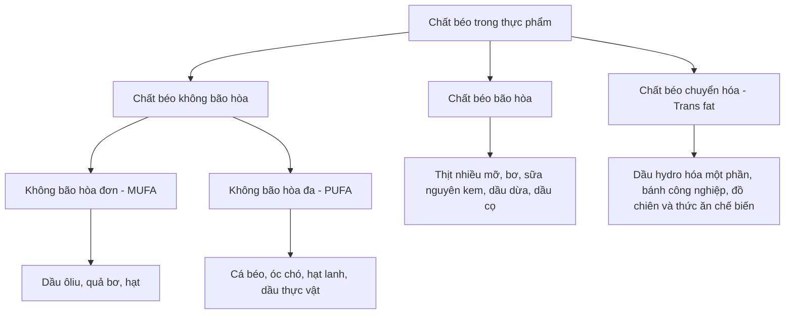

# 024 — Fat Quality

| Thuộc tính       | Nội dung                         |
| ---------------- | -------------------------------- |
| **Module**       | Module 02 — Meal Planning Basics |
| **Bài học**      | Fat Quality                      |
| **Thời lượng**   | 01:23                            |
| **Chủ đề chính** | Chất lượng của nguồn chất béo    |

> **Ý chính:** Đối với tăng cơ hoặc giảm mỡ, tổng lượng calorie và lượng chất béo phù hợp vẫn là nền tảng. Tuy nhiên, **loại chất béo được lựa chọn** có ảnh hưởng đáng kể đến sức khỏe tim mạch, cholesterol và chất lượng chế độ ăn lâu dài.

## Mục lục

1. [Mục tiêu bài học](#1-mục-tiêu-bài-học)
2. [Nội dung chính](#2-nội-dung-chính)
3. [Áp dụng thực tế](#3-áp-dụng-thực-tế)
4. [Lưu ý & lỗi thường gặp](#4-lưu-ý--lỗi-thường-gặp)
5. [Checklist thực hành](#5-checklist-thực-hành)
6. [Tóm tắt](#6-tóm-tắt)

---

## 1. Mục tiêu bài học

Sau bài học này, bạn có thể:

* Phân biệt **chất béo không bão hòa**, **chất béo bão hòa** và **trans fat**.
* Biết những nguồn chất béo nên ưu tiên trong chế độ ăn hằng ngày.
* Hiểu vì sao chất béo bão hòa nên được kiểm soát thay vì sử dụng tùy ý.
* Nhận diện thực phẩm có khả năng chứa chất béo chuyển hóa công nghiệp.
* Biết cách thay thế nguồn chất béo kém chất lượng bằng lựa chọn phù hợp hơn.

---

## 2. Nội dung chính

### 2.1. Chất lượng chất béo có quan trọng không?

Trong phạm vi tăng cơ và giảm mỡ, tác giả bài học cho rằng chất lượng chất béo thường ít ảnh hưởng trực tiếp đến kết quả hơn:

* Tổng lượng calorie.
* Lượng protein hằng ngày.
* Tổng lượng chất béo.
* Khả năng duy trì chế độ ăn.

Tuy nhiên, điều này **không có nghĩa mọi loại chất béo đều giống nhau**. Một chế độ ăn nên ưu tiên chất béo không bão hòa, hạn chế chất béo bão hòa và tránh chất béo chuyển hóa công nghiệp. Đây cũng là định hướng chung của WHO, American Heart Association và Harvard T.H. Chan School of Public Health. ([www.heart.org][1])

### Sơ đồ phân loại chất béo



---

### 2.2. Chất béo không bão hòa đơn — MUFA

**Monounsaturated fat — MUFA** là nhóm nên được ưu tiên trong chế độ ăn.

Nguồn phổ biến:

* Dầu ôliu.
* Quả bơ.
* Hạnh nhân, hạt điều và đậu phộng.
* Một số loại hạt và bơ hạt.
* Dầu hạt cải.

Khi được dùng để thay thế thực phẩm giàu chất béo bão hòa, chất béo không bão hòa có thể giúp cải thiện cholesterol máu và giảm nguy cơ bệnh tim mạch. ([www.heart.org][2])

[](https://commons.wikimedia.org/wiki/File:Avocado_open.jpg)

*Minh họa: Quả bơ là nguồn chất béo không bão hòa đơn. Ảnh: Wikimedia Commons.*

---

### 2.3. Chất béo không bão hòa đa — PUFA

**Polyunsaturated fat — PUFA** bao gồm hai nhóm được biết đến nhiều nhất:

* **Omega-3.**
* **Omega-6.**

Nguồn PUFA thường gặp:

| Nguồn thực phẩm          | Thành phần nổi bật           |
| ------------------------ | ---------------------------- |
| Cá hồi, cá mòi, cá thu   | Omega-3 EPA và DHA           |
| Hạt lanh, hạt chia       | Omega-3 ALA                  |
| Óc chó                   | PUFA và ALA                  |
| Dầu đậu nành             | Omega-6 và một lượng omega-3 |
| Dầu hướng dương, dầu ngô | Chủ yếu là omega-6           |

Chất béo không bão hòa đa có thể được sử dụng để thay thế một phần chất béo bão hòa. WHO khuyến nghị thay chất béo bão hòa và trans fat bằng PUFA, MUFA có nguồn gốc thực vật hoặc carbohydrate từ thực phẩm giàu chất xơ tự nhiên. ([World Health Organization][3])

[](https://commons.wikimedia.org/wiki/File:Walnuts_whole_and_open.jpg)

*Minh họa: Quả óc chó cung cấp chất béo không bão hòa đa. Ảnh: Wikimedia Commons.*

---

### 2.4. Dầu thực vật không phải loại nào cũng giống nhau

Một số dầu thực vật giàu chất béo không bão hòa:

* Dầu ôliu.
* Dầu hạt cải.
* Dầu đậu nành.
* Dầu hướng dương.
* Dầu ngô.

Tuy nhiên, không nên hiểu rằng **mọi dầu có nguồn gốc thực vật đều mặc nhiên tốt hơn**. Dầu dừa và dầu cọ có nguồn gốc thực vật nhưng chứa tỷ lệ chất béo bão hòa tương đối cao. ([www.heart.org][1])

[](https://commons.wikimedia.org/wiki/File:Bottle_of_olive_oil.jpg)

*Minh họa: Dầu ôliu thường giàu chất béo không bão hòa đơn. Ảnh: Wikimedia Commons.*

---

### 2.5. Chất béo bão hòa

Nguồn chất béo bão hòa thường gặp:

* Thịt bò, thịt heo và thịt gia cầm có nhiều mỡ.
* Da động vật.
* Xúc xích, thịt xông khói và thịt chế biến.
* Bơ động vật.
* Phô mai và sữa nguyên kem.
* Dầu dừa.
* Dầu cọ.

Không nhất thiết phải loại bỏ hoàn toàn trứng, phô mai, bơ hoặc thịt khỏi chế độ ăn. Điều quan trọng là:

1. Kiểm soát tổng lượng tiêu thụ.
2. Ưu tiên phần thịt nạc.
3. Không để chúng trở thành nguồn chất béo chính trong mọi bữa ăn.
4. Thường xuyên thay thế bằng cá, hạt, quả bơ và dầu không bão hòa.

WHO khuyến nghị chất béo bão hòa không nên cung cấp quá **10% tổng năng lượng hằng ngày**. ([World Health Organization][4])

> [!IMPORTANT]
> **Dầu dừa không phải thực phẩm có thể sử dụng không giới hạn.**
> Dầu dừa vẫn là nguồn giàu chất béo bão hòa. Có thể dùng với lượng vừa phải để tạo hương vị, nhưng không nên mặc định rằng nó tốt hơn dầu ôliu, dầu hạt cải hoặc các dầu giàu chất béo không bão hòa. ([www.heart.org][5])

---

### 2.6. Chất béo chuyển hóa — Trans fat

**Trans fat** là nhóm cần hạn chế mạnh nhất, đặc biệt là trans fat được tạo ra trong công nghiệp bằng quá trình hydro hóa một phần dầu thực vật.

Nguồn có thể gặp:

* Dầu thực vật hydro hóa một phần.
* Shortening.
* Một số loại margarine dạng rắn.
* Bánh quy, bánh ngọt và kem phủ bánh sản xuất công nghiệp.
* Bột làm bánh hoặc đế bánh đông lạnh.
* Đồ ăn nhanh và thực phẩm chiên đi chiên lại.
* Một số loại snack và thực phẩm siêu chế biến.

Trans fat công nghiệp làm tăng nguy cơ bệnh tim mạch. WHO khuyến nghị lượng trans fat nên dưới **1% tổng năng lượng**, tương đương dưới khoảng **2,2 g/ngày** đối với chế độ ăn 2.000 kcal. ([World Health Organization][6])

[](https://commons.wikimedia.org/wiki/File:Avoiding_Trans_Fat.png)

*Minh họa: Kiểm tra bảng dinh dưỡng và danh sách thành phần để nhận diện trans fat. Ảnh: U.S. FDA/Wikimedia Commons.*

---

### 2.7. Thứ tự ưu tiên khi lựa chọn chất béo

```text
Ưu tiên thường xuyên
        ↓
Dầu ôliu, cá béo, quả bơ, hạt và các loại quả hạch
        ↓
Trứng, thịt nạc và sữa phù hợp với khẩu phần
        ↓
Bơ, phô mai nhiều béo, thịt nhiều mỡ, dầu dừa và dầu cọ
        ↓
Hạn chế tối đa
        ↓
Dầu hydro hóa một phần và trans fat công nghiệp
```

| Mức ưu tiên           | Nhóm chất béo         | Cách sử dụng                  |
| --------------------- | --------------------- | ----------------------------- |
| 🟢 **Ưu tiên**        | MUFA và PUFA          | Dùng làm nguồn chất béo chính |
| 🟡 **Kiểm soát**      | Chất béo bão hòa      | Ăn với lượng vừa phải         |
| 🔴 **Hạn chế tối đa** | Trans fat công nghiệp | Kiểm tra và tránh khi có thể  |

---

## 3. Áp dụng thực tế

### 3.1. Công thức lựa chọn nguồn chất béo

Mỗi ngày, hãy ưu tiên từ hai đến ba nhóm:

* Một lượng vừa phải dầu ôliu hoặc dầu hạt cải.
* Một khẩu phần hạt hoặc bơ hạt không thêm đường.
* Cá béo vài bữa mỗi tuần.
* Quả bơ tùy theo tổng calorie.
* Trứng và sản phẩm từ sữa theo khẩu phần phù hợp.

Chất béo chứa khoảng **9 kcal mỗi gram**, vì vậy thực phẩm giàu chất béo dù có chất lượng tốt vẫn có mật độ năng lượng cao.

---

### 3.2. Các phép thay thế đơn giản

| Thay vì                               | Có thể chọn                                       |
| ------------------------------------- | ------------------------------------------------- |
| Chiên bằng nhiều bơ                   | Dùng một lượng vừa phải dầu ôliu hoặc dầu hạt cải |
| Thịt có nhiều mỡ                      | Thịt nạc, cá hoặc đậu phụ                         |
| Snack chiên                           | Một khẩu phần nhỏ hạt không tẩm đường             |
| Sốt kem nhiều béo                     | Sốt từ sữa chua hoặc dầu ôliu                     |
| Ăn bánh ngọt công nghiệp thường xuyên | Trái cây, sữa chua hoặc món tự chế                |
| Dùng dầu dừa cho mọi món              | Luân phiên với dầu giàu chất béo không bão hòa    |
| Margarine chứa dầu hydro hóa          | Sản phẩm không chứa dầu hydro hóa một phần        |

---

### 3.3. Ví dụ một ngày ăn chất béo chất lượng tốt

#### Bữa sáng

* Yến mạch.
* Sữa chua.
* Hạt chia hoặc óc chó.
* Trái cây.

#### Bữa trưa

* Cơm hoặc khoai.
* Ức gà hay đậu phụ.
* Rau xanh.
* Một lượng nhỏ dầu ôliu trong món salad.

#### Bữa phụ

* Một quả táo.
* Một khẩu phần nhỏ hạnh nhân.

#### Bữa tối

* Cá hồi hoặc cá thu.
* Khoai lang.
* Rau củ hấp hoặc áp chảo.

> Khẩu phần cụ thể cần được điều chỉnh theo mục tiêu calorie và lượng chất béo hằng ngày của từng người.

---

### 3.4. Cách đọc nhãn thực phẩm

Khi mua thực phẩm đóng gói:

1. Xem lượng **saturated fat** và **trans fat**.
2. Kiểm tra khẩu phần được nhà sản xuất sử dụng trên nhãn.
3. Đọc danh sách thành phần.
4. Tìm các cụm như:

   * `Partially hydrogenated oil`
   * `Partially hydrogenated vegetable oil`
   * `Dầu thực vật hydro hóa một phần`
5. Không chỉ nhìn vào tổng lượng chất béo.

Ở một số hệ thống ghi nhãn, sản phẩm có lượng trans fat rất thấp trong mỗi khẩu phần vẫn có thể được làm tròn thành `0 g`; vì vậy danh sách thành phần vẫn rất quan trọng. ([www.heart.org][7])

---

## 4. Lưu ý & lỗi thường gặp

### Lỗi 1: Cho rằng mọi chất béo đều gây tăng mỡ

Mỡ cơ thể tăng khi tổng năng lượng nạp vào thường xuyên vượt quá năng lượng tiêu hao. Tuy nhiên, vì chất béo có mật độ calorie cao nên rất dễ ăn quá nhiều nếu không kiểm soát khẩu phần.

---

### Lỗi 2: Loại bỏ hoàn toàn chất béo

Chế độ ăn không cần phải cực kỳ ít chất béo. Chất béo tham gia vào nhiều chức năng sinh lý và giúp hấp thu các vitamin tan trong chất béo.

Mục tiêu nên là:

```text
Đủ lượng chất béo
        +
Ưu tiên nguồn không bão hòa
        +
Kiểm soát tổng calorie
```

---

### Lỗi 3: Nghĩ thực phẩm “healthy fat” có thể ăn không giới hạn

Hạt, bơ hạt, quả bơ và dầu ôliu là lựa chọn tốt, nhưng vẫn giàu calorie.

Ví dụ, việc rót dầu trực tiếp vào chảo hoặc salad mà không ước lượng có thể làm tổng calorie tăng nhanh.

---

### Lỗi 4: Coi dầu dừa là chất béo tốt tuyệt đối

Dầu dừa có thể xuất hiện trong chế độ ăn, nhưng nó chứa nhiều chất béo bão hòa. Không nên dùng dầu dừa để thay thế hoàn toàn dầu ôliu, dầu hạt cải hoặc các nguồn PUFA.

---

### Lỗi 5: Chỉ nhìn dòng “0 g trans fat”

Hãy đọc thêm danh sách thành phần. Nếu xuất hiện **dầu hydro hóa một phần**, sản phẩm vẫn có khả năng chứa một lượng trans fat nhất định.

---

### Lỗi 6: Cho rằng “grass-fed” đồng nghĩa với ăn bao nhiêu cũng được

Thịt bò nuôi cỏ có thể khác đôi chút về thành phần dinh dưỡng, nhưng vẫn có thể cung cấp chất béo bão hòa. Nhãn “grass-fed” không thay thế cho việc kiểm soát khẩu phần, lựa chọn phần thịt nạc và cân đối toàn bộ chế độ ăn.

---

### Lỗi 7: Tránh hoàn toàn omega-6

Omega-6 là một nhóm acid béo cần thiết. Vấn đề không phải là loại bỏ omega-6, mà là xây dựng chế độ ăn đa dạng, có thêm cá, hạt lanh, hạt chia và những nguồn omega-3 phù hợp.

---

## 5. Checklist thực hành

### Khi lên thực đơn

* [ ] Phần lớn chất béo đến từ dầu không bão hòa, cá, quả bơ và các loại hạt.
* [ ] Có ít nhất một nguồn omega-3 trong kế hoạch ăn uống.
* [ ] Thịt nhiều mỡ, bơ và phô mai được kiểm soát khẩu phần.
* [ ] Dầu dừa và dầu cọ không phải nguồn dầu duy nhất.
* [ ] Tổng lượng chất béo phù hợp với mục tiêu calorie.

### Khi mua thực phẩm

* [ ] Đã xem lượng chất béo bão hòa.
* [ ] Đã xem lượng trans fat.
* [ ] Đã kiểm tra kích thước một khẩu phần.
* [ ] Đã đọc danh sách thành phần.
* [ ] Không có hoặc có rất ít dầu hydro hóa một phần.
* [ ] Không bị đánh lừa bởi các nhãn như “tự nhiên”, “keto” hoặc “healthy”.

### Khi chế biến

* [ ] Đo hoặc ước lượng lượng dầu sử dụng.
* [ ] Không dùng lại dầu chiên nhiều lần.
* [ ] Ưu tiên hấp, luộc, nướng hoặc áp chảo ít dầu.
* [ ] Luân phiên nhiều nguồn chất béo thay vì chỉ dùng một loại.

---

## 6. Tóm tắt

* Chất lượng chất béo có thể không phải yếu tố trực tiếp quan trọng nhất đối với tăng cơ hoặc giảm mỡ, nhưng rất quan trọng đối với **sức khỏe lâu dài**.
* Nên ưu tiên:

  * Chất béo không bão hòa đơn.
  * Chất béo không bão hòa đa.
  * Cá béo, quả bơ, hạt và dầu thực vật phù hợp.
* Chất béo bão hòa không nhất thiết phải loại bỏ hoàn toàn, nhưng cần được kiểm soát.
* Dầu dừa và dầu cọ vẫn chứa nhiều chất béo bão hòa.
* Trans fat công nghiệp nên được hạn chế ở mức thấp nhất có thể.
* Chất béo tốt vẫn chứa nhiều calorie, do đó **khẩu phần vẫn quyết định tổng năng lượng**.

> **Công thức ghi nhớ**
>
> ```text
> Ưu tiên chất béo không bão hòa
>             +
> Hạn chế chất béo bão hòa
>             +
> Tránh trans fat công nghiệp
>             +
> Kiểm soát tổng calorie
>             =
> Chế độ ăn cân bằng và bền vững
> ```

[1]: https://www.heart.org/en/healthy-living/healthy-eating/eat-smart/fats/fats-in-foods?utm_source=chatgpt.com "Fats in Foods"
[2]: https://www.heart.org/en/healthy-living/healthy-eating/eat-smart/fats/saturated-fats?utm_source=chatgpt.com "Saturated Fats"
[3]: https://www.who.int/news/item/17-07-2023-who-updates-guidelines-on-fats-and-carbohydrates?utm_source=chatgpt.com "WHO updates guidelines on fats and carbohydrates"
[4]: https://www.who.int/news-room/fact-sheets/detail/healthy-diet?utm_source=chatgpt.com "Healthy diet"
[5]: https://www.heart.org/en/news/2021/08/04/saturated-fats-why-all-the-hubbub-over-coconuts?utm_source=chatgpt.com "Saturated fats: Why all the hubbub over coconuts?"
[6]: https://www.who.int/news-room/fact-sheets/detail/trans-fat?utm_source=chatgpt.com "Trans fat"
[7]: https://www.heart.org/en/healthy-living/healthy-eating/eat-smart/nutrition-basics/understanding-food-nutrition-labels?utm_source=chatgpt.com "Understanding Food Nutrition Labels"

---

# Bài luyện tập

## Mục tiêu


## Đề bài


## Yêu cầu hoàn thành

- [ ] 
- [ ] 
- [ ] 

## Kết quả / lời giải


## Ghi chú
