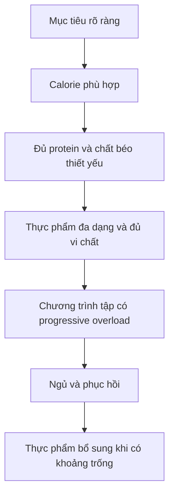
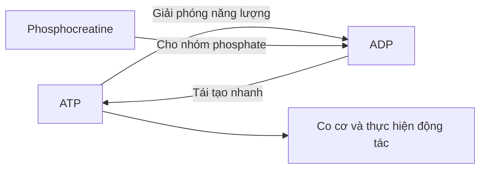
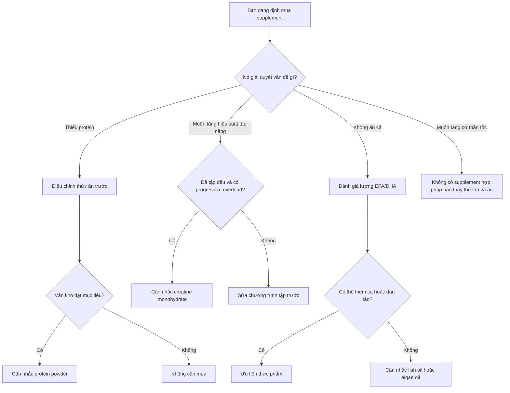

# 026 — The Top 3 Beginner Supplements for Fitness

## Ba thực phẩm bổ sung hàng đầu cho người mới tập luyện

| Thuộc tính             | Nội dung                                                                             |
| ---------------------- | ------------------------------------------------------------------------------------ |
| **Module**             | Module 03 — Supplements                                                              |
| **Bài học**            | The Top 3 Beginner Supplements for Fitness                                           |
| **Thời lượng**         | 04:14                                                                                |
| **Chủ đề chính**       | Ba loại thực phẩm bổ sung phổ biến cho người mới tập luyện                           |
| **Mức độ**             | Người mới bắt đầu                                                                    |
| **Nguyên tắc cốt lõi** | Thực phẩm bổ sung chỉ lấp khoảng trống, không thay thế chế độ ăn và chương trình tập |


> [!IMPORTANT]
> **Hiệu chỉnh theo bằng chứng hiện nay:**
> Trong ba sản phẩm của bài học, **creatine monohydrate** có bằng chứng trực tiếp và nhất quán nhất đối với sức mạnh, công suất và khả năng thích nghi khi tập. **Protein powder** chủ yếu là công cụ tiện lợi để đạt đủ protein. **Fish oil** không trực tiếp làm tăng cơ hay giảm mỡ và không phải người khỏe mạnh nào cũng cần bổ sung nếu đã ăn đủ cá.

---

## Mục lục

1. [Mục tiêu bài học](#1-mục-tiêu-bài-học)
2. [Nội dung chính](#2-nội-dung-chính)
3. [Áp dụng thực tế](#3-áp-dụng-thực-tế)
4. [Lưu ý và lỗi thường gặp](#4-lưu-ý-và-lỗi-thường-gặp)
5. [Checklist thực hành](#5-checklist-thực-hành)
6. [Tóm tắt](#6-tóm-tắt)
7. [Nguồn ảnh và tài liệu tham khảo](#7-nguồn-ảnh-và-tài-liệu-tham-khảo)

---

# 1. Mục tiêu bài học

Sau bài học này, người học có thể:

* Hiểu đúng vai trò của **protein powder**, **creatine monohydrate** và **fish oil**.
* Phân biệt sản phẩm giúp **bổ sung dinh dưỡng** với sản phẩm giúp **cải thiện hiệu suất tập luyện**.
* Biết khi nào một loại thực phẩm bổ sung thực sự cần thiết.
* Biết cách lựa chọn sản phẩm có thành phần minh bạch và được kiểm nghiệm độc lập.
* Tránh những lời quảng cáo như “tăng cơ thần tốc”, “đốt mỡ không cần ăn kiêng” hoặc “không có bất kỳ tác dụng phụ nào”.

---

# 2. Nội dung chính

## 2.1. Thực phẩm bổ sung nằm ở đâu trong kế hoạch fitness?

Thực phẩm bổ sung nên nằm ở **cuối hệ thống ưu tiên**, sau chế độ ăn, tập luyện, giấc ngủ và khả năng duy trì kế hoạch.



Một sản phẩm bổ sung tốt có thể giúp kế hoạch thuận tiện hoặc hiệu quả hơn, nhưng không thể bù lại:

* Chế độ ăn thiếu kiểm soát.
* Tập luyện không có tiến bộ.
* Ngủ quá ít.
* Thiếu tính nhất quán.
* Không theo dõi tổng calorie và protein.

Tại Hoa Kỳ, thực phẩm bổ sung không trải qua quy trình phê duyệt về độ an toàn và hiệu quả trước khi bán giống như thuốc. Nhà sản xuất chịu trách nhiệm về chất lượng và tính chính xác của nhãn sản phẩm, vì vậy người mua vẫn cần chủ động đánh giá sản phẩm.

---

## 2.2. Tổng quan ba loại thực phẩm bổ sung

| Thực phẩm bổ sung        | Vai trò chính                                    | Có bắt buộc không? | Mức độ bằng chứng cho fitness                                |
| ------------------------ | ------------------------------------------------ | -----------------: | ------------------------------------------------------------ |
| **Protein powder**       | Giúp đạt đủ protein thuận tiện hơn               |              Không | Cao nếu chế độ ăn đang thiếu protein                         |
| **Creatine monohydrate** | Tăng dự trữ creatine và phosphocreatine trong cơ |              Không | Rất cao đối với sức mạnh và vận động cường độ cao            |
| **Fish oil**             | Cung cấp EPA và DHA khi khẩu phần thiếu cá       |              Không | Hạn chế đối với tăng cơ; có ứng dụng sức khỏe tùy trường hợp |

### Cách hiểu đúng

```text
Protein powder = thực phẩm tiện lợi
Creatine       = chất hỗ trợ hiệu suất có bằng chứng mạnh
Fish oil       = chất bổ sung dinh dưỡng có điều kiện
```

---

## 2.3. Số 1 — Protein powder


*Ảnh: [Whey Protein Scoop — Wikimedia Commons](https://commons.wikimedia.org/wiki/File:Whey_Protein_Scoop_%2849935767168%29.jpg), giấy phép CC BY 2.0.*

### Protein powder là gì?

Protein powder là sản phẩm cô đặc protein từ các nguồn như:

| Loại                 | Nguồn       | Đặc điểm                                                 |
| -------------------- | ----------- | -------------------------------------------------------- |
| **Whey concentrate** | Sữa         | Giá thường thấp, còn một phần lactose và chất béo        |
| **Whey isolate**     | Sữa         | Tỷ lệ protein cao hơn, thường ít lactose hơn             |
| **Casein**           | Sữa         | Tiêu hóa tương đối chậm, kết cấu đặc                     |
| **Soy protein**      | Đậu nành    | Protein thực vật hoàn chỉnh                              |
| **Pea protein**      | Đậu Hà Lan  | Phù hợp với người không dùng sữa                         |
| **Protein blend**    | Nhiều nguồn | Có thể cải thiện cấu hình acid amin của protein thực vật |

Protein powder không phải chất kích thích tăng cơ riêng biệt. Nó chủ yếu giúp người tập **đạt đủ lượng protein trong ngày** khi việc chuẩn bị thịt, cá, trứng, sữa hoặc đậu gặp khó khăn.

### Vì sao protein quan trọng?

Tập kháng lực tạo ra tín hiệu thích nghi và gây tổn thương vi mô ở cơ. Protein cung cấp acid amin để cơ thể:

* Sửa chữa mô.
* Tổng hợp protein cơ.
* Duy trì khối nạc khi giảm calorie.
* Thích nghi với chương trình tập.

Phân tích tổng hợp 49 nghiên cứu cho thấy việc bổ sung protein cùng tập kháng lực có thể tạo thêm một mức tăng nhỏ về khối không mỡ và sức mạnh. Tuy nhiên, phần lớn tiến bộ vẫn đến từ bản thân chương trình tập; lợi ích của protein bổ sung giảm dần khi tổng lượng protein hằng ngày đã đủ.

### Protein powder có tốt hơn thực phẩm tự nhiên không?

Không nhất thiết.

Thực phẩm nguyên bản còn cung cấp thêm:

* Vitamin và khoáng chất.
* Chất xơ đối với nguồn thực vật.
* Chất béo thiết yếu.
* Khả năng tạo cảm giác no.
* Giá trị ẩm thực và sự đa dạng của bữa ăn.

Protein powder phù hợp nhất khi:

* Không đủ thời gian chuẩn bị bữa ăn.
* Khó đạt mục tiêu protein bằng thực phẩm.
* Cần một bữa phụ nhanh sau khi tập hoặc khi di chuyển.
* Đang giảm calorie và muốn bổ sung protein với lượng calorie tương đối dễ kiểm soát.

### Cách sử dụng thực tế

Không cần uống protein ngay sau khi kết thúc buổi tập. Hãy ưu tiên:

1. Tính tổng protein từ thức ăn.
2. Xác định lượng còn thiếu.
3. Chỉ dùng lượng protein powder cần thiết để lấp phần thiếu đó.

Ví dụ:

```text
Mục tiêu protein trong ngày:      130 g
Protein từ các bữa ăn:            105 g
Khoảng thiếu:                      25 g

→ Có thể dùng một khẩu phần cung cấp khoảng 25 g protein.
```

### Chọn loại protein nào?

Ưu tiên theo thứ tự:


Loại “tốt nhất” là loại:

* Phù hợp với hệ tiêu hóa.
* Phù hợp chế độ ăn.
* Có lượng protein rõ ràng trên nhãn.
* Có thể sử dụng đều đặn.
* Không chứa quá nhiều thành phần không cần thiết.

### Lưu ý với whey

* Người dị ứng protein sữa không nên dùng whey hoặc casein.
* Người không dung nạp lactose có thể dễ chịu hơn với whey isolate, nhưng phản ứng tùy cá nhân.
* Protein powder vẫn cung cấp calorie; uống thêm mà không điều chỉnh khẩu phần có thể làm tăng tổng calorie.

---

## 2.4. Số 2 — Creatine monohydrate


*Ảnh: [Creatine monohydrate powder — Wikimedia Commons](https://commons.wikimedia.org/wiki/File:Creatine_monohydrate_powder.jpg), giấy phép CC BY-SA 4.0.*

### Creatine là gì?

Creatine là một hợp chất tự nhiên được cơ thể tổng hợp và cũng có trong thịt, cá. Phần lớn creatine của cơ thể được lưu trữ trong cơ xương dưới dạng:

* Creatine tự do — **Cr**.
* Phosphocreatine — **PCr**.

Vai trò quan trọng của phosphocreatine là cung cấp nhanh một nhóm phosphate để tái tạo ATP từ ADP khi nhu cầu năng lượng tăng đột ngột.



### Hình nghiên cứu: hệ creatine–phosphocreatine


*Hình nghiên cứu mô tả hệ creatine kinase/phosphocreatine. Nguồn: ISSN Position Stand về creatine.*

Hệ năng lượng này đặc biệt quan trọng đối với:

* Nâng tạ nặng.
* Chạy nước rút.
* Nhảy và ném.
* Các hiệp vận động ngắn, mạnh.
* Những chuỗi động tác cường độ cao có thời gian nghỉ ngắn.

### Creatine giúp tăng cơ như thế nào?

Creatine không tự xây dựng cơ mà không cần tập luyện.

Chuỗi tác động thực tế là:

```text
Creatine trong cơ tăng
        ↓
Khả năng tái tạo ATP nhanh được hỗ trợ
        ↓
Có thể duy trì chất lượng hiệp tập tốt hơn
        ↓
Tăng khối lượng hoặc cường độ tập theo thời gian
        ↓
Tạo kích thích progressive overload lớn hơn
        ↓
Hỗ trợ tăng sức mạnh và khối cơ
```

Creatine monohydrate là một trong những chất hỗ trợ hiệu suất được nghiên cứu rộng nhất. Các tổng quan và tuyên bố chuyên môn cho thấy nó có thể cải thiện khả năng thực hiện vận động cường độ cao, sức mạnh và mức thích nghi với tập kháng lực.

### Hình nghiên cứu: dự trữ creatine trong cơ


*Biểu đồ cho thấy dự trữ creatine trong cơ có thể tăng sau giai đoạn nạp creatine; kết hợp carbohydrate hoặc carbohydrate–protein có thể làm tăng giữ creatine, nhưng điều này không đồng nghĩa hiệu suất chắc chắn tốt hơn creatine đơn thuần.*

### Liều sử dụng phổ biến

#### Phương án đơn giản

```text
Creatine monohydrate: 3–5 g mỗi ngày
```

* Sử dụng cả ngày tập và ngày nghỉ.
* Thời điểm uống không quá quan trọng.
* Tính nhất quán quan trọng hơn uống trước hay sau tập.
* Có thể dùng cùng bữa ăn, nước hoặc protein shake.

#### Phương án nạp nhanh — không bắt buộc

```text
Giai đoạn nạp:
Khoảng 0,3 g/kg/ngày trong 5–7 ngày
Chia thành 3–4 lần

Giai đoạn duy trì:
3–5 g/ngày
```

Không nạp vẫn có thể đạt mức bão hòa cơ, nhưng sẽ mất khoảng vài tuần thay vì vài ngày.

### Dạng creatine nên chọn

**Creatine monohydrate** là lựa chọn mặc định vì:

* Được nghiên cứu nhiều nhất.
* Hiệu quả nhất quán.
* Giá thường thấp hơn các dạng “cao cấp”.
* Chưa có bằng chứng thuyết phục rằng creatine ethyl ester, buffered creatine hoặc các dạng quảng cáo đặc biệt vượt trội hơn monohydrate.

### Creatine và thận

Ở người trưởng thành khỏe mạnh sử dụng liều thông thường, các phân tích tổng hợp không cho thấy creatine làm suy giảm mức lọc cầu thận. Creatine có thể làm creatinine máu tăng nhẹ do chuyển hóa, khiến chỉ số xét nghiệm dựa trên creatinine trông bất thường dù chức năng thận thực tế không bị suy giảm.

Người có các tình trạng sau nên trao đổi với bác sĩ trước khi sử dụng:

* Bệnh thận đã được chẩn đoán.
* Kết quả xét nghiệm thận bất thường.
* Đang dùng thuốc có khả năng ảnh hưởng đến thận.
* Đang mang thai hoặc cho con bú.
* Có bệnh lý mạn tính cần theo dõi y khoa.

Khi xét nghiệm máu, nên thông báo cho bác sĩ rằng mình đang dùng creatine.

### Tác dụng thường gặp

* Tăng cân nhẹ ban đầu do tăng nước trong cơ.
* Khó chịu tiêu hóa nếu dùng liều lớn một lần.
* Tiêu chảy hoặc đầy bụng trong giai đoạn nạp ở một số người.

Tăng cân do nước trong cơ không đồng nghĩa với tăng mỡ.

---

## 2.5. Số 3 — Fish oil


*Ảnh: [Fish Oil Capsules — Wikimedia Commons](https://commons.wikimedia.org/wiki/File:Fish_Oil_Capsules.jpg), giấy phép CC0.*

### Fish oil cung cấp chất gì?

Fish oil thường cung cấp hai acid béo omega-3 chuỗi dài:

* **EPA — eicosapentaenoic acid**
* **DHA — docosahexaenoic acid**

EPA và DHA có nhiều trong cá béo và hải sản. Chúng khác với ALA có trong hạt lanh, hạt chia, quả óc chó và một số loại dầu thực vật. Khả năng chuyển đổi ALA thành EPA và DHA trong cơ thể khá hạn chế.

### Fish oil có làm tăng cơ hoặc giảm mỡ không?

Không nên xem fish oil như một sản phẩm tăng cơ hoặc đốt mỡ.

Đối với người mới tập:

```text
Creatine → tác động trực tiếp hơn đến hiệu suất vận động
Protein  → giúp đáp ứng nhu cầu xây dựng và duy trì mô
Fish oil → chủ yếu lấp khoảng trống EPA/DHA trong khẩu phần
```

Fish oil có thể làm giảm triglyceride, đặc biệt ở liều điều trị theo chỉ định y khoa. Tuy nhiên, lợi ích của viên omega-3 đối với việc phòng ngừa bệnh tim ở người khỏe mạnh không nhất quán như lợi ích của việc ăn cá trong một chế độ ăn cân bằng. NIH lưu ý bằng chứng mạnh hơn ở người có bệnh tim mạch hoặc một số nguy cơ cụ thể, không phải mọi người khỏe mạnh đều cần dùng thường quy.

### Ưu tiên thực phẩm trước

Một phương án hợp lý là ưu tiên cá béo như:

* Cá hồi.
* Cá mòi.
* Cá trích.
* Cá thu.
* Cá cơm.
* Cá ngừ phù hợp với khuyến cáo an toàn thủy sản tại địa phương.

Các khuyến nghị tim mạch thường ưu tiên khoảng một đến hai khẩu phần hải sản mỗi tuần, đặc biệt khi hải sản thay thế những thực phẩm kém lành mạnh hơn.

Fish oil có thể được cân nhắc khi:

* Hiếm khi hoặc không ăn cá.
* Không thể ăn cá do khẩu vị hoặc điều kiện sinh hoạt.
* Chuyên gia y tế xác định cần tăng EPA/DHA.
* Đang điều trị triglyceride cao bằng sản phẩm và liều được kê đơn.

Người ăn thuần chay có thể cân nhắc dầu tảo cung cấp DHA hoặc EPA thay vì dầu cá.

### Đọc nhãn đúng cách

Không chỉ nhìn vào dòng chữ:

```text
“1.000 mg fish oil”
```

Cần kiểm tra lượng hoạt chất thực tế:

```text
EPA: ___ mg
DHA: ___ mg
Tổng EPA + DHA: ___ mg
```

Hai sản phẩm đều ghi “1.000 mg fish oil” có thể cung cấp lượng EPA và DHA rất khác nhau.

### Fish oil không phải hoàn toàn không có tác dụng phụ

Khẳng định “hầu như không có tác dụng phụ” trong nội dung gốc là quá tuyệt đối.

Các tác dụng không mong muốn thường nhẹ nhưng có thể gồm:

* Vị hoặc hơi thở tanh.
* Ợ nóng.
* Buồn nôn.
* Khó chịu đường tiêu hóa.
* Tiêu chảy.
* Đau đầu.

Liều omega-3 cao có thể ảnh hưởng đến kết tập tiểu cầu; người dùng thuốc chống đông cần trao đổi với bác sĩ. Một số thử nghiệm sử dụng khoảng 4 g omega-3 mỗi ngày trong nhiều năm ghi nhận nguy cơ rung nhĩ tăng nhẹ ở người đã có bệnh tim mạch hoặc nguy cơ tim mạch cao.

Mùi tanh sau khi uống không đủ để kết luận sản phẩm chắc chắn kém chất lượng. Nó có thể liên quan đến dạng viên, cách bảo quản, bữa ăn và cơ địa.

---

## 2.6. So sánh theo mục tiêu

| Mục tiêu               |                        Protein powder |                    Creatine |                        Fish oil |
| ---------------------- | ------------------------------------: | --------------------------: | ------------------------------: |
| Đạt đủ protein         |                       **Rất hữu ích** |                       Không |                           Không |
| Tăng sức mạnh          |    Hữu ích nếu trước đó thiếu protein |             **Rất hữu ích** |                   Không rõ ràng |
| Tăng khối cơ           | Hữu ích khi kết hợp tập và đủ calorie | **Hữu ích khi kết hợp tập** |              Bằng chứng hạn chế |
| Giảm mỡ                |    Chỉ hỗ trợ kiểm soát protein và no |      Không trực tiếp đốt mỡ |          Không trực tiếp đốt mỡ |
| Vận động cường độ cao  |                             Gián tiếp |            **Hữu ích nhất** |                   Không đáng kể |
| Bổ sung EPA/DHA        |                                 Không |                       Không | **Hữu ích khi khẩu phần thiếu** |
| Bắt buộc cho người mới |                                 Không |                       Không |                           Không |

---

# 3. Áp dụng thực tế

## 3.1. Quy trình quyết định trước khi mua



---

## 3.2. Kế hoạch tối giản cho người mới

### Giai đoạn 1 — Không dùng supplement

Trong hai đến bốn tuần đầu, tập trung theo dõi:

* Tổng calorie.
* Lượng protein.
* Số buổi tập.
* Tải trọng và số lần lặp.
* Giấc ngủ.
* Cân nặng và số đo.

### Giai đoạn 2 — Bổ sung theo nhu cầu

| Tình huống                                      | Hành động phù hợp                                               |
| ----------------------------------------------- | --------------------------------------------------------------- |
| Thường xuyên thiếu 20–30 g protein              | Thêm một khẩu phần protein powder hoặc một bữa phụ giàu protein |
| Đã tập đều và muốn cải thiện hiệu suất tập nặng | Dùng creatine monohydrate 3–5 g/ngày                            |
| Hầu như không ăn cá hoặc hải sản                | Điều chỉnh thực đơn; sau đó mới cân nhắc fish oil hoặc dầu tảo  |
| Đã đạt đủ protein bằng thức ăn                  | Không cần protein powder                                        |
| Chỉ chạy bền nhẹ, ít tập sức mạnh               | Lợi ích của creatine có thể thấp hơn                            |
| Đã ăn cá béo thường xuyên                       | Có thể không cần fish oil                                       |

---

## 3.3. Ví dụ lịch sử dụng

| Thời điểm                   | Sản phẩm                 | Gợi ý                                      |
| --------------------------- | ------------------------ | ------------------------------------------ |
| Bữa sáng                    | Fish oil nếu thực sự cần | Dùng cùng bữa ăn theo nhãn hoặc chỉ định   |
| Bất kỳ thời điểm thuận tiện | Creatine monohydrate     | 3–5 g mỗi ngày                             |
| Sau tập hoặc bữa phụ        | Protein powder           | Chỉ dùng lượng cần để đạt mục tiêu protein |
| Ngày nghỉ                   | Creatine                 | Vẫn dùng như ngày tập                      |
| Ngày nghỉ                   | Protein powder           | Chỉ dùng nếu thức ăn chưa đủ protein       |

> Không cần tạo một “supplement stack” phức tạp. Một chế độ tối giản thường dễ theo dõi hiệu quả và tác dụng phụ hơn.

---

## 3.4. Tiêu chí lựa chọn sản phẩm

### Protein powder

* Lượng protein trên mỗi khẩu phần rõ ràng.
* Danh sách thành phần không quá phức tạp.
* Không dị ứng với nguồn protein.
* Lượng đường và calorie phù hợp mục tiêu.
* Không mua “mass gainer” khi chưa kiểm tra tổng calorie.

### Creatine

* Ghi rõ **creatine monohydrate**.
* Không cần “proprietary blend”.
* Không cần kết hợp nhiều chất kích thích.
* Ưu tiên sản phẩm đơn thành phần.

### Fish oil

* Ghi rõ lượng EPA và DHA.
* Có hạn sử dụng và hướng dẫn bảo quản.
* Bao bì nguyên vẹn, không có mùi ôi bất thường.
* Không tự sử dụng liều điều trị triglyceride cao.

### Kiểm nghiệm độc lập

Ưu tiên sản phẩm có chứng nhận từ tổ chức độc lập như:

* NSF Certified for Sport.
* Informed Sport hoặc Informed Choice.
* USP Verified.
* BSCG.

Kiểm nghiệm độc lập có thể xác minh thành phần, hàm lượng, chất gây ô nhiễm hoặc chất cấm, nhưng không có nghĩa mọi công dụng quảng cáo của sản phẩm đều đã được chứng minh.

---

# 4. Lưu ý và lỗi thường gặp

## 4.1. Tin rằng supplement có thể thay thế chế độ ăn

### Sai

```text
Ăn uống tùy ý
+ protein shake
+ creatine
= tăng cơ và giảm mỡ
```

### Đúng

```text
Calorie phù hợp
+ đủ protein
+ tập tiến bộ
+ ngủ đủ
+ supplement có mục đích
= kết quả bền vững hơn
```

---

## 4.2. Uống protein càng nhiều càng tốt

Protein powder vẫn là thực phẩm có calorie. Dùng quá nhiều có thể:

* Chiếm chỗ của thực phẩm giàu vi chất.
* Làm tăng tổng calorie ngoài kế hoạch.
* Gây đầy bụng hoặc khó chịu tiêu hóa.
* Tốn tiền mà không tạo thêm lợi ích đáng kể khi lượng protein đã đủ.

---

## 4.3. Cho rằng mọi loại creatine đều giống nhau

Các dạng creatine đắt tiền thường được quảng cáo là hấp thu tốt hơn hoặc không giữ nước. Tuy nhiên, creatine monohydrate vẫn là dạng có bằng chứng đầy đủ và nhất quán nhất.

---

## 4.4. Chỉ dùng creatine vào ngày tập

Creatine hoạt động bằng cách duy trì dự trữ creatine trong cơ, không phải tạo hiệu ứng kích thích tức thời như caffeine. Do đó, nên sử dụng đều mỗi ngày thay vì chỉ uống trước những buổi tập nặng.

---

## 4.5. Nhầm tăng nước với tăng mỡ

Creatine có thể làm cân nặng tăng nhẹ do lượng nước trong cơ tăng. Đây không phải là sự tích lũy mỡ và cũng không đồng nghĩa cơ thể bị “phù nước” nguy hiểm ở người khỏe mạnh.

---

## 4.6. Cho rằng fish oil không có tác dụng phụ

Fish oil có thể gây khó chịu tiêu hóa, tương tác với một số thuốc và không nên tự dùng liều cao. Người có bệnh tim mạch, rối loạn đông máu hoặc đang dùng thuốc chống đông cần được tư vấn chuyên môn.

---

## 4.7. Mua sản phẩm dựa trên lời quảng cáo

Cần thận trọng với các cụm từ:

* “Tăng cơ cấp tốc”.
* “Đốt mỡ ngay cả khi ngủ”.
* “Thay thế hoàn toàn bữa ăn”.
* “Detox cơ thể”.
* “Công thức bí mật”.
* “Được FDA phê duyệt” đối với một thực phẩm bổ sung thông thường.
* “Không có bất kỳ tác dụng phụ nào”.

FDA không phê duyệt trước từng thực phẩm bổ sung về hiệu quả như thuốc, vì vậy cụm từ quảng cáo “FDA approved supplement” có thể gây hiểu lầm.

---

## 4.8. Bắt đầu nhiều sản phẩm cùng lúc

Nếu xuất hiện đau bụng, mất ngủ, nổi mẩn hoặc triệu chứng bất thường, việc dùng nhiều sản phẩm cùng lúc sẽ khiến khó xác định nguyên nhân.

Cách tốt hơn:

```text
Bắt đầu một sản phẩm
        ↓
Theo dõi 1–2 tuần
        ↓
Đánh giá khả năng dung nạp
        ↓
Chỉ thêm sản phẩm khác khi thực sự cần
```

---

# 5. Checklist thực hành

## Trước khi mua

* [ ] Tôi đã xác định rõ mục tiêu của sản phẩm.
* [ ] Tôi đã kiểm tra tổng calorie và protein trong chế độ ăn.
* [ ] Tôi hiểu sản phẩm không thể thay thế tập luyện.
* [ ] Tôi đã đọc toàn bộ danh sách thành phần.
* [ ] Tôi đã kiểm tra lượng hoạt chất trên mỗi khẩu phần.
* [ ] Sản phẩm không sử dụng “proprietary blend” để che liều lượng.
* [ ] Tôi đã kiểm tra chứng nhận kiểm nghiệm độc lập.
* [ ] Tôi không mua chỉ vì người nổi tiếng quảng cáo.
* [ ] Tôi đã xem xét bệnh nền, dị ứng và thuốc đang sử dụng.

## Khi sử dụng protein powder

* [ ] Chỉ dùng để lấp lượng protein còn thiếu.
* [ ] Không bỏ toàn bộ thực phẩm tự nhiên để thay bằng shake.
* [ ] Theo dõi phản ứng với lactose hoặc protein sữa.
* [ ] Tính lượng calorie của shake vào tổng calorie trong ngày.

## Khi sử dụng creatine

* [ ] Chọn creatine monohydrate.
* [ ] Dùng khoảng 3–5 g mỗi ngày.
* [ ] Không bắt buộc phải thực hiện giai đoạn nạp.
* [ ] Không ngừng sử dụng chỉ vì cân nặng tăng nhẹ do nước trong cơ.
* [ ] Thông báo cho bác sĩ trước khi xét nghiệm chức năng thận.
* [ ] Trao đổi với bác sĩ nếu có bệnh thận hoặc bệnh mạn tính.

## Khi sử dụng fish oil

* [ ] Kiểm tra lượng EPA và DHA, không chỉ nhìn tổng lượng fish oil.
* [ ] Xem xét khả năng tăng cá trong khẩu phần trước.
* [ ] Không tự dùng liều cao để điều trị triglyceride.
* [ ] Kiểm tra tương tác nếu đang dùng thuốc chống đông.
* [ ] Ngừng sử dụng và đánh giá sản phẩm nếu có mùi ôi hoặc dấu hiệu hư hỏng.

---

# 6. Tóm tắt

## Ba thông điệp chính

### 1. Protein powder là công cụ tiện lợi

Protein powder giúp đạt đủ protein khi lịch sinh hoạt hoặc khẩu phần thực phẩm chưa đáp ứng được nhu cầu. Nó không có tính chất tăng cơ đặc biệt nếu tổng protein đã đủ.

### 2. Creatine monohydrate có bằng chứng mạnh nhất

Creatine hỗ trợ tái tạo ATP trong các hoạt động ngắn và cường độ cao. Khi kết hợp với tập kháng lực có progressive overload, nó có thể giúp tăng sức mạnh, chất lượng tập và mức thích nghi lâu dài.

### 3. Fish oil chỉ cần thiết trong một số trường hợp

Fish oil cung cấp EPA và DHA nhưng không trực tiếp tạo cơ hoặc đốt mỡ. Người đã ăn đủ cá có thể không cần bổ sung. Liều cao và các trường hợp có bệnh nền cần được đánh giá bởi chuyên gia y tế.

## Công thức ghi nhớ

```text
Protein powder = Lấp khoảng thiếu protein

Creatine       = Hỗ trợ hiệu suất và progressive overload

Fish oil       = Lấp khoảng thiếu EPA/DHA
```

## Thứ tự ưu tiên cuối cùng


> **Không có thực phẩm bổ sung nào biến một kế hoạch kém thành một kế hoạch tốt.
> Một sản phẩm phù hợp chỉ giúp một kế hoạch tốt trở nên thuận tiện hoặc hiệu quả hơn một chút.**

---

# 7. Nguồn ảnh và tài liệu tham khảo

## Ảnh minh họa

1. [Whey Protein Scoop — Wikimedia Commons](https://commons.wikimedia.org/wiki/File:Whey_Protein_Scoop_%2849935767168%29.jpg) — CC BY 2.0.
2. [Creatine monohydrate powder — Wikimedia Commons](https://commons.wikimedia.org/wiki/File:Creatine_monohydrate_powder.jpg) — CC BY-SA 4.0.
3. [Fish Oil Capsules — Wikimedia Commons](https://commons.wikimedia.org/wiki/File:Fish_Oil_Capsules.jpg) — CC0.
4. [Hệ creatine kinase/phosphocreatine — ISSN Position Stand](https://link.springer.com/article/10.1186/s12970-017-0173-z).
5. [Biểu đồ dự trữ creatine trong cơ — ISSN Position Stand](https://link.springer.com/article/10.1186/s12970-017-0173-z).
6. [Infographic về protein supplementation và tập kháng lực — British Journal of Sports Medicine](https://bjsm.bmj.com/content/53/24/1552).

## Tài liệu khoa học chính

* Morton RW và cộng sự. Phân tích tổng hợp tác động của protein supplementation đối với tăng cơ và sức mạnh khi tập kháng lực.
* Kreider RB và cộng sự. ISSN Position Stand về hiệu quả và độ an toàn của creatine.
* Naeini EK và cộng sự. Phân tích tổng hợp năm 2025 về creatine và chức năng thận.
* NIH Office of Dietary Supplements. Thông tin chuyên môn về omega-3, tác dụng, độ an toàn và tương tác thuốc.
* FDA. Quy định và giới hạn của cơ chế quản lý thực phẩm bổ sung.
* OPSS và NSF. Hướng dẫn về kiểm nghiệm độc lập đối với thực phẩm bổ sung.

> [!NOTE]
> Nội dung mang tính giáo dục, không thay thế chẩn đoán hoặc chỉ định điều trị. Người có bệnh nền, đang dùng thuốc, đang mang thai hoặc có kết quả xét nghiệm bất thường nên hỏi bác sĩ hoặc chuyên gia dinh dưỡng trước khi sử dụng thực phẩm bổ sung.

---

# Bài luyện tập

## Mục tiêu


## Đề bài


## Yêu cầu hoàn thành

- [ ] 
- [ ] 
- [ ] 

## Kết quả / lời giải


## Ghi chú
