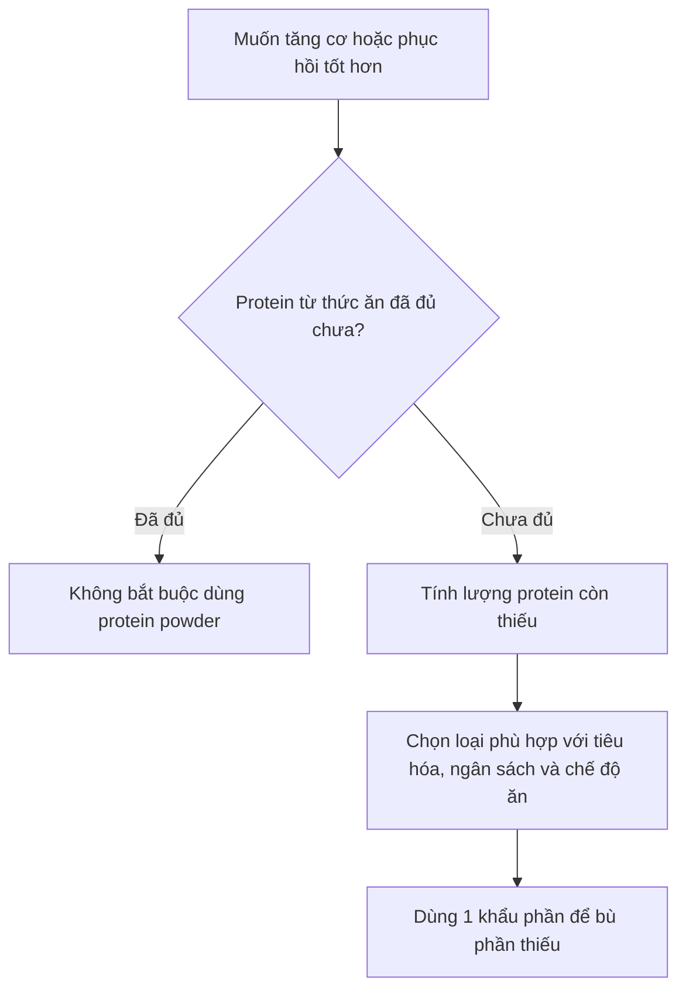
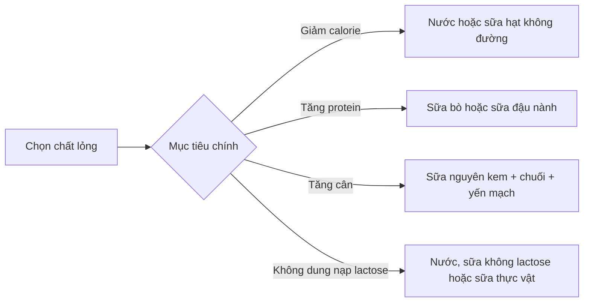

# 027 — Cách sử dụng bột protein

| Thuộc tính             | Nội dung                                                             |
| ---------------------- | -------------------------------------------------------------------- |
| **Module**             | Module 03 — Supplements                                              |
| **Bài học**            | How To Use Protein Powder                                            |
| **Thời lượng**         | 05:51                                                                |
| **Chủ đề chính**       | Cách lựa chọn và sử dụng bột protein đúng cách                       |
| **Mức độ**             | Người mới tập luyện                                                  |
| **Nguyên tắc cốt lõi** | Protein powder chỉ dùng để bù phần protein còn thiếu trong chế độ ăn |


> **Nguồn ảnh:** Nenad Stojković, giấy phép CC BY 2.0, [Wikimedia Commons](https://commons.wikimedia.org/wiki/File:User_measures_a_scoop_of_protein_powder_from_a_container_in_a_kitchen.jpg). ([Wikimedia Commons][1])

## Mục lục

1. [Mục tiêu bài học](#1-mục-tiêu-bài-học)
2. [Nội dung chính](#2-nội-dung-chính)
3. [Áp dụng thực tế](#3-áp-dụng-thực-tế)
4. [Lưu ý & lỗi thường gặp](#4-lưu-ý--lỗi-thường-gặp)
5. [Checklist thực hành](#5-checklist-thực-hành)
6. [Tóm tắt](#6-tóm-tắt)

---

## Hiệu đính khoa học cho nội dung gốc

Transcript của bài học có một số kết luận cần được cập nhật:

* **Protein đậu nành không được chứng minh là làm giảm testosterone ở nam giới.** Một phân tích tổng hợp mở rộng cho thấy soy protein và isoflavone không làm thay đổi đáng kể testosterone toàn phần, testosterone tự do hoặc estrogen ở nam giới. ([PubMed][2])
* Không nên loại bỏ tất cả **beef protein** chỉ vì tên nguyên liệu. Điều cần kiểm tra là sản phẩm chứa protein thịt hoàn chỉnh hay chủ yếu là **collagen/gelatin thủy phân**. Collagen không có cấu hình acid amin tối ưu để thay thế whey, trứng, sữa hoặc protein thực vật hoàn chỉnh trong mục tiêu phát triển cơ.
* Quy tắc lấy tối đa “một phần ba đến một nửa protein từ bột” chỉ nên xem là hướng dẫn thực hành, **không phải giới hạn sinh lý bắt buộc**. Mục tiêu tốt hơn là dùng lượng bột vừa đủ để bù phần còn thiếu, đồng thời giữ chế độ ăn đa dạng.
* Không có “cửa sổ 30 phút” bắt buộc sau tập. Tổng lượng protein cả ngày quan trọng hơn việc uống shake ngay khi vừa đặt tạ xuống. ([Springer][3])

---

# 1. Mục tiêu bài học

Sau bài học này, người học có thể:

* Hiểu protein powder là thực phẩm bổ sung tiện lợi, không phải điều kiện bắt buộc để tăng cơ.
* Xác định lượng protein cần bổ sung dựa trên cân nặng và khẩu phần hiện tại.
* Phân biệt whey concentrate, whey isolate, casein, protein trứng và protein thực vật.
* Biết thời điểm dùng protein powder mà không bị ám ảnh bởi “cửa sổ đồng hóa”.
* Chọn chất lỏng pha shake phù hợp với mục tiêu tăng cơ, giảm mỡ hoặc kiểm soát lactose.
* Đọc nhãn sản phẩm và nhận biết một sản phẩm có chất lượng phù hợp.
* Tránh các hiểu lầm về protein đậu nành, thận và lượng protein mỗi bữa.

---

# 2. Nội dung chính

## 2.1. Protein powder có bắt buộc để tăng cơ không?

**Không.**

Cơ thể cần **protein**, chứ không bắt buộc phải nhận protein dưới dạng bột. Một người vẫn có thể tăng cơ tốt bằng thịt, cá, trứng, sữa, sữa chua, đậu phụ, đậu, các loại hạt và những thực phẩm giàu protein khác.

Protein powder chủ yếu có ba lợi ích:

1. **Tiện lợi:** pha trong vài phút, phù hợp khi không có thời gian nấu ăn.
2. **Dễ kiểm soát:** nhãn sản phẩm cho biết tương đối rõ lượng protein và calorie.
3. **Dễ tăng protein mà không tăng quá nhiều chất béo hoặc carbohydrate**, đặc biệt với whey isolate hoặc các sản phẩm ít phụ gia.

Nghiên cứu cho thấy protein bổ sung có thể hỗ trợ tăng khối nạc và sức mạnh khi kết hợp với tập kháng lực, nhưng lợi ích giảm dần khi tổng lượng protein trong ngày đã đủ. Mốc trung bình khoảng **1,6 g/kg/ngày** thường đã gần mức tối ưu cho phần lớn người tập trong điều kiện không cắt calorie quá sâu. ([PubMed][4])



### Thứ tự ưu tiên

```text
Tập luyện phù hợp
        ↓
Đủ calorie theo mục tiêu
        ↓
Đủ tổng protein mỗi ngày
        ↓
Phân bổ protein qua các bữa
        ↓
Thời điểm uống shake
        ↓
Thương hiệu hoặc hương vị
```

---

## 2.2. Người tập nên ăn bao nhiêu protein?

ISSN khuyến nghị phần lớn người vận động sử dụng khoảng **1,4–2,0 g protein/kg cân nặng/ngày**. Nhu cầu có thể cao hơn trong một số giai đoạn giảm calorie nhằm hạn chế mất khối nạc. ([SpringerLink][5])

### Khoảng tham khảo

| Đối tượng hoặc mục tiêu                     |                           Protein tham khảo |
| ------------------------------------------- | ------------------------------------------: |
| Người ít vận động, mục tiêu sức khỏe cơ bản |                        Khoảng 0,8 g/kg/ngày |
| Tập luyện thông thường                      |                           1,4–1,6 g/kg/ngày |
| Ưu tiên tăng cơ                             |                    Khoảng 1,6–2,0 g/kg/ngày |
| Giảm mỡ, tập tạ và muốn giữ cơ              | Thường dùng phần cao của khoảng khuyến nghị |
| Vận động viên hoặc trường hợp đặc biệt      |                             Cần cá nhân hóa |

> Đây là khoảng tham khảo, không phải đơn thuốc. Cân nặng, tuổi, lượng cơ, mức vận động, tổng calorie và tình trạng sức khỏe đều có thể làm thay đổi nhu cầu.

### Công thức tính

```text
Protein mục tiêu mỗi ngày
= Cân nặng × Mức protein mục tiêu
```

```text
Protein cần bổ sung bằng bột
= Protein mục tiêu − Protein đã nhận từ thức ăn
```

### Ví dụ

Một người nặng **70 kg**, tập tạ và chọn mức **1,6 g/kg/ngày**:

```text
70 × 1,6 = 112 g protein/ngày
```

Nếu khẩu phần thức ăn đã cung cấp khoảng **85 g**:

```text
112 − 85 = 27 g protein còn thiếu
```

Người này chỉ cần một khẩu phần shake cung cấp khoảng **25–30 g protein**, thay vì uống nhiều lần theo thói quen.

> **Lưu ý:** “Một scoop 30 g” không đồng nghĩa với “30 g protein”. Một muỗng 30 g bột có thể chỉ chứa 20–25 g protein. Luôn đọc dòng **protein per serving** trên nhãn.

---

## 2.3. Mỗi lần nên dùng bao nhiêu?

Khuyến nghị thực hành phổ biến cho người tập là khoảng:

* **20–40 g protein chất lượng cao mỗi lần**, hoặc
* Khoảng **0,25–0,40 g/kg cân nặng mỗi bữa**.

ISSN sử dụng khoảng 20–40 g như một hướng dẫn tổng quát, trong khi một bài tổng quan khác đề xuất khoảng **0,4 g/kg/bữa** khi mục tiêu là tối ưu hóa tăng cơ và phân bổ tổng protein qua tối thiểu bốn bữa. ([SpringerLink][6])

| Cân nặng | Khoảng 0,25 g/kg | Khoảng 0,40 g/kg |
| -------: | ---------------: | ---------------: |
|    50 kg |           12,5 g |             20 g |
|    60 kg |             15 g |             24 g |
|    70 kg |           17,5 g |             28 g |
|    80 kg |             20 g |             32 g |
|    90 kg |           22,5 g |             36 g |
|   100 kg |             25 g |             40 g |

Không phải toàn bộ protein vượt quá 20–25 g đều “bị lãng phí”. Cơ thể vẫn hấp thu và sử dụng acid amin cho nhiều mô, enzyme, hormone và quá trình sinh học khác. Khái niệm 20–25 g chủ yếu liên quan đến mức kích thích tổng hợp protein cơ trong những điều kiện nghiên cứu cụ thể, không phải giới hạn hấp thu của hệ tiêu hóa. ([SpringerLink][7])

---

## 2.4. Nên chọn loại protein powder nào?

### Bảng so sánh

| Loại                       | Đặc điểm                                               | Phù hợp với                                          | Điểm cần lưu ý                                                                 |
| -------------------------- | ------------------------------------------------------ | ---------------------------------------------------- | ------------------------------------------------------------------------------ |
| **Whey concentrate — WPC** | Protein sữa, tiêu hóa tương đối nhanh, giá thường thấp | Người mới, không nhạy lactose                        | Có thể chứa nhiều lactose, chất béo và carbohydrate hơn isolate                |
| **Whey isolate — WPI**     | Hàm lượng protein cao hơn, ít lactose hơn              | Người muốn ít calorie hoặc nhạy lactose nhẹ          | Không bảo đảm hoàn toàn không có lactose                                       |
| **Casein**                 | Protein sữa tiêu hóa chậm hơn                          | Bữa phụ dài, trước khi ngủ nếu còn thiếu protein     | Không phù hợp với người dị ứng protein sữa                                     |
| **Egg-white protein**      | Protein từ lòng trắng trứng, không chứa sữa            | Người không dùng được whey nhưng ăn trứng            | Tránh nếu dị ứng trứng                                                         |
| **Soy protein**            | Protein thực vật hoàn chỉnh                            | Người ăn chay hoặc không dùng sữa                    | Không có bằng chứng đáng tin cậy rằng lượng thông thường làm giảm testosterone |
| **Pea protein**            | Thường dễ sử dụng, không chứa sữa                      | Người ăn thuần chay                                  | Có thể ít methionine hơn một số nguồn khác                                     |
| **Rice protein**           | Không chứa sữa và đậu nành                             | Người có nhiều hạn chế thực phẩm                     | Thường ít lysine; nên phối hợp với pea protein                                 |
| **Pea + rice blend**       | Hai nguồn bổ sung acid amin cho nhau                   | Người ăn thuần chay muốn cấu hình cân đối hơn        | Kiểm tra lượng protein thực tế mỗi khẩu phần                                   |
| **Beef protein isolate**   | Chất lượng thay đổi mạnh theo sản phẩm                 | Người không dùng sữa                                 | Kiểm tra xem thành phần có chủ yếu là collagen/gelatin không                   |
| **Collagen powder**        | Giàu glycine và proline                                | Mục tiêu liên quan mô liên kết theo chỉ định phù hợp | Không nên coi là nguồn protein chính để tối ưu tăng cơ                         |

### Whey có phải luôn tốt hơn protein thực vật?

Whey có hàm lượng acid amin thiết yếu và leucine thuận lợi, nhưng điều đó không có nghĩa protein thực vật không thể hỗ trợ tăng cơ. Khi tổng lượng protein, lượng acid amin thiết yếu và chương trình tập được kiểm soát hợp lý, protein đậu nành và whey cho kết quả tương tự trong một số phân tích về khối nạc và sức mạnh. ([PubMed][8])

Người dùng protein thực vật có thể:

* Chọn hỗn hợp **pea + rice**.
* Dùng khẩu phần lớn hơn một chút nếu mỗi serving có ít protein hoặc leucine.
* Kết hợp nhiều nguồn thực vật trong cả ngày.
* Bảo đảm tổng calorie và tổng protein đạt mục tiêu.

### Kết luận lựa chọn

Loại protein “tốt nhất” là loại:

* Cơ thể tiêu hóa tốt.
* Phù hợp với chế độ ăn và dị ứng.
* Cung cấp đủ protein mỗi khẩu phần.
* Có danh sách thành phần rõ ràng.
* Không chứa quá nhiều đường hoặc nguyên liệu không cần thiết.
* Có giá phù hợp để duy trì lâu dài.

---

## 2.5. Protein đậu nành có làm giảm testosterone không?

**Không có bằng chứng đáng tin cậy cho kết luận này ở mức tiêu thụ thông thường.**

Phytoestrogen trong đậu nành không hoạt động giống hệt estrogen của cơ thể người. Phân tích tổng hợp năm 2021 kết luận rằng soy protein và isoflavone không ảnh hưởng đáng kể đến testosterone toàn phần, testosterone tự do, estradiol hoặc estrone ở nam giới, bất kể liều lượng và thời gian nghiên cứu. ([PubMed][2])

Do đó, không cần tránh soy protein chỉ vì lo ngại “nữ hóa” hoặc giảm testosterone. Người dị ứng đậu nành hoặc không dung nạp sản phẩm vẫn nên chọn nguồn khác.

---

## 2.6. Khi nào nên uống protein powder?

### Nguyên tắc quan trọng nhất

```text
Đủ protein cả ngày > Phân bổ qua các bữa > Thời điểm chính xác quanh buổi tập
```

Một phân tích tổng hợp về protein timing cho thấy sau khi kiểm soát tổng lượng protein, việc uống protein ngay sát buổi tập không tạo ra khác biệt có ý nghĩa rõ ràng đối với sức mạnh hoặc phì đại cơ. Tổng lượng protein là yếu tố dự báo quan trọng hơn. ([Springer][3])

### Ảnh nghiên cứu: tác động của thời điểm dùng protein


> **Cách đọc:** Mỗi chấm biểu thị kết quả của một nghiên cứu; đường ngang là khoảng tin cậy. Sau khi điều chỉnh tổng lượng protein, hiệu quả chung của việc canh thời điểm uống protein khá nhỏ và không có ý nghĩa thống kê rõ ràng. ([Springer][9])

### Hướng dẫn thực hành

| Tình huống                                            | Cách dùng phù hợp                          |
| ----------------------------------------------------- | ------------------------------------------ |
| Đã ăn một bữa có protein trong vòng 1–3 giờ trước tập | Không cần vội uống ngay sau tập            |
| Tập khi bụng đói                                      | Có thể dùng khoảng 20–40 g sau buổi tập    |
| Sau tập còn nhiều giờ mới được ăn                     | Shake là phương án tiện lợi                |
| Bữa sáng quá ít protein                               | Có thể thêm whey vào yến mạch hoặc sinh tố |
| Còn thiếu protein cuối ngày                           | Dùng một khẩu phần vừa đủ để đạt mục tiêu  |
| Đã đạt đủ protein bằng thức ăn                        | Không cần uống thêm vì “sợ mất cơ”         |

Một nghiên cứu so sánh trực tiếp uống protein trước và sau tập cũng không tìm thấy khác biệt đáng kể về các kết quả được đo, hỗ trợ quan điểm rằng khoảng thời gian sử dụng có thể rộng hơn nhiều so với “30 phút sau tập”. ([PubMed][10])

---

## 2.7. Có nên thay bữa ăn bằng protein shake không?

Protein powder chủ yếu cung cấp protein, nhưng một bữa ăn hoàn chỉnh còn có:

* Carbohydrate.
* Chất béo thiết yếu.
* Chất xơ.
* Vitamin và khoáng chất.
* Nhiều hợp chất có lợi từ thực phẩm.
* Khả năng tạo cảm giác no nhờ thể tích và quá trình nhai.

Vì vậy, shake nên được xem là **công cụ bổ sung**, không phải mặc định thay thế toàn bộ bữa ăn.


> **Nguồn ảnh:** Smastronardo, CC BY-SA 4.0, [Wikimedia Commons](https://commons.wikimedia.org/wiki/File:Protein-rich_Foods.jpg). ([Wikimedia Commons][11])

### Quy tắc thực hành hợp lý

```text
Phần lớn khẩu phần → thực phẩm đa dạng
Phần còn thiếu → protein powder
```

Không cần buộc bản thân tuân theo tỷ lệ chính xác như “tối đa 33%” hoặc “tối đa 50%”. Tuy nhiên, nếu phần lớn protein mỗi ngày đến từ shake, chế độ ăn có thể đang thiếu sự đa dạng, chất xơ hoặc vi chất.

---

## 2.8. Nên pha protein powder với gì?

Các giá trị dưới đây chỉ là **ước tính cho khoảng 250 ml**; cần đọc nhãn của sản phẩm cụ thể.

| Chất lỏng                     |           Calorie ước tính | Protein ước tính | Phù hợp với                        |
| ----------------------------- | -------------------------: | ---------------: | ---------------------------------- |
| **Nước**                      |                     0 kcal |              0 g | Giảm calorie, muốn shake nhẹ       |
| **Sữa bò ít béo**             |               100–130 kcal |       Khoảng 8 g | Tăng protein, shake đặc và béo hơn |
| **Sữa bò nguyên kem**         |               140–170 kcal |       Khoảng 8 g | Tăng calorie hoặc tăng cân         |
| **Sữa đậu nành không đường**  |                70–110 kcal |     Khoảng 6–9 g | Ăn chay, muốn thêm protein         |
| **Sữa hạnh nhân không đường** |                 25–50 kcal |     Khoảng 1–2 g | Muốn ít calorie và vị dễ uống      |
| **Sữa yến mạch**              |                90–150 kcal |     Khoảng 2–4 g | Muốn vị ngọt, đặc hơn              |
| **Sữa không lactose**         | Gần tương đương sữa thường |       Khoảng 8 g | Không dung nạp lactose             |

### Chọn theo mục tiêu



> **Không dung nạp lactose** khác với **dị ứng protein sữa**. Người dị ứng sữa không nên tự chuyển từ whey concentrate sang whey isolate nếu chưa có hướng dẫn y tế, vì cả hai vẫn có nguồn gốc từ sữa.

---

## 2.9. Cách pha shake đúng

### Phương pháp cơ bản

1. Cho **200–350 ml chất lỏng** vào bình trước.
2. Thêm lượng bột cung cấp đủ protein còn thiếu.
3. Đóng chặt nắp.
4. Lắc khoảng 20–30 giây.
5. Điều chỉnh lượng nước theo độ đặc mong muốn.
6. Rửa bình ngay sau khi sử dụng.

Cho chất lỏng vào trước thường giúp giảm bột bám đáy và vón cục.

### Công thức cơ bản ít calorie

```text
250–350 ml nước
+ 1 khẩu phần protein powder
+ đá viên
```

### Công thức tăng calorie

```text
250 ml sữa
+ 1 khẩu phần protein powder
+ 1 quả chuối
+ 30–50 g yến mạch
+ 1 thìa bơ đậu phộng
```

### Công thức bữa sáng nhanh

```text
200 g sữa chua
+ ½–1 khẩu phần protein powder
+ trái cây
+ yến mạch
```

### Lưu ý bảo quản

Shake đã pha với sữa hoặc trái cây nên được uống sớm hoặc bảo quản lạnh. Không nên để bình shake ở nhiệt độ phòng trong nhiều giờ, đặc biệt trong thời tiết nóng.

---

## 2.10. Cách đọc nhãn protein powder

### 1. Kiểm tra lượng protein thực tế

Ví dụ:

```text
Khối lượng khẩu phần: 32 g
Protein: 24 g
```

Tỷ lệ protein theo khối lượng:

```text
24 ÷ 32 × 100 = 75%
```

### 2. Kiểm tra danh sách thành phần

Một sản phẩm đơn giản thường có:

```text
Nguồn protein
+ hương liệu
+ chất tạo ngọt
+ chất làm đặc hoặc chất nhũ hóa
```

Cẩn thận với sản phẩm có quá nhiều:

* Đường bổ sung.
* “Proprietary blend” không ghi rõ định lượng.
* Chất kích thích không cần thiết.
* Thành phần collagen nhưng quảng cáo như protein hoàn chỉnh để tăng cơ.
* Một khẩu phần rất lớn nhưng protein thực tế thấp.

### 3. Kiểm tra dị ứng

Các chất gây dị ứng thường gặp:

* Sữa.
* Đậu nành.
* Trứng.
* Đậu phộng hoặc hạt cây do sản xuất chung dây chuyền.

### 4. Ưu tiên kiểm nghiệm độc lập

Tại Hoa Kỳ, FDA không kiểm tra và phê duyệt trước mọi thực phẩm bổ sung trước khi chúng được đưa ra thị trường. Vì vậy, người mua nên ưu tiên sản phẩm có kiểm nghiệm độc lập và thông tin lô sản xuất rõ ràng. ([U.S. Food and Drug Administration][12])

Các vận động viên có kiểm tra doping nên đặc biệt chú ý những chứng nhận như **NSF Certified for Sport**, vì chương trình kiểm tra thành phần và các chất bị cấm trong thể thao. ([NSF Sport][13])

---

# 3. Áp dụng thực tế

## 3.1. Quy trình bốn bước

### Bước 1 — Xác định mục tiêu protein

```text
Cân nặng × 1,4–2,0 g/kg
```

Chọn mức thấp hoặc cao dựa trên mục tiêu, mức tập và tổng calorie.

### Bước 2 — Theo dõi protein từ thức ăn

Có thể theo dõi trong 3–7 ngày để biết lượng protein trung bình, thay vì phỏng đoán từ một ngày bất thường.

### Bước 3 — Tính phần còn thiếu

```text
Protein còn thiếu = Mục tiêu − Protein từ thức ăn
```

### Bước 4 — Chỉ bổ sung phần còn thiếu

|     Protein còn thiếu | Cách xử lý                                           |
| --------------------: | ---------------------------------------------------- |
|                0–10 g | Có thể điều chỉnh bằng thức ăn                       |
|               10–20 g | Dùng nửa khẩu phần hoặc thêm sữa chua, trứng         |
|               20–30 g | Khoảng một khẩu phần shake                           |
| Trên 30–40 g mỗi ngày | Xem lại cấu trúc các bữa ăn, không chỉ tăng số scoop |

---

## 3.2. Ví dụ một ngày cho người 70 kg

Mục tiêu: **112 g protein/ngày**.

| Bữa      | Thực phẩm                   | Protein minh họa |
| -------- | --------------------------- | ---------------: |
| Sáng     | Trứng, sữa chua và yến mạch |             25 g |
| Trưa     | Cơm, thịt gà và rau         |             35 g |
| Sau tập  | Whey pha nước               |             25 g |
| Tối      | Cá, cơm và rau              |             30 g |
| **Tổng** |                             |        **115 g** |

Trong ví dụ này, protein powder không “tạo cơ” một cách riêng biệt. Nó chỉ giúp người tập đạt mục tiêu protein thuận tiện hơn.

---

## 3.3. Chọn loại theo tình huống

| Tình huống                   | Lựa chọn gợi ý                                         |
| ---------------------------- | ------------------------------------------------------ |
| Người mới, ngân sách hạn chế | Whey concentrate                                       |
| Nhạy lactose nhẹ             | Whey isolate hoặc protein thực vật                     |
| Dị ứng protein sữa           | Egg protein hoặc protein thực vật phù hợp              |
| Ăn thuần chay                | Soy hoặc pea–rice blend                                |
| Đang giảm calorie            | Whey isolate pha nước                                  |
| Đang tăng cân                | Whey pha sữa, thêm yến mạch và trái cây                |
| Muốn dùng trước khi ngủ      | Thức ăn giàu protein hoặc casein nếu còn thiếu protein |
| Thi đấu có kiểm tra doping   | Sản phẩm có chứng nhận kiểm nghiệm thể thao độc lập    |

---

# 4. Lưu ý & lỗi thường gặp

## Lỗi 1 — Nghĩ rằng protein powder bắt buộc để tăng cơ

Tập luyện tiến bộ, đủ calorie, ngủ và tổng protein mới là nền tảng. Protein powder chỉ là một phương tiện tiện lợi.

## Lỗi 2 — Uống shake dù đã đủ protein

Thêm protein vượt nhu cầu không tự động tạo thêm cơ. Shake vẫn cung cấp calorie và có thể làm tổng calorie vượt mục tiêu.

## Lỗi 3 — Chạy vào phòng thay đồ để uống trong 30 phút

Không cần thiết nếu đã ăn một bữa có đủ protein trước tập. Khoảng thời gian dinh dưỡng quanh buổi tập rộng hơn nhiều so với quan niệm “cửa sổ 30 phút”. ([Springer][3])

## Lỗi 4 — Tránh hoàn toàn protein đậu nành vì sợ giảm testosterone

Kết luận này không được ủng hộ bởi các phân tích tổng hợp ở người. ([PubMed][2])

## Lỗi 5 — Dùng collagen như whey để tăng cơ

Collagen có thể cung cấp protein trên nhãn dinh dưỡng, nhưng cấu hình acid amin của nó không tương đương một nguồn protein hoàn chỉnh giàu acid amin thiết yếu.

## Lỗi 6 — Nhầm một scoop với một khẩu phần protein

Kích thước muỗng thay đổi giữa các sản phẩm. Cần đọc:

* Khối lượng khẩu phần.
* Số muỗng mỗi khẩu phần.
* Số gram protein mỗi khẩu phần.

## Lỗi 7 — Bỏ qua calorie của chất lỏng

Một shake pha nước có thể chỉ khoảng 100–150 kcal, nhưng khi thêm sữa, chuối, yến mạch và bơ đậu phộng, tổng năng lượng có thể tăng lên vài trăm calorie.

## Lỗi 8 — Dùng quá nhiều gây khó chịu tiêu hóa

Triệu chứng có thể gồm:

* Đầy hơi.
* Đau bụng.
* Tiêu chảy hoặc táo bón.
* Buồn nôn.
* Khó chịu do lactose, chất tạo ngọt hoặc khẩu phần quá lớn.

Có thể thử giảm liều, đổi loại bột hoặc đổi chất lỏng.

## Lỗi 9 — Tin rằng protein powder luôn gây hại thận

Ở người trưởng thành khỏe mạnh, các phân tích hiện có không cho thấy chế độ protein cao gây suy giảm chức năng thận rõ ràng trong thời gian nghiên cứu. Tuy nhiên, bằng chứng dài hạn vẫn có giới hạn và kết luận này **không áp dụng cho người đã mắc bệnh thận**. ([PubMed][14])

Người có một trong các tình trạng sau nên hỏi bác sĩ hoặc chuyên gia dinh dưỡng trước khi tăng protein:

* Bệnh thận hoặc giảm chức năng thận.
* Bệnh gan nghiêm trọng.
* Đang mang thai hoặc cho con bú.
* Dị ứng thực phẩm.
* Đang dùng thuốc có thể ảnh hưởng đến thận.
* Có chỉ định hạn chế protein.

---

# 5. Checklist thực hành

## Trước khi mua

* [ ] Tôi đã biết mục tiêu protein mỗi ngày.
* [ ] Tôi đã ước tính lượng protein từ thức ăn.
* [ ] Tôi thật sự còn thiếu protein cần bổ sung.
* [ ] Sản phẩm phù hợp với dị ứng và khả năng tiêu hóa.
* [ ] Nhãn ghi rõ số gram protein mỗi khẩu phần.
* [ ] Danh sách thành phần không quá phức tạp.
* [ ] Lượng đường và calorie phù hợp mục tiêu.
* [ ] Sản phẩm có nhà sản xuất, số lô và hạn sử dụng rõ ràng.
* [ ] Nếu thi đấu, sản phẩm có chứng nhận kiểm nghiệm phù hợp.

## Khi sử dụng

* [ ] Đong theo nhãn thay vì ước lượng bằng mắt.
* [ ] Tính cả calorie từ sữa, trái cây hoặc bơ hạt.
* [ ] Không bắt buộc uống ngay trong 30 phút sau tập.
* [ ] Chỉ dùng lượng cần thiết để đạt mục tiêu ngày.
* [ ] Phần lớn khẩu phần vẫn đến từ thực phẩm đa dạng.
* [ ] Theo dõi dấu hiệu đầy hơi, đau bụng hoặc dị ứng.
* [ ] Rửa bình ngay sau khi uống.

---

# 6. Tóm tắt

> **Protein powder không phải chất tạo cơ thần kỳ. Nó là một nguồn protein tiện lợi.**

1. Không cần sử dụng protein powder nếu chế độ ăn đã cung cấp đủ protein.
2. Phần lớn người tập có thể tham khảo khoảng **1,4–2,0 g/kg/ngày**. ([SpringerLink][5])
3. Một khẩu phần thường cung cấp khoảng **20–40 g protein**, nhưng cần điều chỉnh theo cân nặng và lượng còn thiếu.
4. Whey, casein, trứng, soy và các hỗn hợp protein thực vật đều có thể sử dụng.
5. Protein đậu nành không được chứng minh là làm giảm testosterone ở nam giới. ([PubMed][2])
6. Tổng lượng protein cả ngày quan trọng hơn việc uống shake ngay sau tập.
7. Không có giới hạn bắt buộc rằng chỉ được nhận một phần ba hoặc một nửa protein từ bột, nhưng thực phẩm nguyên bản vẫn nên chiếm phần lớn khẩu phần.
8. Pha với nước để giảm calorie; pha với sữa để tăng protein, độ đặc và năng lượng.
9. Đọc nhãn để phân biệt khối lượng bột với lượng protein thực tế.
10. Người có bệnh thận, bệnh gan, dị ứng hoặc tình trạng y tế đặc biệt nên tham khảo chuyên gia trước khi tăng protein.

## Công thức ghi nhớ

```text
Protein powder cần dùng
= Protein mục tiêu trong ngày
− Protein đã nhận từ thức ăn
```

```text
Không thiếu protein
→ Không cần thêm shake
```

## Tài liệu nghiên cứu chính

1. [ISSN Position Stand: Protein and Exercise](https://jissn.biomedcentral.com/articles/10.1186/s12970-017-0177-8)
2. [Protein Timing and Muscular Hypertrophy: Meta-analysis](https://link.springer.com/article/10.1186/1550-2783-10-53)
3. [How Much Protein Can the Body Use in a Single Meal?](https://jissn.biomedcentral.com/articles/10.1186/s12970-018-0215-1)
4. [Soy, Isoflavones and Male Reproductive Hormones](https://pubmed.ncbi.nlm.nih.gov/33383165/)
5. [Protein Supplementation and Resistance Training: Systematic Review](https://pubmed.ncbi.nlm.nih.gov/28698222/)
6. [High-Protein Diets and Kidney Function in Healthy Adults](https://pubmed.ncbi.nlm.nih.gov/30383278/)

[1]: https://commons.wikimedia.org/wiki/File%3AUser_measures_a_scoop_of_protein_powder_from_a_container_in_a_kitchen.jpg "File:User measures a scoop of protein powder from a container in a kitchen.jpg - Wikimedia Commons"
[2]: https://pubmed.ncbi.nlm.nih.gov/33383165/?utm_source=chatgpt.com "Neither soy nor isoflavone intake affects male reproductive ..."
[3]: https://link.springer.com/article/10.1186/1550-2783-10-53 "The effect of protein timing on muscle strength and hypertrophy: a meta-analysis | Journal of the International Society of Sports Nutrition | Springer Nature Link"
[4]: https://pubmed.ncbi.nlm.nih.gov/28698222/?utm_source=chatgpt.com "A systematic review, meta-analysis and meta-regression of ..."
[5]: https://jissn.biomedcentral.com/articles/10.1186/s12970-017-0177-8 "International Society of Sports Nutrition Position Stand: protein and exercise | Journal of the International Society of Sports Nutrition | Springer Nature Link"
[6]: https://jissn.biomedcentral.com/articles/10.1186/s12970-017-0177-8?utm_source=chatgpt.com "International Society of Sports Nutrition Position Stand: protein ..."
[7]: https://jissn.biomedcentral.com/articles/10.1186/s12970-018-0215-1 "How much protein can the body use in a single meal for muscle-building? Implications for daily protein distribution | Journal of the International Society of Sports Nutrition | Springer Nature Link"
[8]: https://pubmed.ncbi.nlm.nih.gov/29722584/?utm_source=chatgpt.com "No Difference Between the Effects of Supplementing With ..."
[9]: https://link.springer.com/article/10.1186/1550-2783-10-53/figures/3 "Figure 3 | The effect of protein timing on muscle strength and hypertrophy: a meta-analysis | Journal of the International Society of Sports Nutrition | Springer Nature Link"
[10]: https://pubmed.ncbi.nlm.nih.gov/28070459/?utm_source=chatgpt.com "Pre- versus post-exercise protein intake has similar effects ..."
[11]: https://commons.wikimedia.org/wiki/File%3AProtein-rich_Foods.jpg "File:Protein-rich Foods.jpg - Wikimedia Commons"
[12]: https://www.fda.gov/food/information-consumers-using-dietary-supplements/questions-and-answers-dietary-supplements?utm_source=chatgpt.com "Questions and Answers on Dietary Supplements"
[13]: https://nsfsport-prod.nsf.org/our-mark.php?utm_source=chatgpt.com "What Our Mark Means"
[14]: https://pubmed.ncbi.nlm.nih.gov/30383278/?utm_source=chatgpt.com "Changes in Kidney Function Do Not Differ between ..."
