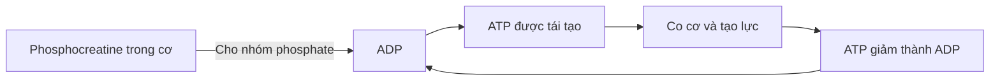
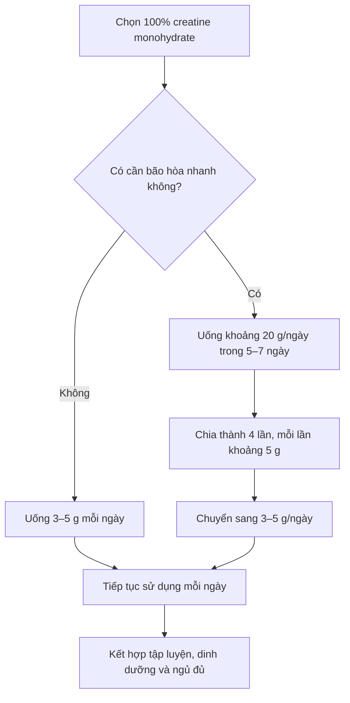
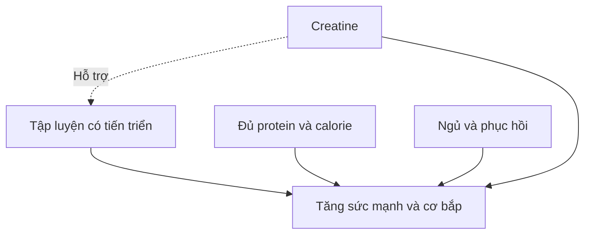

# 028 — How To Use Creatine

| Thuộc tính                     | Nội dung                        |
| ------------------------------ | ------------------------------- |
| **Module**                     | Module 03 — Supplements         |
| **Bài học**                    | How To Use Creatine             |
| **Thời lượng**                 | 03:53                           |
| **Chủ đề chính**               | Cách sử dụng creatine đúng cách |
| **Dạng được khuyến nghị**      | Creatine monohydrate            |
| **Liều phổ biến**              | 3–5 g mỗi ngày                  |
| **Nguyên tắc quan trọng nhất** | Dùng đều đặn mỗi ngày           |

> **Lưu ý về bản chép lời:** Một số từ đã bị nhận dạng sai:
>
> * “Creatine monocytogenes” → **creatine monohydrate**
> * “Cracklin” → có thể là **Kre-Alkalyn**
> * “Crimper trademark” → có thể là **Creapure®**
> * “Floating face” → **loading phase — giai đoạn nạp**
> * “Pour the excess creatine” → **đào thải phần creatine dư qua nước tiểu**

---

## Mục lục

1. [Mục tiêu bài học](#1-mục-tiêu-bài-học)
2. [Nội dung chính](#2-nội-dung-chính)
3. [Áp dụng thực tế](#3-áp-dụng-thực-tế)
4. [Lưu ý và lỗi thường gặp](#4-lưu-ý-và-lỗi-thường-gặp)
5. [Checklist thực hành](#5-checklist-thực-hành)
6. [Tóm tắt](#6-tóm-tắt)
7. [Tài liệu nghiên cứu](#7-tài-liệu-nghiên-cứu)

---

## 1. Mục tiêu bài học

Sau bài học này, bạn có thể:

* Hiểu creatine hỗ trợ tái tạo năng lượng ATP như thế nào.
* Biết vì sao **creatine monohydrate** là lựa chọn ưu tiên.
* Sử dụng đúng liều **3–5 g mỗi ngày**.
* Phân biệt cách dùng có nạp và không nạp.
* Hiểu rằng thời điểm uống không quan trọng bằng việc dùng đều đặn.
* Biết cách pha creatine và xử lý các vấn đề thường gặp.
* Nhận biết đối tượng nên tham khảo bác sĩ trước khi sử dụng.

---

## 2. Nội dung chính

### 2.1. Creatine là gì?

Creatine là một hợp chất chứa nitơ mà cơ thể có thể tự tổng hợp từ các amino acid như arginine, glycine và methionine. Phần lớn creatine trong cơ thể được lưu trữ trong cơ xương dưới dạng:

* **Creatine tự do**
* **Phosphocreatine — PCr**

Creatine không phải steroid, hormone hay chất kích thích. Vai trò nổi bật nhất của nó là giúp cơ thể tái tạo ATP nhanh hơn trong các hoạt động cường độ cao, thời gian ngắn. ([SpringerLink][1])


*Nguồn hình: Wikimedia Commons, phạm vi công cộng.* ([Wikimedia Commons][2])

---

### 2.2. Creatine hỗ trợ tạo năng lượng như thế nào?

**ATP — adenosine triphosphate** là nguồn năng lượng trực tiếp cho quá trình co cơ. Khi tập nặng, ATP nhanh chóng mất một nhóm phosphate và trở thành ADP.

Phosphocreatine có thể chuyển nhóm phosphate của nó cho ADP để tái tạo ATP:

```text
Phosphocreatine + ADP
          ↓ Creatine kinase
Creatine + ATP
```

Quá trình này giúp duy trì năng lượng cho những hoạt động như:

* Nâng tạ nặng.
* Chạy nước rút.
* Bật nhảy.
* Các hiệp vận động mạnh lặp lại.
* Những môn thể thao cần sức mạnh và công suất cao.




*Hình minh họa quá trình vận chuyển và tái tạo ATP qua hệ creatine–phosphocreatine.* ([Wikimedia Commons][3])

---

### 2.3. Creatine giúp cải thiện điều gì?

Creatine không trực tiếp “tạo cơ” giống như một hormone. Thay vào đó, nó có thể giúp bạn:

1. Tạo lực tốt hơn trong các hoạt động cường độ cao.
2. Thực hiện thêm số lần lặp hoặc duy trì công suất tốt hơn.
3. Tích lũy khối lượng tập luyện lớn hơn theo thời gian.
4. Từ đó hỗ trợ tăng sức mạnh và khối lượng cơ khi kết hợp với tập luyện hợp lý.

Creatine đặc biệt hữu ích với những hoạt động cường độ cao, ngắt quãng như tập tạ và chạy nước rút; tác dụng với các môn sức bền kéo dài thường ít rõ ràng hơn. ([ODS][4])

| Tác dụng                               | Giải thích                                                    |
| -------------------------------------- | ------------------------------------------------------------- |
| **Tăng khả năng tái tạo ATP**          | Hỗ trợ duy trì năng lượng trong các nỗ lực mạnh, ngắn         |
| **Tăng sức mạnh và công suất**         | Có thể giúp nâng mức tạ cao hơn hoặc duy trì số lần lặp       |
| **Tăng khối lượng tập luyện**          | Có thể hoàn thành nhiều công việc hơn trong buổi tập          |
| **Hỗ trợ tăng cơ dài hạn**             | Kích thích tập luyện lớn hơn có thể tạo ra thích nghi tốt hơn |
| **Tăng nước trong cơ ở giai đoạn đầu** | Cơ có thể trông đầy hơn và cân nặng có thể tăng nhẹ           |

> Creatine **không phải chất kích thích tức thời**. Uống một liều trước buổi tập không có nghĩa là bạn sẽ lập tức mạnh hơn trong buổi tập đó. Lợi ích xuất hiện khi lượng creatine trong cơ dần được nâng lên và duy trì.

---

### 2.4. Nên chọn loại creatine nào?

#### Lựa chọn ưu tiên: Creatine monohydrate

Creatine monohydrate là dạng:

* Được nghiên cứu nhiều nhất.
* Có hiệu quả đã được kiểm chứng rộng rãi.
* Có hồ sơ an toàn tốt ở người khỏe mạnh.
* Thường có giá thấp hơn các dạng “cao cấp”.
* Không có bằng chứng thuyết phục rằng các dạng khác vượt trội hơn.

Các dạng như creatine ethyl ester hoặc buffered creatine thường được quảng cáo là hấp thu tốt hơn, ít giữ nước hơn hoặc cần liều thấp hơn. Tuy nhiên, các nghiên cứu so sánh chưa cho thấy chúng đem lại lợi ích tốt hơn creatine monohydrate; creatine ethyl ester thậm chí kém hiệu quả hơn trong việc nâng creatine trong cơ ở một thử nghiệm. ([SpringerLink][1])

#### Cách đọc nhãn sản phẩm

Ưu tiên sản phẩm có:

```text
Ingredients: 100% Creatine Monohydrate
```

Nên tránh sản phẩm:

* Không công bố rõ hàm lượng creatine.
* Trộn quá nhiều thành phần không cần thiết.
* Dùng “proprietary blend” nhưng không ghi liều từng chất.
* Đưa ra những tuyên bố như “tăng cơ ngay lập tức” hoặc “không cần tập vẫn tăng cơ”.

> **Creapure®** là một thương hiệu nguyên liệu creatine monohydrate. Đây có thể là một dấu hiệu về nguồn nguyên liệu và quy trình kiểm soát chất lượng, nhưng không phải điều kiện bắt buộc để creatine có hiệu quả. Quan trọng nhất vẫn là sản phẩm chứa đúng creatine monohydrate, đủ liều và đến từ nhà sản xuất đáng tin cậy.

---

### 2.5. Nên uống bao nhiêu creatine?

Có hai cách sử dụng chính.

#### Phương án A — Không thực hiện giai đoạn nạp

Uống:

```text
3–5 g creatine monohydrate mỗi ngày
```

Với cách này:

* Lượng creatine trong cơ tăng dần.
* Thường cần khoảng 3–4 tuần để tiến gần mức bão hòa.
* Ít có nguy cơ khó chịu tiêu hóa hơn.
* Phù hợp với phần lớn người mới.

Nghiên cứu kinh điển cho thấy dùng khoảng 3 g/ngày trong 28 ngày có thể tạo ra mức tăng creatine trong cơ tương tự cách nạp 20 g/ngày trong khoảng sáu ngày, nhưng tốc độ chậm hơn. ([SpringerLink][1])

---

#### Phương án B — Có giai đoạn nạp

##### Giai đoạn nạp: 5–7 ngày

```text
Khoảng 0,3 g/kg cân nặng/ngày
```

Đối với người khoảng 70 kg:

```text
Khoảng 20 g/ngày
= 4 lần × 5 g
```

##### Giai đoạn duy trì

Sau khi kết thúc giai đoạn nạp:

```text
3–5 g/ngày
```

Giai đoạn nạp giúp cơ đạt mức creatine cao nhanh hơn, nhưng **không bắt buộc**. Nếu sử dụng lâu dài, cả hai phương pháp đều có thể đưa cơ đến mức bão hòa tương tự. ([SpringerLink][1])


*Hình nghiên cứu: chiến lược nạp 20–25 g/ngày trong 5–7 ngày rồi duy trì 3–5 g/ngày, hoặc sử dụng trực tiếp 3–5 g/ngày.* 

---

### 2.6. Sơ đồ lựa chọn cách dùng



---

### 2.7. Có nên dùng thìa cà phê để đo creatine?

Một thìa cà phê creatine thường được ước tính gần 3–5 g, nhưng kết quả có thể thay đổi tùy:

* Kích thước thìa.
* Độ mịn của bột.
* Cách vun hoặc gạt ngang.
* Độ nén của sản phẩm.

Cách chính xác hơn:

1. Dùng muỗng định lượng đi kèm sản phẩm.
2. Kiểm tra nhãn xem một muỗng chứa bao nhiêu gram.
3. Dùng cân điện tử có độ chính xác 0,1 g khi cần kiểm soát chặt.

---

### 2.8. Nên uống creatine vào thời điểm nào?

Đối với phần lớn người tập, **tính đều đặn quan trọng hơn thời điểm uống**.

Bạn có thể uống creatine:

* Buổi sáng.
* Trước khi tập.
* Sau khi tập.
* Cùng bữa ăn.
* Cùng protein shake.
* Vào bất kỳ thời điểm nào dễ duy trì nhất.

Các nghiên cứu so sánh uống ngay trước và ngay sau tập chưa cho thấy khác biệt đáng tin cậy, nhất quán về tăng sức mạnh hoặc phì đại cơ. Một số nghiên cứu nhỏ từng gợi ý uống sau tập có thể tốt hơn, nhưng các hạn chế phương pháp khiến chưa thể đưa ra kết luận chắc chắn. ([PubMed][5])

> **Quy tắc thực tế:** Chọn một thời điểm cố định mà bạn ít quên nhất.

Ví dụ:

```text
Mỗi sáng:
Protein shake + 5 g creatine
```

hoặc:

```text
Sau mỗi buổi tập:
Bữa ăn sau tập + 5 g creatine
```

Trong ngày nghỉ, vẫn tiếp tục sử dụng liều hằng ngày.

---

### 2.9. Có thể pha creatine với gì?

Creatine có thể được pha với:

* Nước lọc.
* Sữa.
* Protein shake.
* Nước trái cây.
* Sinh tố.
* Đồ uống không quá nóng.

Việc dùng cùng carbohydrate hoặc carbohydrate kết hợp protein có thể làm tăng mức giữ creatine trong cơ ở một số điều kiện. Tuy nhiên, bạn không cần cố tình uống một lượng đường lớn để creatine phát huy tác dụng. ([SpringerLink][6])

#### Cách pha đơn giản

```text
1. Cho 3–5 g creatine vào 200–400 ml chất lỏng.
2. Khuấy hoặc lắc đều.
3. Uống ngay sau khi pha.
4. Nếu còn cặn, thêm một ít nước và uống phần còn lại.
```

Creatine monohydrate không phải lúc nào cũng tan hoàn toàn trong nước lạnh. Có một ít cặn ở đáy cốc không có nghĩa là sản phẩm kém chất lượng.

---

### 2.10. Có cần uống creatine cùng nhiều đường không?

Không bắt buộc.

Insulin tăng sau bữa ăn chứa carbohydrate có thể hỗ trợ quá trình giữ creatine, nhưng:

* Creatine vẫn hoạt động khi pha với nước.
* Không cần dùng nước ngọt hoặc nước trái cây nhiều đường.
* Bổ sung thêm hàng trăm calorie từ đường có thể không phù hợp với mục tiêu giảm mỡ.
* Lợi ích chính phụ thuộc vào việc dùng đủ liều và đủ lâu.

| Mục tiêu      | Cách pha phù hợp                           |
| ------------- | ------------------------------------------ |
| Giảm mỡ       | Nước lọc hoặc đồ uống không calorie        |
| Tăng cân      | Sữa, sinh tố hoặc protein shake            |
| Dễ đau bụng   | Pha loãng hơn và uống cùng bữa ăn          |
| Muốn đơn giản | Nước lọc và uống vào cùng một giờ mỗi ngày |

---

### 2.11. Có cần thực hiện giai đoạn nạp không?

**Không.**

| Có nạp                                 | Không nạp                          |
| -------------------------------------- | ---------------------------------- |
| Bão hòa cơ nhanh hơn                   | Bão hòa chậm hơn                   |
| Khoảng 5–7 ngày                        | Khoảng 3–4 tuần                    |
| Dùng khoảng 20 g/ngày lúc đầu          | Dùng 3–5 g/ngày từ đầu             |
| Có thể tăng cân nước nhanh hơn         | Thay đổi cân nặng thường từ từ hơn |
| Dễ khó chịu tiêu hóa nếu uống liều lớn | Dễ thực hiện và dung nạp hơn       |

Đối với người mới, lựa chọn đơn giản nhất thường là:

```text
5 g mỗi ngày, không cần nạp
```

Nếu thực hiện giai đoạn nạp, nên chia nhỏ tổng liều. Uống hơn 10 g trong một lần có thể làm tăng nguy cơ đầy bụng hoặc tiêu chảy. ([SpringerLink][1])

---

### 2.12. Có cần dùng creatine theo chu kỳ không?

Không có yêu cầu phải sử dụng creatine theo chu kỳ kiểu:

```text
8 tuần dùng → 4 tuần nghỉ
```

Khi đang sử dụng đều đặn, lượng creatine trong cơ được duy trì ở mức cao hơn. Nếu ngừng sử dụng:

* Lượng creatine trong cơ sẽ giảm dần.
* Thường mất khoảng 4–6 tuần để trở về gần mức ban đầu.
* Cân nặng có thể giảm nhẹ do mất bớt nước trong cơ.
* Một phần lợi ích về hiệu suất có thể giảm.
* Không có hội chứng cai creatine.

Không có bằng chứng thuyết phục cho thấy dùng creatine đúng liều làm cơ thể mất khả năng sản xuất creatine tự nhiên vĩnh viễn. ([SpringerLink][6])

---

### 2.13. Creatine có gây giữ nước không?

Creatine có thể làm tăng lượng nước trong cơ, đặc biệt trong những ngày đầu của giai đoạn nạp.

Điều này có thể khiến:

* Cân nặng tăng nhẹ.
* Cơ trông đầy hơn.
* Một số người cảm thấy hơi căng hoặc đầy bụng.

Phần nước tăng lên chủ yếu liên quan đến việc creatine được đưa vào mô cơ. Đây không phải là tăng mỡ. Tuy vậy, mức thay đổi khác nhau giữa từng người và không phải nghiên cứu dài hạn nào cũng ghi nhận tổng lượng nước cơ thể tăng đáng kể. ([SpringerLink][1])

---

### 2.14. Creatine có an toàn không?

Ở người trưởng thành khỏe mạnh, creatine monohydrate sử dụng ở liều khuyến nghị nhìn chung được dung nạp tốt. Các nghiên cứu ngắn hạn và dài hạn không cho thấy tổn thương thận do creatine ở người khỏe mạnh dùng liều hợp lý. ([SpringerLink][6])

#### Tác dụng không mong muốn có thể gặp

* Tăng cân nhẹ do nước.
* Đầy bụng.
* Khó chịu dạ dày.
* Tiêu chảy nếu uống một liều quá lớn.
* Buồn nôn ở người nhạy cảm.

#### Creatinine trong xét nghiệm máu

Creatine có thể làm nồng độ **creatinine** trong máu tăng nhẹ. Creatinine thường được dùng để ước tính chức năng thận, nhưng mức tăng sau khi dùng creatine không nhất thiết đồng nghĩa với tổn thương thận.

Nếu đang sử dụng creatine và làm xét nghiệm, nên thông báo với bác sĩ để kết quả được diễn giải trong đúng bối cảnh. ([SpringerLink][1])

#### Nên tham khảo bác sĩ trước khi dùng nếu:

* Có bệnh thận hoặc tiền sử bất thường chức năng thận.
* Đang dùng thuốc có thể ảnh hưởng đến thận.
* Đang mang thai hoặc cho con bú.
* Chưa đủ 18 tuổi.
* Có bệnh lý mạn tính cần theo dõi.
* Được bác sĩ yêu cầu hạn chế một số chất bổ sung.

---

## 3. Áp dụng thực tế

### 3.1. Công thức đơn giản cho người mới

```text
Loại: 100% creatine monohydrate
Liều: 5 g
Tần suất: mỗi ngày
Thời điểm: bất kỳ lúc nào dễ nhớ
Cách pha: nước hoặc protein shake
Giai đoạn nạp: không bắt buộc
Chu kỳ nghỉ: không cần
```

---

### 3.2. Ví dụ lịch sử dụng không nạp

| Thời điểm           | Thực hiện                                     |
| ------------------- | --------------------------------------------- |
| 07:30               | Ăn sáng                                       |
| 07:35               | Uống 5 g creatine với nước hoặc protein shake |
| Ngày tập            | Tập theo lịch bình thường                     |
| Ngày nghỉ           | Vẫn uống 5 g creatine                         |
| Sau khoảng 3–4 tuần | Lượng creatine trong cơ tiến gần mức bão hòa  |

---

### 3.3. Ví dụ lịch nạp creatine

#### Ngày 1–7

| Thời điểm     |          Liều |
| ------------- | ------------: |
| Sau bữa sáng  |           5 g |
| Sau bữa trưa  |           5 g |
| Sau bữa chiều |           5 g |
| Sau bữa tối   |           5 g |
| **Tổng**      | **20 g/ngày** |

#### Từ ngày 8 trở đi

```text
3–5 g/ngày
```

---

### 3.4. Trường hợp hay bị đau bụng

Thay vì uống:

```text
10–20 g trong một lần
```

Hãy thử:

```text
3–5 g mỗi lần
+ pha với nhiều nước hơn
+ uống cùng hoặc sau bữa ăn
```

Nếu vẫn khó chịu, ngừng sử dụng và trao đổi với chuyên gia y tế.

---

### 3.5. Creatine không thay thế nền tảng dinh dưỡng



Creatine chỉ là một yếu tố hỗ trợ. Nó không thể bù đắp cho:

* Chương trình tập thiếu tính tiến triển.
* Ăn không đủ protein.
* Thiếu calorie khi muốn tăng cân.
* Ngủ quá ít.
* Tập luyện không đều.
* Kỹ thuật động tác kém.

---

## 4. Lưu ý và lỗi thường gặp

### Lỗi 1 — Chọn dạng creatine đắt tiền vì quảng cáo

**Ví dụ:**

* “Hấp thu nhanh gấp 10 lần.”
* “Không giữ nước.”
* “Chỉ cần 1 g mỗi ngày.”
* “Công thức pH đặc biệt.”

**Cách sửa:** Chọn creatine monohydrate đơn chất, đủ liều và từ nhà sản xuất uy tín.

---

### Lỗi 2 — Chỉ uống vào ngày tập

Creatine hoạt động bằng cách nâng và duy trì lượng creatine trong cơ, không phải bằng tác dụng kích thích tức thời.

**Cách sửa:** Uống mỗi ngày, kể cả ngày nghỉ.

---

### Lỗi 3 — Quá tập trung vào thời điểm uống

Dành nhiều thời gian tranh luận “trước hay sau tập” nhưng lại thường xuyên quên uống.

**Cách sửa:** Gắn creatine với một thói quen cố định như ăn sáng hoặc đánh protein shake.

---

### Lỗi 4 — Uống toàn bộ liều nạp trong một lần

Uống 20 g trong một lần dễ gây khó chịu tiêu hóa.

**Cách sửa:** Chia thành bốn lần, mỗi lần khoảng 5 g.

---

### Lỗi 5 — Cho rằng tăng cân là tăng mỡ

Creatine có thể làm tăng nước trong cơ trong giai đoạn đầu.

**Cách sửa:** Theo dõi vòng eo, hình ảnh, sức mạnh và xu hướng cân nặng trong nhiều tuần thay vì kết luận từ một lần cân.

---

### Lỗi 6 — Dùng quá nhiều vì nghĩ liều cao sẽ hiệu quả hơn

Sau khi cơ đã bão hòa, dùng liều rất cao thường không đem lại lợi ích tương ứng và có thể làm tăng khó chịu tiêu hóa.

**Cách sửa:** Duy trì 3–5 g/ngày, trừ khi có hướng dẫn riêng từ chuyên gia.

---

### Lỗi 7 — Đo bằng thìa không chuẩn

“1 thìa” của mỗi người có thể khác nhau đáng kể.

**Cách sửa:** Dùng muỗng định lượng của sản phẩm hoặc cân điện tử.

---

### Lỗi 8 — Cho rằng creatine gây tăng cơ mà không cần tập

Creatine có thể hỗ trợ khả năng tập luyện nhưng không thay thế kích thích cơ học.

**Cách sửa:** Kết hợp với chương trình tập kháng lực có progressive overload.

---

## 5. Checklist thực hành

### Trước khi mua

* [ ] Sản phẩm ghi rõ **100% creatine monohydrate**.
* [ ] Hàm lượng mỗi khẩu phần được công bố rõ.
* [ ] Không có quá nhiều thành phần pha trộn không cần thiết.
* [ ] Nhà sản xuất có thông tin và tiêu chuẩn chất lượng rõ ràng.
* [ ] Không tin vào các tuyên bố “tăng cơ ngay lập tức”.

### Khi bắt đầu sử dụng

* [ ] Chọn dùng trực tiếp 3–5 g/ngày hoặc thực hiện giai đoạn nạp.
* [ ] Dùng đúng muỗng định lượng hoặc cân theo gram.
* [ ] Chọn một thời điểm cố định dễ nhớ.
* [ ] Uống cả ngày tập lẫn ngày nghỉ.
* [ ] Chia nhỏ liều nếu đang nạp.

### Trong quá trình sử dụng

* [ ] Theo dõi khả năng dung nạp tiêu hóa.
* [ ] Không lo lắng nếu cân nặng tăng nhẹ do nước trong cơ.
* [ ] Duy trì lượng nước uống phù hợp với nhu cầu cá nhân và mức vận động.
* [ ] Không tự ý tăng liều vì muốn có kết quả nhanh hơn.
* [ ] Thông báo với bác sĩ rằng mình đang dùng creatine khi xét nghiệm chức năng thận.

### Nền tảng bắt buộc

* [ ] Tập luyện đều đặn.
* [ ] Có progressive overload.
* [ ] Ăn đủ protein.
* [ ] Kiểm soát tổng calorie theo mục tiêu.
* [ ] Ngủ và phục hồi đầy đủ.

---

## 6. Tóm tắt

> **Creatine monohydrate là một trong những thực phẩm bổ sung có bằng chứng nghiên cứu mạnh nhất cho sức mạnh và hiệu suất vận động cường độ cao.**

Những điểm quan trọng nhất:

1. Chọn **100% creatine monohydrate**.
2. Uống **3–5 g mỗi ngày** là đủ cho phần lớn người trưởng thành.
3. Giai đoạn nạp 20 g/ngày trong 5–7 ngày có thể giúp bão hòa nhanh hơn nhưng không bắt buộc.
4. Thời điểm uống không quan trọng bằng việc uống đều đặn.
5. Có thể pha với nước, sữa, protein shake hoặc đồ uống phù hợp.
6. Không cần uống cùng nhiều đường.
7. Không cần dùng creatine theo chu kỳ.
8. Tăng cân nhẹ ban đầu thường liên quan đến nước trong cơ, không phải tăng mỡ.
9. Creatine nhìn chung an toàn ở người khỏe mạnh khi sử dụng đúng liều.
10. Người có bệnh thận hoặc tình trạng y tế đặc biệt nên tham khảo bác sĩ trước khi dùng.

### Công thức ghi nhớ

```text
Creatine monohydrate
+ 3–5 g mỗi ngày
+ sử dụng đều đặn
+ tập luyện có tiến triển
+ dinh dưỡng và phục hồi tốt
= cách dùng đơn giản và hiệu quả
```

---

## 7. Tài liệu nghiên cứu

1. **International Society of Sports Nutrition Position Stand — Safety and efficacy of creatine supplementation in exercise, sport and medicine.** Tài liệu tổng quan về hiệu quả, liều sử dụng và an toàn của creatine monohydrate. ([SpringerLink][6])
2. **Common questions and misconceptions about creatine supplementation.** Phân tích các vấn đề như giữ nước, chức năng thận, giai đoạn nạp và các dạng creatine thay thế. ([SpringerLink][1])
3. **Muscle creatine loading in men.** Nghiên cứu so sánh chiến lược nạp nhanh với liều thấp kéo dài. ([PubMed][7])
4. **Timing of creatine supplementation does not influence resistance-training adaptations.** Kết quả cho thấy uống trước hoặc sau tập tạo ra mức tăng sức mạnh và cơ tương tự. ([PubMed][8])
5. **Effect of creatine supplementation on kidney function — systematic review and meta-analysis.** Không ghi nhận thay đổi có ý nghĩa về mức lọc cầu thận, dù creatinine máu có thể tăng nhẹ. ([PubMed][9])
6. **The effects of creatine ethyl ester supplementation.** Creatine ethyl ester không hiệu quả bằng creatine monohydrate trong việc nâng creatine trong cơ. ([PubMed][10])

[1]: https://jissn.biomedcentral.com/articles/10.1186/s12970-021-00412-w "Common questions and misconceptions about creatine supplementation: what does the scientific evidence really show? | Journal of the International Society of Sports Nutrition | Springer Nature Link"
[2]: https://commons.wikimedia.org/wiki/File%3ACreatine.svg "File:Creatine.svg - Wikimedia Commons"
[3]: https://commons.wikimedia.org/wiki/File%3ACreatine_Phosphate_Shuttle_Diagram.png "File:Creatine Phosphate Shuttle Diagram.png - Wikimedia Commons"
[4]: https://ods.od.nih.gov/factsheets/ExerciseAndAthleticPerformance-HealthProfessional/?utm_source=chatgpt.com "Dietary Supplements for Exercise and Athletic Performance"
[5]: https://pubmed.ncbi.nlm.nih.gov/23919405/?utm_source=chatgpt.com "The effects of pre versus post workout supplementation ..."
[6]: https://jissn.biomedcentral.com/articles/10.1186/s12970-017-0173-z "International Society of Sports Nutrition position stand: safety and efficacy of creatine supplementation in exercise, sport, and medicine | Journal of the International Society of Sports Nutrition | Springer Nature Link"
[7]: https://pubmed.ncbi.nlm.nih.gov/8828669/?utm_source=chatgpt.com "Muscle creatine loading in men"
[8]: https://pubmed.ncbi.nlm.nih.gov/34610729/?utm_source=chatgpt.com "Timing of creatine supplementation does not influence ..."
[9]: https://pubmed.ncbi.nlm.nih.gov/41199218/?utm_source=chatgpt.com "Effect of creatine supplementation on kidney function"
[10]: https://pubmed.ncbi.nlm.nih.gov/19228401/?utm_source=chatgpt.com "The effects of creatine ethyl ester supplementation ..."
