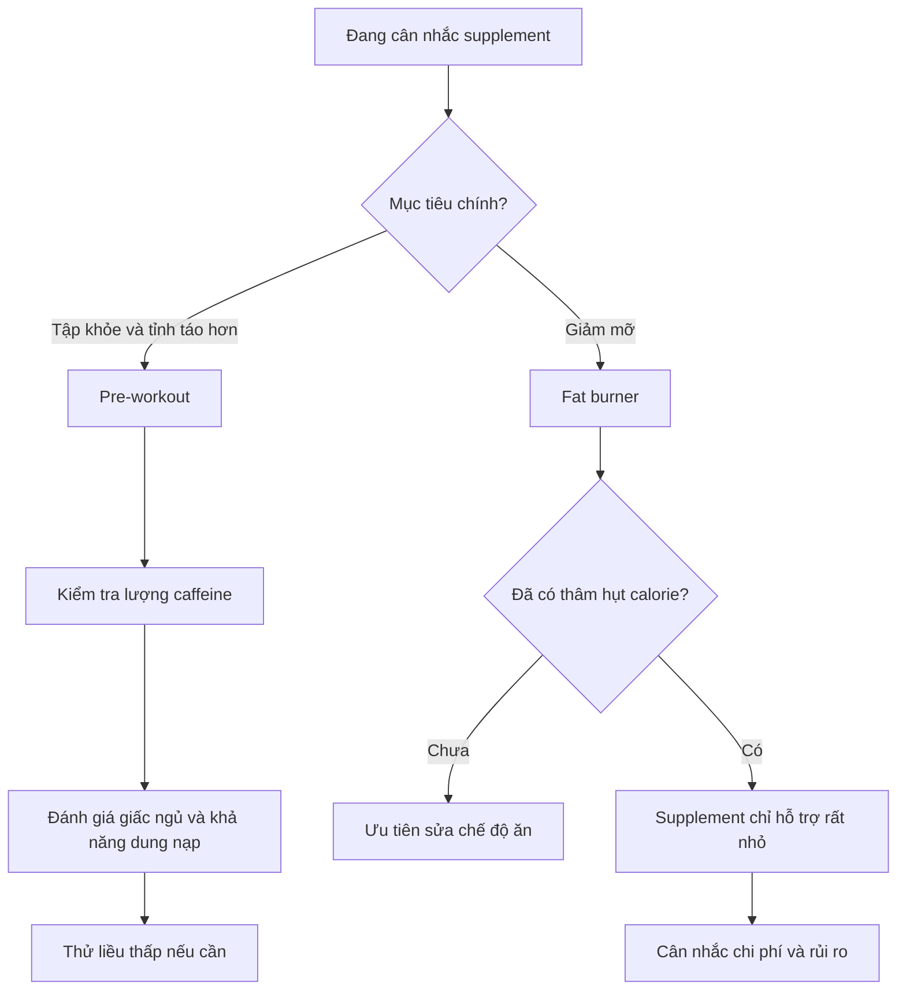
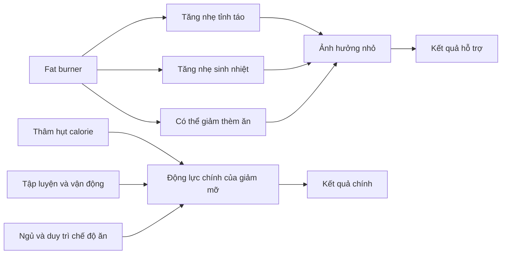

# 029 — Other Supplements To Consider

| Thuộc tính       | Nội dung                                          |
| ---------------- | ------------------------------------------------- |
| **Module**       | Module 03 — Supplements                           |
| **Bài học**      | Other Supplements To Consider                     |
| **Thời lượng**   | 04:32                                             |
| **Chủ đề chính** | Những loại thực phẩm bổ sung khác có thể cân nhắc |

> **Thông điệp cốt lõi:** Pre-workout có thể hỗ trợ hiệu suất, chủ yếu nhờ caffeine. Trong khi đó, “fat burner” chỉ tạo ra tác động nhỏ và không thể thay thế thâm hụt calorie, tập luyện, giấc ngủ và khả năng duy trì chế độ ăn.

## Mục lục

1. [Mục tiêu bài học](#1-mục-tiêu-bài-học)
2. [Nội dung chính](#2-nội-dung-chính)
3. [Áp dụng thực tế](#3-áp-dụng-thực-tế)
4. [Lưu ý & lỗi thường gặp](#4-lưu-ý--lỗi-thường-gặp)
5. [Checklist thực hành](#5-checklist-thực-hành)
6. [Tóm tắt](#6-tóm-tắt)

---

## 1. Mục tiêu bài học

Sau bài học này, bạn có thể:

* Hiểu pre-workout thực sự hoạt động nhờ những thành phần nào.
* Biết cách sử dụng caffeine trước tập hợp lý mà không cần mua sản phẩm quá đắt.
* Hiểu vì sao “fat burner” không trực tiếp làm mỡ biến mất.
* Đánh giá thực tế các thành phần như caffeine, **p-synephrine** và chiết xuất trà xanh.
* Nhận biết các tuyên bố tiếp thị phóng đại và nguy cơ cộng dồn chất kích thích.
* Xác định khi nào thực phẩm bổ sung đáng cân nhắc và khi nào nên bỏ qua.

---

## 2. Nội dung chính

### 2.1. Hai nhóm sản phẩm được đề cập

Bài học đề cập đến hai nhóm thực phẩm bổ sung phổ biến:

| Nhóm            | Mục đích được quảng cáo                          | Đánh giá thực tế                                                              |
| --------------- | ------------------------------------------------ | ----------------------------------------------------------------------------- |
| **Pre-workout** | Tăng tỉnh táo, năng lượng và hiệu suất tập luyện | Có thể hữu ích, nhưng phần lớn hiệu ứng cấp tính thường đến từ caffeine       |
| **Fat burner**  | Tăng trao đổi chất, giảm thèm ăn và “đốt mỡ”     | Tác động thường nhỏ; không có hiệu quả đáng kể nếu không tạo thâm hụt calorie |



---

### 2.2. Ghi chú chuẩn hóa bản chép lời

Một số tên thành phần trong bản chép lời có khả năng bị nhận dạng sai:

| Bản chép lời              | Thuật ngữ có khả năng đúng                      | Ghi chú                                                          |
| ------------------------- | ----------------------------------------------- | ---------------------------------------------------------------- |
| “Atrazine”                | **Beta-alanine**                                | Thành phần thường gặp trong pre-workout                          |
| “Citroën”                 | **Citrulline** hoặc citrulline malate           | Thường được dùng với mục tiêu hỗ trợ lưu lượng máu và sức bền cơ |
| “Significant”             | **p-Synephrine**                                | Chất kích thích có trong cam đắng                                |
| “Norrington and Spiridon” | Có thể là **naringenin/naringin và hesperidin** | Các flavonoid có trong trái cây họ cam quýt                      |

Beta-alanine không tạo ra toàn bộ lợi ích ngay sau một lần uống. Tác dụng của nó liên quan đến việc bổ sung đều đặn trong nhiều tuần để tăng carnosine trong cơ, khác với tác dụng cấp tính của caffeine. ([SpringerLink][1])

---

## 2.3. Pre-workout hoạt động như thế nào?

### Thành phần đóng vai trò chính: caffeine

Nhiều sản phẩm pre-workout được tiếp thị bằng những cụm từ như:

* “Công thức năng lượng thế hệ mới”.
* “Kích hoạt hormone đồng hóa”.
* “Tăng testosterone tức thì”.
* “Ma trận tập trung độc quyền”.
* “Pump cực đại”.

Tuy nhiên, với nhiều sản phẩm, cảm giác tỉnh táo, hưng phấn và sẵn sàng tập chủ yếu đến từ **caffeine**. Một số sản phẩm còn chứa beta-alanine, citrulline, creatine hoặc các thành phần khác, nhưng lợi ích cấp tính dễ nhận thấy thường liên quan mạnh đến caffeine. ([SpringerLink][2])


*Nguồn ảnh: [Wikimedia Commons – Caffeine molecule](https://commons.wikimedia.org/wiki/File:Caffeine_molecule_spacefill_from_xtal_%281%29.png).*

### Tác dụng có thể nhận được

Caffeine có thể hỗ trợ:

* Tăng sự tỉnh táo và khả năng tập trung.
* Giảm cảm giác gắng sức chủ quan.
* Trì hoãn mệt mỏi trong một số loại bài tập.
* Cải thiện nhẹ sức bền cơ, sức mạnh, công suất hoặc hiệu suất sức bền.
* Giúp duy trì chất lượng buổi tập khi mức năng lượng thấp.

Bằng chứng tổng hợp cho thấy caffeine có thể cải thiện nhiều dạng hiệu suất vận động, nhưng mức đáp ứng khác nhau đáng kể giữa từng người. ([SpringerLink][2])

### Liều lượng theo nghiên cứu

Liều thường được nghiên cứu là:

[
\text{Caffeine trước tập} = 3–6\text{ mg/kg cân nặng}
]

Ví dụ với người nặng **70 kg**:

| Liều    | Phép tính | Tổng caffeine |
| ------- | --------: | ------------: |
| 2 mg/kg |    70 × 2 |        140 mg |
| 3 mg/kg |    70 × 3 |        210 mg |
| 6 mg/kg |    70 × 6 |        420 mg |

Các nghiên cứu thường sử dụng khoảng **3–6 mg/kg**, uống khoảng 60 phút trước vận động. Tuy nhiên, liều rất cao như 9 mg/kg làm tăng nguy cơ tác dụng phụ mà không nhất thiết tạo thêm lợi ích. ([SpringerLink][2])

> **Không cần bắt đầu ở 3–6 mg/kg.** Người chưa quen caffeine nên thử lượng thấp hơn để đánh giá phản ứng của cơ thể.

FDA cho biết với đa số người trưởng thành khỏe mạnh, tổng lượng khoảng **400 mg caffeine mỗi ngày** thường không liên quan đến tác dụng bất lợi rõ rệt. Đây là tổng caffeine từ cà phê, trà, nước tăng lực, pre-workout và các nguồn khác, không phải 400 mg cho riêng buổi tập. ([U.S. Food and Drug Administration][3])

### Thời điểm sử dụng

Caffeine dạng viên hoặc đồ uống thường được dùng khoảng:

[
\boxed{30–60\ \text{phút trước khi tập}}
]

Thời gian tối ưu phụ thuộc dạng sản phẩm. Kẹo cao su caffeine có thể hấp thu nhanh hơn, trong khi viên nang thường cần nhiều thời gian hơn. ([SpringerLink][2])

### Có cần mua pre-workout thương mại?

Không nhất thiết.

Bạn có thể nhận caffeine từ:

* Cà phê.
* Trà.
* Viên caffeine có liều lượng rõ ràng.
* Kẹo cao su hoặc gel caffeine.
* Pre-workout pha sẵn.

Điểm yếu của một số sản phẩm thương mại là:

* Giá cao.
* Liều thành phần không minh bạch.
* Dùng “proprietary blend” nên không biết lượng từng chất.
* Caffeine cao hơn mức người dùng tưởng.
* Kết hợp nhiều chất kích thích trong cùng một sản phẩm.

Pre-workout không mặc nhiên là lãng phí, nhưng giá trị của nó phụ thuộc vào **liều thành phần, độ minh bạch, khả năng kiểm nghiệm và mức độ phù hợp với người dùng**.

---

### 2.4. Vai trò của các thành phần khác trong pre-workout

| Thành phần                       | Vai trò tiềm năng                                          | Lưu ý                                                                                |
| -------------------------------- | ---------------------------------------------------------- | ------------------------------------------------------------------------------------ |
| **Caffeine**                     | Tỉnh táo và hỗ trợ hiệu suất cấp tính                      | Thành phần có bằng chứng mạnh nhất trong nhóm này                                    |
| **Beta-alanine**                 | Tăng khả năng đệm acid trong cơ                            | Cần dùng đều nhiều tuần; cảm giác châm chích không đồng nghĩa sản phẩm đang “đốt mỡ” |
| **Citrulline/citrulline malate** | Có thể hỗ trợ nitric oxide, lưu lượng máu và sức bền cơ    | Kết quả nghiên cứu chưa hoàn toàn đồng nhất                                          |
| **Creatine**                     | Hỗ trợ sức mạnh, công suất và thích nghi tập luyện         | Cần dùng hằng ngày; không nhất thiết phải uống đúng trước tập                        |
| **L-tyrosine**                   | Có thể hỗ trợ nhận thức trong một số tình huống căng thẳng | Không phải thành phần cốt lõi để tăng sức mạnh                                       |
| **Vitamin nhóm B**               | Tham gia chuyển hóa năng lượng                             | Không tạo “năng lượng tức thì” nếu cơ thể không thiếu hụt                            |

> Cảm giác châm chích do beta-alanine thường được dùng để khiến người dùng cảm thấy pre-workout “đang hoạt động”. Thực tế, tác dụng dài hạn của beta-alanine phụ thuộc tổng lượng sử dụng đều đặn, không phụ thuộc việc có cảm giác châm chích hay không. ([SpringerLink][1])

---

## 2.5. Fat burner có thực sự “đốt mỡ” không?

Tên gọi **fat burner** dễ khiến người dùng hiểu rằng viên uống sẽ trực tiếp làm mỡ cơ thể biến mất. Đây là cách hiểu không chính xác.

Giảm mỡ lâu dài đòi hỏi cơ thể tiêu hao nhiều năng lượng hơn lượng năng lượng được nạp vào:

[
\text{Năng lượng tiêu hao} > \text{Năng lượng nạp vào}
]

Hay nói cách khác:

[
\boxed{\text{Giảm mỡ} \approx \text{Thâm hụt calorie được duy trì theo thời gian}}
]

Fat burner có thể được thiết kế để:

1. Làm tăng nhẹ mức tiêu hao năng lượng.
2. Giúp tỉnh táo và tập luyện tốt hơn.
3. Hạn chế cảm giác đói ở một số người.
4. Khiến quá trình ăn kiêng dễ chịu hơn.

Nhưng chúng không thể vô hiệu hóa một chế độ ăn dư thừa calorie. Các tổng quan về sản phẩm giảm cân cho thấy phần lớn supplement tạo ra rất ít hoặc không tạo ra mức giảm cân có ý nghĩa trong dài hạn. ([ODS][4])



---

### 2.6. Những thành phần thường gặp trong fat burner

#### A. Caffeine

Caffeine có thể:

* Tăng nhẹ tiêu hao năng lượng.
* Tăng tỉnh táo.
* Giúp duy trì cường độ tập luyện.
* Làm tăng sử dụng chất béo làm nhiên liệu trong một số điều kiện tập aerobic.

Tuy nhiên, việc đốt nhiều chất béo hơn trong một buổi tập **không tự động đồng nghĩa với giảm nhiều mỡ cơ thể hơn trong nhiều tuần hoặc nhiều tháng**. Tổng cân bằng năng lượng vẫn là yếu tố quyết định.

Một thử nghiệm ở phụ nữ vận động cho thấy cả 3 và 6 mg/kg caffeine đều làm tăng tốc độ oxy hóa chất béo trong bài tập dưới tối đa, nhưng 6 mg/kg không tạo lợi ích rõ ràng hơn 3 mg/kg. ([PubMed Central (PMC)][5])

#### B. p-Synephrine

**p-Synephrine** là một hợp chất có trong cam đắng, thường được thêm vào các sản phẩm “thermogenic”.


*Nguồn ảnh: [Wikimedia Commons – Citrus × aurantium](https://commons.wikimedia.org/wiki/File:Bitter_orange_-_Citrus_%C3%97_aurantium_03.jpg).*

Một số thử nghiệm ghi nhận p-synephrine làm tăng oxy hóa chất béo trong lúc vận động, nhưng kết quả không đồng nhất giữa các nhóm đối tượng. Một tổng quan năm 2022 không tìm thấy bằng chứng thuyết phục rằng synephrine tạo ra giảm cân hoặc cải thiện thành phần cơ thể đáng kể, đồng thời ghi nhận khả năng ảnh hưởng nhịp tim và huyết áp. ([PubMed Central (PMC)][6])

Kết hợp synephrine với caffeine có thể làm tăng nguy cơ tác dụng phụ liên quan đến chất kích thích. ([ODS][7])

#### C. Chiết xuất trà xanh

Trà xanh chứa caffeine và các catechin, đặc biệt là EGCG.


*Nguồn ảnh: [Wikimedia Commons – Green tea leaves](https://commons.wikimedia.org/wiki/File:Green_tea_leaves.jpg).*

Một số nghiên cứu ghi nhận chiết xuất trà xanh có thể hỗ trợ oxy hóa chất béo, nhưng kết quả tổng thể chưa đồng nhất và mức ảnh hưởng đến cân nặng thường nhỏ. ([PubMed][8])

#### Hình ảnh từ nghiên cứu


*Hình từ một nghiên cứu về chiết xuất trà xanh và bài tập chạy nước rút ngắt quãng. Chỉ số chuyển hóa thay đổi trong phòng thí nghiệm không đồng nghĩa chắc chắn với giảm mỡ dài hạn.* ([DOI][9])

> Chiết xuất trà xanh dạng viên nang cô đặc không giống với việc uống một tách trà. Một số trường hợp tổn thương gan hiếm gặp đã được báo cáo với sản phẩm chiết xuất trà xanh, đặc biệt ở dạng viên hoặc capsule. ([NCCIH][10])

#### D. Naringenin, naringin và hesperidin

Đây là các flavonoid có trong cam, bưởi và một số loại thực vật.


*Nguồn ảnh: [Wikimedia Commons – Citrus fruits](https://commons.wikimedia.org/wiki/File:Citrus_fruits_%28lemon,_lime,_orange_and_grapefruit%29.jpg).*

Những hợp chất này đang được nghiên cứu về tuần hoàn, chuyển hóa và sức khỏe tim mạch. Tuy nhiên, chưa có bằng chứng mạnh để xem chúng là thành phần “đốt mỡ” bắt buộc hoặc để kỳ vọng mức giảm mỡ đáng kể từ việc bổ sung riêng lẻ. ([PubMed Central (PMC)][11])

---

### 2.7. Xếp hạng mức độ ưu tiên

| Biện pháp                        | Mức ảnh hưởng đến kết quả |
| -------------------------------- | ------------------------- |
| Kiểm soát tổng calorie           | ⭐⭐⭐⭐⭐                     |
| Đủ protein và chất xơ            | ⭐⭐⭐⭐⭐                     |
| Tập kháng lực đều đặn            | ⭐⭐⭐⭐⭐                     |
| Đi bộ và tăng vận động hằng ngày | ⭐⭐⭐⭐                      |
| Ngủ và phục hồi                  | ⭐⭐⭐⭐                      |
| Caffeine trước tập khi phù hợp   | ⭐⭐                        |
| Fat burner                       | ⭐ hoặc thấp hơn           |

---

## 3. Áp dụng thực tế

### 3.1. Quy trình lựa chọn pre-workout

#### Bước 1: Xác định có thực sự cần không

Bạn có thể không cần pre-workout nếu:

* Đã ngủ đủ và có năng lượng tốt.
* Tập vào buổi tối.
* Dễ lo âu hoặc mất ngủ.
* Uống nhiều cà phê trong ngày.
* Chỉ muốn cảm giác mạnh thay vì cải thiện chương trình tập.

#### Bước 2: Tính tổng caffeine trong ngày

Ví dụ:

| Nguồn            | Caffeine ước tính |
| ---------------- | ----------------: |
| Cà phê buổi sáng |            100 mg |
| Trà buổi trưa    |             40 mg |
| Pre-workout      |            200 mg |
| **Tổng**         |        **340 mg** |

Hàm lượng caffeine trong cà phê và supplement có thể biến động lớn, vì vậy nên kiểm tra nhãn thay vì chỉ đếm số cốc. ([SpringerLink][2])

#### Bước 3: Thử liều thấp

Một cách thận trọng:

1. Bắt đầu với khoảng 50–100 mg.
2. Theo dõi nhịp tim, mức lo âu, tiêu hóa và giấc ngủ.
3. Chỉ tăng khi thật sự cần thiết.
4. Không tăng liều chỉ vì cảm giác “không còn phê”.

#### Bước 4: Theo dõi hiệu quả thực tế

Ghi lại:

* Khối lượng tạ.
* Số lần lặp.
* Tổng volume.
* Tốc độ hoặc thời gian chạy.
* Mức gắng sức.
* Chất lượng giấc ngủ sau buổi tập.

Nếu supplement làm bạn tập mạnh hơn một chút nhưng khiến bạn mất ngủ, tổng kết quả có thể xấu đi.

---

### 3.2. Công thức pre-workout đơn giản

Một phương án tối giản có thể là:

```text
Nước + một nguồn caffeine có liều rõ ràng
              ↓
Uống trước tập khoảng 30–60 phút
              ↓
Theo dõi hiệu suất và giấc ngủ
```

Không nên tự cân caffeine tinh khiết dạng bột số lượng lớn. Sai lệch rất nhỏ khi đo có thể tạo ra liều nguy hiểm; FDA đã cảnh báo về các sản phẩm caffeine tinh khiết hoặc cô đặc cao bán dạng rời. ([U.S. Food and Drug Administration][12])

---

### 3.3. Quy trình đánh giá fat burner

Trước khi mua, hãy trả lời:

| Câu hỏi                                    | Nếu câu trả lời là “không” |
| ------------------------------------------ | -------------------------- |
| Tôi đang duy trì thâm hụt calorie hợp lý?  | Chưa cần fat burner        |
| Tôi đã kiểm soát protein và chất xơ?       | Ưu tiên sửa chế độ ăn      |
| Tôi ngủ đủ?                                | Ưu tiên cải thiện giấc ngủ |
| Tôi có biết tổng lượng caffeine không?     | Không nên sử dụng          |
| Nhãn sản phẩm ghi rõ liều từng chất?       | Không nên mua              |
| Lợi ích nhỏ có đáng với chi phí và rủi ro? | Bỏ qua sản phẩm            |

---

## 4. Lưu ý & lỗi thường gặp

### Lỗi 1: Nghĩ rằng càng nhiều caffeine càng tập khỏe

Liều cao hơn không bảo đảm hiệu suất tốt hơn. Caffeine quá mức có thể gây:

* Run tay.
* Tim đập nhanh hoặc hồi hộp.
* Lo âu.
* Đau đầu.
* Buồn nôn.
* Rối loạn tiêu hóa.
* Mất ngủ.
* Giảm khả năng kiểm soát kỹ thuật động tác.

Các tác dụng phụ thường tăng theo liều. ([SpringerLink][2])

### Lỗi 2: Uống pre-workout vào chiều tối

Thời gian bán thải của caffeine thường khoảng 4–6 giờ nhưng có thể thay đổi nhiều giữa các cá nhân. Caffeine có thể làm chậm thời điểm vào giấc, giảm thời lượng và chất lượng ngủ. ([SpringerLink][2])

### Lỗi 3: Bắt buộc “cai caffeine” vài tuần một lần

Không có quy tắc bắt buộc mọi người phải ngưng caffeine theo chu kỳ cố định. Một số nghiên cứu ghi nhận hiện tượng dung nạp, trong khi những nghiên cứu khác vẫn quan sát thấy lợi ích ở người dùng thường xuyên. Nên điều chỉnh dựa trên hiệu quả, tác dụng phụ và giấc ngủ thay vì áp dụng một lịch “cycling” cứng nhắc. ([SpringerLink][2])

### Lỗi 4: Cộng dồn nhiều chất kích thích

Không nên kết hợp tùy tiện:

* Pre-workout nhiều caffeine.
* Cà phê.
* Nước tăng lực.
* Fat burner.
* Synephrine hoặc các chất kích thích khác.

Hãy đọc toàn bộ nhãn và tính **tổng liều trong ngày**.

### Lỗi 5: Đánh đồng “oxy hóa chất béo” với “giảm mỡ”

Một chất làm tăng sử dụng mỡ làm năng lượng trong vài giờ không nhất thiết tạo ra giảm mỡ lâu dài. Cơ thể có thể điều chỉnh việc sử dụng carbohydrate và chất béo trong những thời điểm khác của ngày.

### Lỗi 6: Dựa vào fat burner để bù cho việc ăn quá nhiều

```text
Dư calorie + fat burner ≠ giảm mỡ

Thâm hụt calorie được duy trì
+ tập luyện
+ đủ protein
+ ngủ tốt
= nền tảng giảm mỡ
```

### Lỗi 7: Tin vào “proprietary blend”

Nếu nhãn chỉ ghi tổng khối lượng hỗn hợp mà không ghi rõ lượng caffeine, synephrine hoặc từng thành phần, rất khó đánh giá hiệu quả và độ an toàn.

### Lỗi 8: Bỏ qua bệnh lý và thuốc đang sử dụng

Người có bệnh tim mạch, huyết áp cao, rối loạn lo âu, mất ngủ, bệnh gan, đang mang thai hoặc đang dùng thuốc nên trao đổi với bác sĩ hoặc dược sĩ trước khi sử dụng sản phẩm chứa nhiều chất kích thích hoặc chiết xuất thảo dược cô đặc.

Đặc biệt, bưởi và một số hợp chất trong bưởi có thể tương tác với nhiều loại thuốc; không nên cho rằng sản phẩm “tự nhiên” luôn an toàn.

---

## 5. Checklist thực hành

### Trước khi dùng pre-workout

* [ ] Tôi đã kiểm tra lượng caffeine trên nhãn.
* [ ] Tôi đã cộng caffeine từ cà phê, trà và nước tăng lực.
* [ ] Tôi không tập quá gần giờ ngủ.
* [ ] Tôi bắt đầu với liều thấp.
* [ ] Tôi không kết hợp nhiều sản phẩm kích thích.
* [ ] Sản phẩm ghi rõ liều từng thành phần.
* [ ] Tôi theo dõi hiệu suất thay vì chỉ theo dõi cảm giác hưng phấn.
* [ ] Tôi ngừng sử dụng khi có hồi hộp, đau ngực, choáng hoặc phản ứng bất thường.

### Trước khi mua fat burner

* [ ] Tôi đã có thâm hụt calorie hợp lý.
* [ ] Tôi đang ăn đủ protein và chất xơ.
* [ ] Tôi đã kiểm soát giấc ngủ và mức vận động.
* [ ] Tôi hiểu lợi ích của sản phẩm có thể rất nhỏ.
* [ ] Tôi đã kiểm tra caffeine và synephrine.
* [ ] Tôi không dùng sản phẩm có hỗn hợp không rõ liều.
* [ ] Tôi đã xem xét tương tác với thuốc.
* [ ] Tôi chấp nhận rằng không dùng fat burner vẫn có thể giảm mỡ hoàn toàn bình thường.

---

## 6. Tóm tắt

1. **Pre-workout có thể hoạt động**, nhưng caffeine thường là thành phần tạo ra phần lớn hiệu ứng cấp tính dễ nhận thấy.
2. Caffeine thường được nghiên cứu ở mức **3–6 mg/kg**, nhưng người mới không cần bắt đầu với liều cao.
3. Tổng caffeine từ mọi nguồn cần được tính chung; với đa số người trưởng thành khỏe mạnh, khoảng **400 mg/ngày** là ngưỡng thường được FDA nhắc đến, không phải mục tiêu cần cố đạt. ([U.S. Food and Drug Administration][3])
4. Beta-alanine cần dùng đều nhiều tuần; citrulline có thể hữu ích nhưng bằng chứng chưa hoàn toàn đồng nhất.
5. **Fat burner không trực tiếp làm mỡ biến mất** và không thể khắc phục chế độ ăn dư calorie.
6. Caffeine, p-synephrine và trà xanh có thể ảnh hưởng một số chỉ số chuyển hóa, nhưng hiệu quả giảm mỡ dài hạn thường nhỏ hoặc không chắc chắn.
7. Cộng dồn caffeine, synephrine và các chất kích thích làm tăng nguy cơ mất ngủ, lo âu và vấn đề tim mạch.
8. Với người mới, đầu tư vào chế độ ăn, tập luyện, vận động hằng ngày và giấc ngủ quan trọng hơn rất nhiều so với việc chọn fat burner.

[1]: https://jissn.biomedcentral.com/articles/10.1186/s12970-015-0090-y?utm_source=chatgpt.com "International society of sports nutrition position stand: Beta ..."
[2]: https://jissn.biomedcentral.com/articles/10.1186/s12970-020-00383-4 "International society of sports nutrition position stand: caffeine and exercise performance | Journal of the International Society of Sports Nutrition | Springer Nature Link"
[3]: https://www.fda.gov/consumers/consumer-updates/spilling-beans-how-much-caffeine-too-much?utm_source=chatgpt.com "Spilling the Beans: How Much Caffeine is Too Much?"
[4]: https://ods.od.nih.gov/factsheets/WeightLoss-HealthProfessional/?utm_source=chatgpt.com "Dietary Supplements for Weight Loss"
[5]: https://pmc.ncbi.nlm.nih.gov/articles/PMC10286602/?utm_source=chatgpt.com "Effect of 3 and 6 mg/kg of caffeine on fat oxidation during exercise in healthy active females - PMC"
[6]: https://pmc.ncbi.nlm.nih.gov/articles/PMC9572433/?utm_source=chatgpt.com "The Safety and Efficacy of Citrus aurantium (Bitter Orange ..."
[7]: https://ods.od.nih.gov/News/The_Scoop_-_July_2015.aspx?utm_source=chatgpt.com "The Scoop - July 2015"
[8]: https://pubmed.ncbi.nlm.nih.gov/18326618/?utm_source=chatgpt.com "Green tea extract ingestion, fat oxidation, and glucose ..."
[9]: https://doi.org/10.3390/nu7075245?utm_source=chatgpt.com "Green Tea, Intermittent Sprinting Exercise, and Fat Oxidation"
[10]: https://www.nccih.nih.gov/health/green-tea?utm_source=chatgpt.com "Green Tea: Usefulness and Safety | NCCIH"
[11]: https://pmc.ncbi.nlm.nih.gov/articles/PMC6469163/?utm_source=chatgpt.com "The Therapeutic Potential of Naringenin: A Review of Clinical ..."
[12]: https://www.fda.gov/files/food/published/Guidance-for-Industry--Highly-Concentrated-Caffeine-in-Dietary-Supplements-DOWNLOAD.pdf?utm_source=chatgpt.com "Highly Concentrated Caffeine in Dietary Supplements"

---

# Bài luyện tập

## Mục tiêu


## Đề bài


## Yêu cầu hoàn thành

- [ ] 
- [ ] 
- [ ] 

## Kết quả / lời giải


## Ghi chú
