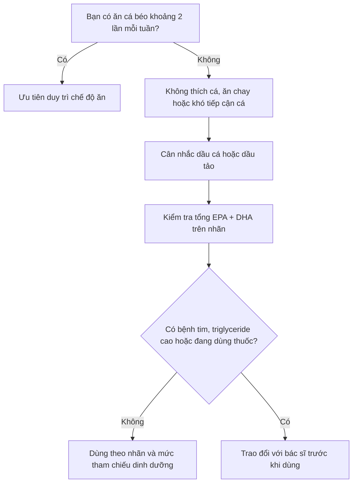

# 030 — Fish Oil

| Thuộc tính            | Nội dung                                                                                                                      |
| --------------------- | ----------------------------------------------------------------------------------------------------------------------------- |
| **Module**            | Module 03 — Supplements                                                                                                       |
| **Bài học**           | Fish Oil                                                                                                                      |
| **Thời lượng**        | 02:56                                                                                                                         |
| **Chủ đề chính**      | Dầu cá, EPA, DHA, lợi ích và cách sử dụng an toàn                                                                             |
| **Tên tiếng Việt**    | Dầu cá                                                                                                                        |
| **Mức độ bằng chứng** | Mạnh đối với giảm triglyceride bằng omega-3 kê đơn; không đồng nhất đối với phòng bệnh tim mạch, đau khớp và phục hồi sau tập |

> [!IMPORTANT]
> Transcript gốc có một số thông tin cần hiệu đính. Đặc biệt, không có khuyến nghị chung rằng mọi người nên uống **1 g dầu cá mỗi ngày**, và **6 g/ngày để giảm đau cơ** không phải liều tiêu chuẩn nên tự sử dụng.

## Mục lục

1. [Mục tiêu bài học](#1-mục-tiêu-bài-học)
2. [Nội dung chính](#2-nội-dung-chính)
3. [Áp dụng thực tế](#3-áp-dụng-thực-tế)
4. [Lưu ý & lỗi thường gặp](#4-lưu-ý--lỗi-thường-gặp)
5. [Checklist thực hành](#5-checklist-thực-hành)
6. [Tóm tắt](#6-tóm-tắt)

---

## 1. Mục tiêu bài học

Sau bài học này, người học có thể:

* Hiểu dầu cá là gì và phân biệt hai acid béo omega-3 chính là **EPA** và **DHA**.
* Biết vì sao nên ưu tiên cá béo trước khi cân nhắc thực phẩm bổ sung.
* Hiểu bằng chứng thực tế của dầu cá đối với triglyceride, tim mạch, đau khớp và đau cơ sau tập.
* Đọc đúng nhãn sản phẩm dựa trên lượng **EPA + DHA**, thay vì chỉ nhìn vào tổng lượng “fish oil”.
* Nhận biết liều cao cần giám sát y tế và những trường hợp có nguy cơ tương tác thuốc.

---

## 2. Nội dung chính

### 2.1. Dầu cá là gì?

**Dầu cá — fish oil** là dầu được chiết xuất từ mô của các loại cá, đặc biệt là cá béo. Thành phần được quan tâm nhiều nhất trong dầu cá là hai acid béo omega-3 chuỗi dài:

| Thành phần | Tên đầy đủ            | Vai trò chính                                                                        |
| ---------- | --------------------- | ------------------------------------------------------------------------------------ |
| **EPA**    | Eicosapentaenoic acid | Tham gia tạo các phân tử truyền tín hiệu và điều hòa phản ứng viêm                   |
| **DHA**    | Docosahexaenoic acid  | Thành phần cấu trúc quan trọng của màng tế bào, có nồng độ cao trong não và võng mạc |

Cơ thể không tự tổng hợp được **ALA**, acid béo omega-3 thiết yếu từ thực vật. Cơ thể có thể chuyển một phần ALA thành EPA và DHA, nhưng mức chuyển đổi hạn chế; vì vậy, ăn cá hoặc sử dụng sản phẩm chứa EPA và DHA là cách thực tế hơn để tăng hai acid béo này. ([ODS][1])


*Nguồn ảnh: [Wikimedia Commons — CC BY-SA 4.0](https://commons.wikimedia.org/wiki/File:Omega_3_Fish_oil_softgel_capsules.jpg).* ([Wikimedia Commons][2])

### 2.2. Quá trình bổ sung omega-3


Omega-3 không phải thuốc “đốt mỡ” và cũng không trực tiếp làm tăng cơ. Vai trò rõ ràng nhất về mặt điều trị là tác động lên quá trình chuyển hóa lipid, đặc biệt ở người có triglyceride cao.

---

### 2.3. Nguồn omega-3 từ thực phẩm

Hiệp hội Tim mạch Hoa Kỳ khuyến nghị ăn **hai khẩu phần cá mỗi tuần**, ưu tiên cá béo. Một khẩu phần được tính khoảng **3 ounce cá đã nấu chín**, tương đương khoảng **85 g**. ([www.heart.org][3])

Các lựa chọn giàu EPA và DHA gồm:

* Cá hồi.
* Cá mòi.
* Cá trích.
* Cá cơm.
* Cá thu Đại Tây Dương.
* Cá hồi vân.
* Hàu và vẹm.


*Nguồn ảnh: [Wikimedia Commons — CC BY-SA 4.0](https://commons.wikimedia.org/wiki/File:Frozen_salmon_fillet.jpg).* ([Wikimedia Commons][4])

> [!TIP]
> Cá không chỉ cung cấp EPA và DHA mà còn cung cấp protein, vitamin B12, vitamin D, selen và nhiều vi chất khác. Vì vậy, cá thường được ưu tiên hơn việc chỉ uống viên dầu cá. ([U.S. Food and Drug Administration][5])

---

### 2.4. Có cần cân bằng omega-6 và omega-3 theo tỷ lệ 1:1 không?

Một số quan điểm cho rằng chế độ ăn hiện đại có tỷ lệ omega-6 so với omega-3 quá cao và mọi người phải đưa tỷ lệ này về **1:1**. Tuy nhiên:

* Chưa có một tỷ lệ omega-6/omega-3 tối ưu được xác định chắc chắn.
* Tỷ lệ này không phản ánh đầy đủ lượng cụ thể của từng acid béo.
* Việc tăng EPA và DHA thường quan trọng hơn cố gắng giảm mạnh omega-6.
* Không nên mặc định rằng mọi loại dầu thực vật hoặc mọi thực phẩm chứa omega-6 đều “gây viêm”. ([ODS][1])

Cách tiếp cận thực tế hơn là:

```text
Tăng cá béo và thực phẩm ít chế biến
                +
Giảm thịt chế biến, đồ chiên và thực phẩm siêu chế biến
                ↓
Cải thiện tổng thể chất lượng chế độ ăn
```

---

### 2.5. Dầu cá có những lợi ích nào?

#### A. Giảm triglyceride

Đây là tác dụng có bằng chứng rõ ràng nhất. Omega-3 **dạng thuốc kê đơn** với liều khoảng **4 g EPA và/hoặc DHA mỗi ngày** có thể làm giảm triglyceride khoảng **20–30%** ở nhiều người có triglyceride cao. Viên dầu cá bán không kê đơn không được xem là sản phẩm tương đương để tự điều trị triglyceride cao. ([www.heart.org][6])

> [!WARNING]
> Người có triglyceride rất cao không nên tự mua nhiều viên dầu cá để thay thế thuốc kê đơn. Cần xét nghiệm, tìm nguyên nhân và điều trị dưới hướng dẫn của bác sĩ.

#### B. Sức khỏe tim mạch

Thường xuyên ăn cá và hải sản trong một chế độ ăn lành mạnh có liên quan đến nguy cơ tim mạch thấp hơn. Tuy nhiên, bằng chứng đối với việc uống viên dầu cá để phòng bệnh tim mạch ở người khỏe mạnh không đồng nhất; AHA không khuyến nghị bổ sung omega-3 thường quy cho mọi người chỉ với mục đích phòng bệnh tim. ([www.heart.org][3])

Do đó, không nên suy luận:

```text
Dầu cá làm giảm triglyceride
            ≠
Mọi người uống dầu cá đều tránh được nhồi máu cơ tim
```

#### C. Đau và viêm khớp

Một số nghiên cứu cho thấy EPA và DHA có thể hỗ trợ giảm nhẹ triệu chứng hoặc giảm nhu cầu dùng thuốc chống viêm ở một số bệnh nhân viêm khớp dạng thấp. Tuy nhiên, kết quả nghiên cứu chưa hoàn toàn nhất quán và dầu cá chỉ nên được xem là biện pháp hỗ trợ, không thay thế thuốc điều trị. ([ODS][1])

Dầu cá cũng không tạo ra một lớp “đệm” cơ học để khớp chịu được mức tạ nặng hơn. Lợi ích tiềm năng liên quan chủ yếu đến điều hòa phản ứng viêm, không phải “bôi trơn” hoặc tái tạo sụn ngay lập tức.

#### D. Đau cơ sau tập luyện

Một số thử nghiệm ghi nhận omega-3 có thể giảm một số dấu hiệu tổn thương cơ hoặc đau cơ khởi phát muộn — DOMS. Tuy nhiên, tổng quan nghiên cứu năm 2024 cho thấy kết quả về đau cơ còn **không đồng nhất**. Chưa có đủ cơ sở để khuyến nghị tất cả người tập sử dụng **6 g mỗi ngày** nhằm giảm đau cơ. ([PubMed Central (PMC)][7])

Các yếu tố quan trọng hơn đối với phục hồi vẫn là:

* Chương trình tập có mức tăng tải hợp lý.
* Ngủ đủ.
* Ăn đủ năng lượng và protein.
* Uống đủ nước.
* Có thời gian phục hồi giữa các buổi tập.

---

### 2.6. “1.000 mg fish oil” không đồng nghĩa với “1.000 mg omega-3”

Đây là lỗi đọc nhãn phổ biến nhất.

Một viên có thể ghi:

```text
Fish oil: 1.000 mg
├── EPA: 180 mg
└── DHA: 120 mg
```

Như vậy:

```text
EPA + DHA = 180 + 120 = 300 mg
```

Sản phẩm trên chỉ cung cấp **300 mg EPA + DHA**, không phải 1.000 mg. NIH ghi nhận một viên dầu cá 1.000 mg điển hình có thể chứa khoảng 180 mg EPA và 120 mg DHA, nhưng hàm lượng giữa các sản phẩm thay đổi rất lớn. ([ODS][1])

#### Thứ tự đọc nhãn đúng

1. Xem **serving size** gồm bao nhiêu viên.
2. Tìm lượng **EPA**.
3. Tìm lượng **DHA**.
4. Cộng EPA và DHA.
5. Kiểm tra con số đó tính cho một viên hay toàn bộ khẩu phần.

---

## 3. Áp dụng thực tế

### 3.1. Quy trình quyết định có cần bổ sung không



### 3.2. Mức tham chiếu cho người trưởng thành khỏe mạnh

EFSA sử dụng mức **250 mg EPA + DHA mỗi ngày** làm lượng hấp thụ đầy đủ cho sức khỏe tim mạch nói chung ở người trưởng thành khỏe mạnh. Đây là mức tham chiếu dinh dưỡng, không phải liều điều trị bệnh. ([European Food Safety Authority][8])

| Trường hợp                        | Cách tiếp cận phù hợp                                        |
| --------------------------------- | ------------------------------------------------------------ |
| Ăn cá béo khoảng hai lần mỗi tuần | Thường không cần bắt buộc bổ sung thêm                       |
| Ít hoặc không ăn cá               | Có thể cân nhắc sản phẩm cung cấp EPA + DHA hoặc dầu tảo     |
| Triglyceride cao                  | Không tự điều trị; cần đánh giá y tế                         |
| Muốn giảm đau cơ sau tập          | Không tự tăng lên 6 g/ngày; bằng chứng còn không nhất quán   |
| Viêm khớp                         | Chỉ sử dụng như biện pháp hỗ trợ sau khi trao đổi với bác sĩ |
| Ăn chay hoặc thuần chay           | Có thể chọn dầu tảo chứa DHA và đôi khi có EPA               |

### 3.3. Cách uống thực tế

* Dùng đúng số viên được tính trong **serving size**.
* Có thể uống cùng bữa ăn để giảm cảm giác ợ tanh hoặc khó chịu ở dạ dày.
* Có thể chia thành hai lần trong ngày nếu sản phẩm hoặc bác sĩ yêu cầu liều cao.
* Không tự tăng liều chỉ vì sau vài ngày chưa cảm nhận được tác dụng.
* Dầu cá không tạo hiệu ứng tức thời như caffeine; thay đổi EPA và DHA trong mô cần thời gian.

---

## 4. Lưu ý & lỗi thường gặp

### 4.1. Hiệu đính các thông tin trong transcript

| Nội dung trong transcript                     | Hiệu đính                                                                                        |
| --------------------------------------------- | ------------------------------------------------------------------------------------------------ |
| Cơ thể hoàn toàn không thể tạo omega-3        | Cơ thể không tạo được ALA nhưng có thể chuyển một phần ALA thành EPA/DHA; mức chuyển đổi hạn chế |
| Tỷ lệ omega-6/omega-3 lý tưởng là 1:1         | Chưa xác định được một tỷ lệ tối ưu áp dụng cho tất cả mọi người                                 |
| AHA khuyên mọi người uống 1 g dầu cá mỗi ngày | Với dân số nói chung, AHA nhấn mạnh ăn hai khẩu phần cá mỗi tuần                                 |
| Có thể dùng khoảng 6 g để giảm đau cơ         | Không phải khuyến nghị chuẩn; bằng chứng về DOMS còn không đồng nhất                             |
| Dầu cá giúp tạo lớp đệm để khớp nâng nặng hơn | Không có cơ chế “đệm khớp” trực tiếp; lợi ích tiềm năng liên quan đến viêm                       |
| Cá hồi nuôi cần hạn chế vì thủy ngân          | FDA xếp cá hồi vào nhóm “Best Choices” có mức thủy ngân thấp                                     |
| Shark và king mackerel có thể ăn vừa phải     | FDA xếp cá mập và cá thu vua vào nhóm nên tránh vì thủy ngân cao                                 |

FDA xếp cá hồi, cá mòi và cá trích vào nhóm lựa chọn tốt; cá mập, cá thu vua, cá kiếm và cá ngừ mắt to nằm trong nhóm có thủy ngân cao nên tránh, đặc biệt đối với phụ nữ mang thai, người cho con bú và trẻ em. ([U.S. Food and Drug Administration][5])


*Nguồn: FDA/EPA — Advice About Eating Fish.* 

---

### 4.2. Tác dụng phụ

Các tác dụng phụ thường nhẹ, gồm:

* Ợ hoặc hơi thở có mùi tanh.
* Ợ nóng.
* Buồn nôn.
* Khó chịu đường tiêu hóa.
* Tiêu chảy.
* Đau đầu ở một số người. ([ODS][1])

### 4.3. Thận trọng với liều cao

FDA và EFSA cho rằng tổng lượng EPA + DHA từ thực phẩm bổ sung không quá khoảng **5 g/ngày** nhìn chung có vẻ an toàn khi sử dụng đúng hướng dẫn. Tuy nhiên, điều này không có nghĩa mọi người nên uống gần 5 g mỗi ngày. Hai thử nghiệm lớn cho thấy liều **4 g/ngày sử dụng trong thời gian dài** làm tăng nhẹ nguy cơ rung nhĩ ở người đã có hoặc có nguy cơ cao mắc bệnh tim mạch. ([ODS][1])

Cần hỏi bác sĩ hoặc dược sĩ trước khi sử dụng liều cao nếu:

* Đang dùng warfarin, thuốc chống đông hoặc thuốc chống kết tập tiểu cầu.
* Có tiền sử rung nhĩ hoặc rối loạn nhịp tim.
* Chuẩn bị phẫu thuật.
* Đang điều trị bệnh tim mạch hoặc triglyceride cao.
* Đang mang thai hoặc cho con bú.
* Đang sử dụng nhiều loại thực phẩm bổ sung cùng lúc.

### 4.4. Dầu cá và thủy ngân

Cá có thể chứa lượng methylmercury khác nhau tùy loài. Trong khi đó, các sản phẩm omega-3 đã qua tinh chế nhìn chung không được phát hiện chứa methylmercury vì chất này được loại bỏ trong quá trình xử lý và tinh chế. Tuy vậy, người dùng vẫn nên chọn sản phẩm từ nhà sản xuất minh bạch về kiểm nghiệm chất lượng. ([ODS][1])

### 4.5. Dầu gan cá không giống dầu cá thông thường

**Cod liver oil — dầu gan cá tuyết** không chỉ chứa EPA và DHA mà còn có vitamin A và vitamin D. Dùng nhiều sản phẩm chứa vitamin A hoặc D cùng lúc có thể khiến tổng lượng hấp thụ cao hơn dự kiến, vì vậy cần đọc toàn bộ bảng thành phần. ([ODS][1])

---

## 5. Checklist thực hành

### Trước khi mua

* [ ] Tôi đã kiểm tra mình ăn cá béo bao nhiêu lần mỗi tuần.
* [ ] Tôi hiểu “1.000 mg fish oil” không phải là 1.000 mg EPA + DHA.
* [ ] Tôi đã kiểm tra riêng lượng EPA và DHA.
* [ ] Tôi đã kiểm tra serving size gồm bao nhiêu viên.
* [ ] Tôi không chọn sản phẩm chỉ dựa trên chữ “high strength”.
* [ ] Tôi đã kiểm tra xem sản phẩm có thêm vitamin A hoặc vitamin D hay không.

### Trước khi sử dụng

* [ ] Tôi không tự sử dụng liều điều trị triglyceride.
* [ ] Tôi không tự dùng 6 g/ngày để giảm đau cơ.
* [ ] Tôi đã kiểm tra tương tác nếu đang dùng thuốc.
* [ ] Tôi sẽ dùng theo liều trên nhãn hoặc hướng dẫn của chuyên gia y tế.
* [ ] Tôi vẫn ưu tiên chế độ ăn, giấc ngủ và chương trình tập luyện hợp lý.

### Khi lựa chọn cá

* [ ] Ưu tiên cá hồi, cá mòi, cá trích, cá cơm hoặc cá thu Đại Tây Dương.
* [ ] Luân phiên nhiều loại cá thay vì chỉ ăn một loài.
* [ ] Hạn chế hoặc tránh cá mập, cá kiếm, cá thu vua và cá ngừ mắt to.
* [ ] Kiểm tra cảnh báo địa phương nếu ăn cá tự đánh bắt.

---

## 6. Tóm tắt

> **Dầu cá là nguồn cung cấp EPA và DHA, nhưng không phải thực phẩm bổ sung bắt buộc đối với tất cả mọi người.**

* Ưu tiên ăn **hai khẩu phần cá mỗi tuần**, đặc biệt là cá béo.
* Chưa có bằng chứng chắc chắn rằng phải đưa tỷ lệ omega-6/omega-3 về 1:1.
* Tác dụng rõ ràng nhất của omega-3 là **giảm triglyceride**, nhưng liều điều trị thường là sản phẩm kê đơn dưới giám sát y tế.
* Bằng chứng đối với phòng bệnh tim mạch bằng viên dầu cá ở người khỏe mạnh, giảm đau khớp và giảm đau cơ sau tập còn không đồng nhất.
* Luôn tính liều dựa trên **EPA + DHA**, không dựa trên tổng lượng “fish oil”.
* Không tự dùng liều cao như 4–6 g/ngày.
* Cá hồi thuộc nhóm cá có thủy ngân thấp; cá mập và cá thu vua thuộc nhóm nên tránh.
* Dầu cá chỉ là phần bổ sung cho chế độ ăn, không thay thế dinh dưỡng cân bằng, thuốc điều trị hoặc phương pháp phục hồi phù hợp.

[1]: https://ods.od.nih.gov/factsheets/Omega3FattyAcids-HealthProfessional/ "Omega-3 Fatty Acids - Health Professional Fact Sheet"
[2]: https://commons.wikimedia.org/wiki/File%3AOmega_3_Fish_oil_softgel_capsules.jpg "File:Omega 3 Fish oil softgel capsules.jpg - Wikimedia Commons"
[3]: https://www.heart.org/en/healthy-living/healthy-eating/eat-smart/fats/fish-and-omega-3-fatty-acids "Fish and Omega-3 Fatty Acids | American Heart Association"
[4]: https://commons.wikimedia.org/wiki/File%3AFrozen_salmon_fillet.jpg "File:Frozen salmon fillet.jpg - Wikimedia Commons"
[5]: https://www.fda.gov/food/consumers/advice-about-eating-fish "Advice about Eating Fish | FDA"
[6]: https://www.heart.org/en/news/2019/08/19/prescription-omega3-medications-work-for-high-triglycerides-advisory-says "Prescription omega-3 medications work for high triglycerides, advisory says | American Heart Association"
[7]: https://pmc.ncbi.nlm.nih.gov/articles/PMC11243702/?utm_source=chatgpt.com "Omega-3 Fatty Acid Supplementation on Post-Exercise ... - PMC"
[8]: https://www.efsa.europa.eu/en/press/news/120727?utm_source=chatgpt.com "EFSA assesses safety of long-chain omega-3 fatty acids | EFSA"
