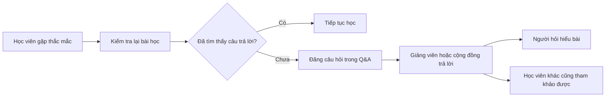
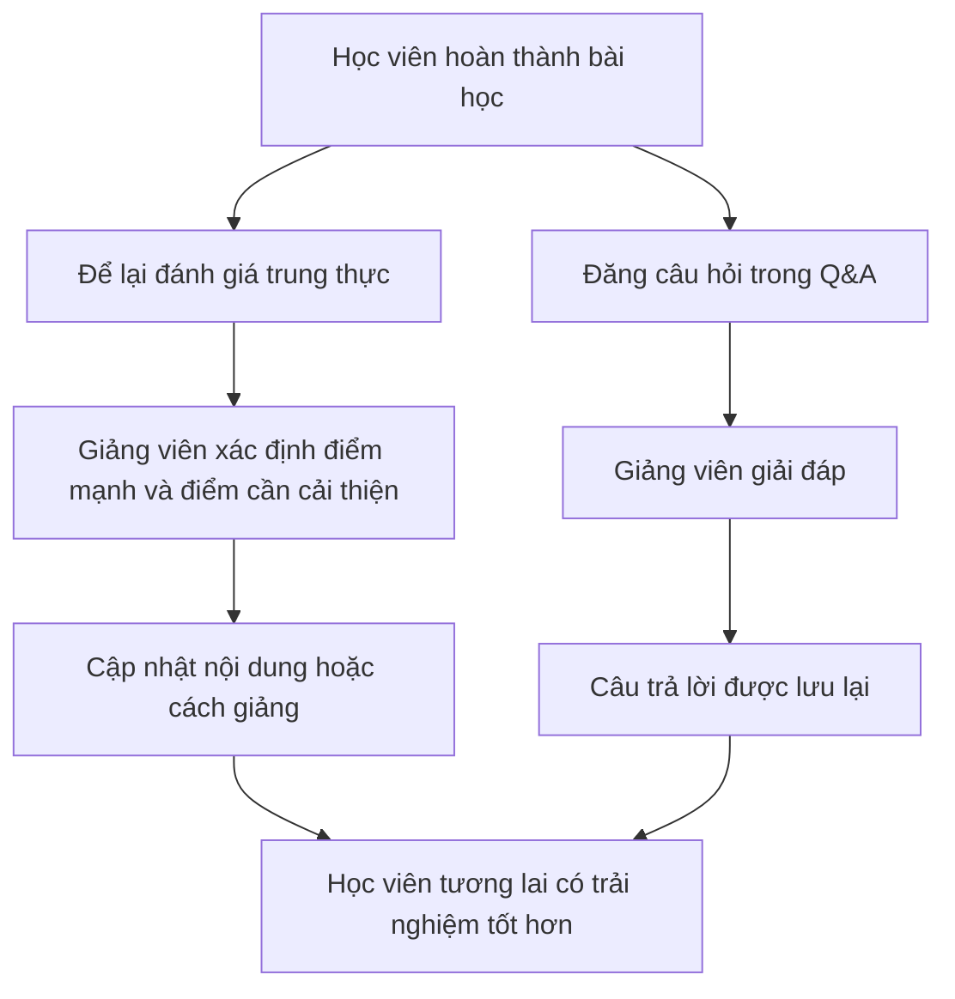

# 031 — Help Me Out

| Thuộc tính       | Nội dung                                                      |
| ---------------- | ------------------------------------------------------------- |
| **Module**       | Module 03 — Supplements                                       |
| **Bài học**      | Help Me Out                                                   |
| **Thời lượng**   | 00:25                                                         |
| **Chủ đề chính** | Hỗ trợ giảng viên, đánh giá khóa học và sử dụng mục Hỏi & Đáp |
| **Mức độ**       | Cơ bản                                                        |
| **Hình thức**    | Tổng kết ngắn và lời kêu gọi hành động                        |


> **Thông điệp chính:** Sau khi học, người học có thể hỗ trợ khóa học bằng cách để lại một đánh giá trung thực. Khi có thắc mắc, hãy đăng câu hỏi trong mục **Q&A** để giảng viên trả lời và những học viên khác cũng có thể tham khảo.

## Mục lục

1. [Mục tiêu bài học](#1-mục-tiêu-bài-học)
2. [Nội dung chính](#2-nội-dung-chính)
3. [Áp dụng thực tế](#3-áp-dụng-thực-tế)
4. [Lưu ý & lỗi thường gặp](#4-lưu-ý--lỗi-thường-gặp)
5. [Checklist thực hành](#5-checklist-thực-hành)
6. [Tóm tắt](#6-tóm-tắt)

---

## 1. Mục tiêu bài học

Sau bài học ngắn này, người học có thể:

* Hiểu vì sao giảng viên mong muốn nhận được đánh giá từ học viên.
* Biết cách viết một nhận xét **trung thực, cụ thể và hữu ích**.
* Biết khi nào nên sử dụng khu vực **Q&A — Hỏi & Đáp**.
* Biết cách đặt câu hỏi rõ ràng để tăng khả năng nhận được câu trả lời chính xác.
* Góp phần xây dựng một cộng đồng học tập tích cực, nơi câu hỏi và câu trả lời có thể hỗ trợ nhiều người.

---

## 2. Nội dung chính

### 2.1. Lời cảm ơn từ giảng viên

Giảng viên bắt đầu bài học bằng lời cảm ơn người học đã tham gia khóa học.

Đây không chỉ là một lời kết thúc mang tính xã giao mà còn thể hiện rằng:

* Thời gian và sự tham gia của học viên được trân trọng.
* Học viên là một phần quan trọng trong quá trình phát triển khóa học.
* Mối quan hệ giữa người dạy và người học không kết thúc sau khi video hoàn thành.

---

### 2.2. Để lại đánh giá cho khóa học

Giảng viên đề nghị học viên dành thời gian để viết một bài đánh giá.

Một đánh giá hữu ích có thể giúp:

* Giảng viên biết nội dung nào đang được trình bày tốt.
* Phát hiện những phần còn khó hiểu hoặc cần bổ sung.
* Cải thiện cấu trúc và tài liệu cho các học viên sau.
* Giúp người đang cân nhắc khóa học có thêm thông tin tham khảo.

Việc thu thập và sử dụng phản hồi từ người học có thể cung cấp cho người dạy những dữ liệu cần thiết để điều chỉnh và cải thiện hoạt động giảng dạy. ([Edutopia][1])

> **Đánh giá tốt không nhất thiết phải là đánh giá 5 sao.**
> Điều quan trọng nhất là nhận xét phải phản ánh đúng trải nghiệm thực tế và giải thích rõ lý do.

#### Công thức đánh giá đơn giản

```text
Điểm tôi thấy hữu ích
        ↓
Điểm tôi còn gặp khó khăn
        ↓
Đề xuất cải thiện
        ↓
Đánh giá tổng thể
```

Ví dụ:

> Khóa học trình bày các kiến thức cơ bản về dinh dưỡng và thực phẩm bổ sung khá dễ hiểu. Phần hướng dẫn sử dụng creatine và protein powder có tính ứng dụng cao. Tuy nhiên, một số bài học khá ngắn nên tôi mong muốn có thêm ví dụ thực tế hoặc tài liệu đọc bổ sung.

---

### 2.3. Sử dụng mục Q&A khi có câu hỏi

Nếu chưa hiểu một phần nội dung, học viên được khuyến khích sử dụng khu vực **Q&A** của khóa học.

Thay vì giữ câu hỏi cho riêng mình, việc đăng câu hỏi công khai mang lại ba lợi ích:

1. Giảng viên có thể giải đáp trực tiếp.
2. Những học viên có cùng thắc mắc có thể xem lại câu trả lời.
3. Nội dung trao đổi được lưu lại như một nguồn kiến thức bổ sung cho khóa học.

Các nghiên cứu về học trực tuyến cho thấy diễn đàn thảo luận có thể hỗ trợ sự tham gia, trao đổi và quá trình suy ngẫm của người học, đặc biệt khi có sự hướng dẫn phù hợp từ giảng viên. ([PubMed Central (PMC)][2])



---

### 2.4. Mối liên hệ giữa phản hồi và sự tham gia học tập

Phản hồi trong giáo dục là một quá trình hai chiều:

* Người dạy phản hồi về kết quả và tiến độ của người học.
* Người học phản hồi về nội dung, cách trình bày và trải nghiệm khóa học.

Một nghiên cứu với sinh viên học trực tuyến ghi nhận rằng cách người học cảm nhận phản hồi có liên hệ trực tiếp và gián tiếp với mức độ tham gia học tập, thông qua các yếu tố như sự tự tin học thuật và mức độ lo lắng. Tuy nhiên, kết quả này được thực hiện trên một nhóm sinh viên cụ thể nên không nên xem là bằng chứng áp dụng tuyệt đối cho mọi khóa học. ([Frontiers][3])


*Hình nghiên cứu: Nhận thức tích cực về phản hồi có liên hệ với sự tự tin học thuật, lo lắng khi kiểm tra và mức độ tham gia học trực tuyến. Nguồn: Cao và Han, Frontiers in Psychology, 2024. ([Frontiers][3])*

---

### 2.5. Chu trình hỗ trợ và cải thiện khóa học



Hai hành động có vai trò khác nhau:

| Hành động             | Mục đích chính                             | Nội dung nên viết                                       |
| --------------------- | ------------------------------------------ | ------------------------------------------------------- |
| **Đánh giá khóa học** | Chia sẻ trải nghiệm tổng thể               | Điểm mạnh, điểm hạn chế, mức độ hữu ích                 |
| **Đăng Q&A**          | Làm rõ một vấn đề cụ thể                   | Câu hỏi, bài học liên quan, phần chưa hiểu              |
| **Báo lỗi kỹ thuật**  | Thông báo sự cố của nền tảng hoặc tài liệu | Thiết bị, trình duyệt, thông báo lỗi, ảnh chụp màn hình |
| **Đề xuất nội dung**  | Gợi ý bổ sung hoặc mở rộng khóa học        | Chủ đề mong muốn, lý do và ví dụ                        |

---

## 3. Áp dụng thực tế

### 3.1. Cách viết một đánh giá hữu ích

Một đánh giá tốt nên trả lời ba câu hỏi:

#### 1. Nội dung nào hữu ích nhất?

Ví dụ:

* Phần giải thích về protein powder dễ áp dụng.
* Cách sử dụng creatine được trình bày ngắn gọn.
* Các bài học giúp phân biệt thực phẩm và thực phẩm bổ sung.

#### 2. Nội dung nào cần cải thiện?

Ví dụ:

* Một số bài học còn quá ngắn.
* Cần thêm ví dụ về liều lượng.
* Cần bổ sung tài liệu tham khảo nghiên cứu.
* Cần thêm phụ đề hoặc bản chép lời.

#### 3. Khóa học phù hợp với ai?

Ví dụ:

* Người mới bắt đầu tìm hiểu dinh dưỡng.
* Người đang tập gym nhưng chưa biết lựa chọn supplement.
* Người muốn hệ thống hóa kiến thức cơ bản.

---

### 3.2. Mẫu đánh giá hoàn chỉnh

> Tôi đánh giá cao cách khóa học trình bày kiến thức dinh dưỡng theo từng bước, từ calorie và macronutrient đến thực phẩm bổ sung. Các bài về protein powder, creatine và fish oil khá dễ hiểu đối với người mới. Tôi mong giảng viên bổ sung thêm ví dụ thực tế, nguồn nghiên cứu và hướng dẫn lựa chọn sản phẩm. Nhìn chung, đây là khóa học phù hợp với người mới bắt đầu xây dựng chế độ ăn và tập luyện.

---

### 3.3. Cấu trúc một câu hỏi Q&A tốt

```markdown
**Bài học liên quan:** 028 — How To Use Creatine

**Câu hỏi:**  
Trong bài học, giảng viên đề xuất sử dụng creatine hằng ngày. Nếu tôi không tập luyện vào ngày nghỉ thì có cần tiếp tục sử dụng không?

**Thông tin bổ sung:**  
Tôi đang dùng creatine monohydrate và tập 4 buổi mỗi tuần.

**Điểm tôi chưa rõ:**  
Tôi chưa hiểu creatine chỉ cần dùng trước buổi tập hay cần duy trì đều mỗi ngày.
```

Câu hỏi trên có đủ:

* Tên bài học.
* Bối cảnh.
* Vấn đề cụ thể.
* Điểm người học chưa hiểu.

---

### 3.4. Mẫu câu hỏi chưa tốt và cách sửa

#### Chưa tốt

> Tôi không hiểu creatine, giải thích giúp tôi.

Vấn đề:

* Quá rộng.
* Không nêu bài học.
* Không nói rõ phần nào gây khó hiểu.
* Giảng viên khó xác định câu trả lời phù hợp.

#### Tốt hơn

> Trong bài “How To Use Creatine”, tôi chưa rõ sự khác nhau giữa giai đoạn nạp và liều duy trì. Người mới có bắt buộc phải thực hiện giai đoạn nạp hay có thể dùng liều duy trì ngay từ đầu?

---

### 3.5. Quy trình sau khi hoàn thành một module

```text
Hoàn thành các bài học
        ↓
Ghi lại phần còn chưa hiểu
        ↓
Tìm trong Q&A xem đã có người hỏi chưa
        ↓
Đăng câu hỏi mới nếu cần
        ↓
Viết đánh giá sau khi đã trải nghiệm đủ nội dung
        ↓
Tiếp tục module tiếp theo
```

---

## 4. Lưu ý & lỗi thường gặp

### 4.1. Đánh giá quá chung chung

Ví dụ:

> Khóa học rất hay.

Nhận xét này thể hiện sự ủng hộ nhưng không cung cấp nhiều thông tin để giảng viên hoặc học viên khác tham khảo.

Nên viết cụ thể hơn:

> Phần hướng dẫn tính protein và lựa chọn thực phẩm bổ sung được trình bày dễ hiểu, nhưng tôi mong muốn có thêm ví dụ về người ăn chay.

---

### 4.2. Chỉ đánh giá khi đang tức giận

Khi gặp lỗi video, phụ đề hoặc thanh toán, người học có thể ngay lập tức để lại đánh giá tiêu cực.

Cách xử lý hợp lý hơn:

1. Xác định đây là lỗi nội dung hay lỗi kỹ thuật.
2. Thử tải lại trang hoặc kiểm tra thiết bị.
3. Gửi câu hỏi hoặc báo lỗi.
4. Chờ phản hồi trước khi đưa ra kết luận cuối cùng.

Điều này không có nghĩa là phải che giấu trải nghiệm xấu. Đánh giá vẫn nên trung thực, nhưng cần mô tả đúng bản chất vấn đề.

---

### 4.3. Dùng phần đánh giá để đặt câu hỏi chuyên môn

Ví dụ:

> Tôi nên dùng bao nhiêu gram fish oil mỗi ngày?

Đây là câu hỏi chuyên môn nên được đăng trong **Q&A**, không phải phần đánh giá tổng thể.

---

### 4.4. Đăng câu hỏi nhưng thiếu bối cảnh

Những thông tin nên cung cấp gồm:

* Tên hoặc số thứ tự bài học.
* Nội dung cụ thể đang được đề cập.
* Điều người học đã hiểu.
* Điều chưa hiểu.
* Trường hợp thực tế của người hỏi, khi cần thiết.

---

### 4.5. Đăng trùng câu hỏi

Trước khi tạo câu hỏi mới, nên:

* Tìm kiếm bằng từ khóa.
* Kiểm tra các câu hỏi đã được ghim.
* Đọc câu trả lời của giảng viên.
* Chỉ tạo câu hỏi mới khi vấn đề chưa được giải đáp đầy đủ.

---

### 4.6. Đưa thông tin cá nhân không cần thiết lên khu vực công khai

Không nên đăng công khai:

* Số điện thoại.
* Địa chỉ nhà.
* Email cá nhân.
* Thông tin thanh toán.
* Hồ sơ hoặc thông tin sức khỏe chi tiết không cần thiết.

Đối với vấn đề riêng tư, nên sử dụng kênh hỗ trợ riêng của nền tảng.

---

### 4.7. Xem đánh giá như một hình thức “trả ơn”

Giảng viên có thể đề nghị đánh giá, nhưng người học không có nghĩa vụ phải đưa ra nhận xét tích cực.

Đánh giá có giá trị nhất khi:

* Dựa trên trải nghiệm thật.
* Không bị ép buộc.
* Phân biệt rõ ưu điểm và hạn chế.
* Đưa ra đề xuất có thể thực hiện được.

---

## 5. Checklist thực hành

### Trước khi đánh giá khóa học

* [ ] Tôi đã học đủ số lượng bài để có nhận xét tổng thể.
* [ ] Tôi đã xác định nội dung hữu ích nhất.
* [ ] Tôi đã xác định phần cần cải thiện.
* [ ] Tôi giải thích lý do cho số sao đã chọn.
* [ ] Nhận xét của tôi trung thực và tôn trọng.
* [ ] Tôi không sử dụng đánh giá để hỏi một câu hỏi chuyên môn riêng lẻ.

### Trước khi đăng câu hỏi trong Q&A

* [ ] Tôi đã xem lại bài học liên quan.
* [ ] Tôi đã tìm kiếm câu hỏi tương tự.
* [ ] Tôi ghi rõ tên hoặc số bài học.
* [ ] Tôi mô tả chính xác phần chưa hiểu.
* [ ] Tôi cung cấp đủ bối cảnh cần thiết.
* [ ] Tôi không đưa thông tin cá nhân nhạy cảm.
* [ ] Tiêu đề câu hỏi ngắn gọn và phản ánh đúng nội dung.

### Sau khi nhận được câu trả lời

* [ ] Tôi đọc toàn bộ câu trả lời và tài liệu được dẫn.
* [ ] Tôi thử áp dụng hướng dẫn.
* [ ] Tôi hỏi bổ sung trong cùng chủ đề nếu vẫn chưa rõ.
* [ ] Tôi cảm ơn người trả lời.
* [ ] Tôi cập nhật hoặc đánh dấu câu hỏi đã được giải quyết nếu nền tảng hỗ trợ.

---

## 6. Tóm tắt

Bài học này truyền tải ba thông điệp chính:

1. **Để lại đánh giá trung thực:** phản hồi cụ thể có thể giúp giảng viên nhận biết điểm mạnh và điểm cần cải thiện của khóa học.
2. **Sử dụng khu vực Q&A:** câu hỏi công khai không chỉ hỗ trợ người hỏi mà còn tạo ra tài liệu tham khảo cho những học viên khác.
3. **Tiếp tục hành trình học tập:** đánh giá và đặt câu hỏi là một phần của quá trình học chủ động, không phải chỉ là hoạt động thực hiện sau khi khóa học kết thúc.

> **Công thức ghi nhớ**
>
> ```text
> Học → Suy ngẫm → Đặt câu hỏi → Nhận phản hồi → Đánh giá → Cải thiện
> ```

### Nguồn hình ảnh

* **Ảnh phản hồi giáo dục:** Wikimedia Commons, giấy phép CC BY 4.0. ([Wikimedia Commons][4])
* **Hình nghiên cứu về phản hồi và học trực tuyến:** Cao & Han, *Frontiers in Psychology*, 2024. ([Frontiers][3])

[1]: https://www.edutopia.org/article/continuously-refine-your-practice-student-feedback?utm_source=chatgpt.com "Continuously Refine Your Practice With Student Feedback | Edutopia"
[2]: https://pmc.ncbi.nlm.nih.gov/articles/PMC7970135/?utm_source=chatgpt.com "Can online discussions facilitate deep learning for students in General Education? - PMC"
[3]: https://www.frontiersin.org/journals/psychology/articles/10.3389/fpsyg.2024.1326746/full "Frontiers | The effect of Chinese vocational college students’ perception of feedback on online learning engagement: academic self-efficacy and test anxiety as mediating variables"
[4]: https://commons.wikimedia.org/wiki/File%3AFeedback_-_Ilustra%C3%A7%C3%A3o.png "File:Feedback - Ilustração.png - Wikimedia Commons"

---

# Bài luyện tập

## Mục tiêu


## Đề bài


## Yêu cầu hoàn thành

- [ ] 
- [ ] 
- [ ] 

## Kết quả / lời giải


## Ghi chú
