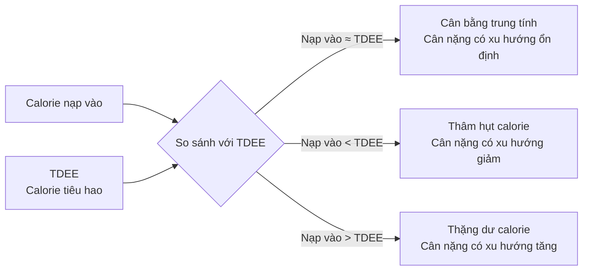
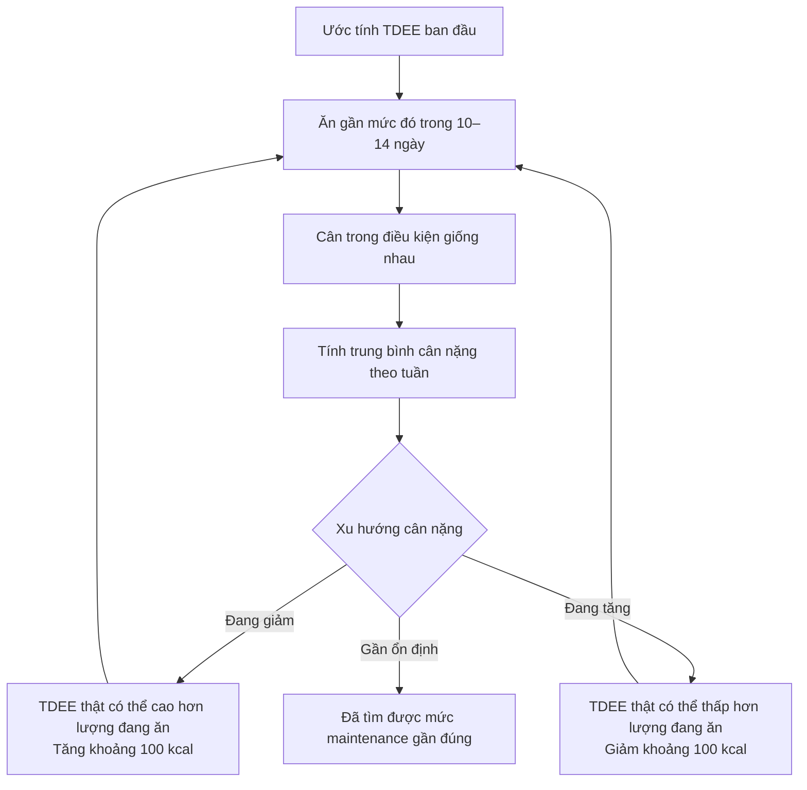

# 032 — How To Determine Your Optimal Calorie Intake

| Thuộc tính              | Nội dung                                     |
| ----------------------- | -------------------------------------------- |
| **Module**              | Module 04 — Setting Up Your Diet             |
| **Bài học**             | How To Determine Your Optimal Calorie Intake |
| **Thời lượng**          | 03:00 — Xem trước                            |
| **Chủ đề chính**        | Cách xác định lượng calorie tối ưu           |
| **Thuật ngữ trọng tâm** | BMR, RMR, TDEE, cân bằng năng lượng          |

> **Hiệu đính bản chép lời:** Các từ “TV”, “TD”, “TRD” và “team” trong transcript nhiều khả năng đều là lỗi nhận dạng của thuật ngữ **TDEE — Total Daily Energy Expenditure**, tức **tổng năng lượng tiêu hao hằng ngày**.

*Hình minh họa: sử dụng công cụ trực tuyến để ước tính và theo dõi nhu cầu năng lượng. Nguồn: NIH News in Health.* 

---

## Mục lục

1. [Mục tiêu bài học](#1-mục-tiêu-bài-học)
2. [Nội dung chính](#2-nội-dung-chính)
3. [Áp dụng thực tế](#3-áp-dụng-thực-tế)
4. [Lưu ý và lỗi thường gặp](#4-lưu-ý-và-lỗi-thường-gặp)
5. [Checklist thực hành](#5-checklist-thực-hành)
6. [Tóm tắt](#6-tóm-tắt)

---

## 1. Mục tiêu bài học

Sau bài học này, người học có thể:

* Hiểu **TDEE** là gì và vì sao đây là điểm xuất phát khi thiết lập chế độ ăn.
* Phân biệt ba trạng thái cân bằng calorie:

  * Cân bằng trung tính.
  * Thâm hụt calorie.
  * Thặng dư calorie.
* Biết cách ước tính **BMR/RMR** bằng công thức.
* Biết cách chuyển từ BMR sang TDEE dựa trên mức vận động.
* Hiểu rằng kết quả từ calculator chỉ là **giá trị khởi điểm**, không phải con số tuyệt đối.
* Biết cách dùng lượng calorie ăn vào và xu hướng cân nặng để hiệu chỉnh TDEE thực tế.

---

## 2. Nội dung chính

### 2.1. Calorie là nền tảng của việc kiểm soát cân nặng

Trong dài hạn, sự thay đổi cân nặng chịu ảnh hưởng trực tiếp từ mối quan hệ giữa:

* **Năng lượng nạp vào:** calorie từ thức ăn và đồ uống.
* **Năng lượng tiêu hao:** calorie cơ thể sử dụng để duy trì sự sống, tiêu hóa thức ăn, vận động và tập luyện.

| Trạng thái              |     Quan hệ năng lượng | Xu hướng dài hạn |
| ----------------------- | ---------------------: | ---------------- |
| **Cân bằng trung tính** | Calorie nạp vào ≈ TDEE | Duy trì cân nặng |
| **Cân bằng âm**         | Calorie nạp vào < TDEE | Giảm cân         |
| **Cân bằng dương**      | Calorie nạp vào > TDEE | Tăng cân         |

> Sự thay đổi cân nặng không nhất thiết xuất hiện ngay trong một hoặc hai ngày. Nước, glycogen, lượng thức ăn trong hệ tiêu hóa và nhiều yếu tố khác có thể che khuất xu hướng thật trong ngắn hạn.

---

### 2.2. TDEE là gì?

**TDEE — Total Daily Energy Expenditure** là tổng số calorie cơ thể tiêu hao trung bình trong một ngày.

TDEE có thể được biểu diễn như sau:

[
\text{TDEE} = \text{REE/BMR} + \text{TEF} + \text{AEE}
]

Trong đó:

| Thành phần   | Tên đầy đủ                          | Ý nghĩa                                                                        |
| ------------ | ----------------------------------- | ------------------------------------------------------------------------------ |
| **BMR/REE**  | Basal/Resting Energy Expenditure    | Năng lượng duy trì hô hấp, tuần hoàn, hoạt động não, cơ quan và tế bào         |
| **TEF**      | Thermic Effect of Food              | Năng lượng dùng để tiêu hóa, hấp thu và chuyển hóa thức ăn                     |
| **NEAT**     | Non-Exercise Activity Thermogenesis | Đi bộ, đứng, làm việc nhà, thay đổi tư thế và các vận động không phải buổi tập |
| **EAT/ExEE** | Exercise Activity Thermogenesis     | Năng lượng tiêu hao trong các buổi tập có kế hoạch                             |
| **AEE**      | Activity Energy Expenditure         | Tổng năng lượng từ NEAT và tập luyện                                           |

*Hình nghiên cứu: TDEE bao gồm năng lượng nghỉ, hiệu ứng nhiệt của thức ăn, NEAT và năng lượng tập luyện. Tỷ lệ từng thành phần khác nhau giữa các cá nhân. Nguồn: Hills, Mokhtar và Byrne, Frontiers in Nutrition.* 

Năng lượng nghỉ thường là thành phần lớn nhất của TDEE. Tuy nhiên, phần năng lượng đến từ hoạt động thể chất có thể biến động mạnh giữa các ngày và giữa những người có cùng chiều cao, cân nặng. ([PubMed Central (PMC)][1])

---

### 2.3. Phân biệt BMR và RMR

Hai thuật ngữ này thường được các calculator sử dụng gần như thay thế cho nhau, nhưng về mặt kỹ thuật có sự khác biệt:

* **BMR — Basal Metabolic Rate:** được đo trong điều kiện rất nghiêm ngặt, thường sau khi ngủ qua đêm, nhịn ăn và nghỉ hoàn toàn trong môi trường kiểm soát.
* **RMR/REE — Resting Metabolic Rate:** năng lượng tiêu hao khi nghỉ nhưng điều kiện đo ít nghiêm ngặt hơn.

RMR thường cao hơn BMR một chút do ảnh hưởng còn lại của việc ăn uống và vận động trước đó. Trong thực hành dinh dưỡng phổ thông, sự khác biệt này thường không làm thay đổi quy trình thiết lập chế độ ăn: ta vẫn bắt đầu bằng một giá trị ước tính rồi hiệu chỉnh bằng dữ liệu thực tế. ([PubMed Central (PMC)][2])

---

### 2.4. Ước tính BMR bằng công thức Mifflin–St Jeor

Một công thức thường được sử dụng để ước tính năng lượng nghỉ là **Mifflin–St Jeor**.

#### Công thức dành cho nam

[
\text{BMR}
==========

10 \times W
+
6.25 \times H
-------------

5 \times A
+
5
]

#### Công thức dành cho nữ

[
\text{BMR}
==========

10 \times W
+
6.25 \times H
-------------

## 5 \times A

161
]

Trong đó:

* (W): cân nặng tính bằng kilogram.
* (H): chiều cao tính bằng centimet.
* (A): tuổi tính bằng năm.
* Kết quả: kcal/ngày.

Công thức Mifflin–St Jeor được phát triển từ dữ liệu đo năng lượng nghỉ và thường được xem là một trong những công thức dự đoán đáng tin cậy hơn cho người trưởng thành. Dù vậy, sai số ở cấp độ cá nhân vẫn có thể đáng kể. ([PubMed][3])

---

### 2.5. Chuyển từ BMR sang TDEE

Sau khi ước tính BMR, cần cộng thêm năng lượng từ:

* Hoạt động sinh hoạt.
* Công việc.
* Số bước đi mỗi ngày.
* Tần suất và cường độ tập luyện.
* Quá trình tiêu hóa thức ăn.

Cách đơn giản thường dùng trong các calculator là:

[
\text{TDEE ước tính}
====================

\text{BMR}
\times
\text{hệ số hoạt động}
]

Hệ số hoạt động không chỉ phụ thuộc vào số buổi tập. Một người tập bốn buổi mỗi tuần nhưng ngồi làm việc cả ngày có thể tiêu hao ít hơn người chỉ tập hai buổi nhưng làm công việc phải đi lại liên tục.

| Mức hoạt động thực tế | Đặc điểm tham khảo                                         |
| --------------------- | ---------------------------------------------------------- |
| **Rất ít vận động**   | Làm việc bàn giấy, ít đi bộ, gần như không tập             |
| **Hoạt động nhẹ**     | Có đi bộ hoặc tập nhẹ một vài buổi mỗi tuần                |
| **Hoạt động vừa**     | Tập đều và có mức vận động sinh hoạt tương đối             |
| **Hoạt động cao**     | Tập thường xuyên, đi lại nhiều hoặc làm công việc thể chất |
| **Rất cao**           | Khối lượng tập lớn kết hợp công việc thể lực hoặc thi đấu  |

Các giá trị PAL thực tế ở người trưởng thành có thể trải trên một khoảng khá rộng; vì vậy việc chọn hệ số chỉ nên được xem là bước ước tính ban đầu. ([Frontiers][4])

---

### 2.6. Calculator chỉ cho giá trị khởi điểm

Calculator thường yêu cầu:

* Tuổi.
* Giới tính sinh học dùng trong công thức.
* Cân nặng.
* Chiều cao.
* Mức vận động.
* Tần suất tập luyện.

Kết quả không thể chính xác 100% vì calculator khó biết được:

* Thành phần cơ thể.
* Lượng cơ nạc.
* Số bước chân thực tế.
* Công việc hằng ngày.
* Cường độ thật của buổi tập.
* Mức độ thích nghi chuyển hóa.
* Sai số khi khai báo mức vận động.

Công cụ **NIH Body Weight Planner** cũng sử dụng thông tin như tuổi, cân nặng, chiều cao và hoạt động để xây dựng kế hoạch calorie cá nhân hóa. Mô hình này còn tính đến việc cơ thể thay đổi mức tiêu hao khi cân nặng và chế độ ăn thay đổi theo thời gian. ([Viện Quốc gia về Bệnh Tiểu đường và Thận][5])

> **Nguyên tắc:** Calculator không “tìm ra” TDEE thật. Nó tạo ra một giả thuyết ban đầu để bạn kiểm tra.

---

### 2.7. Cách tìm TDEE thực tế bằng theo dõi cân nặng

Nội dung bài học đề xuất:

1. Ước tính TDEE bằng calculator.
2. Ăn gần mức calorie đó mỗi ngày.
3. Theo dõi cân nặng.
4. Điều chỉnh mỗi lần khoảng 100 kcal.
5. Lặp lại cho đến khi cân nặng có xu hướng ổn định.

Quy trình có thể chuẩn hóa như sau:

#### Điều kiện cân nên thống nhất

* Cân vào buổi sáng.
* Sau khi đi vệ sinh.
* Trước khi ăn hoặc uống.
* Dùng cùng một chiếc cân.
* Đặt cân ở cùng vị trí.
* Mặc lượng quần áo tương tự.

#### Nên nhìn trung bình thay vì một lần cân

Bản chép lời đề xuất cân hai lần mỗi tuần. Tuy nhiên, cân thường xuyên hơn rồi tính **trung bình bảy ngày** thường cung cấp nhiều dữ liệu hơn và giảm ảnh hưởng của một lần tăng hoặc giảm bất thường.

Các nghiên cứu cho thấy cân nặng có dao động theo ngày và theo tuần. Thay đổi trong khoảng hai tuần có thể phần lớn đến từ nước và khối lượng không phải mỡ, nên không nên kết luận TDEE chỉ từ một hoặc hai lần cân. ([PubMed Central (PMC)][6])

---

### 2.8. Ví dụ trong bài học

#### Thông tin người mẫu

* Nam.
* 25 tuổi.
* Cân nặng: 180 lb.
* Chiều cao được transcript ghi là 180 cm.
* Tập cường độ cao khoảng 3–4 buổi mỗi tuần.

> 180 lb tương đương khoảng **81,6 kg**. Bản chép lời đồng thời nói “6 foot” và “180 cm”; hai giá trị này không hoàn toàn tương đương. Phép tính dưới đây sử dụng **180 cm** để nhất quán với ví dụ.

#### Bước 1: Tính BMR

[
\begin{aligned}
BMR
&=
10 \times 81.6
+
6.25 \times 180
---------------

5 \times 25
+
5\
&\approx 1821\text{ kcal/ngày}
\end{aligned}
]

#### Bước 2: Ước tính TDEE

Giả sử hệ số hoạt động thực tế nằm trong khoảng 1,4–1,5:

[
1821 \times 1.4
\approx
2550\text{ kcal/ngày}
]

[
1821 \times 1.5
\approx
2732\text{ kcal/ngày}
]

Như vậy, mức **2.500–2.700 kcal/ngày** được đưa ra trong bài học là một điểm khởi đầu hợp lý theo giả định trên.

#### Bước 3: Chọn mức thử nghiệm

Bài học chọn:

[
\boxed{2600\text{ kcal/ngày}}
]

#### Bước 4: Kiểm tra trong thực tế

| Kết quả sau giai đoạn theo dõi | Diễn giải                            | Điều chỉnh theo bài học |
| ------------------------------ | ------------------------------------ | ----------------------- |
| Cân nặng giảm đều              | 2.600 kcal thấp hơn maintenance thật | Tăng khoảng 100 kcal    |
| Cân nặng tăng đều              | 2.600 kcal cao hơn maintenance thật  | Giảm khoảng 100 kcal    |
| Trung bình cân gần ổn định     | 2.600 kcal gần với TDEE thật         | Giữ nguyên              |

---

### 2.9. “Lượng calorie tối ưu” phụ thuộc vào mục tiêu

Không tồn tại một con số calorie tối ưu cố định cho mọi mục tiêu.

| Mục tiêu                  | Điểm xuất phát                                  |
| ------------------------- | ----------------------------------------------- |
| **Duy trì cân nặng**      | Ăn gần TDEE                                     |
| **Giảm mỡ**               | Ăn thấp hơn TDEE                                |
| **Tăng cân hoặc tăng cơ** | Ăn cao hơn TDEE                                 |
| **Cải thiện hiệu suất**   | Bảo đảm đủ năng lượng cho tập luyện và phục hồi |

TDEE cũng thay đổi theo thời gian khi:

* Cân nặng thay đổi.
* Khối lượng cơ thay đổi.
* Số bước chân thay đổi.
* Lịch tập thay đổi.
* Công việc hoặc lối sống thay đổi.
* Cơ thể thích nghi với chế độ ăn kéo dài.

Vì vậy, “calorie tối ưu” nên được hiểu là **mức calorie phù hợp với mục tiêu và điều kiện hiện tại**, không phải một con số bất biến. Mô hình nghiên cứu của NIDDK cũng nhấn mạnh rằng dự đoán cân nặng phải tính đến sự thay đổi động của cơ thể thay vì chỉ sử dụng những quy tắc calorie cố định. ([Devtestdomain][7])

---

## 3. Áp dụng thực tế

### 3.1. Quy trình 14 ngày tìm mức duy trì

#### Ngày chuẩn bị

Ghi lại:

| Dữ liệu                         | Giá trị |
| ------------------------------- | ------- |
| Tuổi                            |         |
| Giới tính dùng trong công thức  |         |
| Chiều cao                       |         |
| Cân nặng                        |         |
| Số bước trung bình              |         |
| Số buổi tập mỗi tuần            |         |
| Công việc ít hay nhiều vận động |         |
| BMR ước tính                    |         |
| TDEE ước tính                   |         |
| Calorie thử nghiệm              |         |

#### Trong 14 ngày

* Ăn gần cùng một mức calorie mỗi ngày.
* Ghi lại toàn bộ thực phẩm và đồ uống.
* Cân buổi sáng trong điều kiện nhất quán.
* Giữ lịch tập và số bước tương đối ổn định.
* Không thay đổi calorie chỉ vì một lần cân tăng.
* Tính trung bình ngày 1–7 và ngày 8–14.

#### Sau 14 ngày

| Xu hướng                           | Hành động                                            |
| ---------------------------------- | ---------------------------------------------------- |
| Trung bình tuần 2 thấp hơn rõ ràng | Tăng khoảng 100 kcal nếu mục tiêu là tìm maintenance |
| Trung bình tuần 2 cao hơn rõ ràng  | Giảm khoảng 100 kcal                                 |
| Hai tuần gần tương đương           | Giữ nguyên và theo dõi thêm                          |
| Dữ liệu dao động mạnh              | Kéo dài giai đoạn quan sát thêm 1–2 tuần             |

---

### 3.2. Ví dụ nhật ký theo dõi

| Ngày | Calorie | Cân nặng buổi sáng | Số bước | Tập luyện    | Ghi chú       |
| ---: | ------: | -----------------: | ------: | ------------ | ------------- |
|    1 |   2.600 |            81,7 kg |   7.200 | Tạ thân trên | Bình thường   |
|    2 |   2.580 |            81,9 kg |   6.800 | Nghỉ         | Ăn mặn        |
|    3 |   2.620 |            81,6 kg |   8.100 | Tạ thân dưới |               |
|    4 |   2.590 |            81,4 kg |   7.600 | Nghỉ         |               |
|    5 |   2.610 |            81,8 kg |   7.000 | Tạ thân trên | Ăn nhiều carb |
|    6 |   2.600 |            81,5 kg |   9.200 | Cardio nhẹ   |               |
|    7 |   2.605 |            81,3 kg |   7.500 | Nghỉ         |               |

[
\text{Cân trung bình tuần}
==========================

\frac{\text{Tổng cân nặng 7 ngày}}{7}
]

Không cần calorie mỗi ngày giống nhau tuyệt đối. Điều quan trọng là mức trung bình đủ gần mục tiêu và dữ liệu được ghi tương đối chính xác.

---

### 3.3. Khi nào cần tính lại TDEE?

Nên đánh giá lại khi:

* Cân nặng đã thay đổi đáng kể.
* Bắt đầu hoặc ngừng tập luyện.
* Số bước chân thay đổi nhiều.
* Chuyển từ công việc bàn giấy sang công việc vận động hoặc ngược lại.
* Cân nặng đứng yên trong nhiều tuần dù việc theo dõi khá chính xác.
* Chuyển mục tiêu từ duy trì sang giảm mỡ hoặc tăng cơ.

---

### 3.4. Phương pháp đo chính xác hơn

Trong nghiên cứu, TDEE có thể được đo bằng các phương pháp như:

* **Indirect calorimetry:** đo lượng oxy tiêu thụ và carbon dioxide tạo ra để ước tính năng lượng nghỉ.
* **Doubly labeled water:** phương pháp tham chiếu để đo tổng năng lượng tiêu hao trong điều kiện sinh hoạt tự do, thường trong khoảng 7–14 ngày.

Những phương pháp này có giá trị nghiên cứu nhưng tốn chi phí và không cần thiết với phần lớn người tập phổ thông. Với đa số trường hợp, calculator kết hợp nhật ký calorie và xu hướng cân nặng đã đủ để xây dựng một ước tính thực tế. ([Frontiers][4])

---

## 4. Lưu ý và lỗi thường gặp

### Lỗi 1: Xem con số calculator là tuyệt đối

**Sai:** Calculator báo 2.600 kcal nên TDEE chắc chắn là 2.600.

**Đúng:** 2.600 kcal là điểm khởi đầu để kiểm tra.

---

### Lỗi 2: Chọn mức hoạt động quá cao

Nhiều người chỉ tính số buổi tập mà bỏ qua 20–23 giờ còn lại trong ngày.

Ví dụ:

* Tập tạ 60 phút.
* Nhưng ngồi học hoặc làm việc cả ngày.
* Đi dưới 4.000 bước.
* Hầu như không làm hoạt động thể chất khác.

Trường hợp này có thể không thuộc nhóm “hoạt động cao” dù vẫn tập đều.

---

### Lỗi 3: Điều chỉnh calorie sau một ngày tăng cân

Một bữa ăn nhiều carbohydrate hoặc natri có thể làm cân tăng do:

* Tăng glycogen.
* Giữ nước.
* Tăng lượng thức ăn trong đường tiêu hóa.

Không nên giảm calorie ngay chỉ vì cân tăng trong một buổi sáng. Những biến động ngắn hạn không phản ánh trực tiếp lượng mỡ tăng hoặc giảm. ([PubMed Central (PMC)][8])

---

### Lỗi 4: Không tính calorie từ đồ uống và gia vị

Những nguồn thường bị bỏ sót:

* Dầu ăn.
* Nước sốt.
* Đường trong cà phê.
* Sữa.
* Nước ngọt.
* Bơ đậu phộng.
* Đồ ăn vặt nhỏ.
* Thức ăn nếm trong khi nấu.

Sai số ghi chép có thể khiến người học tưởng TDEE của mình thấp hơn thực tế.

---

### Lỗi 5: Dùng calorie “ăn được” do đồng hồ trả lại

Đồng hồ và máy tập thường ước tính calorie vận động với sai số đáng kể. Không nên tự động cộng toàn bộ lượng calorie thiết bị báo đã đốt vào khẩu phần, đặc biệt khi hệ số hoạt động ban đầu đã bao gồm việc tập luyện.

---

### Lỗi 6: Vừa thay đổi calorie vừa thay đổi hoạt động

Nếu đồng thời:

* Giảm 300 kcal.
* Tăng thêm 5.000 bước.
* Thêm ba buổi cardio.

Sẽ khó xác định yếu tố nào tạo ra thay đổi. Khi đang hiệu chỉnh TDEE, nên giữ các biến số tương đối ổn định.

---

### Lỗi 7: Đánh giá trong thời gian quá ngắn

Mười đến mười bốn ngày có thể đủ để hình thành ước tính ban đầu, nhưng chưa chắc đủ trong các trường hợp:

* Cân nặng dao động lớn.
* Lượng natri và carbohydrate thay đổi liên tục.
* Lịch tập không ổn định.
* Có chu kỳ kinh nguyệt.
* Thường xuyên ăn ngoài.
* Vừa bắt đầu dùng creatine.
* Vừa tăng khối lượng tập.

Trong các trường hợp trên, nên quan sát từ ba đến bốn tuần trước khi kết luận.

---

### Lỗi 8: Ăn quá ít để tìm kết quả nhanh

Thâm hụt quá lớn có thể ảnh hưởng đến:

* Khả năng tập luyện.
* Phục hồi.
* Khối lượng cơ.
* Tâm trạng.
* Giấc ngủ.
* Chức năng nội tiết và sức khỏe vận động viên.

Các tài liệu về dinh dưỡng thể thao khuyến nghị sử dụng mức thâm hụt nhỏ nhất vẫn tạo ra tiến triển có ý nghĩa, thay vì cắt calorie cực đoan. ([SpringerLink][9])

> Người dưới 18 tuổi, đang mang thai hoặc cho con bú, có tiền sử rối loạn ăn uống, thiếu cân, bệnh tuyến giáp hoặc dấu hiệu thiếu năng lượng kéo dài nên trao đổi với bác sĩ hoặc chuyên gia dinh dưỡng trước khi chủ động hạn chế calorie.

---

## 5. Checklist thực hành

### Trước khi bắt đầu

* [ ] Tôi đã ghi chính xác tuổi, chiều cao và cân nặng.
* [ ] Tôi đã chuyển cân nặng sang kilogram.
* [ ] Tôi đã tính BMR bằng một công thức nhất quán.
* [ ] Tôi đã đánh giá cả buổi tập lẫn mức vận động trong sinh hoạt.
* [ ] Tôi đã chọn một mức TDEE khởi điểm.
* [ ] Tôi hiểu calculator chỉ cung cấp giá trị ước tính.

### Trong giai đoạn theo dõi

* [ ] Tôi ghi lại toàn bộ thức ăn và đồ uống.
* [ ] Tôi cân thực phẩm có lượng calorie cao.
* [ ] Tôi cân cơ thể trong cùng điều kiện.
* [ ] Tôi không phản ứng với một lần cân bất thường.
* [ ] Tôi theo dõi số bước và lịch tập.
* [ ] Tôi giữ lượng calorie tương đối ổn định.
* [ ] Tôi tính cân nặng trung bình theo tuần.

### Khi điều chỉnh

* [ ] Nếu cân giảm trong khi đang tìm maintenance, tôi tăng khoảng 100 kcal.
* [ ] Nếu cân tăng trong khi đang tìm maintenance, tôi giảm khoảng 100 kcal.
* [ ] Tôi giữ mức mới đủ lâu trước khi đánh giá lại.
* [ ] Tôi chỉ thay đổi một biến chính tại một thời điểm.
* [ ] Tôi tính lại TDEE khi cân nặng hoặc hoạt động thay đổi đáng kể.

---

## 6. Tóm tắt

> **TDEE là tổng lượng calorie cơ thể tiêu hao trung bình mỗi ngày.**

Quy trình xác định lượng calorie tối ưu:

1. Ước tính BMR từ tuổi, cân nặng và chiều cao.
2. Ước tính TDEE dựa trên mức vận động.
3. Chọn một mức calorie thử nghiệm.
4. Duy trì mức đó khoảng 10–14 ngày hoặc lâu hơn nếu dữ liệu nhiễu.
5. Cân trong điều kiện nhất quán.
6. So sánh trung bình cân nặng theo tuần.
7. Điều chỉnh khoảng 100 kcal mỗi lần.
8. Lặp lại cho đến khi xác định được mức duy trì gần đúng.
9. Từ mức duy trì, tạo thâm hụt hoặc thặng dư tùy mục tiêu.

[
\boxed{
\text{Ước tính}
\rightarrow
\text{Thực hiện}
\rightarrow
\text{Theo dõi}
\rightarrow
\text{Điều chỉnh}
}
]

**Thông điệp quan trọng nhất:** TDEE không phải con số calculator cung cấp, mà là một **khoảng năng lượng được kiểm chứng và hiệu chỉnh bằng dữ liệu thực tế của chính bạn**.

[1]: https://pmc.ncbi.nlm.nih.gov/articles/PMC5081410/?utm_source=chatgpt.com "Analysis of energy metabolism in humans: A review of methodologies - PMC"
[2]: https://pmc.ncbi.nlm.nih.gov/articles/PMC5470183/?utm_source=chatgpt.com "International society of sports nutrition position stand: diets and body composition - PMC"
[3]: https://pubmed.ncbi.nlm.nih.gov/2305711/?utm_source=chatgpt.com "A new predictive equation for resting energy expenditure in ..."
[4]: https://www.frontiersin.org/journals/nutrition/articles/10.3389/fnut.2014.00005/full "Frontiers | Assessment of Physical Activity and Energy Expenditure: An Overview of Objective Measures"
[5]: https://www.niddk.nih.gov/health-information/weight-management/body-weight-planner?utm_source=chatgpt.com "About the Body Weight Planner - NIDDK"
[6]: https://pmc.ncbi.nlm.nih.gov/articles/PMC7192384/?utm_source=chatgpt.com "Weekly, seasonal and holiday body weight fluctuation patterns ..."
[7]: https://devtestdomain.nih.gov/2015/09/body-weight-planner?utm_source=chatgpt.com "Body Weight Planner | NIH News in Health"
[8]: https://pmc.ncbi.nlm.nih.gov/articles/PMC5506524/?utm_source=chatgpt.com "Composition of two‐week change in body weight under ... - PMC"
[9]: https://jissn.biomedcentral.com/counter/pdf/10.1186/1550-2783-11-7.pdf?utm_source=chatgpt.com "Trexler et al. Journal of the International Society of Sports Nutrition 2014, 11:7"

---

# Bài luyện tập

## Mục tiêu

## Đề bài

## Yêu cầu hoàn thành

- [ ] 
- [ ] 
- [ ] 

## Kết quả / lời giải

## Ghi chú
